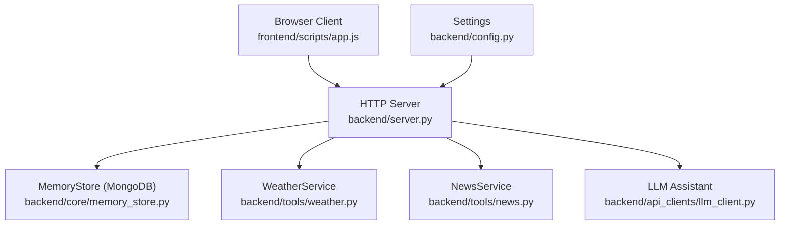
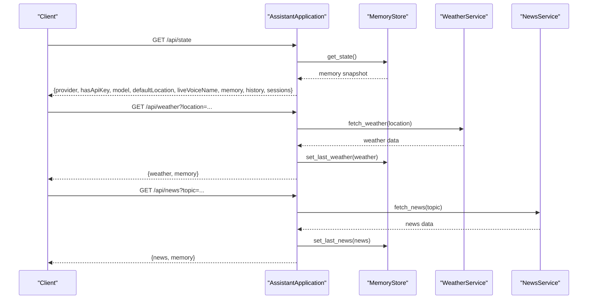
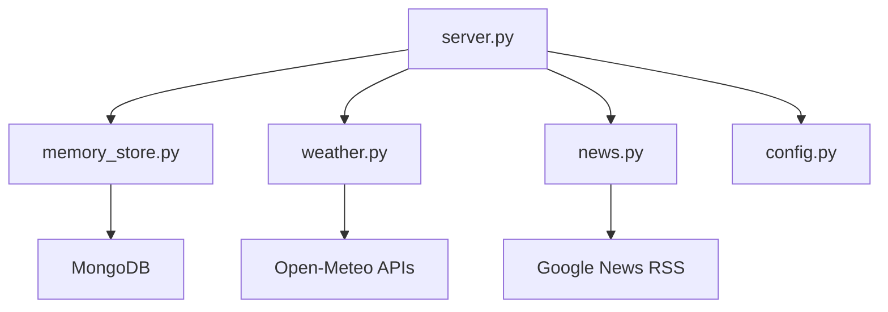

# API Reference

<cite>
**Referenced Files in This Document**
- [server.py](file://backend/server.py)
- [config.py](file://backend/config.py)
- [memory_store.py](file://backend/core/memory_store.py)
- [weather.py](file://backend/tools/weather.py)
- [news.py](file://backend/tools/news.py)
- [app.js](file://frontend/scripts/app.js)
- [index.html](file://frontend/index.html)
- [requirements.txt](file://requirements.txt)
</cite>

## Table of Contents
1. [Introduction](#introduction)
2. [Project Structure](#project-structure)
3. [Core Components](#core-components)
4. [Architecture Overview](#architecture-overview)
5. [Detailed Component Analysis](#detailed-component-analysis)
6. [Dependency Analysis](#dependency-analysis)
7. [Performance Considerations](#performance-considerations)
8. [Troubleshooting Guide](#troubleshooting-guide)
9. [Conclusion](#conclusion)
10. [Appendices](#appendices)

## Introduction
This document provides comprehensive API documentation for the Orbit Virtual Assistant REST API. It covers all HTTP endpoints, request/response schemas, authentication, error handling, and practical usage scenarios. It also includes guidance for client implementations, debugging, and performance optimization.

## Project Structure
The API is implemented as a single-threaded HTTP server with a small set of routes. The server delegates business logic to specialized services:
- Memory persistence and retrieval via MongoDB (session, message, profile, tasks, notes, cache)
- Weather and news retrieval via external APIs
- LLM orchestration via an assistant client

**Diagram sources**
- [server.py:23-63](file://backend/server.py#L23-L63)
- [memory_store.py:67-117](file://backend/core/memory_store.py#L67-L117)
- [weather.py:47-76](file://backend/tools/weather.py#L47-L76)
- [news.py:21-60](file://backend/tools/news.py#L21-L60)
- [config.py:20-76](file://backend/config.py#L20-L76)

**Section sources**
- [server.py:23-63](file://backend/server.py#L23-L63)
- [memory_store.py:67-117](file://backend/core/memory_store.py#L67-L117)
- [weather.py:47-76](file://backend/tools/weather.py#L47-L76)
- [news.py:21-60](file://backend/tools/news.py#L21-L60)
- [config.py:20-76](file://backend/config.py#L20-L76)

## Core Components
- AssistantApplication: Central orchestrator that wires routes, services, and stores.
- MemoryStore: MongoDB-backed persistence for sessions, messages, profile, tasks, notes, cache, and knowledge chunks.
- WeatherService: Fetches current weather and forecasts for a given location.
- NewsService: Retrieves top or topic-specific news headlines.
- Settings: Loads environment variables and exposes runtime configuration.

Key runtime behaviors:
- Authentication: Not enforced by the server; API keys are informational and used by the LLM client.
- Rate limiting: Not implemented in the server.
- Versioning: No explicit versioning scheme; endpoints are stable per repository state.

**Section sources**
- [server.py:23-63](file://backend/server.py#L23-L63)
- [memory_store.py:67-117](file://backend/core/memory_store.py#L67-L117)
- [weather.py:47-76](file://backend/tools/weather.py#L47-L76)
- [news.py:21-60](file://backend/tools/news.py#L21-L60)
- [config.py:20-76](file://backend/config.py#L20-L76)

## Architecture Overview
The server exposes REST endpoints grouped by functionality. Requests are parsed, validated, and routed to appropriate handlers. Responses are JSON payloads enriched with memory snapshots.

**Diagram sources**
- [server.py:106-167](file://backend/server.py#L106-L167)
- [memory_store.py:188-250](file://backend/core/memory_store.py#L188-L250)
- [weather.py:51-75](file://backend/tools/weather.py#L51-L75)
- [news.py:25-60](file://backend/tools/news.py#L25-L60)

## Detailed Component Analysis

### /api/state
- Method: GET
- URL: /api/state
- Purpose: Load runtime state including provider info, model, default location, voice name, memory snapshot, history, and sessions.
- Response fields:
  - provider: string
  - hasApiKey: boolean
  - model: string
  - defaultLocation: string
  - liveVoiceName: string
  - memory: object (profile, tasks, last_weather, last_news, activity, updated_at)
  - history: array
  - sessions: array
- Status codes: 200 OK

Usage scenario:
- Initialize UI and prefill profile fields.

**Section sources**
- [server.py:106-108](file://backend/server.py#L106-L108)
- [server.py:506-520](file://backend/server.py#L506-L520)
- [memory_store.py:188-250](file://backend/core/memory_store.py#L188-L250)

### /api/sessions
- Methods:
  - GET: List sessions with optional include_archived filter.
  - POST: Create a new session with a title.
- URL patterns:
  - GET: /api/sessions?include_archived=true|false
  - POST: /api/sessions
- Request body (POST): { title: string }
- Response body (GET): { sessions: array }
- Response body (POST): { ok: boolean, session: object }
- Status codes:
  - 200 OK
  - 400 Bad Request (invalid input)
  - 404 Not Found (unknown route)

Notes:
- Session schema (from MongoDB):
  - session_id: string
  - title: string
  - created_at: string
  - updated_at: string
  - pinned: boolean
  - archived: boolean

**Section sources**
- [server.py:110-116](file://backend/server.py#L110-L116)
- [server.py:182-186](file://backend/server.py#L182-L186)
- [memory_store.py:27-29](file://backend/core/memory_store.py#L27-L29)

### /api/sessions/{id}
- Methods:
  - GET: Retrieve a session by ID.
  - PUT: Update session fields (title, pinned, archived).
  - DELETE: Delete a session and associated attachments.
- URL pattern: /api/sessions/{id}
- Response body (GET): { session: object }
- Response body (PUT): { ok: boolean, session: object }
- Status codes:
  - 200 OK
  - 400 Bad Request (missing or invalid fields)
  - 404 Not Found (session not found)

Behavior:
- PUT supports partial updates for title, pinned, and archived.

**Section sources**
- [server.py:118-126](file://backend/server.py#L118-L126)
- [server.py:403-422](file://backend/server.py#L403-L422)
- [server.py:431-446](file://backend/server.py#L431-L446)

### /api/sessions/{id}/messages
- Methods:
  - GET: List messages for a session with optional limit.
  - POST: Add a message to a session.
- URL patterns:
  - GET: /api/sessions/{id}/messages?limit=N
  - POST: /api/sessions/{id}/messages
- Query parameters (GET):
  - limit: integer
- Request body (POST): { role: "user"|"assistant", text: string }
- Response body (GET): { messages: array }
- Response body (POST): { ok: boolean, message: object }
- Status codes:
  - 200 OK
  - 400 Bad Request (validation errors)
  - 404 Not Found

Message schema (from MongoDB):
- message_id: string
- session_id: string
- role: string
- text: string
- created_at: string

**Section sources**
- [server.py:128-135](file://backend/server.py#L128-L135)
- [server.py:189-202](file://backend/server.py#L189-L202)
- [memory_store.py:31-33](file://backend/core/memory_store.py#L31-L33)

### /api/sessions/{id}/attachments
- Methods:
  - GET: List attachments for a session.
  - POST: Upload a base64-encoded file; saved to disk and indexed for search.
- URL patterns:
  - GET: /api/sessions/{id}/attachments
  - POST: /api/sessions/{id}/attachments
- Request body (POST): { filename: string, data: string } (base64)
- Response body (GET): { attachments: array }
- Response body (POST): { ok: boolean, attachment: object }
- Status codes:
  - 200 OK
  - 400 Bad Request (validation or size/type errors)
  - 404 Not Found

Attachment schema (from MongoDB):
- attachment_id: string
- session_id: string
- filename: string
- file_type: string
- file_size: number
- storage_path: string
- created_at: string

Constraints:
- Allowed types: .pdf, .docx, .doc, .txt, .md, .csv, .json
- Max size: 20 MB

**Section sources**
- [server.py:137-143](file://backend/server.py#L137-L143)
- [server.py:204-209](file://backend/server.py#L204-L209)
- [server.py:329-393](file://backend/server.py#L329-L393)

### /api/chat
- Method: POST
- URL: /api/chat
- Purpose: Send a message to the assistant and receive a reply with tool events and memory snapshot.
- Request body:
  - message: string (required)
  - conversation: array (optional)
  - screenImage: string (optional)
  - mode: string (e.g., "simple", "copilot", "coach")
  - coachTopic: string (optional)
  - coachLevel: string (optional)
  - preferredLanguage: string (optional)
  - webSearchOnly: boolean (optional)
  - offlineMode: boolean (optional)
  - sessionId: string (optional)
  - imageGen: boolean (optional, triggers graceful refusal)
- Response body:
  - reply: string
  - toolEvents: array
  - memory: object
  - model: string
- Status codes:
  - 200 OK
  - 400 Bad Request (empty message)
  - 502 Bad Gateway (LLM client error)

Behavior:
- If imageGen is true, responds with a graceful refusal message.
- On success, the assistant’s reply is stored as a message in the active session.

**Section sources**
- [server.py:211-213](file://backend/server.py#L211-L213)
- [server.py:276-321](file://backend/server.py#L276-L321)
- [server.py:284-291](file://backend/server.py#L284-L291)

### /api/weather
- Method: GET
- URL: /api/weather?location=...
- Purpose: Retrieve current weather for a location and cache it in memory.
- Query parameters:
  - location: string (optional; defaults to configured default location)
- Response body:
  - weather: object (location, latitude, longitude, condition, temperature_c, feels_like_c, humidity_pct, wind_kph, precipitation_mm, high_c, low_c, rain_chance_pct, advice)
  - memory: object
- Status codes:
  - 200 OK
  - 400 Bad Request (service error propagated)

Errors:
- WeatherError raised when geocoding or forecast API fails.

**Section sources**
- [server.py:145-154](file://backend/server.py#L145-L154)
- [weather.py:51-75](file://backend/tools/weather.py#L51-L75)
- [weather.py:131-141](file://backend/tools/weather.py#L131-L141)

### /api/news
- Method: GET
- URL: /api/news?topic=...
- Purpose: Retrieve latest news headlines for a topic and cache it in memory.
- Query parameters:
  - topic: string (optional; defaults to "top headlines")
- Response body:
  - news: object (topic, items[], updated_at)
  - memory: object
- Status codes:
  - 200 OK
  - 400 Bad Request (service error propagated)

Errors:
- NewsError raised when RSS parsing or network fails.

**Section sources**
- [server.py:155-164](file://backend/server.py#L155-L164)
- [news.py:25-60](file://backend/tools/news.py#L25-L60)

### /api/tasks
- Methods:
  - POST: Add a task.
  - DELETE: Delete a task by ID.
  - POST: Complete a task by ID or partial title match.
- URL patterns:
  - POST: /api/tasks
  - DELETE: /api/tasks/{id}
  - POST: /api/tasks/complete
- Request body (POST /api/tasks): { title: string, priority: "low"|"medium"|"high", dueDate: string }
- Request body (POST /api/tasks/complete): { taskRef: string }
- Response body (POST /api/tasks): { ok: boolean, task: object, memory: object }
- Response body (DELETE /api/tasks/{id}): { ok: boolean, memory: object }
- Response body (POST /api/tasks/complete): { ok: boolean, task: object, memory: object }
- Status codes:
  - 200 OK
  - 400 Bad Request (validation errors)
  - 404 Not Found (task not found)

Task schema (from MongoDB):
- task_id: string
- title: string
- priority: string
- due_date: string
- status: string
- created_at: string
- completed_at: string

**Section sources**
- [server.py:222-233](file://backend/server.py#L222-L233)
- [server.py:234-241](file://backend/server.py#L234-L241)
- [server.py:488-498](file://backend/server.py#L488-L498)
- [memory_store.py:338-375](file://backend/core/memory_store.py#L338-L375)

### /api/notes
- Methods:
  - POST: Remember a note.
  - DELETE: Delete a note by ID.
- URL patterns:
  - POST: /api/notes
  - DELETE: /api/notes/{id}
- Request body (POST): { text: string, category: string }
- Response body (POST): { ok: boolean, note: object, memory: object }
- Response body (DELETE): { ok: boolean, memory: object }
- Status codes:
  - 200 OK
  - 400 Bad Request (validation errors)
  - 404 Not Found (note not found)

Note schema (from MongoDB):
- note_id: string
- category: string
- text: string
- created_at: string

**Section sources**
- [server.py:243-253](file://backend/server.py#L243-L253)
- [server.py:476-486](file://backend/server.py#L476-L486)
- [memory_store.py:309-332](file://backend/core/memory_store.py#L309-L332)
- [memory_store.py:448-469](file://backend/core/memory_store.py#L448-L469)

### /api/profile
- Method: POST
- URL: /api/profile
- Purpose: Update user profile (display name, location, routine).
- Request body: { displayName: string, location: string, routine: string }
- Response body: { ok: boolean, snapshot: object, memory: object }
- Status codes: 200 OK

Profile snapshot fields:
- profile: { display_name, location, routine, notes[] }

**Section sources**
- [server.py:214-221](file://backend/server.py#L214-L221)
- [memory_store.py:282-303](file://backend/core/memory_store.py#L282-L303)

### /api/history
- Method: POST
- URL: /api/history
- Purpose: Bulk update conversation history for a session.
- Request body: { history: array, sessionId?: string }
- Response body: { status: "success" }
- Status codes: 200 OK

**Section sources**
- [server.py:172-178](file://backend/server.py#L172-L178)

## Dependency Analysis
External dependencies relevant to API behavior:
- WeatherService depends on Open-Meteo geocoding and forecast APIs.
- NewsService depends on Google News RSS feeds.
- MemoryStore depends on MongoDB for persistence.
- LLM client depends on provider-specific endpoints and API keys.

**Diagram sources**
- [server.py:14-20](file://backend/server.py#L14-L20)
- [weather.py:77-126](file://backend/tools/weather.py#L77-L126)
- [news.py:62-82](file://backend/tools/news.py#L62-L82)
- [memory_store.py:86-117](file://backend/core/memory_store.py#L86-L117)
- [config.py:55-76](file://backend/config.py#L55-L76)

**Section sources**
- [requirements.txt:10-29](file://requirements.txt#L10-L29)
- [weather.py:77-126](file://backend/tools/weather.py#L77-L126)
- [news.py:62-82](file://backend/tools/news.py#L62-L82)
- [memory_store.py:86-117](file://backend/core/memory_store.py#L86-L117)
- [config.py:55-76](file://backend/config.py#L55-L76)

## Performance Considerations
- Network latency: Weather and news endpoints depend on external APIs; consider caching and retry strategies.
- Attachment uploads: Base64 decoding and disk writes can be heavy; enforce size limits and supported types.
- MongoDB queries: Indexes are created for common fields; ensure database availability and responsiveness.
- Concurrency: The server is single-threaded; avoid long-running synchronous operations.

[No sources needed since this section provides general guidance]

## Troubleshooting Guide
Common issues and resolutions:
- Empty message error: Ensure the message field is present and non-empty in /api/chat requests.
- Session not found: Verify session IDs and that sessions were created via POST /api/sessions.
- Task/Note not found: Confirm IDs exist in the database; tasks can also be matched by partial title.
- Weather/News service unavailable: External APIs may be down; retry or adjust parameters.
- LLM client errors: Provider-specific failures return 502; check API keys and provider configuration.

**Section sources**
- [server.py:278-280](file://backend/server.py#L278-L280)
- [server.py:122-125](file://backend/server.py#L122-L125)
- [server.py:239-240](file://backend/server.py#L239-L240)
- [server.py:309-310](file://backend/server.py#L309-L310)
- [weather.py:125-126](file://backend/tools/weather.py#L125-L126)
- [news.py:81-82](file://backend/tools/news.py#L81-L82)

## Conclusion
The Orbit Virtual Assistant API provides a cohesive set of endpoints for chat, session management, weather, news, tasks, notes, and profile updates. It relies on MongoDB for persistence and external services for weather and news. Clients should handle JSON responses, manage session IDs, and respect request constraints (e.g., attachment types and sizes).

[No sources needed since this section summarizes without analyzing specific files]

## Appendices

### Authentication and Security
- Authentication: Not enforced by the server.
- API keys: Used by the LLM client; presence is reflected in /api/state.

**Section sources**
- [server.py:511-514](file://backend/server.py#L511-L514)
- [config.py:48-52](file://backend/config.py#L48-L52)

### Client Implementation Guidelines
- Use Content-Type: application/json for POST/PUT requests.
- Manage session lifecycle: create sessions before sending messages; store messages after receiving replies.
- Respect attachment constraints: base64 encode files, include filename and allowed extension.
- Handle tool events: display tool events returned by /api/chat.

**Section sources**
- [app.js:966-978](file://frontend/scripts/app.js#L966-L978)
- [app.js:983-989](file://frontend/scripts/app.js#L983-L989)
- [app.js:1038-1045](file://frontend/scripts/app.js#L1038-L1045)
- [server.py:326-327](file://backend/server.py#L326-L327)

### Practical Usage Scenarios
- Start a new chat:
  - POST /api/sessions with title
  - POST /api/sessions/{id}/messages with role=user,text
  - POST /api/chat with message and sessionId
- Manage tasks:
  - POST /api/tasks to add
  - POST /api/tasks/complete to mark done
  - DELETE /api/tasks/{id} to remove
- Manage notes:
  - POST /api/notes to add
  - DELETE /api/notes/{id} to remove
- Get contextual data:
  - GET /api/weather?location=...
  - GET /api/news?topic=...

**Section sources**
- [app.js:1403-1432](file://frontend/scripts/app.js#L1403-L1432)
- [app.js:1434-1460](file://frontend/scripts/app.js#L1434-L1460)
- [app.js:1461-1480](file://frontend/scripts/app.js#L1461-L1480)
- [server.py:145-164](file://backend/server.py#L145-L164)