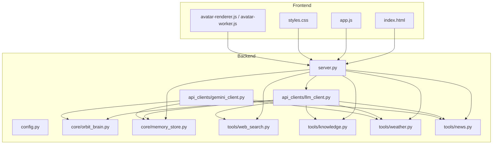
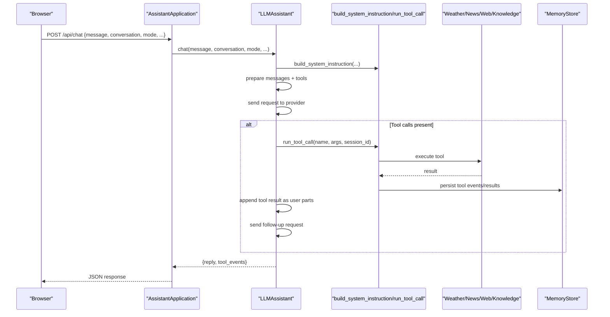
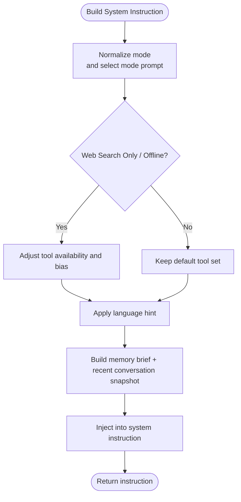
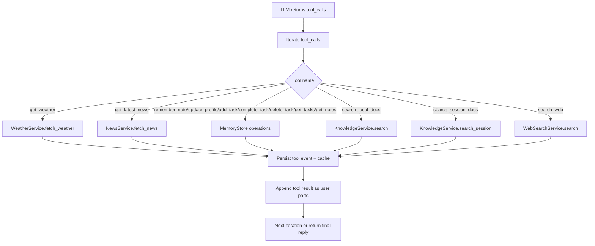
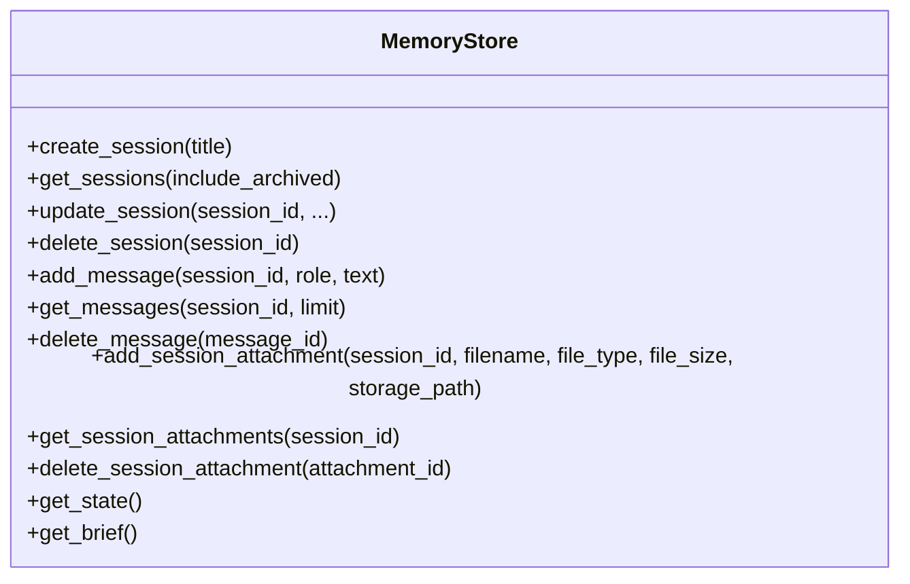
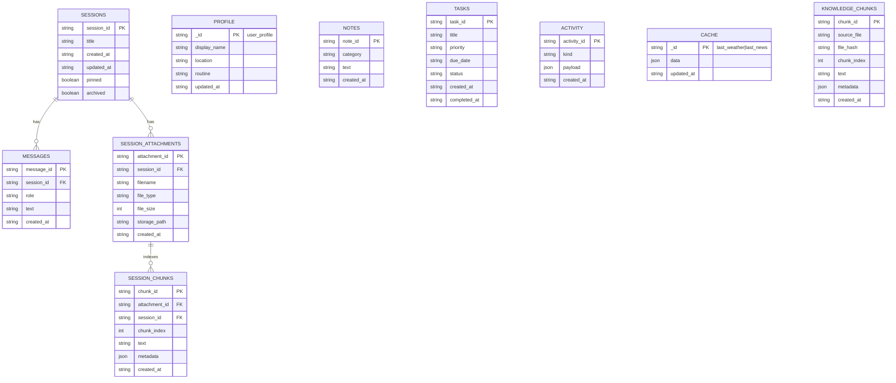
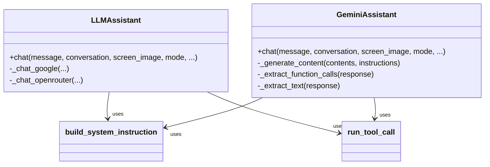
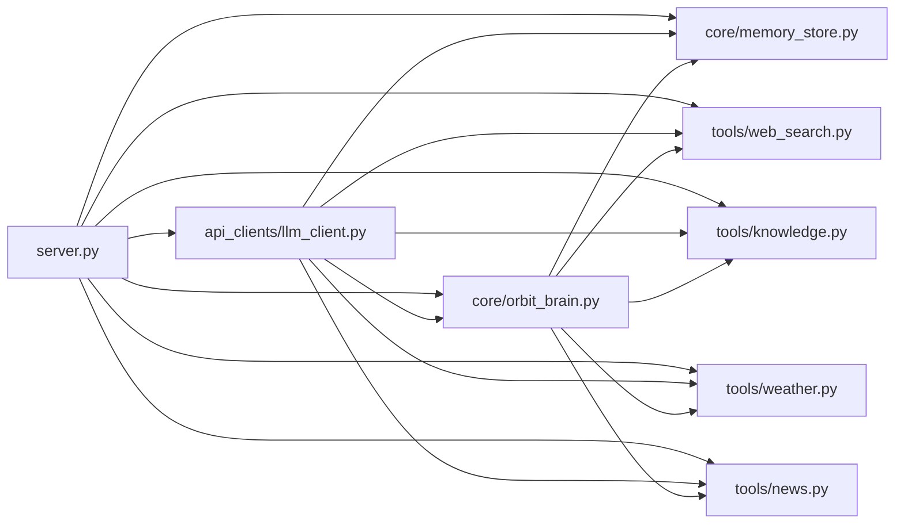

# AI Assistant Engine

<cite>
**Referenced Files in This Document**
- [README.md](file://README.md)
- [run.py](file://run.py)
- [backend/config.py](file://backend/config.py)
- [backend/server.py](file://backend/server.py)
- [backend/api_clients/llm_client.py](file://backend/api_clients/llm_client.py)
- [backend/api_clients/gemini_client.py](file://backend/api_clients/gemini_client.py)
- [backend/core/orbit_brain.py](file://backend/core/orbit_brain.py)
- [backend/core/memory_store.py](file://backend/core/memory_store.py)
- [backend/tools/web_search.py](file://backend/tools/web_search.py)
- [backend/tools/knowledge.py](file://backend/tools/knowledge.py)
- [backend/tools/weather.py](file://backend/tools/weather.py)
- [backend/tools/news.py](file://backend/tools/news.py)
</cite>

## Table of Contents
1. [Introduction](#introduction)
2. [Project Structure](#project-structure)
3. [Core Components](#core-components)
4. [Architecture Overview](#architecture-overview)
5. [Detailed Component Analysis](#detailed-component-analysis)
6. [Dependency Analysis](#dependency-analysis)
7. [Performance Considerations](#performance-considerations)
8. [Troubleshooting Guide](#troubleshooting-guide)
9. [Conclusion](#conclusion)
10. [Appendices](#appendices)

## Introduction
This document describes the AI assistant engine that powers the Orbit Virtual Assistant. It explains the reasoning engine architecture, conversation management, tool orchestration, system prompts, instruction-following mechanisms, and context preservation strategies. It also covers operational modes (simple, copilot, coach), session handling, memory integration, tool calling workflows, function execution patterns, result processing, examples of conversation flows, decision-making processes, error recovery, performance considerations, memory management, and extensibility for adding new capabilities.

## Project Structure
The assistant is organized into a backend server, provider-agnostic LLM clients, a reasoning brain module, a MongoDB-backed memory store, and tool integrations for web search, knowledge (RAG), weather, and news.

**Diagram sources**
- [backend/server.py:23-63](file://backend/server.py#L23-L63)
- [backend/api_clients/llm_client.py:38-46](file://backend/api_clients/llm_client.py#L38-L46)
- [backend/api_clients/gemini_client.py:36-42](file://backend/api_clients/gemini_client.py#L36-L42)
- [backend/core/orbit_brain.py:74-268](file://backend/core/orbit_brain.py#L74-L268)
- [backend/core/memory_store.py:67-117](file://backend/core/memory_store.py#L67-L117)
- [backend/tools/web_search.py:53-104](file://backend/tools/web_search.py#L53-L104)
- [backend/tools/knowledge.py:88-140](file://backend/tools/knowledge.py#L88-L140)
- [backend/tools/weather.py:48-75](file://backend/tools/weather.py#L48-L75)
- [backend/tools/news.py:22-60](file://backend/tools/news.py#L22-L60)

**Section sources**
- [README.md:164-201](file://README.md#L164-L201)
- [backend/server.py:23-63](file://backend/server.py#L23-L63)

## Core Components
- Configuration and settings loader: centralizes environment variables and provider/model selection.
- HTTP server and API endpoints: serves frontend, exposes session/message/tool endpoints, and orchestrates chat.
- LLM clients: provider-agnostic chat logic for Google, OpenRouter, LM Studio, and Ollama.
- Reasoning brain: constructs system prompts, declares tools, and dispatches tool calls.
- Memory store: MongoDB-backed persistence for sessions, messages, profile, tasks, notes, and caches.
- Tools: web search (Tavily + DuckDuckGo), knowledge base (RAG), weather, and news.

**Section sources**
- [backend/config.py:55-76](file://backend/config.py#L55-L76)
- [backend/server.py:23-63](file://backend/server.py#L23-L63)
- [backend/api_clients/llm_client.py:38-46](file://backend/api_clients/llm_client.py#L38-L46)
- [backend/core/orbit_brain.py:74-268](file://backend/core/orbit_brain.py#L74-L268)
- [backend/core/memory_store.py:67-117](file://backend/core/memory_store.py#L67-L117)
- [backend/tools/web_search.py:53-104](file://backend/tools/web_search.py#L53-L104)
- [backend/tools/knowledge.py:88-140](file://backend/tools/knowledge.py#L88-L140)
- [backend/tools/weather.py:48-75](file://backend/tools/weather.py#L48-L75)
- [backend/tools/news.py:22-60](file://backend/tools/news.py#L22-L60)

## Architecture Overview
The assistant runs a threaded HTTP server that exposes REST endpoints. The chat flow delegates to an LLM client based on the selected provider. The client builds a system instruction and message history, invokes the LLM with function-declared tools, executes tool calls via the brain dispatcher, persists tool events and results in memory, and returns a final reply with tool events.

**Diagram sources**
- [backend/server.py:276-321](file://backend/server.py#L276-L321)
- [backend/api_clients/llm_client.py:47-78](file://backend/api_clients/llm_client.py#L47-L78)
- [backend/core/orbit_brain.py:302-356](file://backend/core/orbit_brain.py#L302-L356)
- [backend/core/orbit_brain.py:389-501](file://backend/core/orbit_brain.py#L389-L501)
- [backend/core/memory_store.py:188-250](file://backend/core/memory_store.py#L188-L250)

## Detailed Component Analysis

### System Prompts and Instruction Following
- Base system prompt defines the assistant persona and rules.
- Mode-specific prompts tailor behavior for simple, copilot, and coach modes.
- Search-mode annotations adjust tool availability and bias when toggled (web search only, offline).
- Language hints influence response language preferences.
- Recent conversation and memory brief snapshots are injected to preserve context.

**Diagram sources**
- [backend/core/orbit_brain.py:302-356](file://backend/core/orbit_brain.py#L302-L356)

**Section sources**
- [backend/core/orbit_brain.py:14-32](file://backend/core/orbit_brain.py#L14-L32)
- [backend/core/orbit_brain.py:35-56](file://backend/core/orbit_brain.py#L35-L56)
- [backend/core/orbit_brain.py:302-356](file://backend/core/orbit_brain.py#L302-L356)

### Operational Modes and Context Preservation
- Simple mode: concise answers, minimal memory usage.
- Copilot mode: proactive planning, screen-aware suggestions, deeper memory.
- Coach mode: expert tutoring with RAG-driven quizzes and roadmaps.
- Context preservation: recent conversation snapshot and memory brief injected into the system instruction; session-scoped document search enabled when attachments exist.

**Section sources**
- [backend/core/orbit_brain.py:35-56](file://backend/core/orbit_brain.py#L35-L56)
- [backend/core/orbit_brain.py:283-299](file://backend/core/orbit_brain.py#L283-L299)
- [backend/core/orbit_brain.py:302-356](file://backend/core/orbit_brain.py#L302-L356)

### Tool Orchestration and Execution Patterns
- Function declarations define available tools: weather, news, memory, tasks, notes, web search, local knowledge, and session docs.
- Tool availability is dynamically adjusted by mode and provider:
  - Web search only: both web and local tools available; system prompt biases toward web.
  - Offline: web tool stripped; only local tools usable.
  - Session docs: enabled when session has attachments.
- Tool dispatcher executes tools and records events; results are appended to the conversation to guide the LLM’s final answer.

**Diagram sources**
- [backend/core/orbit_brain.py:389-501](file://backend/core/orbit_brain.py#L389-L501)
- [backend/api_clients/llm_client.py:185-214](file://backend/api_clients/llm_client.py#L185-L214)
- [backend/core/memory_store.py:475-495](file://backend/core/memory_store.py#L475-L495)

**Section sources**
- [backend/core/orbit_brain.py:74-268](file://backend/core/orbit_brain.py#L74-L268)
- [backend/core/orbit_brain.py:361-386](file://backend/core/orbit_brain.py#L361-L386)
- [backend/core/orbit_brain.py:389-501](file://backend/core/orbit_brain.py#L389-L501)
- [backend/api_clients/llm_client.py:185-214](file://backend/api_clients/llm_client.py#L185-L214)

### Conversation Management and Sessions
- Sessions: creation, listing, updates (title/pinned/archived), and deletion with cascading cleanup of messages, attachments, and session chunks.
- Messages: per-session CRUD with ordering by creation time.
- History: legacy compatibility for bulk history updates; new endpoints prefer per-session message management.
- Attachments: upload base64 files, parse and index for session-scoped search, and track metadata.

**Diagram sources**
- [backend/core/memory_store.py:579-646](file://backend/core/memory_store.py#L579-L646)
- [backend/core/memory_store.py:652-690](file://backend/core/memory_store.py#L652-L690)
- [backend/core/memory_store.py:754-796](file://backend/core/memory_store.py#L754-L796)

**Section sources**
- [backend/server.py:106-167](file://backend/server.py#L106-L167)
- [backend/server.py:182-266](file://backend/server.py#L182-L266)
- [backend/server.py:329-394](file://backend/server.py#L329-L394)
- [backend/core/memory_store.py:579-646](file://backend/core/memory_store.py#L579-L646)
- [backend/core/memory_store.py:652-690](file://backend/core/memory_store.py#L652-L690)
- [backend/core/memory_store.py:754-796](file://backend/core/memory_store.py#L754-L796)

### Memory Integration and Persistence
- MongoDB collections: sessions, messages, profile, notes, tasks, activity, cache, knowledge_chunks, session_attachments, session_chunks.
- Indexes ensure efficient queries for sessions, messages, and retrievers.
- Activity records track user actions for auditability.
- Caches store last weather and news for quick retrieval.

**Diagram sources**
- [backend/core/memory_store.py:23-62](file://backend/core/memory_store.py#L23-L62)
- [backend/core/memory_store.py:119-135](file://backend/core/memory_store.py#L119-L135)

**Section sources**
- [backend/core/memory_store.py:188-250](file://backend/core/memory_store.py#L188-L250)
- [backend/core/memory_store.py:475-495](file://backend/core/memory_store.py#L475-L495)
- [backend/core/memory_store.py:695-748](file://backend/core/memory_store.py#L695-L748)

### Tool Integrations
- Web search: Tavily primary, DuckDuckGo fallback; spinner timer for UX; graceful error handling.
- Knowledge base (RAG): document parsing, chunking, BM25 + optional FAISS hybrid retriever; persistent indexing in MongoDB; session-scoped retriever caching.
- Weather: Open-Meteo geocoding and forecast; advice generation; cache persisted in memory.
- News: Google News RSS feed parsing; clamped item counts; UTC timestamps.

**Section sources**
- [backend/tools/web_search.py:53-104](file://backend/tools/web_search.py#L53-L104)
- [backend/tools/knowledge.py:88-140](file://backend/tools/knowledge.py#L88-L140)
- [backend/tools/knowledge.py:270-298](file://backend/tools/knowledge.py#L270-L298)
- [backend/tools/knowledge.py:337-355](file://backend/tools/knowledge.py#L337-L355)
- [backend/tools/weather.py:48-75](file://backend/tools/weather.py#L48-L75)
- [backend/tools/news.py:22-60](file://backend/tools/news.py#L22-L60)

### LLM Clients and Provider Abstraction
- LLMAssistant: provider-agnostic chat with two paths:
  - Google REST API: constructs contents, extracts function calls, executes tools, and returns replies.
  - OpenRouter/LM Studio/Ollama: constructs messages with tools, handles tool calls, and returns replies.
- GeminiAssistant: legacy client for Google Gemini with similar orchestration.

**Diagram sources**
- [backend/api_clients/llm_client.py:38-78](file://backend/api_clients/llm_client.py#L38-L78)
- [backend/api_clients/llm_client.py:220-272](file://backend/api_clients/llm_client.py#L220-L272)
- [backend/api_clients/llm_client.py:82-175](file://backend/api_clients/llm_client.py#L82-L175)
- [backend/api_clients/gemini_client.py:36-94](file://backend/api_clients/gemini_client.py#L36-L94)

**Section sources**
- [backend/api_clients/llm_client.py:47-78](file://backend/api_clients/llm_client.py#L47-L78)
- [backend/api_clients/llm_client.py:82-175](file://backend/api_clients/llm_client.py#L82-L175)
- [backend/api_clients/llm_client.py:220-272](file://backend/api_clients/llm_client.py#L220-L272)
- [backend/api_clients/gemini_client.py:43-94](file://backend/api_clients/gemini_client.py#L43-L94)

### HTTP Server and API Endpoints
- Static file serving for frontend assets.
- Session endpoints: create, list, get, update, delete; messages CRUD; attachments CRUD.
- Weather and news endpoints: fetch and cache results; update memory state.
- Chat endpoint: validates inputs, delegates to LLMAssistant, and returns reply plus tool events and memory snapshot.

**Section sources**
- [backend/server.py:85-167](file://backend/server.py#L85-L167)
- [backend/server.py:169-266](file://backend/server.py#L169-L266)
- [backend/server.py:276-321](file://backend/server.py#L276-L321)
- [backend/server.py:329-394](file://backend/server.py#L329-L394)

## Dependency Analysis
- Coupling: server depends on LLM client, memory store, and tools; LLM client depends on brain and tools; brain depends on memory store and tools.
- Cohesion: each module encapsulates a single concern (configuration, server, brain, memory, tools).
- External dependencies: MongoDB, provider APIs, LangChain ecosystem for RAG, web search providers.

**Diagram sources**
- [backend/server.py:23-63](file://backend/server.py#L23-L63)
- [backend/api_clients/llm_client.py:38-46](file://backend/api_clients/llm_client.py#L38-L46)
- [backend/core/orbit_brain.py:9-20](file://backend/core/orbit_brain.py#L9-L20)

**Section sources**
- [backend/server.py:23-63](file://backend/server.py#L23-L63)
- [backend/api_clients/llm_client.py:38-46](file://backend/api_clients/llm_client.py#L38-L46)
- [backend/core/orbit_brain.py:9-20](file://backend/core/orbit_brain.py#L9-L20)

## Performance Considerations
- Tool loop limits: enforced to prevent runaway tool calls.
- Provider timeouts: HTTP requests to providers use timeouts to avoid hanging.
- RAG indexing: chunk size and overlap tuned for balance; hybrid retriever optional to reduce latency when embeddings are unavailable.
- Session retriever caching: invalidated on attachment changes to avoid stale results.
- MongoDB indexes: ensure efficient queries on sessions, messages, and retrievers.
- Attachment upload limits: size and type checks prevent oversized or unsupported files.

[No sources needed since this section provides general guidance]

## Troubleshooting Guide
- API key missing: provider-specific exceptions raised when API key is absent.
- Provider errors: HTTP errors and URLError mapped to LLMClientError with details.
- Tool errors: WeatherError, NewsError, and ValueError propagated with clear messages.
- Unsupported features: Graceful refusal messages returned for unsupported endpoints.
- Connection failures: MongoDB connection failure raises runtime error with guidance.

**Section sources**
- [backend/api_clients/llm_client.py:60-61](file://backend/api_clients/llm_client.py#L60-L61)
- [backend/api_clients/llm_client.py:161-174](file://backend/api_clients/llm_client.py#L161-L174)
- [backend/api_clients/llm_client.py](file://backend/api_clients/llm_client.py#L215)
- [backend/tools/weather.py](file://backend/tools/weather.py#L54)
- [backend/tools/news.py](file://backend/tools/news.py#L34)
- [backend/server.py:271-274](file://backend/server.py#L271-L274)
- [backend/core/memory_store.py:94-98](file://backend/core/memory_store.py#L94-L98)

## Conclusion
The Orbit Virtual Assistant engine integrates a flexible provider-agnostic LLM client, a robust reasoning brain with precise system prompts and tool orchestration, and a MongoDB-backed memory store with multi-session support. It balances performance and safety with explicit anti-hallucination rules, controlled tool usage, and graceful fallbacks. Extensibility is straightforward: add new tools, adjust prompts, and integrate new providers through the existing client abstraction.

[No sources needed since this section summarizes without analyzing specific files]

## Appendices

### Example Conversation Flows
- Simple mode: concise answer to a single query; minimal tool usage.
- Copilot mode: proactive suggestion with plan; uses memory and tasks.
- Coach mode: RAG-powered quiz with local knowledge; enforces tool usage for facts.
- Web search only: prefers web search; still allows local knowledge when relevant.
- Offline mode: strips web tool; relies on local knowledge and memory.

[No sources needed since this section provides conceptual examples]

### Extensibility Guidelines
- Adding a new tool:
  - Define function declaration in brain tool list.
  - Implement tool execution in brain dispatcher.
  - Persist tool events and results in memory store.
  - Expose tool via API if needed.
- Adding a new provider:
  - Extend LLM client with provider-specific request/response handling.
  - Adjust tool availability and system instruction injection.
- Enhancing RAG:
  - Integrate new document loaders and chunkers.
  - Tune retriever configuration and hybrid strategies.

[No sources needed since this section provides general guidance]