# Conversation Management and State Tracking

<cite>
**Referenced Files in This Document**
- [README.md](file://README.md)
- [run.py](file://run.py)
- [backend/server.py](file://backend/server.py)
- [backend/config.py](file://backend/config.py)
- [backend/api_clients/llm_client.py](file://backend/api_clients/llm_client.py)
- [backend/core/orbit_brain.py](file://backend/core/orbit_brain.py)
- [backend/core/memory_store.py](file://backend/core/memory_store.py)
- [backend/tools/web_search.py](file://backend/tools/web_search.py)
- [backend/tools/knowledge.py](file://backend/tools/knowledge.py)
</cite>

## Table of Contents
1. [Introduction](#introduction)
2. [Project Structure](#project-structure)
3. [Core Components](#core-components)
4. [Architecture Overview](#architecture-overview)
5. [Detailed Component Analysis](#detailed-component-analysis)
6. [Dependency Analysis](#dependency-analysis)
7. [Performance Considerations](#performance-considerations)
8. [Troubleshooting Guide](#troubleshooting-guide)
9. [Conclusion](#conclusion)

## Introduction
This document explains the conversation management and state tracking mechanisms in the Orbit Virtual Assistant. It focuses on:
- Conversation snapshot system and message history handling
- Context preservation strategies across modes and sessions
- Session state management and memory integration
- Conversation flow control, normalization of user inputs, and mode switching logic
- Context window management and multi-turn interaction handling
- Integration with memory storage, tool execution context, and response generation workflows

The system is designed around a MongoDB-backed memory store, a flexible LLM client supporting multiple providers, and a brain module that builds system instructions and dispatches tools.

## Project Structure
The assistant is organized into backend services, a server exposing REST endpoints, and a brain that orchestrates conversation and tool execution. The frontend communicates with the backend via HTTP endpoints.

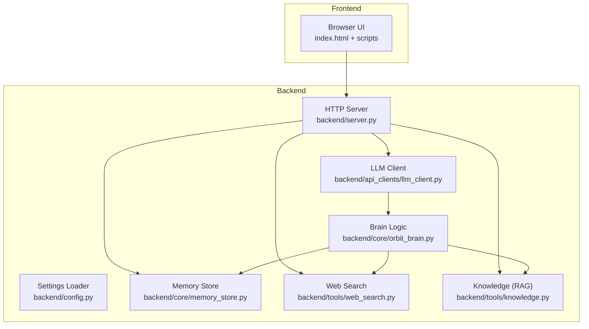

**Diagram sources**
- [backend/server.py:23-611](file://backend/server.py#L23-L611)
- [backend/api_clients/llm_client.py:38-366](file://backend/api_clients/llm_client.py#L38-L366)
- [backend/core/orbit_brain.py:14-502](file://backend/core/orbit_brain.py#L14-L502)
- [backend/core/memory_store.py:67-947](file://backend/core/memory_store.py#L67-L947)
- [backend/tools/web_search.py:53-139](file://backend/tools/web_search.py#L53-L139)
- [backend/tools/knowledge.py:88-393](file://backend/tools/knowledge.py#L88-L393)

**Section sources**
- [README.md:164-201](file://README.md#L164-L201)
- [backend/server.py:23-611](file://backend/server.py#L23-L611)

## Core Components
- MemoryStore: MongoDB-backed persistence for sessions, messages, profile, notes, tasks, activity, cached weather/news, knowledge chunks, and session attachments/chunks.
- LLMAssistant: Orchestrates conversation with provider-specific handlers, manages tool loops, and constructs system instructions.
- OrbitBrain: Builds system instructions, tool declarations, and dispatches tool calls; includes conversation snapshot logic and mode normalization.
- KnowledgeService: Manages persistent knowledge base indexing and session-scoped document search.
- WebSearchService: Provides web search with Tavily and DuckDuckGo fallbacks.

**Section sources**
- [backend/core/memory_store.py:67-947](file://backend/core/memory_store.py#L67-L947)
- [backend/api_clients/llm_client.py:38-366](file://backend/api_clients/llm_client.py#L38-L366)
- [backend/core/orbit_brain.py:14-502](file://backend/core/orbit_brain.py#L14-L502)
- [backend/tools/knowledge.py:88-393](file://backend/tools/knowledge.py#L88-L393)
- [backend/tools/web_search.py:53-139](file://backend/tools/web_search.py#L53-L139)

## Architecture Overview
The conversation lifecycle integrates HTTP endpoints, memory persistence, and provider-specific LLM calls with tool execution.

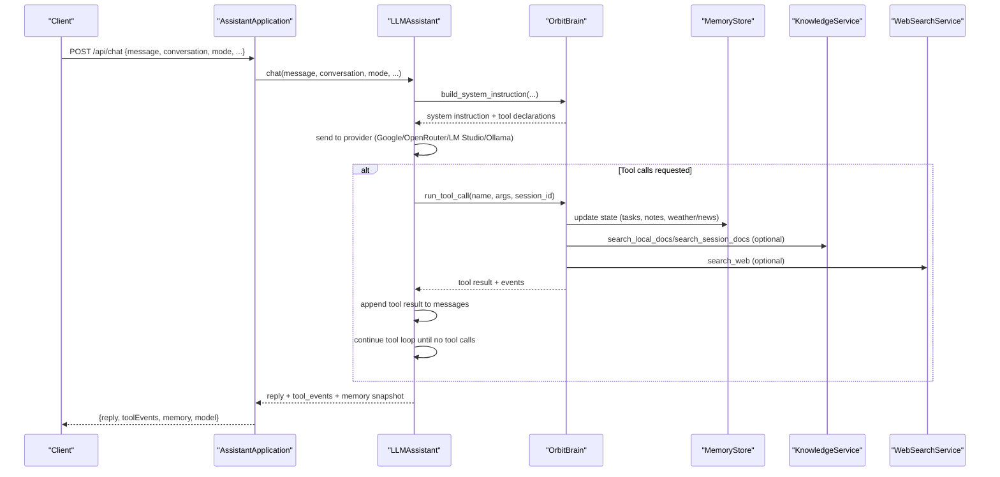

**Diagram sources**
- [backend/server.py:276-321](file://backend/server.py#L276-L321)
- [backend/api_clients/llm_client.py:47-216](file://backend/api_clients/llm_client.py#L47-L216)
- [backend/core/orbit_brain.py:302-502](file://backend/core/orbit_brain.py#L302-L502)
- [backend/core/memory_store.py:188-277](file://backend/core/memory_store.py#L188-L277)
- [backend/tools/knowledge.py:270-355](file://backend/tools/knowledge.py#L270-L355)
- [backend/tools/web_search.py:69-104](file://backend/tools/web_search.py#L69-L104)

## Detailed Component Analysis

### Conversation Snapshot System
- Purpose: Provide a compact, recent-context snapshot to the LLM to reduce context pollution and improve focus.
- Implementation:
  - Recent conversation is limited to a fixed window and normalized (whitespace trimmed, length-limited).
  - The snapshot is embedded into the system instruction alongside memory briefs.
- Key functions:
  - Snapshot builder: [_build_conversation_snapshot:283-299](file://backend/core/orbit_brain.py#L283-L299)
  - System instruction builder: [build_system_instruction:302-356](file://backend/core/orbit_brain.py#L302-L356)

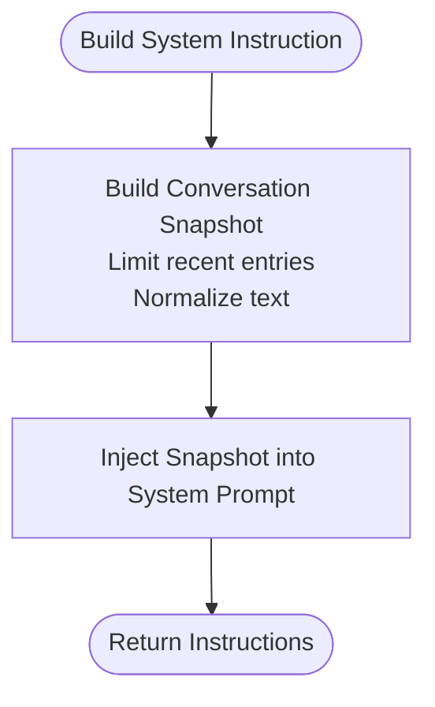

**Diagram sources**
- [backend/core/orbit_brain.py:283-356](file://backend/core/orbit_brain.py#L283-L356)

**Section sources**
- [backend/core/orbit_brain.py:283-356](file://backend/core/orbit_brain.py#L283-L356)

### Message History Handling and Context Preservation
- Persistence:
  - Sessions and messages are stored in MongoDB collections with indexes for efficient queries.
  - Per-session message CRUD operations are exposed via REST endpoints.
- Retrieval:
  - Messages are sorted chronologically and can be limited for context windows.
  - Sessions support pinning, archiving, and listing with ordering.
- Context window management:
  - LLM clients limit recent conversation frames appended to the current request.
  - Google API uses a content parts structure; OpenRouter-compatible API uses a messages array with recent entries.

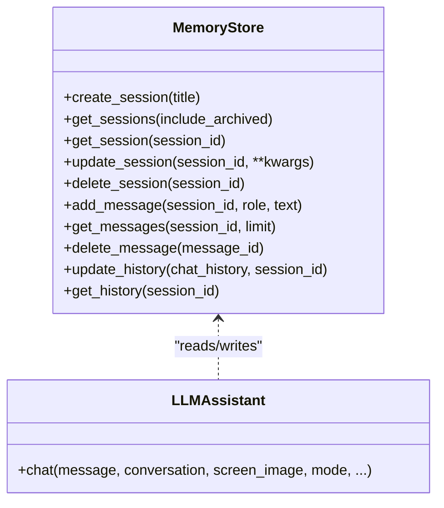

**Diagram sources**
- [backend/core/memory_store.py:579-690](file://backend/core/memory_store.py#L579-L690)
- [backend/api_clients/llm_client.py:47-78](file://backend/api_clients/llm_client.py#L47-L78)

**Section sources**
- [backend/core/memory_store.py:501-574](file://backend/core/memory_store.py#L501-L574)
- [backend/core/memory_store.py:579-690](file://backend/core/memory_store.py#L579-L690)
- [backend/api_clients/llm_client.py:82-127](file://backend/api_clients/llm_client.py#L82-L127)
- [backend/api_clients/llm_client.py:220-272](file://backend/api_clients/llm_client.py#L220-L272)

### Session State Management and Multi-Session UI
- Sessions are first-class entities with creation, listing, updates (title, pinned, archived), and deletion.
- Deletion cascades to messages, attachments, and session chunks.
- Attachments are tracked separately and can be searched via session-scoped tools.

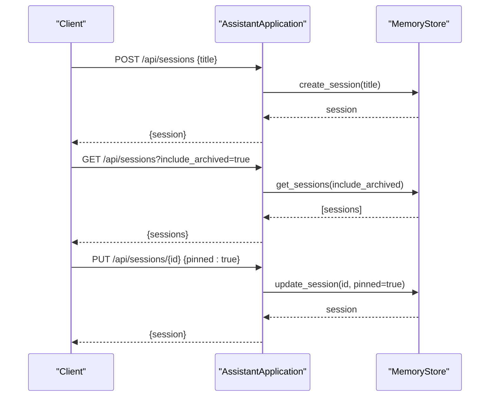

**Diagram sources**
- [backend/server.py:183-202](file://backend/server.py#L183-L202)
- [backend/server.py:111-127](file://backend/server.py#L111-L127)
- [backend/server.py:403-422](file://backend/server.py#L403-L422)
- [backend/core/memory_store.py:579-646](file://backend/core/memory_store.py#L579-L646)

**Section sources**
- [backend/server.py:111-127](file://backend/server.py#L111-L127)
- [backend/server.py:183-202](file://backend/server.py#L183-L202)
- [backend/server.py:403-422](file://backend/server.py#L403-L422)
- [backend/core/memory_store.py:579-646](file://backend/core/memory_store.py#L579-L646)

### Memory Integration and Context Building
- Memory brief:
  - A concise snapshot includes profile, recent notes, open/completed tasks, and recent weather/news.
  - Built from the full memory state and injected into system instructions.
- Tool execution updates memory:
  - Weather and news results are cached.
  - Tasks and notes are persisted and reflected in subsequent snapshots.
- Language hints:
  - Preferred language is injected into system instructions to guide replies.

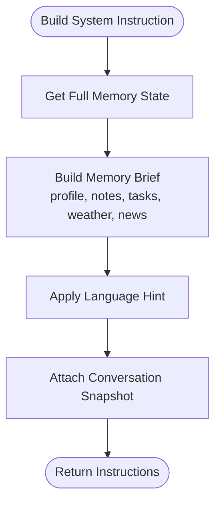

**Diagram sources**
- [backend/core/orbit_brain.py:302-356](file://backend/core/orbit_brain.py#L302-L356)
- [backend/core/memory_store.py:188-277](file://backend/core/memory_store.py#L188-L277)

**Section sources**
- [backend/core/orbit_brain.py:302-356](file://backend/core/orbit_brain.py#L302-L356)
- [backend/core/memory_store.py:188-277](file://backend/core/memory_store.py#L188-L277)

### Normalization of User Inputs and Mode Switching
- Mode normalization:
  - Accepts simple, copilot, coach; defaults to simple.
- Conversation normalization:
  - Trims whitespace and limits recent entries to reduce noise.
- Language hints:
  - Injects language preference into system instructions.

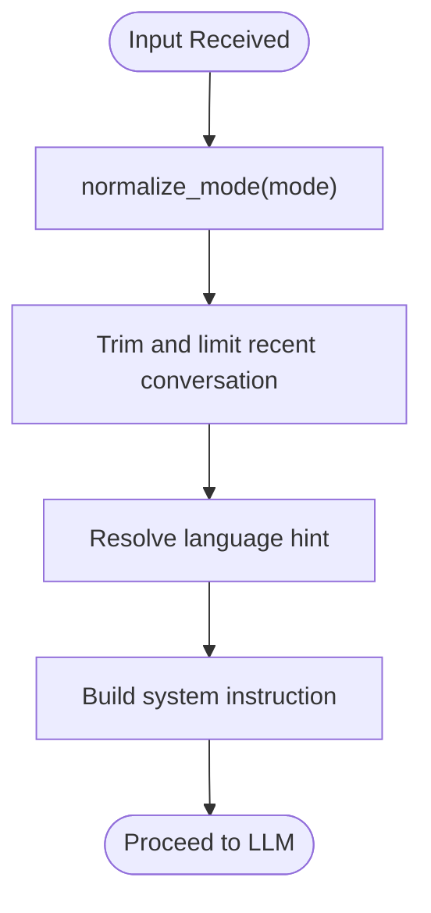

**Diagram sources**
- [backend/core/orbit_brain.py:277-356](file://backend/core/orbit_brain.py#L277-L356)

**Section sources**
- [backend/core/orbit_brain.py:277-356](file://backend/core/orbit_brain.py#L277-L356)

### Conversation Flow Control and Tool Execution Context
- Tool loop:
  - LLM may request multiple tool calls; the assistant executes them and appends results until no tool calls remain.
  - Google API uses functionCall parts; OpenRouter-compatible API uses tool_calls array.
- Tool selection:
  - Tools are conditionally enabled based on mode (web search only/offline), knowledge availability, and session attachments.
- Event tracking:
  - Tool events are collected and returned to the client for UI feedback.

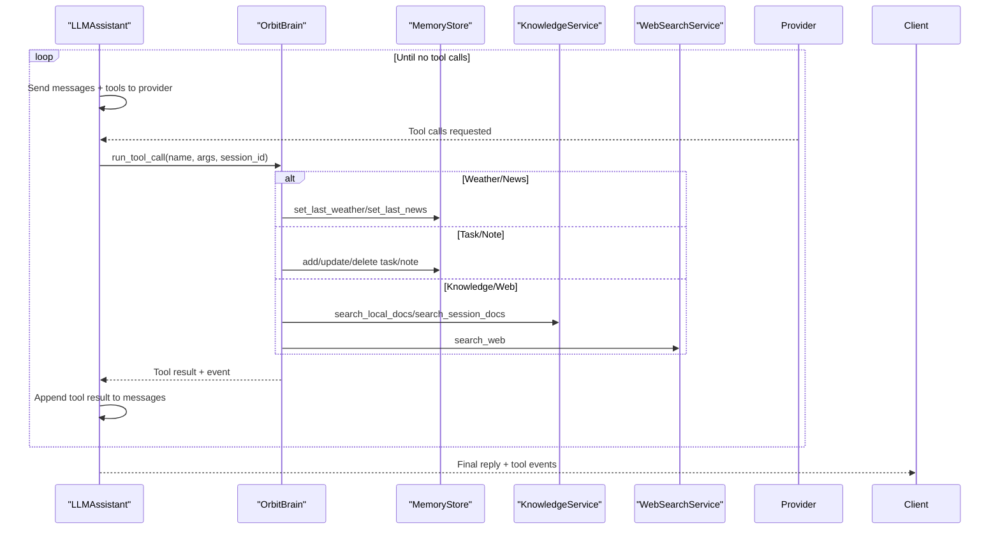

**Diagram sources**
- [backend/api_clients/llm_client.py:128-215](file://backend/api_clients/llm_client.py#L128-L215)
- [backend/api_clients/llm_client.py:238-272](file://backend/api_clients/llm_client.py#L238-L272)
- [backend/core/orbit_brain.py:389-502](file://backend/core/orbit_brain.py#L389-L502)
- [backend/core/memory_store.py:475-496](file://backend/core/memory_store.py#L475-L496)

**Section sources**
- [backend/api_clients/llm_client.py:128-215](file://backend/api_clients/llm_client.py#L128-L215)
- [backend/api_clients/llm_client.py:238-272](file://backend/api_clients/llm_client.py#L238-L272)
- [backend/core/orbit_brain.py:389-502](file://backend/core/orbit_brain.py#L389-L502)

### Context Window Management and Multi-Turn Interaction
- LLM-specific context windows:
  - Google API: recent conversation frames appended to contents.
  - OpenRouter-compatible: recent conversation frames appended to messages.
- Conversation snapshot:
  - Fixed-size recent history snapshot embedded in system instructions.
- Multi-turn orchestration:
  - Tool loop continues until the LLM produces a final text response without tool calls.

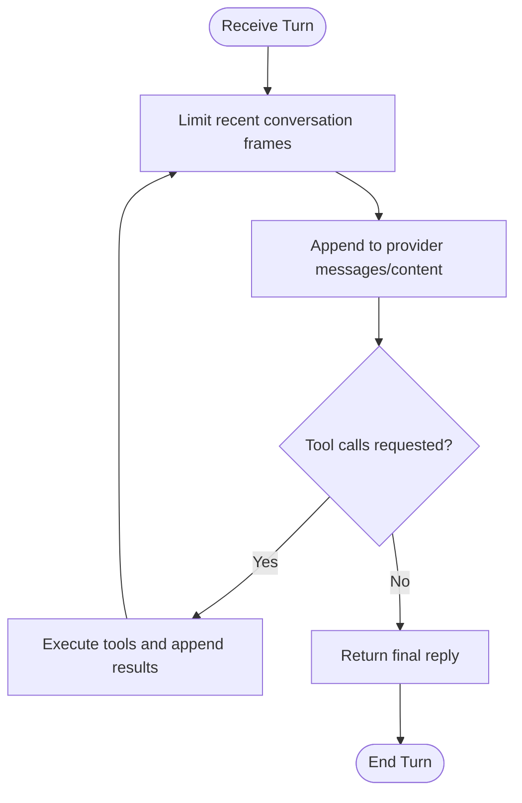

**Diagram sources**
- [backend/api_clients/llm_client.py:89-127](file://backend/api_clients/llm_client.py#L89-L127)
- [backend/api_clients/llm_client.py:234-272](file://backend/api_clients/llm_client.py#L234-L272)
- [backend/core/orbit_brain.py:283-299](file://backend/core/orbit_brain.py#L283-L299)

**Section sources**
- [backend/api_clients/llm_client.py:89-127](file://backend/api_clients/llm_client.py#L89-L127)
- [backend/api_clients/llm_client.py:234-272](file://backend/api_clients/llm_client.py#L234-L272)
- [backend/core/orbit_brain.py:283-299](file://backend/core/orbit_brain.py#L283-L299)

### Integration with Memory Storage, Tool Execution, and Response Generation
- MemoryStore:
  - Thread-safe operations with locks; maintains indexes and ensures profile document exists.
  - Provides get_state/get_brief for system instructions and snapshot injection.
- Tool execution:
  - run_tool_call routes to weather, news, memory, tasks, notes, and knowledge search.
  - Updates memory and emits activity records.
- Response generation:
  - LLM clients extract final text from provider responses and return AssistantResult.

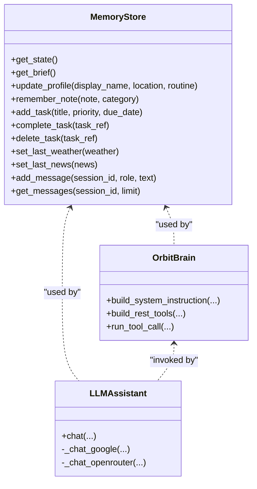

**Diagram sources**
- [backend/core/memory_store.py:188-277](file://backend/core/memory_store.py#L188-L277)
- [backend/api_clients/llm_client.py:38-78](file://backend/api_clients/llm_client.py#L38-L78)
- [backend/core/orbit_brain.py:302-502](file://backend/core/orbit_brain.py#L302-L502)

**Section sources**
- [backend/core/memory_store.py:188-277](file://backend/core/memory_store.py#L188-L277)
- [backend/core/orbit_brain.py:302-502](file://backend/core/orbit_brain.py#L302-L502)
- [backend/api_clients/llm_client.py:38-78](file://backend/api_clients/llm_client.py#L38-L78)

## Dependency Analysis
- Provider selection:
  - Active provider influences endpoint routing and tool availability.
- Tool availability:
  - Conditional enabling of search_web, search_local_docs, and search_session_docs based on mode and session attachments.
- External services:
  - WebSearchService provides web search; KnowledgeService provides local RAG and session-scoped search.

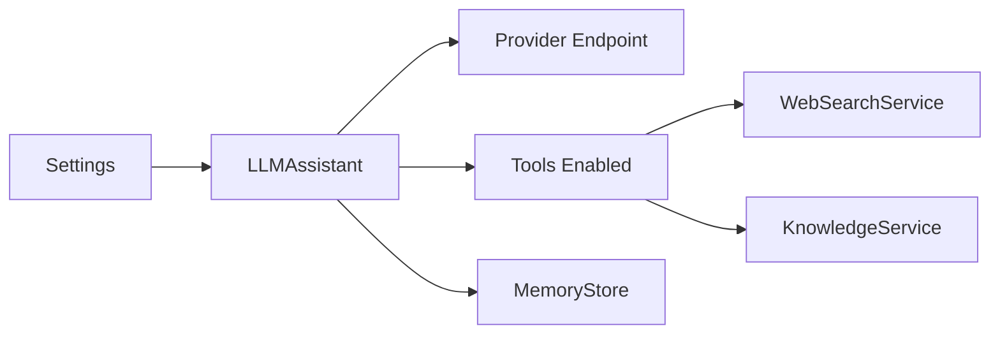

**Diagram sources**
- [backend/config.py:20-76](file://backend/config.py#L20-L76)
- [backend/api_clients/llm_client.py:74-77](file://backend/api_clients/llm_client.py#L74-L77)
- [backend/core/orbit_brain.py:361-386](file://backend/core/orbit_brain.py#L361-L386)
- [backend/tools/web_search.py:53-139](file://backend/tools/web_search.py#L53-L139)
- [backend/tools/knowledge.py:88-393](file://backend/tools/knowledge.py#L88-L393)

**Section sources**
- [backend/config.py:20-76](file://backend/config.py#L20-L76)
- [backend/api_clients/llm_client.py:74-77](file://backend/api_clients/llm_client.py#L74-L77)
- [backend/core/orbit_brain.py:361-386](file://backend/core/orbit_brain.py#L361-L386)

## Performance Considerations
- Context window sizing:
  - Limit recent conversation frames and snapshots to reduce token usage and latency.
- Tool loop limits:
  - Prevent infinite loops by bounding tool-call iterations.
- Indexing and retrieval:
  - Ensure MongoDB indexes are created; consider limiting search results to avoid context pollution.
- Embeddings and RAG:
  - Building FAISS indices can be expensive; initialize knowledge base at startup and reuse retrievers.

[No sources needed since this section provides general guidance]

## Troubleshooting Guide
- API key missing:
  - LLM client raises an error if the active provider’s API key is not configured.
- Tool errors:
  - run_tool_call catches known exceptions and returns structured error events.
- Web search failures:
  - WebSearchService falls back from Tavily to DuckDuckGo; if both fail, returns an error.
- Session/document issues:
  - Session deletion cleans up attachments and disk files; ensure attachment IDs are valid for deletion.

**Section sources**
- [backend/api_clients/llm_client.py:60-61](file://backend/api_clients/llm_client.py#L60-L61)
- [backend/core/orbit_brain.py:490-493](file://backend/core/orbit_brain.py#L490-L493)
- [backend/tools/web_search.py:86-104](file://backend/tools/web_search.py#L86-L104)
- [backend/server.py:432-446](file://backend/server.py#L432-L446)

## Conclusion
The Orbit Virtual Assistant implements robust conversation management and state tracking through:
- A compact conversation snapshot system and bounded context windows
- A MongoDB-backed memory store for persistent sessions, messages, profile, tasks, and notes
- Flexible mode switching and language hints integrated into system instructions
- A provider-agnostic LLM client with a controlled tool loop and event tracking
- Integrated web search and local RAG capabilities with session-scoped document search

These mechanisms collectively enable reliable multi-turn interactions, context preservation, and responsive tool-driven responses across diverse modes and providers.