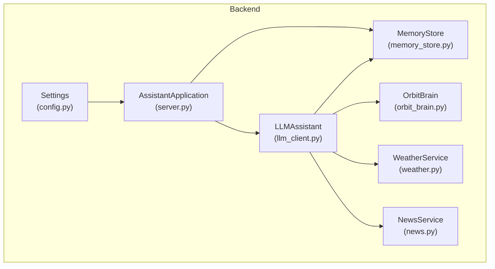
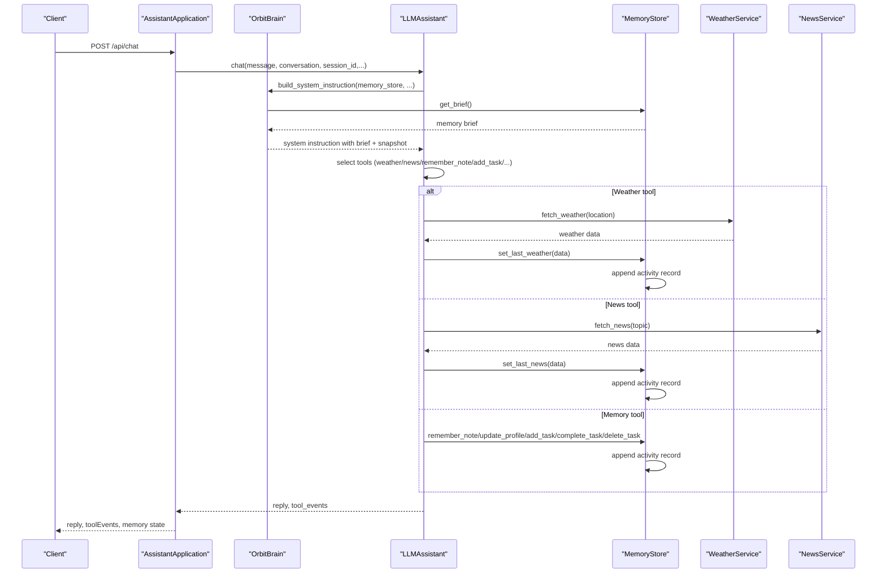
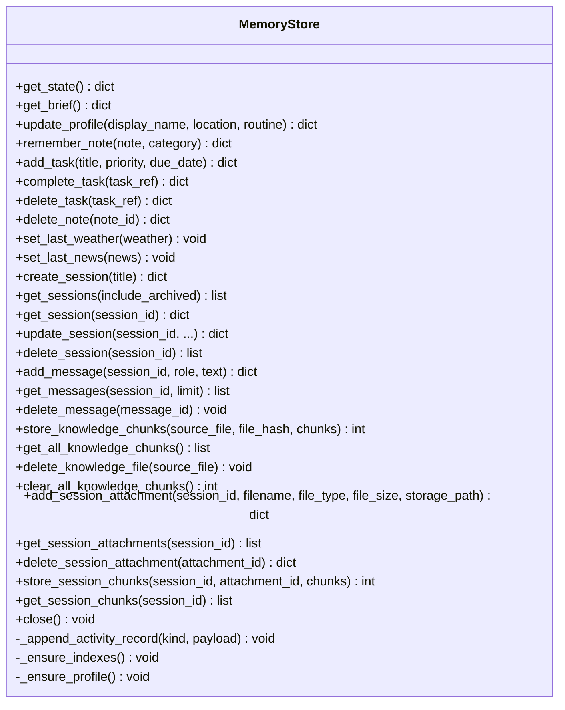
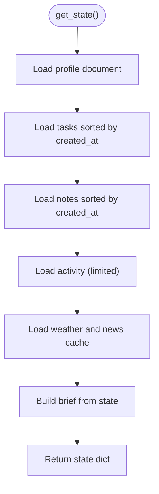
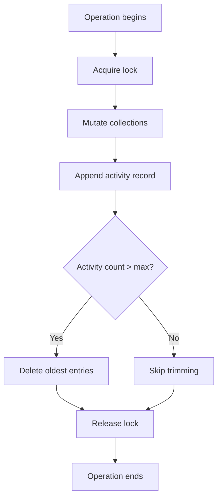
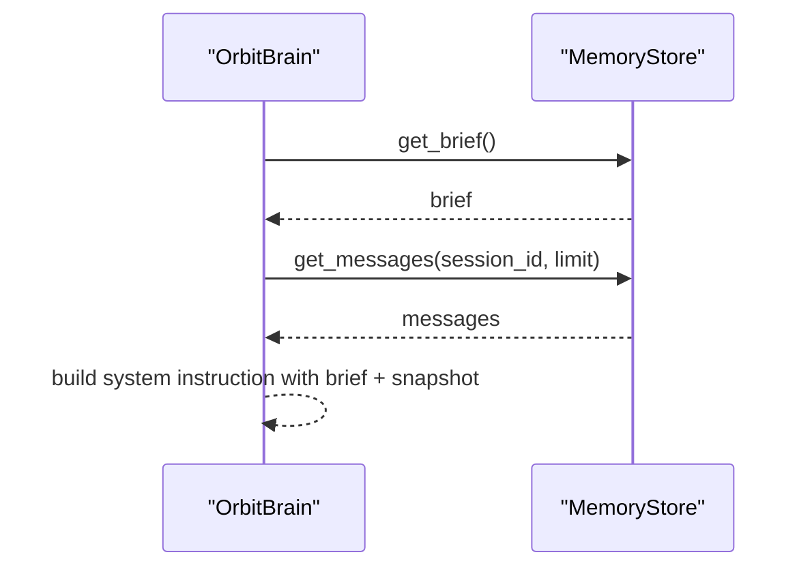
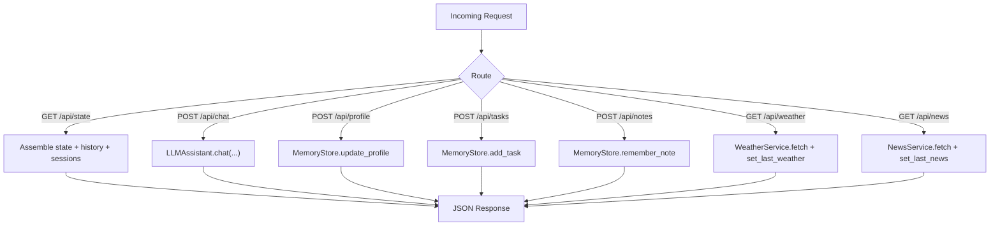
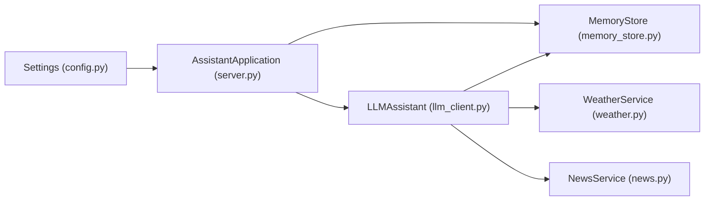

# Memory Integration and Data Persistence

<cite>
**Referenced Files in This Document**
- [memory_store.py](file://backend/core/memory_store.py)
- [orbit_brain.py](file://backend/core/orbit_brain.py)
- [server.py](file://backend/server.py)
- [config.py](file://backend/config.py)
- [llm_client.py](file://backend/api_clients/llm_client.py)
- [weather.py](file://backend/tools/weather.py)
- [news.py](file://backend/tools/news.py)
- [run.py](file://run.py)
- [README.md](file://README.md)
</cite>

## Table of Contents
1. [Introduction](#introduction)
2. [Project Structure](#project-structure)
3. [Core Components](#core-components)
4. [Architecture Overview](#architecture-overview)
5. [Detailed Component Analysis](#detailed-component-analysis)
6. [Dependency Analysis](#dependency-analysis)
7. [Performance Considerations](#performance-considerations)
8. [Troubleshooting Guide](#troubleshooting-guide)
9. [Conclusion](#conclusion)
10. [Appendices](#appendices)

## Introduction
This document explains the memory integration and data persistence mechanisms powering the assistant. It focuses on how the MemoryStore integrates with MongoDB to persist sessions, messages, profile, tasks, notes, cached weather/news, activity logs, knowledge chunks, and session attachments/chunks. It also details memory brief generation, state serialization, data retrieval patterns, event logging, memory update triggers, consistency maintenance, and the assistant’s conversation context embedding. Practical examples illustrate memory operations, state snapshots, and integration with external services.

## Project Structure
The memory system spans several modules:
- Backend server initializes MemoryStore and exposes REST endpoints for state, sessions, messages, notes, tasks, and attachments.
- The brain constructs system instructions with a memory brief and dispatches tool calls that mutate memory.
- External services (weather, news) update cached data in memory upon successful retrieval.
- Configuration controls MongoDB connection and runtime behavior.

**Diagram sources**
- [config.py:55-76](file://backend/config.py#L55-L76)
- [server.py:23-63](file://backend/server.py#L23-L63)
- [memory_store.py:67-117](file://backend/core/memory_store.py#L67-L117)
- [orbit_brain.py:389-502](file://backend/core/orbit_brain.py#L389-L502)
- [llm_client.py:38-46](file://backend/api_clients/llm_client.py#L38-L46)
- [weather.py:48-76](file://backend/tools/weather.py#L48-L76)
- [news.py:22-60](file://backend/tools/news.py#L22-L60)

**Section sources**
- [README.md:164-201](file://README.md#L164-L201)
- [config.py:55-76](file://backend/config.py#L55-L76)
- [server.py:23-63](file://backend/server.py#L23-L63)

## Core Components
- MemoryStore: MongoDB-backed persistence for sessions, messages, profile, tasks, notes, activity, cache, knowledge chunks, and session attachments/chunks. Provides legacy compatibility and migration from JSON files.
- OrbitBrain: Builds system instructions with a memory brief and dispatches tool calls that mutate memory.
- LLMAssistant: Orchestrates LLM calls, injects memory brief and conversation snapshot, and executes tool calls.
- External Services: WeatherService and NewsService update cached data in memory after successful retrieval.
- Server: Exposes REST endpoints to manage sessions, messages, notes, tasks, attachments, and to trigger chat and tool calls.

**Section sources**
- [memory_store.py:67-117](file://backend/core/memory_store.py#L67-L117)
- [orbit_brain.py:302-357](file://backend/core/orbit_brain.py#L302-L357)
- [llm_client.py:38-46](file://backend/api_clients/llm_client.py#L38-L46)
- [server.py:169-501](file://backend/server.py#L169-L501)

## Architecture Overview
The assistant composes a system instruction enriched with a memory brief and a recent conversation snapshot. Tool calls mutate memory and produce events logged in the activity collection. The server coordinates persistence and retrieval across sessions and messages.

**Diagram sources**
- [server.py:276-321](file://backend/server.py#L276-L321)
- [llm_client.py:47-78](file://backend/api_clients/llm_client.py#L47-L78)
- [orbit_brain.py:302-357](file://backend/core/orbit_brain.py#L302-L357)
- [memory_store.py:475-496](file://backend/core/memory_store.py#L475-L496)
- [weather.py:51-76](file://backend/tools/weather.py#L51-L76)
- [news.py:25-60](file://backend/tools/news.py#L25-L60)

## Detailed Component Analysis

### MemoryStore: MongoDB-backed Persistence
- Collections: sessions, messages, profile, notes, tasks, activity, cache, knowledge_chunks, session_attachments, session_chunks.
- Indexes: unique and compound indexes for efficient lookups and sorting.
- Thread safety: operations are guarded by a lock to prevent concurrent writes.
- Legacy compatibility: maintains the same public API as the previous JSON-based implementation.
- Migration: one-time import from legacy JSON files into MongoDB.

Key capabilities:
- State retrieval: get_state returns a normalized dictionary mirroring the old JSON structure.
- Memory brief: get_brief builds a compact snapshot for system instructions.
- Profile: update_profile persists user preferences and routines.
- Notes: remember_note stores categorized notes with timestamps.
- Tasks: add_task, complete_task, delete_task manage task lifecycle.
- Weather/News cache: set_last_weather, set_last_news persist recent results.
- Sessions and Messages: create_session, get_sessions, update_session, delete_session; add_message, get_messages, delete_message.
- Knowledge chunks: store_knowledge_chunks, get_all_knowledge_chunks, delete_knowledge_file, clear_all_knowledge_chunks.
- Session attachments and chunks: add_session_attachment, get_session_attachments, delete_session_attachment; store_session_chunks, get_session_chunks.
- Activity logging: _append_activity_record caps entries to a fixed size and trims older records.

**Diagram sources**
- [memory_store.py:67-947](file://backend/core/memory_store.py#L67-L947)

**Section sources**
- [memory_store.py:67-117](file://backend/core/memory_store.py#L67-L117)
- [memory_store.py:188-250](file://backend/core/memory_store.py#L188-L250)
- [memory_store.py:252-277](file://backend/core/memory_store.py#L252-L277)
- [memory_store.py:282-303](file://backend/core/memory_store.py#L282-L303)
- [memory_store.py:309-332](file://backend/core/memory_store.py#L309-L332)
- [memory_store.py:338-446](file://backend/core/memory_store.py#L338-L446)
- [memory_store.py:475-496](file://backend/core/memory_store.py#L475-L496)
- [memory_store.py:579-646](file://backend/core/memory_store.py#L579-L646)
- [memory_store.py:652-690](file://backend/core/memory_store.py#L652-L690)
- [memory_store.py:695-748](file://backend/core/memory_store.py#L695-L748)
- [memory_store.py:754-797](file://backend/core/memory_store.py#L754-L797)
- [memory_store.py:802-831](file://backend/core/memory_store.py#L802-L831)
- [memory_store.py:836-947](file://backend/core/memory_store.py#L836-L947)

### Memory Brief Generation and State Serialization
- Memory brief: Built from the current state, including profile, recent notes, open/completed tasks, and cached weather/news. Limits counts for performance and readability.
- State serialization: get_state returns a dictionary compatible with the legacy JSON structure, enabling seamless integration with existing clients.

**Diagram sources**
- [memory_store.py:188-250](file://backend/core/memory_store.py#L188-L250)
- [memory_store.py:256-277](file://backend/core/memory_store.py#L256-L277)

**Section sources**
- [memory_store.py:188-250](file://backend/core/memory_store.py#L188-L250)
- [memory_store.py:256-277](file://backend/core/memory_store.py#L256-L277)

### Event Logging and Consistency Maintenance
- Activity logging: _append_activity_record inserts records with unique IDs and timestamps, then trims to a fixed maximum size to maintain bounded growth.
- Consistency: All mutations are wrapped in a lock to serialize writes. Indexes optimize reads and enforce uniqueness where needed.
- Migration: migrate_from_json safely imports legacy JSON data into MongoDB, deduplicating by IDs.

**Diagram sources**
- [memory_store.py:162-183](file://backend/core/memory_store.py#L162-L183)
- [memory_store.py:119-135](file://backend/core/memory_store.py#L119-L135)
- [memory_store.py:836-947](file://backend/core/memory_store.py#L836-L947)

**Section sources**
- [memory_store.py:162-183](file://backend/core/memory_store.py#L162-L183)
- [memory_store.py:119-135](file://backend/core/memory_store.py#L119-L135)
- [memory_store.py:836-947](file://backend/core/memory_store.py#L836-L947)

### Profile Management
- update_profile updates display name, location, and routine, sets updated_at, and logs a profile_updated activity event. Returns a memory brief reflecting the change.

**Section sources**
- [memory_store.py:282-303](file://backend/core/memory_store.py#L282-L303)
- [orbit_brain.py:417-424](file://backend/core/orbit_brain.py#L417-L424)

### Task Persistence
- add_task creates a new task with defaults and logs task_added.
- complete_task marks a task done by exact ID or substring match on title, logs task_completed.
- delete_task removes a task by ID or unique substring, logs task_deleted.
- Retrieval filters: get_tasks supports status filtering.

**Section sources**
- [memory_store.py:338-446](file://backend/core/memory_store.py#L338-L446)
- [orbit_brain.py:441-452](file://backend/core/orbit_brain.py#L441-L452)

### Note Storage
- remember_note persists a note with category and timestamp, logs note_saved.
- delete_note removes a note by ID, logs note_deleted.

**Section sources**
- [memory_store.py:309-332](file://backend/core/memory_store.py#L309-L332)
- [memory_store.py:448-469](file://backend/core/memory_store.py#L448-L469)
- [orbit_brain.py:453-462](file://backend/core/orbit_brain.py#L453-L462)

### Conversation Context Embedding and History
- Sessions: create_session, get_sessions, update_session, delete_session manage chat contexts.
- Messages: add_message, get_messages, delete_message store per-session turns.
- Legacy history bridge: update_history replaces a session’s messages and updates session timestamps.
- Snapshot construction: build_system_instruction embeds a memory brief and a recent conversation snapshot into the system prompt.

**Diagram sources**
- [memory_store.py:579-646](file://backend/core/memory_store.py#L579-L646)
- [memory_store.py:652-690](file://backend/core/memory_store.py#L652-L690)
- [memory_store.py:188-250](file://backend/core/memory_store.py#L188-L250)
- [orbit_brain.py:283-299](file://backend/core/orbit_brain.py#L283-L299)
- [orbit_brain.py:302-357](file://backend/core/orbit_brain.py#L302-L357)

**Section sources**
- [memory_store.py:501-574](file://backend/core/memory_store.py#L501-L574)
- [memory_store.py:579-646](file://backend/core/memory_store.py#L579-L646)
- [memory_store.py:652-690](file://backend/core/memory_store.py#L652-L690)
- [orbit_brain.py:283-299](file://backend/core/orbit_brain.py#L283-L299)
- [orbit_brain.py:302-357](file://backend/core/orbit_brain.py#L302-L357)

### External Service Integration
- Weather: WeatherService fetches current conditions and forecasts; LLMAssistant calls set_last_weather after successful retrieval.
- News: NewsService fetches headlines; LLMAssistant calls set_last_news after successful retrieval.
- Both update the cache collection and append activity records.

**Section sources**
- [weather.py:51-76](file://backend/tools/weather.py#L51-L76)
- [news.py:25-60](file://backend/tools/news.py#L25-L60)
- [llm_client.py:405-412](file://backend/api_clients/llm_client.py#L405-L412)
- [memory_store.py:475-496](file://backend/core/memory_store.py#L475-L496)

### Server Endpoints and Data Lifecycle
- State: GET /api/state returns provider, model, default location, memory, history, and sessions.
- Sessions: CRUD endpoints for sessions and messages; attachments and chunks endpoints.
- Tools: POST /api/profile, /api/tasks, /api/notes; GET /api/weather, /api/news.
- Chat: POST /api/chat orchestrates LLM calls and returns memory state alongside replies.

**Diagram sources**
- [server.py:106-167](file://backend/server.py#L106-L167)
- [server.py:169-321](file://backend/server.py#L169-L321)
- [server.py:329-394](file://backend/server.py#L329-L394)
- [server.py:399-501](file://backend/server.py#L399-L501)

**Section sources**
- [server.py:106-167](file://backend/server.py#L106-L167)
- [server.py:169-321](file://backend/server.py#L169-L321)
- [server.py:329-394](file://backend/server.py#L329-L394)
- [server.py:399-501](file://backend/server.py#L399-L501)

## Dependency Analysis
- MemoryStore depends on MongoDB for persistence and PyMongo for connectivity.
- LLMAssistant depends on MemoryStore, WeatherService, NewsService, and KnowledgeService.
- Server composes MemoryStore, LLMAssistant, WeatherService, NewsService, and KnowledgeService.
- Configuration supplies MongoDB URI and database name.

**Diagram sources**
- [config.py:55-76](file://backend/config.py#L55-L76)
- [server.py:23-63](file://backend/server.py#L23-L63)
- [llm_client.py:38-46](file://backend/api_clients/llm_client.py#L38-L46)
- [memory_store.py:67-117](file://backend/core/memory_store.py#L67-L117)

**Section sources**
- [config.py:55-76](file://backend/config.py#L55-L76)
- [server.py:23-63](file://backend/server.py#L23-L63)
- [llm_client.py:38-46](file://backend/api_clients/llm_client.py#L38-L46)
- [memory_store.py:67-117](file://backend/core/memory_store.py#L67-L117)

## Performance Considerations
- Indexes: Unique and compound indexes on frequently queried fields improve read/write performance.
- Bounded activity: Activity trimming prevents unbounded growth and maintains query performance.
- Locking: Single-threaded writes per operation reduce contention but may serialize high concurrency.
- Caching: Weather and news are cached to minimize repeated external calls.
- Chunking: Knowledge and session chunks are stored separately to enable efficient retrieval and updates.

[No sources needed since this section provides general guidance]

## Troubleshooting Guide
- MongoDB connection failures: MemoryStore raises a runtime error if the server is unreachable; verify URI and network connectivity.
- Empty or invalid inputs: Many operations validate inputs and raise exceptions; ensure non-empty strings and valid IDs.
- Tool errors: run_tool_call catches specific errors and returns structured error responses; inspect tool_events for details.
- Activity overflow: Automatic trimming ensures bounded size; if events appear missing, confirm the maximum threshold.

**Section sources**
- [memory_store.py:86-98](file://backend/core/memory_store.py#L86-L98)
- [memory_store.py:309-332](file://backend/core/memory_store.py#L309-L332)
- [memory_store.py:338-446](file://backend/core/memory_store.py#L338-L446)
- [memory_store.py:475-496](file://backend/core/memory_store.py#L475-L496)
- [orbit_brain.py:490-493](file://backend/core/orbit_brain.py#L490-L493)

## Conclusion
The memory integration centers on a robust MemoryStore that persists all assistant state in MongoDB while maintaining backward compatibility and enabling modern features like multi-session chat, file attachments, and RAG. The system constructs a concise memory brief and a recent conversation snapshot to guide the LLM, logs all significant actions, and integrates external services seamlessly. Together, these mechanisms deliver a consistent, reliable, and extensible memory and persistence layer.

[No sources needed since this section summarizes without analyzing specific files]

## Appendices

### Example Workflows

- Remember a note
  - Client: POST /api/notes with text and category
  - Server: calls MemoryStore.remember_note and returns memory state
  - MemoryStore: inserts note, logs activity, returns saved note

- Add a task
  - Client: POST /api/tasks with title, priority, dueDate
  - Server: calls MemoryStore.add_task and returns memory state
  - MemoryStore: inserts task, logs activity, returns task

- Complete a task
  - Client: POST /api/tasks/complete with taskRef
  - Server: calls MemoryStore.complete_task and returns memory state
  - MemoryStore: updates task status, logs activity, returns task

- Get weather
  - Client: GET /api/weather?location=...
  - Server: calls WeatherService, sets cache, returns weather + memory

- Get news
  - Client: GET /api/news?topic=...
  - Server: calls NewsService, sets cache, returns news + memory

- Chat with memory brief
  - Client: POST /api/chat with message, conversation, mode
  - Server: LLMAssistant.build_system_instruction with memory brief and snapshot
  - LLM executes tool calls, updates memory, returns reply + toolEvents + memory

**Section sources**
- [server.py:243-253](file://backend/server.py#L243-L253)
- [server.py:222-241](file://backend/server.py#L222-L241)
- [server.py:234-241](file://backend/server.py#L234-L241)
- [server.py:145-164](file://backend/server.py#L145-L164)
- [server.py:276-321](file://backend/server.py#L276-L321)
- [orbit_brain.py:302-357](file://backend/core/orbit_brain.py#L302-L357)