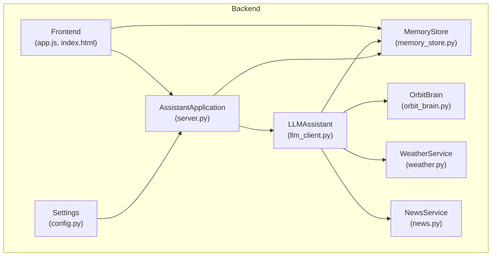
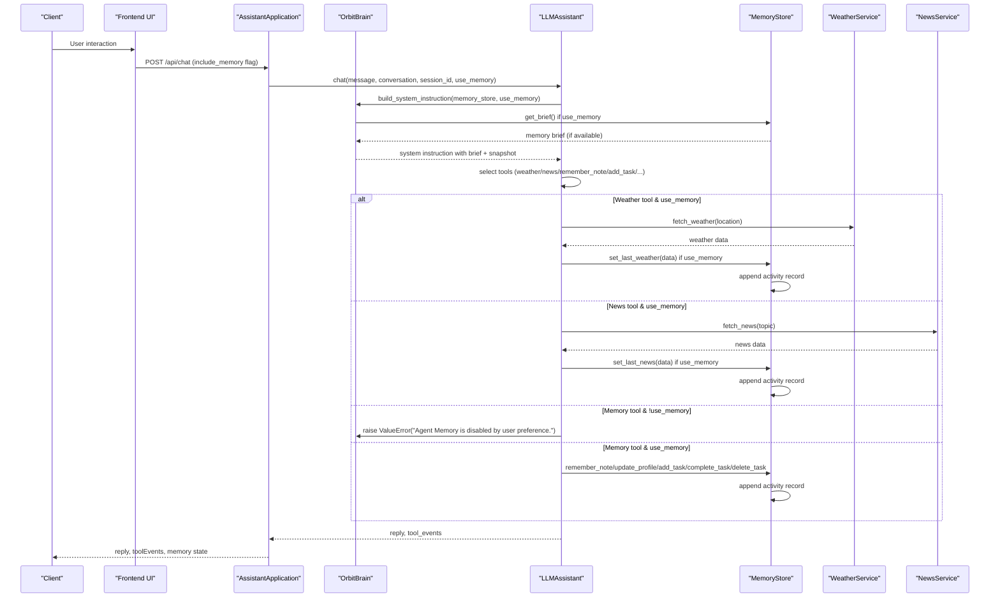
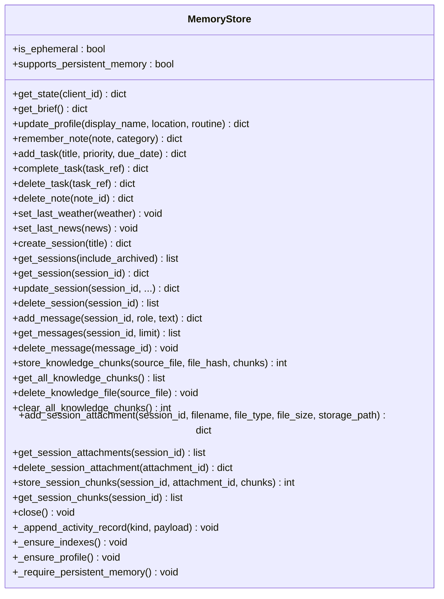
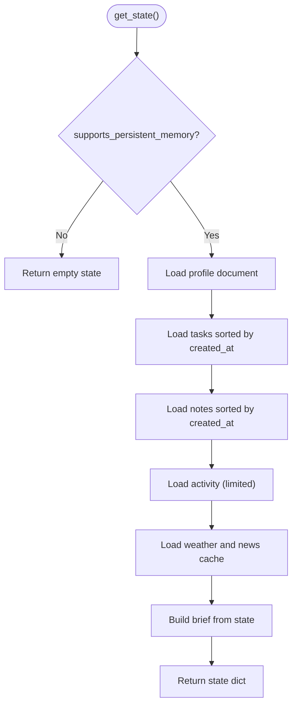
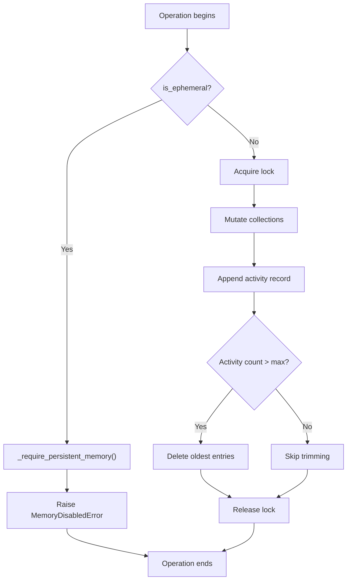
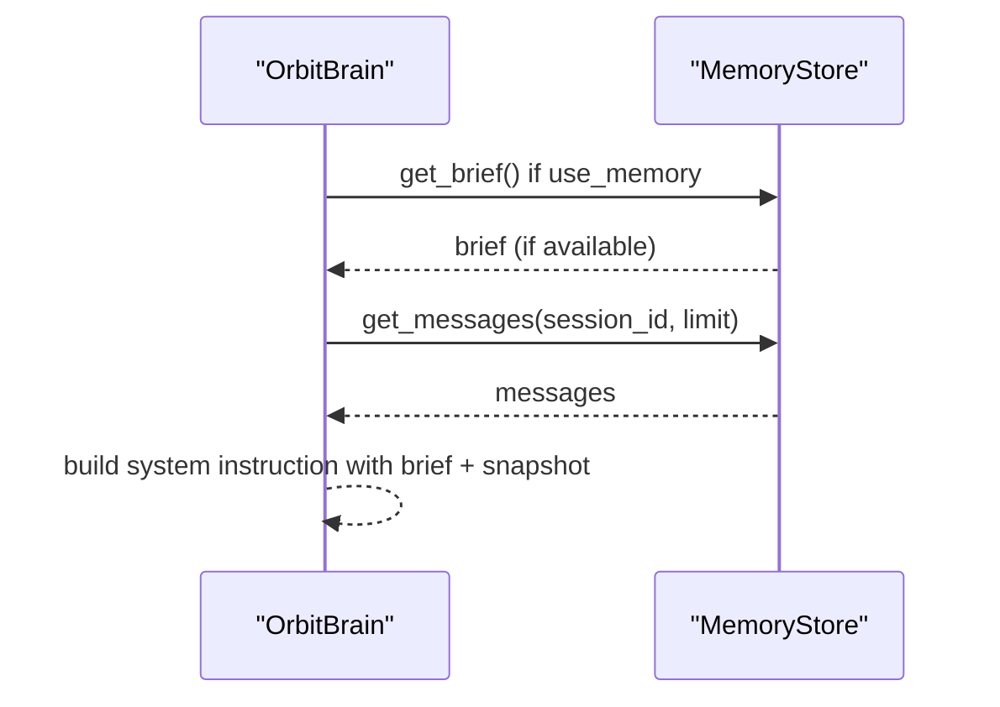
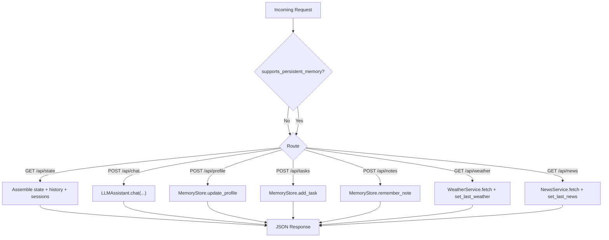
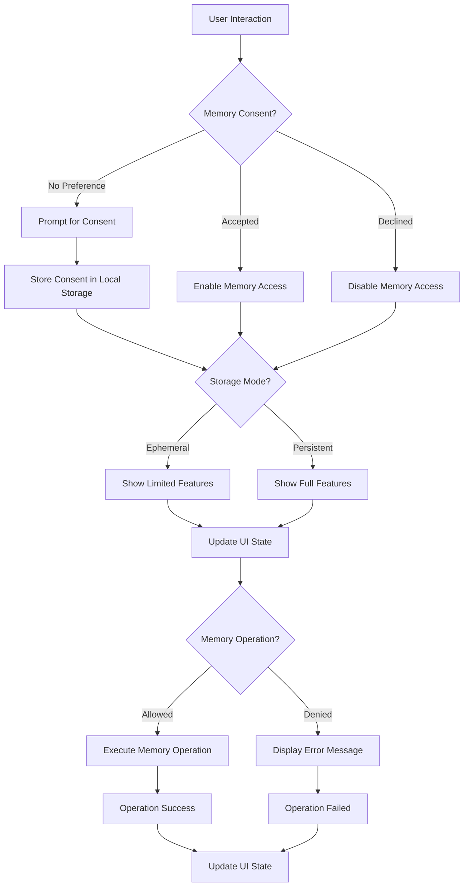
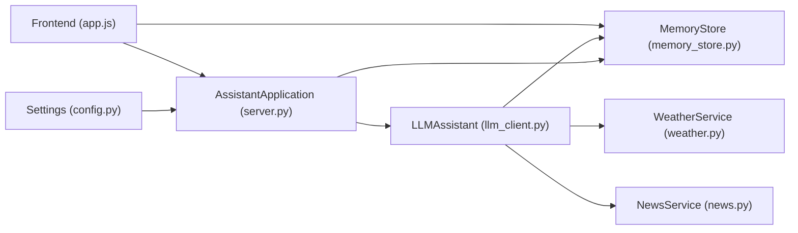

# Memory Integration and Data Persistence

<cite>
**Referenced Files in This Document**
- [memory_store.py](file://backend/core/memory_store.py)
- [orbit_brain.py](file://backend/core/orbit_brain.py)
- [server.py](file://backend/server.py)
- [config.py](file://backend/config.py)
- [llm_client.py](file://backend/api_clients/llm_client.py)
- [weather.py](file://backend/tools/weather.py)
- [news.py](file://backend/tools/news.py)
- [run.py](file://run.py)
- [README.md](file://README.md)
- [app.js](file://frontend/scripts/app.js)
- [index.html](file://frontend/index.html)
- [styles.css](file://frontend/assets/styles.css)
</cite>

## Update Summary
**Changes Made**
- Added comprehensive memory consent control system with user preference handling
- Implemented conditional memory operations with explicit error handling when memory is disabled
- Enhanced frontend UI with memory access controls and user consent management
- Added ephemeral mode support with memory availability detection
- Updated server endpoints to respect user memory preferences and storage mode

## Table of Contents
1. [Introduction](#introduction)
2. [Project Structure](#project-structure)
3. [Core Components](#core-components)
4. [Architecture Overview](#architecture-overview)
5. [Detailed Component Analysis](#detailed-component-analysis)
6. [Memory Consent and User Control System](#memory-consent-and-user-control-system)
7. [Dependency Analysis](#dependency-analysis)
8. [Performance Considerations](#performance-considerations)
9. [Troubleshooting Guide](#troubleshooting-guide)
10. [Conclusion](#conclusion)
11. [Appendices](#appendices)

## Introduction
This document explains the memory integration and data persistence mechanisms powering the assistant, with enhanced user-controlled memory access. The system now features comprehensive memory consent controls, conditional memory operations, and user preference handling throughout the architecture. It focuses on how the MemoryStore integrates with MongoDB to persist sessions, messages, profile, tasks, notes, cached weather/news, activity logs, knowledge chunks, and session attachments/chunks, while respecting user preferences for memory access. It also details memory brief generation, state serialization, data retrieval patterns, event logging, memory update triggers, consistency maintenance, and the assistant's conversation context embedding. Practical examples illustrate memory operations, state snapshots, and integration with external services.

## Project Structure
The memory system spans several modules with enhanced user control:
- Backend server initializes MemoryStore and exposes REST endpoints for state, sessions, messages, notes, tasks, and attachments, with memory consent validation.
- The brain constructs system instructions with a memory brief and dispatches tool calls that mutate memory, respecting user consent.
- External services (weather, news) update cached data in memory upon successful retrieval.
- Configuration controls MongoDB connection and runtime behavior.
- Frontend manages user consent, memory availability detection, and conditional UI interactions.

**Diagram sources**
- [config.py:55-76](file://backend/config.py#L55-L76)
- [server.py:23-63](file://backend/server.py#L23-L63)
- [memory_store.py:67-117](file://backend/core/memory_store.py#L67-L117)
- [orbit_brain.py:389-502](file://backend/core/orbit_brain.py#L389-L502)
- [llm_client.py:38-46](file://backend/api_clients/llm_client.py#L38-L46)
- [weather.py:48-76](file://backend/tools/weather.py#L48-L76)
- [news.py:22-60](file://backend/tools/news.py#L22-L60)
- [app.js:886-906](file://frontend/scripts/app.js#L886-L906)

**Section sources**
- [README.md:164-201](file://README.md#L164-L201)
- [config.py:55-76](file://backend/config.py#L55-L76)
- [server.py:23-63](file://backend/server.py#L23-L63)

## Core Components
- MemoryStore: MongoDB-backed persistence for sessions, messages, profile, tasks, notes, activity, cache, knowledge chunks, and session attachments/chunks. Provides legacy compatibility, migration from JSON files, and memory mode detection (persistent vs ephemeral).
- OrbitBrain: Builds system instructions with a memory brief and dispatches tool calls that mutate memory, with conditional execution based on user consent.
- LLMAssistant: Orchestrates LLM calls, injects memory brief and conversation snapshot, executes tool calls, and respects memory access preferences.
- External Services: WeatherService and NewsService update cached data in memory after successful retrieval.
- Server: Exposes REST endpoints to manage sessions, messages, notes, tasks, attachments, and to trigger chat and tool calls, with memory consent validation.
- Frontend: Manages user consent, memory availability detection, and conditional UI interactions based on memory state.

**Section sources**
- [memory_store.py:67-117](file://backend/core/memory_store.py#L67-L117)
- [orbit_brain.py:302-357](file://backend/core/orbit_brain.py#L302-L357)
- [llm_client.py:38-46](file://backend/api_clients/llm_client.py#L38-L46)
- [server.py:169-501](file://backend/server.py#L169-L501)
- [app.js:803-884](file://frontend/scripts/app.js#L803-L884)

## Architecture Overview
The assistant composes a system instruction enriched with a memory brief and a recent conversation snapshot. Tool calls mutate memory and produce events logged in the activity collection, but only when user consent is granted. The server coordinates persistence and retrieval across sessions and messages, respecting memory access preferences and storage mode. The frontend manages user consent and displays appropriate UI states based on memory availability.

**Diagram sources**
- [server.py:276-321](file://backend/server.py#L276-L321)
- [llm_client.py:47-78](file://backend/api_clients/llm_client.py#L47-L78)
- [orbit_brain.py:302-357](file://backend/core/orbit_brain.py#L302-L357)
- [memory_store.py:475-496](file://backend/core/memory_store.py#L475-L496)
- [weather.py:51-76](file://backend/tools/weather.py#L51-L76)
- [news.py:25-60](file://backend/tools/news.py#L25-L60)
- [app.js:886-906](file://frontend/scripts/app.js#L886-L906)

## Detailed Component Analysis

### MemoryStore: MongoDB-backed Persistence with Mode Detection
- Collections: sessions, messages, profile, notes, tasks, activity, cache, knowledge_chunks, session_attachments, session_chunks.
- Indexes: unique and compound indexes for efficient lookups and sorting.
- Thread safety: operations are guarded by a lock to prevent concurrent writes.
- Legacy compatibility: maintains the same public API as the previous JSON-based implementation.
- Migration: one-time import from legacy JSON files into MongoDB.
- **Updated**: Mode detection with `is_ephemeral` and `supports_persistent_memory` properties.

Key capabilities:
- State retrieval: get_state returns a normalized dictionary mirroring the old JSON structure.
- Memory brief: get_brief builds a compact snapshot for system instructions.
- Profile: update_profile persists user preferences and routines.
- Notes: remember_note stores categorized notes with timestamps.
- Tasks: add_task, complete_task, delete_task manage task lifecycle.
- Weather/News cache: set_last_weather, set_last_news persist recent results.
- Sessions and Messages: create_session, get_sessions, update_session, delete_session; add_message, get_messages, delete_message.
- Knowledge chunks: store_knowledge_chunks, get_all_knowledge_chunks, delete_knowledge_file, clear_all_knowledge_chunks.
- Session attachments and chunks: add_session_attachment, get_session_attachments, delete_session_attachment; store_session_chunks, get_session_chunks.
- Activity logging: _append_activity_record caps entries to a fixed size and trims older records.
- **New**: Memory mode detection: `is_ephemeral` indicates ephemeral mode, `supports_persistent_memory` indicates MongoDB availability.

**Diagram sources**
- [memory_store.py:67-947](file://backend/core/memory_store.py#L67-L947)

**Section sources**
- [memory_store.py:67-117](file://backend/core/memory_store.py#L67-L117)
- [memory_store.py:188-250](file://backend/core/memory_store.py#L188-L250)
- [memory_store.py:252-277](file://backend/core/memory_store.py#L252-L277)
- [memory_store.py:282-303](file://backend/core/memory_store.py#L282-L303)
- [memory_store.py:309-332](file://backend/core/memory_store.py#L309-L332)
- [memory_store.py:338-446](file://backend/core/memory_store.py#L338-L446)
- [memory_store.py:475-496](file://backend/core/memory_store.py#L475-L496)
- [memory_store.py:579-646](file://backend/core/memory_store.py#L579-L646)
- [memory_store.py:652-690](file://backend/core/memory_store.py#L652-L690)
- [memory_store.py:695-748](file://backend/core/memory_store.py#L695-L748)
- [memory_store.py:754-797](file://backend/core/memory_store.py#L754-L797)
- [memory_store.py:802-831](file://backend/core/memory_store.py#L802-L831)
- [memory_store.py:836-947](file://backend/core/memory_store.py#L836-L947)
- [memory_store.py:123-129](file://backend/core/memory_store.py#L123-L129)

### Memory Brief Generation and State Serialization
- Memory brief: Built from the current state, including profile, recent notes, open/completed tasks, and cached weather/news. Limits counts for performance and readability.
- State serialization: get_state returns a dictionary compatible with the legacy JSON structure, enabling seamless integration with existing clients.
- **Updated**: Conditional state retrieval based on memory access permissions and storage mode.

**Diagram sources**
- [memory_store.py:188-250](file://backend/core/memory_store.py#L188-L250)
- [memory_store.py:256-277](file://backend/core/memory_store.py#L256-L277)

**Section sources**
- [memory_store.py:188-250](file://backend/core/memory_store.py#L188-L250)
- [memory_store.py:256-277](file://backend/core/memory_store.py#L256-L277)

### Event Logging and Consistency Maintenance
- Activity logging: _append_activity_record inserts records with unique IDs and timestamps, then trims to a fixed maximum size to maintain bounded growth.
- Consistency: All mutations are wrapped in a lock to serialize writes. Indexes optimize reads and enforce uniqueness where needed.
- Migration: migrate_from_json safely imports legacy JSON data into MongoDB, deduplicating by IDs.
- **Updated**: Memory mode validation prevents persistent memory operations in ephemeral mode.

**Diagram sources**
- [memory_store.py:162-183](file://backend/core/memory_store.py#L162-L183)
- [memory_store.py:119-135](file://backend/core/memory_store.py#L119-L135)
- [memory_store.py:836-947](file://backend/core/memory_store.py#L836-L947)
- [memory_store.py:182-184](file://backend/core/memory_store.py#L182-L184)

**Section sources**
- [memory_store.py:162-183](file://backend/core/memory_store.py#L162-L183)
- [memory_store.py:119-135](file://backend/core/memory_store.py#L119-L135)
- [memory_store.py:836-947](file://backend/core/memory_store.py#L836-L947)

### Profile Management
- update_profile updates display name, location, and routine, sets updated_at, and logs a profile_updated activity event. Returns a memory brief reflecting the change.
- **Updated**: Respects memory access permissions and storage mode.

**Section sources**
- [memory_store.py:282-303](file://backend/core/memory_store.py#L282-L303)
- [orbit_brain.py:417-424](file://backend/core/orbit_brain.py#L417-L424)

### Task Persistence
- add_task creates a new task with defaults and logs task_added.
- complete_task marks a task done by exact ID or substring match on title, logs task_completed.
- delete_task removes a task by ID or unique substring, logs task_deleted.
- Retrieval filters: get_tasks supports status filtering.
- **Updated**: All operations respect memory access permissions and storage mode.

**Section sources**
- [memory_store.py:338-446](file://backend/core/memory_store.py#L338-L446)
- [orbit_brain.py:441-452](file://backend/core/orbit_brain.py#L441-L452)

### Note Storage
- remember_note persists a note with category and timestamp, logs note_saved.
- delete_note removes a note by ID, logs note_deleted.
- **Updated**: Operations respect memory access permissions and storage mode.

**Section sources**
- [memory_store.py:309-332](file://backend/core/memory_store.py#L309-L332)
- [memory_store.py:448-469](file://backend/core/memory_store.py#L448-L469)
- [orbit_brain.py:453-462](file://backend/core/orbit_brain.py#L453-L462)

### Conversation Context Embedding and History
- Sessions: create_session, get_sessions, update_session, delete_session manage chat contexts.
- Messages: add_message, get_messages, delete_message store per-session turns.
- Legacy history bridge: update_history replaces a session's messages and updates session timestamps.
- Snapshot construction: build_system_instruction embeds a memory brief and a recent conversation snapshot into the system prompt.
- **Updated**: Conditional memory brief retrieval based on user consent and storage mode.

**Diagram sources**
- [memory_store.py:579-646](file://backend/core/memory_store.py#L579-L646)
- [memory_store.py:652-690](file://backend/core/memory_store.py#L652-L690)
- [memory_store.py:188-250](file://backend/core/memory_store.py#L188-L250)
- [orbit_brain.py:283-299](file://backend/core/orbit_brain.py#L283-L299)
- [orbit_brain.py:302-357](file://backend/core/orbit_brain.py#L302-L357)

**Section sources**
- [memory_store.py:501-574](file://backend/core/memory_store.py#L501-L574)
- [memory_store.py:579-646](file://backend/core/memory_store.py#L579-L646)
- [memory_store.py:652-690](file://backend/core/memory_store.py#L652-L690)
- [orbit_brain.py:283-299](file://backend/core/orbit_brain.py#L283-L299)
- [orbit_brain.py:302-357](file://backend/core/orbit_brain.py#L302-L357)

### External Service Integration
- Weather: WeatherService fetches current conditions and forecasts; LLMAssistant calls set_last_weather after successful retrieval.
- News: NewsService fetches headlines; LLMAssistant calls set_last_news after successful retrieval.
- Both update the cache collection and append activity records.
- **Updated**: Operations respect memory access permissions and storage mode.

**Section sources**
- [weather.py:51-76](file://backend/tools/weather.py#L51-L76)
- [news.py:25-60](file://backend/tools/news.py#L25-L60)
- [llm_client.py:405-412](file://backend/api_clients/llm_client.py#L405-L412)
- [memory_store.py:475-496](file://backend/core/memory_store.py#L475-L496)

### Server Endpoints and Data Lifecycle
- State: GET /api/state returns provider, model, default location, memory, history, and sessions, with memory availability detection.
- Sessions: CRUD endpoints for sessions and messages; attachments and chunks endpoints.
- Tools: POST /api/profile, /api/tasks, /api/notes; GET /api/weather, /api/news.
- Chat: POST /api/chat orchestrates LLM calls and returns memory state alongside replies, with memory consent validation.
- **Updated**: All endpoints respect memory access permissions and storage mode.

**Diagram sources**
- [server.py:106-167](file://backend/server.py#L106-L167)
- [server.py:169-321](file://backend/server.py#L169-L321)
- [server.py:329-394](file://backend/server.py#L329-L394)
- [server.py:399-501](file://backend/server.py#L399-L501)

**Section sources**
- [server.py:106-167](file://backend/server.py#L106-L167)
- [server.py:169-321](file://backend/server.py#L169-L321)
- [server.py:329-394](file://backend/server.py#L329-L394)
- [server.py:399-501](file://backend/server.py#L399-L501)

## Memory Consent and User Control System

### User Consent Management
The system implements a comprehensive user consent mechanism for memory access:

- **Consent States**: Users can accept, decline, or have no preference for memory access
- **Storage Modes**: Supports both persistent (MongoDB) and ephemeral (in-memory) modes
- **Automatic Detection**: Frontend automatically detects storage mode and adjusts UI accordingly
- **Local Storage**: Consent preferences are stored locally for future sessions

### Frontend Implementation
The frontend manages memory consent through several key components:

- **Consent Dialog**: Prompts users on first visit about memory access permissions
- **UI State Management**: Dynamically enables/disables memory-dependent features
- **Error Handling**: Displays appropriate messages when memory is disabled or unavailable
- **Visual Indicators**: Shows memory availability status and locks memory-protected panels

### Backend Integration
The backend validates memory access through multiple layers:

- **Server Validation**: `/api/state` endpoint checks memory availability and user consent
- **Tool Call Protection**: All memory operations in OrbitBrain check `allow_memory` parameter
- **Error Propagation**: Memory-disabled errors are properly handled and returned to clients
- **Mode Detection**: Automatic detection of ephemeral vs persistent storage modes

### Error Handling and User Feedback
The system provides clear error messages and graceful degradation:

- **Memory Disabled**: Specific error codes for disabled memory operations
- **Ephemeral Mode**: Clear messaging about limitations in ephemeral mode
- **User-Friendly Messages**: Frontend translates technical errors into understandable feedback
- **Graceful Degradation**: Non-memory features continue to work even when memory is disabled

**Diagram sources**
- [app.js:886-906](file://frontend/scripts/app.js#L886-L906)
- [app.js:908-937](file://frontend/scripts/app.js#L908-L937)
- [server.py:186-203](file://backend/server.py#L186-L203)
- [orbit_brain.py:440-503](file://backend/core/orbit_brain.py#L440-L503)

**Section sources**
- [app.js:803-884](file://frontend/scripts/app.js#L803-L884)
- [app.js:886-906](file://frontend/scripts/app.js#L886-L906)
- [app.js:908-937](file://frontend/scripts/app.js#L908-L937)
- [server.py:186-203](file://backend/server.py#L186-L203)
- [orbit_brain.py:440-503](file://backend/core/orbit_brain.py#L440-L503)

## Dependency Analysis
- MemoryStore depends on MongoDB for persistence and PyMongo for connectivity.
- LLMAssistant depends on MemoryStore, WeatherService, NewsService, and KnowledgeService.
- Server composes MemoryStore, LLMAssistant, WeatherService, NewsService, and KnowledgeService.
- Configuration supplies MongoDB URI and database name.
- **Updated**: Frontend depends on server for memory availability detection and consent validation.

**Diagram sources**
- [config.py:55-76](file://backend/config.py#L55-L76)
- [server.py:23-63](file://backend/server.py#L23-L63)
- [llm_client.py:38-46](file://backend/api_clients/llm_client.py#L38-L46)
- [memory_store.py:67-117](file://backend/core/memory_store.py#L67-L117)
- [app.js:886-906](file://frontend/scripts/app.js#L886-L906)

**Section sources**
- [config.py:55-76](file://backend/config.py#L55-L76)
- [server.py:23-63](file://backend/server.py#L23-L63)
- [llm_client.py:38-46](file://backend/api_clients/llm_client.py#L38-L46)
- [memory_store.py:67-117](file://backend/core/memory_store.py#L67-L117)
- [app.js:886-906](file://frontend/scripts/app.js#L886-L906)

## Performance Considerations
- Indexes: Unique and compound indexes on frequently queried fields improve read/write performance.
- Bounded activity: Activity trimming prevents unbounded growth and maintains query performance.
- Locking: Single-threaded writes per operation reduce contention but may serialize high concurrency.
- Caching: Weather and news are cached to minimize repeated external calls.
- Chunking: Knowledge and session chunks are stored separately to enable efficient retrieval and updates.
- **Updated**: Memory mode optimization: Ephemeral mode reduces overhead by avoiding MongoDB connections.
- **Updated**: Conditional memory operations: Reduced database calls when memory is disabled.

## Troubleshooting Guide
- MongoDB connection failures: MemoryStore raises a runtime error if the server is unreachable; verify URI and network connectivity.
- Empty or invalid inputs: Many operations validate inputs and raise exceptions; ensure non-empty strings and valid IDs.
- Tool errors: run_tool_call catches specific errors and returns structured error responses; inspect tool_events for details.
- Activity overflow: Automatic trimming ensures bounded size; if events appear missing, confirm the maximum threshold.
- **Updated**: Memory disabled errors: Check `memory_disabled` error code for user consent issues.
- **Updated**: Ephemeral mode limitations: Some features are intentionally disabled in ephemeral mode.
- **Updated**: Consent validation: Ensure frontend properly handles memory consent states.

**Section sources**
- [memory_store.py:86-98](file://backend/core/memory_store.py#L86-L98)
- [memory_store.py:309-332](file://backend/core/memory_store.py#L309-L332)
- [memory_store.py:338-446](file://backend/core/memory_store.py#L338-L446)
- [memory_store.py:475-496](file://backend/core/memory_store.py#L475-L496)
- [orbit_brain.py:490-493](file://backend/core/orbit_brain.py#L490-L493)
- [app.js:816-822](file://frontend/scripts/app.js#L816-L822)

## Conclusion
The memory integration centers on a robust MemoryStore that persists all assistant state in MongoDB while maintaining backward compatibility and enabling modern features like multi-session chat, file attachments, and RAG. The system now includes comprehensive user-controlled memory access with consent management, conditional memory operations, and graceful degradation when memory is disabled. The system constructs a concise memory brief and a recent conversation snapshot to guide the LLM, logs all significant actions, and integrates external services seamlessly. The enhanced user control system ensures privacy-conscious operation while maintaining full functionality when users choose to enable memory access. Together, these mechanisms deliver a consistent, reliable, extensible, and privacy-respecting memory and persistence layer.

## Appendices

### Example Workflows

- Remember a note with consent
  - Client: POST /api/notes with text and category
  - Frontend: Checks memory consent and availability
  - Server: calls MemoryStore.remember_note if allowed
  - MemoryStore: inserts note, logs activity, returns saved note

- Add a task with memory disabled
  - Client: POST /api/tasks with title, priority, dueDate
  - Server: checks memory consent and storage mode
  - OrbitBrain: raises ValueError("Agent Memory is disabled by user preference.")
  - Frontend: displays error message to user

- Complete a task with ephemeral mode
  - Client: POST /api/tasks/complete with taskRef
  - Server: detects ephemeral mode and memory disabled
  - Frontend: shows "Agent Memory is unavailable in Ephemeral Mode"

- Get weather with memory consent
  - Client: GET /api/weather?location=...
  - Server: calls WeatherService, sets cache, returns weather + memory state
  - Frontend: updates UI with weather data and memory status

- Chat with memory brief and consent
  - Client: POST /api/chat with message, conversation, mode, include_memory
  - Server: validates memory consent and storage mode
  - LLMAssistant: build_system_instruction with memory brief and snapshot
  - LLM executes tool calls, updates memory if allowed, returns reply + toolEvents + memory

- User consent management
  - First visit: Frontend prompts for memory consent
  - Consent stored: Local storage preserves user preference
  - UI adaptation: Frontend enables/disables memory features based on consent
  - Error handling: Frontend displays appropriate messages for disabled operations

**Section sources**
- [server.py:243-253](file://backend/server.py#L243-L253)
- [server.py:222-241](file://backend/server.py#L222-L241)
- [server.py:234-241](file://backend/server.py#L234-L241)
- [server.py:145-164](file://backend/server.py#L145-L164)
- [server.py:276-321](file://backend/server.py#L276-L321)
- [orbit_brain.py:302-357](file://backend/core/orbit_brain.py#L302-L357)
- [app.js:886-906](file://frontend/scripts/app.js#L886-L906)
- [app.js:908-937](file://frontend/scripts/app.js#L908-L937)