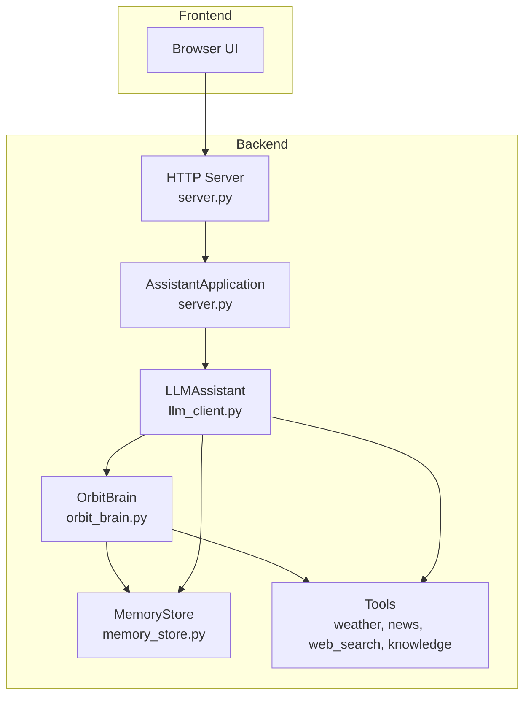
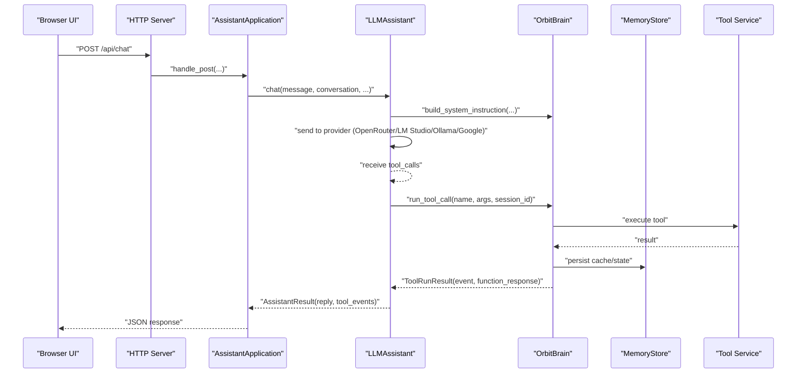
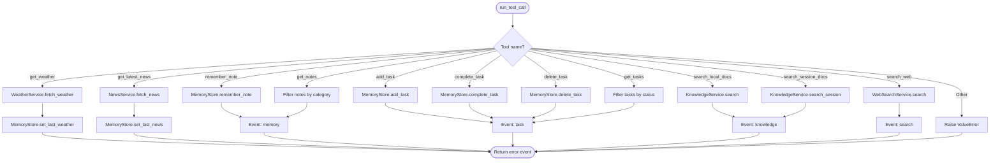
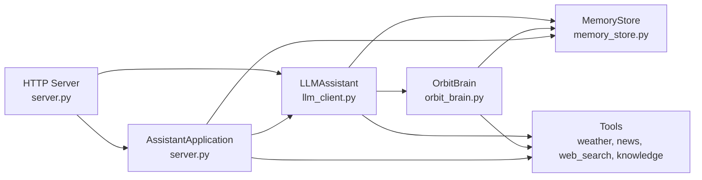

# Tool Orchestration and Function Calling

<cite>
**Referenced Files in This Document**
- [backend/core/orbit_brain.py](file://backend/core/orbit_brain.py)
- [backend/core/memory_store.py](file://backend/core/memory_store.py)
- [backend/tools/weather.py](file://backend/tools/weather.py)
- [backend/tools/news.py](file://backend/tools/news.py)
- [backend/tools/web_search.py](file://backend/tools/web_search.py)
- [backend/tools/knowledge.py](file://backend/tools/knowledge.py)
- [backend/api_clients/llm_client.py](file://backend/api_clients/llm_client.py)
- [backend/server.py](file://backend/server.py)
- [backend/config.py](file://backend/config.py)
- [README.md](file://README.md)
</cite>

## Table of Contents
1. [Introduction](#introduction)
2. [Project Structure](#project-structure)
3. [Core Components](#core-components)
4. [Architecture Overview](#architecture-overview)
5. [Detailed Component Analysis](#detailed-component-analysis)
6. [Dependency Analysis](#dependency-analysis)
7. [Performance Considerations](#performance-considerations)
8. [Troubleshooting Guide](#troubleshooting-guide)
9. [Conclusion](#conclusion)
10. [Appendices](#appendices)

## Introduction
This document explains the tool orchestration system and function calling mechanism used by the assistant. It covers all available tools (weather, news, memory, task management, knowledge search, and web search), the function declaration structure, parameter validation, result processing workflows, tool execution logic, error handling strategies, and the event logging system. It also details dynamic tool availability based on configuration flags and search modes, the tool run result structure, and how tools integrate with the broader assistant workflow.

## Project Structure
The assistant is organized into layers:
- Backend server and HTTP handlers
- LLM client that orchestrates tool calls
- Core brain that declares tools and dispatches calls
- Tools that perform external data retrieval or local operations
- Persistent memory store for state and caching

**Diagram sources**
- [backend/server.py:23-83](file://backend/server.py#L23-L83)
- [backend/api_clients/llm_client.py:38-78](file://backend/api_clients/llm_client.py#L38-L78)
- [backend/core/orbit_brain.py:74-268](file://backend/core/orbit_brain.py#L74-L268)
- [backend/core/memory_store.py:67-117](file://backend/core/memory_store.py#L67-L117)
- [backend/tools/weather.py:47-141](file://backend/tools/weather.py#L47-L141)
- [backend/tools/news.py:21-83](file://backend/tools/news.py#L21-L83)
- [backend/tools/web_search.py:53-139](file://backend/tools/web_search.py#L53-L139)
- [backend/tools/knowledge.py:88-393](file://backend/tools/knowledge.py#L88-L393)

**Section sources**
- [README.md:164-201](file://README.md#L164-L201)
- [backend/server.py:23-83](file://backend/server.py#L23-L83)

## Core Components
- Tool declarations define the functions the LLM can call, including names, descriptions, and JSON Schema parameters.
- The tool dispatcher validates tool names, constructs arguments, executes the appropriate tool, and records events.
- The memory store persists state, caches recent weather/news, and tracks activities.
- The LLM client builds system instructions, injects tool availability, and manages tool call loops.
- Tools encapsulate external services (weather, news, web search) and local RAG capabilities.

**Section sources**
- [backend/core/orbit_brain.py:74-268](file://backend/core/orbit_brain.py#L74-L268)
- [backend/core/orbit_brain.py:389-501](file://backend/core/orbit_brain.py#L389-L501)
- [backend/core/memory_store.py:67-117](file://backend/core/memory_store.py#L67-L117)
- [backend/api_clients/llm_client.py:38-78](file://backend/api_clients/llm_client.py#L38-L78)

## Architecture Overview
The assistant integrates a multi-provider LLM with a tool orchestration layer. The LLM decides when to call tools; the brain dispatches calls; tools perform operations; results are recorded as events; and the memory store updates state and caches.

**Diagram sources**
- [backend/api_clients/llm_client.py:47-78](file://backend/api_clients/llm_client.py#L47-L78)
- [backend/api_clients/llm_client.py:185-215](file://backend/api_clients/llm_client.py#L185-L215)
- [backend/core/orbit_brain.py:389-501](file://backend/core/orbit_brain.py#L389-L501)
- [backend/core/memory_store.py:475-495](file://backend/core/memory_store.py#L475-L495)

## Detailed Component Analysis

### Function Declaration Structure
The brain defines a list of function declarations with:
- name: unique tool identifier
- description: human-readable purpose
- parameters: JSON Schema describing properties and required fields

Examples include weather, news, memory/task management, knowledge search, and web search. The system also conditionally exposes session-docs search when session attachments exist.

**Section sources**
- [backend/core/orbit_brain.py:74-268](file://backend/core/orbit_brain.py#L74-L268)
- [backend/core/orbit_brain.py:361-386](file://backend/core/orbit_brain.py#L361-L386)

### Parameter Validation and Normalization
- Validation occurs at the tool dispatcher and tool boundaries:
  - Required fields enforced by JSON Schema in declarations.
  - Runtime checks for empty or invalid inputs (e.g., empty queries, missing session docs).
- Normalization includes:
  - Stripping whitespace and converting enums to lowercase.
  - Clamping numeric parameters (e.g., max_items for news).
  - Converting max_results to integer and ensuring positive values.

**Section sources**
- [backend/core/orbit_brain.py:404-492](file://backend/core/orbit_brain.py#L404-L492)
- [backend/tools/news.py:25-27](file://backend/tools/news.py#L25-L27)
- [backend/tools/web_search.py:69-72](file://backend/tools/web_search.py#L69-L72)

### Tool Execution Logic
- Tool dispatcher routes by name and executes the corresponding service:
  - Weather: geocodes location, fetches forecast, computes advice.
  - News: builds RSS URL, parses XML, extracts items.
  - Memory/Task: persists notes/tasks, filters by status/category.
  - Knowledge: persistent RAG search or session-scoped search.
  - Web Search: Tavily primary, DuckDuckGo fallback, with spinner UI.
- Results are wrapped in a ToolRunResult with:
  - event: type and label for logging
  - function_response: id, name, response payload

**Diagram sources**
- [backend/core/orbit_brain.py:389-501](file://backend/core/orbit_brain.py#L389-L501)
- [backend/core/memory_store.py:475-495](file://backend/core/memory_store.py#L475-L495)

**Section sources**
- [backend/core/orbit_brain.py:389-501](file://backend/core/orbit_brain.py#L389-L501)
- [backend/core/memory_store.py:475-495](file://backend/core/memory_store.py#L475-L495)

### Result Processing Workflows
- Tool results are serialized into function_response.response and appended to the LLM conversation as tool role messages.
- The LLM continues the loop until no tool_calls remain, then returns the final reply.
- Events are accumulated for UI and analytics.

**Section sources**
- [backend/api_clients/llm_client.py:185-215](file://backend/api_clients/llm_client.py#L185-L215)
- [backend/api_clients/llm_client.py:254-272](file://backend/api_clients/llm_client.py#L254-L272)

### Error Handling Strategies
- Tool-level errors:
  - WeatherError/NewsError raised for invalid locations, network failures, or parsing errors.
- Dispatcher-level errors:
  - Unsupported tool names, missing session docs, or invalid arguments.
- Provider-level errors:
  - OpenRouter/Google API errors mapped to LLMClientError with contextual messages.
- Graceful fallbacks:
  - Web search falls back from Tavily to DuckDuckGo when Tavily fails.
  - Spinner timers provide progress feedback during long operations.

**Section sources**
- [backend/tools/weather.py:43-44](file://backend/tools/weather.py#L43-L44)
- [backend/tools/news.py:13-14](file://backend/tools/news.py#L13-L14)
- [backend/core/orbit_brain.py:490-492](file://backend/core/orbit_brain.py#L490-L492)
- [backend/api_clients/llm_client.py:161-174](file://backend/api_clients/llm_client.py#L161-L174)
- [backend/tools/web_search.py:86-104](file://backend/tools/web_search.py#L86-L104)

### Event Logging System
- Each tool run emits an event with:
  - type: weather, news, memory, task, knowledge, search, error
  - label: human-readable description
- Events are collected in tool_events and returned to the UI alongside the reply.

**Section sources**
- [backend/core/orbit_brain.py:408-492](file://backend/core/orbit_brain.py#L408-L492)

### Dynamic Tool Availability
- Conditional exposure based on:
  - enable_knowledge: only expose search_local_docs when RAG is initialized.
  - offline_mode: hide search_web when offline mode is enabled.
  - enable_session_docs: only expose search_session_docs when session has attachments.
- The system prompt also reflects search mode (web_search_only vs offline).

**Section sources**
- [backend/core/orbit_brain.py:361-386](file://backend/core/orbit_brain.py#L361-L386)
- [backend/api_clients/llm_client.py:109-114](file://backend/api_clients/llm_client.py#L109-L114)
- [backend/api_clients/llm_client.py:224-227](file://backend/api_clients/llm_client.py#L224-L227)

### Tool Run Result Structure
- ToolRunResult(event, function_response)
- function_response includes:
  - id: unique call identifier
  - name: tool name
  - response: tool-specific payload (e.g., weather dict, news items, task object, knowledge context)

**Section sources**
- [backend/core/orbit_brain.py:271-275](file://backend/core/orbit_brain.py#L271-L275)
- [backend/core/orbit_brain.py:494-501](file://backend/core/orbit_brain.py#L494-L501)

### Integration with the Broader Assistant Workflow
- The LLM client builds system instructions and determines tool availability.
- It sends messages to the selected provider and handles tool call loops.
- The brain dispatches tool calls and persists state/caches.
- The server exposes endpoints for manual tool usage and state retrieval.

**Section sources**
- [backend/api_clients/llm_client.py:38-78](file://backend/api_clients/llm_client.py#L38-L78)
- [backend/server.py:106-164](file://backend/server.py#L106-L164)

## Dependency Analysis
The orchestration layer composes several modules with clear responsibilities and minimal coupling.

**Diagram sources**
- [backend/api_clients/llm_client.py:38-78](file://backend/api_clients/llm_client.py#L38-L78)
- [backend/core/orbit_brain.py:389-501](file://backend/core/orbit_brain.py#L389-L501)
- [backend/server.py:23-83](file://backend/server.py#L23-L83)

**Section sources**
- [backend/api_clients/llm_client.py:38-78](file://backend/api_clients/llm_client.py#L38-L78)
- [backend/server.py:23-83](file://backend/server.py#L23-L83)

## Performance Considerations
- Network timeouts and retries:
  - Weather and news services enforce timeouts for HTTP requests.
  - Web search falls back to DuckDuckGo if Tavily fails.
- Spinner timers:
  - Provide user feedback during long operations (web search, knowledge indexing).
- Result size control:
  - Web search max_results is clamped and chosen dynamically based on query complexity.
- Caching:
  - Recent weather and news are cached to reduce repeated calls.

**Section sources**
- [backend/tools/weather.py:122-126](file://backend/tools/weather.py#L122-L126)
- [backend/tools/news.py:77-82](file://backend/tools/news.py#L77-L82)
- [backend/tools/web_search.py:86-104](file://backend/tools/web_search.py#L86-L104)
- [backend/core/memory_store.py:475-495](file://backend/core/memory_store.py#L475-L495)

## Troubleshooting Guide
Common issues and resolutions:
- Missing API key:
  - LLM client raises an error if the current provider’s API key is missing.
- Tool errors:
  - WeatherError for invalid locations or service unavailability.
  - NewsError for feed parsing or network issues.
  - Knowledge base not available:
    - search_local_docs returns an error when RAG is not enabled.
- Offline mode:
  - search_web is not exposed; attempting to call it results in an error.
- Session docs:
  - search_session_docs requires session attachments; otherwise returns an error.
- Web search failures:
  - Falls back to DuckDuckGo; if both fail, returns a combined error.

**Section sources**
- [backend/api_clients/llm_client.py:60-61](file://backend/api_clients/llm_client.py#L60-L61)
- [backend/core/orbit_brain.py:476-477](file://backend/core/orbit_brain.py#L476-L477)
- [backend/tools/weather.py:82-83](file://backend/tools/weather.py#L82-L83)
- [backend/tools/news.py:33-34](file://backend/tools/news.py#L33-L34)
- [backend/tools/knowledge.py:272-273](file://backend/tools/knowledge.py#L272-L273)
- [backend/tools/web_search.py:102-104](file://backend/tools/web_search.py#L102-L104)

## Conclusion
The tool orchestration system cleanly separates concerns: the LLM decides when to act, the brain validates and executes tools, and the memory store maintains state and caches. Dynamic tool availability ensures the assistant adapts to configuration flags and session context. Robust error handling and event logging provide reliability and observability across weather, news, memory/task management, knowledge search, and web search.

## Appendices

### Tool Invocation Patterns
- Single tool call:
  - The LLM sends a tool call; the brain executes it and returns a ToolRunResult.
- Multiple tool calls:
  - The LLM may request multiple tools in sequence or parallel; the brain executes each and aggregates events.
- Result aggregation:
  - Tool responses are appended to the conversation; the LLM synthesizes a final reply after all tools return.

**Section sources**
- [backend/api_clients/llm_client.py:185-215](file://backend/api_clients/llm_client.py#L185-L215)
- [backend/core/orbit_brain.py:389-501](file://backend/core/orbit_brain.py#L389-L501)

### Example Tool Definitions
- get_weather: requires location; returns weather metrics and advice.
- get_latest_news: topic and max_items; returns items with title/link/source.
- remember_note/update_profile/add_task/complete_task/delete_task/get_tasks/get_notes: manage persistent state.
- search_local_docs/search_session_docs: RAG-based retrieval from knowledge base or session attachments.
- search_web: web search with dynamic max_results sizing.

**Section sources**
- [backend/core/orbit_brain.py:74-268](file://backend/core/orbit_brain.py#L74-L268)