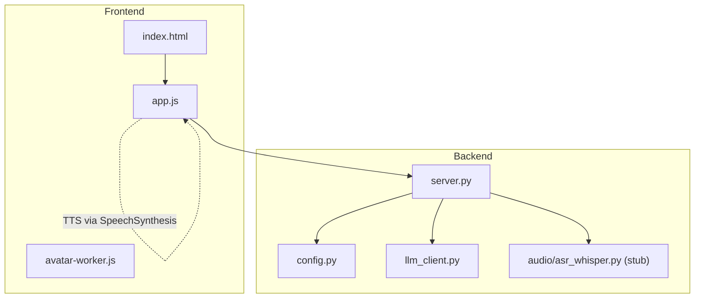
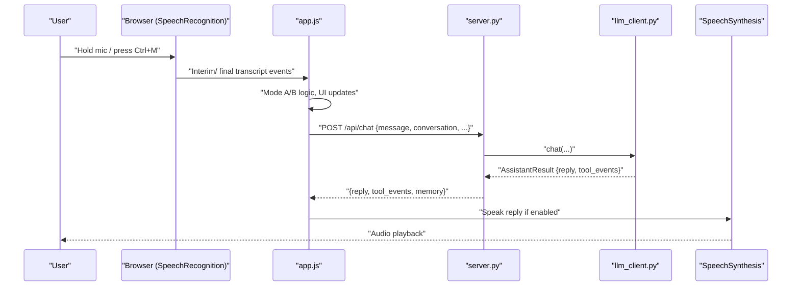
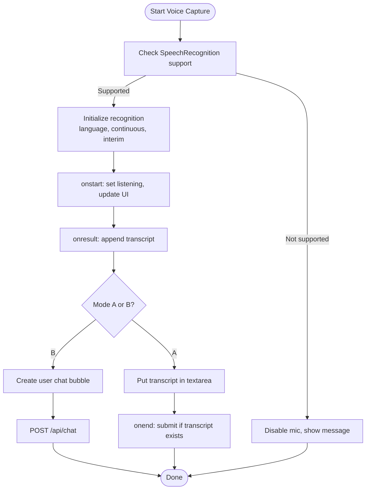
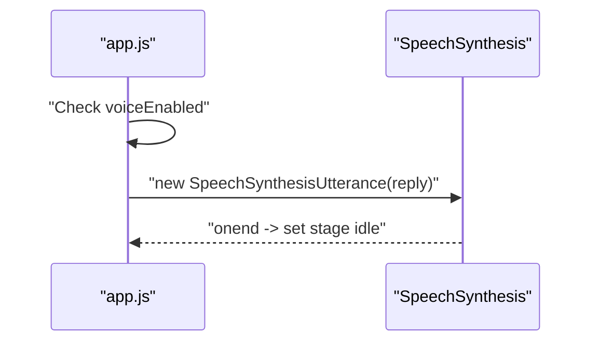
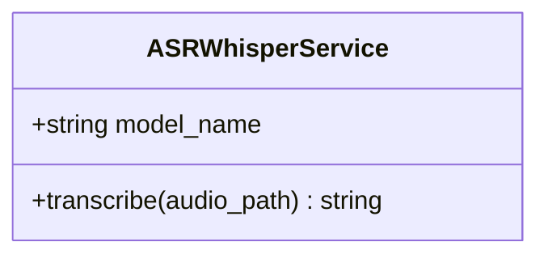
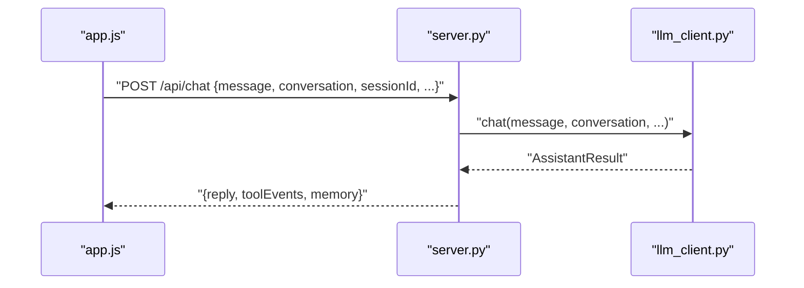
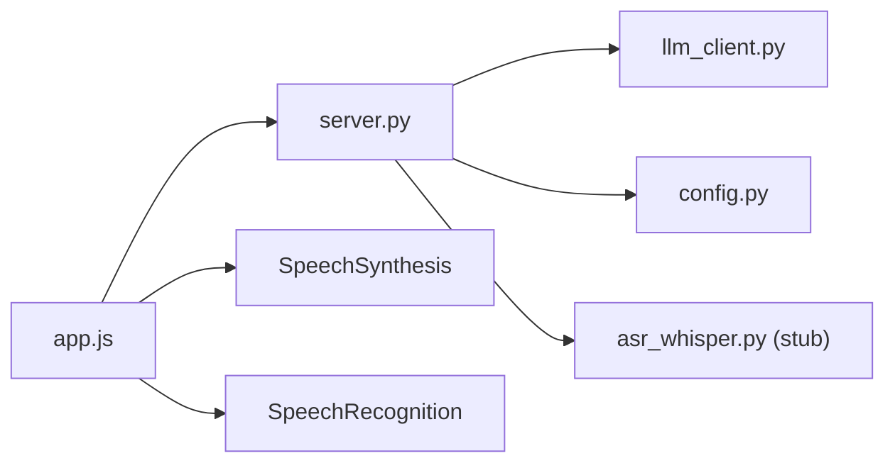

# Audio Processing and Voice Handling

<cite>
**Referenced Files in This Document**
- [README.md](file://README.md)
- [backend/audio/asr_whisper.py](file://backend/audio/asr_whisper.py)
- [backend/config.py](file://backend/config.py)
- [backend/server.py](file://backend/server.py)
- [backend/api_clients/llm_client.py](file://backend/api_clients/llm_client.py)
- [frontend/index.html](file://frontend/index.html)
- [frontend/scripts/app.js](file://frontend/scripts/app.js)
</cite>

## Table of Contents
1. [Introduction](#introduction)
2. [Project Structure](#project-structure)
3. [Core Components](#core-components)
4. [Architecture Overview](#architecture-overview)
5. [Detailed Component Analysis](#detailed-component-analysis)
6. [Dependency Analysis](#dependency-analysis)
7. [Performance Considerations](#performance-considerations)
8. [Troubleshooting Guide](#troubleshooting-guide)
9. [Conclusion](#conclusion)

## Introduction
This document explains the audio processing and voice handling capabilities of the Orbit Virtual Assistant. It covers the current voice input pipeline (browser SpeechRecognition), the planned Whisper-based Automatic Speech Recognition (ASR), integration with the assistant engine, and the text-to-speech (TTS) path. It also outlines supported audio formats, quality considerations, performance optimization, wake word detection, audio streaming, privacy/security, and platform-specific handling.

## Project Structure
The audio and voice features span the frontend and backend:

- Frontend: Voice input via browser SpeechRecognition, push-to-talk modes, and TTS using the browser SpeechSynthesis API.
- Backend: Placeholder for Whisper ASR, integration with the assistant engine, and configuration management.
- Configuration: Environment variables define live voice name and other runtime settings.

**Diagram sources**
- [frontend/index.html](file://frontend/index.html)
- [frontend/scripts/app.js](file://frontend/scripts/app.js)
- [backend/server.py](file://backend/server.py)
- [backend/api_clients/llm_client.py](file://backend/api_clients/llm_client.py)
- [backend/config.py](file://backend/config.py)
- [backend/audio/asr_whisper.py](file://backend/audio/asr_whisper.py)

**Section sources**
- [README.md:164-201](file://README.md#L164-L201)
- [frontend/index.html:1-338](file://frontend/index.html#L1-L338)
- [frontend/scripts/app.js:601-913](file://frontend/scripts/app.js#L601-L913)
- [backend/server.py:23-611](file://backend/server.py#L23-L611)
- [backend/api_clients/llm_client.py:38-366](file://backend/api_clients/llm_client.py#L38-L366)
- [backend/config.py:20-76](file://backend/config.py#L20-L76)
- [backend/audio/asr_whisper.py:1-19](file://backend/audio/asr_whisper.py#L1-L19)

## Core Components
- Voice input (browser SpeechRecognition): Implemented in the frontend with two modes:
  - Mode A (Ctrl+M): Record-then-review; transcript appears in the text area for manual confirmation.
  - Mode B (hold Control): Instant-send; transcript is submitted immediately.
- Text-to-speech (TTS): Implemented via the browser’s SpeechSynthesis API with a selectable voice.
- Whisper ASR (planned): A placeholder service class exists for future integration.
- Assistant engine integration: Voice transcripts are sent to the backend chat endpoint, which routes to the LLM client and tools.

**Section sources**
- [frontend/scripts/app.js:601-913](file://frontend/scripts/app.js#L601-L913)
- [frontend/scripts/app.js:1056-1071](file://frontend/scripts/app.js#L1056-L1071)
- [backend/audio/asr_whisper.py:10-19](file://backend/audio/asr_whisper.py#L10-L19)
- [backend/server.py:276-321](file://backend/server.py#L276-L321)
- [backend/api_clients/llm_client.py:38-366](file://backend/api_clients/llm_client.py#L38-L366)

## Architecture Overview
The voice pipeline flows from the browser to the backend and back to the user:

**Diagram sources**
- [frontend/scripts/app.js:601-913](file://frontend/scripts/app.js#L601-L913)
- [frontend/scripts/app.js:928-1087](file://frontend/scripts/app.js#L928-L1087)
- [backend/server.py:276-321](file://backend/server.py#L276-L321)
- [backend/api_clients/llm_client.py:38-366](file://backend/api_clients/llm_client.py#L38-L366)

## Detailed Component Analysis

### Voice Input Pipeline (Browser SpeechRecognition)
- SpeechRecognition setup:
  - Continuous, interim results, single alternative.
  - Language resolved from user preference or browser default.
- Modes:
  - Mode A: Transcript written to textarea; user presses Enter to send.
  - Mode B: Transcript posted immediately; chat bubble created.
- UI state:
  - Mic button active state, status text, and avatar stage state reflect listening/thinking/speaking.
- Error handling:
  - Errors reported to status; state reset on abort or error.

**Diagram sources**
- [frontend/scripts/app.js:601-913](file://frontend/scripts/app.js#L601-L913)

**Section sources**
- [frontend/scripts/app.js:601-913](file://frontend/scripts/app.js#L601-L913)
- [frontend/index.html:179-196](file://frontend/index.html#L179-L196)

### Text-to-Speech (TTS) Pipeline
- Enabled by a user toggle.
- Uses SpeechSynthesis to speak the assistant reply.
- Voice selection matches a configured voice name; falls back to default if not found.
- Completion triggers avatar idle state.

**Diagram sources**
- [frontend/scripts/app.js:1056-1071](file://frontend/scripts/app.js#L1056-L1071)

**Section sources**
- [frontend/scripts/app.js:1056-1071](file://frontend/scripts/app.js#L1056-L1071)
- [backend/config.py:31-31](file://backend/config.py#L31-L31)

### Whisper ASR Service (Planned)
- A class exists for Whisper-based ASR with a configurable model name.
- Currently raises a NotImplementedError, indicating future implementation.
- Intended to replace or complement browser SpeechRecognition for offline/local ASR.

**Diagram sources**
- [backend/audio/asr_whisper.py:10-19](file://backend/audio/asr_whisper.py#L10-L19)

**Section sources**
- [backend/audio/asr_whisper.py:1-19](file://backend/audio/asr_whisper.py#L1-L19)

### Integration with the Assistant Engine
- The frontend posts voice transcripts to the backend chat endpoint.
- The backend constructs a chat request and delegates to the LLM client.
- The LLM client selects provider logic and executes tools as needed.
- Responses include text replies and tool events; TTS can optionally speak the reply.

**Diagram sources**
- [frontend/scripts/app.js:928-1087](file://frontend/scripts/app.js#L928-L1087)
- [backend/server.py:276-321](file://backend/server.py#L276-L321)
- [backend/api_clients/llm_client.py:38-366](file://backend/api_clients/llm_client.py#L38-L366)

**Section sources**
- [frontend/scripts/app.js:928-1087](file://frontend/scripts/app.js#L928-L1087)
- [backend/server.py:276-321](file://backend/server.py#L276-L321)
- [backend/api_clients/llm_client.py:38-366](file://backend/api_clients/llm_client.py#L38-L366)

### Voice Commands and Wake Word Detection
- Current implementation uses push-to-talk (hold Control or Ctrl+M) and ESC to cancel.
- No dedicated wake word detection is present in the codebase.
- Future enhancements could integrate wake word engines (e.g., Porcupine, Snowboy) and a streaming microphone pipeline.

[No sources needed since this section provides conceptual guidance]

### Audio Streaming
- Screen sharing is implemented via browser APIs for context-aware assistance.
- Voice input uses SpeechRecognition events; no dedicated audio streaming pipeline is implemented.
- For advanced scenarios, a Web Audio API-based streamer could capture microphone input and send frames to the backend for ASR.

[No sources needed since this section provides conceptual guidance]

## Dependency Analysis
- Frontend depends on:
  - Browser SpeechRecognition for voice input.
  - SpeechSynthesis for TTS.
  - Local storage for user preferences.
- Backend depends on:
  - Configuration for provider and voice settings.
  - LLM client for chat orchestration.
  - MongoDB-backed memory store for persistence.
- ASR is currently decoupled; Whisper service is a stub awaiting implementation.

**Diagram sources**
- [frontend/scripts/app.js:601-913](file://frontend/scripts/app.js#L601-L913)
- [backend/server.py:23-611](file://backend/server.py#L23-L611)
- [backend/api_clients/llm_client.py:38-366](file://backend/api_clients/llm_client.py#L38-L366)
- [backend/config.py:20-76](file://backend/config.py#L20-L76)
- [backend/audio/asr_whisper.py:1-19](file://backend/audio/asr_whisper.py#L1-L19)

**Section sources**
- [frontend/scripts/app.js:601-913](file://frontend/scripts/app.js#L601-L913)
- [backend/server.py:23-611](file://backend/server.py#L23-L611)
- [backend/api_clients/llm_client.py:38-366](file://backend/api_clients/llm_client.py#L38-L366)
- [backend/config.py:20-76](file://backend/config.py#L20-L76)
- [backend/audio/asr_whisper.py:1-19](file://backend/audio/asr_whisper.py#L1-L19)

## Performance Considerations
- SpeechRecognition:
  - Keep recognition continuous and interim results enabled for responsiveness.
  - Debounce or throttle UI updates to reduce repaint overhead.
- TTS:
  - Cancel ongoing utterances before speaking new replies to avoid overlap.
  - Choose voices with appropriate speed and pitch for clarity.
- Whisper ASR (future):
  - Prefer smaller model sizes for latency; offload heavy decoding to GPU if available.
  - Stream audio frames to minimize buffering delays.
- Network:
  - Batch chat requests and reuse sessions to reduce overhead.
  - Enable compression and efficient JSON payloads.

[No sources needed since this section provides general guidance]

## Troubleshooting Guide
- SpeechRecognition not available:
  - The browser may not expose the API; the UI disables the mic and shows a message.
- Recognition errors:
  - Errors are surfaced to the status area; ensure microphone permissions and network connectivity.
- TTS issues:
  - Verify voice availability; fallback to default voice if configured voice is missing.
- Whisper ASR not implemented:
  - The service raises a NotImplementedError; implement or wire an alternative ASR backend.

**Section sources**
- [frontend/scripts/app.js:601-913](file://frontend/scripts/app.js#L601-L913)
- [frontend/scripts/app.js:1056-1071](file://frontend/scripts/app.js#L1056-L1071)
- [backend/audio/asr_whisper.py:17-18](file://backend/audio/asr_whisper.py#L17-L18)

## Conclusion
The Orbit Virtual Assistant currently provides robust browser-based voice input and TTS, with a clear path toward integrating Whisper ASR. The frontend offers flexible voice modes, while the backend integrates seamlessly with the assistant engine. Privacy is maintained by keeping voice data local until explicitly sent to providers. Future enhancements can include wake word detection, audio streaming, and optimized ASR pipelines.