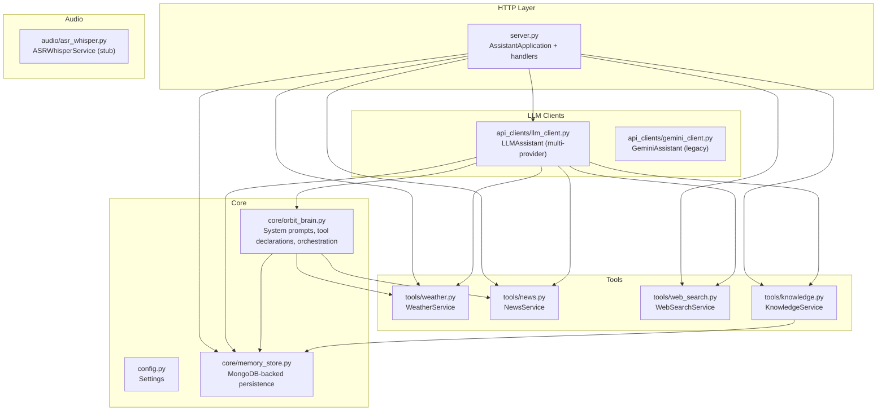
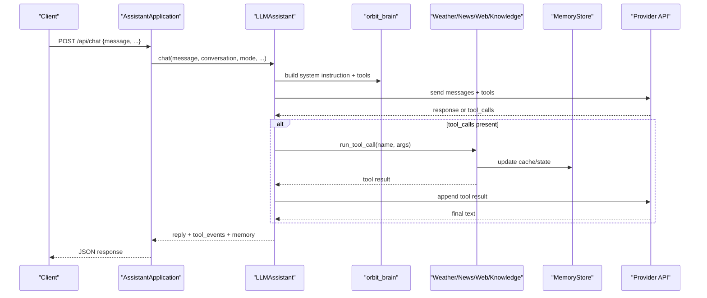
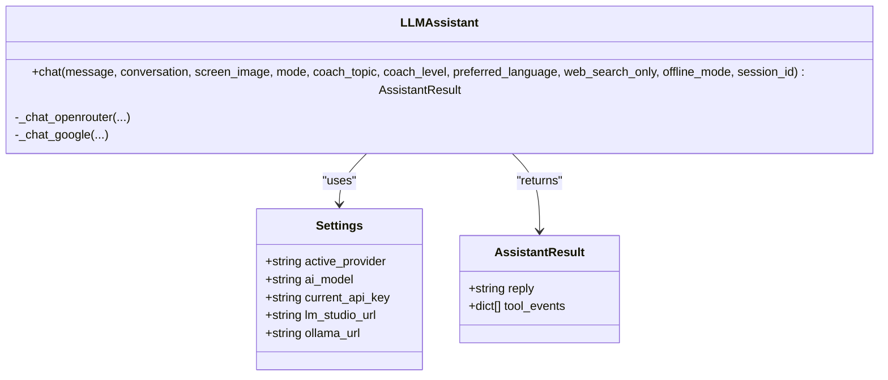
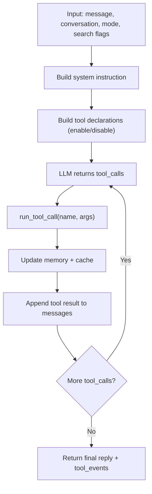
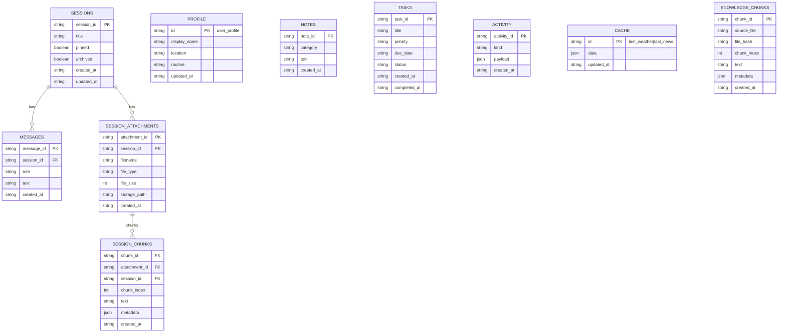
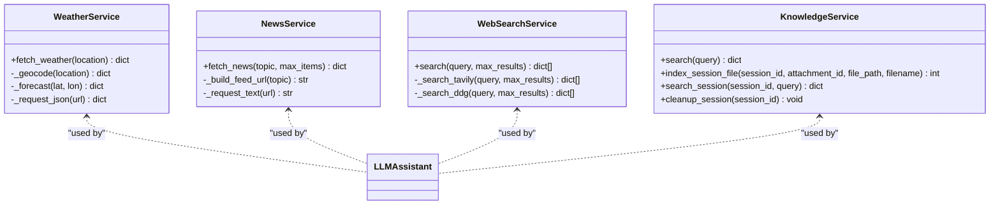
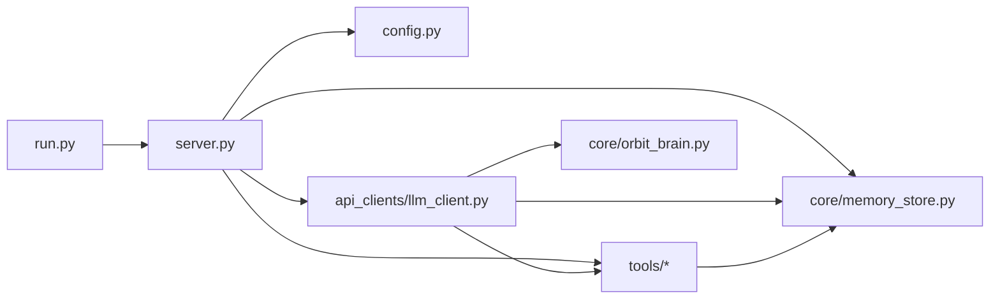

# Backend Components

<cite>
**Referenced Files in This Document**
- [server.py](file://backend/server.py)
- [config.py](file://backend/config.py)
- [orbit_brain.py](file://backend/core/orbit_brain.py)
- [memory_store.py](file://backend/core/memory_store.py)
- [llm_client.py](file://backend/api_clients/llm_client.py)
- [gemini_client.py](file://backend/api_clients/gemini_client.py)
- [news.py](file://backend/tools/news.py)
- [weather.py](file://backend/tools/weather.py)
- [web_search.py](file://backend/tools/web_search.py)
- [knowledge.py](file://backend/tools/knowledge.py)
- [asr_whisper.py](file://backend/audio/asr_whisper.py)
- [run.py](file://run.py)
- [requirements.txt](file://requirements.txt)
</cite>

## Table of Contents
1. [Introduction](#introduction)
2. [Project Structure](#project-structure)
3. [Core Components](#core-components)
4. [Architecture Overview](#architecture-overview)
5. [Detailed Component Analysis](#detailed-component-analysis)
6. [Dependency Analysis](#dependency-analysis)
7. [Performance Considerations](#performance-considerations)
8. [Troubleshooting Guide](#troubleshooting-guide)
9. [Conclusion](#conclusion)
10. [Appendices](#appendices)

## Introduction
This document describes the backend architecture of the Orbit Virtual Assistant. It covers the HTTP server implementation with API endpoints, the LLM integration layer supporting multiple providers, the AI assistant engine orchestrating tools, memory management backed by MongoDB, and tool services for external data retrieval. It explains request/response handling, error management, configuration options, inter-component communication, and practical integration patterns. It also addresses performance, security, and extensibility points for adding new components.

## Project Structure
The backend is organized around a modular design:
- HTTP server and routing: centralized in the server module
- Configuration: environment-driven settings
- AI brain: orchestration of prompts, tools, and LLM calls
- Memory store: MongoDB-backed persistence for sessions, messages, tasks, notes, and caches
- LLM clients: provider-agnostic chat orchestration
- Tools: weather, news, web search, and knowledge base services
- Audio: placeholder for ASR integration
- Entry point: a simple script to launch the server

**Diagram sources**
- [server.py:23-83](file://backend/server.py#L23-L83)
- [config.py:20-76](file://backend/config.py#L20-L76)
- [orbit_brain.py:14-268](file://backend/core/orbit_brain.py#L14-L268)
- [memory_store.py:67-150](file://backend/core/memory_store.py#L67-L150)
- [llm_client.py:38-366](file://backend/api_clients/llm_client.py#L38-L366)
- [gemini_client.py:36-207](file://backend/api_clients/gemini_client.py#L36-L207)
- [news.py:21-83](file://backend/tools/news.py#L21-L83)
- [weather.py:47-141](file://backend/tools/weather.py#L47-L141)
- [web_search.py:53-139](file://backend/tools/web_search.py#L53-L139)
- [knowledge.py:88-393](file://backend/tools/knowledge.py#L88-L393)
- [asr_whisper.py:10-19](file://backend/audio/asr_whisper.py#L10-L19)

**Section sources**
- [server.py:23-83](file://backend/server.py#L23-L83)
- [config.py:20-76](file://backend/config.py#L20-L76)

## Core Components
- HTTP server and API router: handles GET/POST/PUT/DELETE routes for sessions, messages, attachments, weather, news, and chat. It integrates with the assistant engine and memory store.
- Configuration: loads environment variables into a typed Settings object with defaults and provider-specific fields.
- AI brain: constructs system prompts, declares tools, runs tool calls, and manages search modes (web-only, offline, session docs).
- Memory store: MongoDB-backed persistence for sessions, messages, tasks, notes, profile, activity, caches, knowledge chunks, and session attachments/chunks.
- LLM clients: multi-provider chat orchestration supporting OpenRouter, LM Studio, Ollama, and Google APIs; includes tool loop handling and error mapping.
- Tools: weather, news, web search, and knowledge services with robust error handling and caching.
- Audio: placeholder for ASR integration.

**Section sources**
- [server.py:85-501](file://backend/server.py#L85-L501)
- [config.py:20-76](file://backend/config.py#L20-L76)
- [orbit_brain.py:14-502](file://backend/core/orbit_brain.py#L14-L502)
- [memory_store.py:67-947](file://backend/core/memory_store.py#L67-L947)
- [llm_client.py:38-366](file://backend/api_clients/llm_client.py#L38-L366)
- [news.py:21-83](file://backend/tools/news.py#L21-L83)
- [weather.py:47-141](file://backend/tools/weather.py#L47-L141)
- [web_search.py:53-139](file://backend/tools/web_search.py#L53-L139)
- [knowledge.py:88-393](file://backend/tools/knowledge.py#L88-L393)
- [asr_whisper.py:10-19](file://backend/audio/asr_whisper.py#L10-L19)

## Architecture Overview
The backend follows a layered architecture:
- Presentation: HTTP server exposes REST endpoints and serves static frontend assets.
- Application: AssistantApplication composes services and delegates to the LLM assistant and memory store.
- Orchestration: LLMAssistant builds messages, invokes provider APIs, and executes tool calls.
- Persistence: MemoryStore encapsulates MongoDB collections and indexes.
- Services: Tools provide external data retrieval and knowledge search.

**Diagram sources**
- [server.py:276-321](file://backend/server.py#L276-L321)
- [llm_client.py:47-216](file://backend/api_clients/llm_client.py#L47-L216)
- [orbit_brain.py:302-502](file://backend/core/orbit_brain.py#L302-L502)
- [memory_store.py:475-496](file://backend/core/memory_store.py#L475-L496)

## Detailed Component Analysis

### HTTP Server and API Endpoints
- Routing and handlers:
  - GET: serve frontend assets, state, sessions, messages, attachments, weather, news.
  - POST: create sessions, add messages, upload attachments, chat, profile update, tasks, notes.
  - PUT: update session metadata.
  - DELETE: delete sessions, attachments, messages, notes, tasks.
- Request/response handling:
  - JSON parsing helpers with fallbacks and validation.
  - Status codes and error payloads for malformed requests and service errors.
- Attachment upload:
  - Validates type and size, decodes base64, persists to disk, registers in MongoDB, parses and indexes for session search.
- State payload:
  - Aggregates provider info, memory, history, and sessions for UI initialization.

```mermaid
flowchart TD
Start(["Incoming Request"]) --> Route{"Route Match"}
Route --> |GET /api/state| State["Build state payload"]
Route --> |GET /api/sessions| ListSessions["List sessions"]
Route --> |GET /api/sessions/:id| GetSession["Get session"]
Route --> |GET /api/sessions/:id/messages| ListMsgs["List messages (limit)"]
Route --> |GET /api/sessions/:id/attachments| ListAtts["List attachments"]
Route --> |GET /api/weather| FetchW["Fetch weather"]
Route --> |GET /api/news| FetchN["Fetch news"]
Route --> |POST /api/sessions| CreateSess["Create session"]
Route --> |POST /api/sessions/:id/messages| AddMsg["Add message"]
Route --> |POST /api/sessions/:id/attachments| UploadAtt["Upload attachment"]
Route --> |POST /api/chat| Chat["Chat via LLMAssistant"]
Route --> |POST /api/profile| Prof["Update profile"]
Route --> |POST /api/tasks| Task["Add task"]
Route --> |POST /api/tasks/complete| CompleteTask["Complete task"]
Route --> |POST /api/notes| Note["Remember note"]
Route --> |PUT /api/sessions/:id| UpdateSess["Update session"]
Route --> |DELETE /api/sessions/:id| DelSess["Delete session + cleanup"]
Route --> |DELETE /api/sessions/:id/attachments/:attId| DelAtt["Delete attachment + cleanup"]
Route --> |DELETE /api/messages/:id| DelMsg["Delete message"]
Route --> |DELETE /api/notes/:id| DelNote["Delete note"]
Route --> |DELETE /api/tasks/:id| DelTask["Delete task"]
State --> Respond["Send JSON"]
ListSessions --> Respond
GetSession --> Respond
ListMsgs --> Respond
ListAtts --> Respond
FetchW --> Respond
FetchN --> Respond
CreateSess --> Respond
AddMsg --> Respond
UploadAtt --> Respond
Chat --> Respond
Prof --> Respond
Task --> Respond
CompleteTask --> Respond
Note --> Respond
UpdateSess --> Respond
DelSess --> Respond
DelAtt --> Respond
DelMsg --> Respond
DelNote --> Respond
DelTask --> Respond
```

**Diagram sources**
- [server.py:85-501](file://backend/server.py#L85-L501)

**Section sources**
- [server.py:85-501](file://backend/server.py#L85-L501)

### Configuration and Environment
- Settings class encapsulates:
  - Paths: root, web, data directories
  - Provider selection and keys
  - Model names and ports
  - Default location, voice name, RAG docs path
  - Local LLM URLs (LM Studio, Ollama)
  - MongoDB URI and database name
- Environment loading:
  - Reads .env and sets environment variables for runtime.
- Provider selection:
  - Runtime menu allows choosing provider and model at startup.

**Section sources**
- [config.py:20-76](file://backend/config.py#L20-L76)
- [server.py:566-611](file://backend/server.py#L566-L611)

### AI Assistant Engine (LLMAssistant)
- Responsibilities:
  - Build system instructions and tool declarations based on mode and capabilities.
  - Send messages to provider APIs (OpenRouter/LM Studio/Ollama/Google).
  - Manage tool loop: execute tool calls, collect events, and append tool responses until completion.
  - Map provider-specific payloads and headers.
- Modes and search modes:
  - Simple, Copilot, Coach modes with tailored instructions.
  - Web-only mode, offline mode, and session-docs availability toggle.
- Error handling:
  - Maps provider errors and moderation blocks to user-friendly messages.
  - Enforces tool loop limits to prevent runaway execution.

**Diagram sources**
- [llm_client.py:38-366](file://backend/api_clients/llm_client.py#L38-L366)
- [config.py:20-76](file://backend/config.py#L20-L76)

**Section sources**
- [llm_client.py:47-216](file://backend/api_clients/llm_client.py#L47-L216)
- [llm_client.py:217-366](file://backend/api_clients/llm_client.py#L217-L366)

### AI Brain Orchestration (orbit_brain)
- System prompts:
  - Base prompt, mode-specific prompts, language hints, and time-awareness.
  - Dynamic search-mode notes for web-only/offline toggles.
- Tool declarations:
  - Weather, news, memory, profile, tasks, notes, web search, local knowledge, session docs.
- Tool execution:
  - run_tool_call dispatches to services, updates memory, and records events.
- Conversation snapshot:
  - Builds a recent conversation snippet for context.

**Diagram sources**
- [orbit_brain.py:302-502](file://backend/core/orbit_brain.py#L302-L502)

**Section sources**
- [orbit_brain.py:14-387](file://backend/core/orbit_brain.py#L14-L387)
- [orbit_brain.py:389-502](file://backend/core/orbit_brain.py#L389-L502)

### Memory Management (MongoDB)
- Collections and indexes:
  - sessions, messages, profile, notes, tasks, activity, cache, knowledge_chunks, session_attachments, session_chunks.
- Operations:
  - Sessions: create, list, get, update, delete; maintains pinned/archived ordering.
  - Messages: add, list with limit, delete.
  - Tasks: add, complete, delete, list with filters.
  - Notes: add, delete.
  - Profile: update display name, location, routine.
  - Caches: last weather and last news.
  - Knowledge: store chunks, get hashes, clear, and session-scoped chunks.
  - Attachments: add, list, delete; cleanup session files.
- Concurrency:
  - Thread-safe operations guarded by a lock.
- Migration:
  - Automatic migration from legacy JSON files to MongoDB on first run.

**Diagram sources**
- [memory_store.py:23-62](file://backend/core/memory_store.py#L23-L62)

**Section sources**
- [memory_store.py:67-947](file://backend/core/memory_store.py#L67-L947)

### Tool Services
- Weather:
  - Geocoding and forecast retrieval with robust error handling.
- News:
  - RSS feed parsing with topic-based queries and error mapping.
- Web Search:
  - Tavily primary, DuckDuckGo fallback with spinner timing and graceful degradation.
- Knowledge:
  - Persistent knowledge base indexing (BM25 + optional FAISS hybrid), session-scoped document search, and lazy retriever caching.

**Diagram sources**
- [weather.py:47-141](file://backend/tools/weather.py#L47-L141)
- [news.py:21-83](file://backend/tools/news.py#L21-L83)
- [web_search.py:53-139](file://backend/tools/web_search.py#L53-L139)
- [knowledge.py:88-393](file://backend/tools/knowledge.py#L88-L393)

**Section sources**
- [weather.py:47-141](file://backend/tools/weather.py#L47-L141)
- [news.py:21-83](file://backend/tools/news.py#L21-L83)
- [web_search.py:53-139](file://backend/tools/web_search.py#L53-L139)
- [knowledge.py:88-393](file://backend/tools/knowledge.py#L88-L393)

### Audio ASR (Placeholder)
- ASRWhisperService is a stub indicating planned integration for speech-to-text transcription.

**Section sources**
- [asr_whisper.py:10-19](file://backend/audio/asr_whisper.py#L10-L19)

## Dependency Analysis
- External libraries:
  - MongoDB driver for persistence
  - ddgs for DuckDuckGo search
  - Optional: Tavily for enhanced web search
  - Optional: LangChain stack for RAG (document loaders, FAISS, BM25, embeddings)
- Internal dependencies:
  - server depends on config, LLM client, memory store, tools, and knowledge
  - LLM client depends on orbit_brain, memory store, tools, and knowledge
  - Tools depend on memory store for caching and knowledge for session docs

**Diagram sources**
- [run.py:1-6](file://run.py#L1-L6)
- [server.py:14-21](file://backend/server.py#L14-L21)
- [requirements.txt:10-29](file://requirements.txt#L10-L29)

**Section sources**
- [requirements.txt:10-29](file://requirements.txt#L10-L29)
- [server.py:14-21](file://backend/server.py#L14-L21)

## Performance Considerations
- Tool loop limits: enforced to prevent excessive iterations.
- Search result sizing: dynamic max results to balance quality and context pollution.
- Embedding availability: optional LM Studio embeddings enable hybrid retrievers; fallback to BM25-only if unavailable.
- Indexing and caching: knowledge base indexing occurs on startup and file changes; session retrievers are cached and invalidated on attachment changes.
- Network timeouts: provider API calls and external services use timeouts to avoid hanging.
- Concurrency: thread lock around write operations to ensure consistency.

[No sources needed since this section provides general guidance]

## Troubleshooting Guide
- Missing API keys:
  - Provider-specific keys must be configured; otherwise, chat requests raise client errors.
- Provider unavailability:
  - HTTP/URLError exceptions are mapped to user-friendly messages; moderation blocks return a safety message.
- Tool errors:
  - Weather and news services raise domain-specific errors; tool execution catches and reports them.
- MongoDB connection failures:
  - ConnectionFailure raises a runtime error with guidance to start the MongoDB server.
- Attachment upload issues:
  - Type validation, size checks, and base64 decoding errors are handled with explicit error messages.
- Session cleanup:
  - Deleting sessions removes attachments and associated files from disk; ensure disk cleanup is performed.

**Section sources**
- [llm_client.py:158-175](file://backend/api_clients/llm_client.py#L158-L175)
- [llm_client.py:34-36](file://backend/api_clients/llm_client.py#L34-L36)
- [news.py:13-14](file://backend/tools/news.py#L13-L14)
- [weather.py:43-44](file://backend/tools/weather.py#L43-L44)
- [memory_store.py:94-98](file://backend/core/memory_store.py#L94-L98)
- [server.py:336-362](file://backend/server.py#L336-L362)
- [server.py:432-446](file://backend/server.py#L432-L446)

## Conclusion
The Orbit Virtual Assistant backend provides a robust, modular architecture centered on a multi-provider LLM client, a flexible AI brain for tool orchestration, and a MongoDB-backed memory store. The HTTP server offers a comprehensive API for chat, sessions, attachments, and external integrations. The design emphasizes extensibility, performance, and resilience, with clear separation of concerns and strong error handling.

[No sources needed since this section summarizes without analyzing specific files]

## Appendices

### API Endpoints Summary
- GET
  - /api/state: provider, API key presence, model, default location, voice, memory, history, sessions
  - /api/sessions: list sessions
  - /api/sessions/:id: get session
  - /api/sessions/:id/messages: list messages with optional limit
  - /api/sessions/:id/attachments: list attachments
  - /api/weather: fetch weather for location
  - /api/news: fetch news for topic
- POST
  - /api/sessions: create session
  - /api/sessions/:id/messages: add message
  - /api/sessions/:id/attachments: upload attachment (base64)
  - /api/chat: chat with assistant
  - /api/profile: update profile
  - /api/tasks: add task
  - /api/tasks/complete: complete task
  - /api/notes: remember note
- PUT
  - /api/sessions/:id: update title/pinned/archived
- DELETE
  - /api/sessions/:id: delete session and attachments
  - /api/sessions/:id/attachments/:id: delete attachment
  - /api/messages/:id: delete message
  - /api/notes/:id: delete note
  - /api/tasks/:id: delete task

**Section sources**
- [server.py:85-501](file://backend/server.py#L85-L501)

### Configuration Options
- Settings fields:
  - Provider selection, API keys, model names, port, default location, voice name, RAG docs path, local LLM URLs, MongoDB URI and database.
- Environment variables loaded via .env:
  - ACTIVE_PROVIDER, GOOGLE_API_KEY, OPENROUTER_API_KEY, AI_MODEL, ASSISTANT_PORT, LIVE_VOICE_NAME, DEFAULT_LOCATION, RAG_DOCS_PATH, LM_STUDIO_URL, OLLAMA_URL, MONGODB_URI, MONGODB_DB.

**Section sources**
- [config.py:20-76](file://backend/config.py#L20-L76)

### Extensibility Points
- Adding a new provider:
  - Extend LLMAssistant with a new provider branch and endpoint mapping.
- Adding a new tool:
  - Define tool declaration, implement service, and integrate into run_tool_call.
- New persistence needs:
  - Add a new collection to MemoryStore with indexes and CRUD methods.
- New external service:
  - Wrap in a service class with error handling and integrate via the brain or LLM client.

[No sources needed since this section provides general guidance]