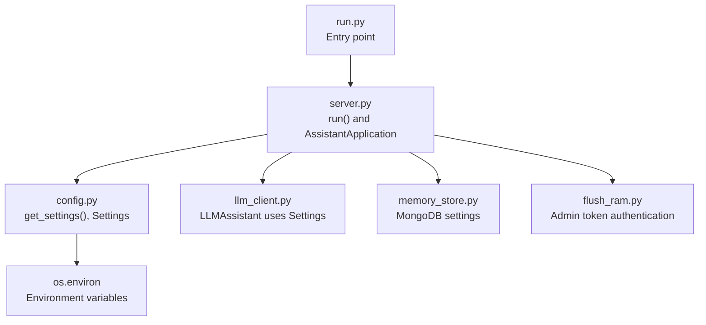
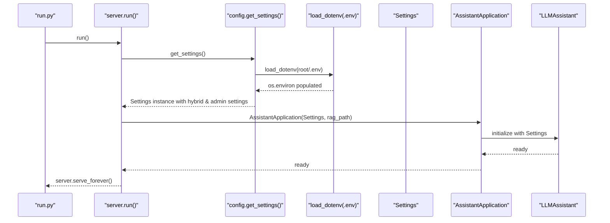
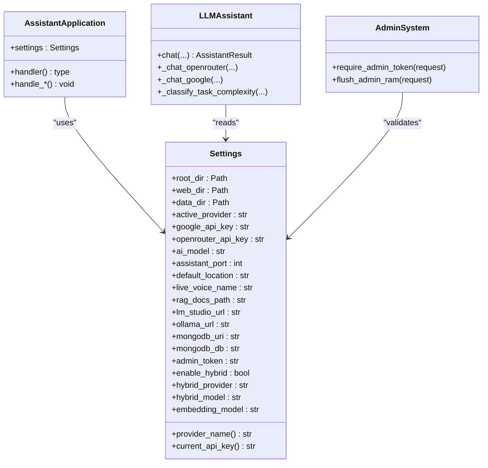
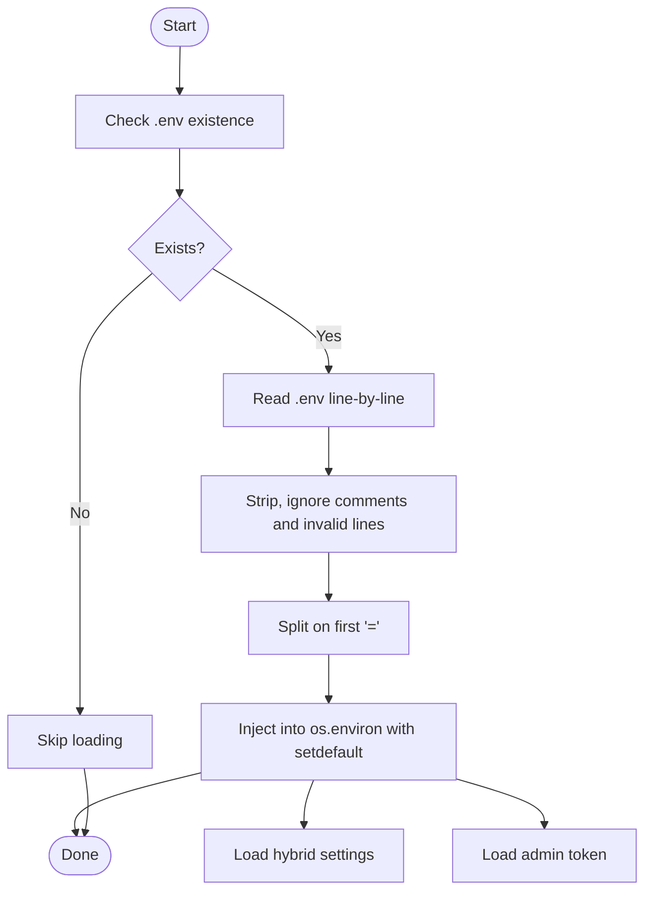
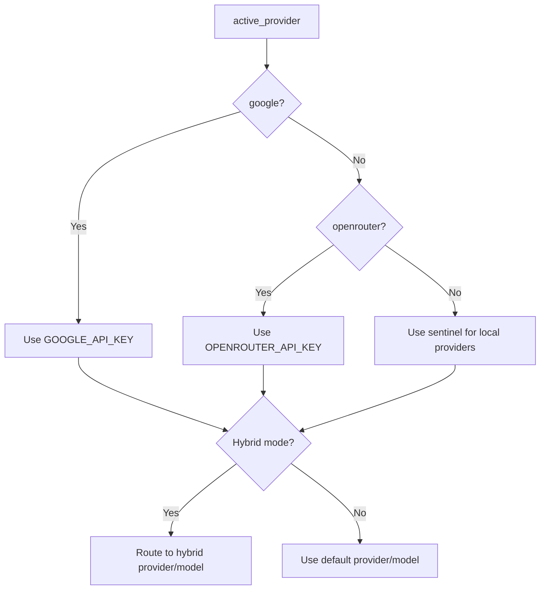
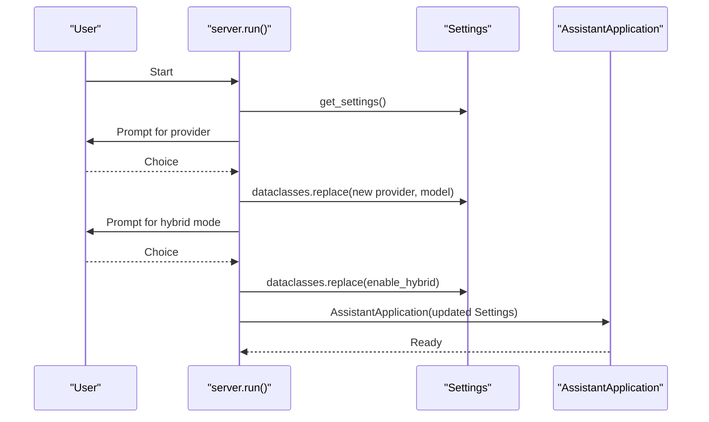
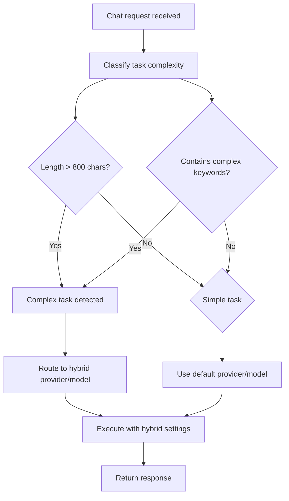
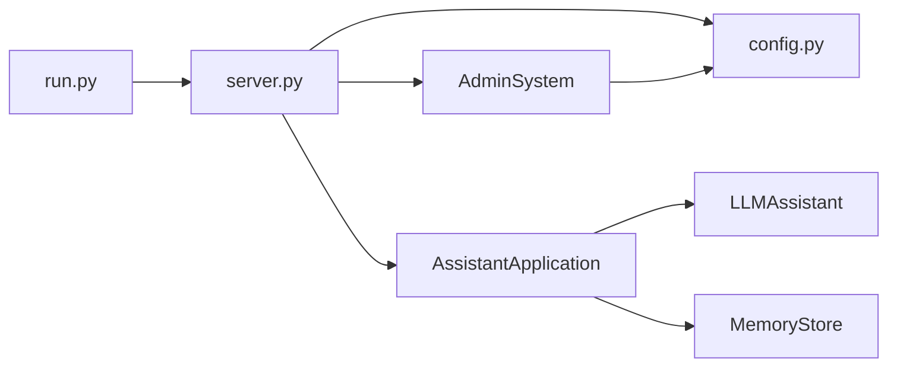

# Configuration and Settings Management

<cite>
**Referenced Files in This Document**
- [config.py](file://backend/config.py)
- [server.py](file://backend/server.py)
- [llm_client.py](file://backend/api_clients/llm_client.py)
- [memory_store.py](file://backend/core/memory_store.py)
- [README.md](file://README.md)
- [.gitignore](file://.gitignore)
- [requirements.txt](file://requirements.txt)
- [run.py](file://run.py)
- [flush_ram.py](file://flush_ram.py)
</cite>

## Update Summary
**Changes Made**
- Added documentation for new hybrid mode configuration with `enable_hybrid`, `hybrid_provider`, and `hybrid_model` settings
- Documented admin token configuration and admin endpoint requirements
- Updated environment variable handling to cover new configuration options
- Enhanced provider selection logic documentation to include hybrid mode routing
- Added security considerations for admin token management

## Table of Contents
1. [Introduction](#introduction)
2. [Project Structure](#project-structure)
3. [Core Components](#core-components)
4. [Architecture Overview](#architecture-overview)
5. [Detailed Component Analysis](#detailed-component-analysis)
6. [Dependency Analysis](#dependency-analysis)
7. [Performance Considerations](#performance-considerations)
8. [Troubleshooting Guide](#troubleshooting-guide)
9. [Conclusion](#conclusion)
10. [Appendices](#appendices)

## Introduction
This document explains the configuration and settings management system used by the Orbit Virtual Assistant. It covers how environment variables are loaded from a .env file, how the Settings class encapsulates configuration, provider selection logic, API key management, runtime configuration changes, defaults, and validation behaviors. The system now includes enhanced hybrid mode settings for intelligent model routing, admin token configuration for secure administrative operations, and improved environment variable handling for better deployment flexibility. It also includes guidance on environment-specific settings, migration strategies, and security best practices for API keys and administrative access.

## Project Structure
The configuration system centers around a single module that defines the Settings dataclass and an environment loader, and integrates with the server runtime, LLM client, and admin functionality.

**Diagram sources**
- [run.py:1-6](file://run.py#L1-L6)
- [server.py:566-610](file://backend/server.py#L566-L610)
- [config.py:55-89](file://backend/config.py#L55-L89)
- [llm_client.py:38-46](file://backend/api_clients/llm_client.py#L38-L46)
- [memory_store.py:79-109](file://backend/core/memory_store.py#L79-L109)
- [flush_ram.py:15-33](file://flush_ram.py#L15-L33)

**Section sources**
- [run.py:1-6](file://run.py#L1-L6)
- [server.py:566-610](file://backend/server.py#L566-L610)
- [config.py:55-89](file://backend/config.py#L55-L89)

## Core Components
- **Settings dataclass**: Holds all configuration values, including provider selection, API keys, model identifiers, ports, locations, database settings, admin tokens, and new hybrid mode settings.
- **Environment loader**: Reads a .env file and injects values into os.environ using os.environ.setdefault, ensuring existing values are preserved.
- **Runtime overrides**: The server allows interactive selection of provider and model at startup, producing a new Settings instance via dataclasses.replace.
- **Hybrid Mode**: Intelligent model routing system that automatically selects appropriate models based on task complexity.
- **Admin Token System**: Secure administrative access control with token-based authentication for sensitive operations.

Key behaviors:
- **Provider selection**: active_provider controls which API key and endpoint logic are used.
- **API key management**: current_api_key property selects the appropriate key based on active_provider.
- **Hybrid routing**: Automatic model selection based on task complexity classification.
- **Admin access**: Token-based authentication for administrative endpoints.
- **Defaults**: get_settings() supplies sensible defaults for optional values and ensures required values fall back to defaults when missing.

**Section sources**
- [config.py:20-89](file://backend/config.py#L20-L89)
- [server.py:566-610](file://backend/server.py#L566-L610)

## Architecture Overview
The configuration pipeline loads environment variables, constructs Settings, and passes it through the application stack with enhanced hybrid mode and admin token capabilities.

**Diagram sources**
- [run.py:1-6](file://run.py#L1-L6)
- [server.py:566-610](file://backend/server.py#L566-L610)
- [config.py:8-17](file://backend/config.py#L8-L17)
- [config.py:62-89](file://backend/config.py#L62-L89)

## Detailed Component Analysis

### Settings class and environment loading
- **Settings fields**: Include provider identifiers, API keys, model names, ports, locations, voice names, RAG paths, local LLM URLs, MongoDB settings, admin tokens, and new hybrid mode configurations.
- **Hybrid Mode Fields**: `enable_hybrid` (bool), `hybrid_provider` (str), and `hybrid_model` (str) for intelligent model routing.
- **Admin Token Field**: `admin_token` (str) for secure administrative access.
- **Provider name mapping**: The provider_name property maps active_provider to a human-readable label.
- **API key resolution**: The current_api_key property returns the active API key depending on provider, with a sentinel for local providers.
- **Environment loading**: get_settings() builds Settings by reading environment variables with defaults for missing values.

**Updated** Enhanced with hybrid mode settings and admin token configuration

Validation and defaults:
- Missing environment variables are filled by defaults in get_settings().
- Numeric values are cast appropriately (e.g., port).
- String trimming and fallbacks ensure reasonable defaults for optional fields.
- Hybrid mode defaults to disabled with OpenRouter as provider and GPT-4o as model.
- Admin token defaults to empty string for security.

**Section sources**
- [config.py:20-89](file://backend/config.py#L20-L89)

### Environment variable loading (.env)
- **load_dotenv function**: Reads a .env file line-by-line, ignoring blank lines and comments, and splits on the first '=' to extract key/value pairs.
- **Value injection**: Values are stripped of whitespace and surrounding quotes before being injected into os.environ using os.environ.setdefault, preserving any pre-existing values.
- **New environment variables**: Supports ADMIN_TOKEN, HYBRID_PROVIDER, HYBRID_MODEL, and EMBEDDING_MODEL environment variables.

**Updated** Enhanced to handle new configuration options

Behavioral implications:
- Existing environment variables take precedence over .env values.
- Comments and malformed lines are ignored.
- New hybrid and admin configuration options are now supported.

**Section sources**
- [config.py:8-17](file://backend/config.py#L8-L17)

### Provider selection logic and API key management
- **Active provider determination**: active_provider controls which API key is considered current via current_api_key.
- **API key resolution**: For OpenRouter and Google providers, the system expects API keys; otherwise, a sentinel indicates local-only operation.
- **Hybrid mode routing**: When enabled, the system classifies task complexity and routes to hybrid provider/model for complex tasks.
- **LLM client enforcement**: The LLM client enforces presence of a valid API key and raises a clear error if missing.

**Updated** Enhanced with hybrid mode routing logic

Endpoints and headers:
- **OpenRouter**: Uses dedicated endpoint and Authorization header with the current API key.
- **Google**: Uses REST endpoint with x-goog-api-key header.
- **Local providers**: LM Studio and Ollama use configurable URLs and do not require cloud API keys.
- **Hybrid routing**: Automatic model switching based on task complexity classification.

**Section sources**
- [config.py:38-59](file://backend/config.py#L38-L59)
- [llm_client.py:89-96](file://backend/api_clients/llm_client.py#L89-L96)
- [llm_client.py:141-149](file://backend/api_clients/llm_client.py#L141-L149)
- [llm_client.py:306-314](file://backend/api_clients/llm_client.py#L306-L314)

### Runtime configuration changes
- **Initial Settings construction**: The server's run() function constructs initial Settings from .env.
- **Interactive provider selection**: Offers interactive selection of provider and model at startup.
- **Hybrid mode activation**: Allows users to enable hybrid mode with intelligent routing capabilities.
- **RAG enablement**: Handles dynamic selection of the knowledge base path during startup.
- **Settings replacement**: Creates new Settings instances via dataclasses.replace with updated provider/model values.

**Updated** Enhanced with hybrid mode configuration

**Section sources**
- [server.py:566-610](file://backend/server.py#L566-L610)

### Configuration inheritance patterns and override mechanisms
- **Inheritance pattern**: Settings inherits defaults from environment variables and .env values.
- **Override mechanism**: os.environ values take precedence over .env values due to os.environ.setdefault semantics.
- **Runtime override**: dataclasses.replace produces a new Settings instance with updated provider/model values.
- **Hybrid mode overrides**: Hybrid settings can be dynamically enabled/disabled at runtime.

**Updated** Enhanced with hybrid mode override capabilities

**Section sources**
- [config.py:8-17](file://backend/config.py#L8-L17)
- [server.py:581-588](file://backend/server.py#L581-L588)

### Environment-specific settings
- **Multiple environment support**: The .env file supports different environments by setting ACTIVE_PROVIDER, AI_MODEL, provider-specific model variables, and local LLM endpoints.
- **Hybrid mode configuration**: Supports HYBRID_PROVIDER and HYBRID_MODEL environment variables for different deployment scenarios.
- **Admin token configuration**: ADMIN_TOKEN environment variable enables secure administrative access.
- **Server startup verification**: The server prints the current provider and model at startup, enabling quick verification of environment-specific settings.

**Updated** Enhanced with hybrid and admin configuration options

**Section sources**
- [README.md:104-136](file://README.md#L104-L136)
- [server.py:569-590](file://backend/server.py#L569-L590)

### .env file structure, required and optional parameters, and defaults
- **Required parameters**: ACTIVE_PROVIDER determines provider selection and API key usage.
- **Cloud provider API keys**: GOOGLE_API_KEY and OPENROUTER_API_KEY for cloud-based providers.
- **Admin token**: ADMIN_TOKEN for secure administrative access to endpoints.
- **Hybrid mode settings**: HYBRID_PROVIDER and HYBRID_MODEL for intelligent model routing.
- **Embedding model**: EMBEDDING_MODEL for local RAG functionality.
- **Optional parameters**: Provider-specific model variables, local LLM endpoints, RAG configuration, and MongoDB settings.

**Updated** Enhanced with new configuration options

Defaults:
- get_settings() supplies defaults for optional values including hybrid mode (disabled), admin token (empty), embedding model, and other configuration options.

**Section sources**
- [README.md:104-136](file://README.md#L104-L136)
- [config.py:59-89](file://backend/config.py#L59-L89)

### Configuration validation and error handling
- **Missing API keys**: The LLM client checks current_api_key and raises a clear error instructing to verify .env.
- **Admin token validation**: require_admin_token function validates admin token for administrative endpoints.
- **MongoDB connectivity**: MemoryStore validates MongoDB availability early and raises a descriptive error if unreachable.
- **Web search and weather**: Services validate inputs and raise domain-specific errors.

**Updated** Enhanced with admin token validation

**Section sources**
- [llm_client.py:60-61](file://backend/api_clients/llm_client.py#L60-L61)
- [memory_store.py:86-98](file://backend/core/memory_store.py#L86-L98)
- [server.py:180-189](file://backend/server.py#L180-L189)

### Configuration migration and version compatibility
- **Legacy JSON migration**: The application migrates legacy JSON files to MongoDB on first run, then renames them to .bak to avoid re-running migration.
- **MongoDB settings**: The system uses configurable URI and database name, supporting local and remote deployments.
- **Backward compatibility**: New configuration options are optional and don't break existing deployments.

**Updated** Enhanced with backward compatibility considerations

**Section sources**
- [server.py:23-48](file://backend/server.py#L23-L48)
- [memory_store.py:837-858](file://backend/core/memory_store.py#L837-L858)

### Deployment-specific configuration strategies
- **Separate .env per environment**: Keep environment-specific values in separate .env files and load them via OS environment or container secrets.
- **Containerization**: Set environment variables at runtime; avoid committing .env to version control.
- **Version control exclusion**: .gitignore excludes .env, protecting secrets.
- **Admin token deployment**: Configure ADMIN_TOKEN for production environments requiring administrative access.

**Updated** Enhanced with admin token deployment considerations

**Section sources**
- [.gitignore:1-6](file://.gitignore#L1-L6)
- [README.md:104-136](file://README.md#L104-L136)

### Security best practices for API key management
- **Never commit .env or API keys**: Rely on .gitignore protection and environment variable management.
- **Prefer environment variables**: Use os.environ to override .env values for deployment flexibility.
- **Provider-specific model variables**: Decouple model selection from API keys for better security.
- **Local provider sentinel**: For local providers, current_api_key returns a sentinel indicating no cloud key is required.
- **Admin token security**: Store ADMIN_TOKEN securely and rotate tokens regularly for administrative access.

**Updated** Enhanced with admin token security considerations

**Section sources**
- [.gitignore:1-6](file://.gitignore#L1-L6)
- [config.py:48-52](file://backend/config.py#L48-L52)

### Hybrid Mode Configuration and Implementation
- **Intelligent routing**: Hybrid mode automatically classifies task complexity and routes to appropriate models.
- **Complex task detection**: Tasks exceeding 800 characters or containing specific keywords are classified as complex.
- **Model upgrade**: Complex tasks are routed to hybrid provider/model (default: OpenRouter/GPT-4o).
- **Simple task optimization**: Simple tasks use default provider/model for efficiency.
- **Dynamic routing**: Routing decision occurs during chat processing based on message analysis.

**New Section**

**Section sources**
- [llm_client.py:55-96](file://backend/api_clients/llm_client.py#L55-L96)
- [server.py:541-552](file://backend/server.py#L541-L552)

### Admin Token Configuration and Security
- **Token-based authentication**: ADMIN_TOKEN enables secure access to administrative endpoints.
- **Header-based validation**: X-Admin-Token header required for admin operations.
- **Endpoint protection**: /api/admin/flush endpoint requires valid admin token.
- **Security enforcement**: Missing or invalid tokens result in 403 Forbidden responses.

**New Section**

**Section sources**
- [config.py:38](file://backend/config.py#L38)
- [server.py:24](file://backend/server.py#L24)
- [server.py:180-189](file://backend/server.py#L180-L189)
- [flush_ram.py:17-33](file://flush_ram.py#L17-L33)

## Architecture Overview

**Diagram sources**
- [config.py:20-89](file://backend/config.py#L20-L89)
- [server.py:23-63](file://backend/server.py#L23-L63)
- [llm_client.py:38-78](file://backend/api_clients/llm_client.py#L38-L78)
- [server.py:180-189](file://backend/server.py#L180-L189)

## Detailed Component Analysis

### Environment loading flow

**Diagram sources**
- [config.py:8-17](file://backend/config.py#L8-L17)

### Provider selection and API key resolution

**Diagram sources**
- [config.py:38-59](file://backend/config.py#L38-L59)

### Runtime provider change sequence

**Diagram sources**
- [server.py:566-610](file://backend/server.py#L566-L610)

### Hybrid Mode Routing Logic

**Diagram sources**
- [llm_client.py:55-96](file://backend/api_clients/llm_client.py#L55-L96)

## Dependency Analysis
- **Backend entry point**: Depends on server.run().
- **Server runtime**: Depends on config.get_settings() and constructs AssistantApplication.
- **AssistantApplication**: Depends on Settings and initializes MemoryStore and LLMAssistant.
- **LLMAssistant**: Depends on Settings for provider selection, API keys, model endpoints, and hybrid mode configuration.
- **Admin system**: Depends on Settings for admin token validation and secure endpoint access.

**Updated** Enhanced with admin system dependencies

**Diagram sources**
- [run.py:1-6](file://run.py#L1-L6)
- [server.py:566-610](file://backend/server.py#L566-L610)
- [config.py:55-89](file://backend/config.py#L55-L89)
- [llm_client.py:38-46](file://backend/api_clients/llm_client.py#L38-L46)
- [memory_store.py:79-109](file://backend/core/memory_store.py#L79-L109)

**Section sources**
- [run.py:1-6](file://run.py#L1-L6)
- [server.py:566-610](file://backend/server.py#L566-L610)
- [config.py:55-89](file://backend/config.py#L55-L89)

## Performance Considerations
- **Environment loading**: Linear in the number of lines in .env; negligible overhead.
- **Settings construction**: Occurs once at startup; runtime cost is minimal.
- **Provider selection**: Constant-time lookups with hybrid mode adding minimal classification overhead.
- **Hybrid routing**: Task complexity classification adds minimal computational overhead.
- **Admin token validation**: Header-based validation is constant-time.

**Updated** Enhanced with hybrid mode and admin token performance considerations

## Troubleshooting Guide
Common issues and resolutions:
- **Missing API key for cloud provider**:
  - Symptom: Error indicating API key is missing.
  - Resolution: Add the appropriate key to .env (GOOGLE_API_KEY or OPENROUTER_API_KEY).
- **Admin token configuration issues**:
  - Symptom: 403 Forbidden errors on admin endpoints.
  - Resolution: Configure ADMIN_TOKEN in .env and ensure X-Admin-Token header matches.
- **Hybrid mode not working**:
  - Symptom: Hybrid mode not activating despite configuration.
  - Resolution: Verify enable_hybrid is set to true and hybrid_provider/hybrid_model are properly configured.
- **MongoDB connection failure**:
  - Symptom: Startup error indicating inability to connect to MongoDB.
  - Resolution: Verify MONGODB_URI and ensure the database is reachable.
- **Incorrect provider or model**:
  - Symptom: Unexpected provider behavior or model mismatch.
  - Resolution: Confirm ACTIVE_PROVIDER and model variables in .env; re-run with interactive selection if needed.
- **.env not taking effect**:
  - Symptom: Changes to .env not reflected.
  - Resolution: Ensure os.environ does not override values; restart the process to reload .env.

**Updated** Enhanced with hybrid mode and admin token troubleshooting

**Section sources**
- [llm_client.py:60-61](file://backend/api_clients/llm_client.py#L60-L61)
- [memory_store.py:86-98](file://backend/core/memory_store.py#L86-L98)
- [server.py:569-590](file://backend/server.py#L569-L590)
- [server.py:180-189](file://backend/server.py#L180-L189)

## Conclusion
The configuration system is intentionally simple and robust with enhanced capabilities: a .env loader injects environment variables with safe defaults, a Settings dataclass centralizes configuration including new hybrid mode and admin token settings, and runtime overrides allow flexible provider and model selection. Security is addressed by excluding .env from version control, returning sentinels for local providers, and implementing token-based admin access control. MongoDB settings and migration logic support both local and production deployments, while hybrid mode provides intelligent model routing for optimal performance and cost efficiency.

**Updated** Enhanced conclusion with hybrid mode and admin token capabilities

## Appendices

### Appendix A: Required and Optional Configuration Fields
- **Required (when applicable)**: ACTIVE_PROVIDER, API keys for chosen provider, ADMIN_TOKEN for admin access.
- **Hybrid mode**: enable_hybrid, hybrid_provider, hybrid_model for intelligent routing.
- **Optional**: Provider-specific model variables, local LLM endpoints, RAG path, MongoDB settings, embedding model.

**Updated** Enhanced with hybrid mode and admin token configuration

**Section sources**
- [README.md:104-136](file://README.md#L104-L136)
- [config.py:59-89](file://backend/config.py#L59-L89)

### Appendix B: Environment Variables and Defaults Reference
- **ACTIVE_PROVIDER**: default "google"
- **GOOGLE_API_KEY**: default empty
- **OPENROUTER_API_KEY**: default empty
- **ADMIN_TOKEN**: default empty (for admin access)
- **HYBRID_PROVIDER**: default "openrouter" (when hybrid mode enabled)
- **HYBRID_MODEL**: default "openai/gpt-4o" (when hybrid mode enabled)
- **ENABLE_HYBRID**: default False
- **EMBEDDING_MODEL**: default "text-embedding-bge-m3"
- **AI_MODEL**: default "gemini-2.5-flash"
- **ASSISTANT_PORT**: default 8000
- **LIVE_VOICE_NAME**: default "Nanami"
- **DEFAULT_LOCATION**: default "Ho Chi Minh City"
- **LM_STUDIO_URL**: default "http://127.0.0.1:1234/v1"
- **OLLAMA_URL**: default "http://127.0.0.1:11434/v1"
- **MONGODB_URI**: default "mongodb://localhost:27017"
- **MONGODB_DB**: default "orbit_assistant"

**Updated** Enhanced with hybrid mode and admin token defaults

**Section sources**
- [config.py:63-89](file://backend/config.py#L63-L89)

### Appendix C: Hybrid Mode Configuration Examples
- **Enable hybrid mode**: Set ENABLE_HYBRID=true in .env
- **Custom hybrid provider**: Set HYBRID_PROVIDER=openrouter in .env
- **Custom hybrid model**: Set HYBRID_MODEL=openai/gpt-4o in .env
- **Task classification**: Messages >800 characters or containing "analyze", "optimize", "refactor", "explain code", "calculate", "prove", "derive", "logic" trigger hybrid routing.

**New Section**

**Section sources**
- [config.py:40-44](file://backend/config.py#L40-L44)
- [llm_client.py:55-96](file://backend/api_clients/llm_client.py#L55-L96)

### Appendix D: Admin Token Security Best Practices
- **Secure storage**: Store ADMIN_TOKEN in environment variables or secret management systems
- **Token rotation**: Regularly rotate admin tokens and update .env files accordingly
- **Access control**: Limit ADMIN_TOKEN distribution to authorized administrators only
- **Endpoint protection**: All admin endpoints require valid X-Admin-Token header
- **Monitoring**: Monitor admin endpoint access logs for suspicious activity

**New Section**

**Section sources**
- [config.py:38](file://backend/config.py#L38)
- [server.py:24](file://backend/server.py#L24)
- [server.py:180-189](file://backend/server.py#L180-L189)