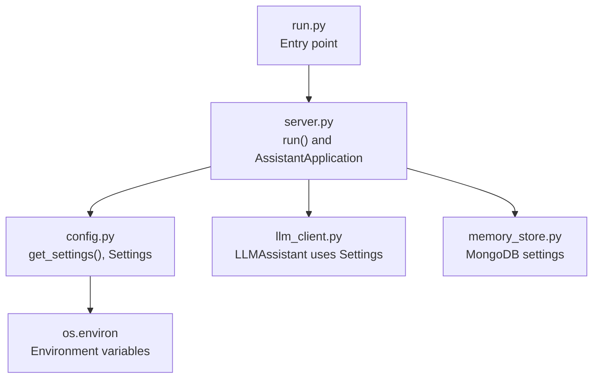
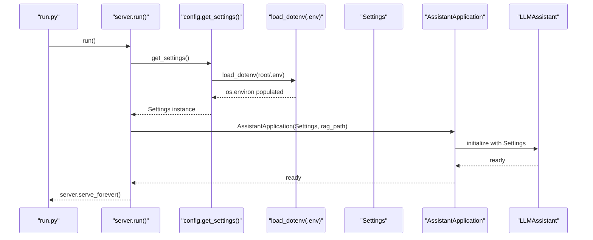
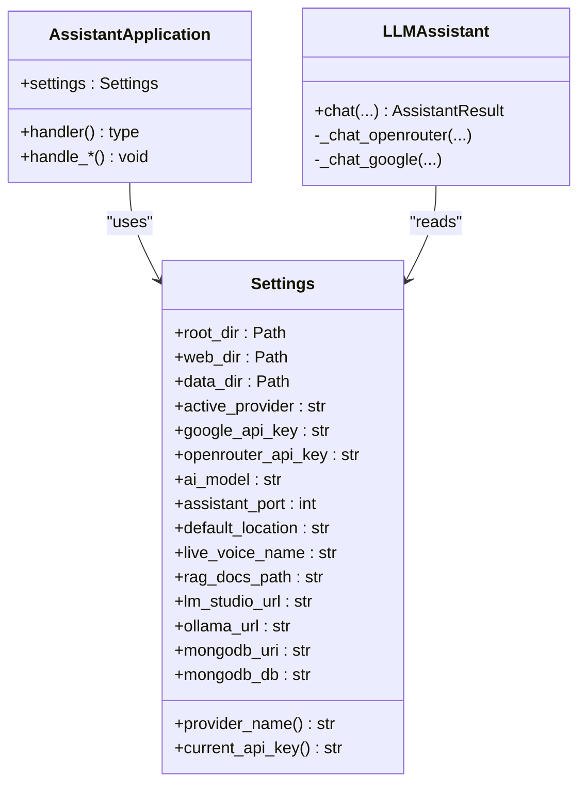
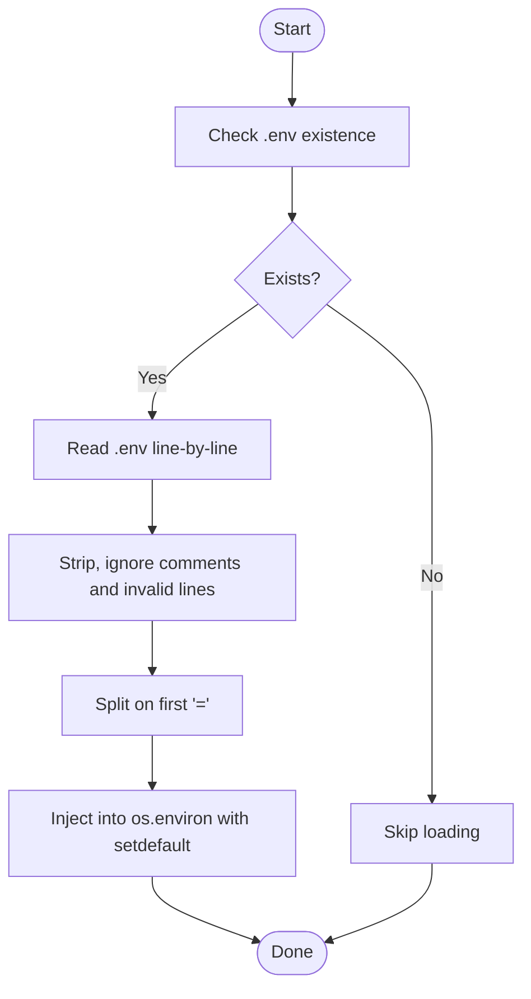
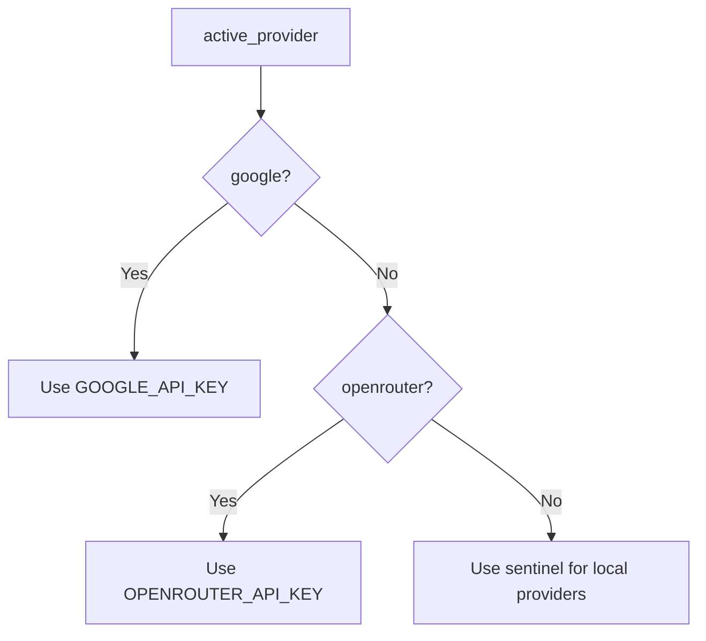
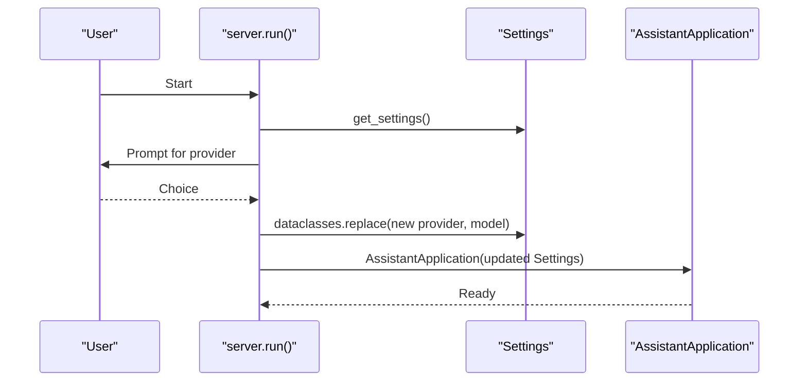
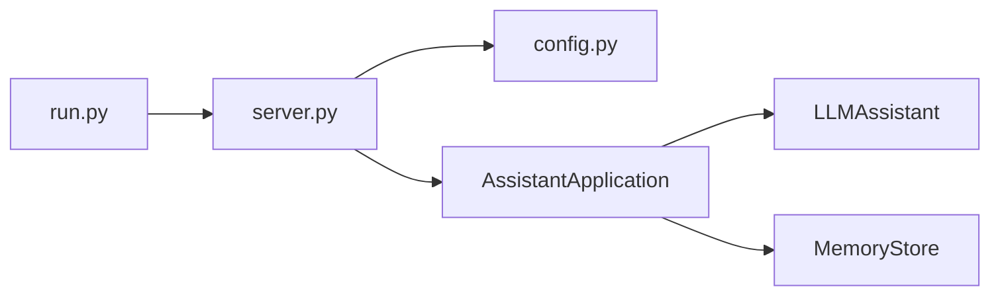

# Configuration and Settings Management

<cite>
**Referenced Files in This Document**
- [config.py](file://backend/config.py)
- [server.py](file://backend/server.py)
- [llm_client.py](file://backend/api_clients/llm_client.py)
- [memory_store.py](file://backend/core/memory_store.py)
- [README.md](file://README.md)
- [.gitignore](file://.gitignore)
- [requirements.txt](file://requirements.txt)
- [run.py](file://run.py)
</cite>

## Table of Contents
1. [Introduction](#introduction)
2. [Project Structure](#project-structure)
3. [Core Components](#core-components)
4. [Architecture Overview](#architecture-overview)
5. [Detailed Component Analysis](#detailed-component-analysis)
6. [Dependency Analysis](#dependency-analysis)
7. [Performance Considerations](#performance-considerations)
8. [Troubleshooting Guide](#troubleshooting-guide)
9. [Conclusion](#conclusion)
10. [Appendices](#appendices)

## Introduction
This document explains the configuration and settings management system used by the Orbit Virtual Assistant. It covers how environment variables are loaded from a .env file, how the Settings class encapsulates configuration, provider selection logic, API key management, runtime configuration changes, defaults, and validation behaviors. It also includes guidance on environment-specific settings, migration strategies, and security best practices for API keys.

## Project Structure
The configuration system centers around a single module that defines the Settings dataclass and an environment loader, and integrates with the server runtime and LLM client.

**Diagram sources**
- [run.py:1-6](file://run.py#L1-L6)
- [server.py:566-610](file://backend/server.py#L566-L610)
- [config.py:55-75](file://backend/config.py#L55-L75)
- [llm_client.py:38-46](file://backend/api_clients/llm_client.py#L38-L46)
- [memory_store.py:79-109](file://backend/core/memory_store.py#L79-L109)

**Section sources**
- [run.py:1-6](file://run.py#L1-L6)
- [server.py:566-610](file://backend/server.py#L566-L610)
- [config.py:55-75](file://backend/config.py#L55-L75)

## Core Components
- Settings dataclass: Holds all configuration values, including provider selection, API keys, model identifiers, ports, locations, and database settings.
- Environment loader: Reads a .env file and injects values into os.environ using os.environ.setdefault, ensuring existing values are preserved.
- Runtime overrides: The server allows interactive selection of provider and model at startup, producing a new Settings instance via dataclasses.replace.

Key behaviors:
- Provider selection: active_provider controls which API key and endpoint logic are used.
- API key management: current_api_key property selects the appropriate key based on active_provider.
- Defaults: get_settings() supplies sensible defaults for optional values and ensures required values fall back to defaults when missing.

**Section sources**
- [config.py:20-75](file://backend/config.py#L20-L75)
- [server.py:566-610](file://backend/server.py#L566-L610)

## Architecture Overview
The configuration pipeline loads environment variables, constructs Settings, and passes it through the application stack.

**Diagram sources**
- [run.py:1-6](file://run.py#L1-L6)
- [server.py:566-610](file://backend/server.py#L566-L610)
- [config.py:8-17](file://backend/config.py#L8-L17)
- [config.py:55-75](file://backend/config.py#L55-L75)

## Detailed Component Analysis

### Settings class and environment loading
- Settings fields include provider identifiers, API keys, model names, ports, locations, voice names, RAG paths, local LLM URLs, and MongoDB settings.
- The provider_name property maps active_provider to a human-readable label.
- The current_api_key property returns the active API key depending on provider, with a sentinel for local providers.
- get_settings() builds Settings by reading environment variables with defaults for missing values.

Validation and defaults:
- Missing environment variables are filled by defaults in get_settings().
- Numeric values are cast appropriately (e.g., port).
- String trimming and fallbacks ensure reasonable defaults for optional fields.

Runtime overrides:
- At startup, the server replaces Settings with a new instance reflecting user choices for provider and model.

Security note:
- The current_api_key property returns a sentinel for local providers, preventing accidental exposure of missing keys.

**Section sources**
- [config.py:20-75](file://backend/config.py#L20-L75)

### Environment variable loading (.env)
- load_dotenv reads a .env file line-by-line, ignoring blank lines and comments, and splits on the first '=' to extract key/value pairs.
- Values are stripped of whitespace and surrounding quotes before being injected into os.environ using os.environ.setdefault, preserving any pre-existing values.

Behavioral implications:
- Existing environment variables take precedence over .env values.
- Comments and malformed lines are ignored.

**Section sources**
- [config.py:8-17](file://backend/config.py#L8-L17)

### Provider selection logic and API key management
- active_provider determines which API key is considered current via current_api_key.
- For OpenRouter and Google providers, the system expects API keys; otherwise, a sentinel indicates local-only operation.
- The LLM client enforces presence of a valid API key and raises a clear error if missing.

Endpoints and headers:
- OpenRouter uses a dedicated endpoint and Authorization header with the current API key.
- Google uses a REST endpoint with an x-goog-api-key header.
- Local providers (LM Studio, Ollama) use configurable URLs and do not require cloud API keys.

**Section sources**
- [config.py:38-52](file://backend/config.py#L38-L52)
- [llm_client.py:141-149](file://backend/api_clients/llm_client.py#L141-L149)
- [llm_client.py:306-314](file://backend/api_clients/llm_client.py#L306-L314)

### Runtime configuration changes
- The server’s run() function constructs initial Settings from .env, then offers interactive provider selection and model overrides.
- After user input, it creates a new Settings instance via dataclasses.replace and proceeds with the selected provider and model.
- RAG enablement is handled separately during startup, allowing dynamic selection of the knowledge base path.

**Section sources**
- [server.py:566-610](file://backend/server.py#L566-L610)

### Configuration inheritance patterns and override mechanisms
- Inheritance pattern: Settings inherits defaults from environment variables and .env values.
- Override mechanism: os.environ values take precedence over .env values due to os.environ.setdefault semantics.
- Runtime override: dataclasses.replace produces a new Settings instance with updated provider/model values.

**Section sources**
- [config.py:8-17](file://backend/config.py#L8-L17)
- [server.py:581-588](file://backend/server.py#L581-L588)

### Environment-specific settings
- The .env file supports multiple environments by setting ACTIVE_PROVIDER, AI_MODEL, provider-specific model variables, and local LLM endpoints.
- The server prints the current provider and model at startup, enabling quick verification of environment-specific settings.

**Section sources**
- [README.md:104-136](file://README.md#L104-L136)
- [server.py:569-590](file://backend/server.py#L569-L590)

### .env file structure, required and optional parameters, and defaults
Required parameters (when applicable):
- ACTIVE_PROVIDER: Determines provider selection and API key usage.
- API keys for cloud providers: GOOGLE_API_KEY, OPENROUTER_API_KEY.
- Port and basic settings: ASSISTANT_PORT, LIVE_VOICE_NAME, DEFAULT_LOCATION.

Optional parameters:
- Provider-specific model variables (e.g., GOOGLE_MODEL) and local LLM endpoints (LM_STUDIO_URL, OLLAMA_URL).
- RAG configuration (RAG_DOCS_PATH).
- MongoDB settings (MONGODB_URI, MONGODB_DB).

Defaults:
- get_settings() supplies defaults for optional values (e.g., default port, default voice, default location, default MongoDB settings).

**Section sources**
- [README.md:104-136](file://README.md#L104-L136)
- [config.py:59-75](file://backend/config.py#L59-L75)

### Configuration validation and error handling
- Missing API keys: The LLM client checks current_api_key and raises a clear error instructing to verify .env.
- MongoDB connectivity: MemoryStore validates MongoDB availability early and raises a descriptive error if unreachable.
- Web search and weather: Services validate inputs and raise domain-specific errors.

**Section sources**
- [llm_client.py:60-61](file://backend/api_clients/llm_client.py#L60-L61)
- [memory_store.py:86-98](file://backend/core/memory_store.py#L86-L98)

### Configuration migration and version compatibility
- Legacy JSON migration: The application migrates legacy JSON files to MongoDB on first run, then renames them to .bak to avoid re-running migration.
- MongoDB settings: The system uses configurable URI and database name, supporting local and remote deployments.

**Section sources**
- [server.py:23-48](file://backend/server.py#L23-L48)
- [memory_store.py:837-858](file://backend/core/memory_store.py#L837-L858)

### Deployment-specific configuration strategies
- Separate .env per environment: Keep environment-specific values in separate .env files and load them via OS environment or container secrets.
- Containerization: Set environment variables at runtime; avoid committing .env to version control.
- Version control exclusion: .gitignore excludes .env, protecting secrets.

**Section sources**
- [.gitignore:1-6](file://.gitignore#L1-L6)
- [README.md:104-136](file://README.md#L104-L136)

### Security best practices for API key management
- Never commit .env or API keys to version control; rely on .gitignore protection.
- Prefer environment variables over hardcoded values; use os.environ to override .env values.
- Use provider-specific model variables to decouple model selection from API keys.
- For local providers, current_api_key returns a sentinel indicating no cloud key is required.

**Section sources**
- [.gitignore:1-6](file://.gitignore#L1-L6)
- [config.py:48-52](file://backend/config.py#L48-L52)

## Architecture Overview

**Diagram sources**
- [config.py:20-52](file://backend/config.py#L20-L52)
- [server.py:23-63](file://backend/server.py#L23-L63)
- [llm_client.py:38-78](file://backend/api_clients/llm_client.py#L38-L78)

## Detailed Component Analysis

### Environment loading flow

**Diagram sources**
- [config.py:8-17](file://backend/config.py#L8-L17)

### Provider selection and API key resolution

**Diagram sources**
- [config.py:38-52](file://backend/config.py#L38-L52)

### Runtime provider change sequence

**Diagram sources**
- [server.py:566-610](file://backend/server.py#L566-L610)

## Dependency Analysis
- Backend entry point depends on server.run().
- server.run() depends on config.get_settings() and constructs AssistantApplication.
- AssistantApplication depends on Settings and initializes MemoryStore and LLMAssistant.
- LLMAssistant depends on Settings for provider selection, API keys, and model endpoints.

**Diagram sources**
- [run.py:1-6](file://run.py#L1-L6)
- [server.py:566-610](file://backend/server.py#L566-L610)
- [config.py:55-75](file://backend/config.py#L55-L75)
- [llm_client.py:38-46](file://backend/api_clients/llm_client.py#L38-L46)
- [memory_store.py:79-109](file://backend/core/memory_store.py#L79-L109)

**Section sources**
- [run.py:1-6](file://run.py#L1-L6)
- [server.py:566-610](file://backend/server.py#L566-L610)
- [config.py:55-75](file://backend/config.py#L55-L75)

## Performance Considerations
- Environment loading is linear in the number of lines in .env; negligible overhead.
- Settings construction occurs once at startup; runtime cost is minimal.
- Provider selection and API key checks are constant-time lookups.

## Troubleshooting Guide
Common issues and resolutions:
- Missing API key for cloud provider:
  - Symptom: Error indicating API key is missing.
  - Resolution: Add the appropriate key to .env (GOOGLE_API_KEY or OPENROUTER_API_KEY).
- MongoDB connection failure:
  - Symptom: Startup error indicating inability to connect to MongoDB.
  - Resolution: Verify MONGODB_URI and ensure the database is reachable.
- Incorrect provider or model:
  - Symptom: Unexpected provider behavior or model mismatch.
  - Resolution: Confirm ACTIVE_PROVIDER and model variables in .env; re-run with interactive selection if needed.
- .env not taking effect:
  - Symptom: Changes to .env not reflected.
  - Resolution: Ensure os.environ does not override values; restart the process to reload .env.

**Section sources**
- [llm_client.py:60-61](file://backend/api_clients/llm_client.py#L60-L61)
- [memory_store.py:86-98](file://backend/core/memory_store.py#L86-L98)
- [server.py:569-590](file://backend/server.py#L569-L590)

## Conclusion
The configuration system is intentionally simple and robust: a .env loader injects environment variables with safe defaults, a Settings dataclass centralizes configuration, and runtime overrides allow flexible provider and model selection. Security is addressed by excluding .env from version control and by returning a sentinel for local providers. MongoDB settings and migration logic support both local and production deployments.

## Appendices

### Appendix A: Required and Optional Configuration Fields
- Required (when applicable): ACTIVE_PROVIDER, API keys for chosen provider.
- Optional: Provider-specific model variables, local LLM endpoints, RAG path, MongoDB settings.

**Section sources**
- [README.md:104-136](file://README.md#L104-L136)
- [config.py:59-75](file://backend/config.py#L59-L75)

### Appendix B: Environment Variables and Defaults Reference
- ACTIVE_PROVIDER: default "google"
- GOOGLE_API_KEY: default empty
- OPENROUTER_API_KEY: default empty
- AI_MODEL: default "gemini-2.5-flash"
- ASSISTANT_PORT: default 8000
- LIVE_VOICE_NAME: default "Nanami"
- DEFAULT_LOCATION: default "Ho Chi Minh City"
- LM_STUDIO_URL: default "http://127.0.0.1:1234/v1"
- OLLAMA_URL: default "http://127.0.0.1:11434/v1"
- MONGODB_URI: default "mongodb://localhost:27017"
- MONGODB_DB: default "orbit_assistant"

**Section sources**
- [config.py:63-74](file://backend/config.py#L63-L74)