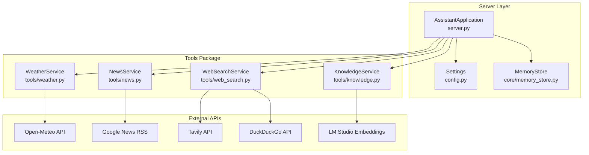
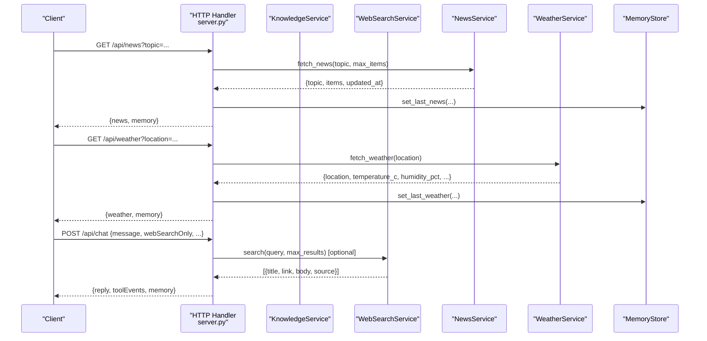
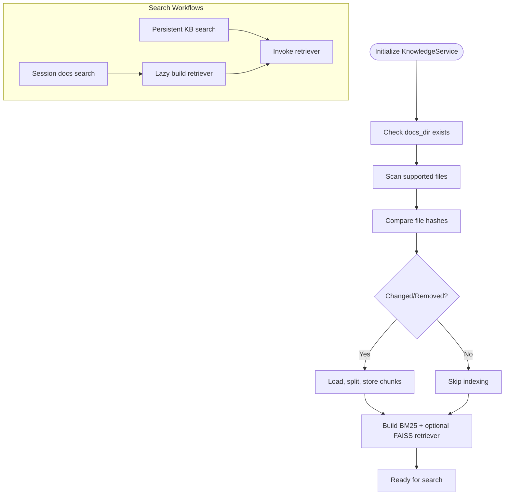
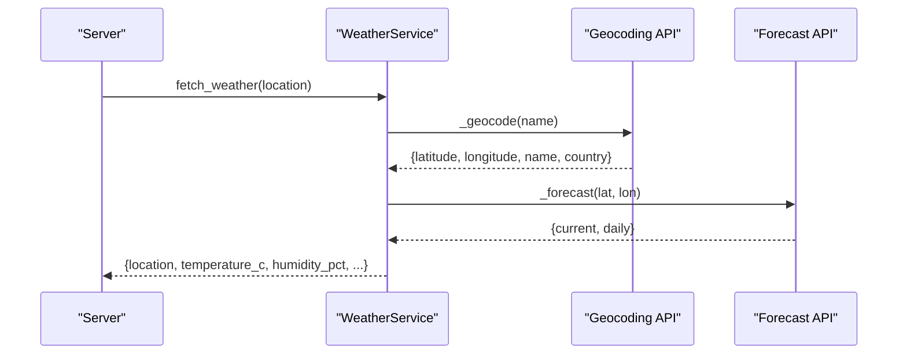
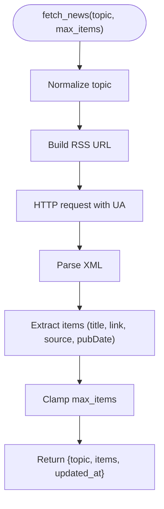
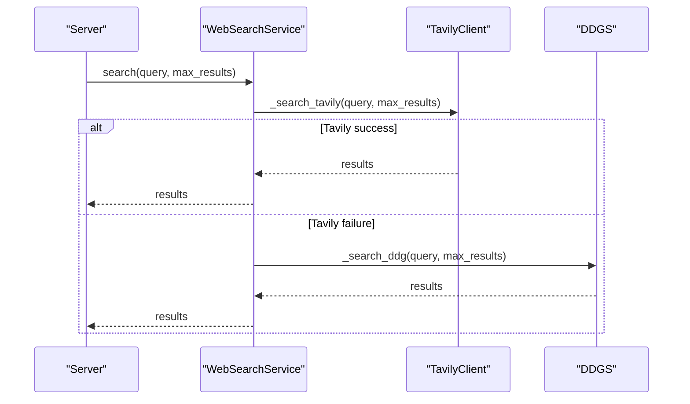
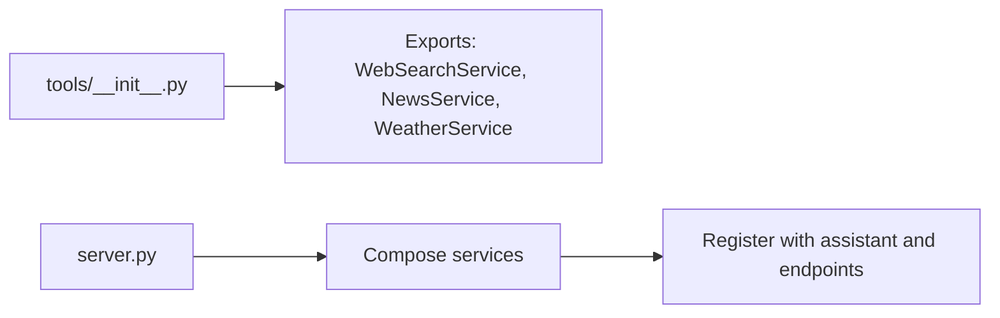
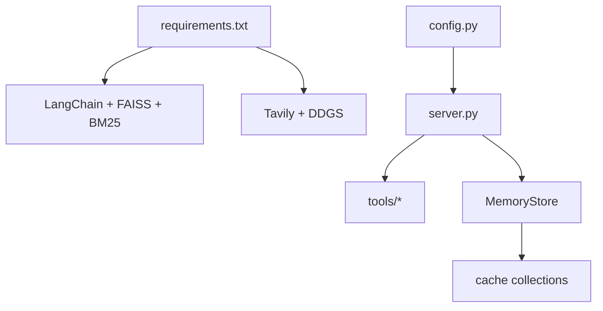

# External Tool Services

<cite>
**Referenced Files in This Document**
- [server.py](file://backend/server.py)
- [config.py](file://backend/config.py)
- [memory_store.py](file://backend/core/memory_store.py)
- [requirements.txt](file://requirements.txt)
- [tools/__init__.py](file://backend/tools/__init__.py)
- [tools/knowledge.py](file://backend/tools/knowledge.py)
- [tools/weather.py](file://backend/tools/weather.py)
- [tools/news.py](file://backend/tools/news.py)
- [tools/web_search.py](file://backend/tools/web_search.py)
- [run.py](file://run.py)
</cite>

## Table of Contents
1. [Introduction](#introduction)
2. [Project Structure](#project-structure)
3. [Core Components](#core-components)
4. [Architecture Overview](#architecture-overview)
5. [Detailed Component Analysis](#detailed-component-analysis)
6. [Dependency Analysis](#dependency-analysis)
7. [Performance Considerations](#performance-considerations)
8. [Troubleshooting Guide](#troubleshooting-guide)
9. [Conclusion](#conclusion)
10. [Appendices](#appendices)

## Introduction
This document describes the external tool services layer that powers the assistant’s capabilities beyond the core LLM. It covers:
- Knowledge service with Retrieval-Augmented Generation (RAG) using local documents
- Weather service integration with geocoding and forecasts
- News service with RSS feed parsing
- Web search service with multiple provider support (Tavily and DuckDuckGo)
- Tool registration and function declaration patterns
- Result processing workflows and error handling
- Timeout management, fallback mechanisms, and caching strategies
- Extensibility patterns for adding new tool services and customizing existing ones

## Project Structure
The external tool services are implemented as independent modules under the tools package and integrated into the server application. The server composes services and exposes them via HTTP endpoints.

**Diagram sources**
- [server.py:23-63](file://backend/server.py#L23-L63)
- [config.py:20-76](file://backend/config.py#L20-L76)
- [memory_store.py:67-117](file://backend/core/memory_store.py#L67-L117)
- [tools/knowledge.py:88-139](file://backend/tools/knowledge.py#L88-L139)
- [tools/web_search.py:53-139](file://backend/tools/web_search.py#L53-L139)
- [tools/news.py:21-83](file://backend/tools/news.py#L21-L83)
- [tools/weather.py:47-141](file://backend/tools/weather.py#L47-L141)

**Section sources**
- [server.py:23-63](file://backend/server.py#L23-L63)
- [config.py:20-76](file://backend/config.py#L20-L76)
- [memory_store.py:67-117](file://backend/core/memory_store.py#L67-L117)

## Core Components
- KnowledgeService: Persistent knowledge base and session-scoped document search powered by LangChain and FAISS/BM25 hybrid retrieval. Supports LM Studio embeddings for local RAG.
- WebSearchService: Multi-provider web search with Tavily primary and DuckDuckGo fallback, with graceful degradation and timeouts.
- NewsService: RSS feed parsing for top headlines and topic-based searches.
- WeatherService: Geocoding and forecast retrieval with advice generation and robust error handling.

These services are registered and exposed by the server, with results cached in MemoryStore for quick retrieval.

**Section sources**
- [tools/knowledge.py:88-393](file://backend/tools/knowledge.py#L88-L393)
- [tools/web_search.py:53-139](file://backend/tools/web_search.py#L53-L139)
- [tools/news.py:21-83](file://backend/tools/news.py#L21-L83)
- [tools/weather.py:47-141](file://backend/tools/weather.py#L47-L141)
- [server.py:14-21](file://backend/server.py#L14-L21)

## Architecture Overview
The server initializes services and routes requests to them. Results are returned to clients and optionally cached in MongoDB via MemoryStore.

**Diagram sources**
- [server.py:145-164](file://backend/server.py#L145-L164)
- [server.py:276-321](file://backend/server.py#L276-L321)
- [tools/news.py:25-60](file://backend/tools/news.py#L25-L60)
- [tools/weather.py:51-75](file://backend/tools/weather.py#L51-L75)
- [tools/web_search.py:69-104](file://backend/tools/web_search.py#L69-L104)
- [memory_store.py:475-495](file://backend/core/memory_store.py#L475-L495)

## Detailed Component Analysis

### Knowledge Service (RAG)
- Initialization:
  - Creates upload directory and optional LM Studio embeddings client.
  - Scans knowledge_base directory for supported file types (.pdf, .docx, .txt, .md, .csv, .json).
  - Computes file hashes and indexes changed/new files into MongoDB.
  - Builds hybrid retriever (BM25 + FAISS) when embeddings are available; falls back to BM25-only otherwise.
- Search:
  - Persistent KB search returns concatenated context with source metadata.
  - Session-scoped search builds retrievers lazily and caches them per session.
- Session attachments:
  - Parses and indexes uploaded files for the duration of a chat session.
  - Cleans up retrievers and disk files on session deletion.

**Diagram sources**
- [tools/knowledge.py:145-230](file://backend/tools/knowledge.py#L145-L230)
- [tools/knowledge.py:231-264](file://backend/tools/knowledge.py#L231-L264)
- [tools/knowledge.py:270-298](file://backend/tools/knowledge.py#L270-L298)
- [tools/knowledge.py:337-356](file://backend/tools/knowledge.py#L337-L356)

**Section sources**
- [tools/knowledge.py:88-139](file://backend/tools/knowledge.py#L88-L139)
- [tools/knowledge.py:145-230](file://backend/tools/knowledge.py#L145-L230)
- [tools/knowledge.py:231-264](file://backend/tools/knowledge.py#L231-L264)
- [tools/knowledge.py:270-298](file://backend/tools/knowledge.py#L270-L298)
- [tools/knowledge.py:303-356](file://backend/tools/knowledge.py#L303-L356)
- [tools/knowledge.py:389-393](file://backend/tools/knowledge.py#L389-L393)

### Weather Service
- Fetches current weather and daily forecast for a given location.
- Uses Open-Meteo geocoding API to resolve location, then Open-Meteo forecast API for metrics.
- Provides human-friendly advice based on temperature and precipitation probability.
- Robust error handling for HTTP/URL errors and timeouts.

**Diagram sources**
- [tools/weather.py:51-75](file://backend/tools/weather.py#L51-L75)
- [tools/weather.py:77-84](file://backend/tools/weather.py#L77-L84)
- [tools/weather.py:86-112](file://backend/tools/weather.py#L86-L112)
- [tools/weather.py:114-126](file://backend/tools/weather.py#L114-L126)

**Section sources**
- [tools/weather.py:47-141](file://backend/tools/weather.py#L47-L141)

### News Service
- Fetches RSS feeds for top headlines or topic-based searches.
- Normalizes topics and constructs feed URLs accordingly.
- Parses XML, extracts items, and returns structured results with timestamps.

**Diagram sources**
- [tools/news.py:25-60](file://backend/tools/news.py#L25-L60)
- [tools/news.py:62-67](file://backend/tools/news.py#L62-L67)
- [tools/news.py:69-82](file://backend/tools/news.py#L69-L82)

**Section sources**
- [tools/news.py:21-83](file://backend/tools/news.py#L21-L83)

### Web Search Service
- Supports Tavily (primary) and DuckDuckGo (fallback) search providers.
- Attempts Tavily first; on failure, falls back to DuckDuckGo.
- Returns standardized result format with title, link, body, and source.
- Includes a spinner timer to indicate progress and timeouts for network calls.

**Diagram sources**
- [tools/web_search.py:69-104](file://backend/tools/web_search.py#L69-L104)
- [tools/web_search.py:106-124](file://backend/tools/web_search.py#L106-L124)
- [tools/web_search.py:126-139](file://backend/tools/web_search.py#L126-L139)

**Section sources**
- [tools/web_search.py:53-139](file://backend/tools/web_search.py#L53-L139)

### Tool Registration and Function Declaration Patterns
- Tools are imported and exposed via the tools package init file.
- The server composes services and registers them with the assistant and HTTP handlers.
- Tool invocation is integrated into the chat flow; web search can be triggered independently.

**Diagram sources**
- [tools/__init__.py:1-12](file://backend/tools/__init__.py#L1-L12)
- [server.py:50-62](file://backend/server.py#L50-L62)

**Section sources**
- [tools/__init__.py:1-12](file://backend/tools/__init__.py#L1-L12)
- [server.py:50-62](file://backend/server.py#L50-L62)

## Dependency Analysis
- External dependencies are declared in requirements.txt, including optional RAG and web search providers.
- The server loads environment variables via Settings and passes them to services.
- MemoryStore persists tool results and caches weather/news for quick retrieval.

**Diagram sources**
- [requirements.txt:10-29](file://requirements.txt#L10-L29)
- [config.py:55-76](file://backend/config.py#L55-L76)
- [server.py:23-63](file://backend/server.py#L23-L63)
- [memory_store.py:475-495](file://backend/core/memory_store.py#L475-L495)

**Section sources**
- [requirements.txt:10-29](file://requirements.txt#L10-L29)
- [config.py:55-76](file://backend/config.py#L55-L76)
- [server.py:23-63](file://backend/server.py#L23-L63)
- [memory_store.py:475-495](file://backend/core/memory_store.py#L475-L495)

## Performance Considerations
- RAG indexing:
  - Chunk size and overlap are tuned for balanced recall and speed.
  - FAISS index construction is guarded by a spinner timer; failures fall back to BM25-only.
- Web search:
  - Tavily is attempted first; DuckDuckGo serves as a reliable fallback.
  - Network timeouts are enforced per request.
- Caching:
  - Weather and news results are cached in MongoDB to reduce repeated external calls.
- Concurrency:
  - KnowledgeService uses a thread lock around retriever caching to prevent race conditions.

[No sources needed since this section provides general guidance]

## Troubleshooting Guide
- KnowledgeService
  - LM Studio connectivity failures are logged and embeddings are disabled; FAISS is not built and BM25-only is used.
  - Parsing failures for session attachments are caught and reported; file remains recorded for diagnostics.
- WeatherService
  - Location resolution failures raise a specific error; HTTP/URL errors and timeouts are handled with a unified error type.
- NewsService
  - RSS parsing errors raise a specific error; malformed XML or network issues are surfaced with details.
- WebSearchService
  - Tavily failures trigger DuckDuckGo fallback; if both fail, a combined error is raised.
- Server integration
  - HTTP endpoints catch tool-specific errors and return structured error payloads with appropriate status codes.

**Section sources**
- [tools/knowledge.py:134-137](file://backend/tools/knowledge.py#L134-L137)
- [tools/knowledge.py:316-318](file://backend/tools/knowledge.py#L316-L318)
- [tools/weather.py:83-84](file://backend/tools/weather.py#L83-L84)
- [tools/weather.py:125-126](file://backend/tools/weather.py#L125-L126)
- [tools/news.py:33-34](file://backend/tools/news.py#L33-L34)
- [tools/news.py:80-82](file://backend/tools/news.py#L80-L82)
- [tools/web_search.py:86-104](file://backend/tools/web_search.py#L86-L104)
- [server.py:148-154](file://backend/server.py#L148-L154)
- [server.py:158-164](file://backend/server.py#L158-L164)

## Conclusion
The external tool services layer provides a modular, extensible foundation for integrating real-world data and capabilities. The design emphasizes:
- Clear separation of concerns across services
- Robust error handling and graceful fallbacks
- Caching and persistence for performance and reliability
- Easy extensibility for new providers and services

[No sources needed since this section summarizes without analyzing specific files]

## Appendices

### Tool Invocation Examples
- Weather: GET /api/weather?location=London
- News: GET /api/news?topic=technology
- Web search: POST /api/chat with webSearchOnly flag or via dedicated search flow
- Knowledge: Upload a document via POST /api/sessions/<id>/attachments; search via assistant with RAG enabled

[No sources needed since this section provides general guidance]

### Extensibility Patterns
- Adding a new tool:
  - Create a new service module under tools/ with a clear error type and a dataclass-like interface.
  - Add exports to tools/__init__.py and register the service in server.py.
  - Expose endpoints in server.py and integrate into the assistant chat flow.
- Customizing existing services:
  - Adjust timeouts, result limits, or provider preferences in service constructors.
  - Extend result processing to include additional fields or transformations.
  - Introduce caching strategies for frequently accessed endpoints.

[No sources needed since this section provides general guidance]