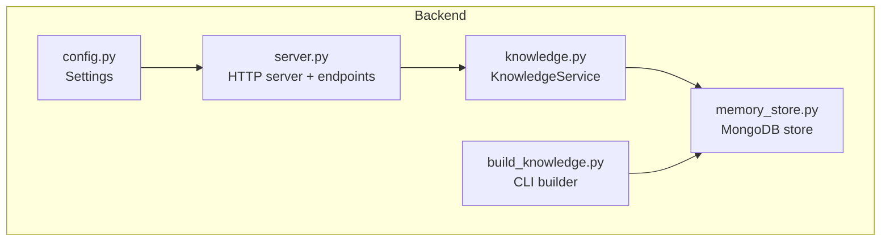
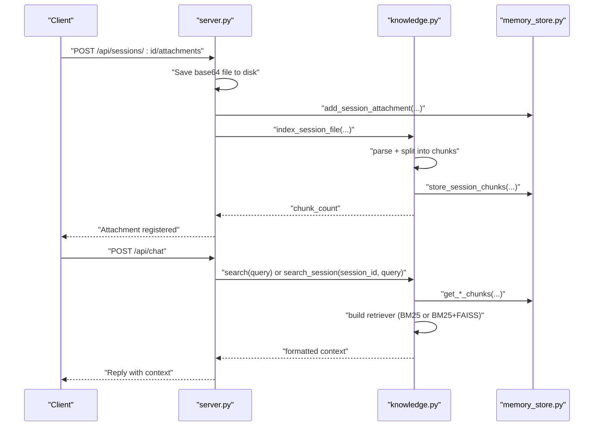
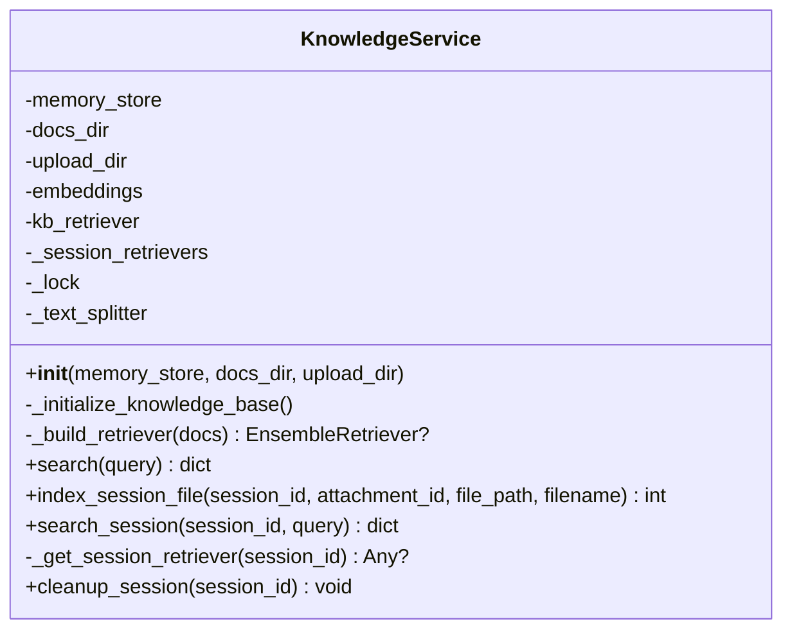
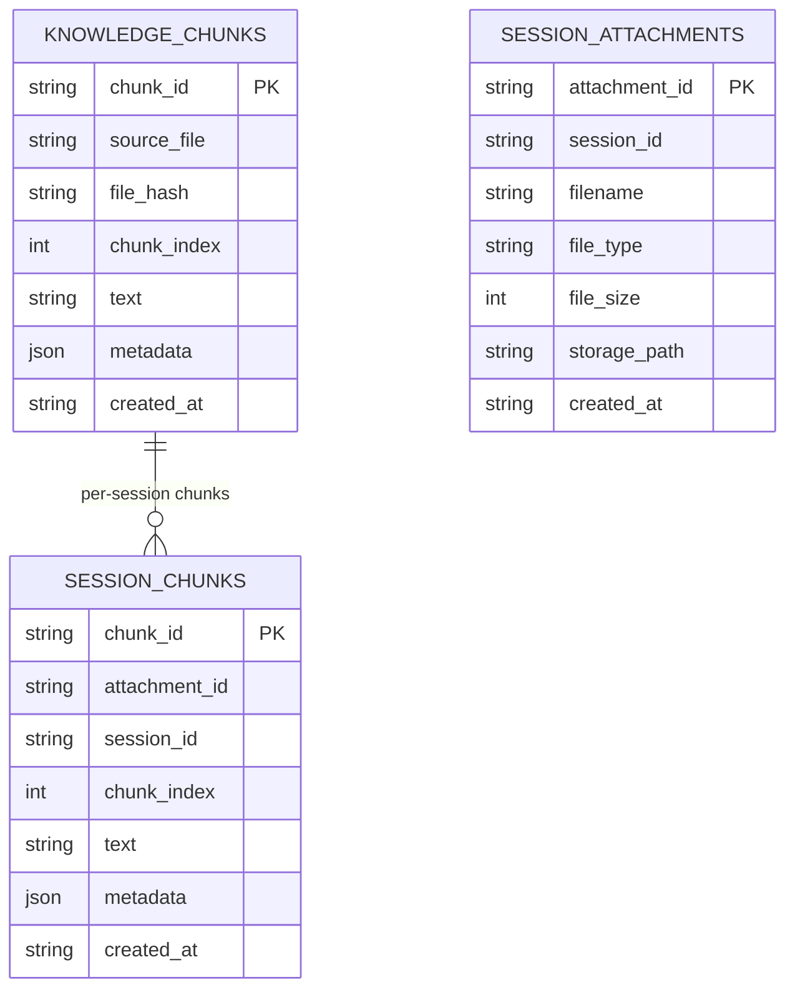
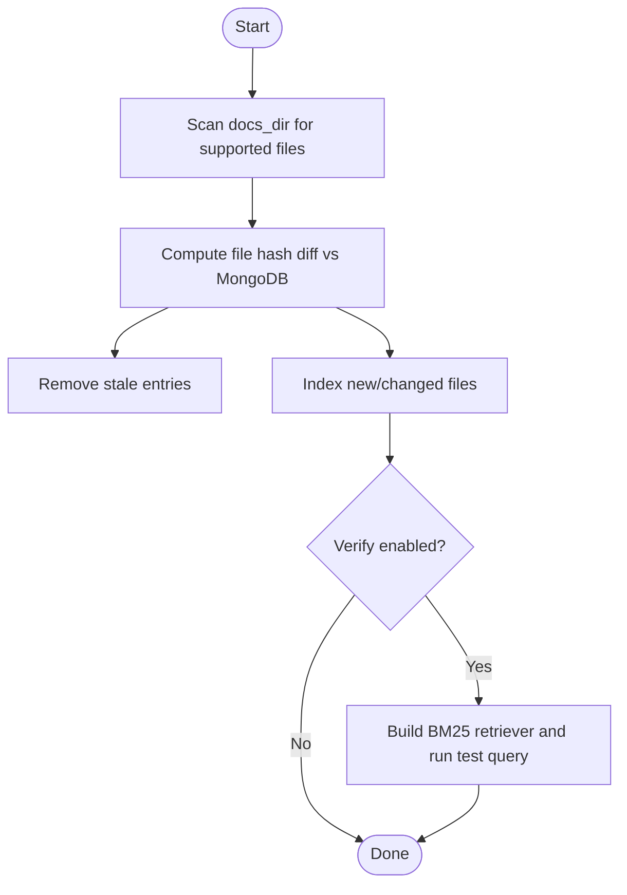
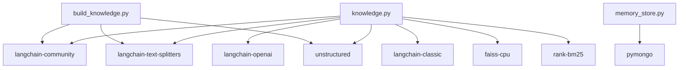

# Knowledge Service

<cite>
**Referenced Files in This Document**
- [knowledge.py](file://backend/tools/knowledge.py)
- [build_knowledge.py](file://build_knowledge.py)
- [memory_store.py](file://backend/core/memory_store.py)
- [server.py](file://backend/server.py)
- [config.py](file://backend/config.py)
- [requirements.txt](file://requirements.txt)
- [README.md](file://README.md)
</cite>

## Table of Contents
1. [Introduction](#introduction)
2. [Project Structure](#project-structure)
3. [Core Components](#core-components)
4. [Architecture Overview](#architecture-overview)
5. [Detailed Component Analysis](#detailed-component-analysis)
6. [Dependency Analysis](#dependency-analysis)
7. [Performance Considerations](#performance-considerations)
8. [Troubleshooting Guide](#troubleshooting-guide)
9. [Conclusion](#conclusion)
10. [Appendices](#appendices)

## Introduction
This document explains the Knowledge Service component responsible for Retrieval-Augmented Generation (RAG) in the assistant. It covers:
- Document parsing, chunking, and indexing for a persistent knowledge base
- Session-scoped document search for files attached during chat
- Hybrid retriever architecture combining BM25 and FAISS with automatic fallback
- File hash-based change detection and MongoDB-backed chunk storage
- Thread-safe operations and LM Studio embedding integration
- Example workflows for document upload and search result formatting
- Performance optimization strategies and error handling patterns

## Project Structure
The Knowledge Service spans several modules:
- backend/tools/knowledge.py: Implements the KnowledgeService class, RAG pipeline, and hybrid retriever
- backend/core/memory_store.py: MongoDB-backed persistence for knowledge chunks and session chunks
- backend/server.py: Integrates KnowledgeService into the HTTP server and exposes attachment upload and search endpoints
- build_knowledge.py: Standalone CLI to index documents into MongoDB for the persistent knowledge base
- backend/config.py: Loads environment variables and settings used by KnowledgeService
- requirements.txt: Lists RAG-related dependencies

**Diagram sources**
- [knowledge.py:88-393](file://backend/tools/knowledge.py#L88-L393)
- [memory_store.py:67-947](file://backend/core/memory_store.py#L67-L947)
- [server.py:23-611](file://backend/server.py#L23-L611)
- [build_knowledge.py:61-437](file://build_knowledge.py#L61-L437)
- [config.py:20-76](file://backend/config.py#L20-L76)

**Section sources**
- [README.md:164-201](file://README.md#L164-L201)
- [requirements.txt:19-29](file://requirements.txt#L19-L29)

## Core Components
- KnowledgeService: Orchestrates persistent knowledge base initialization, hybrid retriever construction, and both persistent and session-scoped searches
- MemoryStore: Provides thread-safe MongoDB access for storing and retrieving knowledge chunks and session chunks
- KnowledgeBuilder: Standalone CLI to scan, diff, index, and verify the persistent knowledge base
- Server integration: Exposes endpoints for uploading attachments and invoking KnowledgeService search

Key responsibilities:
- Parsing and chunking documents with RecursiveCharacterTextSplitter
- Hash-based change detection to incrementally update the knowledge base
- Building BM25-only or hybrid BM25+FAISS retrievers with EnsembleRetriever
- Storing chunks in MongoDB with metadata and thread-safe access
- Managing session-scoped retrievers with lazy initialization and cache invalidation

**Section sources**
- [knowledge.py:88-393](file://backend/tools/knowledge.py#L88-L393)
- [memory_store.py:695-748](file://backend/core/memory_store.py#L695-L748)
- [build_knowledge.py:61-211](file://build_knowledge.py#L61-L211)
- [server.py:50-63](file://backend/server.py#L50-L63)

## Architecture Overview
The Knowledge Service integrates with the HTTP server and MongoDB to provide two retrieval modes:
- Persistent knowledge base: Indexed from a configured docs directory and loaded at startup
- Session-scoped documents: Attached files parsed and indexed per chat session

**Diagram sources**
- [server.py:329-394](file://backend/server.py#L329-L394)
- [knowledge.py:303-393](file://backend/tools/knowledge.py#L303-L393)
- [memory_store.py:802-830](file://backend/core/memory_store.py#L802-L830)

## Detailed Component Analysis

### KnowledgeService
Responsibilities:
- Initialize LM Studio embeddings and build persistent knowledge base retriever
- Manage session-scoped retrievers with lazy initialization and thread-safe caching
- Provide search APIs for persistent knowledge base and session-scoped documents
- Handle file hash-based change detection and incremental indexing

Implementation highlights:
- Embeddings initialization with LM Studio base URL and model name
- RecursiveCharacterTextSplitter with Markdown-aware separators
- Hybrid retriever using BM25 + FAISS with EnsembleRetriever and MMR scoring
- Thread-safe operations using a lock for session retriever cache
- Session retriever cache invalidation on chunk updates

**Diagram sources**
- [knowledge.py:88-393](file://backend/tools/knowledge.py#L88-L393)

**Section sources**
- [knowledge.py:96-140](file://backend/tools/knowledge.py#L96-L140)
- [knowledge.py:145-230](file://backend/tools/knowledge.py#L145-L230)
- [knowledge.py:231-264](file://backend/tools/knowledge.py#L231-L264)
- [knowledge.py:270-298](file://backend/tools/knowledge.py#L270-L298)
- [knowledge.py:303-393](file://backend/tools/knowledge.py#L303-L393)

### MemoryStore (MongoDB-backed)
Responsibilities:
- Persist knowledge chunks for the persistent knowledge base
- Persist session-scoped chunks for per-chat document search
- Provide thread-safe access with a lock around write operations
- Maintain indexes for efficient lookups

Key methods:
- store_knowledge_chunks(source_file, file_hash, chunks) -> int
- get_all_knowledge_chunks() -> list[dict]
- get_knowledge_file_hashes() -> dict[str, str]
- store_session_chunks(session_id, attachment_id, chunks) -> int
- get_session_chunks(session_id) -> list[dict]

**Diagram sources**
- [memory_store.py:51-62](file://backend/core/memory_store.py#L51-L62)
- [memory_store.py:695-748](file://backend/core/memory_store.py#L695-L748)
- [memory_store.py:802-830](file://backend/core/memory_store.py#L802-L830)

**Section sources**
- [memory_store.py:695-748](file://backend/core/memory_store.py#L695-L748)
- [memory_store.py:802-830](file://backend/core/memory_store.py#L802-L830)

### KnowledgeBuilder (CLI)
Responsibilities:
- Scan a directory for supported files
- Compute diffs against MongoDB to detect new/changed/removed files
- Parse, chunk, and store documents into MongoDB
- Optionally verify retriever functionality and provide dry-run previews

Key methods:
- scan_directory() -> dict[str, str]
- compute_diff(disk_files) -> dict[str, list[str]]
- index_files(rel_paths, disk_files) -> dict[str, Any]
- verify(query) -> bool

**Diagram sources**
- [build_knowledge.py:75-211](file://build_knowledge.py#L75-L211)

**Section sources**
- [build_knowledge.py:75-211](file://build_knowledge.py#L75-L211)

### Server Integration
Responsibilities:
- Initialize KnowledgeService with docs_dir and upload_dir
- Expose attachment upload endpoint to parse and index session-scoped documents
- Route chat requests to KnowledgeService for persistent or session search

Key endpoints:
- POST /api/sessions/:id/attachments: Save base64 file, register attachment, parse and index chunks
- POST /api/chat: Invoke assistant with optional RAG context from KnowledgeService

**Section sources**
- [server.py:50-63](file://backend/server.py#L50-L63)
- [server.py:329-394](file://backend/server.py#L329-L394)
- [server.py:276-321](file://backend/server.py#L276-L321)

## Dependency Analysis
External libraries and integrations:
- LangChain ecosystem for document loading, chunking, BM25, FAISS, and hybrid retrieval
- FAISS for vector similarity search
- rank-bm25 for BM25 keyword retrieval
- unstructured for parsing diverse document formats
- LM Studio embeddings via OpenAI-compatible client
- MongoDB via PyMongo for persistent storage

**Diagram sources**
- [requirements.txt:22-28](file://requirements.txt#L22-L28)
- [knowledge.py:12-22](file://backend/tools/knowledge.py#L12-L22)
- [build_knowledge.py:29-46](file://build_knowledge.py#L29-L46)
- [memory_store.py:11](file://backend/core/memory_store.py#L11)

**Section sources**
- [requirements.txt:19-29](file://requirements.txt#L19-L29)

## Performance Considerations
- Chunking strategy: RecursiveCharacterTextSplitter with Markdown-aware separators and overlap reduces fragmentation and improves retrieval quality
- Hybrid retriever: EnsembleRetriever with BM25 and FAISS provides robustness; MMR scoring balances relevance and diversity
- Thread safety: Lock protects session retriever cache to prevent race conditions during concurrent searches
- Incremental indexing: File hash-based change detection avoids reprocessing unchanged documents
- LM Studio embedding connectivity: Quick connectivity test prevents repeated failures and enables graceful fallback
- MongoDB indexing: Proper indexes on knowledge_chunks and session_chunks improve retrieval speed

[No sources needed since this section provides general guidance]

## Troubleshooting Guide
Common issues and resolutions:
- LM Studio embedding unavailable: The KnowledgeService attempts to connect and logs warnings; embeddings fall back to BM25-only retriever
- FAISS build failure: The KnowledgeService catches exceptions and falls back to BM25-only retriever
- MongoDB connection failure: MemoryStore raises a runtime error if MongoDB is unreachable
- Empty or unsupported file types: Server validates file types and sizes before saving and parsing
- Session retriever errors: KnowledgeService wraps exceptions and returns structured error responses

**Section sources**
- [knowledge.py:122-138](file://backend/tools/knowledge.py#L122-L138)
- [knowledge.py:259-264](file://backend/tools/knowledge.py#L259-L264)
- [memory_store.py:86-99](file://backend/core/memory_store.py#L86-L99)
- [server.py:326-362](file://backend/server.py#L326-L362)
- [knowledge.py:294-298](file://backend/tools/knowledge.py#L294-L298)
- [knowledge.py:353-356](file://backend/tools/knowledge.py#L353-L356)

## Conclusion
The Knowledge Service provides a robust, thread-safe RAG implementation with:
- Persistent knowledge base indexing and incremental updates
- Session-scoped document search with lazy retriever caching
- Hybrid BM25+FAISS retriever with automatic fallback
- MongoDB-backed chunk storage and thread-safe operations
- LM Studio embedding integration and graceful error handling

[No sources needed since this section summarizes without analyzing specific files]

## Appendices

### Example Workflows

#### Document Upload Workflow
- Client sends base64-encoded file via POST /api/sessions/:id/attachments
- Server saves file to disk and registers attachment in MongoDB
- Server invokes KnowledgeService.index_session_file to parse, chunk, and store session-scoped chunks
- Session retriever cache invalidated for subsequent searches

**Section sources**
- [server.py:329-394](file://backend/server.py#L329-L394)
- [knowledge.py:303-335](file://backend/tools/knowledge.py#L303-L335)

#### Persistent Knowledge Base Search
- Client sends chat request with query
- Server delegates to KnowledgeService.search
- KnowledgeService retrieves chunks from MongoDB and builds BM25-only or hybrid retriever
- Results formatted as concatenated context with source metadata

**Section sources**
- [server.py:276-321](file://backend/server.py#L276-L321)
- [knowledge.py:270-298](file://backend/tools/knowledge.py#L270-L298)

#### Session-scoped Search
- Client sends chat request with session_id and query
- Server delegates to KnowledgeService.search_session
- KnowledgeService lazily builds retriever from session-scoped chunks and returns formatted context

**Section sources**
- [server.py:276-321](file://backend/server.py#L276-L321)
- [knowledge.py:337-356](file://backend/tools/knowledge.py#L337-L356)

### Configuration and Environment
- Settings include RAG documents path, LM Studio URL, and MongoDB credentials
- KnowledgeService initializes LM Studio embeddings when docs_dir is provided

**Section sources**
- [config.py:20-76](file://backend/config.py#L20-L76)
- [knowledge.py:122-138](file://backend/tools/knowledge.py#L122-L138)