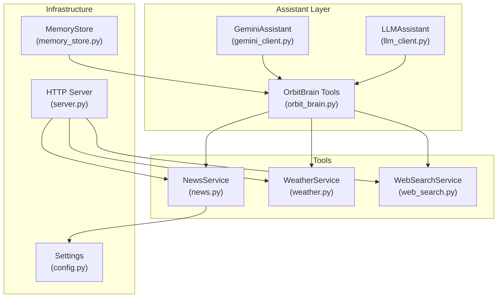
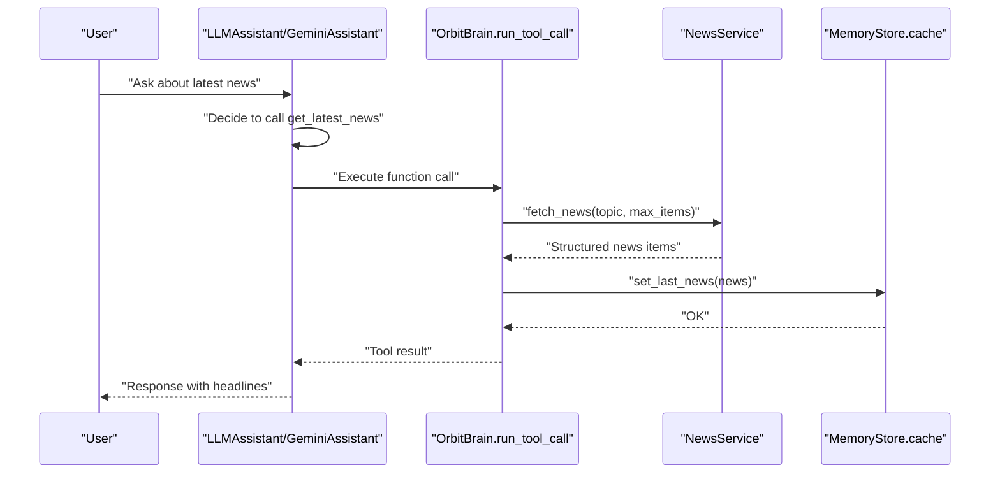
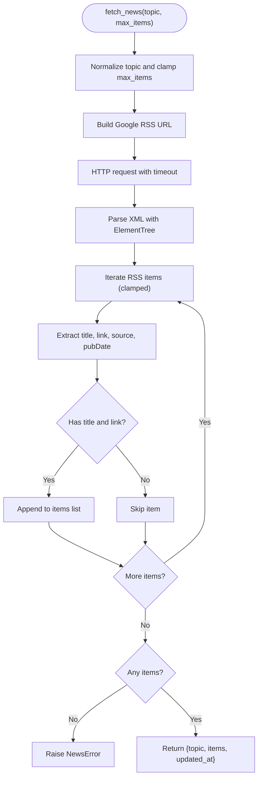
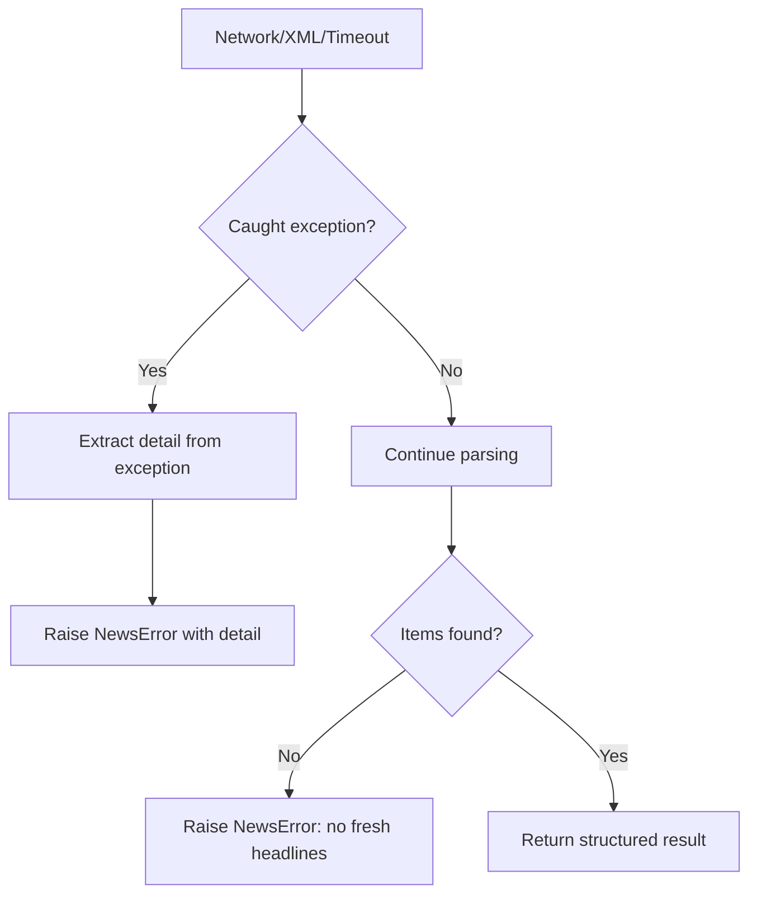
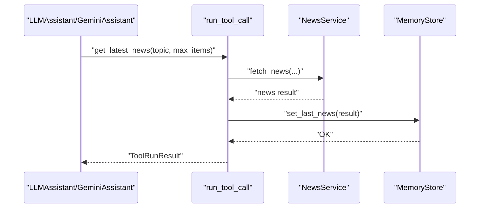
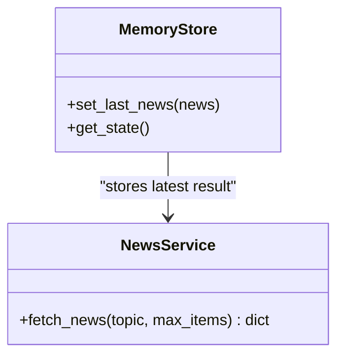
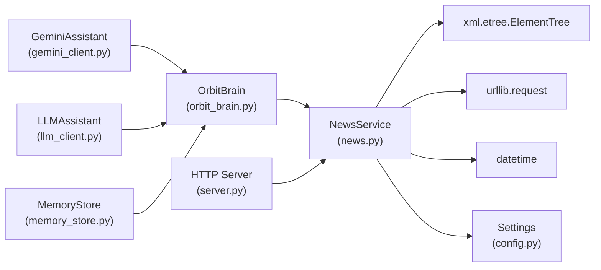

# News Service

<cite>
**Referenced Files in This Document**
- [news.py](file://backend/tools/news.py)
- [config.py](file://backend/config.py)
- [gemini_client.py](file://backend/api_clients/gemini_client.py)
- [llm_client.py](file://backend/api_clients/llm_client.py)
- [orbit_brain.py](file://backend/core/orbit_brain.py)
- [server.py](file://backend/server.py)
- [memory_store.py](file://backend/core/memory_store.py)
- [weather.py](file://backend/tools/weather.py)
- [web_search.py](file://backend/tools/web_search.py)
</cite>

## Table of Contents
1. [Introduction](#introduction)
2. [Project Structure](#project-structure)
3. [Core Components](#core-components)
4. [Architecture Overview](#architecture-overview)
5. [Detailed Component Analysis](#detailed-component-analysis)
6. [Dependency Analysis](#dependency-analysis)
7. [Performance Considerations](#performance-considerations)
8. [Troubleshooting Guide](#troubleshooting-guide)
9. [Conclusion](#conclusion)

## Introduction
This document provides comprehensive documentation for the News Service component within the AI Assistant project. It explains how the system integrates with Google News RSS feeds, extracts headlines, filters and formats content for conversational contexts, and handles errors gracefully. It also covers integration with the assistant's conversational flow, content summarization strategies, freshness indicators, caching policies, and fallback mechanisms.

## Project Structure
The News Service is implemented as a standalone tool module and integrated into the broader assistant architecture through function declarations and tool execution orchestration.

**Diagram sources**
- [gemini_client.py:36-94](file://backend/api_clients/gemini_client.py#L36-L94)
- [llm_client.py:38-272](file://backend/api_clients/llm_client.py#L38-L272)
- [orbit_brain.py:389-501](file://backend/core/orbit_brain.py#L389-L501)
- [news.py:21-83](file://backend/tools/news.py#L21-L83)
- [server.py:23-62](file://backend/server.py#L23-L62)
- [memory_store.py:475-495](file://backend/core/memory_store.py#L475-L495)

**Section sources**
- [news.py:1-83](file://backend/tools/news.py#L1-L83)
- [server.py:23-62](file://backend/server.py#L23-L62)

## Core Components
- NewsService: Fetches and parses Google News RSS feeds, extracts headlines, and returns structured results with metadata.
- Tool Integration: The NewsService is exposed as a function declaration and executed by the assistant's tool runner.
- Caching: Results are cached in MemoryStore under a dedicated cache entry for freshness tracking.
- Error Handling: Dedicated exceptions and robust error propagation ensure graceful failures.

**Section sources**
- [news.py:21-83](file://backend/tools/news.py#L21-L83)
- [orbit_brain.py:389-501](file://backend/core/orbit_brain.py#L389-L501)
- [memory_store.py:475-495](file://backend/core/memory_store.py#L475-L495)

## Architecture Overview
The News Service participates in the assistant's tool-call loop. The assistant decides when to call the news tool, executes it, and incorporates the results into its response generation.

**Diagram sources**
- [llm_client.py:255-270](file://backend/api_clients/llm_client.py#L255-L270)
- [gemini_client.py:79-92](file://backend/api_clients/gemini_client.py#L79-L92)
- [orbit_brain.py:409-412](file://backend/core/orbit_brain.py#L409-L412)
- [news.py:25-60](file://backend/tools/news.py#L25-L60)
- [memory_store.py:486-495](file://backend/core/memory_store.py#L486-L495)

## Detailed Component Analysis

### NewsService Implementation
- Feed Selection: Uses Google News RSS endpoints. Special-case for top headlines; otherwise constructs a search query URL.
- Parsing: Parses RSS/XML with ElementTree, extracting title, link, source, and publication date.
- Filtering: Skips items without required fields; limits to configured maximum.
- Formatting: Returns a structured dictionary with topic, items, and updated timestamp.
- Freshness: Adds a UTC timestamp for cache invalidation and freshness checks.

**Diagram sources**
- [news.py:25-60](file://backend/tools/news.py#L25-L60)
- [news.py:69-82](file://backend/tools/news.py#L69-L82)

**Section sources**
- [news.py:21-83](file://backend/tools/news.py#L21-L83)

### RSS Feed Integration Patterns
- Top Headlines: Uses a predefined Google RSS endpoint for top headlines.
- Topic Search: Builds a query-based RSS URL for arbitrary topics.
- User Agent and Accept Headers: Sets appropriate headers to mimic a browser and accept RSS/XML.

**Section sources**
- [news.py:62-67](file://backend/tools/news.py#L62-L67)
- [news.py:69-76](file://backend/tools/news.py#L69-L76)

### Headline Extraction and Content Filtering
- Extraction: Reads RSS item elements for title, link, source, and publication date.
- Filtering: Ensures non-empty title and link; falls back source to a default when absent.
- Limits: Clamps max_items between 1 and 8; truncates items accordingly.

**Section sources**
- [news.py:36-51](file://backend/tools/news.py#L36-L51)
- [news.py:27](file://backend/tools/news.py#L27)

### Result Formatting for Conversational Contexts
- Structured Output: Provides topic, items array, and updated_at timestamp.
- Item Metadata: Each item includes title, link, source, and published_at.
- Timestamp: UTC timestamp enables freshness indicators and cache management.

**Section sources**
- [news.py:56-60](file://backend/tools/news.py#L56-L60)

### Error Handling
- Network/Timeout: Catches HTTP/URL errors and timeouts; raises NewsError with details.
- Malformed XML: Catches ElementTree parse errors; raises NewsError with details.
- Empty Results: Raises NewsError when no items are extracted.

**Diagram sources**
- [news.py:31-34](file://backend/tools/news.py#L31-L34)
- [news.py:53-54](file://backend/tools/news.py#L53-L54)
- [news.py:80-82](file://backend/tools/news.py#L80-L82)

**Section sources**
- [news.py:31-34](file://backend/tools/news.py#L31-L34)
- [news.py:53-54](file://backend/tools/news.py#L53-L54)
- [news.py:80-82](file://backend/tools/news.py#L80-L82)

### Integration with Assistant Conversational Flow
- Function Declaration: The assistant exposes get_latest_news with topic and max_items parameters.
- Tool Execution: run_tool_call routes the function call to NewsService, caches results, and emits events.
- Conversation Loop: The assistant may call the news tool during multi-step reasoning or when prompted.

**Diagram sources**
- [orbit_brain.py:409-412](file://backend/core/orbit_brain.py#L409-L412)
- [news.py:25-60](file://backend/tools/news.py#L25-L60)
- [memory_store.py:486-495](file://backend/core/memory_store.py#L486-L495)

**Section sources**
- [orbit_brain.py:74-105](file://backend/core/orbit_brain.py#L74-L105)
- [orbit_brain.py:389-501](file://backend/core/orbit_brain.py#L389-L501)

### Content Summarization Strategies
- Parameterized Limits: max_items controls the number of headlines returned, enabling concise summaries.
- Topic-Based Filtering: Using topic-based RSS URLs narrows results to relevant domains.
- Freshness Indicators: updated_at timestamp allows downstream logic to assess recency.

**Section sources**
- [news.py:25-27](file://backend/tools/news.py#L25-L27)
- [news.py:59-60](file://backend/tools/news.py#L59-L60)

### Caching Policies and Freshness Indicators
- Cache Storage: MemoryStore stores the latest news under a dedicated cache entry with updated_at.
- Access Pattern: get_state retrieves last_news for inclusion in the assistant's context.
- Freshness: updated_at enables clients to determine whether to refresh cached results.

**Diagram sources**
- [memory_store.py:486-495](file://backend/core/memory_store.py#L486-L495)
- [news.py:56-60](file://backend/tools/news.py#L56-L60)

**Section sources**
- [memory_store.py:475-495](file://backend/core/memory_store.py#L475-L495)
- [news.py:59-60](file://backend/tools/news.py#L59-L60)

### Feed Rotation and Fallback Mechanisms
- Feed Rotation: The service selects between top headlines and topic-based search URLs based on the input topic.
- Fallback Behavior: When no items are found, the service raises an error; upstream callers can implement retries or alternative strategies.
- Network Resilience: HTTP request timeout and exception handling provide basic resilience against transient failures.

**Section sources**
- [news.py:62-67](file://backend/tools/news.py#L62-L67)
- [news.py:53-54](file://backend/tools/news.py#L53-L54)
- [news.py:78-82](file://backend/tools/news.py#L78-L82)

### HTTP API Integration
- Server Endpoints: The HTTP server exposes GET endpoints for weather and news, invoking the respective services and caching results.
- Error Propagation: Exceptions are caught and returned as HTTP 400 responses with error messages.

**Section sources**
- [server.py:145-164](file://backend/server.py#L145-L164)

## Dependency Analysis
- NewsService depends on:
  - Standard library modules for HTTP, XML parsing, and datetime.
  - Settings for environment configuration (via imports in higher-level modules).
- Integration points:
  - Tool declarations in OrbitBrain.
  - Tool execution in both GeminiAssistant and LLMAssistant.
  - Caching in MemoryStore.
  - HTTP server endpoints.

**Diagram sources**
- [news.py:3-10](file://backend/tools/news.py#L3-L10)
- [config.py:20-75](file://backend/config.py#L20-L75)
- [orbit_brain.py:389-501](file://backend/core/orbit_brain.py#L389-L501)
- [gemini_client.py:36-41](file://backend/api_clients/gemini_client.py#L36-L41)
- [llm_client.py:38-43](file://backend/api_clients/llm_client.py#L38-L43)
- [server.py:23-62](file://backend/server.py#L23-L62)
- [memory_store.py:475-495](file://backend/core/memory_store.py#L475-L495)

**Section sources**
- [news.py:3-10](file://backend/tools/news.py#L3-L10)
- [orbit_brain.py:389-501](file://backend/core/orbit_brain.py#L389-L501)
- [gemini_client.py:36-41](file://backend/api_clients/gemini_client.py#L36-L41)
- [llm_client.py:38-43](file://backend/api_clients/llm_client.py#L38-L43)
- [server.py:23-62](file://backend/server.py#L23-L62)
- [memory_store.py:475-495](file://backend/core/memory_store.py#L475-L495)

## Performance Considerations
- RSS Parsing Overhead: ElementTree parsing is lightweight but still incurs CPU cost for larger feeds.
- Network Latency: HTTP requests are bounded by timeouts; consider retry/backoff strategies at higher layers if needed.
- Result Limiting: Clamping max_items reduces downstream processing and improves responsiveness.
- Caching: Storing results in MemoryStore avoids repeated network calls for the same topic.

[No sources needed since this section provides general guidance]

## Troubleshooting Guide
Common issues and resolutions:
- News service unavailable: Indicates network problems or feed unavailability. Verify connectivity and try again.
- Could not read the latest news feed: XML parsing failure often indicates malformed RSS; confirm feed URL validity.
- I could not find any fresh headlines: Occurs when no items meet filtering criteria; adjust topic or increase max_items.
- API key missing: While NewsService does not require an API key, other services may; ensure proper configuration.

**Section sources**
- [news.py:33-34](file://backend/tools/news.py#L33-L34)
- [news.py:54](file://backend/tools/news.py#L54)
- [news.py:80-82](file://backend/tools/news.py#L80-L82)

## Conclusion
The News Service provides a robust, minimal integration with Google News RSS feeds, delivering structured headlines with freshness timestamps and integrating seamlessly into the assistant's tool-call loop. Its error handling, caching, and parameterized limits support reliable conversational experiences, while the modular design enables easy extension or replacement with alternative feed sources.