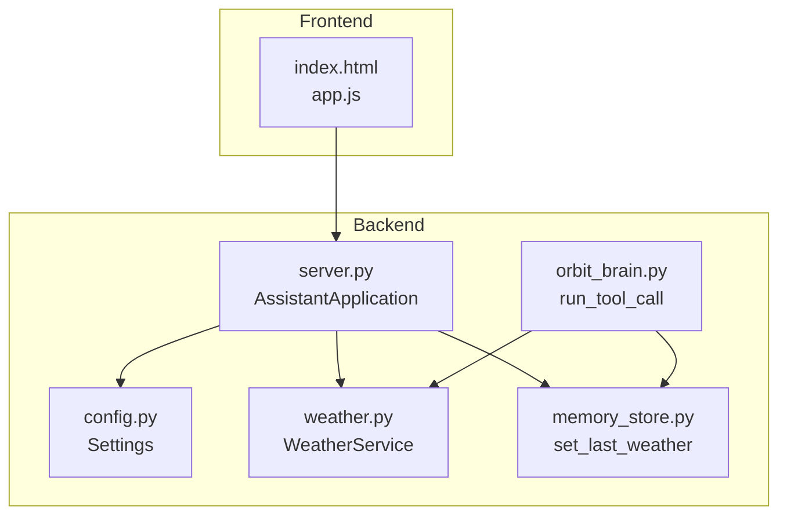
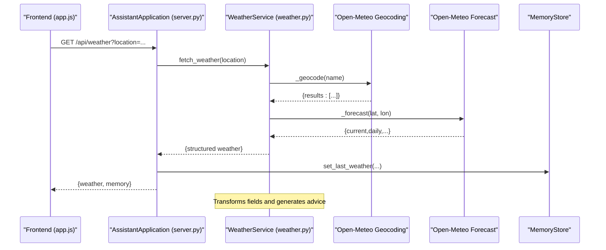
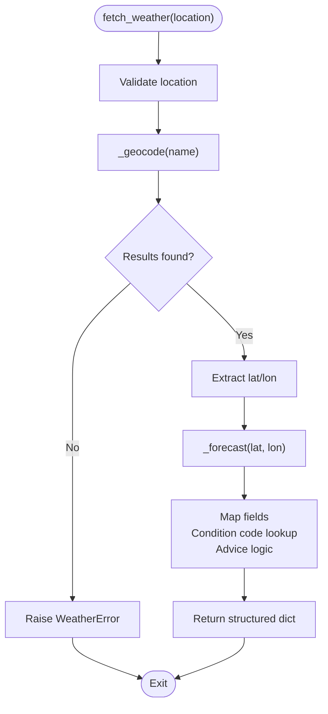
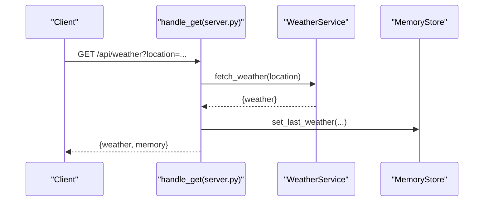
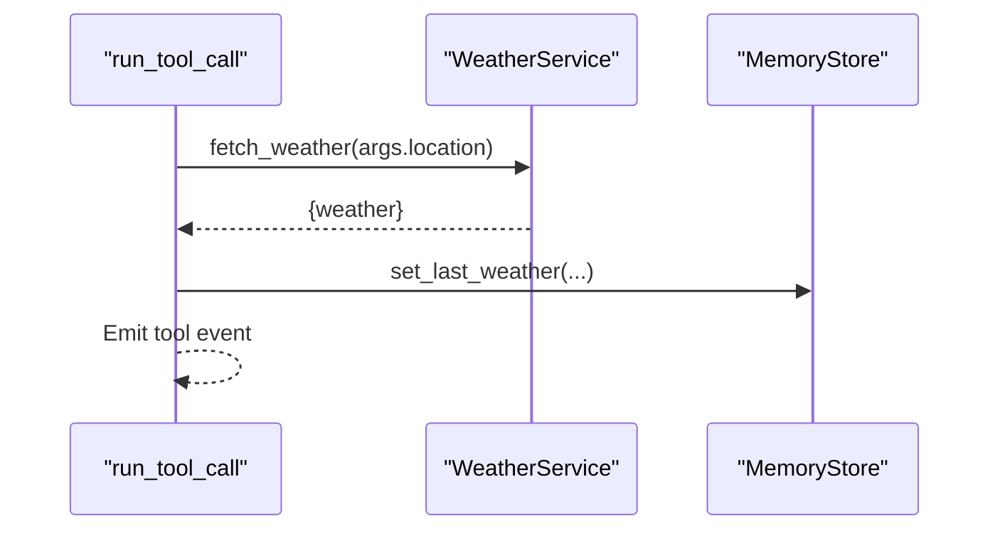
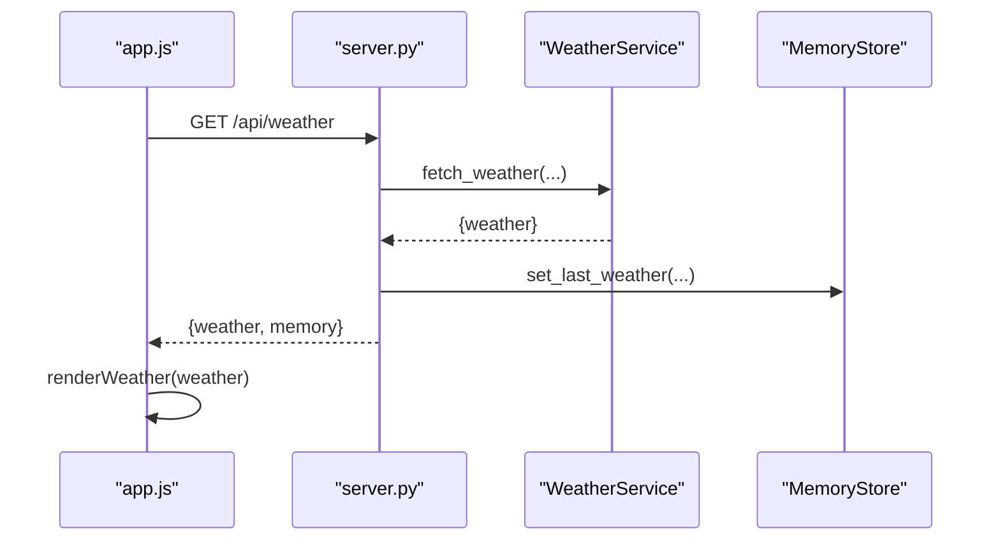
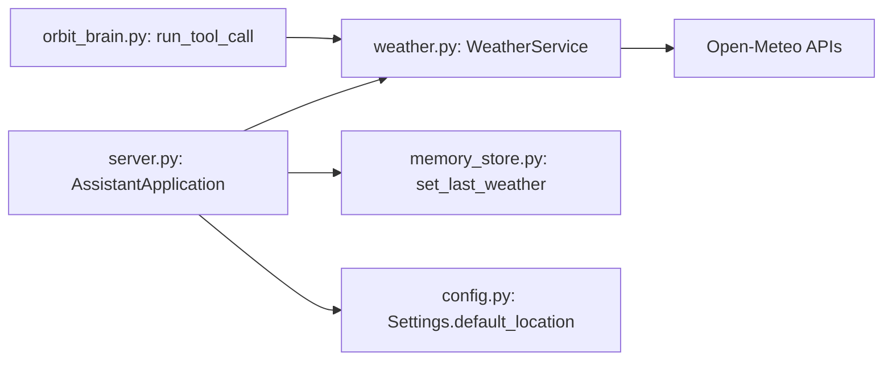

# Weather Service

<cite>
**Referenced Files in This Document**
- [weather.py](file://backend/tools/weather.py)
- [server.py](file://backend/server.py)
- [config.py](file://backend/config.py)
- [orbit_brain.py](file://backend/core/orbit_brain.py)
- [memory_store.py](file://backend/core/memory_store.py)
- [README.md](file://README.md)
- [requirements.txt](file://requirements.txt)
- [run.py](file://run.py)
- [app.js](file://frontend/scripts/app.js)
- [index.html](file://frontend/index.html)
</cite>

## Table of Contents
1. [Introduction](#introduction)
2. [Project Structure](#project-structure)
3. [Core Components](#core-components)
4. [Architecture Overview](#architecture-overview)
5. [Detailed Component Analysis](#detailed-component-analysis)
6. [Dependency Analysis](#dependency-analysis)
7. [Performance Considerations](#performance-considerations)
8. [Troubleshooting Guide](#troubleshooting-guide)
9. [Conclusion](#conclusion)
10. [Appendices](#appendices)

## Introduction
This document explains the Weather Service integration within the Orbit Virtual Assistant. It covers how weather data is retrieved from the Open-Meteo APIs, transformed into structured, AI-friendly responses, and surfaced to the assistant workflow and UI. It also documents configuration, supported locations, error handling, and integration patterns with the broader system.

## Project Structure
The Weather Service is implemented as a standalone tool and integrated into the assistant’s HTTP server and brain. The frontend triggers weather queries and renders the results.

**Diagram sources**
- [server.py:61](file://backend/server.py#L61)
- [weather.py:47](file://backend/tools/weather.py#L47)
- [memory_store.py:475](file://backend/core/memory_store.py#L475)
- [orbit_brain.py:405](file://backend/core/orbit_brain.py#L405)
- [config.py:55](file://backend/config.py#L55)
- [index.html:176](file://frontend/index.html#L176)
- [app.js:1402](file://frontend/scripts/app.js#L1402)

**Section sources**
- [README.md:164](file://README.md#L164)
- [server.py:61](file://backend/server.py#L61)
- [config.py:55](file://backend/config.py#L55)

## Core Components
- WeatherService: Encapsulates geocoding and weather forecasting via Open-Meteo, transforms raw API responses into a standardized dictionary, and provides advice based on current conditions.
- Assistant HTTP server: Exposes a GET endpoint to fetch weather, integrates with MemoryStore to persist the last weather, and forwards errors to the client.
- Brain tool dispatcher: Declares and executes the get_weather tool, storing the result in memory for downstream use.
- MemoryStore: Provides persistence for last_weather and integrates with the UI state payload.
- Frontend: Provides a UI trigger to refresh weather and renders the formatted result.

Key responsibilities:
- Data retrieval: Geocoding and forecast endpoints from Open-Meteo.
- Data transformation: Mapping raw fields to a consistent schema with human-readable condition descriptions.
- AI integration: Tool declaration and execution for the assistant brain.
- Persistence: Caching the last weather result in MongoDB.
- Presentation: Rendering weather cards in the UI.

**Section sources**
- [weather.py:47](file://backend/tools/weather.py#L47)
- [server.py:145](file://backend/server.py#L145)
- [orbit_brain.py:74](file://backend/core/orbit_brain.py#L74)
- [memory_store.py:475](file://backend/core/memory_store.py#L475)
- [app.js:1402](file://frontend/scripts/app.js#L1402)

## Architecture Overview
The Weather Service follows a layered pattern:
- HTTP layer: GET /api/weather parses query parameters and delegates to WeatherService.
- Service layer: Performs geocoding and forecast retrieval, applies transformations and advice.
- Persistence layer: Stores the last weather result in MongoDB cache.
- Integration layer: Tool invocation by the brain and UI rendering.

**Diagram sources**
- [server.py:145](file://backend/server.py#L145)
- [weather.py:51](file://backend/tools/weather.py#L51)
- [weather.py:77](file://backend/tools/weather.py#L77)
- [weather.py:86](file://backend/tools/weather.py#L86)
- [memory_store.py:475](file://backend/core/memory_store.py#L475)

## Detailed Component Analysis

### WeatherService
Responsibilities:
- Accepts a location string (city/district/country) and validates it.
- Geocodes the location using Open-Meteo’s search API.
- Fetches current weather and daily forecasts for temperature ranges and precipitation probability.
- Maps weather codes to readable condition descriptions.
- Produces a standardized dictionary with location, coordinates, current metrics, highs/lows, rain chance, and advice.
- Handles network and parsing errors by raising a domain-specific WeatherError.

Implementation highlights:
- Geocoding: Builds a URL with query parameters and decodes JSON response; raises an error if no results.
- Forecast: Requests current and daily fields for temperature, humidity, apparent temperature, precipitation, wind speed, and weather code.
- Advice: Provides contextual guidance based on temperature and precipitation probability thresholds.
- Error handling: Catches HTTP/URL/network/JSON decode errors and wraps them into WeatherError.

**Diagram sources**
- [weather.py:51](file://backend/tools/weather.py#L51)
- [weather.py:77](file://backend/tools/weather.py#L77)
- [weather.py:86](file://backend/tools/weather.py#L86)
- [weather.py:131](file://backend/tools/weather.py#L131)

**Section sources**
- [weather.py:47](file://backend/tools/weather.py#L47)
- [weather.py:77](file://backend/tools/weather.py#L77)
- [weather.py:86](file://backend/tools/weather.py#L86)
- [weather.py:114](file://backend/tools/weather.py#L114)
- [weather.py:131](file://backend/tools/weather.py#L131)

### HTTP Endpoint Integration
- Endpoint: GET /api/weather
- Query parameter: location (optional; falls back to Settings.default_location)
- Behavior: Calls WeatherService, persists result via MemoryStore, returns JSON with weather and memory state; on error, returns error message with BAD_REQUEST.

**Diagram sources**
- [server.py:145](file://backend/server.py#L145)
- [server.py:148](file://backend/server.py#L148)
- [server.py:150](file://backend/server.py#L150)
- [memory_store.py:475](file://backend/core/memory_store.py#L475)

**Section sources**
- [server.py:145](file://backend/server.py#L145)
- [server.py:148](file://backend/server.py#L148)
- [server.py:150](file://backend/server.py#L150)

### Assistant Brain Integration
- Tool declaration: get_weather with location parameter.
- Execution: run_tool_call invokes WeatherService, stores result via MemoryStore, emits a weather event.
- AI consumption: The assistant receives a structured weather payload suitable for natural language responses.

**Diagram sources**
- [orbit_brain.py:74](file://backend/core/orbit_brain.py#L74)
- [orbit_brain.py:405](file://backend/core/orbit_brain.py#L405)
- [memory_store.py:475](file://backend/core/memory_store.py#L475)

**Section sources**
- [orbit_brain.py:74](file://backend/core/orbit_brain.py#L74)
- [orbit_brain.py:405](file://backend/core/orbit_brain.py#L405)

### Data Transformation and Response Schema
The WeatherService produces a standardized dictionary with:
- Location metadata: name, country, latitude, longitude
- Current conditions: condition description, temperature_c, feels_like_c, humidity_pct, wind_kph, precipitation_mm
- Daily outlook: high_c, low_c, rain_chance_pct
- Advice: contextual suggestion based on temperature and precipitation

Transformation specifics:
- Weather codes mapped to descriptive strings.
- First-day values selected for highs/lows/rain chance when arrays are provided.
- Advice computed from temperature and precipitation probability thresholds.

**Section sources**
- [weather.py:61](file://backend/tools/weather.py#L61)
- [weather.py:11](file://backend/tools/weather.py#L11)
- [weather.py:128](file://backend/tools/weather.py#L128)
- [weather.py:131](file://backend/tools/weather.py#L131)

### UI Integration
- Trigger: Clicking the weather refresh button in the UI calls GET /api/weather.
- Rendering: The frontend renders a weather card with location, condition, advice, and key metrics.
- State: The UI displays the last_weather from the memory state payload.

**Diagram sources**
- [app.js:1402](file://frontend/scripts/app.js#L1402)
- [app.js:1289](file://frontend/scripts/app.js#L1289)
- [server.py:145](file://backend/server.py#L145)
- [memory_store.py:475](file://backend/core/memory_store.py#L475)

**Section sources**
- [app.js:176](file://frontend/scripts/app.js#L176)
- [app.js:1402](file://frontend/scripts/app.js#L1402)
- [app.js:1289](file://frontend/scripts/app.js#L1289)

## Dependency Analysis
- External APIs: Open-Meteo search (geocoding) and forecast endpoints.
- Internal dependencies: WeatherService depends on urllib/JSON for HTTP and parsing; MemoryStore persists last_weather; AssistantApplication composes WeatherService and wires it into the HTTP server; Brain declares and executes the get_weather tool.

**Diagram sources**
- [server.py:61](file://backend/server.py#L61)
- [weather.py:47](file://backend/tools/weather.py#L47)
- [memory_store.py:475](file://backend/core/memory_store.py#L475)
- [orbit_brain.py:405](file://backend/core/orbit_brain.py#L405)
- [config.py:69](file://backend/config.py#L69)

**Section sources**
- [requirements.txt:10](file://requirements.txt#L10)
- [config.py:69](file://backend/config.py#L69)

## Performance Considerations
- Network timeouts: HTTP requests use a 20-second timeout; adjust as needed for latency tolerance.
- Minimal parsing: JSON decoding occurs once per request; avoid redundant calls by reusing the WeatherService instance.
- Payload size: Forecast requests specify only required fields to reduce bandwidth.
- UI refresh: Debounce repeated clicks on the weather refresh button to prevent bursts of requests.

[No sources needed since this section provides general guidance]

## Troubleshooting Guide
Common issues and resolutions:
- Invalid location: The geocoding endpoint returns no results; WeatherService raises WeatherError with a user-facing message. Verify spelling and try a larger administrative area (city, country).
- Network failures: HTTPError, URLError, TimeoutError, or JSON decode errors are caught and wrapped into WeatherError; retry after checking connectivity.
- Rate limiting: Not observed in the current implementation; if encountered upstream, consider adding retries with exponential backoff.
- Missing default location: Ensure DEFAULT_LOCATION is configured in .env; otherwise, the server’s Settings.default_location falls back to a default city.

Operational checks:
- Confirm the server is running and reachable.
- Verify the /api/weather endpoint returns a JSON object with either weather data or an error field.
- Inspect the last_weather in the memory state payload to confirm persistence.

**Section sources**
- [weather.py:82](file://backend/tools/weather.py#L82)
- [weather.py:125](file://backend/tools/weather.py#L125)
- [server.py:152](file://backend/server.py#L152)
- [config.py:69](file://backend/config.py#L69)

## Conclusion
The Weather Service integrates cleanly with the Orbit Assistant through a clear separation of concerns: HTTP orchestration, service-level data retrieval and transformation, persistence, and UI presentation. It provides structured, AI-ready weather data with contextual advice, robust error handling, and straightforward configuration via environment variables.

[No sources needed since this section summarizes without analyzing specific files]

## Appendices

### API Definition
- Endpoint: GET /api/weather
- Query parameters:
  - location: string (optional; falls back to Settings.default_location)
- Success response:
  - weather: object (structured weather payload)
  - memory: object (current memory state)
- Error response:
  - error: string (error message)

**Section sources**
- [server.py:145](file://backend/server.py#L145)

### Configuration Requirements
- Environment variables (examples):
  - DEFAULT_LOCATION: default city used when no location is provided
  - ASSISTANT_PORT: server port (default 8000)
- Settings defaulting:
  - default_location is loaded from environment and passed to WeatherService during server initialization.

**Section sources**
- [config.py:69](file://backend/config.py#L69)
- [server.py:61](file://backend/server.py#L61)

### Supported Geographic Locations
- The service uses Open-Meteo’s search API, which supports global place names. Users can specify cities, districts, or countries. Validation occurs during geocoding; if no results are returned, a WeatherError is raised.

**Section sources**
- [weather.py:77](file://backend/tools/weather.py#L77)
- [weather.py:82](file://backend/tools/weather.py#L82)

### Data Models
Weather payload schema (selected fields):
- location: string (formatted city, country)
- latitude: number
- longitude: number
- condition: string (human-readable condition)
- temperature_c: number or null
- feels_like_c: number or null
- humidity_pct: number or null
- wind_kph: number or null
- precipitation_mm: number or null
- high_c: number or null
- low_c: number or null
- rain_chance_pct: number or null
- advice: string

**Section sources**
- [weather.py:61](file://backend/tools/weather.py#L61)

### Integration Patterns with Assistant Workflow
- Tool declaration: get_weather with location parameter.
- Tool execution: run_tool_call invokes WeatherService, persists result, and emits a weather event.
- Memory integration: last_weather is cached in MongoDB and included in the memory state payload.

**Section sources**
- [orbit_brain.py:74](file://backend/core/orbit_brain.py#L74)
- [orbit_brain.py:405](file://backend/core/orbit_brain.py#L405)
- [memory_store.py:475](file://backend/core/memory_store.py#L475)

### UI Rendering Details
- Refresh trigger: UI calls GET /api/weather and renders a weather card with location, condition, advice, and key metrics.
- State integration: The UI reads last_weather from the memory state payload to prefill or update the weather card.

**Section sources**
- [app.js:1402](file://frontend/scripts/app.js#L1402)
- [app.js:1289](file://frontend/scripts/app.js#L1289)