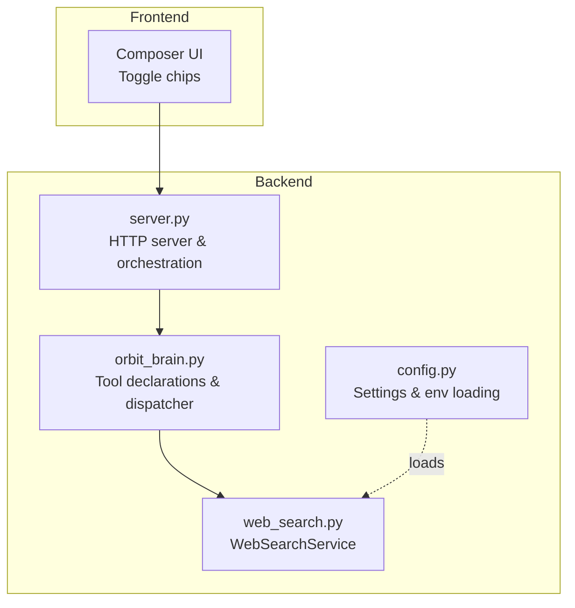
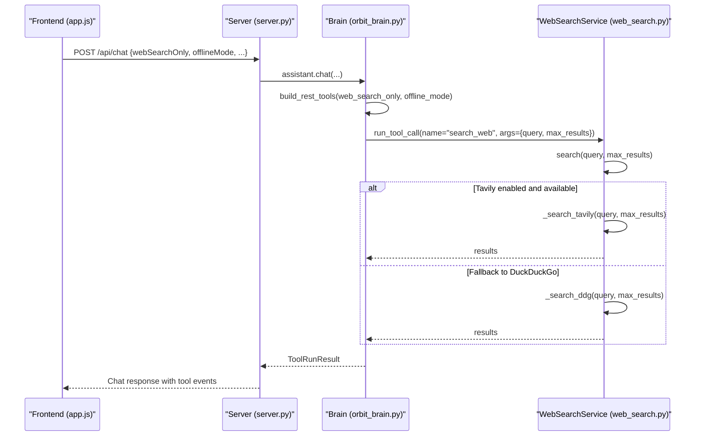
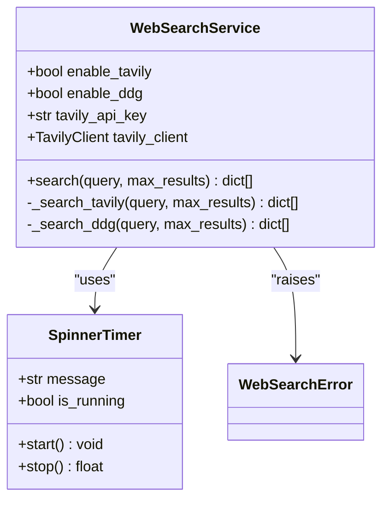
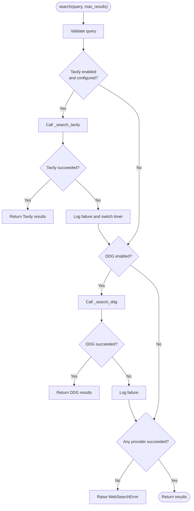
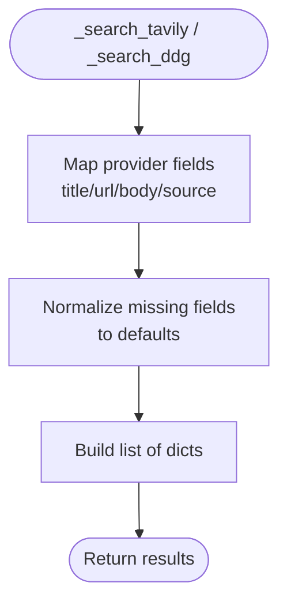
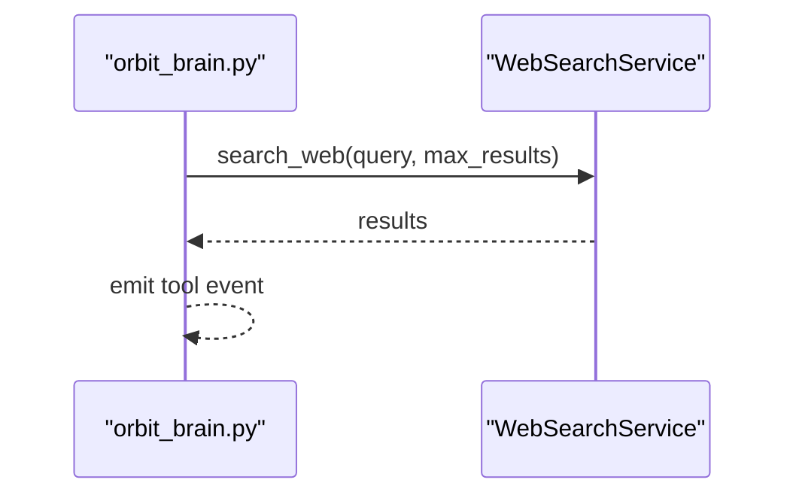
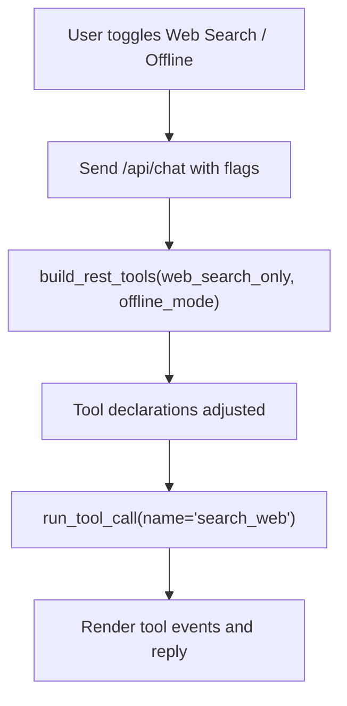
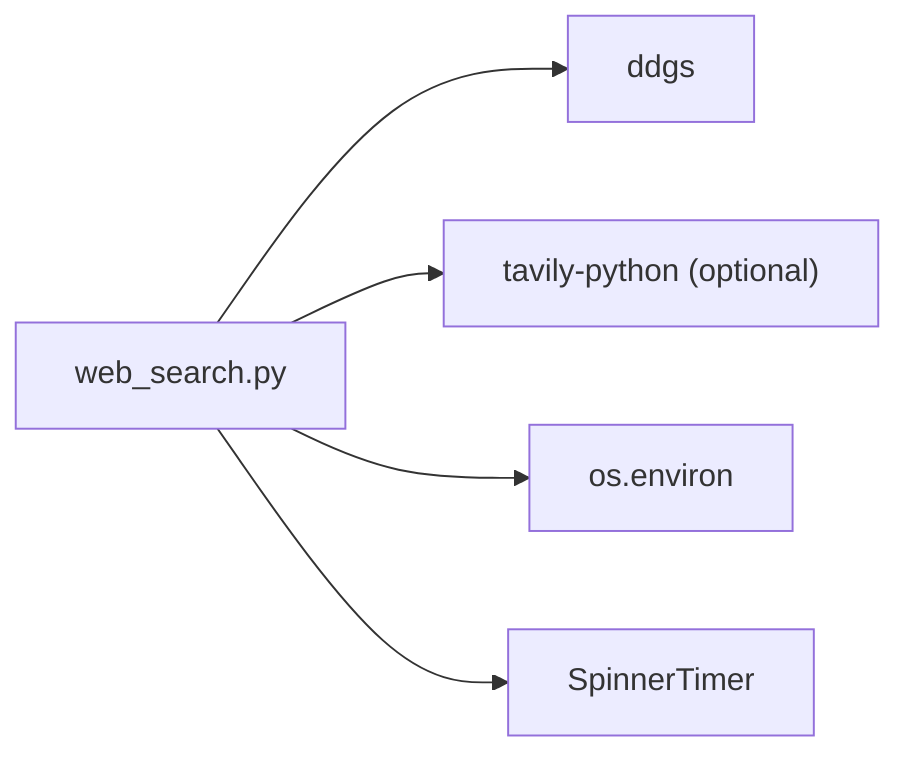

# Web Search Service

<cite>
**Referenced Files in This Document**
- [web_search.py](file://backend/tools/web_search.py)
- [config.py](file://backend/config.py)
- [orbit_brain.py](file://backend/core/orbit_brain.py)
- [server.py](file://backend/server.py)
- [app.js](file://frontend/scripts/app.js)
- [README.md](file://README.md)
- [requirements.txt](file://requirements.txt)
</cite>

## Table of Contents
1. [Introduction](#introduction)
2. [Project Structure](#project-structure)
3. [Core Components](#core-components)
4. [Architecture Overview](#architecture-overview)
5. [Detailed Component Analysis](#detailed-component-analysis)
6. [Dependency Analysis](#dependency-analysis)
7. [Performance Considerations](#performance-considerations)
8. [Troubleshooting Guide](#troubleshooting-guide)
9. [Conclusion](#conclusion)
10. [Appendices](#appendices)

## Introduction
This document describes the Web Search Service implementation powering the Orbit Virtual Assistant. The service provides dual-provider web search using Tavily (primary) and DuckDuckGo (fallback), with robust error handling, provider selection logic, and integration with the assistant’s tool calling system. It also covers configuration, API key management, result processing, and UI integration for toggling web search behavior.

## Project Structure
The Web Search Service resides in the backend under the tools module and integrates with the brain and server layers. The frontend exposes toggles to force web search or offline modes, which influence tool availability and behavior.

**Diagram sources**
- [app.js:380-397](file://frontend/scripts/app.js#L380-L397)
- [server.py:58](file://backend/server.py#L58)
- [orbit_brain.py:361-386](file://backend/core/orbit_brain.py#L361-L386)
- [web_search.py:53-139](file://backend/tools/web_search.py#L53-L139)
- [config.py:55-76](file://backend/config.py#L55-L76)

**Section sources**
- [README.md:164-201](file://README.md#L164-L201)
- [requirements.txt:10-16](file://requirements.txt#L10-L16)

## Core Components
- WebSearchService: Implements dual-provider search with Tavily and DuckDuckGo, including provider selection, fallback, and result normalization.
- SpinnerTimer: Lightweight progress indicator for long-running search operations.
- WebSearchError: Domain-specific exception for search failures.
- Integration with orbit_brain: Tool declaration and invocation via the assistant’s tool dispatcher.
- Frontend toggles: Web Search and Offline Mode influence tool availability and system behavior.

**Section sources**
- [web_search.py:12-44](file://backend/tools/web_search.py#L12-L44)
- [web_search.py:53-139](file://backend/tools/web_search.py#L53-L139)
- [orbit_brain.py:250-267](file://backend/core/orbit_brain.py#L250-L267)
- [orbit_brain.py:389-501](file://backend/core/orbit_brain.py#L389-L501)
- [app.js:380-397](file://frontend/scripts/app.js#L380-L397)

## Architecture Overview
The Web Search Service is initialized by the server and injected into the assistant. The frontend sends a chat request with mode flags (web search only/offline). The brain builds tool declarations accordingly and dispatches the search_web tool to the service.

**Diagram sources**
- [server.py:296-320](file://backend/server.py#L296-L320)
- [orbit_brain.py:389-501](file://backend/core/orbit_brain.py#L389-L501)
- [web_search.py:69-104](file://backend/tools/web_search.py#L69-L104)
- [web_search.py:106-139](file://backend/tools/web_search.py#L106-L139)

## Detailed Component Analysis

### WebSearchService
Implements dual-provider search with:
- Provider selection: Tavily primary, DuckDuckGo fallback.
- Error handling: Catches exceptions from Tavily and falls back to DDG; raises WebSearchError if both fail.
- Result normalization: Produces a unified list of dictionaries with keys title, link, body, source.
- Configuration: Reads TAVILY_API_KEY from environment; optional enable flags for providers.

**Diagram sources**
- [web_search.py:53-139](file://backend/tools/web_search.py#L53-L139)
- [web_search.py:12-44](file://backend/tools/web_search.py#L12-L44)

**Section sources**
- [web_search.py:53-139](file://backend/tools/web_search.py#L53-L139)

### Provider Selection Logic and Fallback
- If Tavily is enabled and configured, the service attempts Tavily first.
- On exception, it logs a warning and falls back to DuckDuckGo.
- If DDG is disabled or also fails, a WebSearchError is raised.

**Diagram sources**
- [web_search.py:69-104](file://backend/tools/web_search.py#L69-L104)

**Section sources**
- [web_search.py:69-104](file://backend/tools/web_search.py#L69-L104)

### Search Query Processing and Result Normalization
- Query normalization: Strips whitespace and validates non-empty query.
- Tavily response mapping: Extracts title, url, content; sets source to “tavily”.
- DuckDuckGo response mapping: Extracts title, href, body; sets source to “ddg”.

**Diagram sources**
- [web_search.py:106-139](file://backend/tools/web_search.py#L106-L139)

**Section sources**
- [web_search.py:106-139](file://backend/tools/web_search.py#L106-L139)

### Integration with Assistant Tool Calling System
- Tool declaration: The brain defines a search_web tool with a query parameter and optional max_results.
- Tool dispatch: run_tool_call resolves the tool name and invokes the WebSearchService.search method with normalized arguments.
- Tool events: The brain emits tool events for UI display.

**Diagram sources**
- [orbit_brain.py:250-267](file://backend/core/orbit_brain.py#L250-L267)
- [orbit_brain.py:475-486](file://backend/core/orbit_brain.py#L475-L486)
- [web_search.py:69-104](file://backend/tools/web_search.py#L69-L104)

**Section sources**
- [orbit_brain.py:250-267](file://backend/core/orbit_brain.py#L250-L267)
- [orbit_brain.py:389-501](file://backend/core/orbit_brain.py#L389-L501)

### Frontend Integration and UI Toggles
- Web Search Toggle: Forces web search mode; the brain adjusts tool availability to prioritize search_web.
- Offline Mode Toggle: Disables web search; the brain strips search_web from tool declarations.
- UI feedback: The composer displays contextual thinking status reflecting the active mode.

**Diagram sources**
- [app.js:380-397](file://frontend/scripts/app.js#L380-L397)
- [app.js:992-1008](file://frontend/scripts/app.js#L992-L1008)
- [orbit_brain.py:361-386](file://backend/core/orbit_brain.py#L361-L386)

**Section sources**
- [app.js:380-397](file://frontend/scripts/app.js#L380-L397)
- [app.js:992-1008](file://frontend/scripts/app.js#L992-L1008)
- [orbit_brain.py:361-386](file://backend/core/orbit_brain.py#L361-L386)

## Dependency Analysis
- External libraries:
  - ddgs: DuckDuckGo search client.
  - tavily-python: Optional Tavily client; import guarded to allow fallback when unavailable.
- Internal dependencies:
  - SpinnerTimer for progress indication.
  - Environment variables for API keys and provider configuration.

**Diagram sources**
- [web_search.py:6](file://backend/tools/web_search.py#L6)
- [web_search.py:48-50](file://backend/tools/web_search.py#L48-L50)
- [requirements.txt:10-16](file://requirements.txt#L10-L16)

**Section sources**
- [requirements.txt:10-16](file://requirements.txt#L10-L16)
- [web_search.py:48-50](file://backend/tools/web_search.py#L48-L50)

## Performance Considerations
- Provider selection prioritizes Tavily when configured; fallback to DDG reduces latency if Tavily is unavailable.
- SpinnerTimer provides user feedback during long operations.
- max_results is passed to providers; the brain’s tool definition suggests dynamic sizing based on query complexity.

[No sources needed since this section provides general guidance]

## Troubleshooting Guide
Common issues and resolutions:
- Empty query: Raises WebSearchError; ensure the query is non-empty before invoking search.
- Tavily import missing: TavilyClient is None; the service falls back to DDG automatically.
- Tavily API failure: Logs a warning and switches to DDG; if DDG also fails, raises WebSearchError.
- No API key: If TAVILY_API_KEY is not set, Tavily is disabled; DDG remains usable.
- Provider disabled: If enable flags are False, the respective provider is skipped.

Operational checks:
- Verify environment variables for API keys and provider flags.
- Confirm ddgs is installed; confirm tavily-python is installed only if enabling Tavily.

**Section sources**
- [web_search.py:69-104](file://backend/tools/web_search.py#L69-L104)
- [web_search.py:48-50](file://backend/tools/web_search.py#L48-L50)
- [requirements.txt:10-16](file://requirements.txt#L10-L16)

## Conclusion
The Web Search Service offers a resilient, dual-provider architecture with clear fallback behavior and tight integration with the assistant’s tool calling system. Its design emphasizes reliability, user feedback, and seamless UI toggles for web search and offline modes.

[No sources needed since this section summarizes without analyzing specific files]

## Appendices

### Configuration Requirements and API Key Management
- Environment variables:
  - TAVILY_API_KEY: Enables Tavily provider.
  - ACTIVE_PROVIDER, OPENROUTER_API_KEY, GOOGLE_API_KEY: Not directly used by web search but relevant for overall assistant configuration.
- Provider enable flags:
  - enable_tavily and enable_ddg can be controlled via service initialization parameters if extended.

**Section sources**
- [README.md:104-136](file://README.md#L104-L136)
- [config.py:55-76](file://backend/config.py#L55-L76)
- [web_search.py:54-67](file://backend/tools/web_search.py#L54-L67)

### Examples and Workflows
- Example query construction: The brain’s search_web tool expects a query string and optional max_results; the service normalizes and forwards to providers.
- Result parsing: Both providers are mapped to a unified structure with title, link, body, and source.
- Context preparation: The brain’s run_tool_call captures tool events and replies for UI presentation.

**Section sources**
- [orbit_brain.py:250-267](file://backend/core/orbit_brain.py#L250-L267)
- [orbit_brain.py:475-486](file://backend/core/orbit_brain.py#L475-L486)
- [web_search.py:106-139](file://backend/tools/web_search.py#L106-L139)

### Timeout Management, Caching, and Advanced Topics
- Timeouts: The service does not implement explicit timeouts; network timeouts depend on underlying clients.
- Caching: The service does not implement result caching; results are fetched on demand.
- Integration patterns: The service is invoked via the brain’s tool dispatcher; the server passes mode flags to bias tool usage.

**Section sources**
- [web_search.py:69-104](file://backend/tools/web_search.py#L69-L104)
- [server.py:296-320](file://backend/server.py#L296-L320)
- [orbit_brain.py:361-386](file://backend/core/orbit_brain.py#L361-L386)