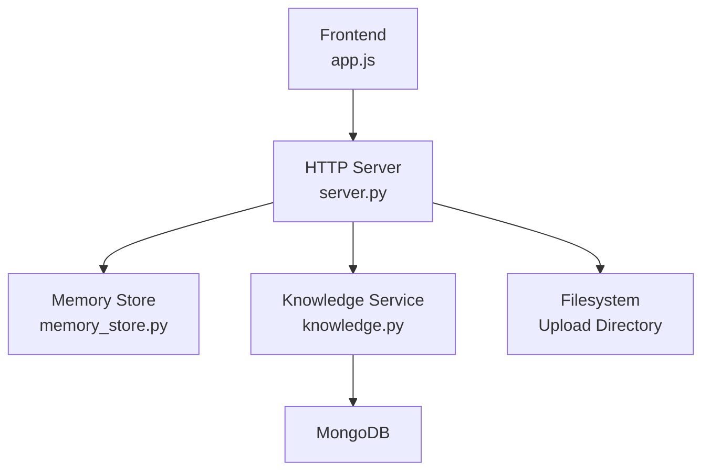
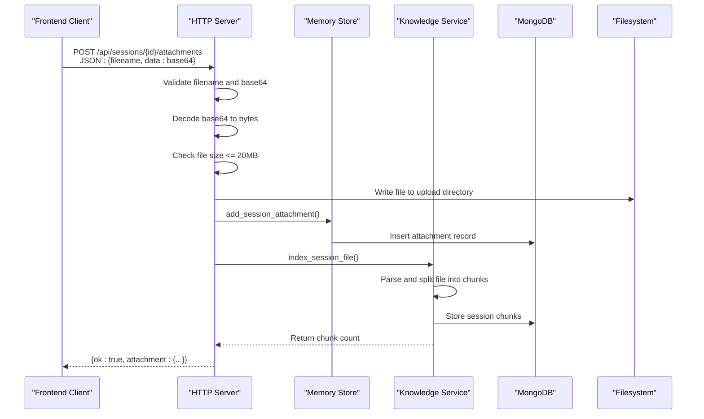
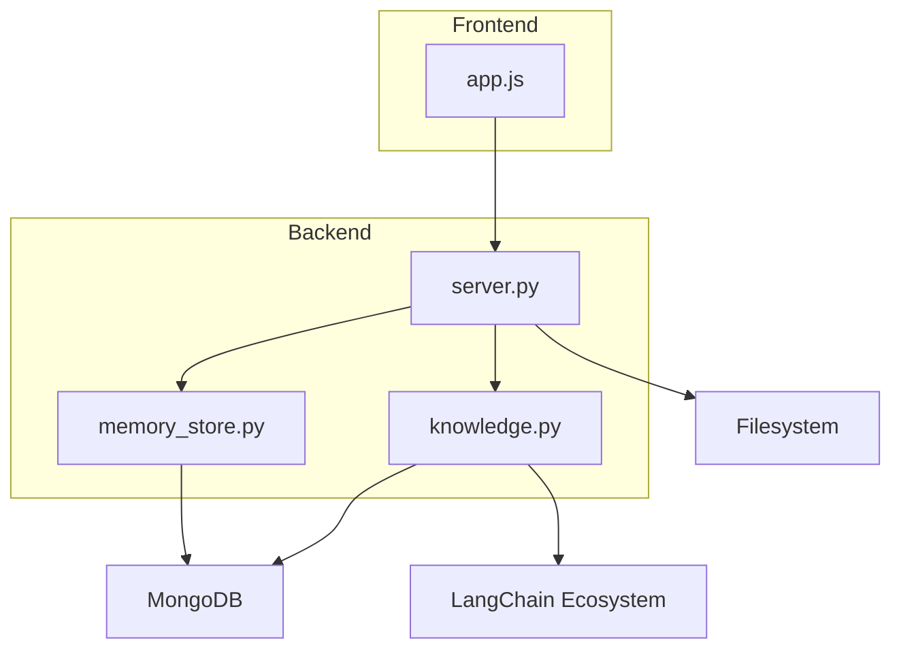

# Attachment Upload and Management

<cite>
**Referenced Files in This Document**
- [server.py](file://backend/server.py)
- [knowledge.py](file://backend/tools/knowledge.py)
- [memory_store.py](file://backend/core/memory_store.py)
- [app.js](file://frontend/scripts/app.js)
- [config.py](file://backend/config.py)
- [requirements.txt](file://requirements.txt)
- [README.md](file://README.md)
</cite>

## Update Summary
**Changes Made**
- Enhanced file attachment system with comprehensive upload handling
- Added base64 validation and size limits enforcement
- Implemented session-scoped document indexing with integrated knowledge service
- Updated supported file types to include image formats (.png, .jpg, .jpeg)
- Improved error handling and partial failure scenarios
- Enhanced cleanup procedures for session and attachment management

## Table of Contents
1. [Introduction](#introduction)
2. [Project Structure](#project-structure)
3. [Core Components](#core-components)
4. [Architecture Overview](#architecture-overview)
5. [Detailed Component Analysis](#detailed-component-analysis)
6. [Dependency Analysis](#dependency-analysis)
7. [Performance Considerations](#performance-considerations)
8. [Troubleshooting Guide](#troubleshooting-guide)
9. [Conclusion](#conclusion)

## Introduction
This document provides comprehensive documentation for the attachment upload and management system. It covers the POST /api/sessions/{id}/attachments endpoint, including base64 encoding, file validation, size limits, supported file types, security considerations, and the complete file processing pipeline. The system now features enhanced session-scoped document indexing with integrated knowledge service, providing robust file ingestion with RAG capabilities.

## Project Structure
The attachment upload feature spans the backend HTTP server, knowledge service, memory store, and frontend client. The backend implements the REST endpoint, performs validation, persists metadata, parses and indexes files, and manages cleanup. The frontend prepares files for upload by converting them to base64 and sending them to the backend.

**Diagram sources**
- [server.py:67-83](file://backend/server.py#L67-L83)
- [knowledge.py:88-140](file://backend/tools/knowledge.py#L88-L140)
- [memory_store.py:67-117](file://backend/core/memory_store.py#L67-L117)

**Section sources**
- [server.py:67-83](file://backend/server.py#L67-L83)
- [knowledge.py:88-140](file://backend/tools/knowledge.py#L88-L140)
- [memory_store.py:67-117](file://backend/core/memory_store.py#L67-L117)

## Core Components
- **HTTP Server**: Implements the POST /api/sessions/{id}/attachments endpoint, validates requests, decodes base64 data, enforces size limits, saves files to disk, registers metadata in MongoDB, and triggers RAG indexing.
- **Knowledge Service**: Parses uploaded files, splits them into chunks, stores chunks in MongoDB, and builds retrievers for session-scoped search with hybrid BM25 + FAISS capabilities.
- **Memory Store**: Provides MongoDB-backed persistence for session attachments and session chunks, including CRUD operations and cleanup routines.
- **Frontend Client**: Converts files to base64, validates file types and sizes, and posts them to the backend.

**Section sources**
- [server.py:220-248](file://backend/server.py#L220-L248)
- [knowledge.py:304-336](file://backend/tools/knowledge.py#L304-L336)
- [memory_store.py:754-796](file://backend/core/memory_store.py#L754-L796)
- [app.js:1644-1726](file://frontend/scripts/app.js#L1644-L1726)

## Architecture Overview
The upload flow integrates client-side preparation, server-side validation and processing, and database storage with optional RAG indexing.

**Diagram sources**
- [server.py:220-248](file://backend/server.py#L220-L248)
- [knowledge.py:304-336](file://backend/tools/knowledge.py#L304-L336)
- [memory_store.py:754-779](file://backend/core/memory_store.py#L754-L779)

## Detailed Component Analysis

### Endpoint Definition
- **Method**: POST
- **Path**: /api/sessions/{session_id}/attachments
- **Purpose**: Upload a file for a specific session, decode base64, validate, persist metadata, parse and index for search.

**Section sources**
- [server.py:220-248](file://backend/server.py#L220-L248)

### Request Schema
- **Content-Type**: application/json
- **Body fields**:
  - filename: string, required
  - data: string, required (base64-encoded file content)

**Validation rules enforced by the server**:
- filename must be present and non-empty
- data must be present and valid base64
- file extension must be one of: .pdf, .docx, .doc, .txt, .md, .csv, .json, .png, .jpg, .jpeg
- file size must not exceed 20 MB

**Section sources**
- [server.py:220-248](file://backend/server.py#L220-L248)
- [app.js:1668-1679](file://frontend/scripts/app.js#L1668-L1679)

### Response Schema
On success:
- ok: boolean
- attachment: object containing:
  - attachment_id: string
  - session_id: string
  - filename: string
  - file_type: string
  - file_size: integer
  - storage_path: string
  - created_at: ISO timestamp
  - chunk_count: integer (present if indexing succeeds)

On error:
- error: string describing the failure

**Section sources**
- [server.py:245](file://backend/server.py#L245)
- [memory_store.py:762-779](file://backend/core/memory_store.py#L762-L779)

### Supported File Types
**Updated** Enhanced file type support includes both document and image formats:
- **Documents**: .pdf, .docx, .doc, .txt, .md, .csv, .json
- **Images**: .png, .jpg, .jpeg

These are validated both on the frontend and backend to ensure consistency and security.

**Section sources**
- [knowledge.py:38](file://backend/tools/knowledge.py#L38)
- [app.js:1669](file://frontend/scripts/app.js#L1669)

### Size Limits
- **Maximum file size**: 20 MB
- **Enforced on both frontend and backend**
- **Security consideration**: Prevents resource exhaustion and ensures optimal processing performance

**Section sources**
- [app.js:1676-1679](file://frontend/scripts/app.js#L1676-L1679)

### Security Considerations
- **Base64 decoding occurs on the server**: Clients send pre-encoded data for security
- **File type validation**: Prevents unexpected binary content and malicious file types
- **Size checks**: Prevents resource exhaustion attacks
- **Storage path management**: Uses safe naming scheme combining session_id and original filename
- **Cleanup procedures**: Remove both metadata and physical files when sessions or attachments are deleted
- **Session isolation**: Files are scoped to specific sessions for privacy and organization

**Section sources**
- [server.py:222-228](file://backend/server.py#L222-L228)
- [server.py:153-162](file://backend/server.py#L153-L162)
- [memory_store.py:788-796](file://backend/core/memory_store.py#L788-L796)

### File Processing Pipeline
**Enhanced** The processing pipeline now includes comprehensive validation and session-scoped indexing:

1. **Validation Phase**
   - Filename and base64 presence checked
   - Extension validated against allowed types (.pdf, .docx, .doc, .txt, .md, .csv, .json, .png, .jpg, .jpeg)
   - Size validated against 20 MB limit
   - Session existence verified

2. **Decoding and Writing**
   - Base64 decoded to bytes
   - Bytes written to upload directory under a safe filename: `{session_id}_{original_filename}`

3. **Metadata Registration**
   - Attachment record inserted into MongoDB with fields: attachment_id, session_id, filename, file_type, file_size, storage_path, created_at

4. **Parsing and Indexing**
   - File parsed using Unstructured loader
   - Split into chunks with configured splitter (chunk_size=1200, chunk_overlap=200)
   - Chunks stored in MongoDB with metadata (source filename, start_index)
   - Session retriever cache invalidated to rebuild on next search
   - Hybrid retriever (BM25 + FAISS) built when embeddings are available

5. **Response**
   - Returns attachment metadata with chunk_count
   - No partial failure handling for indexing errors (throws HTTP 400)

**Section sources**
- [server.py:220-248](file://backend/server.py#L220-L248)
- [knowledge.py:304-336](file://backend/tools/knowledge.py#L304-L336)
- [memory_store.py:754-779](file://backend/core/memory_store.py#L754-L779)

### Attachment Data Model
**Enhanced** MongoDB collections for attachment management:
- **Collection**: session_attachments
- **Fields**:
  - attachment_id: string (unique)
  - session_id: string
  - filename: string
  - file_type: string
  - file_size: integer
  - storage_path: string
  - created_at: ISO timestamp

- **Collection**: session_chunks  
- **Fields**:
  - chunk_id: string (unique)
  - attachment_id: string
  - session_id: string
  - chunk_index: integer
  - text: string
  - metadata: dict (includes source filename, start_index)
  - created_at: ISO timestamp

**Indexes**:
- session_attachments: attachment_id (unique), session_id
- session_chunks: chunk_id (unique), session_id, attachment_id

**Section sources**
- [memory_store.py:55-61](file://backend/core/memory_store.py#L55-L61)
- [memory_store.py:130-134](file://backend/core/memory_store.py#L130-L134)
- [memory_store.py:754-796](file://backend/core/memory_store.py#L754-L796)

### Storage Path Management
- **Upload directory**: Configured via Settings and KnowledgeService initialization
- **File naming**: `{session_id}_{original_filename}` to avoid collisions and preserve context
- **Disk path**: Recorded in attachment metadata for cleanup operations
- **Directory creation**: Automatic creation of upload directory if it doesn't exist

**Section sources**
- [server.py:102](file://backend/server.py#L102)
- [knowledge.py:118-120](file://backend/tools/knowledge.py#L118-L120)
- [server.py:224-228](file://backend/server.py#L224-L228)

### Cleanup Procedures
**Enhanced** Comprehensive cleanup procedures for session and attachment management:

- **On session deletion**:
  - Retrieve all attachments for the session
  - Delete attachment records from MongoDB
  - Remove associated files from filesystem
  - Clear session retriever cache
  - Delete all session chunks from MongoDB

- **On individual attachment deletion**:
  - Delete attachment record and chunks
  - Remove file from filesystem
  - Invalidate session retriever cache

- **On knowledge base cleanup**:
  - Remove cached retriever for deleted session
  - Clean up orphaned chunk references

**Section sources**
- [server.py:153-162](file://backend/server.py#L153-L162)
- [memory_store.py:788-796](file://backend/core/memory_store.py#L788-L796)
- [knowledge.py:390-394](file://backend/tools/knowledge.py#L390-L394)

### Error Handling and Partial Failures
**Enhanced** Robust error handling with clear failure modes:

- **Invalid request**: missing filename or data, invalid base64, unsupported type, or oversized file
- **Parsing failures**: file saved but parsing raises ValueError; returns HTTP 400 with error details
- **Indexing failures**: file saved but chunk storage fails; returns HTTP 400 with error details
- **Cleanup resilience**: file removal attempts are wrapped in try/catch to avoid blocking deletion
- **Session isolation**: Errors in one session don't affect others

**Section sources**
- [server.py:246-247](file://backend/server.py#L246-L247)
- [knowledge.py:317-319](file://backend/tools/knowledge.py#L317-L319)
- [server.py:157-161](file://backend/server.py#L157-L161)

### Recovery Mechanisms
**Enhanced** Multiple recovery strategies for failed uploads:

- **Retry mechanism**: Failed uploads can be retried by re-uploading the same file
- **Cleanup automation**: Session deletion automatically removes orphaned files and metadata
- **Cache invalidation**: Session retriever cache is invalidated upon successful indexing to reflect new chunks
- **Graceful degradation**: System continues operating even if individual file indexing fails
- **Partial recovery**: Successful attachments remain accessible even if subsequent indexing fails

**Section sources**
- [knowledge.py:331-334](file://backend/tools/knowledge.py#L331-L334)
- [server.py:153-162](file://backend/server.py#L153-L162)

## Dependency Analysis
**Enhanced** The attachment upload feature depends on:
- **Backend HTTP server**: For routing and validation
- **Memory Store**: For MongoDB persistence and session management
- **Knowledge Service**: For file parsing, chunking, and hybrid retriever construction
- **Frontend client**: For base64 conversion and request posting
- **MongoDB**: For storing attachment metadata and chunks
- **Filesystem**: For temporary file storage
- **LangChain ecosystem**: For document parsing and RAG capabilities

**Diagram sources**
- [server.py:67-83](file://backend/server.py#L67-L83)
- [knowledge.py:88-140](file://backend/tools/knowledge.py#L88-L140)
- [memory_store.py:67-117](file://backend/core/memory_store.py#L67-L117)
- [app.js:1644-1726](file://frontend/scripts/app.js#L1644-L1726)

**Section sources**
- [server.py:67-83](file://backend/server.py#L67-L83)
- [knowledge.py:88-140](file://backend/tools/knowledge.py#L88-L140)
- [memory_store.py:67-117](file://backend/core/memory_store.py#L67-L117)
- [app.js:1644-1726](file://frontend/scripts/app.js#L1644-L1726)

## Performance Considerations
**Enhanced** Performance optimizations and considerations:

- **Base64 decoding overhead**: Decoding large files increases CPU usage; ensure clients send appropriately sized files
- **Chunk size optimization**: Configured splitter balances recall and performance (chunk_size=1200, chunk_overlap=200)
- **Embeddings availability**: When LM Studio embeddings are available, hybrid retriever improves search quality but adds latency
- **Cleanup efficiency**: Batch deletions minimize database round-trips during session cleanup
- **Memory management**: Session retriever caching reduces repeated processing costs
- **File type diversity**: Support for images expands use cases while maintaining processing efficiency
- **Connection pooling**: MongoDB connections reused across operations

## Troubleshooting Guide
**Enhanced** Common issues and resolutions:

- **Invalid base64 data**: Verify client-side base64 conversion and ensure no extra headers are included
- **Unsupported file type**: Confirm extension matches allowed types; update frontend/backend lists if necessary
- **File too large**: Reduce file size or compress content; ensure both frontend and backend checks align
- **Parsing failures**: Inspect error messages; retry after fixing file format or content
- **Indexing failures**: Check MongoDB connectivity and embeddings availability; verify upload directory permissions
- **Missing attachment metadata**: Verify MongoDB connectivity and indexes; ensure add_session_attachment completes
- **Orphaned files**: Run cleanup routines after session deletion; confirm file removal logs
- **Hybrid retriever issues**: Verify LM Studio embeddings are available; fallback to BM25-only mode
- **Session isolation problems**: Ensure proper session_id handling in requests

**Section sources**
- [server.py:246-247](file://backend/server.py#L246-L247)
- [knowledge.py:317-319](file://backend/tools/knowledge.py#L317-L319)
- [server.py:153-162](file://backend/server.py#L153-L162)

## Conclusion
**Enhanced** The attachment upload and management system provides a robust, secure, and scalable pipeline for file ingestion with comprehensive RAG capabilities. The system enforces strict validation, persists metadata reliably, and offers resilient cleanup and recovery mechanisms. The integration of session-scoped document indexing with hybrid BM25 + FAISS retrievers enables powerful search capabilities while maintaining session isolation and performance. The modular design separates concerns between HTTP handling, parsing, and persistence, enabling maintainability and scalability for future enhancements.