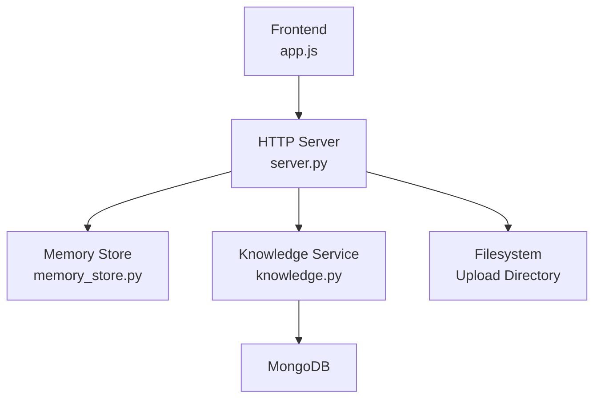
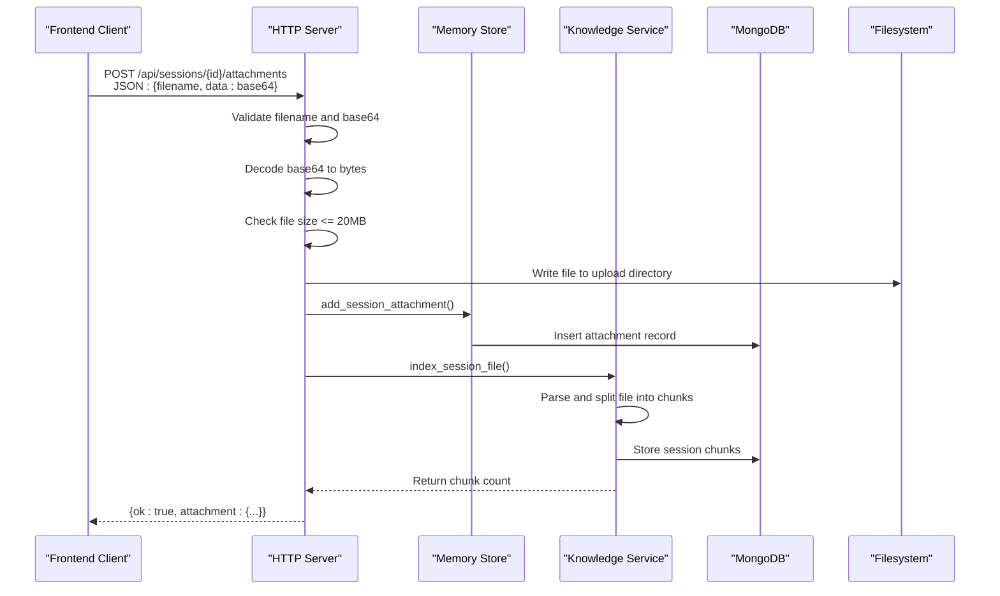
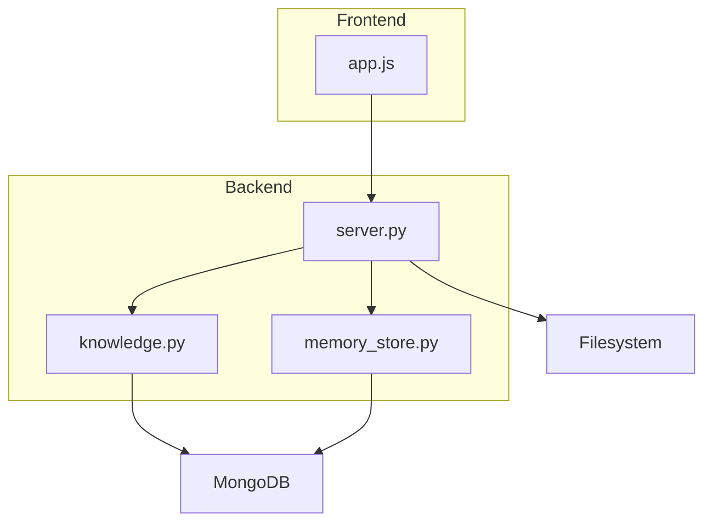

# Attachment Upload and Management

<cite>
**Referenced Files in This Document**
- [server.py](file://backend/server.py)
- [knowledge.py](file://backend/tools/knowledge.py)
- [memory_store.py](file://backend/core/memory_store.py)
- [app.js](file://frontend/scripts/app.js)
- [config.py](file://backend/config.py)
- [requirements.txt](file://requirements.txt)
</cite>

## Table of Contents
1. [Introduction](#introduction)
2. [Project Structure](#project-structure)
3. [Core Components](#core-components)
4. [Architecture Overview](#architecture-overview)
5. [Detailed Component Analysis](#detailed-component-analysis)
6. [Dependency Analysis](#dependency-analysis)
7. [Performance Considerations](#performance-considerations)
8. [Troubleshooting Guide](#troubleshooting-guide)
9. [Conclusion](#conclusion)

## Introduction
This document provides comprehensive documentation for the attachment upload and management system. It covers the POST /api/sessions/{id}/attachments endpoint, including base64 encoding, file validation, size limits, supported file types, security considerations, and the complete file processing pipeline. It also details the attachment data model, storage path management, cleanup procedures, request/response schemas, error handling, and recovery mechanisms for failed uploads.

## Project Structure
The attachment upload feature spans the backend HTTP server, knowledge service, memory store, and frontend client. The backend implements the REST endpoint, performs validation, persists metadata, parses and indexes files, and manages cleanup. The frontend prepares files for upload by converting them to base64 and sending them to the backend.

**Diagram sources**
- [server.py:67-83](file://backend/server.py#L67-L83)
- [knowledge.py:88-140](file://backend/tools/knowledge.py#L88-L140)
- [memory_store.py:67-117](file://backend/core/memory_store.py#L67-L117)

**Section sources**
- [server.py:67-83](file://backend/server.py#L67-L83)
- [knowledge.py:88-140](file://backend/tools/knowledge.py#L88-L140)
- [memory_store.py:67-117](file://backend/core/memory_store.py#L67-L117)

## Core Components
- HTTP Server: Implements the POST /api/sessions/{id}/attachments endpoint, validates requests, decodes base64 data, enforces size limits, saves files to disk, registers metadata in MongoDB, and triggers RAG indexing.
- Knowledge Service: Parses uploaded files, splits them into chunks, stores chunks in MongoDB, and builds retrievers for session-scoped search.
- Memory Store: Provides MongoDB-backed persistence for session attachments and session chunks, including CRUD operations and cleanup routines.
- Frontend Client: Converts files to base64, validates file types and sizes, and posts them to the backend.

**Section sources**
- [server.py:329-393](file://backend/server.py#L329-L393)
- [knowledge.py:303-335](file://backend/tools/knowledge.py#L303-L335)
- [memory_store.py:754-796](file://backend/core/memory_store.py#L754-L796)
- [app.js:1593-1637](file://frontend/scripts/app.js#L1593-L1637)

## Architecture Overview
The upload flow integrates client-side preparation, server-side validation and processing, and database storage with optional RAG indexing.

**Diagram sources**
- [server.py:204-209](file://backend/server.py#L204-L209)
- [server.py:329-393](file://backend/server.py#L329-L393)
- [knowledge.py:303-335](file://backend/tools/knowledge.py#L303-L335)
- [memory_store.py:754-779](file://backend/core/memory_store.py#L754-L779)

## Detailed Component Analysis

### Endpoint Definition
- Method: POST
- Path: /api/sessions/{id}/attachments
- Purpose: Upload a file for a specific session, decode base64, validate, persist metadata, parse and index for search.

**Section sources**
- [server.py:204-209](file://backend/server.py#L204-L209)

### Request Schema
- Content-Type: application/json
- Body fields:
  - filename: string, required
  - data: string, required (base64-encoded file content)

Validation rules enforced by the server:
- filename must be present and non-empty
- data must be present and valid base64
- file extension must be one of: .pdf, .docx, .doc, .txt, .md, .csv, .json
- file size must not exceed 20 MB

**Section sources**
- [server.py:333-361](file://backend/server.py#L333-L361)
- [app.js:1594-1604](file://frontend/scripts/app.js#L1594-L1604)

### Response Schema
On success:
- ok: boolean
- attachment: object containing:
  - attachment_id: string
  - session_id: string
  - filename: string
  - file_type: string
  - file_size: integer
  - storage_path: string
  - created_at: ISO timestamp
  - chunk_count: integer (optional, present if indexing succeeds)
  - parse_error: string (optional, present if indexing fails)

On error:
- error: string describing the failure

**Section sources**
- [server.py:372-393](file://backend/server.py#L372-L393)
- [memory_store.py:762-779](file://backend/core/memory_store.py#L762-L779)

### Supported File Types
- .pdf
- .docx
- .doc
- .txt
- .md
- .csv
- .json

These are validated both on the frontend and backend to ensure consistency.

**Section sources**
- [server.py:326](file://backend/server.py#L326)
- [knowledge.py:38](file://backend/tools/knowledge.py#L38)
- [app.js:1594](file://frontend/scripts/app.js#L1594)

### Size Limits
- Maximum file size: 20 MB
- Enforced on both frontend and backend

**Section sources**
- [server.py:327](file://backend/server.py#L327)
- [app.js:1601-1604](file://frontend/scripts/app.js#L1601-L1604)

### Security Considerations
- Base64 decoding occurs on the server; clients send pre-encoded data.
- File type validation prevents unexpected binary content.
- Size checks prevent resource exhaustion.
- Storage path uses a safe naming scheme combining session_id and original filename.
- Cleanup routines remove both metadata and physical files when sessions or attachments are deleted.

**Section sources**
- [server.py:349-369](file://backend/server.py#L349-L369)
- [server.py:437-444](file://backend/server.py#L437-L444)
- [server.py:457-462](file://backend/server.py#L457-L462)

### File Processing Pipeline
1. Validation
   - Filename and base64 presence checked
   - Extension validated against allowed types
   - Size validated against 20 MB limit
2. Decoding and Writing
   - Base64 decoded to bytes
   - Bytes written to upload directory under a safe filename: {session_id}_{original_filename}
3. Metadata Registration
   - Attachment record inserted into MongoDB with fields: attachment_id, session_id, filename, file_type, file_size, storage_path, created_at
4. Parsing and Indexing
   - File parsed using Unstructured loader
   - Split into chunks with configured splitter
   - Chunks stored in MongoDB with metadata
   - Session retriever cache invalidated to rebuild on next search
5. Response
   - Returns attachment metadata; if indexing fails, returns parse_error but retains the attachment record

**Section sources**
- [server.py:329-393](file://backend/server.py#L329-L393)
- [knowledge.py:303-335](file://backend/tools/knowledge.py#L303-L335)
- [memory_store.py:754-779](file://backend/core/memory_store.py#L754-L779)

### Attachment Data Model
MongoDB collection: session_attachments
Fields:
- attachment_id: string (unique)
- session_id: string
- filename: string
- file_type: string
- file_size: integer
- storage_path: string
- created_at: ISO timestamp

Indexes:
- attachment_id (unique)
- session_id

**Section sources**
- [memory_store.py:55-57](file://backend/core/memory_store.py#L55-L57)
- [memory_store.py:130-131](file://backend/core/memory_store.py#L130-L131)
- [memory_store.py:762-779](file://backend/core/memory_store.py#L762-L779)

### Storage Path Management
- Upload directory is configured via Settings and KnowledgeService initialization
- Files are stored as {session_id}_{original_filename} to avoid collisions and preserve context
- Disk path is recorded in the attachment metadata for cleanup

**Section sources**
- [server.py:51-56](file://backend/server.py#L51-L56)
- [server.py:364-369](file://backend/server.py#L364-L369)
- [memory_store.py:762-779](file://backend/core/memory_store.py#L762-L779)

### Cleanup Procedures
- On session deletion:
  - Retrieve all attachments for the session
  - Delete attachment records from MongoDB
  - Remove associated files from filesystem
  - Clear session retriever cache
- On individual attachment deletion:
  - Delete attachment record and chunks
  - Remove file from filesystem
  - Invalidate session retriever cache

**Section sources**
- [server.py:632-646](file://backend/server.py#L632-L646)
- [server.py:437-444](file://backend/server.py#L437-L444)
- [server.py:455-466](file://backend/server.py#L455-L466)
- [memory_store.py:788-796](file://backend/core/memory_store.py#L788-L796)

### Error Handling and Partial Failures
- Invalid request: missing filename or data, invalid base64, unsupported type, or oversized file
- Parsing/indexing failures: file saved but indexing raises ValueError; attachment record retained with parse_error field
- Cleanup resilience: file removal attempts are wrapped in try/catch to avoid blocking deletion

**Section sources**
- [server.py:336-361](file://backend/server.py#L336-L361)
- [server.py:389-391](file://backend/server.py#L389-L391)
- [server.py:441-444](file://backend/server.py#L441-L444)
- [server.py:459-462](file://backend/server.py#L459-L462)

### Recovery Mechanisms
- Partial failure scenario: if indexing fails, the attachment remains registered and can be reprocessed later by deleting and re-uploading
- Cleanup ensures orphaned files are removed during session or attachment deletion
- Session retriever cache is invalidated upon successful indexing to reflect new chunks

**Section sources**
- [server.py:389-391](file://backend/server.py#L389-L391)
- [server.py:330-335](file://backend/server.py#L330-L335)
- [knowledge.py:330-333](file://backend/tools/knowledge.py#L330-L333)

## Dependency Analysis
The attachment upload feature depends on:
- Backend HTTP server for routing and validation
- Memory Store for MongoDB persistence
- Knowledge Service for file parsing and chunking
- Frontend client for base64 conversion and request posting
- MongoDB for storing attachment metadata and chunks
- Filesystem for temporary file storage

**Diagram sources**
- [server.py:67-83](file://backend/server.py#L67-L83)
- [knowledge.py:88-140](file://backend/tools/knowledge.py#L88-L140)
- [memory_store.py:67-117](file://backend/core/memory_store.py#L67-L117)
- [app.js:1593-1637](file://frontend/scripts/app.js#L1593-L1637)

**Section sources**
- [server.py:67-83](file://backend/server.py#L67-L83)
- [knowledge.py:88-140](file://backend/tools/knowledge.py#L88-L140)
- [memory_store.py:67-117](file://backend/core/memory_store.py#L67-L117)
- [app.js:1593-1637](file://frontend/scripts/app.js#L1593-L1637)

## Performance Considerations
- Base64 decoding overhead: decoding large files increases CPU usage; ensure clients send appropriately sized files
- Chunk size and overlap: configured splitter balances recall and performance; adjust if needed for specific content types
- Embeddings availability: when LM Studio embeddings are available, hybrid retriever improves search quality but adds latency
- Cleanup efficiency: batch deletions minimize database round-trips during session cleanup

[No sources needed since this section provides general guidance]

## Troubleshooting Guide
Common issues and resolutions:
- Invalid base64 data: verify client-side base64 conversion and ensure no extra headers are included
- Unsupported file type: confirm extension matches allowed types; update frontend/backend lists if necessary
- File too large: reduce file size or compress content; ensure both frontend and backend checks align
- Parsing/indexing failures: inspect parse_error in response; retry after fixing file format or content
- Missing attachment metadata: verify MongoDB connectivity and indexes; ensure add_session_attachment completes
- Orphaned files: run cleanup routines after session deletion; confirm file removal logs

**Section sources**
- [server.py:336-361](file://backend/server.py#L336-L361)
- [server.py:389-391](file://backend/server.py#L389-L391)
- [server.py:437-444](file://backend/server.py#L437-L444)
- [server.py:457-462](file://backend/server.py#L457-L462)

## Conclusion
The attachment upload and management system provides a robust pipeline for secure, validated file ingestion with integrated RAG indexing. It enforces strict validation, persists metadata reliably, and offers resilient cleanup and recovery mechanisms. The modular design separates concerns between HTTP handling, parsing, and persistence, enabling maintainability and scalability.