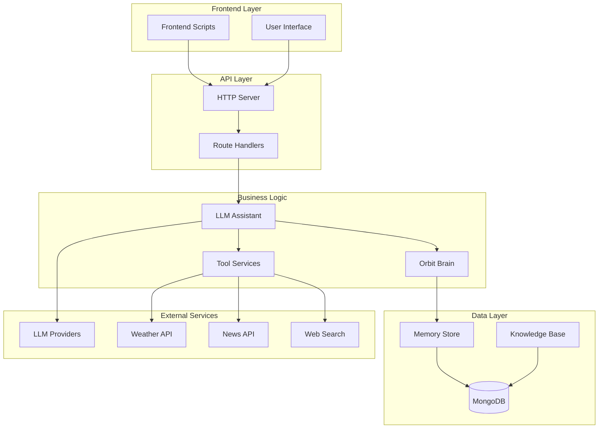
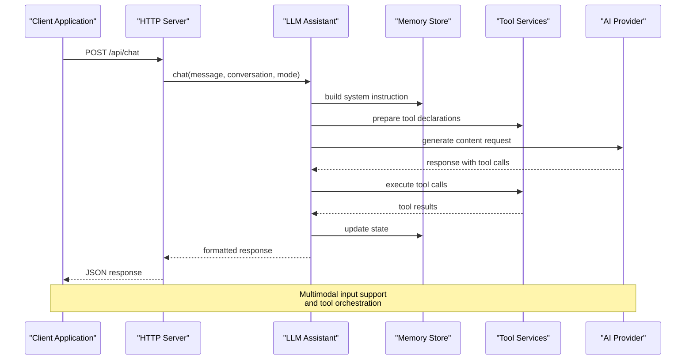
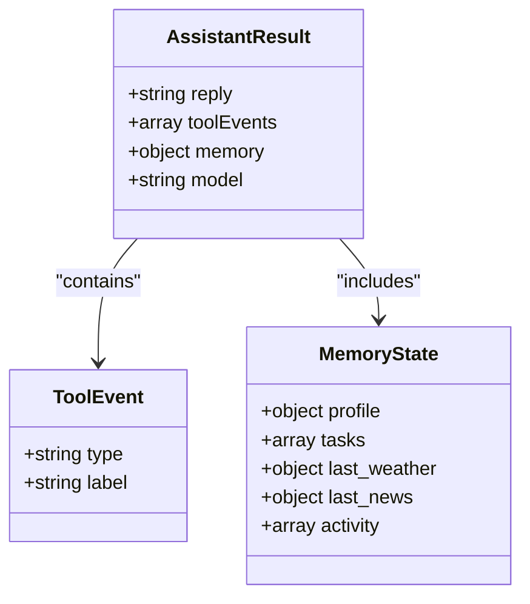
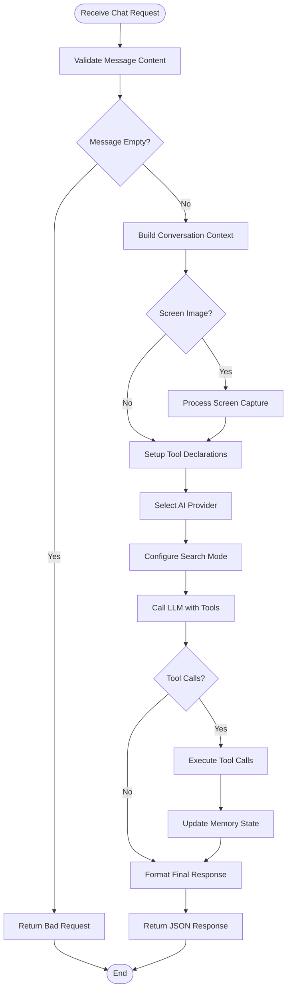
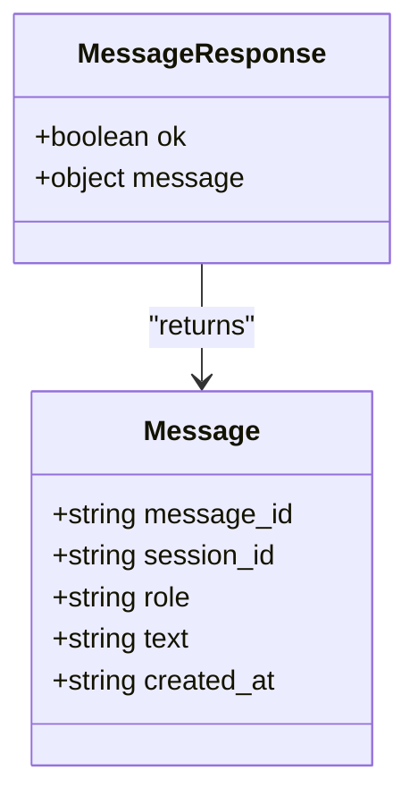
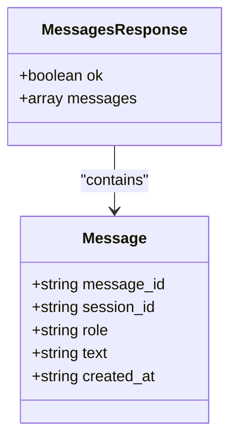
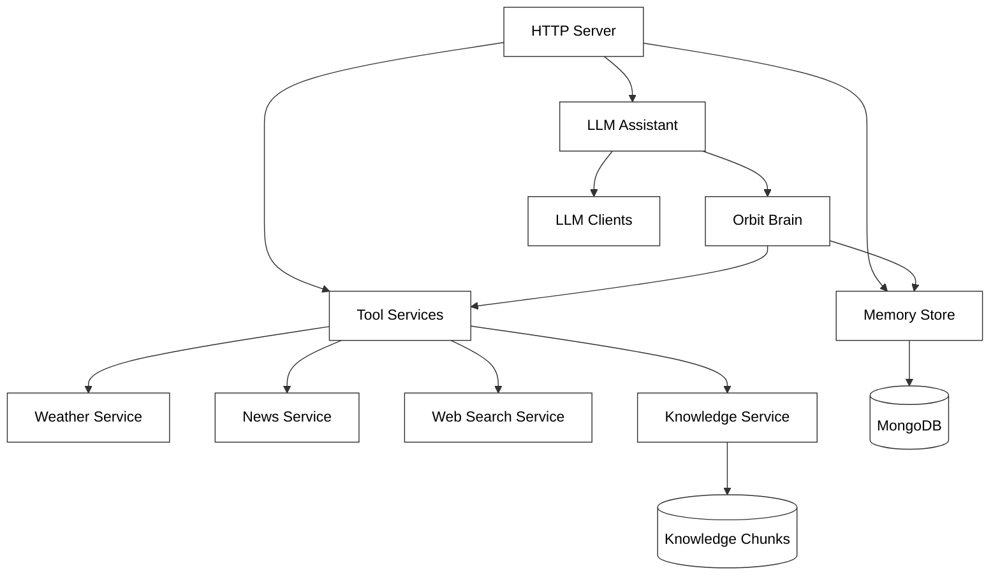

# Chat and Message Endpoints

<cite>
**Referenced Files in This Document**
- [server.py](file://backend/server.py)
- [llm_client.py](file://backend/api_clients/llm_client.py)
- [orbit_brain.py](file://backend/core/orbit_brain.py)
- [memory_store.py](file://backend/core/memory_store.py)
- [knowledge.py](file://backend/tools/knowledge.py)
- [web_search.py](file://backend/tools/web_search.py)
- [weather.py](file://backend/tools/weather.py)
- [news.py](file://backend/tools/news.py)
- [config.py](file://backend/config.py)
- [app.js](file://frontend/scripts/app.js)
</cite>

## Table of Contents
1. [Introduction](#introduction)
2. [Project Structure](#project-structure)
3. [Core Components](#core-components)
4. [Architecture Overview](#architecture-overview)
5. [Detailed Component Analysis](#detailed-component-analysis)
6. [Dependency Analysis](#dependency-analysis)
7. [Performance Considerations](#performance-considerations)
8. [Troubleshooting Guide](#troubleshooting-guide)
9. [Conclusion](#conclusion)

## Introduction

This document provides comprehensive API documentation for chat and message handling endpoints in the Orbit Virtual Assistant system. The platform offers conversational AI interactions with advanced features including multimodal input support, tool calling mechanisms, and integrated memory management. The API enables both direct chat interactions and session-based message management through REST endpoints.

The system integrates multiple AI providers (Google Gemini, OpenRouter, LM Studio, Ollama) with sophisticated tool orchestration capabilities including weather, news, web search, and document retrieval. It supports both online and offline modes with intelligent fallback mechanisms.

## Project Structure

The Orbit Virtual Assistant follows a modular architecture with clear separation of concerns:

**Diagram sources**
- [server.py:23-83](file://backend/server.py#L23-L83)
- [llm_client.py:38-60](file://backend/api_clients/llm_client.py#L38-L60)
- [memory_store.py:67-118](file://backend/core/memory_store.py#L67-L118)

**Section sources**
- [server.py:23-83](file://backend/server.py#L23-L83)
- [config.py:20-76](file://backend/config.py#L20-L76)

## Core Components

### HTTP Server and Route Handler

The backend implements a threaded HTTP server with comprehensive route handling for all API endpoints. The server manages both GET and POST operations with proper JSON serialization and error handling.

### Memory Management System

The MemoryStore provides persistent storage using MongoDB with support for sessions, messages, profiles, tasks, and knowledge chunks. It maintains thread-safe operations and automatic indexing for optimal performance.

### LLM Integration Layer

The LLMAssistant orchestrates conversations with multiple AI providers through a unified interface. It handles multimodal inputs, tool calling, and response streaming patterns.

### Tool Services

Integrated services for weather, news, web search, and document retrieval provide contextual information to enhance AI responses. These services are designed for reliability with fallback mechanisms.

**Section sources**
- [server.py:85-168](file://backend/server.py#L85-L168)
- [memory_store.py:67-118](file://backend/core/memory_store.py#L67-L118)
- [llm_client.py:38-60](file://backend/api_clients/llm_client.py#L38-L60)

## Architecture Overview

The system employs a layered architecture with clear separation between presentation, business logic, and data persistence:

**Diagram sources**
- [server.py:276-321](file://backend/server.py#L276-L321)
- [llm_client.py:47-78](file://backend/api_clients/llm_client.py#L47-L78)
- [orbit_brain.py:302-356](file://backend/core/orbit_brain.py#L302-L356)

## Detailed Component Analysis

### POST /api/chat - Conversational AI Endpoint

The `/api/chat` endpoint provides comprehensive conversational AI capabilities with support for multimodal inputs and advanced configuration options.

#### Request Parameters

| Parameter | Type | Required | Description |
|-----------|------|----------|-------------|
| message | string | Yes | The user's input message |
| conversation | array | No | Previous conversation history |
| screenImage | string | No | Base64 encoded screen capture |
| mode | string | No | Conversation mode (simple/copilot/coach) |
| coachTopic | string | No | Topic for coaching mode |
| coachLevel | string | No | Difficulty level for coaching |
| preferredLanguage | string | No | User's preferred language |
| webSearchOnly | boolean | No | Force web search mode |
| offlineMode | boolean | No | Disable web search |
| sessionId | string | No | Session identifier |

#### Response Schema

**Diagram sources**
- [llm_client.py:28-36](file://backend/api_clients/llm_client.py#L28-L36)
- [server.py:308-320](file://backend/server.py#L308-L320)

#### Processing Workflow

**Diagram sources**
- [server.py:276-321](file://backend/server.py#L276-L321)
- [llm_client.py:82-216](file://backend/api_clients/llm_client.py#L82-L216)

#### Multimodal Input Support

The system supports both text and image inputs through data URI encoding:

- **Text Input**: Standard string message
- **Image Input**: Base64 encoded data URI with MIME type detection
- **Mixed Input**: Combined text and image in single request

#### Tool Calling Mechanisms

The assistant can execute multiple tools in sequence or parallel based on user requests:

| Tool | Purpose | Trigger Conditions |
|------|---------|-------------------|
| get_weather | Current weather information | Location queries |
| get_latest_news | Latest headlines | News-related questions |
| search_web | Internet search | Factual queries |
| search_local_docs | Knowledge base search | Local document queries |
| search_session_docs | Session document search | Attached file queries |
| remember_note | Memory storage | User requests to remember |
| add_task | Task creation | Actionable requests |
| complete_task | Task completion | Completion requests |

**Section sources**
- [server.py:276-321](file://backend/server.py#L276-L321)
- [llm_client.py:82-216](file://backend/api_clients/llm_client.py#L82-L216)
- [orbit_brain.py:74-268](file://backend/core/orbit_brain.py#L74-L268)

### POST /api/sessions/{id}/messages - Direct Message Creation

This endpoint allows direct creation of messages within a specific session, bypassing the chat workflow.

#### Request Parameters

| Parameter | Type | Required | Description |
|-----------|------|----------|-------------|
| role | string | No | Message role (user/assistant) |
| text | string | Yes | Message content |

#### Response Schema

**Diagram sources**
- [server.py:188-202](file://backend/server.py#L188-L202)
- [memory_store.py:652-673](file://backend/core/memory_store.py#L652-L673)

#### Validation Rules

- **Text Validation**: Non-empty text required
- **Session Validation**: Valid session ID required
- **Role Validation**: Only 'user' and 'assistant' roles accepted

**Section sources**
- [server.py:188-202](file://backend/server.py#L188-L202)
- [memory_store.py:652-673](file://backend/core/memory_store.py#L652-L673)

### GET /api/sessions/{id}/messages - Message Retrieval

This endpoint retrieves all messages from a specific session with optional pagination.

#### Query Parameters

| Parameter | Type | Default | Description |
|-----------|------|---------|-------------|
| limit | integer | 0 | Maximum number of messages to return |

#### Response Schema

**Diagram sources**
- [server.py:128-135](file://backend/server.py#L128-L135)
- [memory_store.py:675-685](file://backend/core/memory_store.py#L675-L685)

#### Pagination Behavior

- **limit = 0**: Return all messages (default)
- **limit > 0**: Return up to specified number of messages
- **Order**: Messages sorted chronologically by creation time

**Section sources**
- [server.py:128-135](file://backend/server.py#L128-L135)
- [memory_store.py:675-685](file://backend/core/memory_store.py#L675-L685)

### Session Management Endpoints

#### POST /api/sessions - Create New Session

Creates a new chat session with automatic title generation.

#### GET /api/sessions - List Sessions

Retrieves all sessions with optional archived filtering.

#### Session Operations

- **Pinning**: Keep important sessions at top
- **Archiving**: Hide completed sessions
- **Deletion**: Remove sessions with all associated data

**Section sources**
- [server.py:110-127](file://backend/server.py#L110-L127)
- [memory_store.py:579-646](file://backend/core/memory_store.py#L579-L646)

## Dependency Analysis

The system exhibits clear dependency relationships with well-defined interfaces:

**Diagram sources**
- [server.py:23-63](file://backend/server.py#L23-L63)
- [llm_client.py:38-46](file://backend/api_clients/llm_client.py#L38-L46)
- [memory_store.py:67-118](file://backend/core/memory_store.py#L67-L118)

### External Dependencies

| Component | External Service | Purpose |
|-----------|------------------|---------|
| Weather Service | Open-Meteo API | Current weather data |
| News Service | Google News RSS | Latest headlines |
| Web Search | Tavily/DuckDuckGo | Internet search results |
| Knowledge Base | FAISS/BM25 | Document retrieval |
| LLM Providers | Gemini/OpenRouter | AI model inference |

**Section sources**
- [weather.py:48-141](file://backend/tools/weather.py#L48-L141)
- [news.py:22-83](file://backend/tools/news.py#L22-L83)
- [web_search.py:53-139](file://backend/tools/web_search.py#L53-L139)
- [knowledge.py:88-393](file://backend/tools/knowledge.py#L88-L393)

## Performance Considerations

### Response Streaming Patterns

The system implements efficient response handling through:

- **Connection Pooling**: Reuse connections for multiple tool calls
- **Timeout Management**: 90-second timeouts for LLM requests
- **Memory Optimization**: Chunk-based knowledge processing
- **Caching**: Recent weather and news caching

### Scalability Features

- **Thread Safety**: Thread locks for concurrent operations
- **Indexing**: MongoDB indexes for fast query performance
- **Pagination**: Efficient message retrieval with limits
- **Lazy Loading**: Knowledge base chunks loaded on demand

### Resource Management

- **Memory Limits**: 20MB file upload size limit
- **Tool Loop Limits**: Prevent infinite tool call recursion
- **Connection Limits**: Configurable provider rate limits
- **Cleanup Hooks**: Automatic resource cleanup

## Troubleshooting Guide

### Common Error Scenarios

#### Invalid Message Requests

**Symptoms**: 400 Bad Request with validation errors
**Causes**: Empty message content, invalid session ID
**Solutions**: 
- Ensure message contains non-empty text
- Verify session exists before sending messages
- Check API key configuration

#### Provider Errors

**Symptoms**: 502 Bad Gateway with provider errors
**Causes**: Network connectivity, API key issues, provider downtime
**Solutions**:
- Verify API key configuration in .env file
- Check network connectivity to provider endpoints
- Monitor provider status pages

#### Rate Limiting

**Symptoms**: Provider-specific rate limit responses
**Causes**: Exceeding provider quotas or temporary blocks
**Solutions**:
- Implement exponential backoff
- Monitor usage patterns
- Upgrade provider plans if necessary

#### Memory Storage Issues

**Symptoms**: MongoDB connection failures, data inconsistencies
**Causes**: Database connectivity, permission issues
**Solutions**:
- Verify MongoDB connection string
- Check database permissions
- Monitor database health metrics

### Debugging Tools

The system provides comprehensive logging and monitoring:

- **Request Logging**: All API requests and responses
- **Error Tracking**: Detailed error messages with stack traces
- **Performance Metrics**: Response times and resource usage
- **Health Checks**: Automated system status monitoring

**Section sources**
- [server.py:308-320](file://backend/server.py#L308-L320)
- [llm_client.py:161-174](file://backend/api_clients/llm_client.py#L161-L174)
- [memory_store.py:94-98](file://backend/core/memory_store.py#L94-L98)

## Conclusion

The Orbit Virtual Assistant provides a robust and scalable API for conversational AI interactions with comprehensive multimodal support and tool orchestration capabilities. The system's modular architecture ensures maintainability while providing powerful features for both development and production environments.

Key strengths include:
- **Flexible AI Provider Integration**: Support for multiple LLM providers
- **Advanced Tool Orchestration**: Intelligent tool calling and execution
- **Rich Multimodal Support**: Text and image input processing
- **Persistent Memory Management**: Comprehensive state tracking
- **Reliable Error Handling**: Comprehensive error management and recovery

The API design follows REST principles with clear request/response schemas, making integration straightforward for client applications while maintaining the flexibility needed for advanced AI interactions.