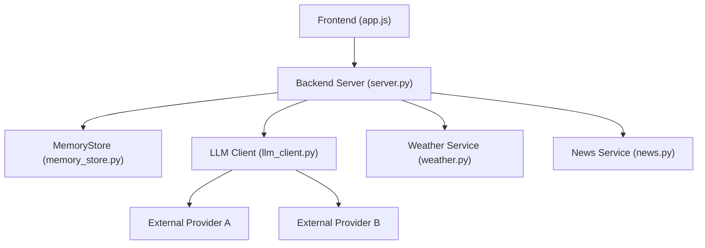
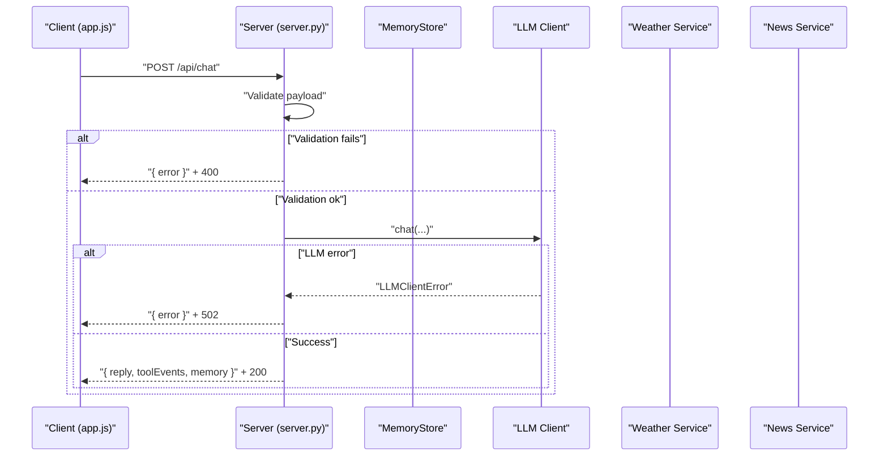
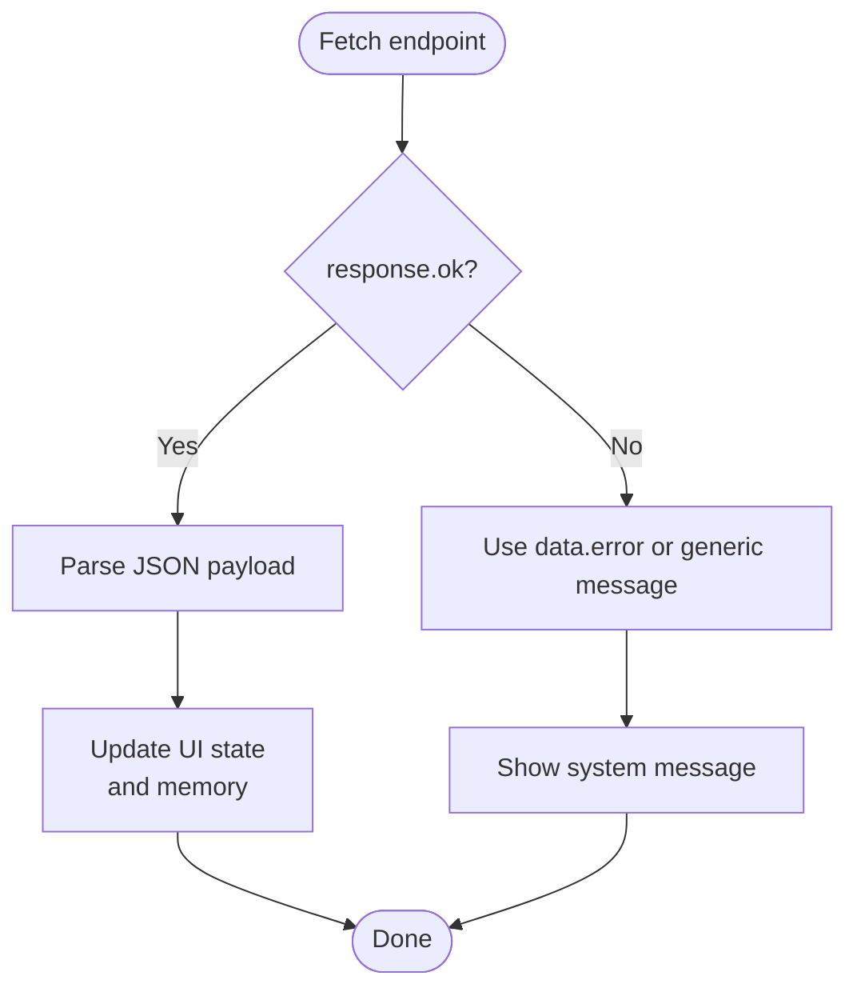
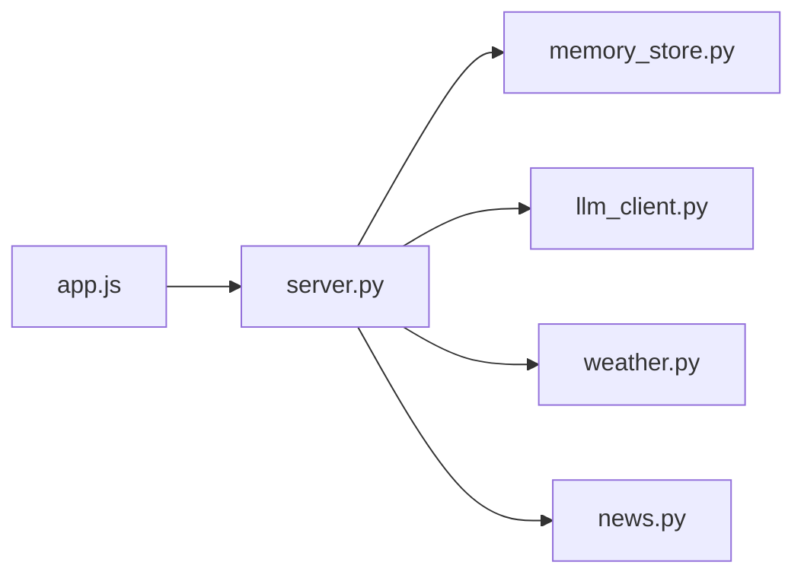

# Error Handling and Status Codes

<cite>
**Referenced Files in This Document**
- [server.py](file://backend/server.py)
- [llm_client.py](file://backend/api_clients/llm_client.py)
- [weather.py](file://backend/tools/weather.py)
- [news.py](file://backend/tools/news.py)
- [memory_store.py](file://backend/core/memory_store.py)
- [app.js](file://frontend/scripts/app.js)
- [index.html](file://frontend/index.html)
</cite>

## Table of Contents
1. [Introduction](#introduction)
2. [Project Structure](#project-structure)
3. [Core Components](#core-components)
4. [Architecture Overview](#architecture-overview)
5. [Detailed Component Analysis](#detailed-component-analysis)
6. [Dependency Analysis](#dependency-analysis)
7. [Performance Considerations](#performance-considerations)
8. [Troubleshooting Guide](#troubleshooting-guide)
9. [Conclusion](#conclusion)

## Introduction
This document explains error handling patterns and HTTP status code usage across the backend server, client-side JavaScript, and supporting services. It covers standard HTTP responses (200 OK, 201 Created, 400 Bad Request, 404 Not Found, 409 Conflict, 500 Internal Server Error), custom error responses, validation error handling, exception mapping, and specific failure scenarios such as missing parameters, invalid data types, authentication failures, and service unavailability. It also details the error response format, error code conventions, debugging information, client-side error handling, retry strategies, graceful degradation, and logging/monitoring recommendations.

## Project Structure
The system consists of:
- Backend HTTP server handling REST endpoints and delegating to domain services.
- LLM client integrating with external providers and mapping provider-specific errors.
- Domain services for weather and news with explicit error types.
- Persistent memory store with validation and error propagation.
- Frontend client performing REST calls and rendering error messages.

**Diagram sources**
- [server.py:85-500](file://backend/server.py#L85-L500)
- [llm_client.py:38-215](file://backend/api_clients/llm_client.py#L38-L215)
- [weather.py:47-141](file://backend/tools/weather.py#L47-L141)
- [news.py:22-83](file://backend/tools/news.py#L22-L83)
- [memory_store.py:67-800](file://backend/core/memory_store.py#L67-L800)

**Section sources**
- [server.py:85-500](file://backend/server.py#L85-L500)
- [app.js:902-1087](file://frontend/scripts/app.js#L902-L1087)

## Core Components
- Backend server routes and handlers:
  - GET/POST/PUT/DELETE endpoints for sessions, messages, attachments, chat, profile, tasks, notes, weather, and news.
  - Centralized JSON response writer with configurable HTTP status.
  - Validation and error mapping for malformed requests and domain exceptions.
- LLM client:
  - Provider-specific error mapping (authentication, moderation, timeouts).
  - Graceful handling of provider unavailability.
- Domain services:
  - Weather and news services raise typed exceptions for invalid inputs and transient failures.
- Memory store:
  - Validates inputs and raises ValueError/KeyError for invalid operations.
- Frontend:
  - Parses JSON responses, checks response.ok, and displays user-friendly error messages.

**Section sources**
- [server.py:85-500](file://backend/server.py#L85-L500)
- [llm_client.py:34-366](file://backend/api_clients/llm_client.py#L34-L366)
- [weather.py:43-141](file://backend/tools/weather.py#L43-L141)
- [news.py:13-83](file://backend/tools/news.py#L13-L83)
- [memory_store.py:309-446](file://backend/core/memory_store.py#L309-L446)
- [app.js:928-1087](file://frontend/scripts/app.js#L928-L1087)

## Architecture Overview
The backend exposes REST endpoints. Requests are validated and processed; domain services and LLM integrations may raise exceptions mapped to appropriate HTTP statuses. Responses are JSON with either success payloads or error fields. The frontend consumes these endpoints, displaying errors and enabling graceful degradation.

**Diagram sources**
- [server.py:276-320](file://backend/server.py#L276-L320)
- [llm_client.py:34-366](file://backend/api_clients/llm_client.py#L34-L366)

**Section sources**
- [server.py:276-320](file://backend/server.py#L276-L320)
- [llm_client.py:34-366](file://backend/api_clients/llm_client.py#L34-L366)

## Detailed Component Analysis

### HTTP Status Code Usage
- 200 OK: Successful responses for GET/POST/PUT/DELETE operations returning data or success indicators.
- 201 Created: Not explicitly used in the server code; standard for resource creation.
- 400 Bad Request: Returned for malformed requests, missing parameters, invalid data types, and validation failures.
- 404 Not Found: Returned when resources are not found (e.g., session lookup).
- 409 Conflict: Not explicitly used in the server code; reserved for resource conflicts.
- 500 Internal Server Error: Not explicitly used in the server code; the server centralizes error responses with explicit statuses.
- 502 Bad Gateway: Returned when upstream LLM provider errors occur.

Examples in code:
- 400 Bad Request for empty message, missing filename/data, unsupported file type, invalid base64, oversized file, empty note/task/title, empty message text, invalid session update fields, and missing API key.
- 404 Not Found for missing session.
- 502 Bad Gateway for LLM client errors.

**Section sources**
- [server.py:120-126](file://backend/server.py#L120-L126)
- [server.py:198-200](file://backend/server.py#L198-L200)
- [server.py:229-231](file://backend/server.py#L229-L231)
- [server.py:237-240](file://backend/server.py#L237-L240)
- [server.py:278-280](file://backend/server.py#L278-L280)
- [server.py:336-361](file://backend/server.py#L336-L361)
- [server.py:416-418](file://backend/server.py#L416-L418)
- [server.py:308-310](file://backend/server.py#L308-L310)

### Error Response Format and Conventions
- Standard JSON error response: {"error": "<description>"}. Some endpoints also include {"ok": true} on success.
- Memory store operations may return {"id": "...", ...} on success; errors return {"error": "..."}.
- LLM client maps provider errors to human-readable messages.

Recommendations:
- Use consistent keys: "error" for error messages, "ok" for success markers.
- Include optional "memory" payload for state synchronization on success.
- Keep error messages concise and actionable for users.

**Section sources**
- [server.py:114-116](file://backend/server.py#L114-L116)
- [server.py:198-200](file://backend/server.py#L198-L200)
- [server.py:308-310](file://backend/server.py#L308-L310)
- [memory_store.py:310-332](file://backend/core/memory_store.py#L310-L332)

### Validation Error Handling
Common validations and resulting statuses:
- Empty message: 400.
- Missing filename or data in attachment upload: 400.
- Unsupported file type: 400.
- Invalid base64 data: 400.
- File too large (> 20 MB): 400.
- Empty note text: 400.
- Empty task title: 400.
- Empty message text: 400.
- Empty task reference: 400.
- Empty note ID: 400.
- No valid fields to update session: 400.
- Missing API key for LLM chat: 502.

**Section sources**
- [server.py:278-280](file://backend/server.py#L278-L280)
- [server.py:336-361](file://backend/server.py#L336-L361)
- [server.py:198-200](file://backend/server.py#L198-L200)
- [server.py:229-231](file://backend/server.py#L229-L231)
- [server.py:237-240](file://backend/server.py#L237-L240)
- [server.py:416-418](file://backend/server.py#L416-L418)
- [llm_client.py:60-61](file://backend/api_clients/llm_client.py#L60-L61)

### Exception Mapping and Domain Errors
- WeatherError: Raised for invalid location or service unavailability; mapped to 400 in GET /api/weather.
- NewsError: Raised for invalid feeds or service unavailability; mapped to 400 in GET /api/news.
- ValueError/KeyError: Raised by MemoryStore for invalid inputs and missing records; mapped to 400/404 respectively.
- LLMClientError: Raised by LLM client for provider errors; mapped to 502.

**Section sources**
- [weather.py:43-54](file://backend/tools/weather.py#L43-L54)
- [weather.py:125-126](file://backend/tools/weather.py#L125-L126)
- [news.py:13-34](file://backend/tools/news.py#L13-L34)
- [news.py:80-82](file://backend/tools/news.py#L80-L82)
- [memory_store.py:310-332](file://backend/core/memory_store.py#L310-L332)
- [memory_store.py:377-446](file://backend/core/memory_store.py#L377-L446)
- [memory_store.py:448-469](file://backend/core/memory_store.py#L448-L469)
- [memory_store.py:615-630](file://backend/core/memory_store.py#L615-L630)
- [llm_client.py:34-366](file://backend/api_clients/llm_client.py#L34-L366)

### Specific Error Scenarios and Handling
- Missing parameters:
  - Chat message empty: 400.
  - Attachment missing filename/data: 400.
- Invalid data types:
  - Non-JSON body: handled gracefully; GET /api/history returns [].
- Authentication failures:
  - Missing API key for LLM: 502 with provider-specific message.
- Service unavailability:
  - Weather/News services raise errors when upstream is down; mapped to 400.
  - LLM provider unreachable or rate-limited: 502.

**Section sources**
- [server.py:278-280](file://backend/server.py#L278-L280)
- [server.py:336-361](file://backend/server.py#L336-L361)
- [server.py:152-153](file://backend/server.py#L152-L153)
- [server.py:162-163](file://backend/server.py#L162-L163)
- [llm_client.py:60-61](file://backend/api_clients/llm_client.py#L60-L61)
- [llm_client.py:161-174](file://backend/api_clients/llm_client.py#L161-L174)

### Client-Side Error Handling Patterns
- Checks response.ok and parses JSON; throws on non-OK responses using the "error" field.
- Displays user-friendly messages for session creation, message storage, chat, weather, news, tasks, notes, and file attachments.
- Handles provider moderation refusals by removing the last assistant message from conversation.
- Graceful degradation: disables UI during processing, shows thinking status, and restores UI on completion or error.

**Diagram sources**
- [app.js:1013-1015](file://frontend/scripts/app.js#L1013-L1015)
- [app.js:1072-1081](file://frontend/scripts/app.js#L1072-L1081)

**Section sources**
- [app.js:928-1087](file://frontend/scripts/app.js#L928-L1087)
- [app.js:1406-1415](file://frontend/scripts/app.js#L1406-L1415)
- [app.js:1422-1431](file://frontend/scripts/app.js#L1422-L1431)
- [app.js:1437-1456](file://frontend/scripts/app.js#L1437-L1456)
- [app.js:1458-1472](file://frontend/scripts/app.js#L1458-L1472)
- [app.js:1474-1488](file://frontend/scripts/app.js#L1474-L1488)
- [app.js:1496-1513](file://frontend/scripts/app.js#L1496-L1513)
- [app.js:1608-1632](file://frontend/scripts/app.js#L1608-L1632)

### Retry Strategies and Graceful Degradation
- Retry strategies:
  - Backoff and exponential backoff can be applied around upstream calls (e.g., weather/news/LLM) in future enhancements.
  - On transient network errors, clients can retry once or twice with a small delay.
- Graceful degradation:
  - Unsupported feature flag (imageGen) returns a predefined refusal message with 200 OK.
  - Offline mode disables web search and relies on local knowledge.
  - When LLM is unavailable, the client shows a user-friendly error and suggests alternatives.

**Section sources**
- [server.py:271-291](file://backend/server.py#L271-L291)
- [server.py:308-310](file://backend/server.py#L308-L310)

### Logging and Monitoring
- Backend:
  - MemoryStore logs connection and migration events.
  - Server prints startup and provider selection messages.
- Recommendations:
  - Log all HTTP requests/responses with correlation IDs.
  - Capture exception stack traces for 5xx-like errors.
  - Track error rates by endpoint and error type for alerting.

**Section sources**
- [memory_store.py:116-117](file://backend/core/memory_store.py#L116-L117)
- [server.py:31-43](file://backend/server.py#L31-L43)
- [server.py:568-610](file://backend/server.py#L568-L610)

## Dependency Analysis
The server orchestrates domain services and the LLM client. Exceptions raised in these components are caught and mapped to HTTP responses. The frontend depends on consistent JSON schemas and HTTP semantics.

**Diagram sources**
- [server.py:23-63](file://backend/server.py#L23-L63)
- [llm_client.py:38-46](file://backend/api_clients/llm_client.py#L38-L46)
- [weather.py:47-54](file://backend/tools/weather.py#L47-L54)
- [news.py:22-27](file://backend/tools/news.py#L22-L27)
- [memory_store.py:67-117](file://backend/core/memory_store.py#L67-L117)
- [app.js:902-1087](file://frontend/scripts/app.js#L902-L1087)

**Section sources**
- [server.py:23-63](file://backend/server.py#L23-L63)
- [llm_client.py:38-46](file://backend/api_clients/llm_client.py#L38-L46)
- [weather.py:47-54](file://backend/tools/weather.py#L47-L54)
- [news.py:22-27](file://backend/tools/news.py#L22-L27)
- [memory_store.py:67-117](file://backend/core/memory_store.py#L67-L117)
- [app.js:902-1087](file://frontend/scripts/app.js#L902-L1087)

## Performance Considerations
- Prefer early validation to avoid unnecessary downstream calls.
- Cache frequently accessed data (e.g., weather/news) to reduce upstream latency.
- Limit concurrent upstream requests to provider endpoints.
- Use streaming or progressive rendering on the client for long-running operations.

## Troubleshooting Guide
Common issues and resolutions:
- 400 Bad Request:
  - Verify required fields (message, filename, data, title).
  - Ensure file type is supported and under 20 MB.
- 404 Not Found:
  - Confirm session ID exists before fetching messages or deleting attachments.
- 502 Bad Gateway:
  - Check API key configuration and provider availability.
  - Retry after a short delay if provider throttling occurs.
- Provider moderation refusal:
  - Remove the last assistant message from conversation and adjust prompt.
- Upstream service errors:
  - Weather/News services may temporarily fail; retry or show cached data if available.

**Section sources**
- [server.py:120-126](file://backend/server.py#L120-L126)
- [server.py:152-153](file://backend/server.py#L152-L153)
- [server.py:162-163](file://backend/server.py#L162-L163)
- [server.py:308-310](file://backend/server.py#L308-L310)
- [app.js:1032-1036](file://frontend/scripts/app.js#L1032-L1036)

## Conclusion
The system implements robust error handling with clear HTTP status codes, consistent JSON error responses, and client-side resilience. By adhering to standardized error conventions, validating early, and providing graceful fallbacks, the application delivers a reliable user experience even under adverse conditions. Extending logging and implementing retry/backoff policies will further improve stability and observability.