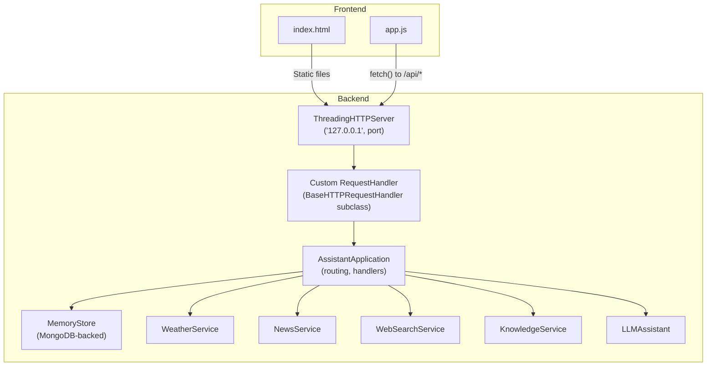
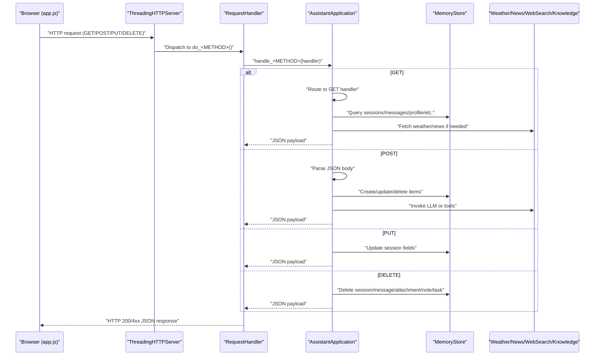
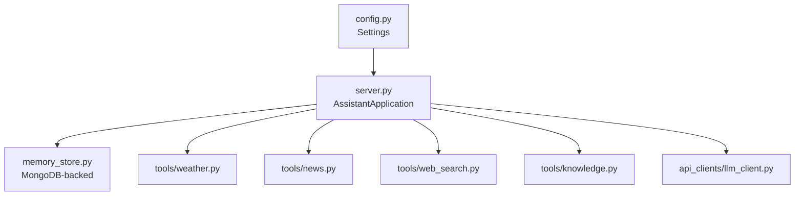

# HTTP Server and API Endpoints

<cite>
**Referenced Files in This Document**
- [server.py](file://backend/server.py)
- [config.py](file://backend/config.py)
- [run.py](file://run.py)
- [app.js](file://frontend/scripts/app.js)
- [index.html](file://frontend/index.html)
- [memory_store.py](file://backend/core/memory_store.py)
- [requirements.txt](file://requirements.txt)
- [README.md](file://README.md)
</cite>

## Table of Contents
1. [Introduction](#introduction)
2. [Project Structure](#project-structure)
3. [Core Components](#core-components)
4. [Architecture Overview](#architecture-overview)
5. [Detailed Component Analysis](#detailed-component-analysis)
6. [Dependency Analysis](#dependency-analysis)
7. [Performance Considerations](#performance-considerations)
8. [Troubleshooting Guide](#troubleshooting-guide)
9. [Conclusion](#conclusion)
10. [Appendices](#appendices)

## Introduction
This document provides comprehensive documentation for the HTTP server and API endpoints implementation. It covers the ThreadingHTTPServer setup, the custom BaseHTTPRequestHandler wrapper, and the complete API specification for GET, POST, PUT, and DELETE operations. It explains request routing logic, path matching, parameter extraction, and response handling. It documents all API endpoints: /api/chat, /api/sessions, /api/weather, /api/news, /api/tasks, /api/notes, and /api/profile. It also details request/response schemas, error handling patterns, authentication requirements, CORS considerations, practical usage examples, client integration patterns, debugging techniques, threading model, connection management, and performance optimization strategies.

## Project Structure
The HTTP server is implemented in the backend package and serves both static frontend assets and REST API endpoints. The frontend is a vanilla JavaScript application that communicates with the backend via fetch-based HTTP requests.

**Diagram sources**
- [server.py:608-611](file://backend/server.py#L608-L611)
- [server.py:67-83](file://backend/server.py#L67-L83)
- [server.py:23-63](file://backend/server.py#L23-L63)
- [config.py:55-76](file://backend/config.py#L55-L76)
- [app.js:902-926](file://frontend/scripts/app.js#L902-L926)

**Section sources**
- [README.md:164-201](file://README.md#L164-L201)
- [server.py:608-611](file://backend/server.py#L608-L611)
- [config.py:55-76](file://backend/config.py#L55-L76)

## Core Components
- ThreadingHTTPServer: Runs the HTTP server on localhost with a configurable port.
- Custom RequestHandler: Wraps AssistantApplication and delegates HTTP verb handling.
- AssistantApplication: Central orchestrator for routing, session/message persistence, tool integrations, and response serialization.
- MemoryStore: MongoDB-backed persistence for sessions, messages, attachments, tasks, notes, and profile.
- Tool Services: WeatherService, NewsService, WebSearchService, KnowledgeService.
- LLMAssistant: Orchestrates LLM interactions and tool invocation.

Key responsibilities:
- Static file serving for frontend assets.
- API endpoint routing and parameter extraction.
- JSON request parsing and response formatting.
- Error handling and graceful fallbacks for unsupported features.

**Section sources**
- [server.py:23-63](file://backend/server.py#L23-L63)
- [server.py:67-83](file://backend/server.py#L67-L83)
- [server.py:566-611](file://backend/server.py#L566-L611)
- [memory_store.py:579-646](file://backend/core/memory_store.py#L579-L646)

## Architecture Overview
The server uses a single-threaded HTTP server with a per-request handler that delegates to AssistantApplication. The handler supports GET, POST, PUT, and DELETE verbs. AssistantApplication routes requests to appropriate handlers based on path and method, interacts with tool services and MemoryStore, and returns JSON responses.

**Diagram sources**
- [server.py:67-83](file://backend/server.py#L67-L83)
- [server.py:85-168](file://backend/server.py#L85-L168)
- [server.py:169-266](file://backend/server.py#L169-L266)
- [server.py:399-422](file://backend/server.py#L399-L422)
- [server.py:428-500](file://backend/server.py#L428-L500)

## Detailed Component Analysis

### ThreadingHTTPServer Setup
- Host: 127.0.0.1
- Port: From Settings.assistant_port (default 8000)
- Handler factory: AssistantApplication.handler()

Operational behavior:
- Starts the server and blocks indefinitely.
- Prints provider/model selection and RAG enablement prompts.
- Serves static files and API endpoints.

**Section sources**
- [server.py:566-611](file://backend/server.py#L566-L611)
- [config.py:67](file://backend/config.py#L67)

### Custom BaseHTTPRequestHandler Implementation
- Subclass of BaseHTTPRequestHandler.
- Delegates do_GET/POST/PUT/DELETE to AssistantApplication methods.
- Suppresses logging to reduce noise.

Routing behavior:
- GET: Static files, /api/state, /api/sessions, /api/sessions/<id>, /api/sessions/<id>/messages, /api/sessions/<id>/attachments, /api/weather, /api/news.
- POST: /api/history, /api/sessions, /api/sessions/<id>/messages, /api/sessions/<id>/attachments, /api/chat, /api/profile, /api/tasks, /api/tasks/complete, /api/notes.
- PUT: /api/sessions/<id>.
- DELETE: /api/sessions/<id>, /api/sessions/<id>/attachments/<id>, /api/messages/<id>, /api/notes/<id>, /api/tasks/<id> (except /api/tasks/complete).

Response handling:
- JSON responses via _send_json.
- Static files via _serve_file.
- Error responses with appropriate HTTP status codes.

**Section sources**
- [server.py:67-83](file://backend/server.py#L67-L83)
- [server.py:522-564](file://backend/server.py#L522-L564)

### Request Routing Logic and Path Matching
- Path segments are extracted and validated.
- Query parameters are parsed using parse_qs.
- Session ID and attachment ID are derived from path fragments.
- Limit handling for message retrieval.

Examples:
- GET /api/sessions?include_archived=true
- GET /api/sessions/<session_id>/messages?limit=50
- POST /api/sessions/<session_id>/attachments
- PUT /api/sessions/<session_id> (supports title, pinned, archived)
- DELETE /api/sessions/<session_id>/attachments/<attachment_id>

**Section sources**
- [server.py:111-143](file://backend/server.py#L111-L143)
- [server.py:189-209](file://backend/server.py#L189-L209)
- [server.py:404-420](file://backend/server.py#L404-L420)
- [server.py:449-466](file://backend/server.py#L449-L466)

### Parameter Extraction and Validation
- JSON bodies are parsed via _read_json or _read_json_body.
- Query parameters are parsed via parse_qs.
- Validation errors return HTTP 400 with error message.
- Missing or invalid fields are handled gracefully.

**Section sources**
- [server.py:535-547](file://backend/server.py#L535-L547)
- [server.py:198-200](file://backend/server.py#L198-L200)
- [server.py:229-231](file://backend/server.py#L229-L231)
- [server.py:238-240](file://backend/server.py#L238-L240)

### Response Handling and Error Patterns
- Successful responses: HTTP 200 with JSON payload.
- Not found: HTTP 404 with {"error": "..."}.
- Bad request: HTTP 400 with {"error": "..."}.
- Gateway error (LLM): HTTP 502 with {"error": "..."}.
- ConnectionAbortedError is caught and ignored to prevent crashes.

**Section sources**
- [server.py:123-125](file://backend/server.py#L123-L125)
- [server.py:152-154](file://backend/server.py#L152-L154)
- [server.py:162-164](file://backend/server.py#L162-L164)
- [server.py:309](file://backend/server.py#L309)
- [server.py:562-564](file://backend/server.py#L562-L564)

### Authentication and CORS Considerations
- No explicit authentication middleware is implemented.
- No CORS headers are set in responses.
- The server listens on localhost; cross-origin requests are not enforced by the server itself.

Recommendations:
- Add CORS headers if integrating from other origins.
- Implement authentication middleware if exposing externally.

**Section sources**
- [server.py:522-564](file://backend/server.py#L522-L564)

### API Endpoints Specification

#### GET /api/state
- Purpose: Load application state including provider info, model, default location, voice name, memory, history, and sessions.
- Response: JSON object with provider, hasApiKey, model, defaultLocation, liveVoiceName, memory, history, sessions.

**Section sources**
- [server.py:106-108](file://backend/server.py#L106-L108)
- [server.py:506-520](file://backend/server.py#L506-L520)

#### GET /api/sessions
- Purpose: List sessions.
- Query parameters:
  - include_archived: boolean (default false)
- Response: {"sessions": [...]}

**Section sources**
- [server.py:111-116](file://backend/server.py#L111-L116)

#### GET /api/sessions/<session_id>
- Purpose: Retrieve a specific session.
- Path parameters:
  - session_id: string
- Response: {"session": {...}} or error 404

**Section sources**
- [server.py:118-126](file://backend/server.py#L118-L126)

#### GET /api/sessions/<session_id>/messages
- Purpose: Retrieve messages for a session.
- Query parameters:
  - limit: integer (default 0)
- Response: {"messages": [...]}

**Section sources**
- [server.py:128-135](file://backend/server.py#L128-L135)

#### GET /api/sessions/<session_id>/attachments
- Purpose: Retrieve attachments for a session.
- Response: {"attachments": [...]}

**Section sources**
- [server.py:137-143](file://backend/server.py#L137-L143)

#### GET /api/weather
- Purpose: Fetch weather for a location.
- Query parameters:
  - location: string
- Response: {"weather": {...}, "memory": {...}} or error 400

**Section sources**
- [server.py:145-154](file://backend/server.py#L145-L154)

#### GET /api/news
- Purpose: Fetch news for a topic.
- Query parameters:
  - topic: string
- Response: {"news": {...}, "memory": {...}} or error 400

**Section sources**
- [server.py:155-164](file://backend/server.py#L155-L164)

#### POST /api/history
- Purpose: Update chat history with a session ID.
- Body: JSON array or object with history and optional sessionId.
- Response: {"status": "success"}

**Section sources**
- [server.py:172-178](file://backend/server.py#L172-L178)

#### POST /api/sessions
- Purpose: Create a new session.
- Body: JSON with title (optional).
- Response: {"ok": true, "session": {...}}

**Section sources**
- [server.py:183-186](file://backend/server.py#L183-L186)

#### POST /api/sessions/<session_id>/messages
- Purpose: Add a message to a session.
- Body: JSON with role (default "user") and text.
- Response: {"ok": true, "message": {...}} or error 400

**Section sources**
- [server.py:189-202](file://backend/server.py#L189-L202)

#### POST /api/sessions/<session_id>/attachments
- Purpose: Upload an attachment (base64 encoded file).
- Body: JSON with filename and data (base64).
- Validation:
  - Allowed types: .pdf, .docx, .doc, .txt, .md, .csv, .json
  - Max size: 20 MB
- Response: {"ok": true, "attachment": {...}} or error 400

**Section sources**
- [server.py:205-209](file://backend/server.py#L205-L209)
- [server.py:329-394](file://backend/server.py#L329-L394)

#### POST /api/chat
- Purpose: Send a chat message to the LLM.
- Body: JSON with message, conversation, optional screenImage, mode, coachTopic, coachLevel, preferredLanguage, webSearchOnly, offlineMode, sessionId.
- Response: {"reply": string, "toolEvents": [...], "memory": {...}, "model": string} or error 400/502

**Section sources**
- [server.py:211-213](file://backend/server.py#L211-L213)
- [server.py:276-321](file://backend/server.py#L276-L321)

#### POST /api/profile
- Purpose: Update user profile (display name, location, routine).
- Body: JSON with displayName, location, routine.
- Response: {"ok": true, "snapshot": {...}, "memory": {...}}

**Section sources**
- [server.py:214-221](file://backend/server.py#L214-L221)

#### POST /api/tasks
- Purpose: Add a task.
- Body: JSON with title, priority (default "medium"), dueDate.
- Response: {"ok": true, "task": {...}, "memory": {...}} or error 400

**Section sources**
- [server.py:222-233](file://backend/server.py#L222-L233)

#### POST /api/tasks/complete
- Purpose: Mark a task as complete.
- Body: JSON with taskRef.
- Response: {"ok": true, "task": {...}, "memory": {...}} or error 400

**Section sources**
- [server.py:234-241](file://backend/server.py#L234-L241)

#### POST /api/notes
- Purpose: Remember a note.
- Body: JSON with text, category (default "note").
- Response: {"ok": true, "note": {...}, "memory": {...}} or error 400

**Section sources**
- [server.py:243-253](file://backend/server.py#L243-L253)

#### PUT /api/sessions/<session_id>
- Purpose: Update session fields (title, pinned, archived).
- Body: JSON with one or more of title, pinned, archived.
- Response: {"ok": true, "session": {...}} or error 400

**Section sources**
- [server.py:404-420](file://backend/server.py#L404-L420)

#### DELETE /api/sessions/<session_id>
- Purpose: Delete a session and associated messages, attachments, and chunks.
- Response: {"ok": true}

**Section sources**
- [server.py:432-446](file://backend/server.py#L432-L446)

#### DELETE /api/sessions/<session_id>/attachments/<attachment_id>
- Purpose: Delete an attachment and remove its file from disk.
- Response: {"ok": true}

**Section sources**
- [server.py:449-466](file://backend/server.py#L449-L466)

#### DELETE /api/messages/<message_id>
- Purpose: Delete a message.
- Response: {"ok": true}

**Section sources**
- [server.py:469-474](file://backend/server.py#L469-L474)

#### DELETE /api/notes/<note_id>
- Purpose: Delete a note.
- Response: {"ok": true, "memory": {...}} or error 404

**Section sources**
- [server.py:477-486](file://backend/server.py#L477-L486)

#### DELETE /api/tasks/<task_id>
- Purpose: Delete a task.
- Response: {"ok": true, "memory": {...}} or error 404

**Section sources**
- [server.py:489-498](file://backend/server.py#L489-L498)

### Client Integration Patterns (Frontend)
- The frontend uses fetch() to communicate with the backend.
- Typical flows:
  - Refresh state: GET /api/state
  - Create session: POST /api/sessions
  - Add message: POST /api/sessions/<id>/messages
  - Send chat: POST /api/chat
  - Update session: PUT /api/sessions/<id>
  - Delete items: DELETE /api/sessions/<id>, DELETE /api/messages/<id>, DELETE /api/notes/<id>, DELETE /api/tasks/<id>
  - Weather/News: GET /api/weather?location=..., GET /api/news?topic=...
  - Profile: POST /api/profile
  - Tasks: POST /api/tasks, POST /api/tasks/complete
  - Notes: POST /api/notes, DELETE /api/notes/<id>

**Section sources**
- [app.js:902-926](file://frontend/scripts/app.js#L902-L926)
- [app.js:966-989](file://frontend/scripts/app.js#L966-L989)
- [app.js:992-1045](file://frontend/scripts/app.js#L992-L1045)
- [app.js:1227-1237](file://frontend/scripts/app.js#L1227-L1237)
- [app.js:1383-1401](file://frontend/scripts/app.js#L1383-L1401)
- [app.js:1406-1416](file://frontend/scripts/app.js#L1406-L1416)
- [app.js:1422-1432](file://frontend/scripts/app.js#L1422-L1432)
- [app.js:1437-1456](file://frontend/scripts/app.js#L1437-L1456)
- [app.js:1459-1472](file://frontend/scripts/app.js#L1459-L1472)
- [app.js:1477-1488](file://frontend/scripts/app.js#L1477-L1488)
- [app.js:1497-1514](file://frontend/scripts/app.js#L1497-L1514)
- [app.js:1610-1633](file://frontend/scripts/app.js#L1610-L1633)

### Practical Examples of API Usage
- Create a session and send a message:
  - POST /api/sessions with {title: "My chat"}
  - POST /api/sessions/<session_id>/messages with {role: "user", text: "Hello"}
  - POST /api/chat with {message: "Hello", conversation: [...], sessionId: "<session_id>"}
- Manage tasks and notes:
  - POST /api/tasks with {title: "Buy milk", priority: "high"}
  - POST /api/notes with {text: "Remember milk", category: "reminder"}
  - DELETE /api/tasks/<task_id>
  - DELETE /api/notes/<note_id>
- Update profile and refresh weather/news:
  - POST /api/profile with {displayName: "Alice", location: "NYC", routine: "Morning run"}
  - GET /api/weather?location=NYC
  - GET /api/news?topic=NYC+headlines

**Section sources**
- [server.py:183-186](file://backend/server.py#L183-L186)
- [server.py:189-202](file://backend/server.py#L189-L202)
- [server.py:211-213](file://backend/server.py#L211-L213)
- [server.py:222-233](file://backend/server.py#L222-L233)
- [server.py:243-253](file://backend/server.py#L243-L253)
- [server.py:214-221](file://backend/server.py#L214-L221)
- [server.py:145-154](file://backend/server.py#L145-L154)
- [server.py:155-164](file://backend/server.py#L155-L164)

### Debugging Techniques
- Enable logging in BaseHTTPRequestHandler.log_message to inspect requests/responses.
- Inspect MemoryStore operations for session/message consistency.
- Verify tool service responses (weather/news) and LLM client errors.
- Use browser dev tools Network tab to monitor fetch() calls and responses.

**Section sources**
- [server.py:80-82](file://backend/server.py#L80-L82)
- [memory_store.py:579-646](file://backend/core/memory_store.py#L579-L646)

## Dependency Analysis
External dependencies and integrations:
- MongoDB: Persistent storage via MemoryStore.
- Weather/News: External APIs via WeatherService and NewsService.
- Web search: Tavily (primary) and DuckDuckGo (fallback) via WebSearchService.
- LLM providers: Google Gemini, OpenRouter, LM Studio, Ollama via LLMAssistant.
- LangChain ecosystem: Optional for local RAG (FAISS, BM25, document parsing).

**Diagram sources**
- [config.py:20-76](file://backend/config.py#L20-L76)
- [server.py:23-63](file://backend/server.py#L23-L63)
- [requirements.txt:10-29](file://requirements.txt#L10-L29)

**Section sources**
- [requirements.txt:10-29](file://requirements.txt#L10-L29)
- [config.py:59-75](file://backend/config.py#L59-L75)

## Performance Considerations
- Threading model: ThreadingHTTPServer spawns a new thread per request; suitable for small-scale usage but not optimal for high concurrency.
- Connection management: Responses are sent immediately; keep-alive is not implemented.
- JSON parsing: Lightweight and fast; avoid large payloads.
- Static file serving: Efficient MIME detection and direct streaming.
- Tool calls: Weather/News/Web search are external; consider caching and rate limiting.
- Attachment uploads: Base64 decoding and disk writes; enforce size limits and allowed types.
- MemoryStore operations: MongoDB-backed; ensure proper indexing for frequent queries.

Optimization recommendations:
- For production, consider an async server (e.g., aiohttp) or a production WSGI server with gunicorn/uwsgi.
- Implement request timeouts and rate limiting.
- Add caching for frequently accessed resources (weather/news).
- Optimize MongoDB queries and indexes for sessions/messages.

**Section sources**
- [server.py:522-564](file://backend/server.py#L522-L564)
- [server.py:329-394](file://backend/server.py#L329-L394)
- [memory_store.py:598-606](file://backend/core/memory_store.py#L598-L606)

## Troubleshooting Guide
Common issues and resolutions:
- 404 Not Found: Verify endpoint path and method. Check if resource exists (e.g., session/message/attachment).
- 400 Bad Request: Validate JSON body and query parameters. Ensure required fields are present.
- 502 Bad Gateway: LLM client error; check provider credentials and model availability.
- Connection aborted: Client disconnected; server handles gracefully.
- CORS issues: Add Access-Control-Allow-Origin header if calling from browsers on different origins.
- Authentication: No built-in auth; implement middleware if needed.

**Section sources**
- [server.py:123-125](file://backend/server.py#L123-L125)
- [server.py:152-154](file://backend/server.py#L152-L154)
- [server.py:309](file://backend/server.py#L309)
- [server.py:562-564](file://backend/server.py#L562-L564)

## Conclusion
The HTTP server provides a clean, extensible foundation for the Orbit Virtual Assistant. It integrates tightly with MongoDB-backed persistence and external tool services to deliver a feature-rich chat experience. The API is straightforward and well-structured, enabling easy client integration. For production deployments, consider upgrading to an async server, adding authentication/CORS, and implementing caching and rate limiting.

## Appendices

### Appendix A: Endpoint Reference Summary
- GET /api/state: Application state
- GET /api/sessions: List sessions
- GET /api/sessions/<id>: Get session
- GET /api/sessions/<id>/messages: Messages with limit
- GET /api/sessions/<id>/attachments: Attachments
- GET /api/weather: Weather by location
- GET /api/news: News by topic
- POST /api/history: Update history
- POST /api/sessions: Create session
- POST /api/sessions/<id>/messages: Add message
- POST /api/sessions/<id>/attachments: Upload attachment
- POST /api/chat: Chat with LLM
- POST /api/profile: Update profile
- POST /api/tasks: Add task
- POST /api/tasks/complete: Complete task
- POST /api/notes: Remember note
- PUT /api/sessions/<id>: Update session
- DELETE /api/sessions/<id>: Delete session
- DELETE /api/sessions/<id>/attachments/<id>: Delete attachment
- DELETE /api/messages/<id>: Delete message
- DELETE /api/notes/<id>: Delete note
- DELETE /api/tasks/<id>: Delete task

**Section sources**
- [server.py:85-500](file://backend/server.py#L85-L500)

### Appendix B: Entry Point and Configuration
- Entry point: run.py invokes backend.server.run().
- Configuration: .env variables loaded into Settings; port, provider, model, MongoDB URI/db configured.

**Section sources**
- [run.py:1-6](file://run.py#L1-L6)
- [config.py:55-76](file://backend/config.py#L55-L76)
- [README.md:104-136](file://README.md#L104-L136)