# Request and Response Handling

<cite>
**Referenced Files in This Document**
- [run.py](file://run.py)
- [backend/server.py](file://backend/server.py)
- [backend/config.py](file://backend/config.py)
- [frontend/index.html](file://frontend/index.html)
- [frontend/scripts/app.js](file://frontend/scripts/app.js)
- [backend/core/memory_store.py](file://backend/core/memory_store.py)
</cite>

## Table of Contents
1. [Introduction](#introduction)
2. [Project Structure](#project-structure)
3. [Core Components](#core-components)
4. [Architecture Overview](#architecture-overview)
5. [Detailed Component Analysis](#detailed-component-analysis)
6. [Dependency Analysis](#dependency-analysis)
7. [Performance Considerations](#performance-considerations)
8. [Troubleshooting Guide](#troubleshooting-guide)
9. [Conclusion](#conclusion)

## Introduction
This document explains the request and response handling mechanisms powering the Orbit Virtual Assistant. It covers HTTP method dispatching, path parsing, parameter extraction, JSON request body reading, response serialization, error formatting, MIME type detection, static file serving, content negotiation, routing patterns, dynamic route resolution, middleware-like preprocessing/postprocessing hooks, and connection management including timeouts and resource cleanup.

## Project Structure
The system consists of:
- A Python HTTP server built on top of the standard library’s threading HTTP server
- A frontend written in vanilla JavaScript that communicates with the server via REST endpoints
- Configuration and environment loading utilities
- A MongoDB-backed persistence layer for sessions, messages, and memory

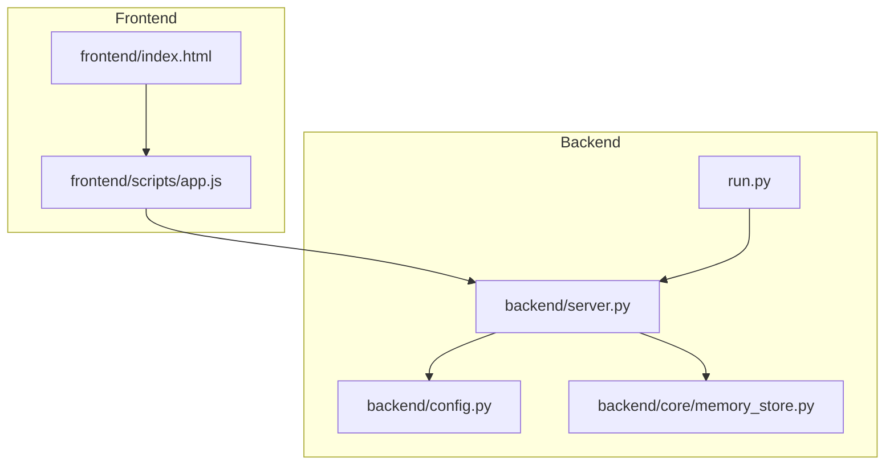

**Diagram sources**
- [run.py:1-6](file://run.py#L1-L6)
- [backend/server.py:1-611](file://backend/server.py#L1-L611)
- [backend/config.py:1-76](file://backend/config.py#L1-L76)
- [frontend/index.html:1-338](file://frontend/index.html#L1-L338)
- [frontend/scripts/app.js:1-1765](file://frontend/scripts/app.js#L1-L1765)
- [backend/core/memory_store.py:132-794](file://backend/core/memory_store.py#L132-L794)

**Section sources**
- [run.py:1-6](file://run.py#L1-L6)
- [backend/server.py:1-611](file://backend/server.py#L1-L611)
- [backend/config.py:1-76](file://backend/config.py#L1-L76)
- [frontend/index.html:1-338](file://frontend/index.html#L1-L338)
- [frontend/scripts/app.js:1-1765](file://frontend/scripts/app.js#L1-L1765)
- [backend/core/memory_store.py:132-794](file://backend/core/memory_store.py#L132-L794)

## Core Components
- HTTP server and handler: Implements GET, POST, PUT, DELETE dispatching and routes requests to dedicated handlers
- Static file serving: Serves frontend assets with automatic MIME type detection
- JSON request/response: Reads JSON bodies and serializes responses with proper headers
- Routing: Path-based routing with dynamic segments and query parameter extraction
- Middleware-like behavior: Preprocessing (JSON body parsing) and postprocessing (response serialization and error formatting)
- Persistence integration: Delegates session/message/attachment operations to the memory store

**Section sources**
- [backend/server.py:67-83](file://backend/server.py#L67-L83)
- [backend/server.py:85-564](file://backend/server.py#L85-L564)
- [backend/server.py:522-564](file://backend/server.py#L522-L564)

## Architecture Overview
The frontend sends HTTP requests to the backend server. The server parses the path, extracts query parameters, reads JSON bodies when applicable, invokes business logic, and returns JSON responses. Static assets are served directly with appropriate MIME types.

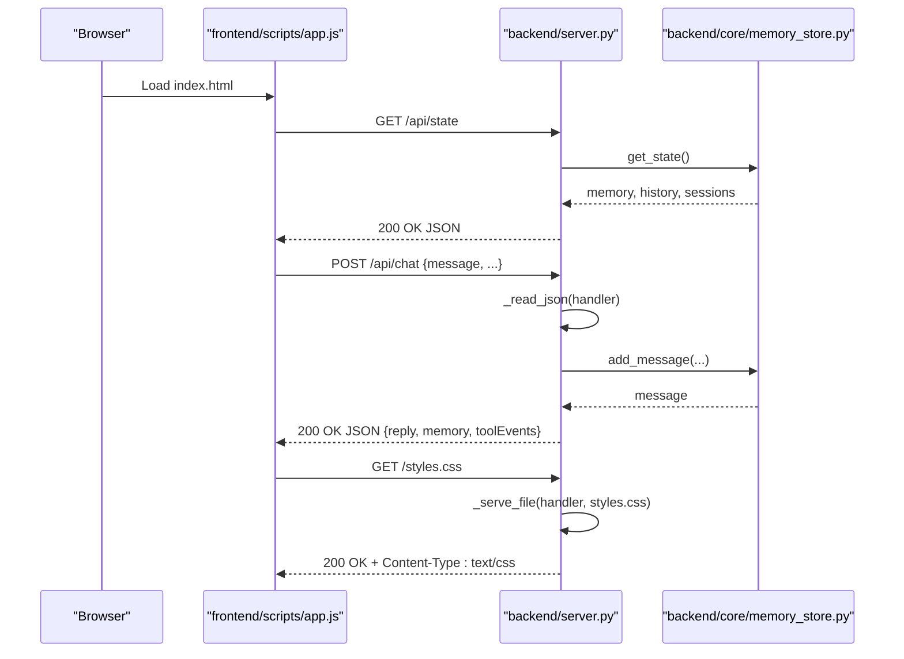

**Diagram sources**
- [frontend/scripts/app.js:902-1087](file://frontend/scripts/app.js#L902-L1087)
- [backend/server.py:85-564](file://backend/server.py#L85-L564)
- [backend/core/memory_store.py:608-667](file://backend/core/memory_store.py#L608-L667)

## Detailed Component Analysis

### HTTP Method Dispatching and Handler Registration
- The server registers a RequestHandler subclass that delegates each HTTP method to a corresponding AssistantApplication method
- Logging is suppressed to reduce noise

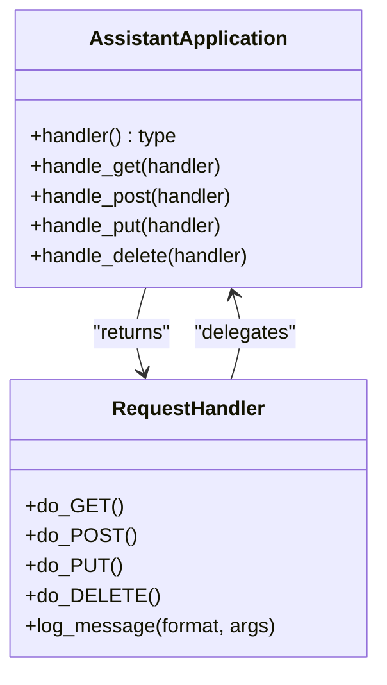

**Diagram sources**
- [backend/server.py:67-83](file://backend/server.py#L67-L83)

**Section sources**
- [backend/server.py:67-83](file://backend/server.py#L67-L83)

### Path Parsing and Parameter Extraction
- Paths are parsed using URL parsing utilities
- Query parameters are extracted via query string parsing
- Dynamic segments are extracted by splitting path strings and trimming trailing slashes

Examples of path parsing and parameter extraction:
- Extracting session ID from “/api/sessions/{id}”
- Extracting message ID from “/api/messages/{id}”
- Extracting attachment ID from “/api/sessions/{id}/attachments/{attachment_id}”
- Query parameters for filtering and pagination (e.g., include_archived, limit)

**Section sources**
- [backend/server.py:85-500](file://backend/server.py#L85-L500)

### JSON Request Body Reading
- For endpoints expecting JSON bodies, the server reads Content-Length and decodes the body
- Bodies are parsed as JSON; defaults are used when empty or missing
- Specialized readers:
  - Standard JSON reader for objects
  - List-or-fallback reader for arrays when the payload may be malformed

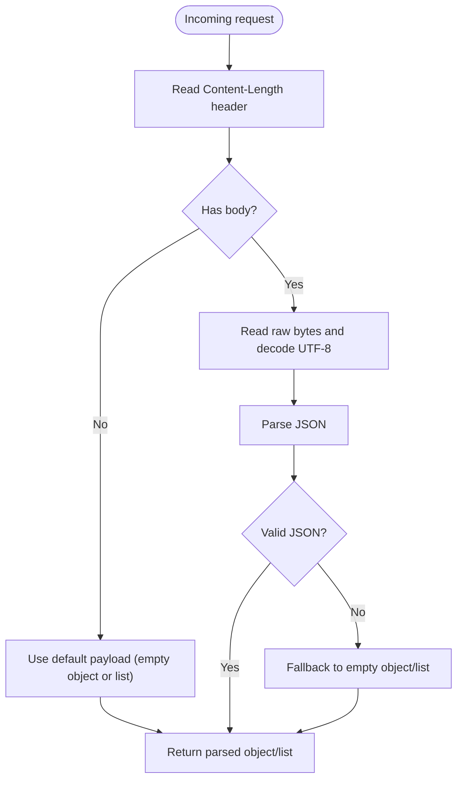

**Diagram sources**
- [backend/server.py:535-547](file://backend/server.py#L535-L547)

**Section sources**
- [backend/server.py:535-547](file://backend/server.py#L535-L547)

### Response Serialization and Error Formatting
- Responses are serialized to JSON with explicit application/json content type and content length
- Errors are returned as JSON objects with an error field and appropriate HTTP status codes
- Connection errors are handled gracefully to avoid crashes

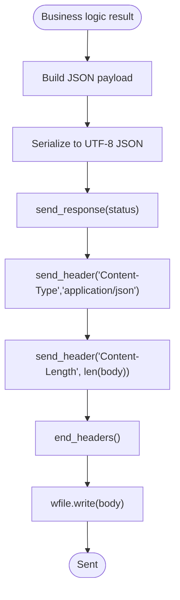

**Diagram sources**
- [backend/server.py:549-564](file://backend/server.py#L549-L564)

**Section sources**
- [backend/server.py:549-564](file://backend/server.py#L549-L564)

### MIME Type Detection and Static File Serving
- Static assets are served by reading the file bytes and sending them with appropriate headers
- MIME type is guessed from the file extension; defaults to binary/octet-stream if unknown
- Not-found responses are returned for missing files

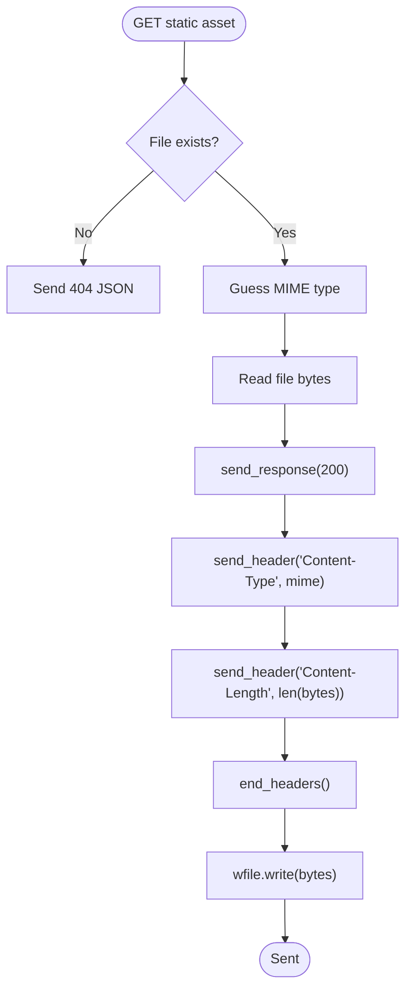

**Diagram sources**
- [backend/server.py:522-533](file://backend/server.py#L522-L533)

**Section sources**
- [backend/server.py:522-533](file://backend/server.py#L522-L533)

### Content Negotiation
- The server sets Content-Type to application/json for all JSON responses
- Static files rely on MIME type detection; no explicit Accept negotiation is implemented

**Section sources**
- [backend/server.py:529-531](file://backend/server.py#L529-L531)
- [backend/server.py:557-561](file://backend/server.py#L557-L561)

### Request Routing Patterns and Dynamic Route Resolution
- The server uses a combination of exact path matches and prefix/path segment checks
- Dynamic segments are extracted by splitting on known prefixes and suffixes
- Query parameters are parsed and normalized for boolean and numeric values

Routing examples:
- Exact match: “/”, “/index.html”, “/api/state”
- Prefix match: “/api/sessions/...” with optional “/messages” or “/attachments”
- Query parameter handling: include_archived, limit

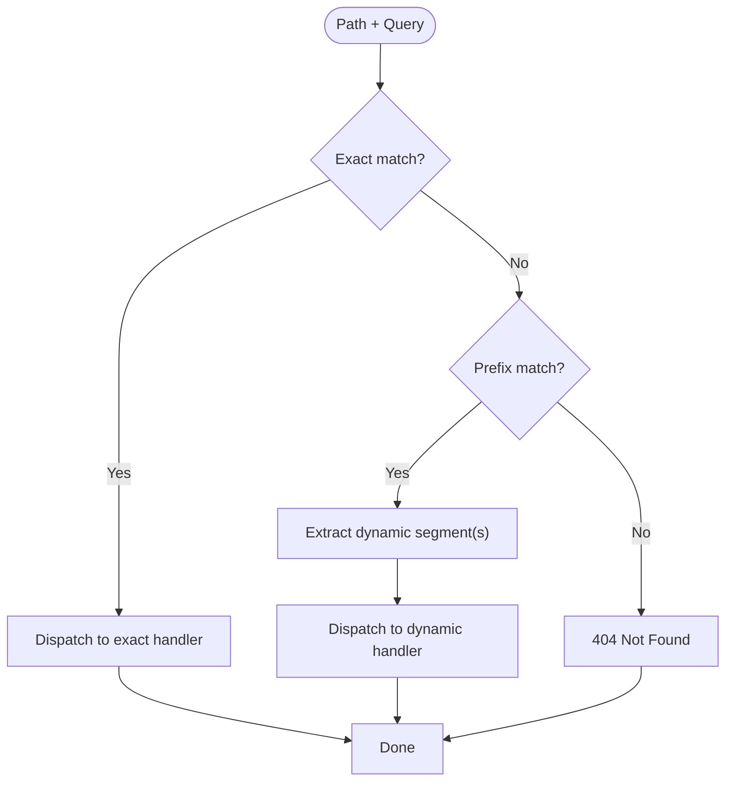

**Diagram sources**
- [backend/server.py:85-167](file://backend/server.py#L85-L167)
- [backend/server.py:169-265](file://backend/server.py#L169-L265)
- [backend/server.py:399-422](file://backend/server.py#L399-L422)
- [backend/server.py:428-500](file://backend/server.py#L428-L500)

**Section sources**
- [backend/server.py:85-167](file://backend/server.py#L85-L167)
- [backend/server.py:169-265](file://backend/server.py#L169-L265)
- [backend/server.py:399-422](file://backend/server.py#L399-L422)
- [backend/server.py:428-500](file://backend/server.py#L428-L500)

### Middleware-like Functionality
- Preprocessing:
  - JSON body parsing for POST/PUT
  - Query parameter normalization
- Postprocessing:
  - JSON serialization and header setting
  - Error wrapping and status code propagation
- Connection handling:
  - Graceful handling of aborted connections

**Section sources**
- [backend/server.py:535-564](file://backend/server.py#L535-L564)

### Examples of Request/Response Workflows

#### GET /api/state
- Returns the current application state, including provider, model, memory, history, and sessions

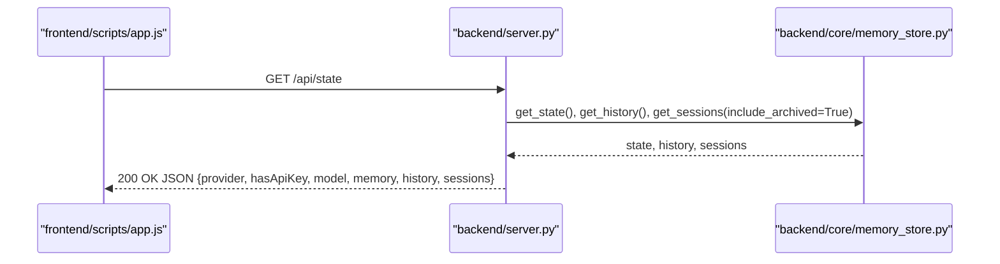

**Diagram sources**
- [frontend/scripts/app.js:902-926](file://frontend/scripts/app.js#L902-L926)
- [backend/server.py:106-108](file://backend/server.py#L106-L108)
- [backend/server.py:506-520](file://backend/server.py#L506-L520)
- [backend/core/memory_store.py:608-667](file://backend/core/memory_store.py#L608-L667)

#### POST /api/chat
- Sends a message to the assistant with optional screen image, mode, and tool toggles
- Stores user message in session and returns assistant reply with tool events and updated memory

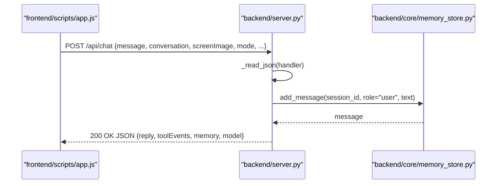

**Diagram sources**
- [frontend/scripts/app.js:992-1087](file://frontend/scripts/app.js#L992-L1087)
- [backend/server.py:211-321](file://backend/server.py#L211-L321)
- [backend/server.py:535-538](file://backend/server.py#L535-L538)
- [backend/core/memory_store.py:652-667](file://backend/core/memory_store.py#L652-L667)

#### POST /api/sessions/{id}/attachments
- Uploads a base64-encoded file, validates type and size, saves to disk, records in MongoDB, and indexes for search

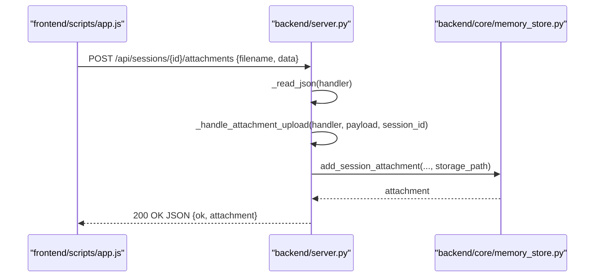

**Diagram sources**
- [frontend/scripts/app.js:1609-1637](file://frontend/scripts/app.js#L1609-L1637)
- [backend/server.py:205-394](file://backend/server.py#L205-L394)
- [backend/core/memory_store.py:762-779](file://backend/core/memory_store.py#L762-L779)

## Dependency Analysis
- The server depends on:
  - Configuration for ports and directories
  - Memory store for persistence
  - Tools for weather, news, and web search
  - LLM client for chat responses
- Frontend depends on:
  - Server endpoints for state, chat, sessions, messages, attachments, profile, tasks, notes, weather, and news

```mermaid
graph TB
FE["frontend/scripts/app.js"] --> EP1["/api/state"]
FE --> EP2["/api/chat"]
FE --> EP3["/api/sessions"]
FE --> EP4["/api/sessions/{id}/messages"]
FE --> EP5["/api/sessions/{id}/attachments"]
FE --> EP6["/api/profile"]
FE --> EP7["/api/tasks"]
FE --> EP8["/api/notes"]
FE --> EP9["/api/weather"]
FE --> EP10["/api/news"]
SV["backend/server.py"] --> CFG["backend/config.py"]
SV --> MEM["backend/core/memory_store.py"]
SV --> LLM["LLM client"]
SV --> TOOLW["WeatherService"]
SV --> TOOLN["NewsService"]
SV --> TOOLWS["WebSearchService"]
```

**Diagram sources**
- [frontend/scripts/app.js:902-1637](file://frontend/scripts/app.js#L902-L1637)
- [backend/server.py:14-23](file://backend/server.py#L14-L23)
- [backend/config.py:55-76](file://backend/config.py#L55-L76)
- [backend/core/memory_store.py:132-794](file://backend/core/memory_store.py#L132-L794)

**Section sources**
- [frontend/scripts/app.js:902-1637](file://frontend/scripts/app.js#L902-L1637)
- [backend/server.py:14-23](file://backend/server.py#L14-L23)
- [backend/config.py:55-76](file://backend/config.py#L55-L76)
- [backend/core/memory_store.py:132-794](file://backend/core/memory_store.py#L132-L794)

## Performance Considerations
- ThreadingHTTPServer: Each request is handled in a separate thread; consider scaling for concurrent load
- JSON parsing: Efficient for small to medium payloads; large payloads may increase latency
- Static file serving: Direct file I/O; ensure adequate filesystem performance for large assets
- MongoDB operations: Synchronous calls; consider connection pooling and indexing for high throughput
- Attachment uploads: Base64 decoding and file I/O; enforce strict limits to prevent abuse

[No sources needed since this section provides general guidance]

## Troubleshooting Guide
Common issues and resolutions:
- 404 Not Found
  - Occurs when static assets are missing or endpoint paths do not match
  - Verify file existence and correct path mapping
- 400 Bad Request
  - JSON parsing failures or invalid parameters
  - Ensure Content-Type: application/json and valid JSON payloads
- 500 Internal Server Error
  - Exceptions in business logic or database operations
  - Check logs and error responses for details
- Connection Aborted
  - Client disconnected mid-request
  - Server handles gracefully without raising exceptions

**Section sources**
- [backend/server.py:522-533](file://backend/server.py#L522-L533)
- [backend/server.py:549-564](file://backend/server.py#L549-L564)

## Conclusion
The request and response handling pipeline is straightforward and robust:
- Clear HTTP method dispatching and path routing
- Consistent JSON body parsing and response serialization
- Proper error formatting and static file serving with MIME detection
- Middleware-like preprocessing and postprocessing
- Resource cleanup for attachments and sessions

This design enables reliable operation of the Orbit Virtual Assistant with predictable behavior across endpoints and efficient handling of both interactive chat and static assets.