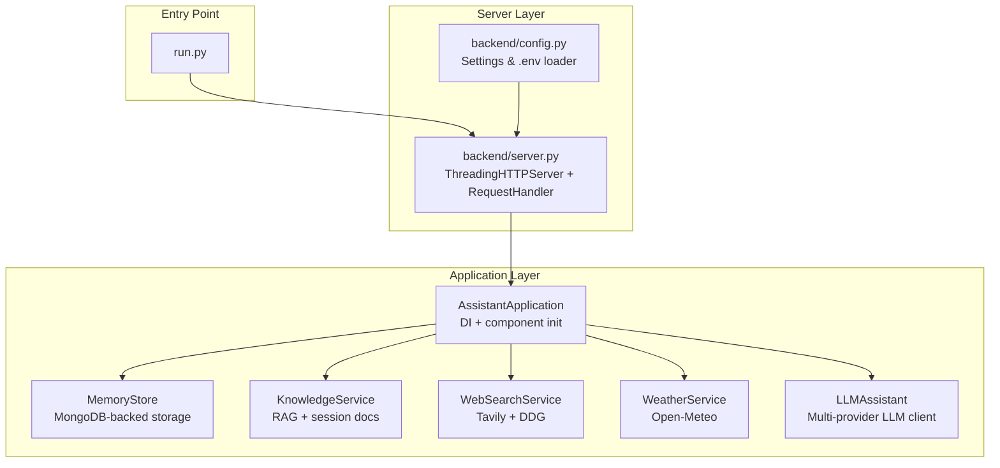
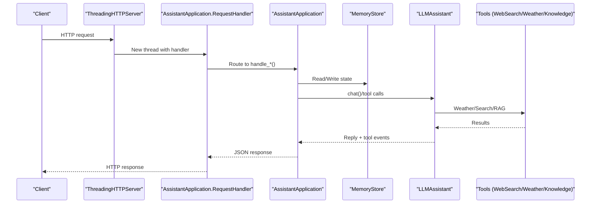
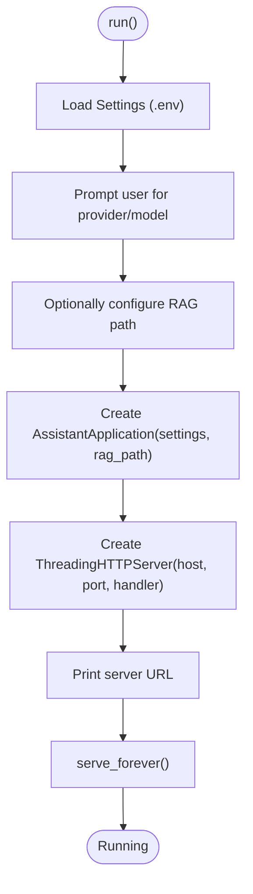
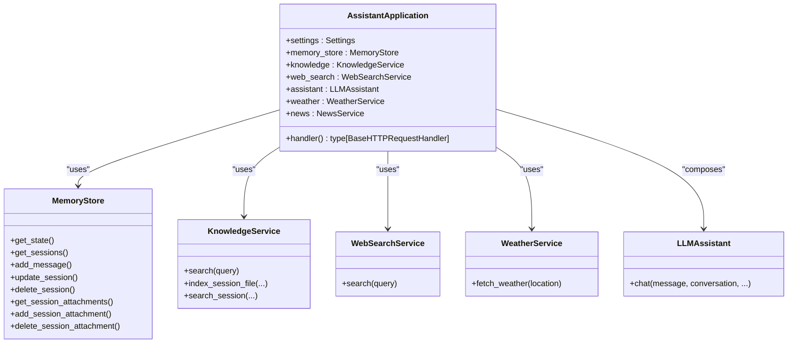
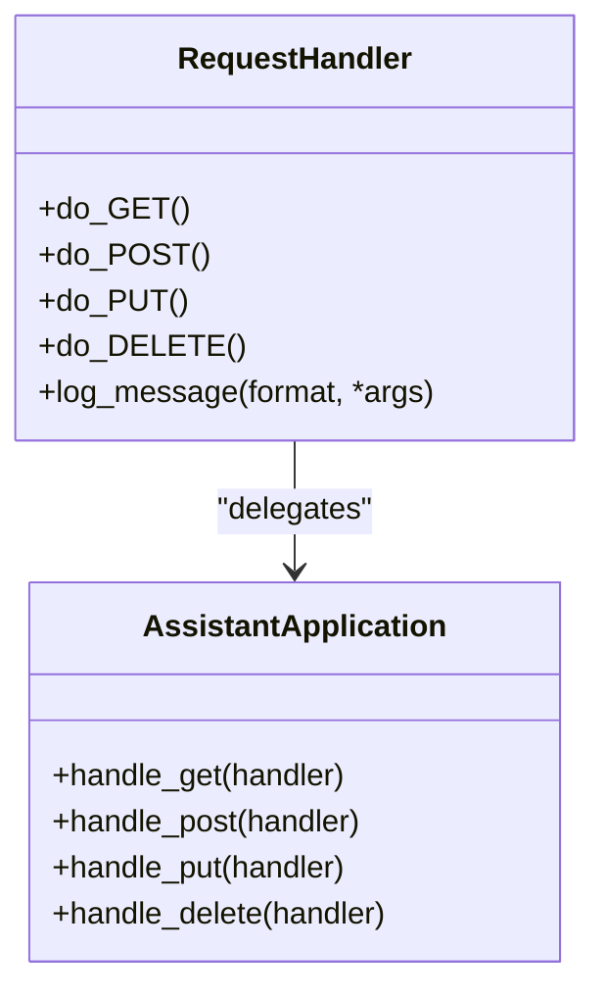
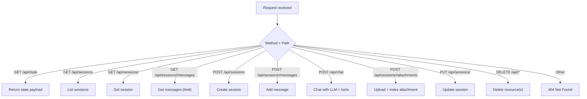
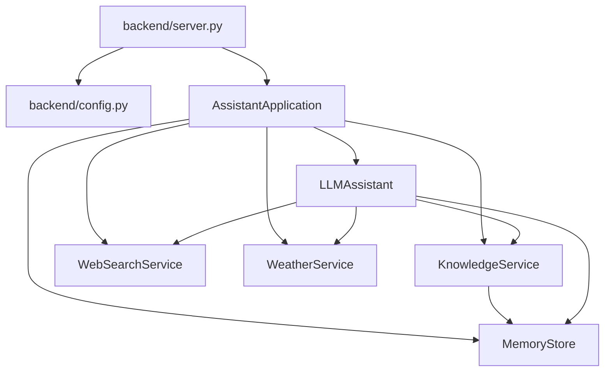

# Server Architecture and Setup

<cite>
**Referenced Files in This Document**
- [backend/server.py](file://backend/server.py)
- [backend/config.py](file://backend/config.py)
- [backend/core/memory_store.py](file://backend/core/memory_store.py)
- [backend/api_clients/llm_client.py](file://backend/api_clients/llm_client.py)
- [backend/tools/knowledge.py](file://backend/tools/knowledge.py)
- [backend/tools/web_search.py](file://backend/tools/web_search.py)
- [backend/tools/weather.py](file://backend/tools/weather.py)
- [run.py](file://run.py)
- [README.md](file://README.md)
- [requirements.txt](file://requirements.txt)
</cite>

## Table of Contents
1. [Introduction](#introduction)
2. [Project Structure](#project-structure)
3. [Core Components](#core-components)
4. [Architecture Overview](#architecture-overview)
5. [Detailed Component Analysis](#detailed-component-analysis)
6. [Dependency Analysis](#dependency-analysis)
7. [Performance Considerations](#performance-considerations)
8. [Troubleshooting Guide](#troubleshooting-guide)
9. [Conclusion](#conclusion)
10. [Appendices](#appendices)

## Introduction
This document explains the HTTP server architecture and setup implementation for the Orbit Virtual Assistant. It covers the ThreadingHTTPServer configuration, a custom BaseHTTPRequestHandler implementation, and the server initialization process. It also details the AssistantApplication class structure, dependency injection pattern, and component initialization order. The document describes server startup procedures, port binding, graceful shutdown handling, the threading model for concurrent request handling, configuration options, environment variable handling, and runtime settings. Practical examples of deployment, monitoring, and troubleshooting common startup issues are included.

## Project Structure
The server is implemented in the backend package with a clear separation of concerns:
- Configuration and environment loading
- HTTP server and request routing
- Application orchestration and dependency injection
- Data persistence and memory management
- Tool integrations for web search, weather, and RAG

**Diagram sources**
- [run.py:1-6](file://run.py#L1-L6)
- [backend/config.py:55-76](file://backend/config.py#L55-L76)
- [backend/server.py:566-611](file://backend/server.py#L566-L611)
- [backend/server.py:23-63](file://backend/server.py#L23-L63)
- [backend/core/memory_store.py:67-117](file://backend/core/memory_store.py#L67-L117)
- [backend/tools/knowledge.py:88-140](file://backend/tools/knowledge.py#L88-L140)
- [backend/tools/web_search.py:53-104](file://backend/tools/web_search.py#L53-L104)
- [backend/tools/weather.py:47-75](file://backend/tools/weather.py#L47-L75)
- [backend/api_clients/llm_client.py:38-46](file://backend/api_clients/llm_client.py#L38-L46)

**Section sources**
- [README.md:164-201](file://README.md#L164-L201)
- [backend/server.py:566-611](file://backend/server.py#L566-L611)
- [backend/config.py:55-76](file://backend/config.py#L55-L76)

## Core Components
- ThreadingHTTPServer: The HTTP server uses Python’s built-in ThreadingHTTPServer to serve requests concurrently.
- AssistantApplication: Central orchestrator that initializes dependencies and exposes a request handler factory.
- Custom BaseHTTPRequestHandler: A thin wrapper around AssistantApplication that delegates routing to dedicated handlers.
- Settings and .env loader: Centralized configuration via environment variables and defaults.
- MemoryStore: MongoDB-backed persistence for sessions, messages, tasks, notes, and caches.
- Tools: Web search, weather, and RAG services integrated into the assistant workflow.

**Section sources**
- [backend/server.py:9-11](file://backend/server.py#L9-L11)
- [backend/server.py:23-83](file://backend/server.py#L23-L83)
- [backend/config.py:20-76](file://backend/config.py#L20-L76)
- [backend/core/memory_store.py:67-117](file://backend/core/memory_store.py#L67-L117)

## Architecture Overview
The server follows a layered architecture:
- Entry point invokes the server runner.
- Settings are loaded from environment variables.
- AssistantApplication composes components and exposes a request handler.
- ThreadingHTTPServer binds to localhost and serves requests concurrently.
- Each request is handled by AssistantApplication’s handler, which routes to appropriate endpoints.

**Diagram sources**
- [backend/server.py:64-83](file://backend/server.py#L64-L83)
- [backend/server.py:85-500](file://backend/server.py#L85-L500)
- [backend/core/memory_store.py:188-250](file://backend/core/memory_store.py#L188-L250)
- [backend/api_clients/llm_client.py:38-78](file://backend/api_clients/llm_client.py#L38-L78)
- [backend/tools/web_search.py:69-104](file://backend/tools/web_search.py#L69-L104)
- [backend/tools/weather.py:51-75](file://backend/tools/weather.py#L51-L75)
- [backend/tools/knowledge.py:270-298](file://backend/tools/knowledge.py#L270-L298)

## Detailed Component Analysis

### ThreadingHTTPServer Configuration and Startup
- Binding: The server binds to 127.0.0.1 on the configured port.
- Concurrency: ThreadingHTTPServer spawns a new thread per incoming request.
- Initialization: The server is created with the handler factory from AssistantApplication and started with serve_forever.

**Diagram sources**
- [backend/server.py:566-611](file://backend/server.py#L566-L611)
- [backend/config.py:55-76](file://backend/config.py#L55-L76)

**Section sources**
- [backend/server.py:566-611](file://backend/server.py#L566-L611)
- [backend/config.py:55-76](file://backend/config.py#L55-L76)

### AssistantApplication: Dependency Injection and Initialization Order
AssistantApplication composes all runtime dependencies and exposes a request handler factory. The initialization order ensures:
- MemoryStore: Connects to MongoDB and prepares collections/indexes.
- KnowledgeService: Initializes RAG capabilities if docs_dir is provided.
- WebSearchService: Prepared for web search.
- LLMAssistant: Integrates MemoryStore, KnowledgeService, and WebSearchService.
- WeatherService and NewsService: Prepared for external data.

**Diagram sources**
- [backend/server.py:23-63](file://backend/server.py#L23-L63)
- [backend/core/memory_store.py:67-117](file://backend/core/memory_store.py#L67-L117)
- [backend/tools/knowledge.py:88-140](file://backend/tools/knowledge.py#L88-L140)
- [backend/tools/web_search.py:53-104](file://backend/tools/web_search.py#L53-L104)
- [backend/tools/weather.py:47-75](file://backend/tools/weather.py#L47-L75)
- [backend/api_clients/llm_client.py:38-46](file://backend/api_clients/llm_client.py#L38-L46)

**Section sources**
- [backend/server.py:23-63](file://backend/server.py#L23-L63)
- [backend/core/memory_store.py:67-117](file://backend/core/memory_store.py#L67-L117)

### Custom BaseHTTPRequestHandler Implementation
The RequestHandler delegates HTTP methods to AssistantApplication’s handlers. Logging is suppressed to reduce noise. The handler factory returns a fresh class per server instance to bind the correct application instance.

**Diagram sources**
- [backend/server.py:67-83](file://backend/server.py#L67-L83)
- [backend/server.py:85-500](file://backend/server.py#L85-L500)

**Section sources**
- [backend/server.py:67-83](file://backend/server.py#L67-L83)
- [backend/server.py:85-500](file://backend/server.py#L85-L500)

### Endpoint Routing and Processing Logic
Endpoints are routed by path and HTTP method. Responses are JSON-encoded with appropriate status codes. Notable flows:
- GET /api/state: Returns provider, API key presence, model, default location, voice, memory, history, and sessions.
- GET /api/sessions and /api/sessions/<id>/messages: List sessions and fetch messages with optional limit.
- POST /api/sessions and /api/sessions/<id>/messages: Create sessions and add messages with validation.
- POST /api/chat: Orchestrates LLM chat with tool calls and returns reply plus tool events.
- POST /api/sessions/<id>/attachments: Uploads base64-encoded files, saves to disk, registers in MongoDB, and indexes for search.
- PUT /api/sessions/<id>: Update session fields (title, pinned, archived).
- DELETE /api/sessions/<id>, /api/sessions/<id>/attachments/<id>, /api/messages/<id>, /api/notes/<id>, /api/tasks/<id>: Deletion operations with cascading cleanup.

**Diagram sources**
- [backend/server.py:85-500](file://backend/server.py#L85-L500)

**Section sources**
- [backend/server.py:85-500](file://backend/server.py#L85-L500)

### Threading Model and Concurrency
- ThreadingHTTPServer creates a new thread per request, enabling concurrent handling of multiple clients.
- MemoryStore uses a threading.Lock to guard shared state during read/write operations.
- KnowledgeService uses a threading.Lock to manage session retriever caching safely.

**Section sources**
- [backend/server.py:566-611](file://backend/server.py#L566-L611)
- [backend/core/memory_store.py:84](file://backend/core/memory_store.py#L84)
- [backend/tools/knowledge.py:108](file://backend/tools/knowledge.py#L108)

### Configuration Options and Environment Variables
Settings are loaded from environment variables with sensible defaults. Key options include:
- ACTIVE_PROVIDER, GOOGLE_API_KEY, OPENROUTER_API_KEY, AI_MODEL
- ASSISTANT_PORT, LIVE_VOICE_NAME, DEFAULT_LOCATION
- RAG_DOCS_PATH, LM_STUDIO_URL, OLLAMA_URL
- MONGODB_URI, MONGODB_DB

These are read and normalized into a Settings dataclass.

**Section sources**
- [backend/config.py:55-76](file://backend/config.py#L55-L76)
- [README.md:104-136](file://README.md#L104-L136)

### Runtime Settings and Provider Selection
At startup, the user is prompted to select a provider and model. The active provider influences which LLM client path is used and how API keys and endpoints are selected.

**Section sources**
- [backend/server.py:566-611](file://backend/server.py#L566-L611)
- [backend/api_clients/llm_client.py:38-78](file://backend/api_clients/llm_client.py#L38-L78)

### Graceful Shutdown Handling
There is no explicit signal handling or server shutdown hook in the current implementation. The server runs until terminated externally.

**Section sources**
- [backend/server.py:608-611](file://backend/server.py#L608-L611)

## Dependency Analysis
External dependencies are declared in requirements.txt. Core dependencies include:
- pymongo for MongoDB
- ddgs for DuckDuckGo search
- Optional: tavily-python for Tavily search
- Optional: RAG stack (langchain-community, faiss-cpu, rank-bm25, unstructured, etc.)

**Diagram sources**
- [backend/server.py:14-21](file://backend/server.py#L14-L21)
- [backend/server.py:23-63](file://backend/server.py#L23-L63)
- [backend/core/memory_store.py:67-117](file://backend/core/memory_store.py#L67-L117)
- [backend/tools/knowledge.py:88-140](file://backend/tools/knowledge.py#L88-L140)
- [backend/tools/web_search.py:53-104](file://backend/tools/web_search.py#L53-L104)
- [backend/tools/weather.py:47-75](file://backend/tools/weather.py#L47-L75)
- [backend/api_clients/llm_client.py:38-46](file://backend/api_clients/llm_client.py#L38-L46)

**Section sources**
- [requirements.txt:10-29](file://requirements.txt#L10-L29)

## Performance Considerations
- Concurrency: ThreadingHTTPServer scales with CPU cores but can be I/O bound by network and external API calls.
- MongoDB: Indexes are created on startup to optimize queries; ensure adequate hardware for large histories.
- RAG: Embedding and vector index construction can be expensive; consider LM Studio availability and FAISS fallback.
- External APIs: Timeouts and retries are handled in LLM client and tools; monitor latency and rate limits.

[No sources needed since this section provides general guidance]

## Troubleshooting Guide
Common startup and runtime issues:
- MongoDB not running: The MemoryStore constructor performs a ping to verify connectivity and raises a clear error if unreachable.
- Missing API keys: The LLM client checks for a valid API key based on the active provider and raises an error if missing.
- Port already in use: The server prints the bound address and will fail to start if the port is occupied.
- RAG dependencies: If RAG is enabled but required packages are missing, the KnowledgeService will fall back to BM25-only or disable RAG features.
- Web search failures: The WebSearchService falls back from Tavily to DuckDuckGo if Tavily fails.

**Section sources**
- [backend/core/memory_store.py:86-98](file://backend/core/memory_store.py#L86-L98)
- [backend/api_clients/llm_client.py:60-61](file://backend/api_clients/llm_client.py#L60-L61)
- [backend/server.py:608-611](file://backend/server.py#L608-L611)
- [backend/tools/knowledge.py:124-137](file://backend/tools/knowledge.py#L124-L137)
- [backend/tools/web_search.py:86-104](file://backend/tools/web_search.py#L86-L104)

## Conclusion
The server architecture cleanly separates configuration, HTTP handling, application orchestration, and persistence. ThreadingHTTPServer enables concurrent request handling, while AssistantApplication composes dependencies and exposes a modular request handler. Settings are managed via environment variables with sensible defaults. The system integrates external services for web search, weather, and RAG, with graceful fallbacks and clear error reporting. Deployment is straightforward: install dependencies, configure environment variables, and launch the server.

[No sources needed since this section summarizes without analyzing specific files]

## Appendices

### Practical Deployment Steps
- Install dependencies: pip install -r requirements.txt
- Create .env with required keys and settings as documented in README.
- Launch the server: python run.py
- Select provider and model at startup.
- Open http://127.0.0.1:<ASSISTANT_PORT> in your browser.

**Section sources**
- [README.md:138-151](file://README.md#L138-L151)
- [requirements.txt:1-6](file://requirements.txt#L1-L6)

### Monitoring Tips
- Observe console logs for indexing progress, search results, and tool events.
- Monitor MongoDB connectivity and indexes.
- Track external API latencies and error rates.

[No sources needed since this section provides general guidance]