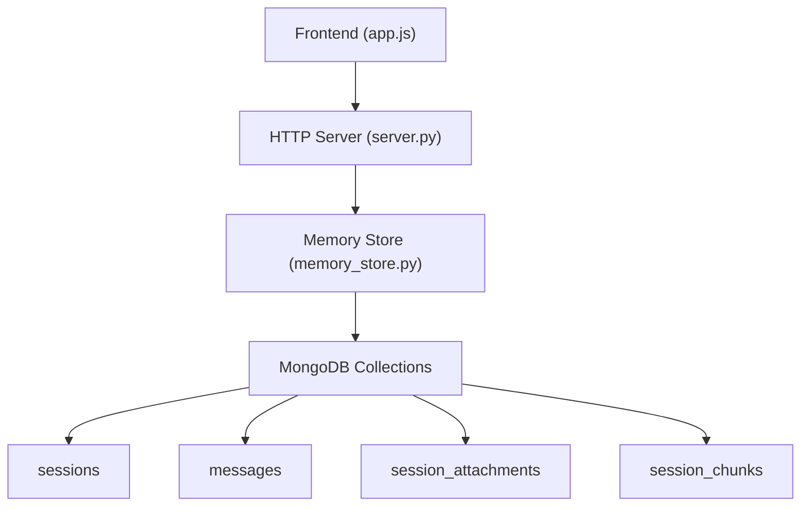
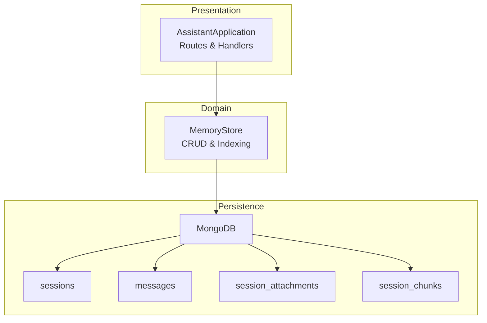
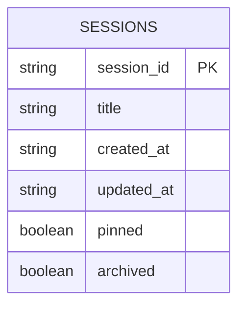
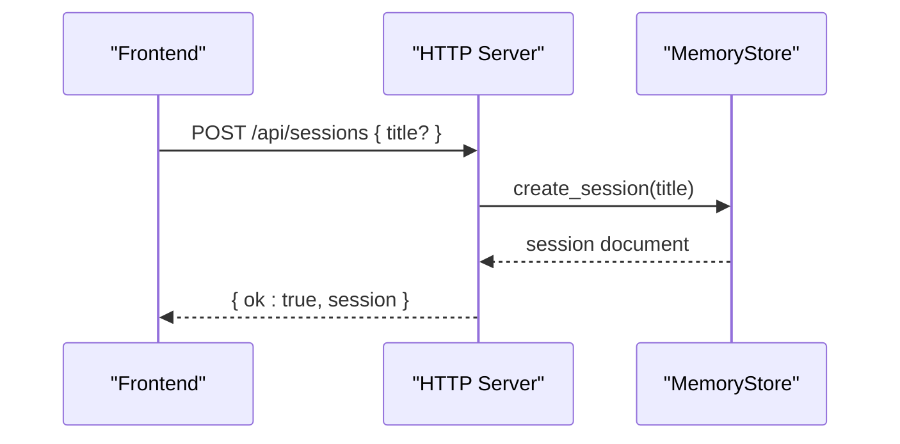
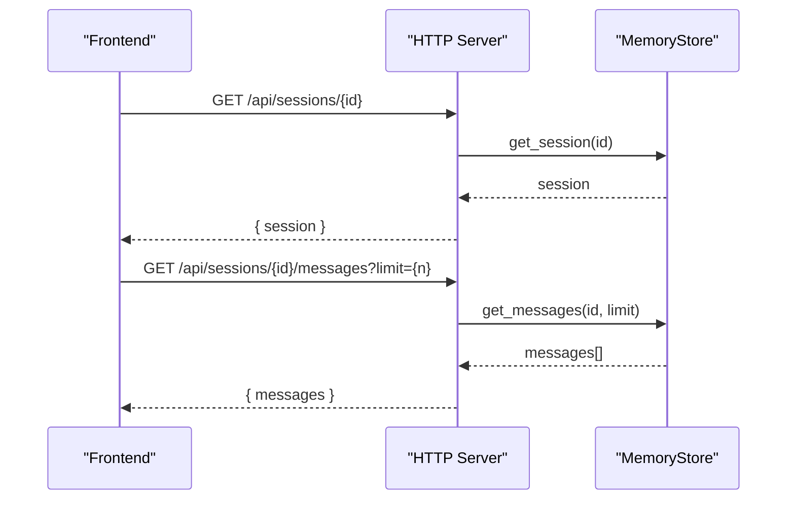
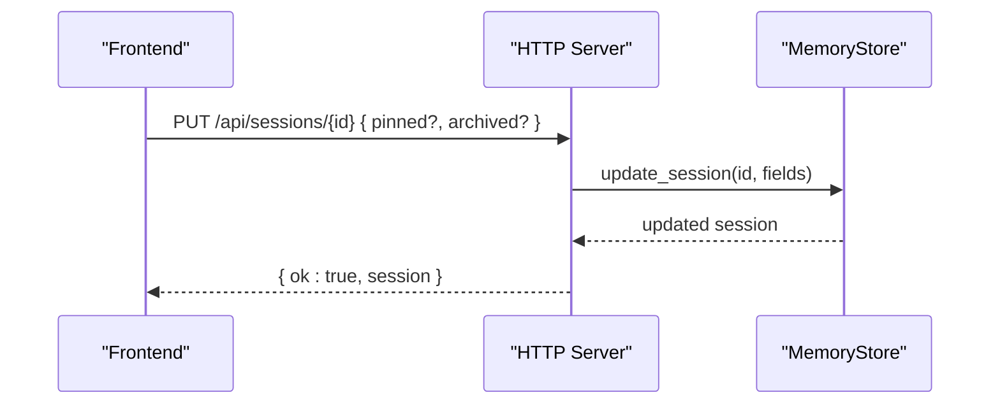
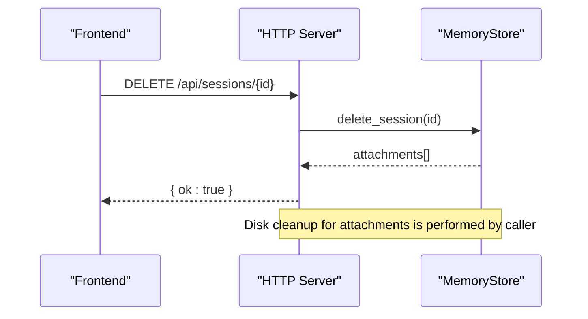
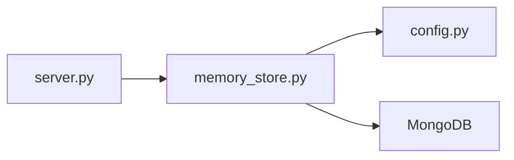

# Session Management Endpoints

<cite>
**Referenced Files in This Document**
- [server.py](file://backend/server.py)
- [memory_store.py](file://backend/core/memory_store.py)
- [app.js](file://frontend/scripts/app.js)
- [config.py](file://backend/config.py)
</cite>

## Table of Contents
1. [Introduction](#introduction)
2. [Project Structure](#project-structure)
3. [Core Components](#core-components)
4. [Architecture Overview](#architecture-overview)
5. [Detailed Component Analysis](#detailed-component-analysis)
6. [Dependency Analysis](#dependency-analysis)
7. [Performance Considerations](#performance-considerations)
8. [Troubleshooting Guide](#troubleshooting-guide)
9. [Conclusion](#conclusion)

## Introduction
This document provides comprehensive API documentation for session management endpoints. It covers all session-related endpoints: GET /api/sessions, GET /api/sessions/{id}, POST /api/sessions, PUT /api/sessions/{id}, and DELETE /api/sessions/{id}. It explains session creation, retrieval, updating, and deletion workflows, details the session data model, message association, and attachment linking, and describes query parameters for filtering archived sessions, pagination, and sorting options. It also includes request/response schemas, validation rules, error handling patterns, practical examples of session CRUD operations, batch operations, and integration patterns with the frontend.

## Project Structure
The session management functionality spans the backend HTTP server, the persistent memory store, and the frontend integration:
- Backend HTTP server routes session endpoints and delegates to the memory store.
- Memory store encapsulates MongoDB collections for sessions, messages, attachments, and indexing.
- Frontend integrates with session endpoints for creating, loading, pinning, archiving, and deleting chats.

**Diagram sources**
- [server.py](file://backend/server.py)
- [memory_store.py](file://backend/core/memory_store.py)

**Section sources**
- [server.py](file://backend/server.py)
- [memory_store.py](file://backend/core/memory_store.py)
- [app.js](file://frontend/scripts/app.js)

## Core Components
- HTTP Server: Implements routing for session endpoints, parses query parameters, validates requests, and returns JSON responses.
- Memory Store: Provides CRUD operations for sessions, messages, and attachments, with MongoDB-backed persistence and indexes.
- Frontend: Calls session endpoints to manage chats, update UI state, and synchronize with backend.

Key responsibilities:
- Session endpoints: Creation, listing, retrieval, update, and deletion.
- Message endpoints: Per-session message retrieval and addition.
- Attachment endpoints: Upload, listing, and deletion of session-scoped attachments.

**Section sources**
- [server.py](file://backend/server.py)
- [memory_store.py](file://backend/core/memory_store.py)
- [app.js](file://frontend/scripts/app.js)

## Architecture Overview
The session management architecture follows a layered design:
- Presentation layer: HTTP endpoints in the server.
- Domain layer: Memory store with MongoDB collections.
- Persistence layer: MongoDB database.

**Diagram sources**
- [server.py](file://backend/server.py)
- [memory_store.py](file://backend/core/memory_store.py)

## Detailed Component Analysis

### Session Data Model
The session data model is stored in the MongoDB sessions collection. The schema defines the fields persisted for each session.

- session_id: Unique identifier for the session.
- title: Human-readable session title.
- created_at: ISO timestamp when the session was created.
- updated_at: ISO timestamp when the session was last updated.
- pinned: Boolean flag indicating if the session is pinned.
- archived: Boolean flag indicating if the session is archived.

**Diagram sources**
- [memory_store.py](file://backend/core/memory_store.py)

**Section sources**
- [memory_store.py](file://backend/core/memory_store.py)

### Endpoint Definitions

#### GET /api/sessions
- Purpose: Retrieve a list of sessions with optional filtering for archived sessions.
- Query parameters:
  - include_archived (boolean, default false): When true, includes archived sessions in the response.
- Response:
  - Body: { sessions: [ { session_id, title, created_at, updated_at, pinned, archived }, ... ] }
- Sorting: Sessions are sorted by pinned descending, then updated_at descending.
- Pagination: Not applicable; returns all sessions matching filters.

Example request:
- GET /api/sessions?include_archived=false

Example response:
- 200 OK with sessions array

Validation and errors:
- No validation required for query parameters.
- Returns an empty array if no sessions exist.

Integration note:
- The frontend calls this endpoint to populate the session list and to refresh after updates.

**Section sources**
- [server.py](file://backend/server.py)
- [memory_store.py](file://backend/core/memory_store.py)
- [app.js](file://frontend/scripts/app.js)

#### GET /api/sessions/{id}
- Purpose: Retrieve a single session by its ID.
- Path parameters:
  - id (string): Session identifier.
- Response:
  - Body: { session: { session_id, title, created_at, updated_at, pinned, archived } }
- Validation and errors:
  - 404 Not Found if the session does not exist.

Example request:
- GET /api/sessions/abc123

Example response:
- 200 OK with session object

**Section sources**
- [server.py](file://backend/server.py)
- [memory_store.py](file://backend/core/memory_store.py)

#### POST /api/sessions
- Purpose: Create a new session.
- Request body:
  - title (string, optional): Session title. Defaults to "New Chat" if omitted.
- Response:
  - Body: { ok: true, session: { session_id, title, created_at, updated_at, pinned, archived } }
- Validation and errors:
  - No validation required for the title; defaults are applied server-side.
- Notes:
  - The created_at and updated_at timestamps are set automatically.

Example request:
- POST /api/sessions with body { "title": "Project Alpha" }

Example response:
- 200 OK with session object

**Section sources**
- [server.py](file://backend/server.py)
- [memory_store.py](file://backend/core/memory_store.py)

#### PUT /api/sessions/{id}
- Purpose: Update session attributes (title, pinned, archived).
- Path parameters:
  - id (string): Session identifier.
- Request body:
  - title (string, optional): New title.
  - pinned (boolean, optional): Pin or unpin the session.
  - archived (boolean, optional): Archive or unarchive the session.
- Response:
  - Body: { ok: true, session: { session_id, title, created_at, updated_at, pinned, archived } }
- Validation and errors:
  - 400 Bad Request if no valid fields are provided or if the session is not found.
- Behavior:
  - updated_at is updated automatically on successful update.

Example request:
- PUT /api/sessions/abc123 with body { "pinned": true, "archived": false }

Example response:
- 200 OK with updated session object

**Section sources**
- [server.py](file://backend/server.py)
- [memory_store.py](file://backend/core/memory_store.py)

#### DELETE /api/sessions/{id}
- Purpose: Delete a session and associated resources (messages, attachments, chunks).
- Path parameters:
  - id (string): Session identifier.
- Response:
  - Body: { ok: true }
- Behavior:
  - Deletes the session document and cascades deletions to messages, attachments, and session chunks.
  - Removes attachment files from disk if present.
- Validation and errors:
  - 404 Not Found if the session does not exist.

Example request:
- DELETE /api/sessions/abc123

Example response:
- 200 OK

**Section sources**
- [server.py](file://backend/server.py)
- [memory_store.py](file://backend/core/memory_store.py)

### Message Association
Each session is associated with messages stored in the messages collection. Retrieving messages for a session is handled by a dedicated endpoint.

- GET /api/sessions/{id}/messages
  - Query parameters:
    - limit (integer, optional): Limit the number of messages returned.
  - Response:
    - Body: { messages: [ { message_id, session_id, role, text, created_at }, ... ] }
  - Sorting: Messages are sorted by created_at ascending.

Frontend integration:
- The frontend loads messages for the active session to render chat history.

**Section sources**
- [server.py](file://backend/server.py)
- [memory_store.py](file://backend/core/memory_store.py)
- [app.js](file://frontend/scripts/app.js)

### Attachment Linking
Attachments are scoped to sessions and stored in the session_attachments collection. The frontend can upload, list, and delete attachments.

- POST /api/sessions/{id}/attachments
  - Request body:
    - filename (string): Original file name.
    - data (string): Base64-encoded file content.
  - Response:
    - Body: { ok: true, attachment: { attachment_id, session_id, filename, file_type, file_size, storage_path, created_at } }
  - Validation and errors:
    - 400 Bad Request for missing filename/data, unsupported file type, invalid base64, or file too large.
  - Behavior:
    - Saves file to disk under the session-scoped path and registers an attachment record in MongoDB.
    - Attempts to parse and index the file for session-scoped search; errors are recorded in the response.

- GET /api/sessions/{id}/attachments
  - Response:
    - Body: { attachments: [ { attachment_id, session_id, filename, file_type, file_size, storage_path, created_at }, ... ] }

- DELETE /api/sessions/{id}/attachments/{attachment_id}
  - Response:
    - Body: { ok: true }
  - Behavior:
    - Removes the attachment record and deletes the file from disk if present.
    - Invalidates session retriever cache.

**Section sources**
- [server.py](file://backend/server.py)
- [memory_store.py](file://backend/core/memory_store.py)

### Workflow Sequences

#### Creating a New Session

**Diagram sources**
- [server.py](file://backend/server.py)
- [memory_store.py](file://backend/core/memory_store.py)

#### Loading a Session and Its Messages

**Diagram sources**
- [server.py](file://backend/server.py)
- [memory_store.py](file://backend/core/memory_store.py)
- [app.js](file://frontend/scripts/app.js)

#### Updating Session Attributes (Pin/Archive)

**Diagram sources**
- [server.py](file://backend/server.py)
- [memory_store.py](file://backend/core/memory_store.py)
- [app.js](file://frontend/scripts/app.js)

#### Deleting a Session and Associated Resources

**Diagram sources**
- [server.py](file://backend/server.py)
- [memory_store.py](file://backend/core/memory_store.py)

### Filtering, Pagination, and Sorting
- Filtering:
  - GET /api/sessions supports include_archived to include archived sessions.
- Pagination:
  - Not implemented for sessions listing.
- Sorting:
  - Sessions are sorted by pinned descending, then updated_at descending.
  - Messages are sorted by created_at ascending.
  - Attachments are sorted by created_at ascending.

**Section sources**
- [server.py](file://backend/server.py)
- [memory_store.py](file://backend/core/memory_store.py)

### Request/Response Schemas

#### GET /api/sessions
- Request
  - Query: include_archived (boolean)
- Response
  - Body: { sessions: [ Session ] }

#### GET /api/sessions/{id}
- Request
  - Path: id (string)
- Response
  - Body: { session: Session }

#### POST /api/sessions
- Request
  - Body: { title? (string) }
- Response
  - Body: { ok: true, session: Session }

#### PUT /api/sessions/{id}
- Request
  - Path: id (string)
  - Body: { title? (string), pinned? (boolean), archived? (boolean) }
- Response
  - Body: { ok: true, session: Session }

#### DELETE /api/sessions/{id}
- Request
  - Path: id (string)
- Response
  - Body: { ok: true }

#### GET /api/sessions/{id}/messages
- Request
  - Path: id (string)
  - Query: limit (integer)
- Response
  - Body: { messages: [ Message ] }

#### POST /api/sessions/{id}/attachments
- Request
  - Path: id (string)
  - Body: { filename (string), data (string) }
- Response
  - Body: { ok: true, attachment: Attachment }

#### GET /api/sessions/{id}/attachments
- Request
  - Path: id (string)
- Response
  - Body: { attachments: [ Attachment ] }

#### DELETE /api/sessions/{id}/attachments/{attachment_id}
- Request
  - Path: id (string), attachment_id (string)
- Response
  - Body: { ok: true }

**Section sources**
- [server.py](file://backend/server.py)
- [memory_store.py](file://backend/core/memory_store.py)

### Validation Rules and Error Handling
- Validation rules:
  - PUT /api/sessions/{id}: At least one of title, pinned, or archived must be provided; otherwise returns 400.
  - POST /api/sessions/{id}/attachments: filename and data required; supported file types and size limits enforced.
  - Message creation: text must be non-empty; otherwise returns 400.
- Error handling:
  - 404 Not Found for missing sessions or messages.
  - 400 Bad Request for invalid inputs or unsupported operations.
  - 502 Bad Gateway for LLM client errors (other endpoints).

**Section sources**
- [server.py](file://backend/server.py)
- [memory_store.py](file://backend/core/memory_store.py)

### Practical Examples

#### Creating a Session
- Request
  - POST /api/sessions with body { "title": "Project Alpha" }
- Expected response
  - 200 OK with session object containing session_id, title, timestamps, pinned=false, archived=false

#### Listing Sessions with Archived Included
- Request
  - GET /api/sessions?include_archived=true
- Expected response
  - 200 OK with sessions array including archived items

#### Loading a Session and Messages
- Request
  - GET /api/sessions/{id}
  - GET /api/sessions/{id}/messages?limit=50
- Expected response
  - 200 OK with session and messages arrays

#### Pinning/Unpinning a Session
- Request
  - PUT /api/sessions/{id} with body { "pinned": true }
- Expected response
  - 200 OK with updated session

#### Archiving/Unarchiving a Session
- Request
  - PUT /api/sessions/{id} with body { "archived": true }
- Expected response
  - 200 OK with updated session

#### Deleting a Session
- Request
  - DELETE /api/sessions/{id}
- Expected response
  - 200 OK

#### Uploading an Attachment
- Request
  - POST /api/sessions/{id}/attachments with body { "filename": "report.pdf", "data": "<base64>" }
- Expected response
  - 200 OK with attachment object

#### Deleting an Attachment
- Request
  - DELETE /api/sessions/{id}/attachments/{attachment_id}
- Expected response
  - 200 OK

**Section sources**
- [server.py](file://backend/server.py)
- [memory_store.py](file://backend/core/memory_store.py)
- [app.js](file://frontend/scripts/app.js)

### Integration Patterns with the Frontend
- Session creation triggers a new chat UI state and updates the session list.
- Session loading fetches messages and renders chat history.
- Pinning/archiving updates UI state and re-renders the session list.
- Deletion clears the active session and refreshes the list.
- Attachment upload integrates with the file picker and displays attachment records.

**Section sources**
- [app.js](file://frontend/scripts/app.js)
- [server.py](file://backend/server.py)

## Dependency Analysis
The session management endpoints depend on the MemoryStore for data operations and MongoDB for persistence. The HTTP server acts as the façade, delegating to the domain layer.

**Diagram sources**
- [server.py](file://backend/server.py)
- [memory_store.py](file://backend/core/memory_store.py)
- [config.py](file://backend/config.py)

**Section sources**
- [server.py](file://backend/server.py)
- [memory_store.py](file://backend/core/memory_store.py)
- [config.py](file://backend/config.py)

## Performance Considerations
- Indexing: Sessions are indexed by session_id and pinned+updated_at for efficient sorting and retrieval. Messages are indexed by session_id and created_at for chronological ordering.
- Sorting: Server-side sorting ensures consistent ordering without client-side manipulation.
- Cascading deletes: Deleting a session removes associated messages, attachments, and chunks efficiently in bulk.
- Attachment processing: Parsing and indexing attachments occur asynchronously; failures are recorded without blocking the API response.

[No sources needed since this section provides general guidance]

## Troubleshooting Guide
Common issues and resolutions:
- Session not found:
  - Symptom: 404 Not Found when accessing GET /api/sessions/{id} or performing updates/deletes.
  - Resolution: Verify the session_id exists and is correct.
- Invalid update payload:
  - Symptom: 400 Bad Request when PUT /api/sessions/{id} is called without valid fields.
  - Resolution: Ensure at least one of title, pinned, or archived is provided.
- Attachment upload errors:
  - Symptom: 400 Bad Request for unsupported file type or invalid base64 data.
  - Resolution: Confirm file extension is allowed and data is valid base64; check file size limits.
- MongoDB connectivity:
  - Symptom: Runtime errors during initialization or operations.
  - Resolution: Verify MONGODB_URI and MONGODB_DB configuration; ensure MongoDB is running.

**Section sources**
- [server.py](file://backend/server.py)
- [memory_store.py](file://backend/core/memory_store.py)
- [config.py](file://backend/config.py)

## Conclusion
The session management endpoints provide a robust foundation for multi-session chat with persistent storage, message association, and attachment handling. The design emphasizes clear separation of concerns, strong validation, and straightforward integration patterns with the frontend. By leveraging MongoDB indexes and efficient cascading operations, the system scales well for typical usage scenarios while maintaining simplicity for developers and users.