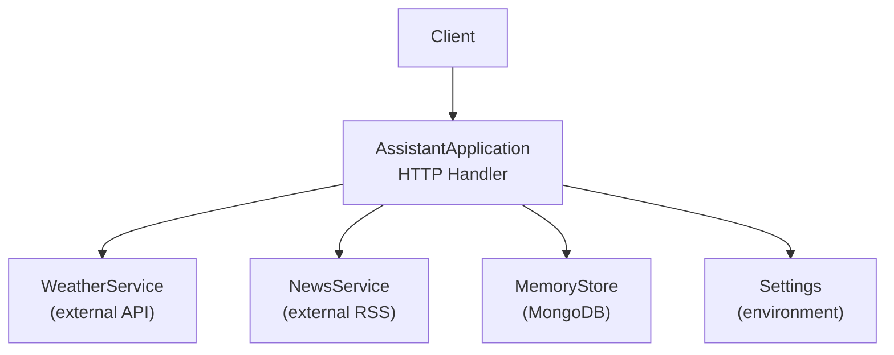
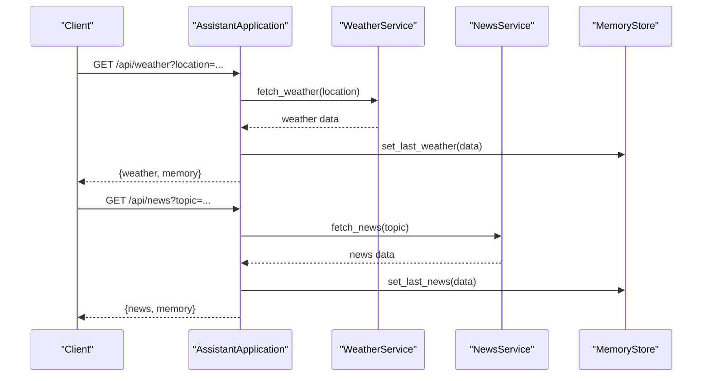
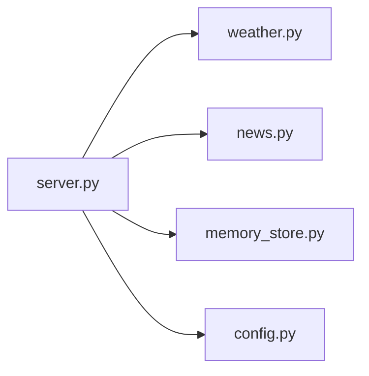

# Utility and Data Management Endpoints

<cite>
**Referenced Files in This Document**
- [server.py](file://backend/server.py)
- [weather.py](file://backend/tools/weather.py)
- [news.py](file://backend/tools/news.py)
- [memory_store.py](file://backend/core/memory_store.py)
- [config.py](file://backend/config.py)
</cite>

## Table of Contents
1. [Introduction](#introduction)
2. [Project Structure](#project-structure)
3. [Core Components](#core-components)
4. [Architecture Overview](#architecture-overview)
5. [Detailed Component Analysis](#detailed-component-analysis)
6. [Dependency Analysis](#dependency-analysis)
7. [Performance Considerations](#performance-considerations)
8. [Troubleshooting Guide](#troubleshooting-guide)
9. [Conclusion](#conclusion)

## Introduction
This document describes the utility and data management endpoints exposed by the backend server. It covers:
- Weather information retrieval via GET /api/weather
- News headline fetching via GET /api/news
- User profile updates via POST /api/profile
- Task management via GET /api/tasks (list), POST /api/tasks (create), and DELETE /api/tasks/{id} (remove)
- Note management via GET /api/notes (list), POST /api/notes (create), and DELETE /api/notes/{id} (remove)

It explains integration with external services, data validation, response formatting, error handling, caching strategies, and operational considerations such as authentication and rate limiting.

## Project Structure
The API is implemented as a single-threaded HTTP server with a central handler routing requests to domain-specific services and the persistent memory store.

**Diagram sources**
- [server.py:63-63](file://backend/server.py#L63-L63)
- [weather.py:48-48](file://backend/tools/weather.py#L48-L48)
- [news.py:22-22](file://backend/tools/news.py#L22-L22)
- [memory_store.py:67-67](file://backend/core/memory_store.py#L67-L67)
- [config.py:20-76](file://backend/config.py#L20-L76)

**Section sources**
- [server.py:63-63](file://backend/server.py#L63-L63)
- [config.py:20-76](file://backend/config.py#L20-L76)

## Core Components
- AssistantApplication: Central orchestrator that initializes services, routes HTTP requests, and formats responses.
- WeatherService: Fetches current weather and forecasts from an external weather API and caches results.
- NewsService: Retrieves RSS feeds from Google News and parses headlines.
- MemoryStore: MongoDB-backed persistence for profile, tasks, notes, chat history, and cached weather/news.
- Settings: Loads environment variables for API keys, ports, and defaults.

Key responsibilities:
- Route GET/POST/DELETE requests to appropriate handlers
- Validate inputs and enforce constraints
- Integrate with external APIs and persist results
- Return structured JSON responses with consistent shapes
- Handle service unavailability and propagate errors

**Section sources**
- [server.py:63-63](file://backend/server.py#L63-L63)
- [weather.py:48-48](file://backend/tools/weather.py#L48-L48)
- [news.py:22-22](file://backend/tools/news.py#L22-L22)
- [memory_store.py:67-67](file://backend/core/memory_store.py#L67-L67)
- [config.py:20-76](file://backend/config.py#L20-L76)

## Architecture Overview
The server exposes REST endpoints that delegate to domain services and the memory store. GET /api/weather and GET /api/news call external APIs, then cache results in MongoDB. POST /api/profile, POST /api/tasks, and POST /api/notes write to MongoDB. DELETE endpoints remove resources by identifier.

**Diagram sources**
- [server.py:145-164](file://backend/server.py#L145-L164)
- [weather.py:51-75](file://backend/tools/weather.py#L51-L75)
- [news.py:25-60](file://backend/tools/news.py#L25-L60)
- [memory_store.py:475-495](file://backend/core/memory_store.py#L475-L495)

## Detailed Component Analysis

### GET /api/weather
Purpose: Retrieve current weather for a given location.

Behavior:
- Accepts query parameter location
- Calls WeatherService.fetch_weather
- On success, persists the result to cache and returns both weather and memory state
- On failure, returns an error payload with HTTP 400

Validation and constraints:
- Location must be non-empty; otherwise raises a domain error
- External API calls are wrapped with timeouts and error translation

Response format:
- Success: { weather: { ... }, memory: { ... } }
- Failure: { error: string }

External integration:
- Uses geocoding API to resolve location to coordinates
- Uses weather forecast API to fetch current and daily metrics

Caching:
- Writes to cache collection under key "last_weather"

Rate limiting:
- No explicit client-side rate limiting; external APIs may apply limits

Security:
- No authentication required for this endpoint

Example request:
- GET /api/weather?location=London

Example response (success):
- { "weather": { "location": "...", "temperature_c": 15, ... }, "memory": { ... } }

Example response (failure):
- { "error": "I could not find '...' or Weather service unavailable right now: ..." }

**Section sources**
- [server.py:145-154](file://backend/server.py#L145-L154)
- [weather.py:51-75](file://backend/tools/weather.py#L51-L75)
- [weather.py:77-126](file://backend/tools/weather.py#L77-L126)
- [memory_store.py:475-484](file://backend/core/memory_store.py#L475-L484)

### GET /api/news
Purpose: Fetch top or topic-specific news headlines.

Behavior:
- Accepts query parameter topic
- Calls NewsService.fetch_news
- On success, persists the result to cache and returns both news and memory state
- On failure, returns an error payload with HTTP 400

Validation and constraints:
- Topic normalized and clamped to a reasonable range
- RSS parsing validates presence of required fields

Response format:
- Success: { news: { topic, items: [...], updated_at }, memory: { ... } }
- Failure: { error: string }

External integration:
- Fetches RSS from Google News; supports top headlines and search queries

Caching:
- Writes to cache collection under key "last_news"

Rate limiting:
- No explicit client-side rate limiting; external RSS feed may apply limits

Security:
- No authentication required for this endpoint

Example request:
- GET /api/news?topic=technology

Example response (success):
- { "news": { "topic": "technology", "items": [{ "title": "...", "link": "...", "source": "...", "published_at": "..." }], "updated_at": "2024-01-01T00:00:00Z" }, "memory": { ... } }

Example response (failure):
- { "error": "I could not find any fresh headlines for that topic right now." }

**Section sources**
- [server.py:155-164](file://backend/server.py#L155-L164)
- [news.py:25-60](file://backend/tools/news.py#L25-L60)
- [memory_store.py:486-495](file://backend/core/memory_store.py#L486-L495)

### POST /api/profile
Purpose: Update user profile fields.

Behavior:
- Reads displayName, location, routine from request body
- Persists to profile collection
- Returns a brief snapshot and the full memory state

Validation and constraints:
- Updates are sanitized and timestamped
- Activity records are appended for audit

Response format:
- Success: { ok: true, snapshot: { ... }, memory: { ... } }

External integration:
- None (local database operation)

Caching:
- Not applicable

Rate limiting:
- Not applicable

Security:
- No authentication required for this endpoint

Example request:
- POST /api/profile
- Body: { "displayName": "Alex", "location": "Tokyo", "routine": "Morning runs" }

Example response:
- { "ok": true, "snapshot": { "profile": { "display_name": "Alex", "location": "Tokyo", "routine": "Morning runs" }, ... }, "memory": { ... } }

**Section sources**
- [server.py:214-221](file://backend/server.py#L214-L221)
- [memory_store.py:282-303](file://backend/core/memory_store.py#L282-L303)

### GET /api/tasks
Purpose: List tasks.

Behavior:
- Returns all tasks sorted by creation date
- Response includes task entries and memory state

Validation and constraints:
- Not applicable (read-only)

Response format:
- Success: { tasks: [...], memory: { ... } }

External integration:
- None (local database read)

Caching:
- Not applicable

Rate limiting:
- Not applicable

Security:
- No authentication required for this endpoint

Example response:
- { "tasks": [ { "id": "...", "title": "Buy groceries", "priority": "medium", "due_date": "", "status": "open", "created_at": "...", "completed_at": "" } ], "memory": { ... } }

**Section sources**
- [memory_store.py:188-250](file://backend/core/memory_store.py#L188-L250)

### POST /api/tasks
Purpose: Create a new task.

Behavior:
- Reads title, priority, dueDate from request body
- Validates non-empty title
- Inserts a new task document and appends activity record
- Returns the created task and memory state

Validation and constraints:
- Title must be non-empty; otherwise raises a validation error
- Priority normalized to lowercase
- Due date sanitized

Response format:
- Success: { ok: true, task: { ... }, memory: { ... } }
- Failure: { error: string }

External integration:
- None (local database write)

Caching:
- Not applicable

Rate limiting:
- Not applicable

Security:
- No authentication required for this endpoint

Example request:
- POST /api/tasks
- Body: { "title": "Finish report", "priority": "high", "dueDate": "2024-12-31" }

Example response:
- { "ok": true, "task": { "id": "...", "title": "Finish report", "priority": "high", "due_date": "2024-12-31", "status": "open", "created_at": "...", "completed_at": "" }, "memory": { ... } }

**Section sources**
- [server.py:222-233](file://backend/server.py#L222-L233)
- [memory_store.py:338-375](file://backend/core/memory_store.py#L338-L375)

### DELETE /api/tasks/{id}
Purpose: Remove a task by id or partial title match.

Behavior:
- Attempts exact match on task_id first; falls back to substring match on title
- Deletes the task and appends activity record
- Returns a deletion confirmation and memory state

Validation and constraints:
- Reference must be non-empty; otherwise raises an error
- If no matching task is found, raises a not-found error

Response format:
- Success: { ok: true, memory: { ... } }
- Failure: { error: string }

External integration:
- None (local database delete)

Caching:
- Not applicable

Rate limiting:
- Not applicable

Security:
- No authentication required for this endpoint

Example request:
- DELETE /api/tasks/abc123

Example response:
- { "ok": true, "memory": { ... } }

**Section sources**
- [server.py:488-498](file://backend/server.py#L488-L498)
- [memory_store.py:417-446](file://backend/core/memory_store.py#L417-L446)

### GET /api/notes
Purpose: List notes.

Behavior:
- Returns all notes sorted by creation date
- Response includes note entries and memory state

Validation and constraints:
- Not applicable (read-only)

Response format:
- Success: { notes: [...], memory: { ... } }

External integration:
- None (local database read)

Caching:
- Not applicable

Rate limiting:
- Not applicable

Security:
- No authentication required for this endpoint

Example response:
- { "notes": [ { "id": "...", "category": "personal", "text": "Buy milk", "created_at": "..." } ], "memory": { ... } }

**Section sources**
- [memory_store.py:188-250](file://backend/core/memory_store.py#L188-L250)

### POST /api/notes
Purpose: Create a new note.

Behavior:
- Reads text and category from request body
- Validates non-empty text
- Inserts a new note document and appends activity record
- Returns the created note and memory state

Validation and constraints:
- Text must be non-empty; otherwise raises a validation error
- Category normalized to lowercase

Response format:
- Success: { ok: true, note: { ... }, memory: { ... } }
- Failure: { error: string }

External integration:
- None (local database write)

Caching:
- Not applicable

Rate limiting:
- Not applicable

Security:
- No authentication required for this endpoint

Example request:
- POST /api/notes
- Body: { "text": "Call mom", "category": "personal" }

Example response:
- { "ok": true, "note": { "id": "...", "category": "personal", "text": "Call mom", "created_at": "..." }, "memory": { ... } }

**Section sources**
- [server.py:243-253](file://backend/server.py#L243-L253)
- [memory_store.py:309-332](file://backend/core/memory_store.py#L309-L332)

### DELETE /api/notes/{id}
Purpose: Remove a note by id.

Behavior:
- Finds note by exact id
- Deletes the note and appends activity record
- Returns a deletion confirmation and memory state

Validation and constraints:
- Id must be non-empty; otherwise raises a not-found error
- If no matching note is found, raises a not-found error

Response format:
- Success: { ok: true, memory: { ... } }
- Failure: { error: string }

External integration:
- None (local database delete)

Caching:
- Not applicable

Rate limiting:
- Not applicable

Security:
- No authentication required for this endpoint

Example request:
- DELETE /api/notes/xyz789

Example response:
- { "ok": true, "memory": { ... } }

**Section sources**
- [server.py:476-486](file://backend/server.py#L476-L486)
- [memory_store.py:448-469](file://backend/core/memory_store.py#L448-L469)

## Dependency Analysis
The server composes three primary domains:
- External services: WeatherService and NewsService
- Persistence: MemoryStore (MongoDB)
- Configuration: Settings loaded from environment

**Diagram sources**
- [server.py:63-63](file://backend/server.py#L63-L63)
- [weather.py:48-48](file://backend/tools/weather.py#L48-L48)
- [news.py:22-22](file://backend/tools/news.py#L22-L22)
- [memory_store.py:67-67](file://backend/core/memory_store.py#L67-L67)
- [config.py:20-76](file://backend/config.py#L20-L76)

**Section sources**
- [server.py:63-63](file://backend/server.py#L63-L63)
- [weather.py:48-48](file://backend/tools/weather.py#L48-L48)
- [news.py:22-22](file://backend/tools/news.py#L22-L22)
- [memory_store.py:67-67](file://backend/core/memory_store.py#L67-L67)
- [config.py:20-76](file://backend/config.py#L20-L76)

## Performance Considerations
- External API latency: Weather and news calls are synchronous and bounded by timeouts; consider adding client-side retry/backoff and caching to reduce repeated calls.
- Database writes: All endpoints that modify data use MongoDB; ensure indexes are present for typical query patterns.
- Payload sizes: Responses include the full memory state; clients should avoid frequent polling and cache locally when possible.
- Concurrency: The server is single-threaded; heavy external calls can block other requests.

[No sources needed since this section provides general guidance]

## Troubleshooting Guide
Common issues and resolutions:
- External service unavailability
  - Symptoms: Errors indicating service unavailable or timeouts
  - Resolution: Retry after backoff; verify network and external API status
- Invalid inputs
  - Symptoms: Validation errors for empty title/text or invalid references
  - Resolution: Ensure required fields are present and formatted correctly
- Not found errors
  - Symptoms: Deleting non-existent tasks or notes
  - Resolution: Verify resource identifiers; ensure they exist before deletion
- Rate limiting
  - Symptoms: Frequent failures from external APIs
  - Resolution: Implement client-side throttling and caching; monitor quotas

**Section sources**
- [weather.py:122-126](file://backend/tools/weather.py#L122-L126)
- [news.py:77-82](file://backend/tools/news.py#L77-L82)
- [memory_store.py:311-312](file://backend/core/memory_store.py#L311-L312)
- [memory_store.py:450-452](file://backend/core/memory_store.py#L450-L452)
- [memory_store.py:432-433](file://backend/core/memory_store.py#L432-L433)

## Conclusion
The backend exposes a cohesive set of utility and data management endpoints that integrate external services with a robust local persistence layer. Requests are validated, responses are consistently formatted, and results are cached for quick retrieval. For production use, consider adding authentication, rate limiting, and improved resilience for external API calls.