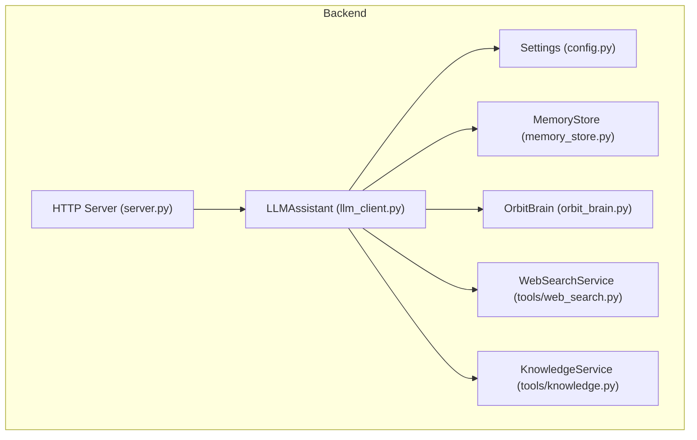
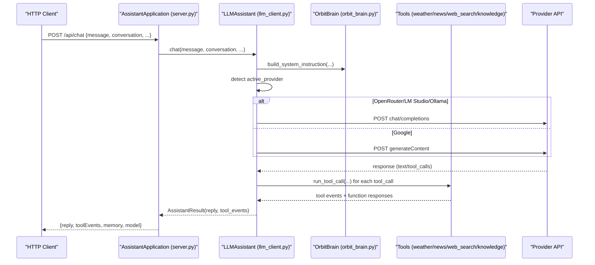
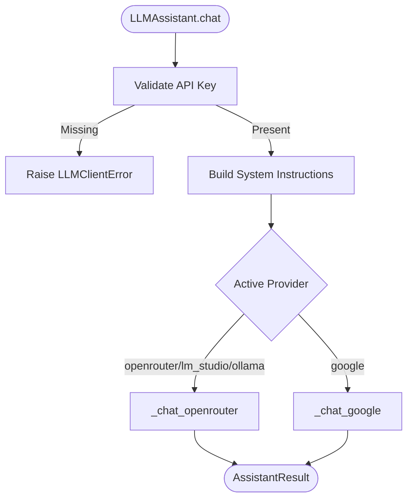
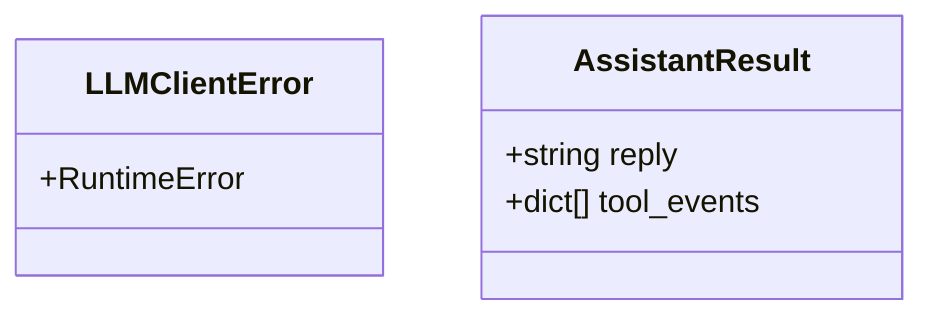
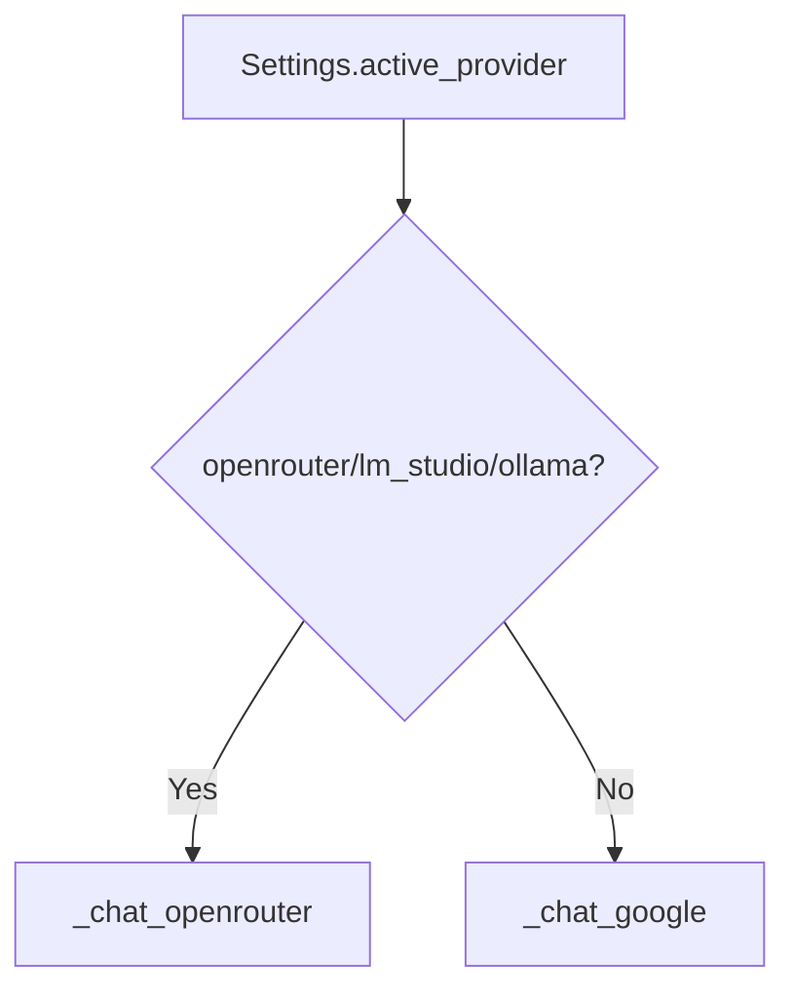
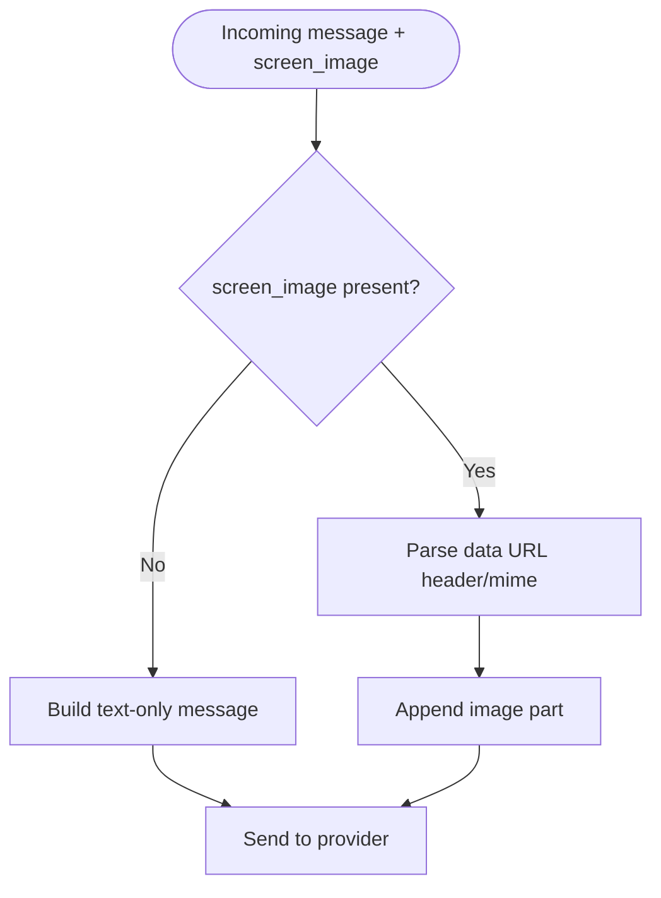
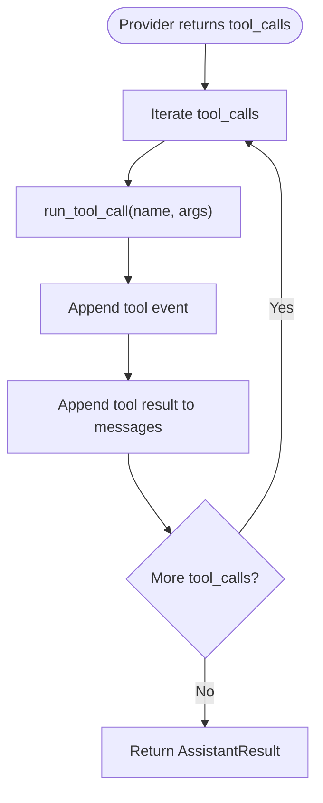
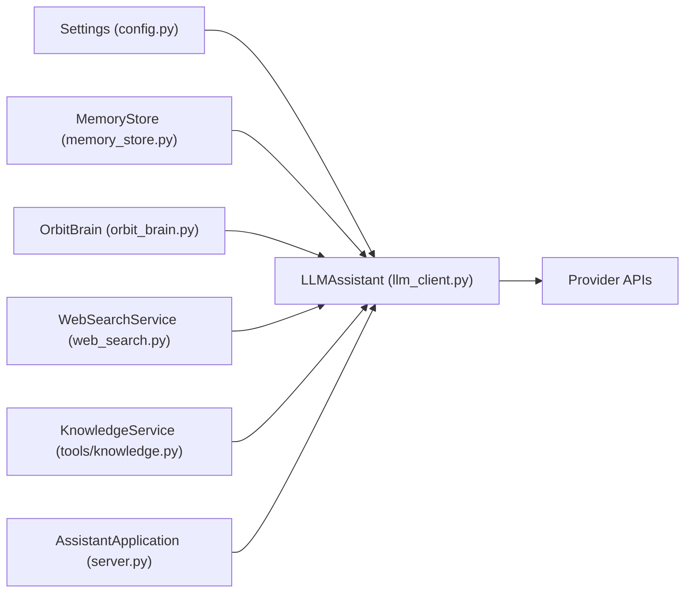

# Client Architecture and Factory Pattern

<cite>
**Referenced Files in This Document**
- [llm_client.py](file://backend/api_clients/llm_client.py)
- [__init__.py](file://backend/api_clients/__init__.py)
- [config.py](file://backend/config.py)
- [orbit_brain.py](file://backend/core/orbit_brain.py)
- [memory_store.py](file://backend/core/memory_store.py)
- [web_search.py](file://backend/tools/web_search.py)
- [server.py](file://backend/server.py)
- [README.md](file://README.md)
</cite>

## Table of Contents
1. [Introduction](#introduction)
2. [Project Structure](#project-structure)
3. [Core Components](#core-components)
4. [Architecture Overview](#architecture-overview)
5. [Detailed Component Analysis](#detailed-component-analysis)
6. [Dependency Analysis](#dependency-analysis)
7. [Performance Considerations](#performance-considerations)
8. [Troubleshooting Guide](#troubleshooting-guide)
9. [Conclusion](#conclusion)
10. [Appendices](#appendices)

## Introduction
This document explains the LLM client architecture with a focus on the factory-like routing mechanism that selects the appropriate client implementation based on active provider settings, the client abstraction layer, and the main LLMAssistant class initialization. It also documents the exception handling model, the AssistantResult data structure, provider detection logic, conversation management, multimodal input handling (text and screen images), parameter validation, and the chat method signature. Practical examples of client instantiation, conversation state management, and error handling patterns are included.

## Project Structure
The LLM client architecture centers around the backend/api_clients module, which exposes a unified interface for interacting with multiple LLM providers. The server integrates the client with memory, tools, and configuration to deliver a cohesive assistant experience.

**Diagram sources**
- [server.py:23-63](file://backend/server.py#L23-L63)
- [llm_client.py:38-46](file://backend/api_clients/llm_client.py#L38-L46)
- [config.py:20-76](file://backend/config.py#L20-L76)
- [memory_store.py:67-117](file://backend/core/memory_store.py#L67-L117)
- [orbit_brain.py:302-386](file://backend/core/orbit_brain.py#L302-L386)
- [web_search.py:53-104](file://backend/tools/web_search.py#L53-L104)

**Section sources**
- [README.md:164-201](file://README.md#L164-L201)
- [server.py:23-63](file://backend/server.py#L23-L63)

## Core Components
- LLMAssistant: The central client abstraction that orchestrates provider selection, conversation construction, tool invocation, and response synthesis.
- LLMClientError: A dedicated exception type for client-side failures.
- AssistantResult: A data structure encapsulating the assistant’s textual reply and tool events.
- Settings: Centralized configuration controlling provider selection, API keys, and model choices.
- MemoryStore: Persistent storage for sessions, messages, tasks, notes, and cached tool results.
- Tools: Weather, News, Web Search, and Knowledge services used by the brain and client.

**Section sources**
- [llm_client.py:28-36](file://backend/api_clients/llm_client.py#L28-L36)
- [llm_client.py:38-46](file://backend/api_clients/llm_client.py#L38-L46)
- [config.py:20-76](file://backend/config.py#L20-L76)
- [memory_store.py:67-117](file://backend/core/memory_store.py#L67-L117)
- [orbit_brain.py:302-386](file://backend/core/orbit_brain.py#L302-L386)
- [web_search.py:53-104](file://backend/tools/web_search.py#L53-L104)

## Architecture Overview
The system routes requests to provider-specific implementations based on active provider settings. The LLMAssistant builds system instructions and messages, invokes provider APIs, executes tool calls, and aggregates results into AssistantResult.

**Diagram sources**
- [server.py:276-321](file://backend/server.py#L276-L321)
- [llm_client.py:47-78](file://backend/api_clients/llm_client.py#L47-L78)
- [llm_client.py:82-216](file://backend/api_clients/llm_client.py#L82-L216)
- [llm_client.py:220-272](file://backend/api_clients/llm_client.py#L220-L272)
- [orbit_brain.py:302-386](file://backend/core/orbit_brain.py#L302-L386)
- [web_search.py:53-104](file://backend/tools/web_search.py#L53-L104)

## Detailed Component Analysis

### LLMAssistant: Client Abstraction and Factory Routing
- Initialization: Receives Settings, MemoryStore, KnowledgeService, and WebSearchService. Creates WeatherService and NewsService instances.
- chat method: Validates API key presence, constructs system instructions via OrbitBrain, detects active provider, and dispatches to provider-specific handlers.
- Provider detection: Routes to _chat_openrouter for openrouter, lm_studio, and ollama; otherwise routes to _chat_google.
- Multimodal input: Supports screen_image payloads for both provider branches.
- Conversation management: Maintains conversation snapshots and appends user/system messages appropriately.
- Parameter validation: Enforces non-empty message and API key presence; raises LLMClientError on failure.
- Tool orchestration: Executes tool calls returned by provider APIs and aggregates tool events.

**Diagram sources**
- [llm_client.py:38-78](file://backend/api_clients/llm_client.py#L38-L78)
- [llm_client.py:82-216](file://backend/api_clients/llm_client.py#L82-L216)
- [llm_client.py:220-272](file://backend/api_clients/llm_client.py#L220-L272)

**Section sources**
- [llm_client.py:38-78](file://backend/api_clients/llm_client.py#L38-L78)
- [llm_client.py:82-216](file://backend/api_clients/llm_client.py#L82-L216)
- [llm_client.py:220-272](file://backend/api_clients/llm_client.py#L220-L272)

### LLMClientError and AssistantResult
- LLMClientError: A dedicated runtime exception used to signal client-side failures (e.g., missing API key, provider errors).
- AssistantResult: Encapsulates the assistant’s reply text and a list of tool events generated during tool execution.

**Diagram sources**
- [llm_client.py:28-36](file://backend/api_clients/llm_client.py#L28-L36)
- [llm_client.py:29-32](file://backend/api_clients/llm_client.py#L29-L32)

**Section sources**
- [llm_client.py:28-36](file://backend/api_clients/llm_client.py#L28-L36)
- [llm_client.py:29-32](file://backend/api_clients/llm_client.py#L29-L32)

### Provider Detection Logic and Routing
- Active provider selection is driven by Settings.active_provider.
- Routing conditions:
  - openrouter, lm_studio, ollama → _chat_openrouter
  - google → _chat_google
- Endpoint selection varies by provider and configuration (e.g., OpenRouter, LM Studio, Ollama vs. Google REST API).

**Diagram sources**
- [llm_client.py:74-77](file://backend/api_clients/llm_client.py#L74-L77)
- [config.py:25-52](file://backend/config.py#L25-L52)

**Section sources**
- [llm_client.py:74-77](file://backend/api_clients/llm_client.py#L74-L77)
- [config.py:25-52](file://backend/config.py#L25-L52)

### Conversation Management and Multimodal Inputs
- Conversation snapshot: Recent conversation entries are included in system instructions and transformed into provider-specific message formats.
- Multimodal inputs:
  - OpenRouter branch: Accepts screen_image as a data URL; splits header/mime and appends as image_url.
  - Google branch: Accepts screen_image as a data URL; parses header/mime and appends inlineData.
- Message construction:
  - OpenRouter: Builds mixed content (text + image_url) under a user role.
  - Google: Builds parts array with text and inlineData.

**Diagram sources**
- [llm_client.py:97-102](file://backend/api_clients/llm_client.py#L97-L102)
- [llm_client.py:274-291](file://backend/api_clients/llm_client.py#L274-L291)

**Section sources**
- [llm_client.py:97-102](file://backend/api_clients/llm_client.py#L97-L102)
- [llm_client.py:274-291](file://backend/api_clients/llm_client.py#L274-L291)

### Tool Orchestration and Execution
- Tool discovery: build_rest_tools generates function declarations based on mode and capabilities (web search only, offline mode, session docs).
- Tool execution: run_tool_call dispatches to specific services (weather, news, memory, tasks, notes, knowledge, web search) and returns ToolRunResult with event and function_response.
- Loop control: Both provider branches enforce a maximum iteration limit to prevent infinite tool loops.

**Diagram sources**
- [orbit_brain.py:361-386](file://backend/core/orbit_brain.py#L361-L386)
- [orbit_brain.py:389-501](file://backend/core/orbit_brain.py#L389-L501)
- [llm_client.py:185-215](file://backend/api_clients/llm_client.py#L185-L215)
- [llm_client.py:255-271](file://backend/api_clients/llm_client.py#L255-L271)

**Section sources**
- [orbit_brain.py:361-386](file://backend/core/orbit_brain.py#L361-L386)
- [orbit_brain.py:389-501](file://backend/core/orbit_brain.py#L389-L501)
- [llm_client.py:185-215](file://backend/api_clients/llm_client.py#L185-L215)
- [llm_client.py:255-271](file://backend/api_clients/llm_client.py#L255-L271)

### Chat Method Signature and Parameters
The chat method accepts the following parameters:
- message: The user’s input text.
- conversation: Optional list of prior messages (role/text).
- screen_image: Optional base64 data URL of a screen image.
- mode: Mode selection (simple, copilot, coach).
- coach_topic: Topic for coach mode.
- coach_level: Level for coach mode.
- preferred_language: Preferred language hint.
- web_search_only: Boolean toggle to prioritize web search.
- offline_mode: Boolean toggle to disable web search.
- session_id: Optional session identifier for knowledge/session docs.

Validation:
- Non-empty message enforced by server handler.
- API key presence enforced by LLMAssistant.

**Section sources**
- [llm_client.py:47-59](file://backend/api_clients/llm_client.py#L47-L59)
- [server.py:295-307](file://backend/server.py#L295-L307)

### Example Patterns

#### Client Instantiation
- The server constructs LLMAssistant with Settings, MemoryStore, KnowledgeService, and WebSearchService.

**Section sources**
- [server.py:60](file://backend/server.py#L60)

#### Conversation State Management
- Sessions and messages are managed via MemoryStore. The server exposes endpoints to create/update sessions, add messages, and retrieve histories.

**Section sources**
- [server.py:110-143](file://backend/server.py#L110-L143)
- [server.py:188-202](file://backend/server.py#L188-L202)
- [memory_store.py:579-646](file://backend/core/memory_store.py#L579-L646)
- [memory_store.py:652-685](file://backend/core/memory_store.py#L652-L685)

#### Error Handling Patterns
- Missing API key: LLMAssistant raises LLMClientError.
- Provider errors: HTTPError/URLError mapped to LLMClientError with contextual details.
- Tool errors: run_tool_call catches exceptions and returns error events.

**Section sources**
- [llm_client.py:60-61](file://backend/api_clients/llm_client.py#L60-L61)
- [llm_client.py:161-174](file://backend/api_clients/llm_client.py#L161-L174)
- [llm_client.py:319-323](file://backend/api_clients/llm_client.py#L319-L323)
- [orbit_brain.py:490-493](file://backend/core/orbit_brain.py#L490-L493)

## Dependency Analysis
The LLMAssistant depends on configuration, memory, tools, and brain utilities. The server composes these dependencies and exposes a clean HTTP API.

**Diagram sources**
- [llm_client.py:38-46](file://backend/api_clients/llm_client.py#L38-L46)
- [config.py:20-76](file://backend/config.py#L20-L76)
- [memory_store.py:67-117](file://backend/core/memory_store.py#L67-L117)
- [orbit_brain.py:302-386](file://backend/core/orbit_brain.py#L302-L386)
- [web_search.py:53-104](file://backend/tools/web_search.py#L53-L104)
- [server.py:23-63](file://backend/server.py#L23-L63)

**Section sources**
- [llm_client.py:38-46](file://backend/api_clients/llm_client.py#L38-L46)
- [server.py:23-63](file://backend/server.py#L23-L63)

## Performance Considerations
- Provider branching: Choosing openrouter/lm_studio/ollama avoids Google REST API overhead; Google branch uses a single generateContent call per iteration.
- Tool loop limits: Both branches cap iterations to prevent excessive latency.
- Message windowing: Only recent conversation entries are forwarded to reduce payload sizes.
- Multimodal payloads: Image data URLs are parsed once and appended as minimal parts.

[No sources needed since this section provides general guidance]

## Troubleshooting Guide
Common issues and resolutions:
- Missing API key: Ensure ACTIVE_PROVIDER and corresponding API key are configured; LLMAssistant raises LLMClientError if missing.
- Provider connectivity: HTTPError/URLError mapped to LLMClientError with details; verify network and endpoint URLs.
- Tool failures: run_tool_call returns error events; inspect tool events and logs.
- Conversation anomalies: Verify session_id correctness and ensure MemoryStore is reachable.

**Section sources**
- [llm_client.py:60-61](file://backend/api_clients/llm_client.py#L60-L61)
- [llm_client.py:161-174](file://backend/api_clients/llm_client.py#L161-L174)
- [llm_client.py:319-323](file://backend/api_clients/llm_client.py#L319-L323)
- [orbit_brain.py:490-493](file://backend/core/orbit_brain.py#L490-L493)

## Conclusion
The LLM client architecture employs a clean abstraction layer (LLMAssistant) with provider-specific routing, robust error handling (LLMClientError), and a consistent result format (AssistantResult). The system integrates tightly with memory, tools, and configuration to support multimodal inputs, conversation management, and flexible search modes. The server composes these components into a cohesive HTTP API, enabling reliable and extensible assistant behavior across providers.

[No sources needed since this section summarizes without analyzing specific files]

## Appendices

### API Exposure and Initialization
- LLMAssistant is exported via backend/api_clients/__init__.py.
- The server initializes LLMAssistant with Settings, MemoryStore, KnowledgeService, and WebSearchService.

**Section sources**
- [__init__.py:1-3](file://backend/api_clients/__init__.py#L1-L3)
- [server.py:60](file://backend/server.py#L60)