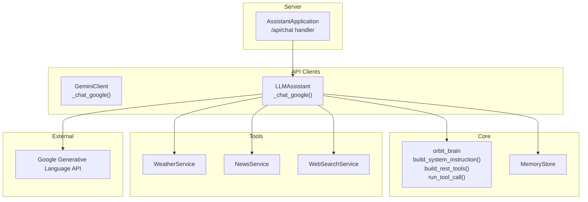
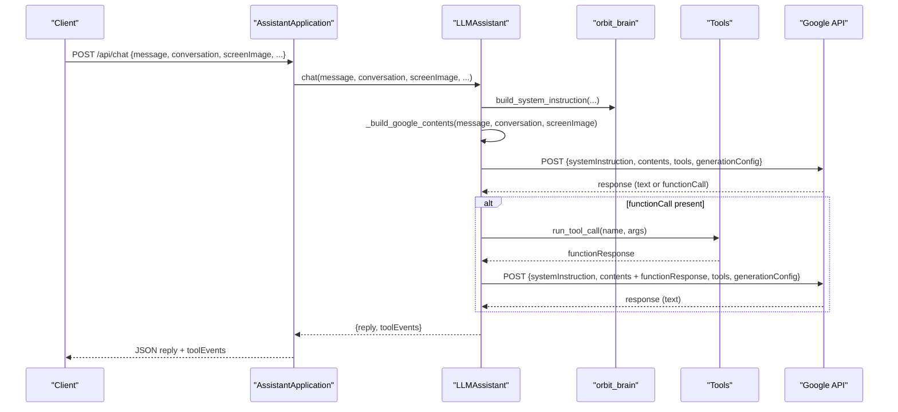
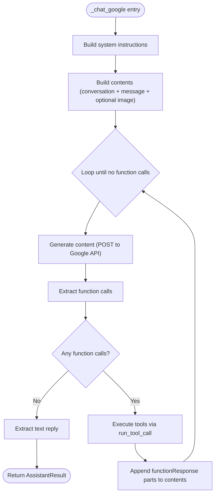
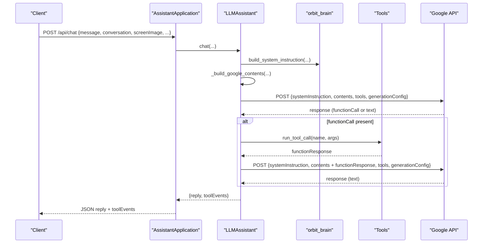
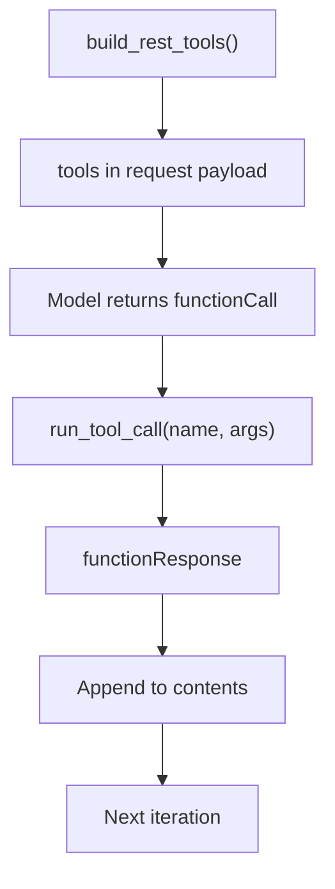
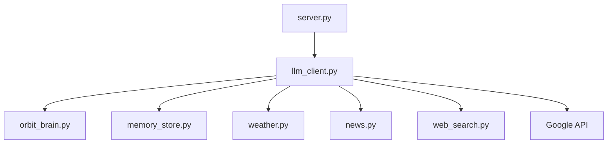

# Google Gemini Integration

<cite>
**Referenced Files in This Document**
- [gemini_client.py](file://backend/api_clients/gemini_client.py)
- [llm_client.py](file://backend/api_clients/llm_client.py)
- [config.py](file://backend/config.py)
- [orbit_brain.py](file://backend/core/orbit_brain.py)
- [memory_store.py](file://backend/core/memory_store.py)
- [server.py](file://backend/server.py)
- [weather.py](file://backend/tools/weather.py)
- [news.py](file://backend/tools/news.py)
- [web_search.py](file://backend/tools/web_search.py)
</cite>

## Table of Contents
1. [Introduction](#introduction)
2. [Project Structure](#project-structure)
3. [Core Components](#core-components)
4. [Architecture Overview](#architecture-overview)
5. [Detailed Component Analysis](#detailed-component-analysis)
6. [Dependency Analysis](#dependency-analysis)
7. [Performance Considerations](#performance-considerations)
8. [Troubleshooting Guide](#troubleshooting-guide)
9. [Conclusion](#conclusion)

## Introduction
This document explains the Google Gemini API integration within the Orbit Assistant project. It focuses on the _chat_google method implementation and REST API communication, including multimodal input handling (text and inline images), system instruction integration, tool function declaration and execution, request payload construction, and response parsing. It also covers API key management, endpoint configuration, and error handling for Google API responses. Practical examples illustrate multimodal message construction, tool call execution flow, and response processing patterns.

## Project Structure
The integration spans several modules:
- API clients: Gemini-specific client and a unified LLM client that routes to Google’s REST API
- Core brain: system instruction builder, tool declarations, and tool execution
- Tools: weather, news, and web search services
- Memory store: persistent memory and session management
- Server: HTTP entry point that orchestrates chat requests and responses

**Diagram sources**
- [gemini_client.py:36-95](file://backend/api_clients/gemini_client.py#L36-L95)
- [llm_client.py:217-272](file://backend/api_clients/llm_client.py#L217-L272)
- [orbit_brain.py:302-386](file://backend/core/orbit_brain.py#L302-L386)
- [memory_store.py:67-117](file://backend/core/memory_store.py#L67-L117)
- [server.py:276-321](file://backend/server.py#L276-L321)

**Section sources**
- [gemini_client.py:1-207](file://backend/api_clients/gemini_client.py#L1-L207)
- [llm_client.py:1-366](file://backend/api_clients/llm_client.py#L1-L366)
- [config.py:1-76](file://backend/config.py#L1-L76)
- [orbit_brain.py:1-502](file://backend/core/orbit_brain.py#L1-L502)
- [memory_store.py:1-800](file://backend/core/memory_store.py#L1-L800)
- [server.py:1-611](file://backend/server.py#L1-L611)

## Core Components
- GeminiClient: Provides a dedicated client for Google Gemini with a _chat_google method and helper functions for content building, function call extraction, and response parsing.
- LLMAssistant: Unified client that routes to Google’s REST API via _chat_google when the active provider is Google.
- orbit_brain: Builds system instructions, declares tools, and executes tool calls.
- MemoryStore: Supplies memory snapshots and manages session attachments for tool availability.
- Tools: WeatherService, NewsService, and WebSearchService provide external capabilities.
- Server: Exposes /api/chat to accept multimodal messages and returns assistant replies with tool events.

**Section sources**
- [gemini_client.py:36-95](file://backend/api_clients/gemini_client.py#L36-L95)
- [llm_client.py:217-272](file://backend/api_clients/llm_client.py#L217-L272)
- [orbit_brain.py:302-386](file://backend/core/orbit_brain.py#L302-L386)
- [memory_store.py:67-117](file://backend/core/memory_store.py#L67-L117)
- [server.py:276-321](file://backend/server.py#L276-L321)

## Architecture Overview
The Google Gemini integration follows a request-response loop with optional tool calls:
1. The server receives a chat request and delegates to LLMAssistant.
2. LLMAssistant builds system instructions and constructs a multimodal content array (text + optional inline image).
3. It sends a POST request to the Google Generative Language API with systemInstruction, contents, tools, and generationConfig.
4. The model responds with either a text reply or a functionCall part.
5. If functionCalls are present, the client executes them via run_tool_call and appends functionResponse parts back into the conversation until the model produces a final text reply.

**Diagram sources**
- [server.py:276-321](file://backend/server.py#L276-L321)
- [llm_client.py:217-272](file://backend/api_clients/llm_client.py#L217-L272)
- [orbit_brain.py:389-501](file://backend/core/orbit_brain.py#L389-L501)

## Detailed Component Analysis

### GeminiClient: _chat_google and REST Communication
- Validates API key presence and raises a GeminiClientError if missing.
- Builds system instructions using build_system_instruction with mode, language, and conversation snapshot.
- Constructs contents with prior conversation entries and the current user message, appending an inline image part when provided.
- Iteratively calls _generate_content, extracts function calls, executes tools, and appends functionResponse parts back into contents until no function calls remain or a text reply is produced.
- Enforces a loop limit to prevent infinite tool loops.

Key helper methods:
- _build_contents: Converts conversation entries to roles and text parts; appends the user message and optional inline image part.
- _build_image_part: Parses data URI for inline image, infers MIME type, and returns an inlineData part.
- _generate_content: Sends a POST request to the Google API endpoint with x-goog-api-key header and returns parsed JSON.
- _extract_model_content: Retrieves the model’s content from the first candidate.
- _extract_function_calls: Scans content parts for functionCall entries and normalizes them with ids.
- _extract_text: Extracts text from candidates or returns informative messages for blocking or finish reasons.

**Diagram sources**
- [gemini_client.py:43-94](file://backend/api_clients/gemini_client.py#L43-L94)
- [gemini_client.py:96-130](file://backend/api_clients/gemini_client.py#L96-L130)
- [gemini_client.py:132-162](file://backend/api_clients/gemini_client.py#L132-L162)
- [gemini_client.py:163-207](file://backend/api_clients/gemini_client.py#L163-L207)

**Section sources**
- [gemini_client.py:43-94](file://backend/api_clients/gemini_client.py#L43-L94)
- [gemini_client.py:96-130](file://backend/api_clients/gemini_client.py#L96-L130)
- [gemini_client.py:132-162](file://backend/api_clients/gemini_client.py#L132-L162)
- [gemini_client.py:163-207](file://backend/api_clients/gemini_client.py#L163-L207)

### LLMAssistant: Unified Routing and Google REST API
- Provides a unified chat interface that selects the active provider and routes to _chat_google for Google.
- Builds system instructions with mode, language, and optional search modes (web search only, offline).
- Prepares multimodal contents with inline image support and appends a reminder for multi-tool execution when needed.
- Sends requests to the Google endpoint with systemInstruction, contents, tools, and generationConfig.
- Extracts function calls, executes tools, and appends functionResponse parts to continue the conversation until a final text reply is produced.

**Diagram sources**
- [llm_client.py:217-272](file://backend/api_clients/llm_client.py#L217-L272)
- [llm_client.py:274-291](file://backend/api_clients/llm_client.py#L274-L291)
- [llm_client.py:293-323](file://backend/api_clients/llm_client.py#L293-L323)
- [llm_client.py:332-347](file://backend/api_clients/llm_client.py#L332-L347)
- [llm_client.py:349-366](file://backend/api_clients/llm_client.py#L349-L366)

**Section sources**
- [llm_client.py:217-272](file://backend/api_clients/llm_client.py#L217-L272)
- [llm_client.py:274-291](file://backend/api_clients/llm_client.py#L274-L291)
- [llm_client.py:293-323](file://backend/api_clients/llm_client.py#L293-L323)
- [llm_client.py:332-347](file://backend/api_clients/llm_client.py#L332-L347)
- [llm_client.py:349-366](file://backend/api_clients/llm_client.py#L349-L366)

### System Instruction Integration
- build_system_instruction composes a dynamic system prompt based on mode (simple, copilot, coach), language preferences, recent conversation snapshot, and search mode flags.
- The resulting instruction is passed as systemInstruction in the Google API request payload.

**Section sources**
- [orbit_brain.py:302-356](file://backend/core/orbit_brain.py#L302-L356)

### Tool Function Declaration and Execution
- build_rest_tools generates functionDeclarations for tools, conditionally enabling search_local_docs, search_web, and search_session_docs based on configuration and session attachments.
- run_tool_call executes tools and returns a standardized ToolRunResult with event metadata and function_response payload.
- The client appends functionResponse parts back into contents to continue the conversation loop.

**Diagram sources**
- [orbit_brain.py:361-386](file://backend/core/orbit_brain.py#L361-L386)
- [orbit_brain.py:389-501](file://backend/core/orbit_brain.py#L389-L501)
- [llm_client.py:255-268](file://backend/api_clients/llm_client.py#L255-L268)

**Section sources**
- [orbit_brain.py:361-386](file://backend/core/orbit_brain.py#L361-L386)
- [orbit_brain.py:389-501](file://backend/core/orbit_brain.py#L389-L501)
- [llm_client.py:255-268](file://backend/api_clients/llm_client.py#L255-L268)

### Request Payload Construction
- Endpoint: https://generativelanguage.googleapis.com/v1beta/models/{model}:generateContent
- Headers: Content-Type: application/json, x-goog-api-key: <API key>
- Payload fields:
  - systemInstruction.parts.text: system instructions
  - contents: array of {role, parts} with text and optional inlineData
  - tools: functionDeclarations generated by build_rest_tools
  - generationConfig.temperature: 0.7

**Section sources**
- [gemini_client.py:23](file://backend/api_clients/gemini_client.py#L23)
- [gemini_client.py:132-152](file://backend/api_clients/gemini_client.py#L132-L152)
- [llm_client.py:293-314](file://backend/api_clients/llm_client.py#L293-L314)

### Response Parsing and Text Extraction
- Model content extraction: _extract_model_content retrieves the first candidate’s content.
- Function call detection: _extract_function_calls scans content parts for functionCall entries and normalizes them.
- Text extraction: _extract_text returns concatenated text parts or informative messages for blocking or finish reasons.

**Section sources**
- [gemini_client.py:163-207](file://backend/api_clients/gemini_client.py#L163-L207)
- [llm_client.py:325-366](file://backend/api_clients/llm_client.py#L325-L366)

### Multimodal Message Construction Examples
- Text-only message: contents includes prior conversation entries and a user part with text.
- With inline image: user part includes both text and an inlineData part derived from a data URI (mime type inferred from header).
- Session-aware enhancement: when session has attachments, search_session_docs becomes available and can be invoked during the tool loop.

**Section sources**
- [gemini_client.py:96-130](file://backend/api_clients/gemini_client.py#L96-L130)
- [llm_client.py:274-291](file://backend/api_clients/llm_client.py#L274-L291)

### Tool Call Execution Flow
- Detect functionCall in response.
- Execute run_tool_call with name and args.
- Append functionResponse part to contents.
- Repeat until no function calls remain.

**Section sources**
- [gemini_client.py:79-93](file://backend/api_clients/gemini_client.py#L79-L93)
- [llm_client.py:255-270](file://backend/api_clients/llm_client.py#L255-L270)

### API Key Management and Endpoint Configuration
- API key: Retrieved from Settings and used in the x-goog-api-key header.
- Model selection: Configured via settings and URL-quoted in the endpoint template.
- Provider routing: LLMAssistant routes to Google when active_provider is "google".

**Section sources**
- [config.py:20-76](file://backend/config.py#L20-L76)
- [gemini_client.py:132-152](file://backend/api_clients/gemini_client.py#L132-L152)
- [llm_client.py:293-314](file://backend/api_clients/llm_client.py#L293-L314)

### Error Handling
- GeminiClientError/LLMClientError raised for missing API keys, HTTP errors, and URL errors.
- Prompt feedback and finish reasons are handled in text extraction to provide informative responses.

**Section sources**
- [gemini_client.py:53-56](file://backend/api_clients/gemini_client.py#L53-L56)
- [gemini_client.py:157-161](file://backend/api_clients/gemini_client.py#L157-L161)
- [llm_client.py:319-323](file://backend/api_clients/llm_client.py#L319-L323)
- [gemini_client.py:194-196](file://backend/api_clients/gemini_client.py#L194-L196)
- [llm_client.py:354-356](file://backend/api_clients/llm_client.py#L354-L356)

## Dependency Analysis
- LLMAssistant depends on orbit_brain for system instructions and tool declarations, MemoryStore for memory snapshots, and tool services for execution.
- GeminiClient encapsulates Google-specific logic and is superseded by LLMAssistant for unified provider routing.
- Server integrates the assistant and exposes /api/chat for client interaction.

**Diagram sources**
- [server.py:276-321](file://backend/server.py#L276-L321)
- [llm_client.py:217-272](file://backend/api_clients/llm_client.py#L217-L272)
- [orbit_brain.py:302-386](file://backend/core/orbit_brain.py#L302-L386)
- [memory_store.py:67-117](file://backend/core/memory_store.py#L67-L117)

**Section sources**
- [server.py:276-321](file://backend/server.py#L276-L321)
- [llm_client.py:217-272](file://backend/api_clients/llm_client.py#L217-L272)
- [orbit_brain.py:302-386](file://backend/core/orbit_brain.py#L302-L386)
- [memory_store.py:67-117](file://backend/core/memory_store.py#L67-L117)

## Performance Considerations
- Temperature setting: generationConfig.temperature is set to 0.7 to balance creativity and coherence.
- Loop limits: Both GeminiClient and LLMAssistant enforce loop limits to avoid excessive tool iterations.
- Payload minimization: Only the last N conversation entries are included to reduce token usage.
- Asynchronous tool execution: Tool calls are executed synchronously in the loop; consider batching or parallelism for multiple independent calls if needed.

[No sources needed since this section provides general guidance]

## Troubleshooting Guide
Common issues and resolutions:
- Missing API key: Ensure GOOGLE_API_KEY is configured in the environment; the client raises an explicit error if absent.
- HTTP errors: Inspect the HTTP status code and error body returned by the Google API; adjust model or payload accordingly.
- URL errors: Verify network connectivity and endpoint accessibility.
- Blocked prompts: The text extractor checks promptFeedback.blockReason and returns an informative message.
- Finish reasons: If the model finishes without text, the extractor reports the finish reason.

**Section sources**
- [gemini_client.py:53-56](file://backend/api_clients/gemini_client.py#L53-L56)
- [gemini_client.py:157-161](file://backend/api_clients/gemini_client.py#L157-L161)
- [gemini_client.py:194-196](file://backend/api_clients/gemini_client.py#L194-L196)
- [llm_client.py:319-323](file://backend/api_clients/llm_client.py#L319-L323)
- [llm_client.py:354-356](file://backend/api_clients/llm_client.py#L354-L356)

## Conclusion
The Google Gemini integration combines a robust multimodal content builder, dynamic system instructions, and a flexible tool execution loop. The unified LLMAssistant routes to Google’s REST API, while the dedicated GeminiClient offers a focused implementation. Proper API key management, careful payload construction, and resilient response parsing ensure reliable operation across text-only and multimodal scenarios, including inline image inputs and tool-assisted reasoning.