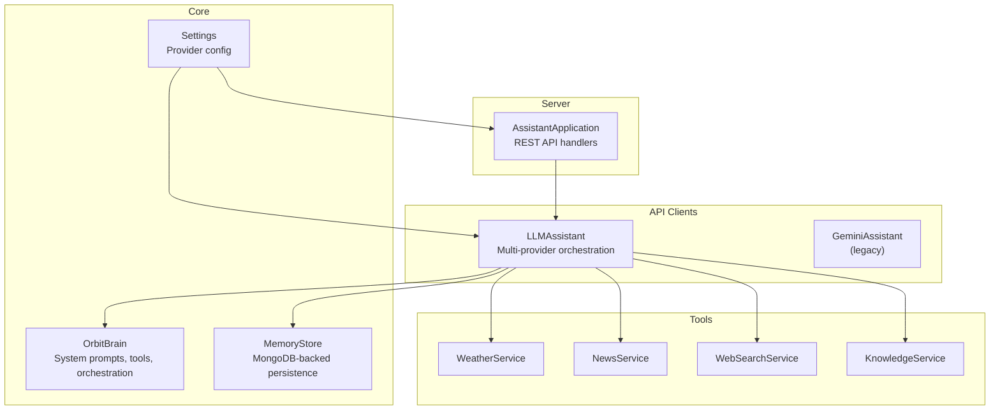
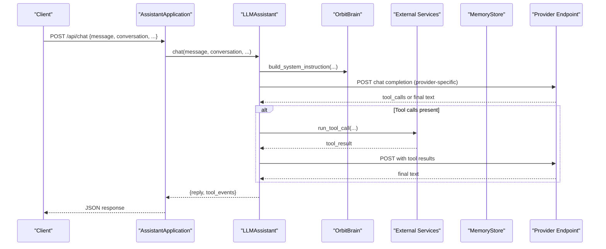
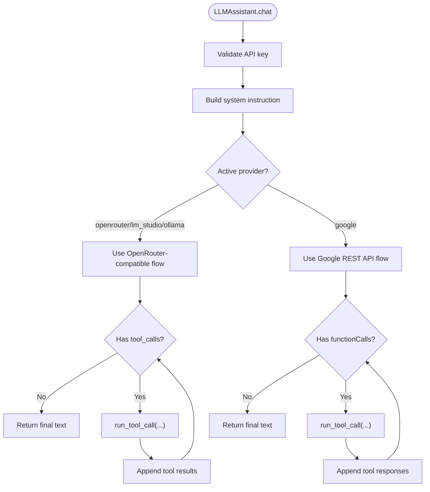
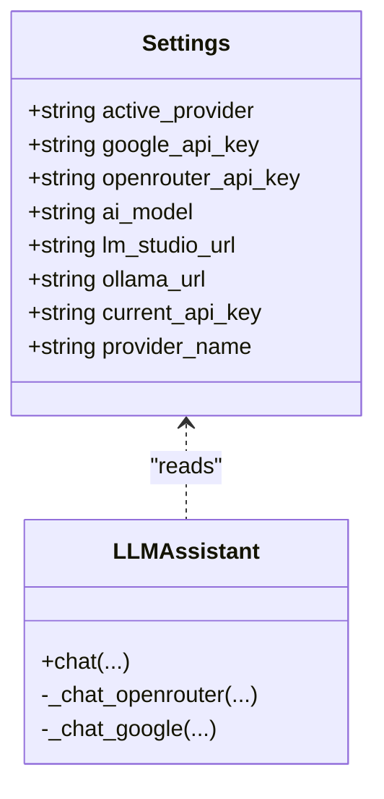
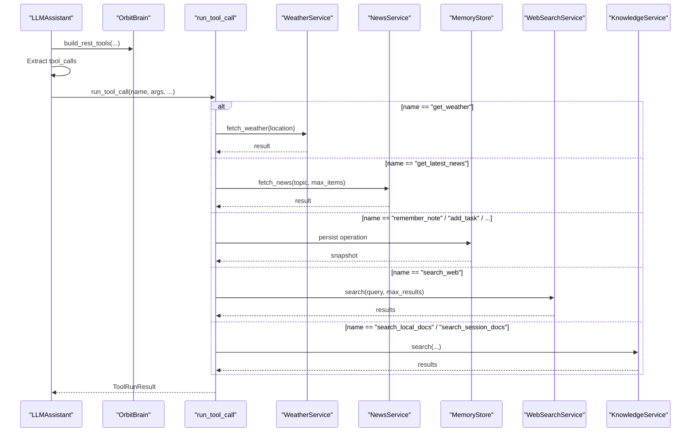
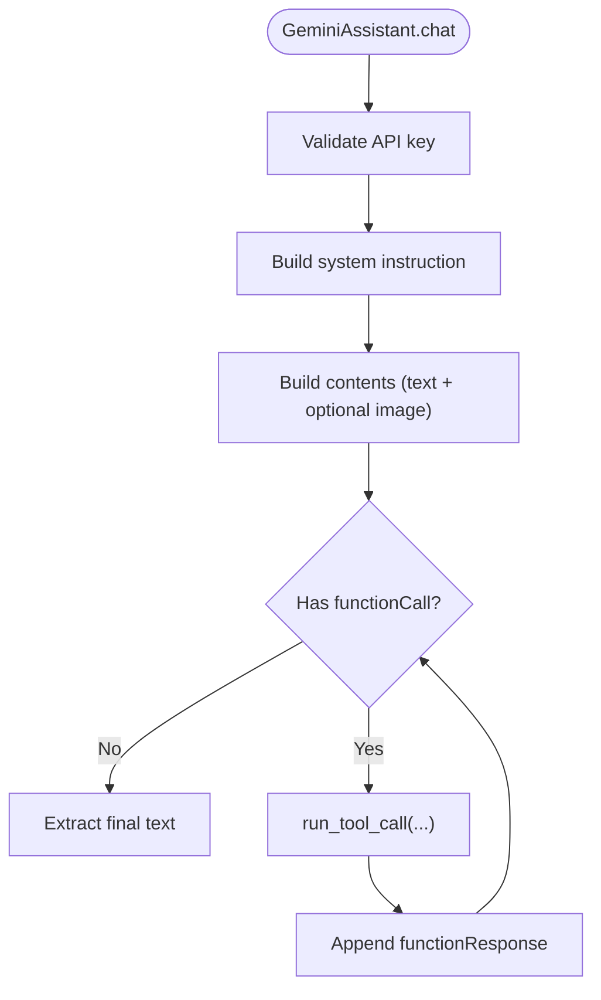
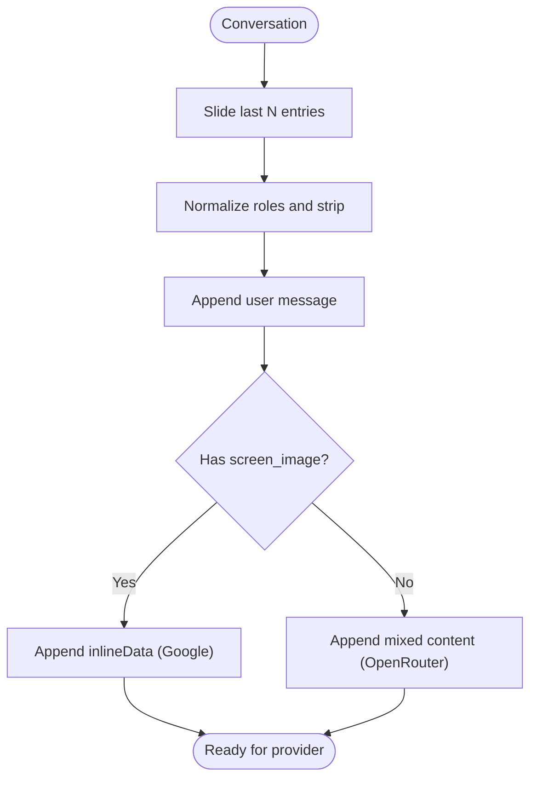
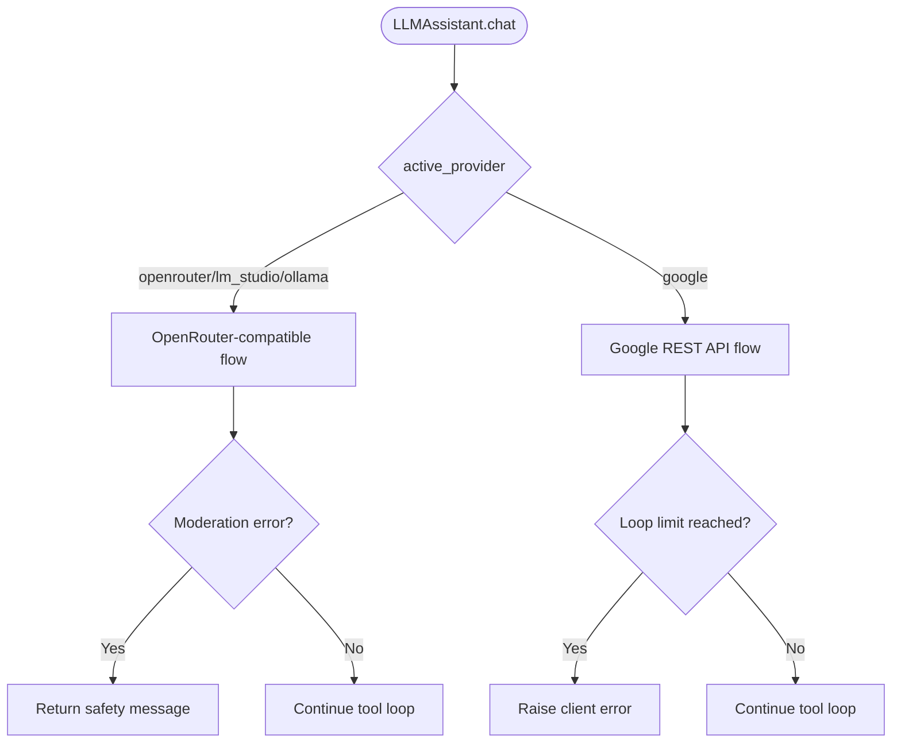
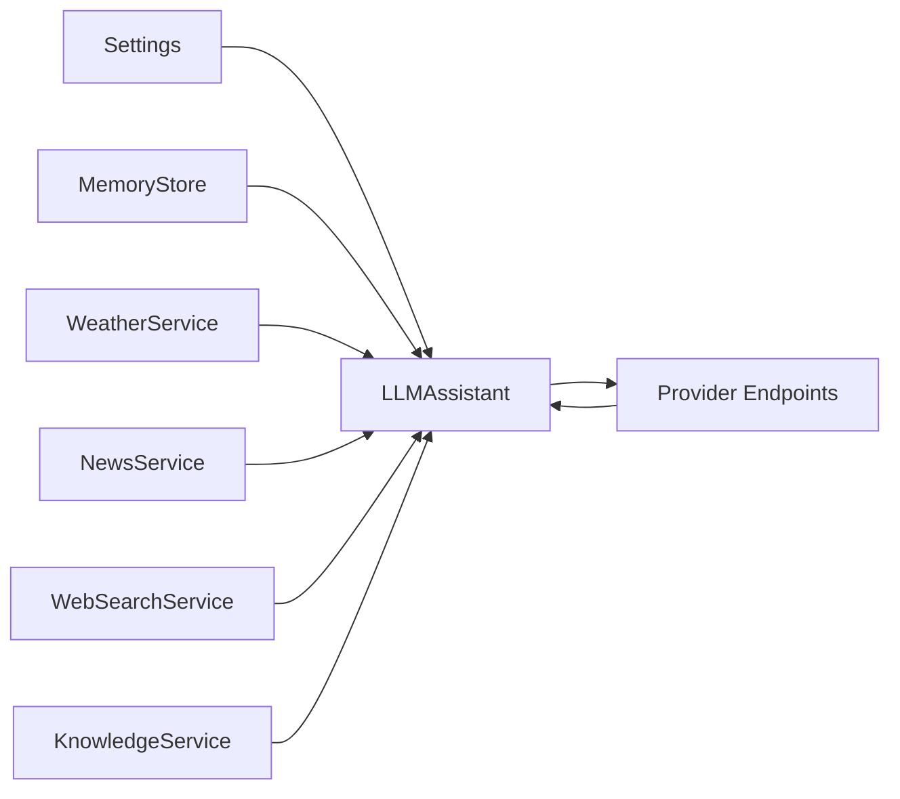

# LLM Integration Layer

<cite>
**Referenced Files in This Document**
- [llm_client.py](file://backend/api_clients/llm_client.py)
- [gemini_client.py](file://backend/api_clients/gemini_client.py)
- [config.py](file://backend/config.py)
- [orbit_brain.py](file://backend/core/orbit_brain.py)
- [memory_store.py](file://backend/core/memory_store.py)
- [weather.py](file://backend/tools/weather.py)
- [news.py](file://backend/tools/news.py)
- [web_search.py](file://backend/tools/web_search.py)
- [knowledge.py](file://backend/tools/knowledge.py)
- [server.py](file://backend/server.py)
- [run.py](file://run.py)
</cite>

## Table of Contents
1. [Introduction](#introduction)
2. [Project Structure](#project-structure)
3. [Core Components](#core-components)
4. [Architecture Overview](#architecture-overview)
5. [Detailed Component Analysis](#detailed-component-analysis)
6. [Dependency Analysis](#dependency-analysis)
7. [Performance Considerations](#performance-considerations)
8. [Troubleshooting Guide](#troubleshooting-guide)
9. [Conclusion](#conclusion)
10. [Appendices](#appendices)

## Introduction
This document explains the LLM integration layer that powers the assistant’s conversational AI, tool orchestration, and multimodal capabilities. It covers the multi-provider architecture, the client factory pattern, provider abstraction, tool calling mechanisms, and the LLMAssistant class. It also documents Google Gemini integration, API key management, model selection, response processing, provider switching logic, fallback strategies, error handling, configuration options, rate limiting considerations, and performance optimization techniques. Finally, it provides examples for extending support to additional LLM providers and implementing custom tool functions.

## Project Structure
The LLM integration layer is organized around a modular architecture:
- Provider clients encapsulate provider-specific logic and HTTP interactions.
- A unified assistant orchestrates conversations, manages tool calls, and handles multimodal inputs.
- A provider abstraction layer centralizes configuration and runtime selection.
- Tools implement external integrations (weather, news, web search, knowledge).
- Memory persistence and retrieval are handled by a MongoDB-backed store.
- An HTTP server exposes a REST API for chat, sessions, and tool endpoints.

**Diagram sources**
- [llm_client.py:38-366](file://backend/api_clients/llm_client.py#L38-L366)
- [gemini_client.py:36-207](file://backend/api_clients/gemini_client.py#L36-L207)
- [config.py:20-76](file://backend/config.py#L20-L76)
- [orbit_brain.py:302-501](file://backend/core/orbit_brain.py#L302-L501)
- [memory_store.py:67-150](file://backend/core/memory_store.py#L67-L150)
- [weather.py:47-141](file://backend/tools/weather.py#L47-L141)
- [news.py:21-83](file://backend/tools/news.py#L21-L83)
- [web_search.py:53-139](file://backend/tools/web_search.py#L53-L139)
- [knowledge.py:88-393](file://backend/tools/knowledge.py#L88-L393)
- [server.py:23-63](file://backend/server.py#L23-L63)

**Section sources**
- [llm_client.py:1-366](file://backend/api_clients/llm_client.py#L1-L366)
- [config.py:1-76](file://backend/config.py#L1-L76)
- [server.py:1-611](file://backend/server.py#L1-L611)

## Core Components
- LLMAssistant: Unified client that routes to provider-specific chat logic, manages tool orchestration, multimodal inputs, and conversation history. It supports Google REST API, OpenRouter-compatible APIs, and local providers (LM Studio, Ollama).
- GeminiAssistant: Legacy provider client for Google Gemini REST API, retained for backward compatibility.
- Settings: Centralized configuration for provider selection, API keys, model names, and URLs.
- OrbitBrain: Provides system instruction construction, tool declaration, and tool execution orchestration.
- MemoryStore: Persistent memory backed by MongoDB, exposing a stable interface for tasks, notes, weather/news cache, sessions, messages, and knowledge chunks.
- Tools: Weather, News, WebSearch, and Knowledge services integrate external data and search capabilities.
- AssistantApplication: HTTP server that wires the assistant, tools, and memory store behind REST endpoints.

**Section sources**
- [llm_client.py:38-366](file://backend/api_clients/llm_client.py#L38-L366)
- [gemini_client.py:36-207](file://backend/api_clients/gemini_client.py#L36-L207)
- [config.py:20-76](file://backend/config.py#L20-L76)
- [orbit_brain.py:302-501](file://backend/core/orbit_brain.py#L302-L501)
- [memory_store.py:67-150](file://backend/core/memory_store.py#L67-L150)
- [server.py:23-63](file://backend/server.py#L23-L63)

## Architecture Overview
The assistant supports multiple LLM providers through a single entry point. At runtime, the active provider determines the chat flow and payload format. The system builds a system instruction tailored to the selected mode and context, augments it with tool declarations, and executes tool calls until the LLM produces a final text response.

**Diagram sources**
- [server.py:276-321](file://backend/server.py#L276-L321)
- [llm_client.py:47-78](file://backend/api_clients/llm_client.py#L47-L78)
- [llm_client.py:82-216](file://backend/api_clients/llm_client.py#L82-L216)
- [llm_client.py:220-272](file://backend/api_clients/llm_client.py#L220-L272)
- [orbit_brain.py:302-501](file://backend/core/orbit_brain.py#L302-L501)

## Detailed Component Analysis

### LLMAssistant: Multi-Provider Orchestration
- Responsibilities:
  - Provider routing based on active provider.
  - Conversation history shaping and multimodal input assembly.
  - Tool orchestration loop with retries and limits.
  - System instruction composition and tool declaration filtering.
- Key methods:
  - chat: Entry point that selects provider logic and returns AssistantResult.
  - _chat_openrouter: Handles OpenRouter-compatible providers and local providers (LM Studio, Ollama).
  - _chat_google: Handles Google REST API.
  - Payload builders and response extractors for each provider.
- Tool loop:
  - Iteratively invokes tools when the provider returns tool calls.
  - Aggregates tool events and appends tool responses to the conversation.
  - Enforces a maximum iteration limit to prevent infinite loops.

**Diagram sources**
- [llm_client.py:47-78](file://backend/api_clients/llm_client.py#L47-L78)
- [llm_client.py:82-216](file://backend/api_clients/llm_client.py#L82-L216)
- [llm_client.py:220-272](file://backend/api_clients/llm_client.py#L220-L272)

**Section sources**
- [llm_client.py:38-366](file://backend/api_clients/llm_client.py#L38-L366)

### Provider Abstraction and Configuration
- Settings:
  - active_provider: Chooses among google, openrouter, lm_studio, ollama.
  - current_api_key: Dynamically resolves the active key based on provider.
  - ai_model: Model identifier used for provider endpoints.
  - Provider-specific URLs and ports for local providers.
- Provider selection logic:
  - Runtime switch in the server CLI allows choosing provider and model.
  - The assistant reads settings to route requests accordingly.

**Diagram sources**
- [config.py:20-76](file://backend/config.py#L20-L76)
- [llm_client.py:38-78](file://backend/api_clients/llm_client.py#L38-L78)

**Section sources**
- [config.py:20-76](file://backend/config.py#L20-L76)
- [server.py:566-611](file://backend/server.py#L566-L611)

### Tool Calling Mechanisms
- Tool declarations:
  - Built centrally with build_rest_tools, enabling/disabling tools based on mode and availability.
- Tool execution:
  - run_tool_call dispatches to specific services (weather, news, memory, tasks, notes, web search, knowledge).
  - Returns a standardized ToolRunResult with event metadata and function response payload.
- Tool orchestration:
  - The assistant appends tool results back into the conversation and continues until a final text response is produced.

**Diagram sources**
- [orbit_brain.py:361-387](file://backend/core/orbit_brain.py#L361-L387)
- [orbit_brain.py:389-501](file://backend/core/orbit_brain.py#L389-L501)
- [llm_client.py:185-214](file://backend/api_clients/llm_client.py#L185-L214)

**Section sources**
- [orbit_brain.py:302-501](file://backend/core/orbit_brain.py#L302-L501)
- [llm_client.py:185-214](file://backend/api_clients/llm_client.py#L185-L214)

### Google Gemini Integration (Legacy)
- GeminiAssistant provides a dedicated client for Google Gemini REST API.
- Features:
  - Validates API key presence.
  - Builds multimodal content including inline images.
  - Executes tool loop with function calls and function responses.
  - Extracts final text or block reasons from responses.
- Limitations:
  - Uses a separate class; prefer LLMAssistant for new integrations.

**Diagram sources**
- [gemini_client.py:43-94](file://backend/api_clients/gemini_client.py#L43-L94)
- [gemini_client.py:132-162](file://backend/api_clients/gemini_client.py#L132-L162)
- [gemini_client.py:170-207](file://backend/api_clients/gemini_client.py#L170-L207)

**Section sources**
- [gemini_client.py:36-207](file://backend/api_clients/gemini_client.py#L36-L207)

### Conversation Management and Multimodal Inputs
- Conversation management:
  - Maintains a sliding window of recent messages.
  - Normalizes roles and filters empty entries.
- Multimodal inputs:
  - Supports base64-encoded images appended as inlineData for Google REST API.
  - Supports mixed content arrays for OpenRouter-compatible providers.

**Diagram sources**
- [llm_client.py:274-291](file://backend/api_clients/llm_client.py#L274-L291)
- [llm_client.py:97-102](file://backend/api_clients/llm_client.py#L97-L102)
- [gemini_client.py:96-114](file://backend/api_clients/gemini_client.py#L96-L114)
- [gemini_client.py:116-130](file://backend/api_clients/gemini_client.py#L116-L130)

**Section sources**
- [llm_client.py:274-291](file://backend/api_clients/llm_client.py#L274-L291)
- [gemini_client.py:96-130](file://backend/api_clients/gemini_client.py#L96-L130)

### Provider Switching Logic and Fallbacks
- Provider selection:
  - LLMAssistant routes to _chat_openrouter for openrouter, lm_studio, ollama.
  - Routes to _chat_google for google.
- Fallbacks:
  - OpenRouter flow checks for moderation errors and returns a safety message.
  - GeminiAssistant raises explicit errors for missing keys and loop limits.
- Graceful degradation:
  - Offline mode disables web search tools.
  - Web search only mode biases toward web search while keeping local tools available.

**Diagram sources**
- [llm_client.py:74-78](file://backend/api_clients/llm_client.py#L74-L78)
- [llm_client.py:164-174](file://backend/api_clients/llm_client.py#L164-L174)
- [llm_client.py:94-96](file://backend/api_clients/llm_client.py#L94-L96)

**Section sources**
- [llm_client.py:74-78](file://backend/api_clients/llm_client.py#L74-L78)
- [llm_client.py:164-174](file://backend/api_clients/llm_client.py#L164-L174)

### Error Handling Strategies
- API errors:
  - Catches HTTPError and URLError, extracts details, and raises provider-specific client errors.
- Tool errors:
  - run_tool_call wraps exceptions into ToolRunResult with error events.
- Validation:
  - Ensures non-empty messages and validates tool call names.
- Client-side safeguards:
  - Loop limits prevent infinite tool invocation.
  - Moderation checks return safety messages for OpenRouter.

**Section sources**
- [llm_client.py:158-174](file://backend/api_clients/llm_client.py#L158-L174)
- [llm_client.py:316-323](file://backend/api_clients/llm_client.py#L316-L323)
- [gemini_client.py:154-161](file://backend/api_clients/gemini_client.py#L154-L161)
- [orbit_brain.py:488-493](file://backend/core/orbit_brain.py#L488-L493)

### Configuration Options
- Environment-driven settings:
  - ACTIVE_PROVIDER, GOOGLE_API_KEY, OPENROUTER_API_KEY, AI_MODEL, ASSISTANT_PORT, DEFAULT_LOCATION, LIVE_VOICE_NAME, RAG_DOCS_PATH, LM_STUDIO_URL, OLLAMA_URL, MONGODB_URI, MONGODB_DB.
- Runtime provider selection:
  - Interactive CLI allows choosing provider and model at startup.
- Tool availability:
  - Web search only, offline mode, and session docs toggles influence tool declarations.

**Section sources**
- [config.py:55-76](file://backend/config.py#L55-L76)
- [server.py:566-611](file://backend/server.py#L566-L611)
- [orbit_brain.py:361-387](file://backend/core/orbit_brain.py#L361-L387)

### Rate Limiting and Performance Considerations
- Timeouts:
  - HTTP requests use timeouts to avoid hanging on slow providers.
- Loop limits:
  - Both provider flows enforce maximum iterations to bound latency.
- Tool efficiency:
  - Anti-hallucination rules and multi-tasking reminders guide the LLM to use tools effectively.
- Local RAG:
  - LM Studio embeddings and FAISS indices improve local search performance when available.
- Concurrency:
  - MemoryStore operations are guarded by locks to ensure thread-safe persistence.

**Section sources**
- [llm_client.py:158-174](file://backend/api_clients/llm_client.py#L158-L174)
- [llm_client.py:316-323](file://backend/api_clients/llm_client.py#L316-L323)
- [knowledge.py:231-264](file://backend/tools/knowledge.py#L231-L264)
- [memory_store.py:84-99](file://backend/core/memory_store.py#L84-L99)

### Extending Support for Additional LLM Providers
To add a new provider:
1. Define provider constants and endpoints in the provider-specific chat method (e.g., add a new branch in LLMAssistant.chat and implement a _chat_<provider> method).
2. Build provider-specific payloads and headers.
3. Implement response extraction and tool-call parsing.
4. Integrate tool orchestration and append tool results back into the conversation.
5. Update Settings to include provider-specific keys and URLs.
6. Wire the new provider in the server CLI or configuration.

Example extension points:
- Add a new provider branch in [llm_client.py:74-78](file://backend/api_clients/llm_client.py#L74-L78).
- Implement a new _chat_* method mirroring existing flows in [llm_client.py:82-216](file://backend/api_clients/llm_client.py#L82-L216).

**Section sources**
- [llm_client.py:74-78](file://backend/api_clients/llm_client.py#L74-L78)
- [llm_client.py:82-216](file://backend/api_clients/llm_client.py#L82-L216)

### Implementing Custom Tool Functions
To add a new tool:
1. Extend the function declaration list in OrbitBrain.
2. Implement the tool execution logic in run_tool_call.
3. Optionally persist results to MemoryStore and emit events.
4. Ensure the tool is included in build_rest_tools under the desired conditions (e.g., offline mode, web search only, session docs).

Reference locations:
- Function declarations: [orbit_brain.py:74-268](file://backend/core/orbit_brain.py#L74-L268)
- Tool execution dispatcher: [orbit_brain.py:389-501](file://backend/core/orbit_brain.py#L389-L501)
- Tool declaration builder: [orbit_brain.py:361-387](file://backend/core/orbit_brain.py#L361-L387)

**Section sources**
- [orbit_brain.py:74-268](file://backend/core/orbit_brain.py#L74-L268)
- [orbit_brain.py:361-387](file://backend/core/orbit_brain.py#L361-L387)
- [orbit_brain.py:389-501](file://backend/core/orbit_brain.py#L389-L501)

## Dependency Analysis
The integration layer exhibits low coupling and high cohesion:
- LLMAssistant depends on Settings, MemoryStore, and tool services.
- OrbitBrain centralizes tool definitions and orchestration.
- Tools are independent and interchangeable.
- MemoryStore abstracts persistence and provides a stable interface.

**Diagram sources**
- [llm_client.py:38-46](file://backend/api_clients/llm_client.py#L38-L46)
- [config.py:20-76](file://backend/config.py#L20-L76)
- [server.py:23-63](file://backend/server.py#L23-L63)

**Section sources**
- [llm_client.py:38-46](file://backend/api_clients/llm_client.py#L38-L46)
- [server.py:23-63](file://backend/server.py#L23-L63)

## Performance Considerations
- Use provider-specific timeouts and enforce loop limits to bound latency.
- Prefer local providers (LM Studio, Ollama) for reduced network latency when available.
- Enable embeddings and FAISS indices for faster local RAG when documents are present.
- Minimize conversation window size to reduce payload sizes.
- Cache recent weather and news results to avoid repeated external calls.

[No sources needed since this section provides general guidance]

## Troubleshooting Guide
Common issues and resolutions:
- Missing API key:
  - Ensure ACTIVE_PROVIDER and corresponding API key are configured.
  - GeminiAssistant explicitly raises an error if the key is missing.
- Provider unreachable:
  - Check network connectivity and endpoint URLs.
  - Review HTTPError/URLError details and adjust timeouts.
- Tool loop limit exceeded:
  - Verify tool correctness and reduce redundant tool calls.
  - Consider increasing the loop limit cautiously.
- Moderation errors (OpenRouter):
  - The assistant returns a safety message; review content policy.
- MongoDB connection failures:
  - Confirm MongoDB URI and credentials; ensure the server is reachable.

**Section sources**
- [gemini_client.py:53-56](file://backend/api_clients/gemini_client.py#L53-L56)
- [llm_client.py:164-174](file://backend/api_clients/llm_client.py#L164-L174)
- [memory_store.py:86-99](file://backend/core/memory_store.py#L86-L99)

## Conclusion
The LLM integration layer provides a robust, extensible foundation for multi-provider LLM interactions. Through a unified assistant, centralized configuration, and a powerful tool orchestration system, it supports diverse providers, multimodal inputs, and advanced search capabilities. The design emphasizes modularity, safety, and performance, enabling straightforward extensions and maintenance.

[No sources needed since this section summarizes without analyzing specific files]

## Appendices

### API Endpoints Overview
- GET /api/state: Returns provider, model, default location, voice name, memory, history, and sessions.
- POST /api/chat: Sends a message with optional conversation, screen image, mode, and search toggles; returns reply, tool events, memory snapshot, and model.
- Session endpoints: Create, update, list, and delete sessions; manage messages and attachments.
- Tool endpoints: Weather, news, tasks, notes, and profile updates.

**Section sources**
- [server.py:85-168](file://backend/server.py#L85-L168)
- [server.py:169-266](file://backend/server.py#L169-L266)
- [server.py:267-501](file://backend/server.py#L267-L501)