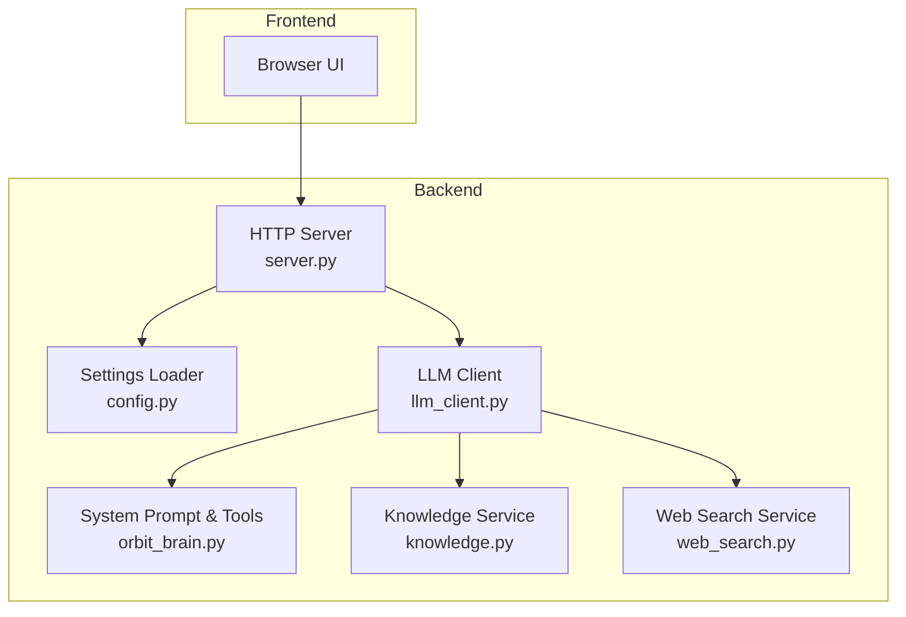
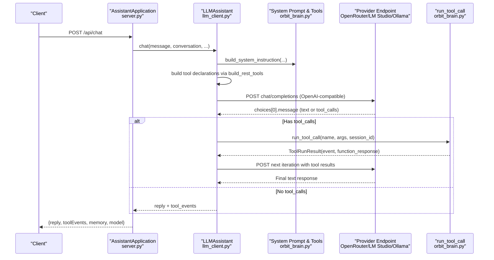
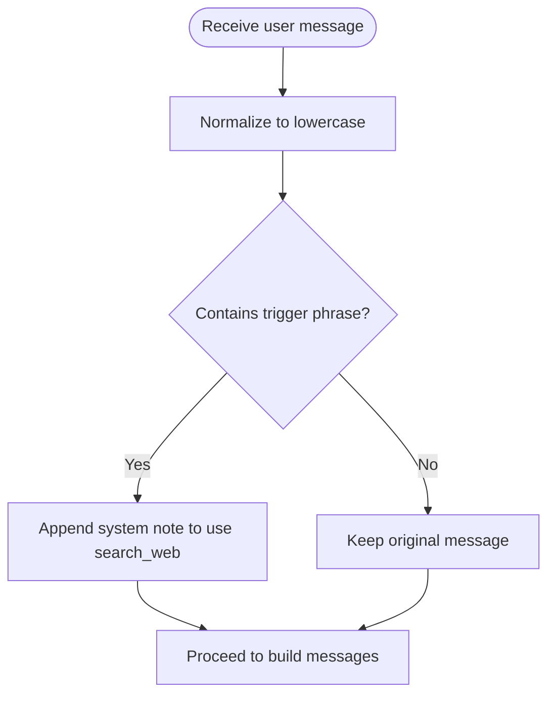
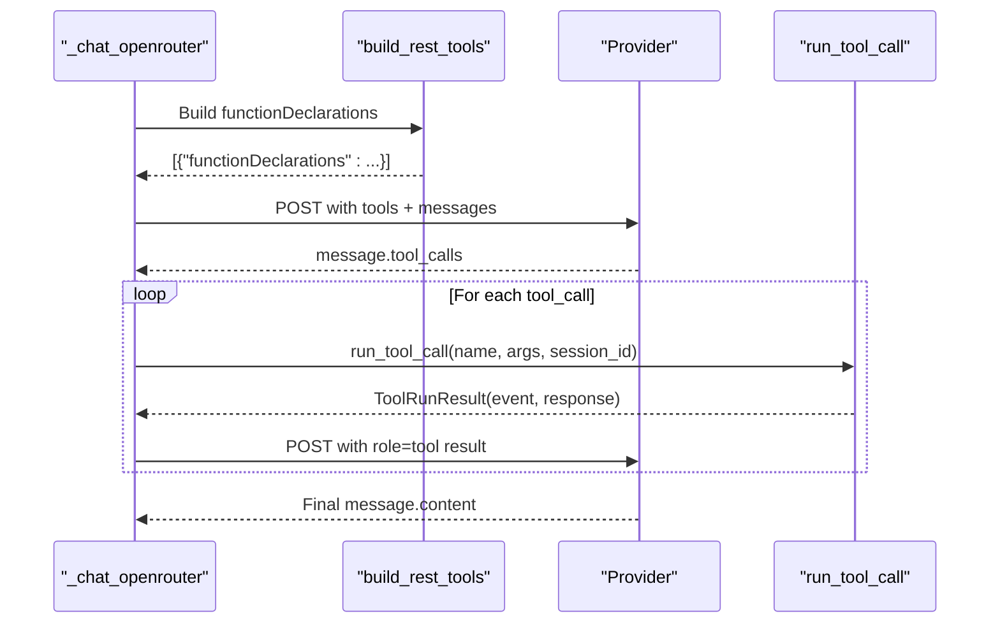
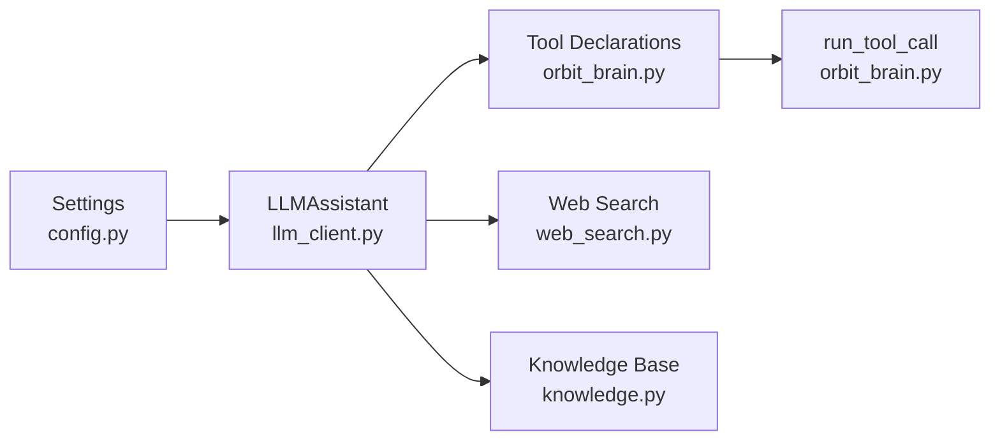

# OpenRouter and OpenAI-Compatible Providers

<cite>
**Referenced Files in This Document**
- [llm_client.py](file://backend/api_clients/llm_client.py)
- [config.py](file://backend/config.py)
- [orbit_brain.py](file://backend/core/orbit_brain.py)
- [server.py](file://backend/server.py)
- [web_search.py](file://backend/tools/web_search.py)
- [knowledge.py](file://backend/tools/knowledge.py)
- [README.md](file://README.md)
- [requirements.txt](file://requirements.txt)
</cite>

## Table of Contents
1. [Introduction](#introduction)
2. [Project Structure](#project-structure)
3. [Core Components](#core-components)
4. [Architecture Overview](#architecture-overview)
5. [Detailed Component Analysis](#detailed-component-analysis)
6. [Dependency Analysis](#dependency-analysis)
7. [Performance Considerations](#performance-considerations)
8. [Troubleshooting Guide](#troubleshooting-guide)
9. [Conclusion](#conclusion)
10. [Appendices](#appendices)

## Introduction
This document explains the OpenRouter and OpenAI-compatible provider integration, focusing on the _chat_openrouter method implementation. It covers:
- OpenRouter API endpoint configuration and authentication headers
- Model compatibility handling across providers
- Trigger phrase detection for factual queries that automatically enables web search tools
- Tool function declaration and tool call execution flow
- Response processing for OpenAI-compatible APIs
- Provider-specific configurations for LM Studio and Ollama local deployments
- Examples of API endpoint routing, header management, and tool orchestration patterns

## Project Structure
The assistant routes chat requests through a server endpoint that delegates to a provider-agnostic client. The OpenRouter/OpenAI-compatible logic resides in the LLM client, which builds messages, declares tools, executes tool calls, and processes provider responses.

**Diagram sources**
- [server.py:276-321](file://backend/server.py#L276-L321)
- [llm_client.py:38-78](file://backend/api_clients/llm_client.py#L38-L78)
- [config.py:55-76](file://backend/config.py#L55-L76)
- [orbit_brain.py:302-387](file://backend/core/orbit_brain.py#L302-L387)
- [knowledge.py:88-138](file://backend/tools/knowledge.py#L88-L138)
- [web_search.py:53-104](file://backend/tools/web_search.py#L53-L104)

**Section sources**
- [README.md:164-201](file://README.md#L164-L201)
- [server.py:276-321](file://backend/server.py#L276-L321)

## Core Components
- LLMAssistant: Orchestrates chat across providers. It selects the OpenRouter path for openrouter, lm_studio, and ollama, and falls back to Google otherwise.
- _chat_openrouter: Implements OpenAI-compatible chat with tool calling, trigger phrase detection, and iterative tool loop handling.
- Settings: Loads provider selection, API keys, and provider-specific URLs/models from environment variables.
- Tool Orchestration: build_rest_tools declares function tools; run_tool_call executes them and records events.

**Section sources**
- [llm_client.py:38-78](file://backend/api_clients/llm_client.py#L38-L78)
- [llm_client.py:82-216](file://backend/api_clients/llm_client.py#L82-L216)
- [config.py:20-76](file://backend/config.py#L20-L76)
- [orbit_brain.py:361-387](file://backend/core/orbit_brain.py#L361-L387)
- [orbit_brain.py:389-502](file://backend/core/orbit_brain.py#L389-L502)

## Architecture Overview
The OpenRouter-compatible flow integrates with the broader assistant architecture. The server endpoint receives chat requests, constructs the assistant request, and delegates to LLMAssistant. The assistant builds system instructions, declares tools, sends requests to the selected provider, and executes tool calls until a final text response is produced.

**Diagram sources**
- [server.py:276-321](file://backend/server.py#L276-L321)
- [llm_client.py:82-216](file://backend/api_clients/llm_client.py#L82-L216)
- [orbit_brain.py:361-387](file://backend/core/orbit_brain.py#L361-L387)
- [orbit_brain.py:389-502](file://backend/core/orbit_brain.py#L389-L502)

## Detailed Component Analysis

### OpenRouter and OpenAI-Compatible Provider Routing
- Provider selection: The assistant routes to _chat_openrouter when active_provider is openrouter, lm_studio, or ollama.
- Endpoint resolution:
  - OpenRouter: Fixed endpoint for OpenAI-compatible completions.
  - LM Studio: Resolved from LM_STUDIO_URL with /chat/completions.
  - Ollama: Resolved from OLLAMA_URL with /v1/chat/completions.
- Authentication:
  - OpenRouter: Authorization Bearer header using OPENROUTER_API_KEY.
  - LM Studio/Ollama: No API key required; Content-Type is set for JSON.

**Section sources**
- [llm_client.py:74-78](file://backend/api_clients/llm_client.py#L74-L78)
- [llm_client.py:136-149](file://backend/api_clients/llm_client.py#L136-L149)
- [config.py:63-72](file://backend/config.py#L63-L72)

### Trigger Phrase Detection for Factual Queries
- Trigger phrases: The assistant checks the user message for factual-query keywords.
- Behavior: If matched, it appends a system note instructing the model to use the web search tool before answering.

**Diagram sources**
- [llm_client.py:84-87](file://backend/api_clients/llm_client.py#L84-L87)

**Section sources**
- [llm_client.py:84-87](file://backend/api_clients/llm_client.py#L84-L87)

### Tool Function Declaration and Tool Call Execution Flow
- Tool declarations:
  - build_rest_tools generates functionDeclarations based on capabilities (knowledge, web_search_only, offline_mode, session docs).
  - The assistant converts functionDeclarations to OpenAI-style tools for OpenRouter/LM Studio/Ollama.
- Tool execution:
  - run_tool_call dispatches to concrete services (weather, news, knowledge, web search) and records events.
  - The assistant appends tool results back into the conversation as role=tool entries.

**Diagram sources**
- [llm_client.py:109-116](file://backend/api_clients/llm_client.py#L109-L116)
- [llm_client.py:185-213](file://backend/api_clients/llm_client.py#L185-L213)
- [orbit_brain.py:361-387](file://backend/core/orbit_brain.py#L361-L387)
- [orbit_brain.py:389-502](file://backend/core/orbit_brain.py#L389-L502)

**Section sources**
- [llm_client.py:109-116](file://backend/api_clients/llm_client.py#L109-L116)
- [llm_client.py:185-213](file://backend/api_clients/llm_client.py#L185-L213)
- [orbit_brain.py:361-387](file://backend/core/orbit_brain.py#L361-L387)
- [orbit_brain.py:389-502](file://backend/core/orbit_brain.py#L389-L502)

### Response Processing for OpenAI-Compatible APIs
- Choice extraction: The assistant reads the first choice’s message.
- Tool-call presence: If tool_calls exist, it executes them and continues until a final text response is produced.
- Moderation handling: On 403 with moderation flags, it returns a safety message instead of raising.

**Section sources**
- [llm_client.py:176-181](file://backend/api_clients/llm_client.py#L176-L181)
- [llm_client.py:164-174](file://backend/api_clients/llm_client.py#L164-L174)

### Provider-Specific Configurations for LM Studio and Ollama
- LM Studio:
  - Base URL configured via LM_STUDIO_URL; model via LM_STUDIO_MODEL.
  - Embeddings for RAG connect to LM Studio using an OpenAI-compatible base URL and a placeholder API key.
- Ollama:
  - Base URL configured via OLLAMA_URL; model via OLLAMA_MODEL.
  - The assistant resolves the /v1/chat/completions endpoint for OpenAI compatibility.

**Section sources**
- [config.py:71-72](file://backend/config.py#L71-L72)
- [knowledge.py:122-137](file://backend/tools/knowledge.py#L122-L137)
- [llm_client.py:136-141](file://backend/api_clients/llm_client.py#L136-L141)

### API Endpoint Routing and Header Management
- Server endpoint: POST /api/chat delegates to LLMAssistant.chat with mode, language, web search toggles, offline mode, and session_id.
- Headers:
  - OpenRouter: Content-Type and Authorization Bearer.
  - LM Studio/Ollama: Content-Type only.
- Payload composition: Includes model, messages, tools, and temperature.

**Section sources**
- [server.py:276-321](file://backend/server.py#L276-L321)
- [llm_client.py:129-156](file://backend/api_clients/llm_client.py#L129-L156)

### Tool Orchestration Patterns Across Providers
- Capability gating: build_rest_tools conditionally includes search_web, search_local_docs, and search_session_docs depending on mode and session attachments.
- Event recording: run_tool_call returns ToolRunResult with event metadata for UI and analytics.
- Web search fallback: WebSearchService tries Tavily first, then DuckDuckGo if Tavily is unavailable.

**Section sources**
- [orbit_brain.py:361-387](file://backend/core/orbit_brain.py#L361-L387)
- [orbit_brain.py:389-502](file://backend/core/orbit_brain.py#L389-L502)
- [web_search.py:69-104](file://backend/tools/web_search.py#L69-L104)

## Dependency Analysis
- Provider selection depends on Settings.active_provider and Settings.current_api_key.
- Tool orchestration depends on orbit_brain for function declarations and run_tool_call.
- Web search and knowledge services are optional; their availability influences tool capability gating.

**Diagram sources**
- [config.py:20-76](file://backend/config.py#L20-L76)
- [llm_client.py:38-78](file://backend/api_clients/llm_client.py#L38-L78)
- [orbit_brain.py:361-387](file://backend/core/orbit_brain.py#L361-L387)
- [web_search.py:53-104](file://backend/tools/web_search.py#L53-L104)
- [knowledge.py:88-138](file://backend/tools/knowledge.py#L88-L138)

**Section sources**
- [config.py:20-76](file://backend/config.py#L20-L76)
- [llm_client.py:38-78](file://backend/api_clients/llm_client.py#L38-L78)
- [orbit_brain.py:361-387](file://backend/core/orbit_brain.py#L361-L387)

## Performance Considerations
- Loop limit: The assistant enforces a maximum iteration count to prevent infinite tool loops.
- Temperature tuning: The assistant sets a moderate temperature for balanced creativity and focus.
- Tool batching: The system prompt encourages the model to execute multiple tools when needed, reducing repeated round trips.

**Section sources**
- [llm_client.py:128-128](file://backend/api_clients/llm_client.py#L128-L128)
- [llm_client.py:133-133](file://backend/api_clients/llm_client.py#L133-L133)
- [llm_client.py:118-126](file://backend/api_clients/llm_client.py#L118-L126)

## Troubleshooting Guide
- Provider errors:
  - OpenRouter 403 with moderation: Returns a safety message instead of propagating the error.
  - URLError/HTTPError: Propagated as LLMClientError with details.
- Missing API key:
  - Raises an explicit error if the current provider’s API key is not set.
- Tool execution failures:
  - run_tool_call catches known exceptions and returns error events.

**Section sources**
- [llm_client.py:60-61](file://backend/api_clients/llm_client.py#L60-L61)
- [llm_client.py:164-174](file://backend/api_clients/llm_client.py#L164-L174)
- [orbit_brain.py:490-493](file://backend/core/orbit_brain.py#L490-L493)

## Conclusion
The OpenRouter and OpenAI-compatible provider integration centers on a robust, iterative tool-calling loop that adapts to provider capabilities. The assistant:
- Detects factual queries and injects web search guidance
- Declares tools conditionally based on mode and session context
- Executes tools and aggregates results until a final response is produced
- Manages provider-specific endpoints and headers while maintaining a consistent API surface

## Appendices

### Provider Configuration Reference
- OpenRouter
  - Endpoint: OpenAI-compatible completions
  - Headers: Content-Type, Authorization Bearer
- LM Studio
  - Endpoint: {LM_STUDIO_URL}/chat/completions
  - Headers: Content-Type
- Ollama
  - Endpoint: {OLLAMA_URL}/v1/chat/completions
  - Headers: Content-Type

**Section sources**
- [llm_client.py:142-149](file://backend/api_clients/llm_client.py#L142-L149)
- [config.py:71-72](file://backend/config.py#L71-L72)

### Tool Capabilities Matrix
- search_web: Enabled unless offline_mode; bias towards web when web_search_only is true
- search_local_docs: Enabled when knowledge base is available
- search_session_docs: Enabled when session has attachments

**Section sources**
- [orbit_brain.py:361-387](file://backend/core/orbit_brain.py#L361-L387)