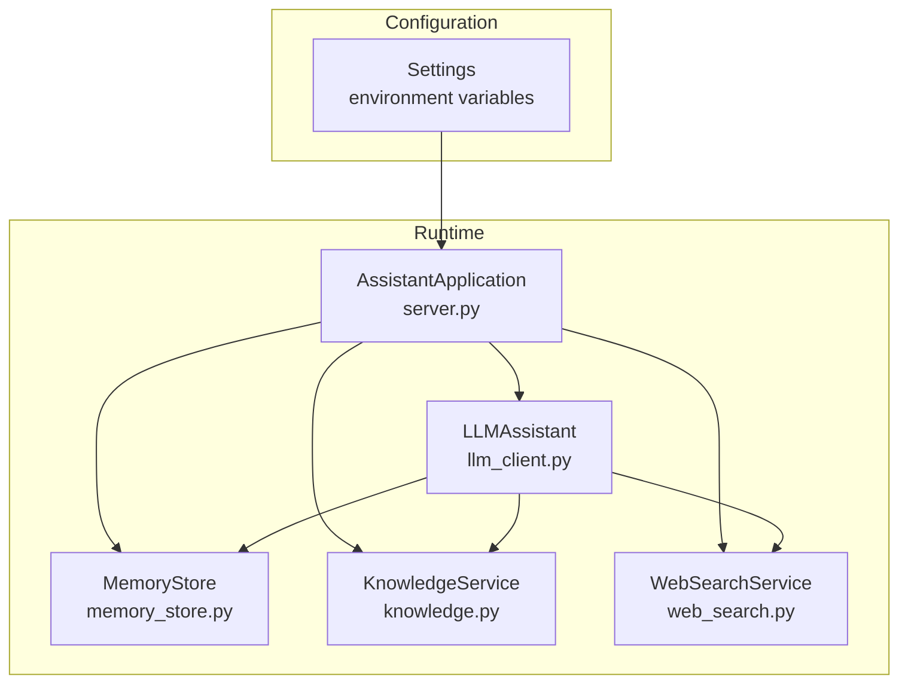
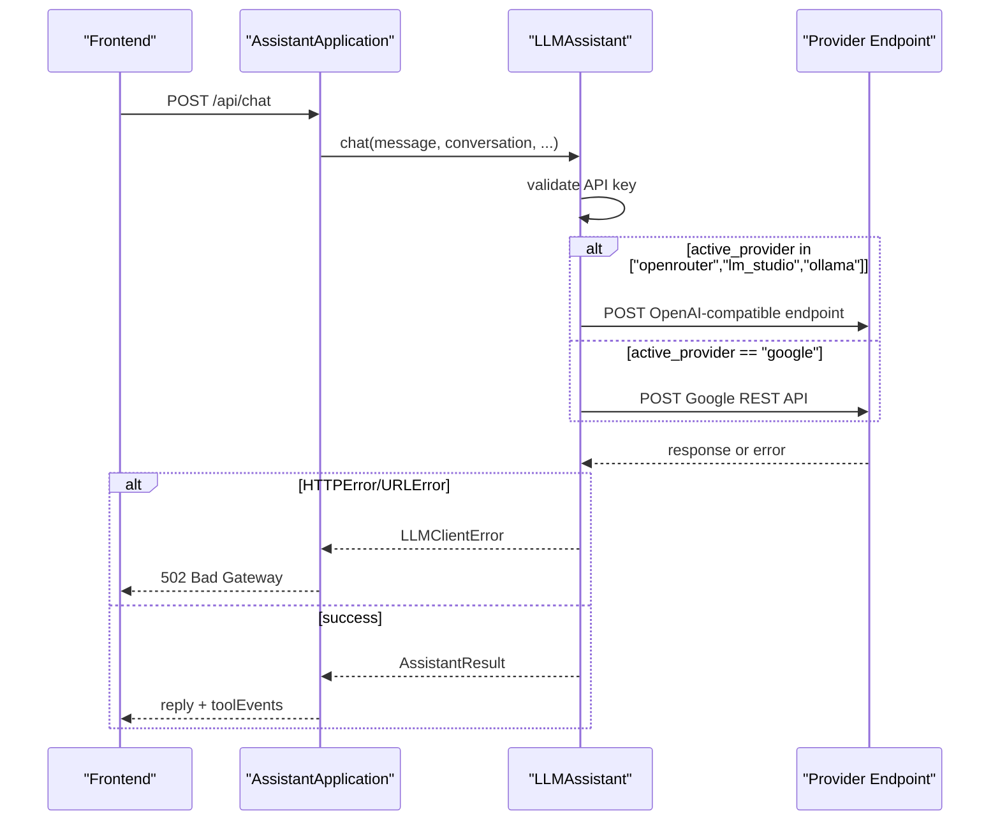
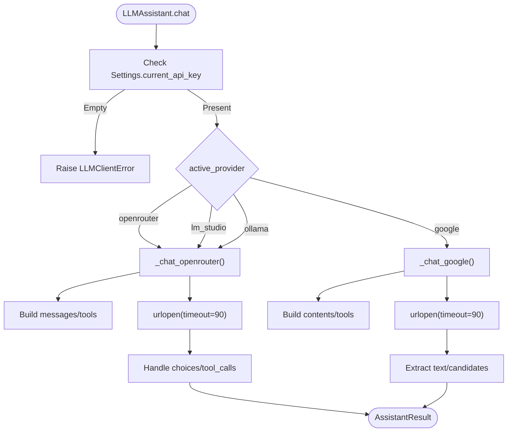
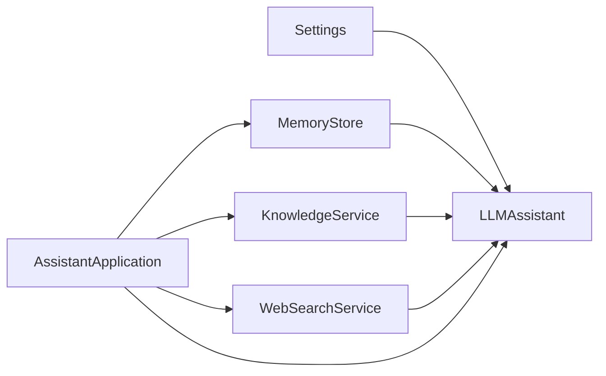

# Provider Configuration and Settings Management

<cite>
**Referenced Files in This Document**
- [config.py](file://backend/config.py)
- [llm_client.py](file://backend/api_clients/llm_client.py)
- [server.py](file://backend/server.py)
- [memory_store.py](file://backend/core/memory_store.py)
- [orbit_brain.py](file://backend/core/orbit_brain.py)
- [knowledge.py](file://backend/tools/knowledge.py)
- [web_search.py](file://backend/tools/web_search.py)
- [run.py](file://run.py)
</cite>

## Table of Contents
1. [Introduction](#introduction)
2. [Project Structure](#project-structure)
3. [Core Components](#core-components)
4. [Architecture Overview](#architecture-overview)
5. [Detailed Component Analysis](#detailed-component-analysis)
6. [Dependency Analysis](#dependency-analysis)
7. [Performance Considerations](#performance-considerations)
8. [Troubleshooting Guide](#troubleshooting-guide)
9. [Conclusion](#conclusion)

## Introduction
This document explains how the assistant selects and configures an LLM provider at runtime, manages API keys and model settings, constructs provider endpoints, and handles timeouts, retries, and error recovery. It also covers configuration validation, provider switching, fallback mechanisms, and how Settings integrates with the rest of the system to influence tool availability and behavior.

## Project Structure
The configuration and provider management spans several modules:
- Settings encapsulates environment-driven configuration and provider selection.
- LLMAssistant routes chat requests to provider-specific implementations.
- MemoryStore persists state and influences tool availability.
- KnowledgeService enables RAG and provider-specific embedding initialization.
- WebSearchService provides web search fallbacks.
- server orchestrates runtime provider selection and exposes state to the UI.

**Diagram sources**
- [config.py:55-76](file://backend/config.py#L55-L76)
- [server.py:23-63](file://backend/server.py#L23-L63)
- [llm_client.py:38-46](file://backend/api_clients/llm_client.py#L38-L46)
- [memory_store.py:67-117](file://backend/core/memory_store.py#L67-L117)
- [knowledge.py:88-140](file://backend/tools/knowledge.py#L88-L140)
- [web_search.py:53-104](file://backend/tools/web_search.py#L53-L104)

**Section sources**
- [config.py:20-76](file://backend/config.py#L20-L76)
- [server.py:566-611](file://backend/server.py#L566-L611)

## Core Components
- Settings: Loads environment variables, normalizes provider selection, and exposes provider name, current API key, and model/endpoint URLs.
- LLMAssistant: Chooses provider implementation based on active_provider, builds payloads, and handles provider-specific endpoints and error handling.
- AssistantApplication: Initializes services, constructs LLMAssistant, and exposes provider/model state to the UI.
- MemoryStore: Provides tool availability signals (e.g., whether knowledge is available) and persists chat history.
- KnowledgeService: Enables RAG and initializes LM Studio embeddings when docs_dir is provided.
- WebSearchService: Provides web search fallbacks and graceful degradation.

**Section sources**
- [config.py:20-76](file://backend/config.py#L20-L76)
- [llm_client.py:38-366](file://backend/api_clients/llm_client.py#L38-L366)
- [server.py:23-63](file://backend/server.py#L23-L63)
- [memory_store.py:67-117](file://backend/core/memory_store.py#L67-L117)
- [knowledge.py:88-140](file://backend/tools/knowledge.py#L88-L140)
- [web_search.py:53-104](file://backend/tools/web_search.py#L53-L104)

## Architecture Overview
Provider detection and routing:
- Settings.active_provider determines which client path to take.
- For OpenRouter/LM Studio/Ollama, the client targets an OpenAI-compatible API with Authorization headers.
- For Google, the client targets the Google REST API with an API key header.
- Local providers (LM Studio/Ollama) use configurable base URLs from Settings.

Timeouts and error handling:
- HTTP requests use a 90-second timeout.
- HTTPError and URLError are caught and re-raised as LLMClientError with contextual messages.
- Moderation-related 403 responses are handled gracefully for OpenRouter.

Fallbacks and validation:
- Missing API keys raise explicit errors with guidance.
- Web search fallbacks are integrated via WebSearchService.
- RAG availability toggles tool visibility via build_rest_tools.

**Diagram sources**
- [server.py:276-321](file://backend/server.py#L276-L321)
- [llm_client.py:47-78](file://backend/api_clients/llm_client.py#L47-L78)
- [llm_client.py:151-175](file://backend/api_clients/llm_client.py#L151-L175)
- [llm_client.py:316-324](file://backend/api_clients/llm_client.py#L316-L324)

## Detailed Component Analysis

### Settings and Environment Configuration
- Loads .env via a helper that sets environment variables only if unset.
- Defines Settings with:
  - active_provider: selected provider name
  - provider_name property: human-readable name mapping
  - current_api_key property: resolves the appropriate API key based on active_provider
  - ai_model: model identifier
  - Provider-specific URLs: LM Studio and Ollama base URLs
  - MongoDB connection settings
- get_settings() reads environment variables with sensible defaults and returns a Settings instance.

Environment variables and defaults:
- ACTIVE_PROVIDER: default "google"
- GOOGLE_API_KEY: default empty
- OPENROUTER_API_KEY: default empty
- AI_MODEL: default "gemini-2.5-flash"
- ASSISTANT_PORT: default 8000
- LIVE_VOICE_NAME: default "Nanami"
- DEFAULT_LOCATION: default "Ho Chi Minh City"
- RAG_DOCS_PATH: default empty
- LM_STUDIO_URL: default "http://127.0.0.1:1234/v1"
- OLLAMA_URL: default "http://127.0.0.1:11434/v1"
- MONGODB_URI: default "mongodb://localhost:27017"
- MONGODB_DB: default "orbit_assistant"

Validation and provider mapping:
- provider_name maps "google"|"openrouter"|"lm_studio"|"ollama" to display names; defaults to "OpenRouter".
- current_api_key returns the active provider’s key or a sentinel for local providers.

**Section sources**
- [config.py:8-17](file://backend/config.py#L8-L17)
- [config.py:20-76](file://backend/config.py#L20-L76)

### Provider Detection and Routing
- LLMAssistant.chat() checks Settings.current_api_key and raises an error if missing.
- Routing:
  - If active_provider is "openrouter", "lm_studio", or "ollama", use _chat_openrouter().
  - Otherwise, use _chat_google().
- _chat_openrouter():
  - Builds messages and tools via build_rest_tools().
  - Determines endpoint based on active_provider and sets Authorization header for OpenRouter.
  - Uses 90-second timeout; handles 403 moderation errors specifically.
  - Iteratively executes tool calls until completion or loop limit.
- _chat_google():
  - Builds contents and tools; sends to Google REST API with x-goog-api-key header.
  - Uses 90-second timeout; translates errors to LLMClientError.

**Diagram sources**
- [llm_client.py:47-78](file://backend/api_clients/llm_client.py#L47-L78)
- [llm_client.py:82-216](file://backend/api_clients/llm_client.py#L82-L216)
- [llm_client.py:220-366](file://backend/api_clients/llm_client.py#L220-L366)

**Section sources**
- [llm_client.py:47-78](file://backend/api_clients/llm_client.py#L47-L78)
- [llm_client.py:82-216](file://backend/api_clients/llm_client.py#L82-L216)
- [llm_client.py:220-366](file://backend/api_clients/llm_client.py#L220-L366)

### API Key Management and Model Selection
- API key resolution:
  - current_api_key returns the key for the active provider or a sentinel for local providers.
  - Google REST API uses x-goog-api-key; OpenRouter uses Authorization Bearer header.
- Model selection:
  - ai_model is used by both provider implementations.
  - Runtime selection allows changing active_provider and model via server input prompts.

**Section sources**
- [config.py:48-52](file://backend/config.py#L48-L52)
- [llm_client.py:130-149](file://backend/api_clients/llm_client.py#L130-L149)
- [llm_client.py:294-305](file://backend/api_clients/llm_client.py#L294-L305)

### Endpoint URL Construction
- OpenRouter: fixed endpoint for OpenAI-compatible completions.
- LM Studio: base URL from Settings.lm_studio_url with "/chat/completions" suffix.
- Ollama: base URL from Settings.ollama_url with "/v1/chat/completions" suffix.
- Google: formatted endpoint using ai_model with Google REST API template.

**Section sources**
- [llm_client.py:24-25](file://backend/api_clients/llm_client.py#L24-L25)
- [llm_client.py:136-144](file://backend/api_clients/llm_client.py#L136-L144)
- [llm_client.py:294](file://backend/api_clients/llm_client.py#L294)

### Timeout Handling, Retry Mechanisms, and Error Recovery
- Timeouts:
  - Both provider implementations use urlopen with a 90-second timeout.
- Error handling:
  - HTTPError and URLError are caught and wrapped as LLMClientError with contextual details.
  - OpenRouter 403 with moderation flags is handled gracefully by returning a predefined message.
- Recovery:
  - WebSearchService provides fallbacks between Tavily and DuckDuckGo when available.
  - Missing API keys or invalid provider configurations are surfaced early with actionable errors.

**Section sources**
- [llm_client.py:158-175](file://backend/api_clients/llm_client.py#L158-L175)
- [llm_client.py:316-324](file://backend/api_clients/llm_client.py#L316-L324)
- [web_search.py:69-104](file://backend/tools/web_search.py#L69-L104)

### Configuration Validation and Provider Switching
- Validation:
  - Missing API key triggers LLMClientError with guidance to check .env.
  - MongoDB connection failure raises a clear RuntimeError during MemoryStore initialization.
- Provider switching:
  - At runtime, the server prompts the user to select a provider and rebuilds Settings with dataclasses.replace.
  - Model selection is adjusted per provider via environment overrides.
- RAG enablement:
  - Optional LM Studio-based RAG is enabled by specifying a knowledge base path at startup.

**Section sources**
- [llm_client.py:60-61](file://backend/api_clients/llm_client.py#L60-L61)
- [memory_store.py:86-98](file://backend/core/memory_store.py#L86-L98)
- [server.py:566-611](file://backend/server.py#L566-L611)

### Integration with Settings and Tool Availability
- build_rest_tools() decides which tools are available based on:
  - enable_knowledge: controlled by KnowledgeService presence and retriever readiness.
  - offline_mode: strips web search tools when true.
  - web_search_only: biases toward web search but still allows local knowledge.
  - enable_session_docs: includes session-scoped document search when attachments exist.
- AssistantApplication._state_payload() surfaces provider, model, and API key presence to the UI.

**Section sources**
- [orbit_brain.py:361-387](file://backend/core/orbit_brain.py#L361-L387)
- [server.py:506-520](file://backend/server.py#L506-L520)

### Examples and Usage Patterns
- Environment variable configuration:
  - ACTIVE_PROVIDER, GOOGLE_API_KEY, OPENROUTER_API_KEY, AI_MODEL, ASSISTANT_PORT, LIVE_VOICE_NAME, DEFAULT_LOCATION, RAG_DOCS_PATH, LM_STUDIO_URL, OLLAMA_URL, MONGODB_URI, MONGODB_DB.
- Provider-specific settings:
  - For LM Studio/Ollama, configure base URLs; for OpenRouter, set Authorization header via OPENROUTER_API_KEY.
- Runtime configuration changes:
  - At startup, the server prompts for provider selection and model override, then constructs AssistantApplication with updated Settings.

**Section sources**
- [config.py:59-75](file://backend/config.py#L59-L75)
- [server.py:581-590](file://backend/server.py#L581-L590)

## Dependency Analysis
- LLMAssistant depends on Settings for provider selection and endpoints, and on MemoryStore for tool execution context.
- AssistantApplication composes LLMAssistant, MemoryStore, KnowledgeService, and WebSearchService.
- KnowledgeService conditionally initializes LM Studio embeddings when docs_dir is provided.
- WebSearchService optionally uses Tavily and falls back to DuckDuckGo.

**Diagram sources**
- [llm_client.py:38-46](file://backend/api_clients/llm_client.py#L38-L46)
- [server.py:23-63](file://backend/server.py#L23-L63)
- [knowledge.py:88-140](file://backend/tools/knowledge.py#L88-L140)
- [web_search.py:53-104](file://backend/tools/web_search.py#L53-L104)

**Section sources**
- [llm_client.py:38-46](file://backend/api_clients/llm_client.py#L38-L46)
- [server.py:23-63](file://backend/server.py#L23-L63)

## Performance Considerations
- Timeouts: 90 seconds for both provider implementations prevent hanging requests.
- Tool loop limits: Both provider implementations enforce iteration caps to avoid infinite loops.
- Embedding initialization: LM Studio embeddings are attempted at startup; failures are logged and ignored to preserve functionality.
- Web search: Tavily is preferred when available; fallback to DuckDuckGo reduces latency on failures.

[No sources needed since this section provides general guidance]

## Troubleshooting Guide
Common issues and resolutions:
- Missing API key:
  - Symptom: LLMClientError indicating missing API key for the active provider.
  - Resolution: Set the appropriate environment variable (GOOGLE_API_KEY or OPENROUTER_API_KEY) or switch to a local provider.
- Provider unreachable:
  - Symptom: LLMClientError wrapping URLError with reason.
  - Resolution: Verify network connectivity and endpoint URLs; check local LLM server status.
- OpenRouter moderation 403:
  - Symptom: 403 error with moderation-related details.
  - Resolution: Adjust prompt or content; the client returns a predefined safety message.
- MongoDB connection failure:
  - Symptom: RuntimeError during MemoryStore initialization.
  - Resolution: Ensure MongoDB is running and reachable with the configured URI.
- Web search failures:
  - Symptom: WebSearchError when all providers fail.
  - Resolution: Verify API keys and network; the service falls back between providers automatically.

**Section sources**
- [llm_client.py:60-61](file://backend/api_clients/llm_client.py#L60-L61)
- [llm_client.py:161-175](file://backend/api_clients/llm_client.py#L161-L175)
- [llm_client.py:316-324](file://backend/api_clients/llm_client.py#L316-L324)
- [memory_store.py:86-98](file://backend/core/memory_store.py#L86-L98)
- [web_search.py:86-104](file://backend/tools/web_search.py#L86-L104)

## Conclusion
The system centralizes provider configuration in Settings and routes requests through LLMAssistant, which enforces validation, constructs provider-specific endpoints, and applies robust error handling. Runtime provider switching and RAG enablement are supported, with tool availability dynamically adjusted based on configuration and session state. The integration with MemoryStore and KnowledgeService ensures that configuration changes propagate to tool availability and behavior seamlessly.