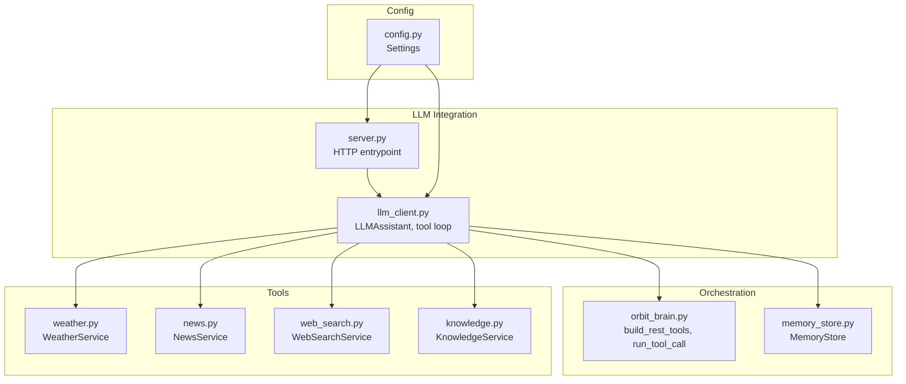
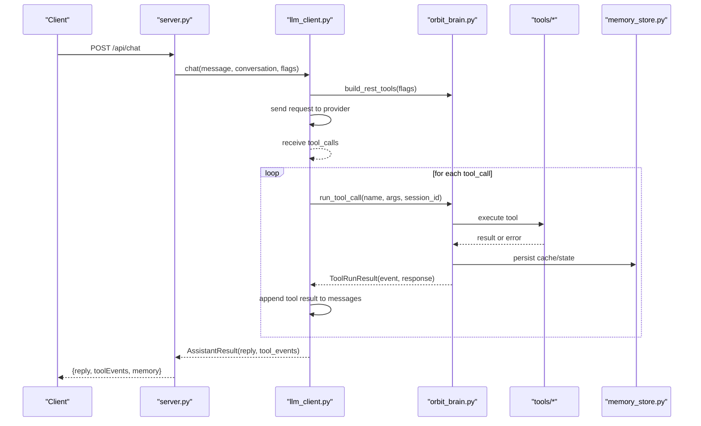
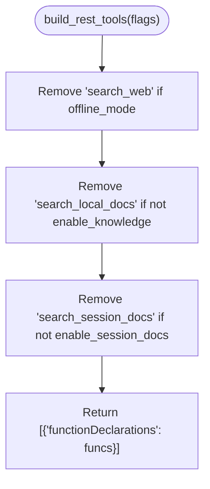
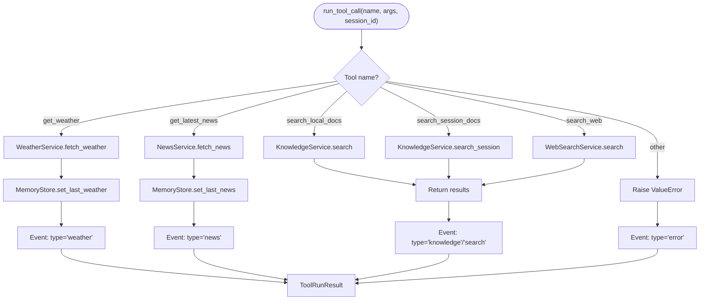
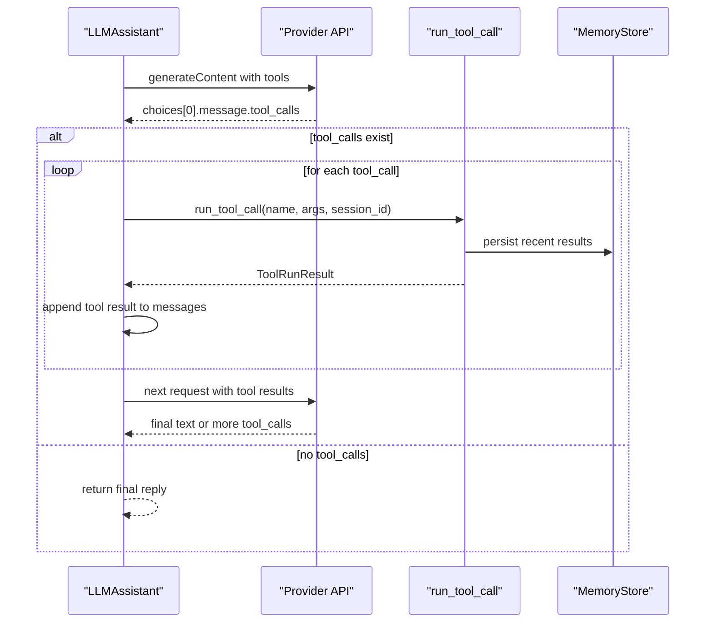
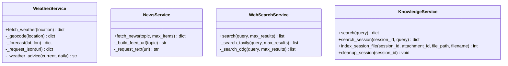
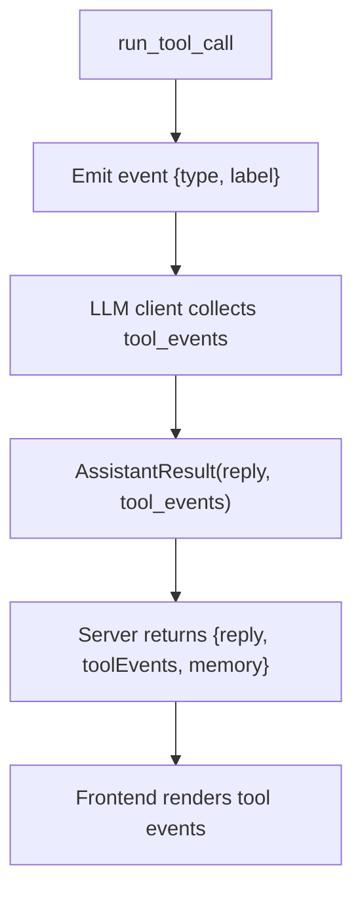
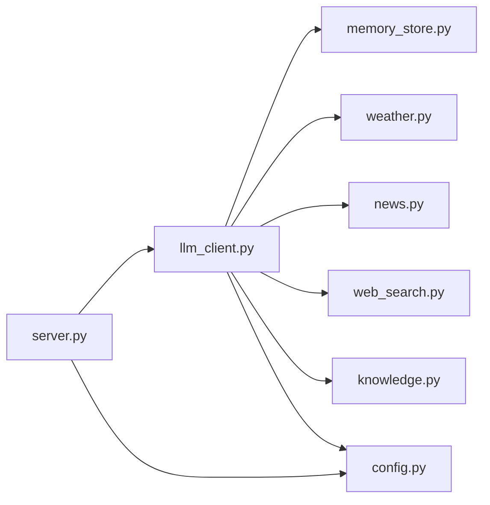

# Tool Calling and Function Orchestration

<cite>
**Referenced Files in This Document**
- [backend/core/orbit_brain.py](file://backend/core/orbit_brain.py)
- [backend/core/memory_store.py](file://backend/core/memory_store.py)
- [backend/api_clients/llm_client.py](file://backend/api_clients/llm_client.py)
- [backend/server.py](file://backend/server.py)
- [backend/tools/weather.py](file://backend/tools/weather.py)
- [backend/tools/news.py](file://backend/tools/news.py)
- [backend/tools/web_search.py](file://backend/tools/web_search.py)
- [backend/tools/knowledge.py](file://backend/tools/knowledge.py)
- [backend/tools/__init__.py](file://backend/tools/__init__.py)
- [backend/config.py](file://backend/config.py)
</cite>

## Table of Contents
1. [Introduction](#introduction)
2. [Project Structure](#project-structure)
3. [Core Components](#core-components)
4. [Architecture Overview](#architecture-overview)
5. [Detailed Component Analysis](#detailed-component-analysis)
6. [Dependency Analysis](#dependency-analysis)
7. [Performance Considerations](#performance-considerations)
8. [Troubleshooting Guide](#troubleshooting-guide)
9. [Conclusion](#conclusion)

## Introduction
This document explains the tool calling mechanism and function orchestration system used by the assistant. It focuses on:
- How tool declarations are generated for weather, news, knowledge search, and web search capabilities
- How tool calls are executed, including event handling and response aggregation
- How the tool loop processes multiple tool calls until completion or timeout
- How tool selection is controlled by configuration flags (web_search_only, offline_mode, enable_session_docs)
- How external services are integrated and how tool events are emitted for UI feedback

## Project Structure
The orchestration spans several modules:
- Core orchestration and tool declaration generation
- LLM client that manages the tool loop and integrates with external APIs
- Tool services for weather, news, web search, and knowledge
- Memory persistence and session management
- Server entrypoint and configuration

**Diagram sources**
- [backend/core/orbit_brain.py](file://backend/core/orbit_brain.py)
- [backend/core/memory_store.py](file://backend/core/memory_store.py)
- [backend/api_clients/llm_client.py](file://backend/api_clients/llm_client.py)
- [backend/server.py](file://backend/server.py)
- [backend/tools/weather.py](file://backend/tools/weather.py)
- [backend/tools/news.py](file://backend/tools/news.py)
- [backend/tools/web_search.py](file://backend/tools/web_search.py)
- [backend/tools/knowledge.py](file://backend/tools/knowledge.py)
- [backend/config.py](file://backend/config.py)

**Section sources**
- [backend/core/orbit_brain.py](file://backend/core/orbit_brain.py)
- [backend/api_clients/llm_client.py](file://backend/api_clients/llm_client.py)
- [backend/server.py](file://backend/server.py)
- [backend/tools/weather.py](file://backend/tools/weather.py)
- [backend/tools/news.py](file://backend/tools/news.py)
- [backend/tools/web_search.py](file://backend/tools/web_search.py)
- [backend/tools/knowledge.py](file://backend/tools/knowledge.py)
- [backend/config.py](file://backend/config.py)

## Core Components
- Tool declaration builder: builds function declarations for the LLM based on configuration flags
- Tool runner: executes tool calls, handles errors, and emits tool events
- LLM client: orchestrates the tool loop, aggregates tool responses, and returns final replies
- Tool services: encapsulate external integrations (weather, news, web search, knowledge)
- Memory store: persists state, caches recent results, and tracks activity
- Server: exposes endpoints and wires orchestration into HTTP handlers

**Section sources**
- [backend/core/orbit_brain.py](file://backend/core/orbit_brain.py)
- [backend/api_clients/llm_client.py](file://backend/api_clients/llm_client.py)
- [backend/core/memory_store.py](file://backend/core/memory_store.py)
- [backend/server.py](file://backend/server.py)

## Architecture Overview
The system uses a tool loop pattern:
- The LLM decides which tools to call
- The LLM client executes each tool call via run_tool_call
- Tool results are appended to the conversation and the LLM continues until no tool calls remain
- Tool events are collected for UI feedback

**Diagram sources**
- [backend/server.py](file://backend/server.py)
- [backend/api_clients/llm_client.py](file://backend/api_clients/llm_client.py)
- [backend/core/orbit_brain.py](file://backend/core/orbit_brain.py)
- [backend/core/memory_store.py](file://backend/core/memory_store.py)
- [backend/tools/weather.py](file://backend/tools/weather.py)
- [backend/tools/news.py](file://backend/tools/news.py)
- [backend/tools/web_search.py](file://backend/tools/web_search.py)
- [backend/tools/knowledge.py](file://backend/tools/knowledge.py)

## Detailed Component Analysis

### Tool Declaration Builder: build_rest_tools
- Purpose: Build the function declarations list passed to the LLM based on runtime flags
- Behavior:
  - Filters out search_web when offline_mode is true
  - Filters out search_local_docs when enable_knowledge is false
  - Filters out search_session_docs when enable_session_docs is false
- Output: A list containing a single element with functionDeclarations

**Diagram sources**
- [backend/core/orbit_brain.py](file://backend/core/orbit_brain.py)

**Section sources**
- [backend/core/orbit_brain.py](file://backend/core/orbit_brain.py)

### Tool Runner: run_tool_call
- Purpose: Execute a single tool call, handle errors, and emit a tool event
- Execution flow:
  - Dispatch by tool name
  - Call the appropriate service (weather, news, knowledge, web search)
  - Persist recent results to memory store
  - Emit a structured event with type and label
  - Wrap the result in a ToolRunResult with id, name, and response
- Error handling:
  - Catches specific tool errors and generic validation errors
  - Emits an error event and returns an error response
- Tool selection logic:
  - get_weather: requires location
  - get_latest_news: topic and max_items
  - search_local_docs: requires knowledge_service
  - search_session_docs: requires knowledge_service and session_id
  - search_web: requires web_search_service and dynamic max_results

**Diagram sources**
- [backend/core/orbit_brain.py](file://backend/core/orbit_brain.py)
- [backend/core/memory_store.py](file://backend/core/memory_store.py)
- [backend/tools/weather.py](file://backend/tools/weather.py)
- [backend/tools/news.py](file://backend/tools/news.py)
- [backend/tools/web_search.py](file://backend/tools/web_search.py)
- [backend/tools/knowledge.py](file://backend/tools/knowledge.py)

**Section sources**
- [backend/core/orbit_brain.py](file://backend/core/orbit_brain.py)
- [backend/core/memory_store.py](file://backend/core/memory_store.py)

### Tool Loop Mechanism
- The LLM client sends the system instruction and conversation to the provider
- The provider responds with tool_calls
- For each tool_call:
  - run_tool_call executes the tool and returns a ToolRunResult
  - The tool’s response is appended to the conversation as a tool role message
  - Tool events are accumulated for UI feedback
- The loop repeats until the provider returns a final text response or the loop limit is reached

**Diagram sources**
- [backend/api_clients/llm_client.py](file://backend/api_clients/llm_client.py)
- [backend/core/orbit_brain.py](file://backend/core/orbit_brain.py)
- [backend/core/memory_store.py](file://backend/core/memory_store.py)

**Section sources**
- [backend/api_clients/llm_client.py](file://backend/api_clients/llm_client.py)

### Tool Selection Logic Based on Flags
- web_search_only: Biases toward web search but does not disable local tools
- offline_mode: Removes web search from available tools
- enable_session_docs: Adds session-scoped document search when session has attachments
- enable_knowledge: Adds persistent knowledge search when retriever is available

These flags are evaluated when building tool declarations and when deciding whether to include session-scoped search.

**Section sources**
- [backend/core/orbit_brain.py](file://backend/core/orbit_brain.py)
- [backend/api_clients/llm_client.py](file://backend/api_clients/llm_client.py)

### Tool Services Overview
- WeatherService: Geocodes a location and fetches current and daily forecasts; raises WeatherError on failures
- NewsService: Fetches RSS feeds for topics; raises NewsError on failures
- WebSearchService: Uses Tavily (fallback to DuckDuckGo) for web search; raises WebSearchError on failures
- KnowledgeService: Provides persistent and session-scoped document search; lazy initializes RAG and embeddings

**Diagram sources**
- [backend/tools/weather.py](file://backend/tools/weather.py)
- [backend/tools/news.py](file://backend/tools/news.py)
- [backend/tools/web_search.py](file://backend/tools/web_search.py)
- [backend/tools/knowledge.py](file://backend/tools/knowledge.py)

**Section sources**
- [backend/tools/weather.py](file://backend/tools/weather.py)
- [backend/tools/news.py](file://backend/tools/news.py)
- [backend/tools/web_search.py](file://backend/tools/web_search.py)
- [backend/tools/knowledge.py](file://backend/tools/knowledge.py)

### Tool Event Handling and UI Feedback
- run_tool_call emits structured events with type and label
- The LLM client accumulates tool events and returns them alongside the final reply
- The frontend renders tool events as labeled pills for user feedback

**Diagram sources**
- [backend/core/orbit_brain.py](file://backend/core/orbit_brain.py)
- [backend/api_clients/llm_client.py](file://backend/api_clients/llm_client.py)
- [backend/server.py](file://backend/server.py)

**Section sources**
- [backend/core/orbit_brain.py](file://backend/core/orbit_brain.py)
- [backend/api_clients/llm_client.py](file://backend/api_clients/llm_client.py)
- [backend/server.py](file://backend/server.py)

### Integration with External Services
- Weather: HTTP requests to geocoding and forecast APIs
- News: HTTP requests to RSS feeds
- Web search: Tavily client with DuckDuckGo fallback
- Knowledge: Local file parsing, chunking, and vector store retrieval

**Section sources**
- [backend/tools/weather.py](file://backend/tools/weather.py)
- [backend/tools/news.py](file://backend/tools/news.py)
- [backend/tools/web_search.py](file://backend/tools/web_search.py)
- [backend/tools/knowledge.py](file://backend/tools/knowledge.py)

## Dependency Analysis
- LLM client depends on:
  - MemoryStore for state and caching
  - Tool services for execution
  - Config for provider settings
- Tool services depend on:
  - External HTTP APIs
  - Optional local embeddings/vector stores
- Server depends on:
  - LLM client and tool services initialization
  - Config for settings

**Diagram sources**
- [backend/api_clients/llm_client.py](file://backend/api_clients/llm_client.py)
- [backend/core/memory_store.py](file://backend/core/memory_store.py)
- [backend/tools/weather.py](file://backend/tools/weather.py)
- [backend/tools/news.py](file://backend/tools/news.py)
- [backend/tools/web_search.py](file://backend/tools/web_search.py)
- [backend/tools/knowledge.py](file://backend/tools/knowledge.py)
- [backend/config.py](file://backend/config.py)
- [backend/server.py](file://backend/server.py)

**Section sources**
- [backend/api_clients/llm_client.py](file://backend/api_clients/llm_client.py)
- [backend/server.py](file://backend/server.py)
- [backend/config.py](file://backend/config.py)

## Performance Considerations
- Tool loop limit: The loop caps iterations to prevent runaway tool calls
- Dynamic max_results for web search: Adjusts based on query complexity to reduce context pollution
- Embedding availability: Knowledge search falls back gracefully when embeddings are unavailable
- Network timeouts: External services enforce timeouts to avoid blocking the loop

[No sources needed since this section provides general guidance]

## Troubleshooting Guide
Common issues and resolutions:
- Missing API keys: The LLM client checks for a valid API key and raises an error if missing
- Tool errors:
  - WeatherError: Indicates invalid location or service unavailability
  - NewsError: Indicates RSS parsing or network issues
  - WebSearchError: Indicates provider failures; the system falls back when possible
- Validation errors: run_tool_call raises ValueError for unsupported tools or missing session docs
- Offline mode: search_web is disabled; ensure local tools are used instead
- Session docs: search_session_docs requires session attachments; verify attachment presence

**Section sources**
- [backend/api_clients/llm_client.py](file://backend/api_clients/llm_client.py)
- [backend/core/orbit_brain.py](file://backend/core/orbit_brain.py)
- [backend/tools/weather.py](file://backend/tools/weather.py)
- [backend/tools/news.py](file://backend/tools/news.py)
- [backend/tools/web_search.py](file://backend/tools/web_search.py)

## Conclusion
The tool calling and orchestration system cleanly separates concerns:
- Tool declarations are dynamically configured via flags
- Tool execution is centralized in run_tool_call with robust error handling
- The LLM client manages the tool loop, response aggregation, and UI events
- External services are encapsulated behind dedicated tool classes with clear error semantics
- MemoryStore persists state and recent results, enabling coherent conversations