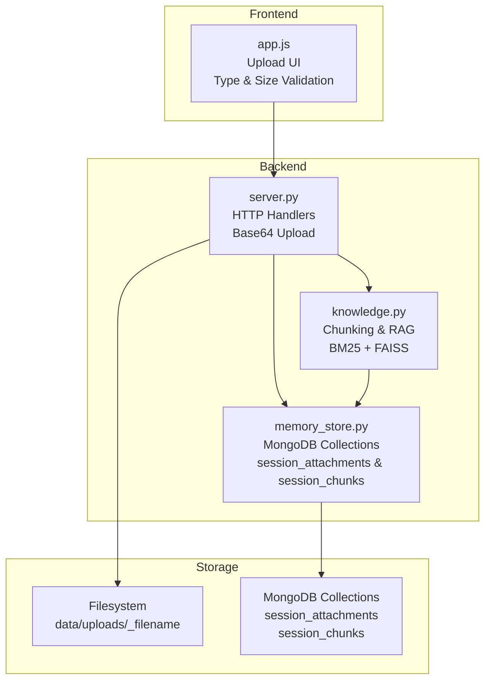
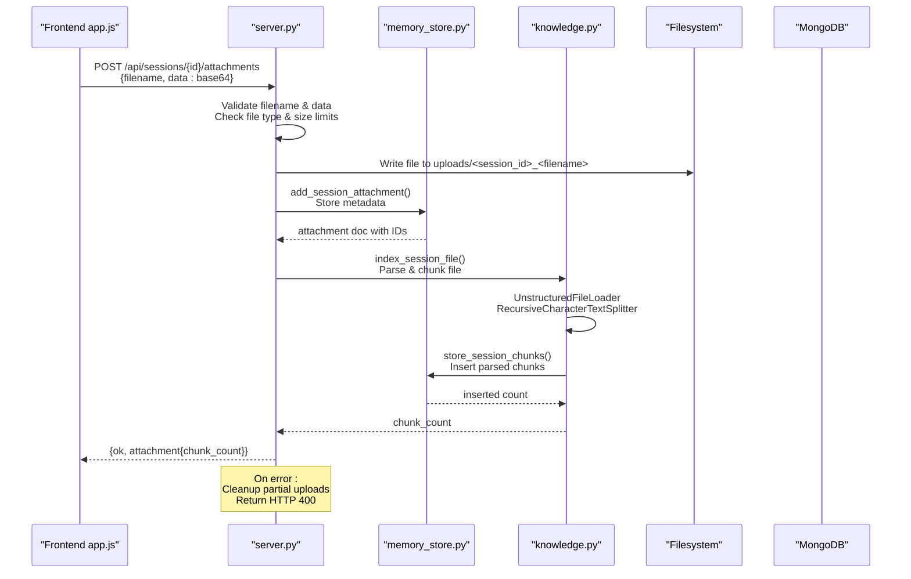
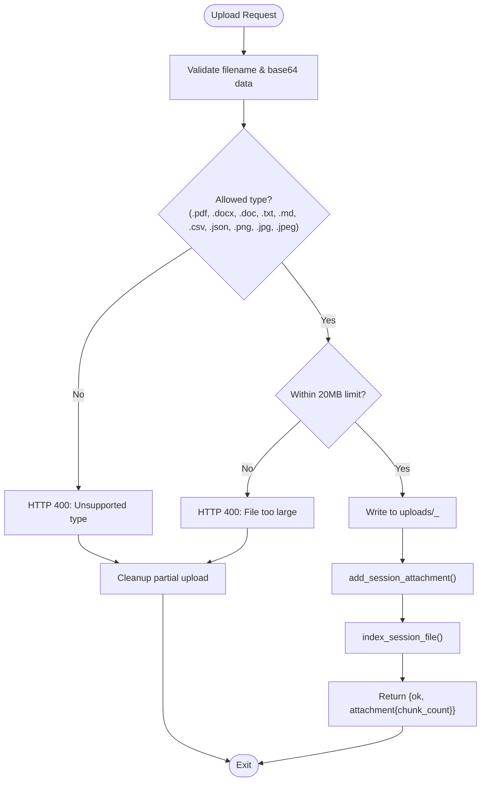
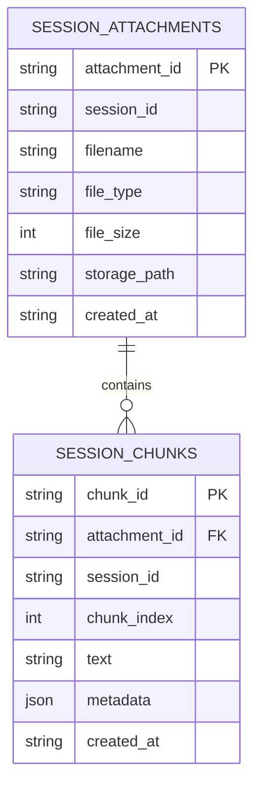
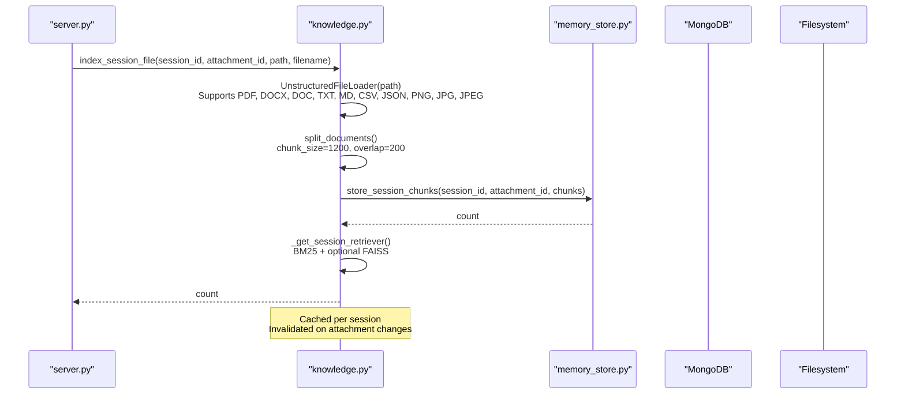
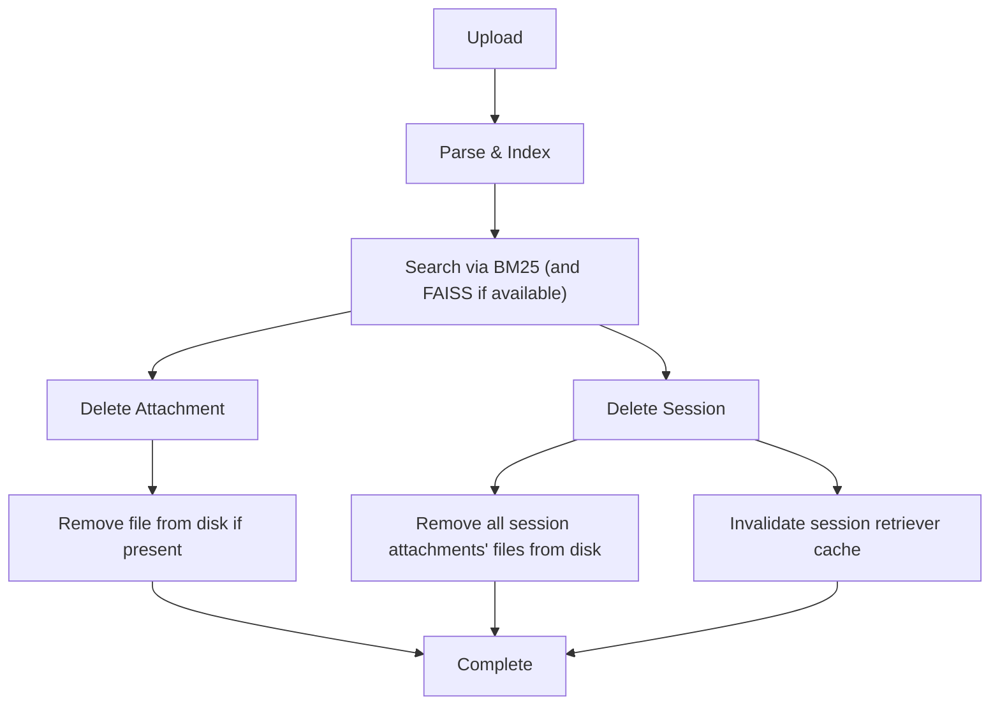
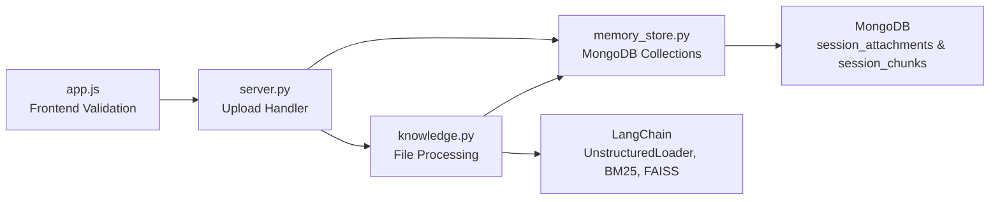

# Attachment and File Management

<cite>
**Referenced Files in This Document**
- [server.py](file://backend/server.py)
- [memory_store.py](file://backend/core/memory_store.py)
- [knowledge.py](file://backend/tools/knowledge.py)
- [app.js](file://frontend/scripts/app.js)
- [README.md](file://README.md)
- [build_knowledge.py](file://build_knowledge.py)
</cite>

## Update Summary
**Changes Made**
- Updated to reflect the newly implemented attachment management system with MongoDB collections
- Enhanced documentation for session_attachments and session_chunks collections
- Added comprehensive coverage of file cleanup procedures and error handling
- Expanded on the integration between attachment management and knowledge processing pipeline

## Table of Contents
1. [Introduction](#introduction)
2. [Project Structure](#project-structure)
3. [Core Components](#core-components)
4. [Architecture Overview](#architecture-overview)
5. [Detailed Component Analysis](#detailed-component-analysis)
6. [Dependency Analysis](#dependency-analysis)
7. [Performance Considerations](#performance-considerations)
8. [Troubleshooting Guide](#troubleshooting-guide)
9. [Conclusion](#conclusion)

## Introduction
This document explains the attachment and file management system used by the assistant to handle file uploads within chat sessions, parse and index their content for retrieval-augmented generation (RAG), and coordinate cleanup of both metadata and physical files. The system implements a robust pipeline using two MongoDB collections:
- session_attachments: stores metadata for files attached to a session
- session_chunks: stores parsed text chunks derived from those attachments

The system provides comprehensive error handling, cleanup procedures, and seamless integration with the knowledge processing pipeline for session-scoped document retrieval.

## Project Structure
The attachment and file management functionality spans the backend HTTP server, the persistent memory store, and the knowledge processing service. The frontend triggers uploads and displays feedback with validation.

**Diagram sources**
- [server.py:220-248](file://backend/server.py#L220-L248)
- [memory_store.py:111-112](file://backend/core/memory_store.py#L111-L112)
- [knowledge.py:304-336](file://backend/tools/knowledge.py#L304-L336)

**Section sources**
- [README.md:164-201](file://README.md#L164-L201)

## Core Components
The attachment management system consists of four key components with enhanced error handling and cleanup procedures:

- **HTTP Server Handlers**: Validate and accept base64-encoded file uploads with comprehensive error handling
- **Memory Store**: Manages session_attachments and session_chunks collections with proper indexing
- **Knowledge Service**: Parses, chunks, and indexes files for session-scoped retrieval with hybrid BM25/FAISS support
- **Frontend Upload Flow**: Implements client-side validation for file types and size limits

**Enhanced Error Handling**: The system provides robust error handling including parse failures, file size validation, and cleanup procedures for failed uploads.

**Section sources**
- [server.py:220-248](file://backend/server.py#L220-L248)
- [memory_store.py:754-796](file://backend/core/memory_store.py#L754-L796)
- [knowledge.py:304-336](file://backend/tools/knowledge.py#L304-L336)
- [app.js:1668-1712](file://frontend/scripts/app.js#L1668-L1712)

## Architecture Overview
The system implements a comprehensive three-layer architecture with enhanced error handling and cleanup procedures:

**Diagram sources**
- [server.py:220-248](file://backend/server.py#L220-L248)
- [memory_store.py:754-796](file://backend/core/memory_store.py#L754-L796)
- [knowledge.py:304-336](file://backend/tools/knowledge.py#L304-L336)

## Detailed Component Analysis

### HTTP Upload Handler with Enhanced Error Handling
The upload handler implements comprehensive validation and error handling:

- **Validation**: Checks filename presence, base64 data validity, and file type restrictions
- **Size Limits**: Enforces 20MB maximum file size
- **File Type Restrictions**: Supports PDF, DOCX, DOC, TXT, MD, CSV, JSON, PNG, JPG, JPEG
- **Safe Filename Generation**: Combines session_id with original filename to prevent collisions
- **Error Handling**: Comprehensive exception handling with HTTP 400 responses for invalid uploads

**Diagram sources**
- [server.py:220-248](file://backend/server.py#L220-L248)

**Section sources**
- [server.py:220-248](file://backend/server.py#L220-L248)
- [app.js:1668-1712](file://frontend/scripts/app.js#L1668-L1712)

### Memory Store: Enhanced Session Management
The memory store manages both session_attachments and session_chunks collections with comprehensive indexing and cleanup capabilities:

**session_attachments Collection**:
- Schema: attachment_id (PK), session_id, filename, file_type, file_size, storage_path, created_at
- Indexes: unique attachment_id, session_id index for efficient lookups
- Operations: add_session_attachment(), get_session_attachments(), delete_session_attachment()

**session_chunks Collection**:
- Schema: chunk_id (PK), attachment_id, session_id, chunk_index, text, metadata, created_at
- Indexes: unique chunk_id, session_id, attachment_id for efficient retrieval
- Operations: store_session_chunks(), get_session_chunks()

**Enhanced Cleanup Procedures**: Automatic cleanup of associated chunks when attachments are deleted, and comprehensive session cleanup including file system cleanup.

**Diagram sources**
- [memory_store.py:55-62](file://backend/core/memory_store.py#L55-L62)
- [memory_store.py:119-135](file://backend/core/memory_store.py#L119-L135)

**Section sources**
- [memory_store.py:55-62](file://backend/core/memory_store.py#L55-L62)
- [memory_store.py:119-135](file://backend/core/memory_store.py#L119-L135)
- [memory_store.py:754-830](file://backend/core/memory_store.py#L754-L830)

### Knowledge Service: Advanced Parsing and Retrieval
The knowledge service implements sophisticated document processing with hybrid retrieval capabilities:

**File Processing Pipeline**:
- Uses UnstructuredFileLoader for supported file types including images (PNG, JPG, JPEG)
- Applies RecursiveCharacterTextSplitter with chunk_size=1200 and overlap=200
- Extracts start_index metadata for precise source location tracking

**Hybrid Retrieval System**:
- BM25 retriever as fallback for all scenarios
- Optional FAISS vector search when embeddings are available
- EnsembleRetriever combining BM25 and FAISS with equal weighting
- Lazy initialization and caching of session-specific retrievers

**Enhanced Error Handling**: Comprehensive error handling for parsing failures with detailed error messages and graceful degradation to BM25-only search.

**Diagram sources**
- [knowledge.py:304-336](file://backend/tools/knowledge.py#L304-L336)
- [knowledge.py:358-388](file://backend/tools/knowledge.py#L358-L388)

**Section sources**
- [knowledge.py:304-336](file://backend/tools/knowledge.py#L304-L336)
- [knowledge.py:358-388](file://backend/tools/knowledge.py#L358-L388)

### Enhanced Attachment Lifecycle Management
The system implements comprehensive lifecycle management with automatic cleanup procedures:

**Upload Lifecycle**:
1. Frontend validation (type and size)
2. Base64 decoding and file write
3. Metadata persistence in session_attachments
4. File parsing and chunking
5. Chunk storage in session_chunks
6. Response with chunk count

**Deletion Lifecycle**:
1. **Delete Attachment**: Removes metadata and associated chunks from MongoDB
2. **Delete Session**: Removes session, messages, attachments, and chunks; cleans up uploaded files on disk
3. **Cleanup Procedures**: Automatic file system cleanup for deleted attachments
4. **Cache Invalidation**: Removes cached session retrievers to prevent stale results

**Diagram sources**
- [server.py:151-162](file://backend/server.py#L151-L162)
- [memory_store.py:632-646](file://backend/core/memory_store.py#L632-L646)
- [knowledge.py:390-394](file://backend/tools/knowledge.py#L390-L394)

**Section sources**
- [server.py:151-162](file://backend/server.py#L151-L162)
- [memory_store.py:632-646](file://backend/core/memory_store.py#L632-L646)
- [knowledge.py:390-394](file://backend/tools/knowledge.py#L390-L394)

### Relationship Between Attachments and Sessions
The system maintains strong relationships between attachments and sessions with comprehensive indexing:

- **Session Linkage**: Each attachment belongs to a session via session_id
- **Chunk Organization**: Chunks are stored with both attachment_id and session_id for efficient retrieval
- **Ordering**: Chunks are ordered by attachment_id and chunk_index for logical presentation
- **Cascade Operations**: Deleting attachments removes associated chunks; deleting sessions removes all related data

**Section sources**
- [memory_store.py:754-830](file://backend/core/memory_store.py#L754-L830)

### Enhanced File Type Handling and Size Management
The system supports an expanded range of file types with comprehensive validation:

**Supported File Types**:
- Documents: PDF (.pdf), Word (.docx, .doc), Plain text (.txt), Markdown (.md)
- Data: CSV (.csv), JSON (.json)
- Images: PNG (.png), JPEG/JPG (.jpg, .jpeg)

**Size Limitations**: Maximum 20MB per file enforced both client-side and server-side

**Section sources**
- [knowledge.py:38](file://backend/tools/knowledge.py#L38)
- [app.js:1669-1679](file://frontend/scripts/app.js#L1669-L1679)

### Storage Path Management and Cleanup
The system implements robust storage management with automatic cleanup:

**Storage Strategy**:
- Files stored under data/uploads/ directory
- Safe naming convention: `{session_id}_{original_filename}`
- Path stored in session_attachments.storage_path for cleanup
- Automatic cleanup when attachments are deleted

**Cleanup Procedures**:
- Individual attachment deletion removes both MongoDB entries and physical files
- Session deletion removes all associated attachments and their files
- Error-safe cleanup prevents orphaned files

**Section sources**
- [server.py:224-228](file://backend/server.py#L224-L228)
- [server.py:155-161](file://backend/server.py#L155-L161)
- [knowledge.py:118-121](file://backend/tools/knowledge.py#L118-L121)

### Integration with Knowledge Processing Pipeline
The system seamlessly integrates with the knowledge processing pipeline:

**Consistent Processing Logic**:
- Same chunking parameters (size=1200, overlap=200) for both knowledge_base and session attachments
- Identical storage mechanism using MemoryStore.store_session_chunks()
- Unified retriever construction from session_chunks

**Session-Specific Retrieval**:
- BM25 retriever built from session_chunks for each session
- Optional FAISS enhancement when embeddings are available
- Lazy initialization with caching for performance

**Section sources**
- [knowledge.py:110-121](file://backend/tools/knowledge.py#L110-L121)
- [knowledge.py:304-336](file://backend/tools/knowledge.py#L304-L336)
- [build_knowledge.py:119-166](file://build_knowledge.py#L119-L166)

## Dependency Analysis
The attachment management system has well-defined dependencies with enhanced error handling:

**Enhanced Dependencies**:
- **Server**: Depends on MemoryStore for persistence and KnowledgeService for processing
- **MemoryStore**: Depends on MongoDB collections with proper indexing
- **KnowledgeService**: Depends on LangChain components with fallback mechanisms
- **Frontend**: Provides client-side validation before server processing

**Diagram sources**
- [server.py:16-22](file://backend/server.py#L16-L22)
- [memory_store.py:102-116](file://backend/core/memory_store.py#L102-L116)
- [knowledge.py:12-22](file://backend/tools/knowledge.py#L12-L22)

**Section sources**
- [server.py:16-22](file://backend/server.py#L16-L22)
- [memory_store.py:102-116](file://backend/core/memory_store.py#L102-L116)
- [knowledge.py:12-22](file://backend/tools/knowledge.py#L12-L22)

## Performance Considerations
The system implements several performance optimizations:

**Chunking Parameters**:
- Chunk size: 1200 characters with 200 character overlap for optimal context preservation
- Separators optimized for markdown and common document formats
- Efficient indexing on session_id and attachment_id for fast retrieval

**Caching Strategy**:
- Session retrievers cached and invalidated on attachment changes
- Lazy initialization reduces startup overhead
- Thread-safe operations with proper locking

**File I/O Optimization**:
- Base64 encoding handled efficiently in memory
- Atomic operations for metadata and chunk insertion
- Asynchronous processing considerations for large files

**Error Recovery**:
- Graceful fallback from FAISS to BM25 when embeddings fail
- Partial cleanup on upload failures prevents resource leaks
- Comprehensive logging for debugging and monitoring

## Troubleshooting Guide
Comprehensive troubleshooting for common issues:

**Upload Issues**:
- **Unsupported File Type**: Verify file extension is in [.pdf, .docx, .doc, .txt, .md, .csv, .json, .png, .jpg, .jpeg]
- **File Too Large**: Reduce file size below 20MB limit
- **Parse Errors**: Check file integrity; some formats may require specific libraries
- **Upload Failures**: Server returns HTTP 400 with detailed error message

**MongoDB Issues**:
- **Connection Failures**: Verify MongoDB is running and accessible
- **Index Problems**: Check session_attachments and session_chunks indexes exist
- **Cleanup Failures**: Manual cleanup may be required for orphaned files

**Retrieval Issues**:
- **Empty Results**: Verify file was successfully parsed and chunks stored
- **Stale Results**: Attachment deletions trigger cache invalidation automatically
- **Performance Issues**: Large files may take time to process; check server logs

**Section sources**
- [server.py:246-247](file://backend/server.py#L246-L247)
- [knowledge.py:317-319](file://backend/tools/knowledge.py#L317-L319)
- [knowledge.py:390-394](file://backend/tools/knowledge.py#L390-L394)

## Conclusion
The attachment and file management system provides a comprehensive, production-ready solution for handling file uploads within chat sessions. The system implements robust error handling, automatic cleanup procedures, and seamless integration with the knowledge processing pipeline. With support for multiple file types, comprehensive validation, and efficient MongoDB storage, it delivers reliable session-scoped document retrieval through BM25 and FAISS hybrid search. The enhanced cleanup procedures ensure proper resource management, while the caching strategy optimizes performance for frequent retrievals. This system forms a solid foundation for advanced document processing and retrieval capabilities in the assistant platform.