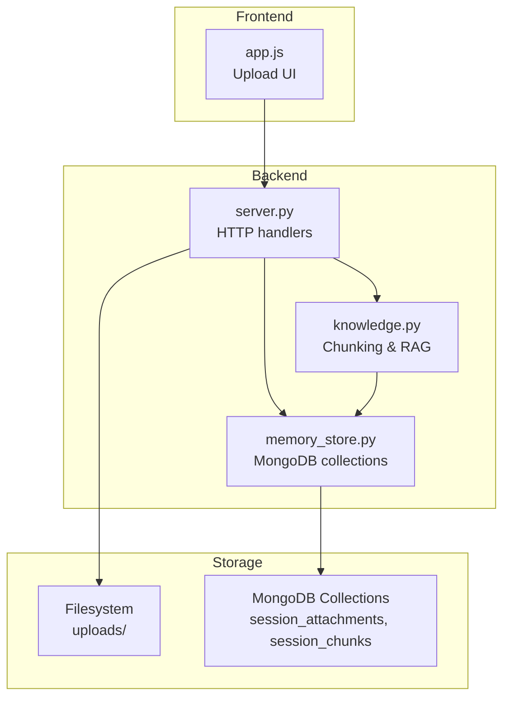
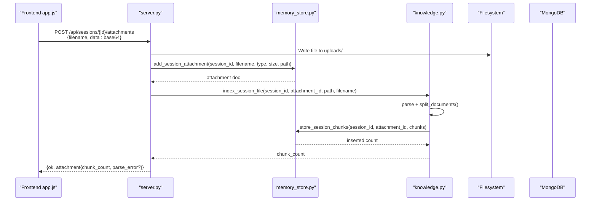
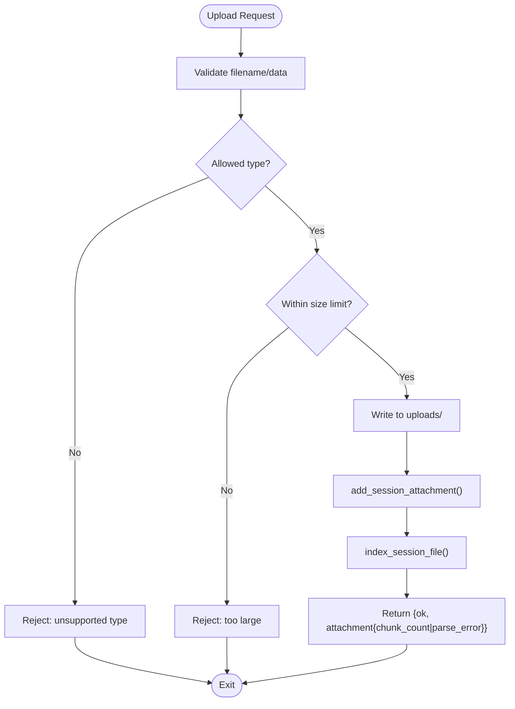
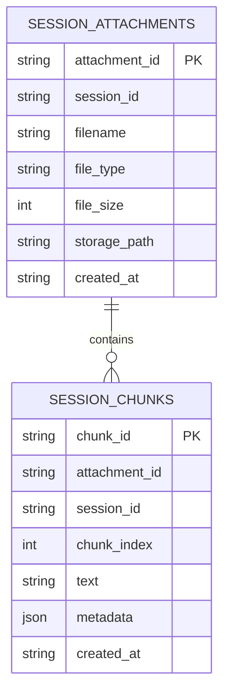
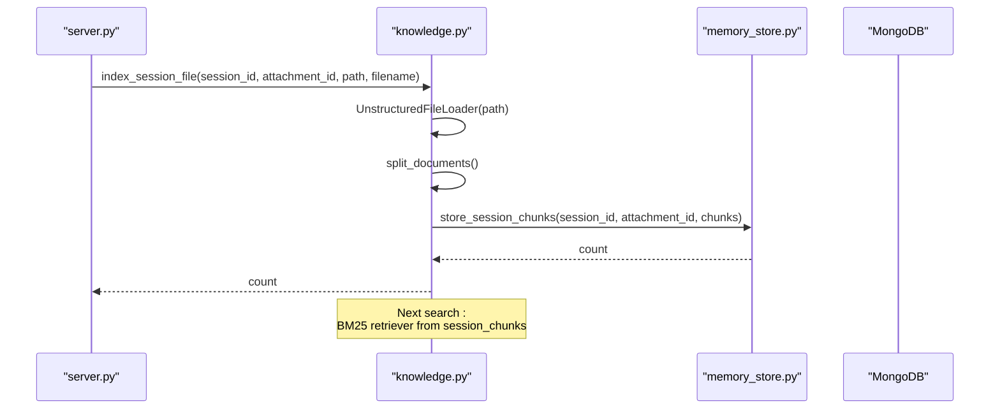
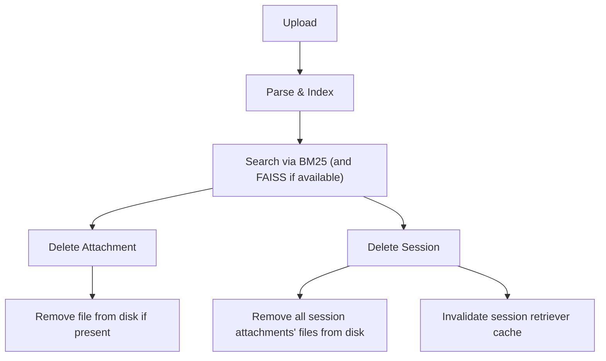
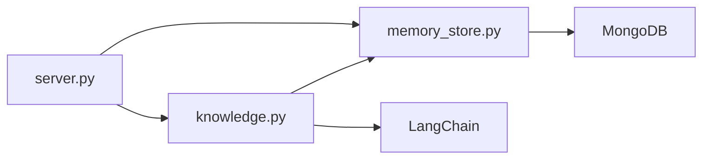

# Attachment and File Management

<cite>
**Referenced Files in This Document**
- [server.py](file://backend/server.py)
- [memory_store.py](file://backend/core/memory_store.py)
- [knowledge.py](file://backend/tools/knowledge.py)
- [app.js](file://frontend/scripts/app.js)
- [README.md](file://README.md)
- [build_knowledge.py](file://build_knowledge.py)
</cite>

## Table of Contents
1. [Introduction](#introduction)
2. [Project Structure](#project-structure)
3. [Core Components](#core-components)
4. [Architecture Overview](#architecture-overview)
5. [Detailed Component Analysis](#detailed-component-analysis)
6. [Dependency Analysis](#dependency-analysis)
7. [Performance Considerations](#performance-considerations)
8. [Troubleshooting Guide](#troubleshooting-guide)
9. [Conclusion](#conclusion)

## Introduction
This document explains the attachment and file management system used by the assistant to handle file uploads within chat sessions, parse and index their content for retrieval-augmented generation (RAG), and coordinate cleanup of both metadata and physical files. It focuses on two MongoDB collections:
- session_attachments: stores metadata for files attached to a session
- session_chunks: stores parsed text chunks derived from those attachments

It also covers the lifecycle from upload to deletion, including chunk parsing, storage, retrieval for RAG, and file system cleanup coordination.

## Project Structure
The attachment and file management functionality spans the backend HTTP server, the persistent memory store, and the knowledge processing service. The frontend triggers uploads and displays feedback.

**Diagram sources**
- [server.py:23-63](file://backend/server.py#L23-L63)
- [memory_store.py:102-116](file://backend/core/memory_store.py#L102-L116)
- [knowledge.py:88-140](file://backend/tools/knowledge.py#L88-L140)

**Section sources**
- [README.md:164-201](file://README.md#L164-L201)

## Core Components
- HTTP server handlers for attachment upload, listing, and deletion
- Memory store for session_attachments and session_chunks persistence
- Knowledge service for parsing, chunking, and session-scoped retrieval
- Frontend upload flow with type and size checks

Key responsibilities:
- Validate and accept base64-encoded file uploads
- Persist attachment metadata to session_attachments
- Parse and chunk the file for session-scoped search
- Store chunks in session_chunks with deterministic ordering
- Retrieve chunks for BM25-based retrieval during chat
- Coordinate filesystem cleanup when attachments or sessions are deleted

**Section sources**
- [server.py:326-393](file://backend/server.py#L326-L393)
- [memory_store.py:55-62](file://backend/core/memory_store.py#L55-L62)
- [memory_store.py:754-830](file://backend/core/memory_store.py#L754-L830)
- [knowledge.py:303-335](file://backend/tools/knowledge.py#L303-L335)
- [app.js:1593-1633](file://frontend/scripts/app.js#L1593-L1633)

## Architecture Overview
The system integrates three layers:
- HTTP layer: validates uploads, persists metadata, triggers parsing
- Persistence layer: manages session_attachments and session_chunks
- Knowledge layer: parses files, chunks them, and builds retrievers

**Diagram sources**
- [server.py:329-393](file://backend/server.py#L329-L393)
- [memory_store.py:754-779](file://backend/core/memory_store.py#L754-L779)
- [knowledge.py:303-335](file://backend/tools/knowledge.py#L303-L335)

## Detailed Component Analysis

### HTTP Upload Handler
- Validates filename and base64 data presence
- Checks file extension against allowed types
- Enforces maximum file size
- Writes file to uploads/ with a safe filename combining session_id and original filename
- Persists metadata to session_attachments
- Invokes knowledge service to parse and index the file
- Returns chunk count or parse error in the response

**Diagram sources**
- [server.py:329-393](file://backend/server.py#L329-L393)

**Section sources**
- [server.py:326-393](file://backend/server.py#L326-L393)
- [app.js:1593-1633](file://frontend/scripts/app.js#L1593-L1633)

### Memory Store: session_attachments and session_chunks
- session_attachments schema includes identifiers, session linkage, filename, type, size, storage path, and timestamps
- session_chunks schema includes identifiers, attachment linkage, session linkage, chunk index, text, metadata, and timestamps
- Indexes are created on attachment_id, session_id, and chunk_id for efficient lookups
- Methods:
  - add_session_attachment(): inserts attachment metadata
  - get_session_attachments(): lists attachments for a session
  - delete_session_attachment(): removes attachment and associated chunks
  - store_session_chunks(): inserts parsed chunks with ascending order by attachment_id and chunk_index
  - get_session_chunks(): retrieves chunks for a session ordered by attachment and index

**Diagram sources**
- [memory_store.py:55-62](file://backend/core/memory_store.py#L55-L62)
- [memory_store.py:119-135](file://backend/core/memory_store.py#L119-L135)
- [memory_store.py:754-830](file://backend/core/memory_store.py#L754-L830)

**Section sources**
- [memory_store.py:55-62](file://backend/core/memory_store.py#L55-L62)
- [memory_store.py:119-135](file://backend/core/memory_store.py#L119-L135)
- [memory_store.py:754-830](file://backend/core/memory_store.py#L754-L830)

### Knowledge Service: Parsing, Chunking, and Retrieval
- Uses Unstructured loader to parse supported file types
- Applies RecursiveCharacterTextSplitter to produce chunks with overlap and start indices
- Stores chunks via MemoryStore.store_session_chunks()
- Builds a BM25 retriever lazily per session and caches it
- Optionally augments with FAISS when embeddings are available
- Provides search_session() to retrieve relevant chunks for a given query

**Diagram sources**
- [knowledge.py:303-335](file://backend/tools/knowledge.py#L303-L335)
- [memory_store.py:802-830](file://backend/core/memory_store.py#L802-L830)

**Section sources**
- [knowledge.py:303-335](file://backend/tools/knowledge.py#L303-L335)
- [knowledge.py:357-387](file://backend/tools/knowledge.py#L357-L387)

### Attachment Lifecycle: From Upload to Deletion
- Upload: validated, saved to uploads/, metadata stored, file parsed and indexed
- Retrieval: chunks retrieved and used to build a session-scoped retriever
- Deletion:
  - Delete attachment: removes metadata and associated chunks from MongoDB
  - Delete session: removes session, messages, attachments, and chunks; also cleans up uploaded files on disk
  - Cleanup invalidates cached session retrievers to prevent stale results

**Diagram sources**
- [server.py:448-466](file://backend/server.py#L448-L466)
- [server.py:431-446](file://backend/server.py#L431-L446)
- [memory_store.py:788-796](file://backend/core/memory_store.py#L788-L796)
- [knowledge.py:389-393](file://backend/tools/knowledge.py#L389-L393)

**Section sources**
- [server.py:431-466](file://backend/server.py#L431-L466)
- [memory_store.py:788-796](file://backend/core/memory_store.py#L788-L796)
- [knowledge.py:389-393](file://backend/tools/knowledge.py#L389-L393)

### Relationship Between Attachments and Sessions
- Each attachment belongs to a session via session_id
- Chunks are stored with both attachment_id and session_id, enabling:
  - Efficient retrieval scoped to a session
  - Accurate ordering by attachment_id and chunk_index
- Deleting an attachment removes all associated chunks
- Deleting a session removes all attachments and chunks for that session

**Section sources**
- [memory_store.py:754-830](file://backend/core/memory_store.py#L754-L830)

### Chunk Retrieval for RAG
- Knowledge service builds a BM25 retriever from session_chunks for a given session
- Optional FAISS retriever augmentation when embeddings are available
- search_session() returns concatenated chunk content with metadata for downstream use

**Section sources**
- [knowledge.py:337-356](file://backend/tools/knowledge.py#L337-L356)
- [knowledge.py:357-387](file://backend/tools/knowledge.py#L357-L387)

### File Type Handling and Size Limits
- Allowed file types: pdf, docx, doc, txt, md, csv, json
- Maximum file size: 20 MB
- Frontend enforces the same constraints and provides user feedback

**Section sources**
- [server.py:326-327](file://backend/server.py#L326-L327)
- [app.js:1594-1604](file://frontend/scripts/app.js#L1594-L1604)

### Storage Path Management
- Uploaded files are stored under the configured upload directory (data/uploads/)
- Filenames are prefixed with session_id to avoid collisions
- Paths are recorded in session_attachments.storage_path for later cleanup

**Section sources**
- [server.py:364-369](file://backend/server.py#L364-L369)
- [server.py:372-378](file://backend/server.py#L372-L378)
- [knowledge.py:118-121](file://backend/tools/knowledge.py#L118-L121)

### Integration with Knowledge Processing Pipeline
- The knowledge service uses the same chunking logic for both:
  - Local knowledge_base (standalone tool)
  - Session-scoped attachments (HTTP server)
- Both use MemoryStore.store_session_chunks() to persist chunks
- Retrievers are built from session_chunks for session-specific RAG

**Section sources**
- [knowledge.py:110-121](file://backend/tools/knowledge.py#L110-L121)
- [knowledge.py:303-335](file://backend/tools/knowledge.py#L303-L335)
- [build_knowledge.py:119-166](file://build_knowledge.py#L119-L166)

## Dependency Analysis
- server.py depends on:
  - MemoryStore for persistence
  - KnowledgeService for parsing and indexing
  - Frontend for upload requests
- MemoryStore depends on:
  - MongoDB collections session_attachments and session_chunks
- KnowledgeService depends on:
  - LangChain components for parsing and chunking
  - MemoryStore for storing chunks
  - Embeddings for optional FAISS augmentation

**Diagram sources**
- [server.py:23-63](file://backend/server.py#L23-L63)
- [memory_store.py:102-116](file://backend/core/memory_store.py#L102-L116)
- [knowledge.py:88-140](file://backend/tools/knowledge.py#L88-L140)

**Section sources**
- [server.py:23-63](file://backend/server.py#L23-L63)
- [memory_store.py:102-116](file://backend/core/memory_store.py#L102-L116)
- [knowledge.py:88-140](file://backend/tools/knowledge.py#L88-L140)

## Performance Considerations
- Chunking parameters:
  - Chunk size and overlap influence retrieval quality and latency
  - Overlap helps preserve context across boundaries
- Retrieval caching:
  - Session retrievers are cached and invalidated upon attachment deletion or reindexing
- File I/O:
  - Uploads are synchronous; consider async processing for large files
- Indexing:
  - Large documents increase memory usage during parsing and chunking

[No sources needed since this section provides general guidance]

## Troubleshooting Guide
Common issues and resolutions:
- Unsupported file type:
  - Ensure the file extension is among pdf, docx, doc, txt, md, csv, json
- File too large:
  - Reduce file size below 20 MB
- Parse errors:
  - The server records parse_error in the attachment response; check logs for details
- Missing chunks:
  - Verify that index_session_file succeeded and store_session_chunks inserted documents
- Stale retriever:
  - After deleting attachments or sessions, the retriever cache is invalidated automatically

**Section sources**
- [server.py:340-361](file://backend/server.py#L340-L361)
- [server.py:389-391](file://backend/server.py#L389-L391)
- [knowledge.py:303-335](file://backend/tools/knowledge.py#L303-L335)
- [knowledge.py:389-393](file://backend/tools/knowledge.py#L389-L393)

## Conclusion
The attachment and file management system provides a robust pipeline for uploading, parsing, indexing, and retrieving session-scoped documents. It maintains clear separation between metadata (session_attachments) and parsed content (session_chunks), integrates seamlessly with the knowledge processing pipeline, and ensures coordinated cleanup of both database entries and physical files. By enforcing type and size constraints and leveraging caching and indexing, it balances usability with performance for RAG within chat sessions.