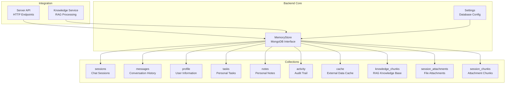
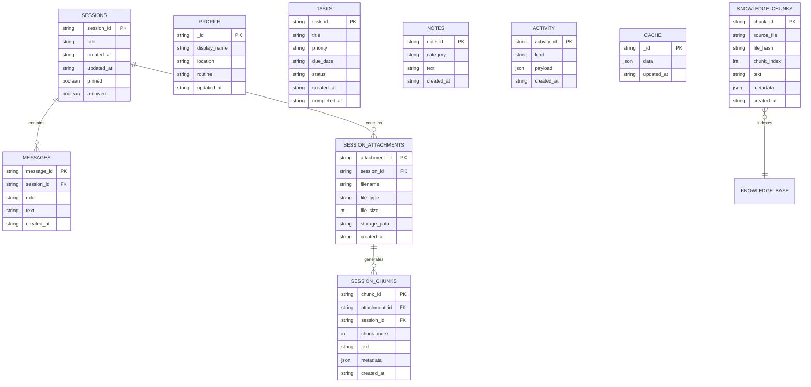
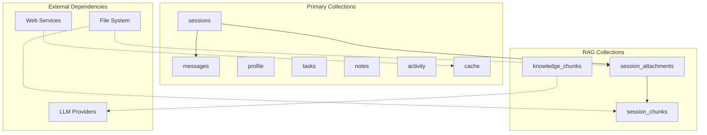

# Data Schemas and Collections

<cite>
**Referenced Files in This Document**
- [memory_store.py](file://backend/core/memory_store.py)
- [server.py](file://backend/server.py)
- [config.py](file://backend/config.py)
- [knowledge.py](file://backend/tools/knowledge.py)
- [README.md](file://README.md)
- [requirements.txt](file://requirements.txt)
</cite>

## Table of Contents
1. [Introduction](#introduction)
2. [Project Structure](#project-structure)
3. [Core Components](#core-components)
4. [Architecture Overview](#architecture-overview)
5. [Detailed Component Analysis](#detailed-component-analysis)
6. [Dependency Analysis](#dependency-analysis)
7. [Performance Considerations](#performance-considerations)
8. [Troubleshooting Guide](#troubleshooting-guide)
9. [Conclusion](#conclusion)

## Introduction
This document provides comprehensive documentation for all MongoDB collection schemas and data models used by the Orbit Virtual Assistant. The application uses MongoDB as its primary persistence layer, storing chat sessions, conversation history, user profiles, personal organization data, activity logs, cached external data, and knowledge chunks for Retrieval-Augmented Generation (RAG) functionality.

The system maintains backward compatibility with legacy JSON file storage through a migration process and provides robust indexing strategies for optimal query performance across all collections.

## Project Structure
The MongoDB schema definitions are centralized in the MemoryStore class within the backend core module, with integration points throughout the server and knowledge processing components.

**Diagram sources**
- [memory_store.py:67-116](file://backend/core/memory_store.py#L67-L116)
- [server.py:23-63](file://backend/server.py#L23-L63)

**Section sources**
- [memory_store.py:23-62](file://backend/core/memory_store.py#L23-L62)
- [config.py:20-37](file://backend/config.py#L20-L37)

## Core Components
The MemoryStore class serves as the central interface for all MongoDB operations, defining collection schemas, indexes, and data manipulation methods. It maintains thread safety through locks and provides backward compatibility with legacy JSON file storage.

Key responsibilities include:
- Collection initialization and schema definition
- Index creation for optimal query performance
- Data validation and sanitization
- Migration from legacy JSON storage
- Thread-safe operations for concurrent access

**Section sources**
- [memory_store.py:67-116](file://backend/core/memory_store.py#L67-L116)
- [memory_store.py:836-947](file://backend/core/memory_store.py#L836-L947)

## Architecture Overview
The MongoDB architecture follows a multi-collection design pattern optimized for chat applications and personal knowledge management:

**Diagram sources**
- [memory_store.py:27-61](file://backend/core/memory_store.py#L27-L61)

## Detailed Component Analysis

### Sessions Collection
The sessions collection manages chat conversations with support for multiple sessions, pinning, archiving, and metadata tracking.

**Schema Definition:**
- `session_id`: Unique identifier for the session (string, unique index)
- `title`: Human-readable session name (string)
- `created_at`: ISO formatted timestamp (string)
- `updated_at`: Last modification timestamp (string)
- `pinned`: Boolean flag for session prioritization (boolean)
- `archived`: Archive status indicator (boolean)

**Indexing Strategy:**
- Unique index on `session_id` for fast lookups
- Compound index on `(pinned, updated_at)` for efficient sorting
- Automatic index creation during initialization

**Field Relationships:**
- Primary key: `session_id`
- Foreign key relationships: Messages, Attachments reference sessions

**Common Operations:**
- Create new sessions with automatic timestamps
- Update session metadata (title, pinned, archived)
- Retrieve sessions with filtering and sorting capabilities

**Section sources**
- [memory_store.py:27-29](file://backend/core/memory_store.py#L27-L29)
- [memory_store.py:119-121](file://backend/core/memory_store.py#L119-L121)
- [memory_store.py:579-596](file://backend/core/memory_store.py#L579-L596)
- [memory_store.py:598-606](file://backend/core/memory_store.py#L598-L606)

### Messages Collection
The messages collection stores conversation history with role-based categorization and temporal ordering.

**Schema Definition:**
- `message_id`: Unique message identifier (string, unique index)
- `session_id`: References parent session (string, indexed)
- `role`: Participant role (user, assistant, system) (string)
- `text`: Message content (string)
- `created_at`: Creation timestamp (string)

**Indexing Strategy:**
- Unique index on `message_id`
- Compound index on `(session_id, created_at)` for chronological queries
- Efficient pagination and filtering support

**Field Relationships:**
- Links to sessions via `session_id`
- Maintains conversation thread continuity

**Common Operations:**
- Add individual messages to sessions
- Retrieve message history with pagination
- Delete specific messages
- Batch operations for session management

**Section sources**
- [memory_store.py:31-33](file://backend/core/memory_store.py#L31-L33)
- [memory_store.py:122-123](file://backend/core/memory_store.py#L122-L123)
- [memory_store.py:652-673](file://backend/core/memory_store.py#L652-L673)
- [memory_store.py:675-685](file://backend/core/memory_store.py#L675-L685)

### Profile Collection
The profile collection maintains user-specific information in a single-document design pattern.

**Schema Definition:**
- `_id`: Fixed identifier "user_profile" (string, primary key)
- `display_name`: User's preferred name (string)
- `location`: Geographic location (string)
- `routine`: Daily schedule or routine information (string)
- `updated_at`: Last modification timestamp (string)

**Initialization Behavior:**
- Automatically creates the single profile document if missing
- Ensures consistent structure across deployments

**Common Operations:**
- Update profile information with validation
- Retrieve complete user profile
- Monitor changes through activity tracking

**Section sources**
- [memory_store.py:35](file://backend/core/memory_store.py#L35)
- [memory_store.py:136-146](file://backend/core/memory_store.py#L136-L146)
- [memory_store.py:282-303](file://backend/core/memory_store.py#L282-L303)

### Tasks Collection
The tasks collection provides personal task management with priority levels, due dates, and status tracking.

**Schema Definition:**
- `task_id`: Unique task identifier (string, unique index)
- `title`: Task description (string)
- `priority`: Priority level (low, medium, high) (string)
- `due_date`: Due date in ISO format (string)
- `status`: Current task status (open, done) (string)
- `created_at`: Creation timestamp (string)
- `completed_at`: Completion timestamp (string)

**Validation Rules:**
- Non-empty task titles enforced
- Status constrained to predefined values
- Priority normalized to lowercase

**Common Operations:**
- Create new tasks with automatic ID generation
- Complete tasks with timestamp recording
- Delete tasks by ID or partial title match
- Filter tasks by status and priority

**Section sources**
- [memory_store.py:41-43](file://backend/core/memory_store.py#L41-L43)
- [memory_store.py:124](file://backend/core/memory_store.py#L124)
- [memory_store.py:338-375](file://backend/core/memory_store.py#L338-L375)
- [memory_store.py:377-415](file://backend/core/memory_store.py#L377-L415)
- [memory_store.py:417-446](file://backend/core/memory_store.py#L417-L446)

### Notes Collection
The notes collection provides flexible personal note-taking with categorization support.

**Schema Definition:**
- `note_id`: Unique note identifier (string, unique index)
- `category`: Note category (string, default: "note")
- `text`: Note content (string)
- `created_at`: Creation timestamp (string)

**Validation Rules:**
- Non-empty note text enforced
- Category normalized to lowercase

**Common Operations:**
- Create notes with automatic ID generation
- Delete notes by ID
- Categorize notes for organization
- Retrieve recent notes for quick access

**Section sources**
- [memory_store.py:38-39](file://backend/core/memory_store.py#L38-L39)
- [memory_store.py:125](file://backend/core/memory_store.py#L125)
- [memory_store.py:309-332](file://backend/core/memory_store.py#L309-L332)
- [memory_store.py:448-469](file://backend/core/memory_store.py#L448-L469)

### Activity Collection
The activity collection maintains an audit trail of user actions and system events.

**Schema Definition:**
- `activity_id`: Unique activity identifier (string, unique index)
- `kind`: Activity type (string)
- `payload`: Structured data describing the event (json)
- `created_at`: Timestamp (string)

**Capacity Management:**
- Automatic trimming to last 20 entries
- FIFO-style rotation for memory efficiency

**Common Operations:**
- Log user actions and system events
- Retrieve recent activity for debugging
- Monitor application usage patterns

**Section sources**
- [memory_store.py:45-46](file://backend/core/memory_store.py#L45-L46)
- [memory_store.py:126](file://backend/core/memory_store.py#L126)
- [memory_store.py:162-183](file://backend/core/memory_store.py#L162-L183)

### Cache Collection
The cache collection stores external data fetched from weather and news services.

**Schema Definition:**
- `_id`: Identifier pattern "last_weather" or "last_news" (string, primary key)
- `data`: Cached service response (json)
- `updated_at`: Last update timestamp (string)

**Supported Cache Types:**
- Weather data cache
- News data cache

**Common Operations:**
- Store service responses with timestamps
- Retrieve cached data for quick access
- Update cache entries with fresh data

**Section sources**
- [memory_store.py:48-49](file://backend/core/memory_store.py#L48-L49)
- [memory_store.py:127-128](file://backend/core/memory_store.py#L127-L128)
- [memory_store.py:475-495](file://backend/core/memory_store.py#L475-L495)

### Knowledge Chunks Collection
The knowledge_chunks collection provides persistent storage for RAG functionality, enabling local document search capabilities.

**Schema Definition:**
- `chunk_id`: Unique chunk identifier (string, unique index)
- `source_file`: Original file path/name (string, indexed)
- `file_hash`: MD5 hash for change detection (string, indexed)
- `chunk_index`: Position within original file (int)
- `text`: Extracted text content (string)
- `metadata`: Structured metadata (json)
- `created_at`: Storage timestamp (string)

**Indexing Strategy:**
- Unique index on `chunk_id`
- Composite index on `(source_file, chunk_index)` for ordered retrieval
- Separate indexes on `source_file` and `file_hash` for efficient lookups

**Common Operations:**
- Store parsed document chunks
- Retrieve chunks for RAG processing
- Manage knowledge base lifecycle
- Clear and rebuild indexes

**Section sources**
- [memory_store.py:51-53](file://backend/core/memory_store.py#L51-L53)
- [memory_store.py:127-129](file://backend/core/memory_store.py#L127-L129)
- [memory_store.py:695-748](file://backend/core/memory_store.py#L695-L748)

### Session Attachments Collection
The session_attachments collection manages file attachments within chat sessions.

**Schema Definition:**
- `attachment_id`: Unique attachment identifier (string, unique index)
- `session_id`: Parent session reference (string, indexed)
- `filename`: Original file name (string)
- `file_type`: File extension/type (string)
- `file_size`: File size in bytes (int)
- `storage_path`: Local file system path (string)
- `created_at`: Upload timestamp (string)

**Common Operations:**
- Track file attachments to sessions
- Manage file lifecycle (upload, delete)
- Support session-scoped document search

**Section sources**
- [memory_store.py:55-57](file://backend/core/memory_store.py#L55-L57)
- [memory_store.py:130-131](file://backend/core/memory_store.py#L130-L131)
- [memory_store.py:754-779](file://backend/core/memory_store.py#L754-L779)

### Session Chunks Collection
The session_chunks collection stores parsed text chunks from session attachments for search functionality.

**Schema Definition:**
- `chunk_id`: Unique chunk identifier (string, unique index)
- `attachment_id`: Parent attachment reference (string, indexed)
- `session_id`: Parent session reference (string, indexed)
- `chunk_index`: Position within attachment (int)
- `text`: Extracted text content (string)
- `metadata`: Structured metadata (json)
- `created_at`: Storage timestamp (string)

**Indexing Strategy:**
- Unique index on `chunk_id`
- Separate indexes on `session_id` and `attachment_id` for efficient queries

**Common Operations:**
- Store parsed attachment content
- Retrieve chunks for session-specific search
- Manage attachment lifecycle

**Section sources**
- [memory_store.py:59-61](file://backend/core/memory_store.py#L59-L61)
- [memory_store.py:132-134](file://backend/core/memory_store.py#L132-L134)
- [memory_store.py:802-830](file://backend/core/memory_store.py#L802-L830)

## Dependency Analysis
The MongoDB schema design demonstrates clear separation of concerns with well-defined relationships between collections.

**Diagram sources**
- [memory_store.py:103-112](file://backend/core/memory_store.py#L103-L112)
- [server.py:50-56](file://backend/server.py#L50-L56)

**Section sources**
- [memory_store.py:103-112](file://backend/core/memory_store.py#L103-L112)
- [server.py:50-56](file://backend/server.py#L50-L56)

## Performance Considerations
The schema design incorporates several performance optimization strategies:

### Indexing Strategy
- **Unique indexes** on primary identifiers (`session_id`, `message_id`, `task_id`, `note_id`, `chunk_id`)
- **Compound indexes** for frequently queried field combinations
- **Text-based indexes** for efficient filtering and sorting
- **Automatic index creation** during initialization

### Query Patterns
- **Chronological queries** optimized through timestamp indexes
- **Hierarchical queries** leveraging foreign key relationships
- **Range queries** supported by appropriate index coverage
- **Aggregation pipelines** for complex data transformations

### Memory Management
- **Activity log trimming** to prevent unbounded growth
- **Batch operations** for efficient bulk data handling
- **Connection pooling** through MongoClient configuration

### Concurrency Control
- **Thread locks** around write operations
- **Atomic operations** for critical updates
- **Consistent timestamp handling** across operations

**Section sources**
- [memory_store.py:119-135](file://backend/core/memory_store.py#L119-L135)
- [memory_store.py:162-183](file://backend/core/memory_store.py#L162-L183)

## Troubleshooting Guide

### Connection Issues
**Problem**: Cannot connect to MongoDB server
**Solution**: Verify MongoDB URI configuration and server availability
- Check `MONGODB_URI` environment variable
- Ensure MongoDB server is running
- Validate network connectivity

**Section sources**
- [memory_store.py:86-98](file://backend/core/memory_store.py#L86-L98)
- [config.py:73-75](file://backend/config.py#L73-L75)

### Schema Migration Problems
**Problem**: Legacy JSON data not migrating properly
**Solution**: Review migration process and data validation
- Check legacy file existence and accessibility
- Verify JSON structure compliance
- Monitor migration logs for errors

**Section sources**
- [memory_store.py:836-947](file://backend/core/memory_store.py#L836-L947)
- [server.py:31-43](file://backend/server.py#L31-L43)

### Index Corruption
**Problem**: Queries performing slowly or failing
**Solution**: Recreate indexes and verify collection health
- Drop and recreate problematic indexes
- Verify index consistency
- Monitor query performance metrics

**Section sources**
- [memory_store.py:119-135](file://backend/core/memory_store.py#L119-L135)

### Data Integrity Issues
**Problem**: Duplicate or inconsistent data
**Solution**: Implement validation and deduplication
- Enforce unique constraints through indexes
- Validate input data before insertion
- Regular data quality checks

**Section sources**
- [memory_store.py:311](file://backend/core/memory_store.py#L311)
- [memory_store.py:342](file://backend/core/memory_store.py#L342)

## Conclusion
The MongoDB schema design for Orbit Virtual Assistant demonstrates a well-architected approach to persistent storage for AI assistant applications. The multi-collection design effectively separates concerns while maintaining strong relationships between related data.

Key strengths of the implementation include:
- Comprehensive backward compatibility through migration support
- Optimized indexing strategies for common query patterns
- Robust validation and error handling mechanisms
- Thread-safe operations for concurrent access
- Clear separation of personal data, chat history, and RAG functionality

The schema supports the application's core features including multi-session chat management, personal organization tools, external data caching, and local document search capabilities. Future enhancements could include schema versioning for major changes and additional validation rules for improved data integrity.