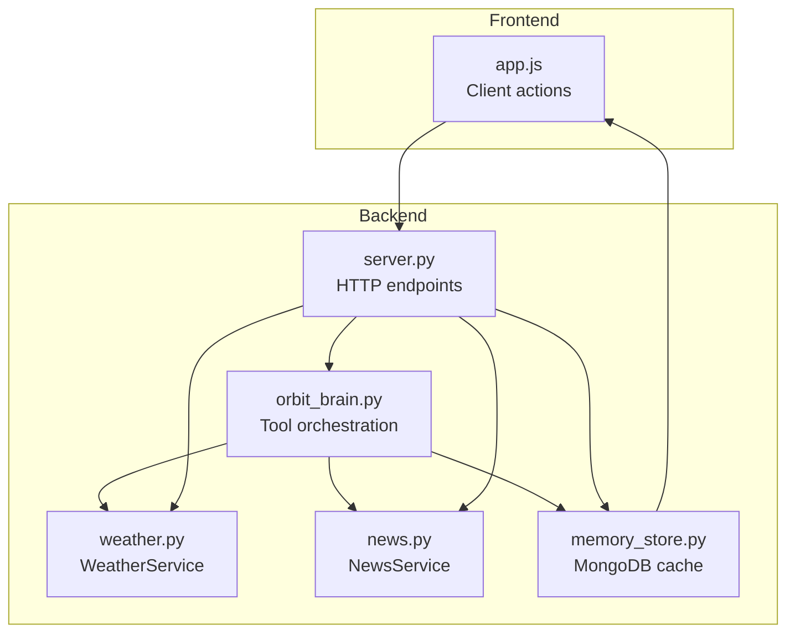
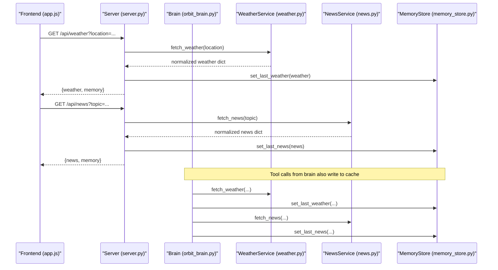
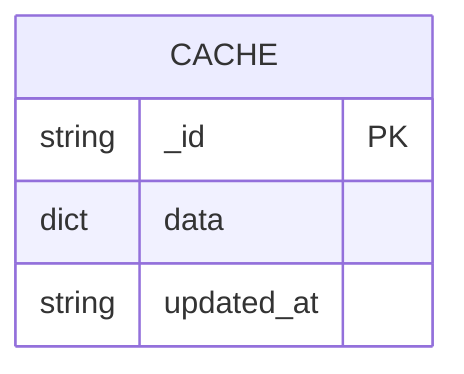
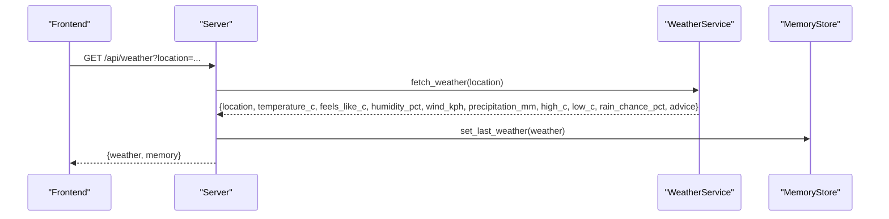
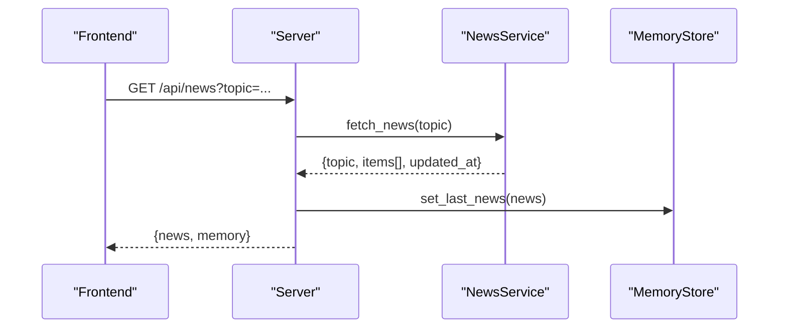
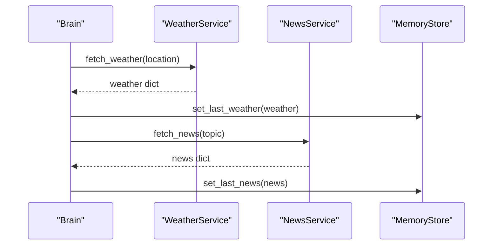
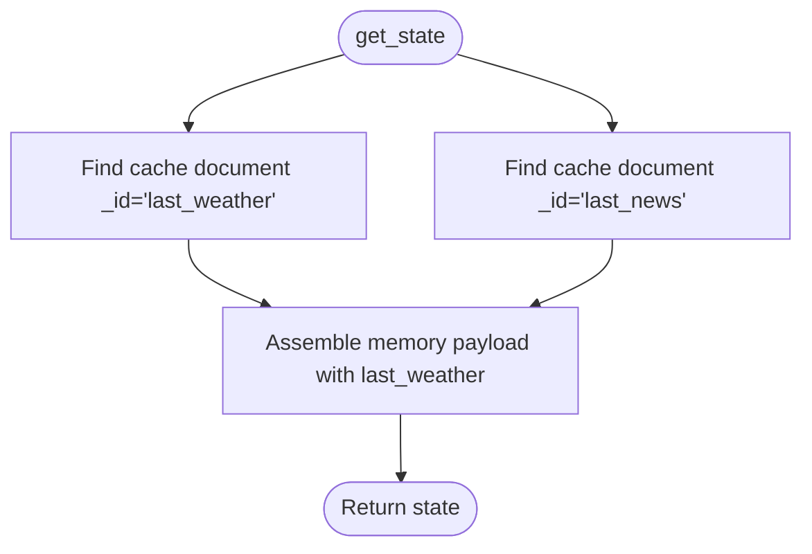
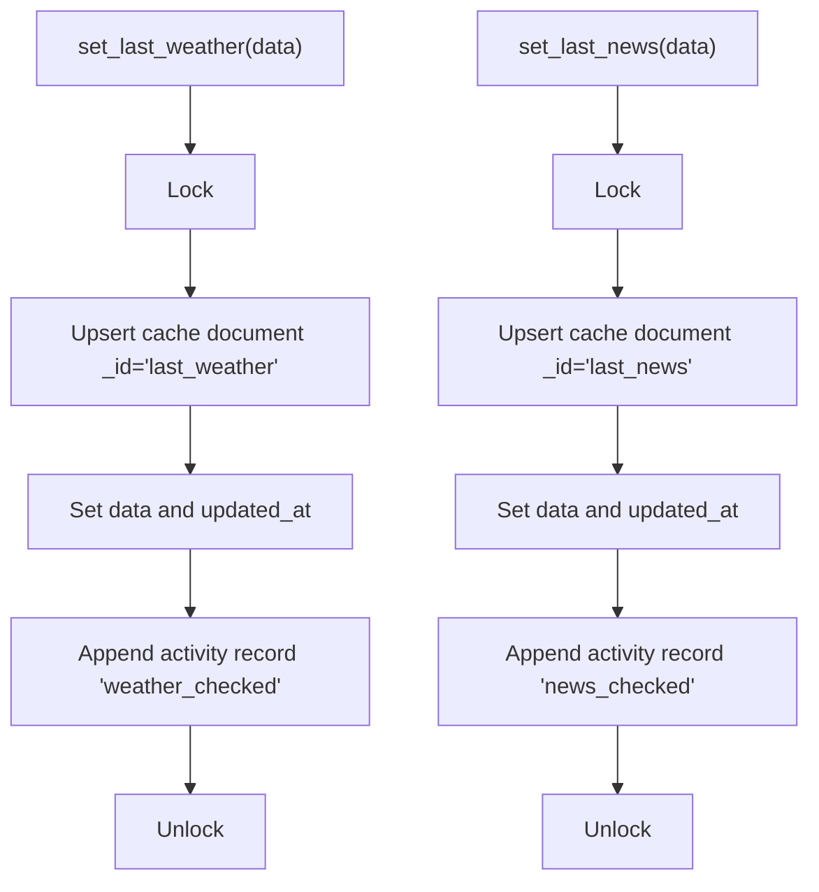
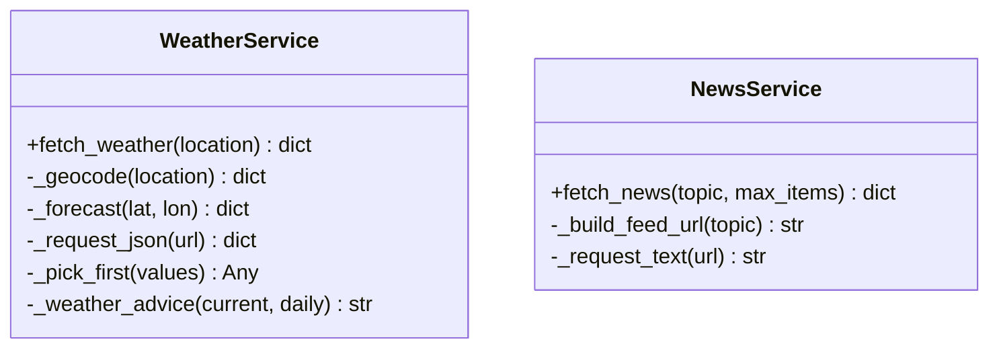
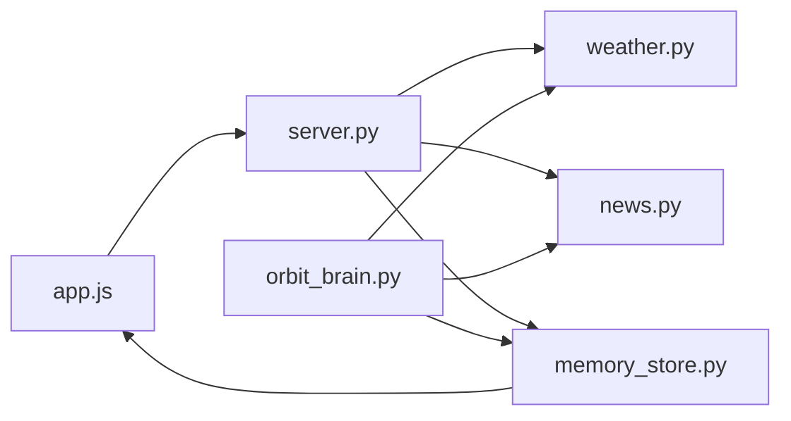

# External Data Caching

<cite>
**Referenced Files in This Document**
- [weather.py](file://backend/tools/weather.py)
- [news.py](file://backend/tools/news.py)
- [memory_store.py](file://backend/core/memory_store.py)
- [orbit_brain.py](file://backend/core/orbit_brain.py)
- [server.py](file://backend/server.py)
- [app.js](file://frontend/scripts/app.js)
- [config.py](file://backend/config.py)
- [README.md](file://README.md)
</cite>

## Table of Contents
1. [Introduction](#introduction)
2. [Project Structure](#project-structure)
3. [Core Components](#core-components)
4. [Architecture Overview](#architecture-overview)
5. [Detailed Component Analysis](#detailed-component-analysis)
6. [Dependency Analysis](#dependency-analysis)
7. [Performance Considerations](#performance-considerations)
8. [Troubleshooting Guide](#troubleshooting-guide)
9. [Conclusion](#conclusion)

## Introduction
This document explains the external data caching system used to store and serve weather and news data. It covers the cache collection structure, data schema, update patterns, cache management operations, integration with external services, and cache retrieval patterns. It also addresses cache invalidation strategies, consistency, stale data handling, and the performance benefits of caching external API responses.

## Project Structure
The caching system spans the backend tools that fetch external data, the server endpoints that expose them, the brain that orchestrates tool calls, and the frontend that triggers and renders cached data.

**Diagram sources**
- [server.py:145-164](file://backend/server.py#L145-L164)
- [orbit_brain.py:389-412](file://backend/core/orbit_brain.py#L389-L412)
- [weather.py:47-141](file://backend/tools/weather.py#L47-L141)
- [news.py:21-83](file://backend/tools/news.py#L21-L83)
- [memory_store.py:475-495](file://backend/core/memory_store.py#L475-L495)

**Section sources**
- [README.md:164-201](file://README.md#L164-L201)

## Core Components
- WeatherService: Fetches current weather and daily forecasts from an external weather API and returns a normalized dictionary.
- NewsService: Fetches latest news headlines from Google News RSS feeds and returns a normalized dictionary with items and metadata.
- MemoryStore: Provides a MongoDB-backed cache collection for storing the last weather and last news entries, along with timestamps and activity records.
- Server endpoints: Expose /api/weather and /api/news, invoking services and persisting results to cache.
- Tool orchestration: The brain’s run_tool_call function invokes weather and news tools and persists results to cache.
- Frontend integration: The client fetches weather and news via the server and updates the UI using cached data.

**Section sources**
- [weather.py:47-141](file://backend/tools/weather.py#L47-L141)
- [news.py:21-83](file://backend/tools/news.py#L21-L83)
- [memory_store.py:475-495](file://backend/core/memory_store.py#L475-L495)
- [server.py:145-164](file://backend/server.py#L145-L164)
- [orbit_brain.py:389-412](file://backend/core/orbit_brain.py#L389-L412)
- [app.js:1403-1432](file://frontend/scripts/app.js#L1403-L1432)

## Architecture Overview
The external data caching architecture follows a simple pattern:
- External services are invoked by either the server endpoints or the brain’s tool dispatcher.
- Results are normalized and persisted to the MongoDB cache collection.
- Cached data is retrieved by the brain’s get_state/get_brief methods and included in the memory payload.
- The frontend consumes the memory payload to render weather and news cards.

**Diagram sources**
- [server.py:145-164](file://backend/server.py#L145-L164)
- [weather.py:51-75](file://backend/tools/weather.py#L51-L75)
- [news.py:25-60](file://backend/tools/news.py#L25-L60)
- [memory_store.py:475-495](file://backend/core/memory_store.py#L475-L495)
- [orbit_brain.py:405-412](file://backend/core/orbit_brain.py#L405-L412)

## Detailed Component Analysis

### Cache Collection and Schema
The cache collection stores the last weather and last news entries as single documents keyed by identifiers. The schema is minimal and consistent across both entries.

- Collection: cache
- Documents:
  - _id: "last_weather" | "last_news"
  - data: dict (normalized external data)
  - updated_at: ISO string timestamp

**Diagram sources**
- [memory_store.py:48-49](file://backend/core/memory_store.py#L48-L49)

**Section sources**
- [memory_store.py:48-49](file://backend/core/memory_store.py#L48-L49)
- [memory_store.py:475-495](file://backend/core/memory_store.py#L475-L495)

### Weather Data Caching
- Population: The server endpoint /api/weather calls WeatherService.fetch_weather and persists the result via MemoryStore.set_last_weather.
- Retrieval: get_state/get_brief fetch the cached weather document and include it in the memory payload.
- Frontend: The client calls /api/weather and updates the UI with the returned weather and memory.

**Diagram sources**
- [server.py:145-154](file://backend/server.py#L145-L154)
- [weather.py:51-75](file://backend/tools/weather.py#L51-L75)
- [memory_store.py:475-484](file://backend/core/memory_store.py#L475-L484)

**Section sources**
- [server.py:145-154](file://backend/server.py#L145-L154)
- [weather.py:51-75](file://backend/tools/weather.py#L51-L75)
- [memory_store.py:475-484](file://backend/core/memory_store.py#L475-L484)
- [app.js:1403-1416](file://frontend/scripts/app.js#L1403-L1416)

### News Data Caching
- Population: The server endpoint /api/news calls NewsService.fetch_news and persists the result via MemoryStore.set_last_news.
- Retrieval: get_state/get_brief fetch the cached news document and include it in the memory payload.
- Frontend: The client calls /api/news and updates the UI with the returned news and memory.

**Diagram sources**
- [server.py:155-164](file://backend/server.py#L155-L164)
- [news.py:25-60](file://backend/tools/news.py#L25-L60)
- [memory_store.py:486-495](file://backend/core/memory_store.py#L486-L495)

**Section sources**
- [server.py:155-164](file://backend/server.py#L155-L164)
- [news.py:25-60](file://backend/tools/news.py#L25-L60)
- [memory_store.py:486-495](file://backend/core/memory_store.py#L486-L495)
- [app.js:1418-1432](file://frontend/scripts/app.js#L1418-L1432)

### Tool Orchestration and Cache Updates
When the brain executes tool calls, it also writes to cache:
- get_weather: calls WeatherService.fetch_weather and MemoryStore.set_last_weather.
- get_latest_news: calls NewsService.fetch_news and MemoryStore.set_last_news.

**Diagram sources**
- [orbit_brain.py:405-412](file://backend/core/orbit_brain.py#L405-L412)
- [weather.py:51-75](file://backend/tools/weather.py#L51-L75)
- [news.py:25-60](file://backend/tools/news.py#L25-L60)
- [memory_store.py:475-495](file://backend/core/memory_store.py#L475-L495)

**Section sources**
- [orbit_brain.py:405-412](file://backend/core/orbit_brain.py#L405-L412)

### Cache Retrieval Patterns
- get_state: fetches the last weather and last news documents from the cache collection and includes them in the memory payload.
- get_brief: builds a brief snapshot that includes last_weather and last_news.

**Diagram sources**
- [memory_store.py:201-202](file://backend/core/memory_store.py#L201-L202)
- [memory_store.py:246-247](file://backend/core/memory_store.py#L246-L247)

**Section sources**
- [memory_store.py:188-250](file://backend/core/memory_store.py#L188-L250)
- [memory_store.py:256-276](file://backend/core/memory_store.py#L256-L276)

### Cache Management Operations
- Upsert semantics: set_last_weather and set_last_news use upsert to create or update the cache documents atomically.
- Timestamping: updated_at is set to UTC ISO string on each update.
- Activity tracking: each cache write triggers an activity record for auditing.

**Diagram sources**
- [memory_store.py:475-495](file://backend/core/memory_store.py#L475-L495)

**Section sources**
- [memory_store.py:475-495](file://backend/core/memory_store.py#L475-L495)

### Integration with External Services
- WeatherService: Geocodes a location, queries the weather API for current and daily metrics, and normalizes the response.
- NewsService: Builds a Google News RSS URL based on topic, fetches XML, parses items, and normalizes the response.

**Diagram sources**
- [weather.py:47-141](file://backend/tools/weather.py#L47-L141)
- [news.py:21-83](file://backend/tools/news.py#L21-L83)

**Section sources**
- [weather.py:47-141](file://backend/tools/weather.py#L47-L141)
- [news.py:21-83](file://backend/tools/news.py#L21-L83)

### Cache Invalidation Strategies
- No explicit TTL or expiry: The cache documents are updated on each successful fetch; there is no scheduled eviction or TTL.
- Manual clearing: There is no dedicated cache-clearing operation exposed in the current code.
- Replacement by new data: Each set_last_* replaces the previous cache entry; stale data is overwritten by fresh data.

**Section sources**
- [memory_store.py:475-495](file://backend/core/memory_store.py#L475-L495)

### Cache Consistency and Stale Data Handling
- Consistency: The cache is updated atomically within a lock and includes an updated_at timestamp. Reads fetch the latest cached documents.
- Stale handling: There is no built-in staleness detection or refresh policy. Consumers rely on the latest cached data; to force freshness, clients can trigger new fetches via /api/weather or /api/news.

**Section sources**
- [memory_store.py:475-495](file://backend/core/memory_store.py#L475-L495)

### Cache-Based Decision Making
- The brain’s tool calls and server endpoints both write to cache, ensuring that downstream decisions (e.g., rendering UI, generating advice) use the most recent external data.
- The frontend can trigger new fetches to update the cache and reflect changes in the UI.

**Section sources**
- [orbit_brain.py:405-412](file://backend/core/orbit_brain.py#L405-L412)
- [server.py:145-164](file://backend/server.py#L145-L164)
- [app.js:1403-1432](file://frontend/scripts/app.js#L1403-L1432)

## Dependency Analysis
The caching system depends on:
- External services (WeatherService, NewsService) for data population.
- MemoryStore for persistence and retrieval.
- Server endpoints and brain orchestration for triggering cache writes.
- Frontend for initiating requests and rendering cached data.

**Diagram sources**
- [server.py:145-164](file://backend/server.py#L145-L164)
- [weather.py:47-141](file://backend/tools/weather.py#L47-L141)
- [news.py:21-83](file://backend/tools/news.py#L21-L83)
- [memory_store.py:475-495](file://backend/core/memory_store.py#L475-L495)
- [orbit_brain.py:389-412](file://backend/core/orbit_brain.py#L389-L412)
- [app.js:1403-1432](file://frontend/scripts/app.js#L1403-L1432)

**Section sources**
- [server.py:145-164](file://backend/server.py#L145-L164)
- [orbit_brain.py:389-412](file://backend/core/orbit_brain.py#L389-L412)
- [memory_store.py:475-495](file://backend/core/memory_store.py#L475-L495)

## Performance Considerations
- Reduced network latency: Cached data avoids repeated external API calls for the same location/topic within a short timeframe.
- Lower API costs: Reusing cached data reduces the number of external requests, helping control API usage.
- Atomic updates: Writes are protected by a lock and upsert semantics minimize race conditions.
- Indexing: The cache collection is not explicitly indexed in the shown schema; adding an index on updated_at could improve audit queries.

[No sources needed since this section provides general guidance]

## Troubleshooting Guide
Common issues and resolutions:
- External service errors:
  - WeatherError and NewsError are raised when external services are unavailable or return malformed data. The server responds with an error payload and HTTP status indicating bad request.
- Empty or missing data:
  - If geocoding returns no results or RSS parsing fails, the respective service raises an error. Ensure the location or topic is valid.
- Cache not updating:
  - Verify that set_last_weather/set_last_news are called after successful fetches. Confirm that the cache collection exists and is writable.
- Frontend not reflecting updates:
  - Ensure the client calls /api/weather or /api/news and updates the appState.memory accordingly.

**Section sources**
- [weather.py:131-141](file://backend/tools/weather.py#L131-L141)
- [news.py:33-34](file://backend/tools/news.py#L33-L34)
- [server.py:152-153](file://backend/server.py#L152-L153)
- [server.py:162-163](file://backend/server.py#L162-L163)

## Conclusion
The external data caching system provides a simple, robust mechanism to store and serve weather and news data. It uses a minimal MongoDB cache schema, atomic upserts with timestamps, and integrates seamlessly with server endpoints and brain tool calls. While there is no explicit TTL or staleness policy, the design ensures that fresh data replaces stale entries, and consumers can trigger new fetches to keep the cache current. This approach improves system responsiveness by reducing external API calls and enhances user experience by providing quick access to recent weather and news.