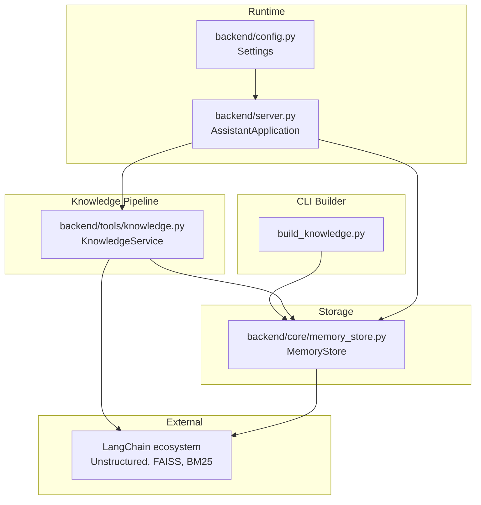
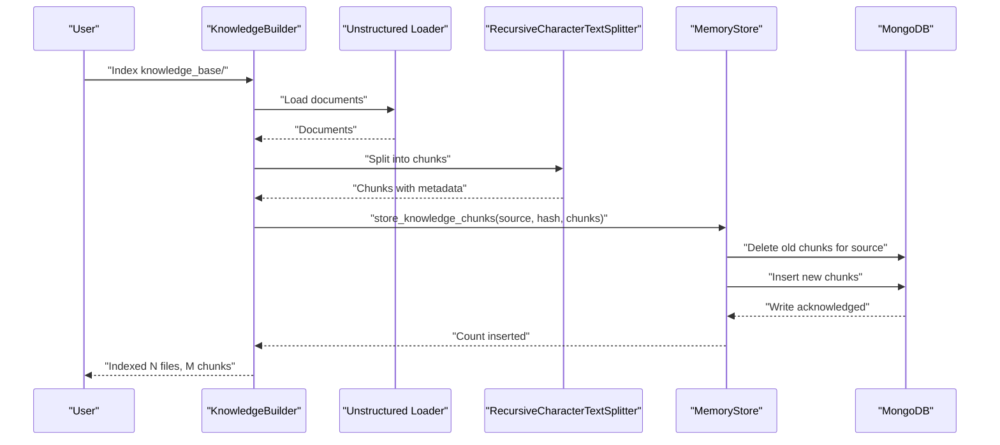
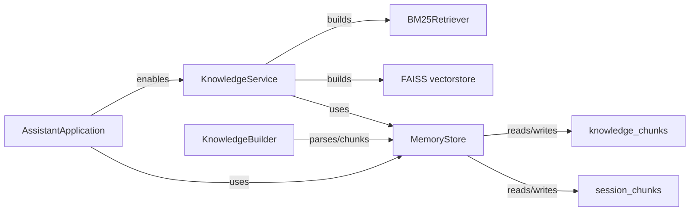

# Knowledge Chunk Storage

<cite>
**Referenced Files in This Document**
- [build_knowledge.py](file://build_knowledge.py)
- [backend/tools/knowledge.py](file://backend/tools/knowledge.py)
- [backend/core/memory_store.py](file://backend/core/memory_store.py)
- [backend/server.py](file://backend/server.py)
- [backend/config.py](file://backend/config.py)
- [requirements.txt](file://requirements.txt)
- [README.md](file://README.md)
</cite>

## Table of Contents
1. [Introduction](#introduction)
2. [Project Structure](#project-structure)
3. [Core Components](#core-components)
4. [Architecture Overview](#architecture-overview)
5. [Detailed Component Analysis](#detailed-component-analysis)
6. [Dependency Analysis](#dependency-analysis)
7. [Performance Considerations](#performance-considerations)
8. [Troubleshooting Guide](#troubleshooting-guide)
9. [Conclusion](#conclusion)

## Introduction
This document explains the knowledge chunk storage and Retrieval-Augmented Generation (RAG) functionality in the Orbit Virtual Assistant. It covers the MongoDB schema for knowledge chunks, chunk indexing and replacement semantics, file hash management, and the end-to-end workflows for storing and retrieving chunks. It also details bulk operations, file-based chunk management, maintenance procedures, and integration with the knowledge processing pipeline.

## Project Structure
The RAG system spans several modules:
- Standalone builder for indexing local documents
- Knowledge service for startup indexing and runtime retrieval
- Memory store for persistent chunk storage and retrieval
- Server integration for enabling RAG at startup and handling session-scoped document indexing

**Diagram sources**
- [build_knowledge.py:1-437](file://build_knowledge.py#L1-L437)
- [backend/tools/knowledge.py:1-393](file://backend/tools/knowledge.py#L1-L393)
- [backend/core/memory_store.py:1-947](file://backend/core/memory_store.py#L1-L947)
- [backend/server.py:1-611](file://backend/server.py#L1-L611)
- [backend/config.py:1-76](file://backend/config.py#L1-L76)

**Section sources**
- [README.md:164-201](file://README.md#L164-L201)

## Core Components
- KnowledgeBuilder: Scans a directory, computes diffs against stored file hashes, parses and chunks files, and stores them in MongoDB. Supports incremental updates, rebuilds, and dry runs.
- KnowledgeService: Initializes persistent knowledge base at startup, builds hybrid retrievers (BM25 + FAISS), and supports session-scoped document search.
- MemoryStore: Provides MongoDB-backed storage for knowledge_chunks and session_chunks, with indexes and bulk operations for chunk management.
- Server: Integrates KnowledgeService and MemoryStore, enabling RAG at startup and handling per-session document indexing.

**Section sources**
- [build_knowledge.py:61-211](file://build_knowledge.py#L61-L211)
- [backend/tools/knowledge.py:88-393](file://backend/tools/knowledge.py#L88-L393)
- [backend/core/memory_store.py:67-150](file://backend/core/memory_store.py#L67-L150)
- [backend/server.py:23-63](file://backend/server.py#L23-L63)

## Architecture Overview
The RAG pipeline consists of:
- Document ingestion: Files are scanned, parsed, split into chunks, and associated with a source identifier and file hash.
- Chunk storage: Chunks are stored in MongoDB with metadata and indexes for efficient retrieval.
- Retrieval: At startup, all chunks are loaded and a hybrid retriever (BM25 + FAISS) is constructed. Runtime queries use this retriever to return relevant chunks with source attribution.

**Diagram sources**
- [build_knowledge.py:119-166](file://build_knowledge.py#L119-L166)
- [backend/core/memory_store.py:704-725](file://backend/core/memory_store.py#L704-L725)

## Detailed Component Analysis

### KnowledgeBuilder
Responsibilities:
- Directory scanning for supported file types
- File hash comparison to detect new/changed/removed files
- Parsing and chunking using LangChain
- Bulk insertion of chunks with replacement semantics
- Optional verification via BM25 retriever

Key behaviors:
- Scans recursively and filters by supported extensions
- Computes MD5 hashes per file to detect changes
- Deletes all existing chunks for a source file before inserting new ones
- Builds a BM25 retriever for verification

**Section sources**
- [build_knowledge.py:75-116](file://build_knowledge.py#L75-L116)
- [build_knowledge.py:119-166](file://build_knowledge.py#L119-L166)
- [build_knowledge.py:178-206](file://build_knowledge.py#L178-L206)

### KnowledgeService
Responsibilities:
- Startup initialization: scans knowledge_base, detects changes, indexes new/changed files, removes stale chunks, builds hybrid retrievers
- Runtime search: executes queries against the knowledge base retriever
- Session-scoped indexing: parses and indexes attachments for a specific session
- Caching: maintains per-session retrievers and invalidates them when needed

Hybrid retriever construction:
- BM25 retriever from all knowledge chunks
- Optional FAISS vectorstore built from the same documents when embeddings are available
- EnsembleRetriever combines BM25 and FAISS with configurable weights

**Section sources**
- [backend/tools/knowledge.py:145-230](file://backend/tools/knowledge.py#L145-L230)
- [backend/tools/knowledge.py:231-264](file://backend/tools/knowledge.py#L231-L264)
- [backend/tools/knowledge.py:270-298](file://backend/tools/knowledge.py#L270-L298)
- [backend/tools/knowledge.py:303-387](file://backend/tools/knowledge.py#L303-L387)

### MemoryStore
Schema and indexes:
- knowledge_chunks: chunk_id, source_file, file_hash, chunk_index, text, metadata, created_at
- session_chunks: chunk_id, attachment_id, session_id, chunk_index, text, metadata, created_at
- Indexes: unique chunk_id, source_file, file_hash for knowledge_chunks; indexes for session_chunks

Chunk storage workflow:
- store_knowledge_chunks(source_file, file_hash, chunks):
  - Delete all existing chunks for source_file
  - Insert new chunks with sequential chunk_index
- get_all_knowledge_chunks(): returns sorted chunks for retriever initialization
- delete_knowledge_file(source_file): removes all chunks for a given source
- clear_all_knowledge_chunks(): drops collection and re-ensures indexes

Bulk operations:
- insert_many for session_chunks during per-session indexing
- aggregation pipeline to fetch {source_file: file_hash} mapping for diff computation

**Section sources**
- [backend/core/memory_store.py:51-62](file://backend/core/memory_store.py#L51-L62)
- [backend/core/memory_store.py:119-135](file://backend/core/memory_store.py#L119-L135)
- [backend/core/memory_store.py:695-748](file://backend/core/memory_store.py#L695-L748)
- [backend/core/memory_store.py:802-830](file://backend/core/memory_store.py#L802-L830)

### Server Integration
- AssistantApplication constructs KnowledgeService with docs_dir and upload_dir
- Enables RAG at startup by passing a knowledge_base path
- Handles per-session document uploads and indexes them for session-scoped search

**Section sources**
- [backend/server.py:23-63](file://backend/server.py#L23-L63)
- [backend/server.py:329-394](file://backend/server.py#L329-L394)

### File Hash Management
- _file_hash computes MD5 of file content for change detection
- KnowledgeBuilder compares disk hashes with stored hashes to classify files
- MemoryStore exposes get_knowledge_file_hashes for diff computation

**Section sources**
- [backend/tools/knowledge.py:70-76](file://backend/tools/knowledge.py#L70-L76)
- [build_knowledge.py:90-115](file://build_knowledge.py#L90-L115)
- [backend/core/memory_store.py:695-702](file://backend/core/memory_store.py#L695-L702)

### Retrieval Patterns
- Startup: KnowledgeService loads all knowledge_chunks and builds a hybrid retriever
- Runtime: Queries invoke the retriever and return concatenated contexts with source attribution
- Session-scoped: Attachments are indexed separately and searched independently

**Section sources**
- [backend/tools/knowledge.py:220-230](file://backend/tools/knowledge.py#L220-L230)
- [backend/tools/knowledge.py:270-298](file://backend/tools/knowledge.py#L270-L298)
- [backend/tools/knowledge.py:337-355](file://backend/tools/knowledge.py#L337-L355)

### Vector Search Integration
- FAISS vectorstore built from documents when embeddings are available
- Distance strategy configured for cosine similarity
- Hybrid retriever uses MMR with fetch_k and lambda_mult for diversity

**Section sources**
- [backend/tools/knowledge.py:243-257](file://backend/tools/knowledge.py#L243-L257)
- [backend/tools/knowledge.py:379-381](file://backend/tools/knowledge.py#L379-L381)

### Replacement Semantics
- For a given source_file, all existing chunks are deleted before new chunks are inserted
- Ensures that updates to a file replace the entire prior chunk set atomically from the perspective of retrieval

**Section sources**
- [backend/core/memory_store.py:707-725](file://backend/core/memory_store.py#L707-L725)

### Bulk Operations and Maintenance
- KnowledgeBuilder.index_files performs batch inserts for multiple files
- MemoryStore.clear_all_knowledge_chunks drops and reindexes the collection
- KnowledgeBuilder.remove_stale deletes chunks for removed files

**Section sources**
- [build_knowledge.py:119-166](file://build_knowledge.py#L119-L166)
- [build_knowledge.py:170-174](file://build_knowledge.py#L170-L174)
- [backend/core/memory_store.py:742-748](file://backend/core/memory_store.py#L742-L748)

### Examples

#### Example: Build Knowledge Base
- Command-line usage to scan, compare, and index documents
- Optional rebuild, clear, dry-run modes
- Verification via BM25 retriever

**Section sources**
- [build_knowledge.py:8-13](file://build_knowledge.py#L8-L13)
- [build_knowledge.py:273-428](file://build_knowledge.py#L273-L428)

#### Example: Startup RAG Initialization
- KnowledgeService scans knowledge_base, computes diffs, indexes new/changed files, removes stale chunks
- Builds hybrid retriever and caches it for subsequent queries

**Section sources**
- [backend/tools/knowledge.py:145-230](file://backend/tools/knowledge.py#L145-L230)

#### Example: Session-Scoped Document Search
- Upload a file attachment, parse and index it, then search within that session’s documents

**Section sources**
- [backend/server.py:329-394](file://backend/server.py#L329-L394)
- [backend/tools/knowledge.py:303-355](file://backend/tools/knowledge.py#L303-L355)

## Dependency Analysis
External libraries and their roles:
- LangChain ecosystem: document loaders, text splitters, FAISS, BM25, EnsembleRetriever
- MongoDB: persistence for chunks and session chunks
- FAISS: vector similarity search
- rank-bm25: BM25 keyword-based retrieval

**Diagram sources**
- [backend/core/memory_store.py:51-62](file://backend/core/memory_store.py#L51-L62)
- [backend/tools/knowledge.py:231-264](file://backend/tools/knowledge.py#L231-L264)
- [requirements.txt:22-28](file://requirements.txt#L22-L28)

**Section sources**
- [requirements.txt:18-28](file://requirements.txt#L18-L28)

## Performance Considerations
- Chunk size and overlap: tuned for readability and recall trade-offs
- Indexing strategy: MD5 hashing for O(n) diff computation; MongoDB indexes on source_file and file_hash
- Retrieval: Hybrid BM25 + FAISS improves precision and recall; MMR parameters balance diversity and relevance
- Concurrency: MemoryStore uses thread locks around write operations to ensure consistency

[No sources needed since this section provides general guidance]

## Troubleshooting Guide
Common issues and resolutions:
- Missing RAG dependencies: install optional packages for LangChain, FAISS, and unstructured
- MongoDB connectivity: ensure the server is reachable and credentials are correct
- Embedding availability: LM Studio must be running and reachable for FAISS builds
- File parsing errors: unsupported formats or corrupted files will fail during chunking; verify file types and content
- Retrieval verification failures: ensure knowledge base is built and contains chunks

**Section sources**
- [requirements.txt:18-28](file://requirements.txt#L18-L28)
- [backend/core/memory_store.py:86-98](file://backend/core/memory_store.py#L86-L98)
- [backend/tools/knowledge.py:122-138](file://backend/tools/knowledge.py#L122-L138)
- [build_knowledge.py:37-39](file://build_knowledge.py#L37-L39)

## Conclusion
The Orbit Virtual Assistant implements a robust, production-ready knowledge chunk storage and RAG pipeline. It provides efficient indexing, reliable file-hash-based change detection, atomic replacement semantics, and flexible retrieval via hybrid BM25 + FAISS. The system supports both persistent knowledge base and session-scoped document search, with clear maintenance procedures for rebuilding and verifying the knowledge base.