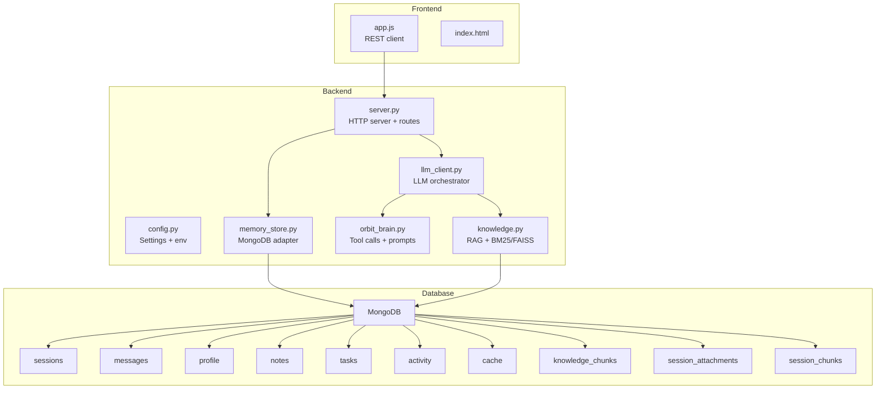
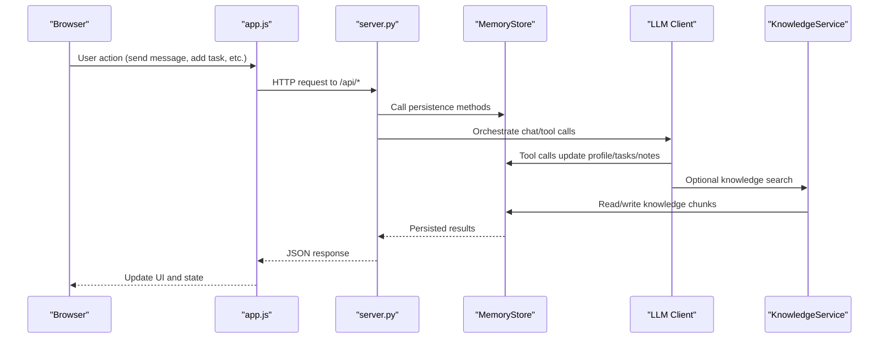
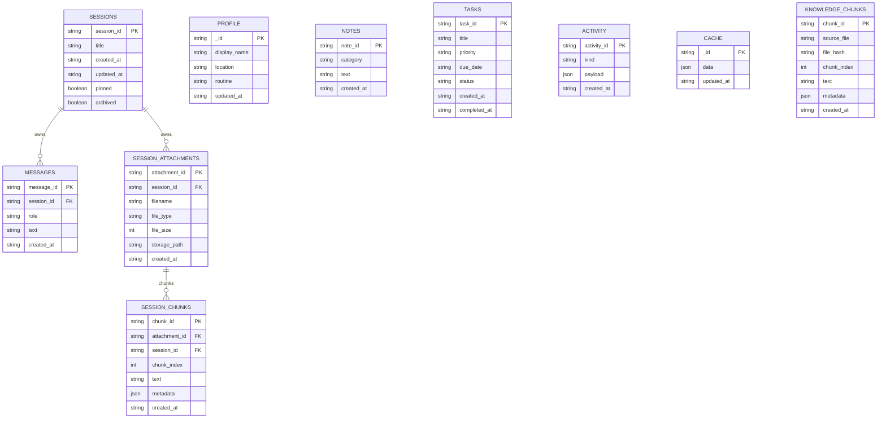
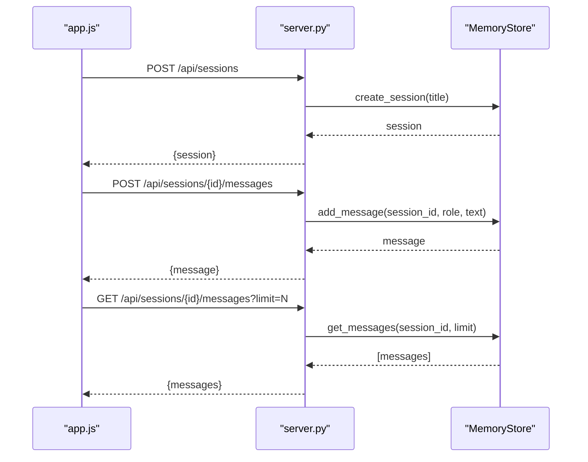
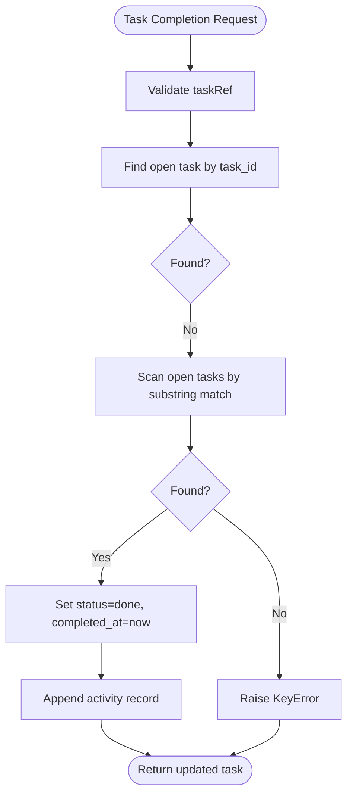
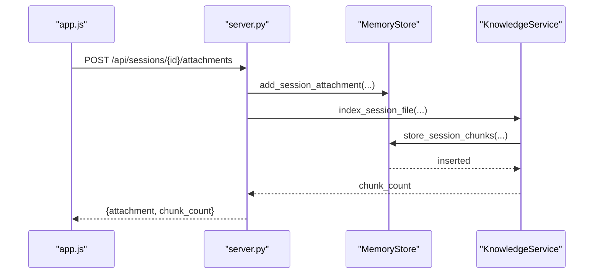
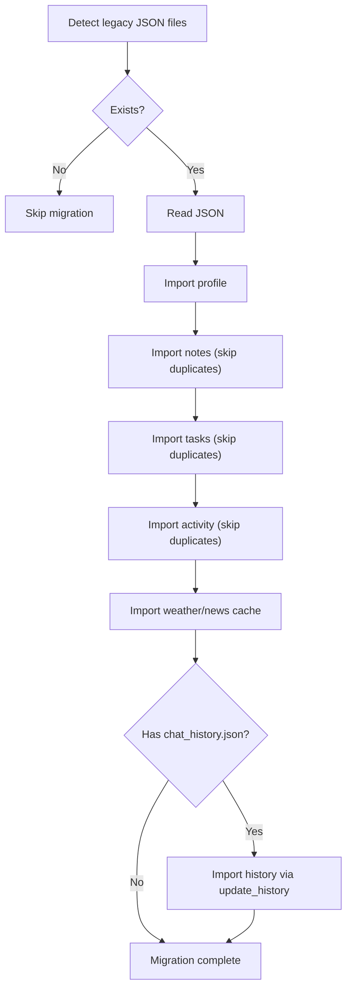
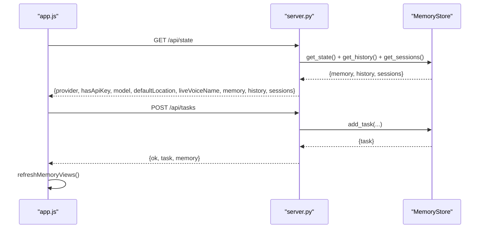
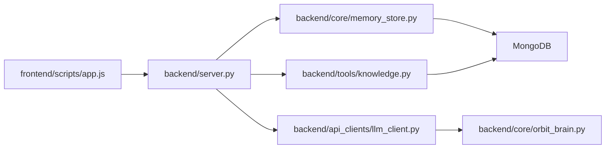

# Memory Management and Persistence

<cite>
**Referenced Files in This Document**
- [memory_store.py](file://backend/core/memory_store.py)
- [server.py](file://backend/server.py)
- [config.py](file://backend/config.py)
- [llm_client.py](file://backend/api_clients/llm_client.py)
- [orbit_brain.py](file://backend/core/orbit_brain.py)
- [knowledge.py](file://backend/tools/knowledge.py)
- [app.js](file://frontend/scripts/app.js)
- [index.html](file://frontend/index.html)
- [assistant_memory.json.bak](file://data/assistant_memory.json.bak)
</cite>

## Table of Contents
1. [Introduction](#introduction)
2. [Project Structure](#project-structure)
3. [Core Components](#core-components)
4. [Architecture Overview](#architecture-overview)
5. [Detailed Component Analysis](#detailed-component-analysis)
6. [Dependency Analysis](#dependency-analysis)
7. [Performance Considerations](#performance-considerations)
8. [Troubleshooting Guide](#troubleshooting-guide)
9. [Conclusion](#conclusion)
10. [Appendices](#appendices)

## Introduction
This document explains the memory management and persistence layer of the Orbit Virtual Assistant. It covers the MongoDB integration, data schemas, migration from legacy JSON storage, session/message management, user profiles, tasks, notes, caching, knowledge indexing, and the synchronization model between the backend and the frontend. It also details query patterns, indexing strategies, performance optimization, and operational considerations such as data integrity and backups.

## Project Structure
The persistence layer spans three primary areas:
- Backend core: MongoDB-backed MemoryStore and server orchestration
- Tools: Knowledge base indexing and retrieval
- Frontend: Real-time synchronization via REST APIs

**Diagram sources**
- [server.py:23-611](file://backend/server.py#L23-L611)
- [memory_store.py:67-116](file://backend/core/memory_store.py#L67-L116)
- [config.py:20-76](file://backend/config.py#L20-L76)
- [llm_client.py:38-366](file://backend/api_clients/llm_client.py#L38-L366)
- [orbit_brain.py:14-502](file://backend/core/orbit_brain.py#L14-L502)
- [knowledge.py:88-393](file://backend/tools/knowledge.py#L88-L393)

**Section sources**
- [server.py:23-611](file://backend/server.py#L23-L611)
- [memory_store.py:67-116](file://backend/core/memory_store.py#L67-L116)
- [config.py:20-76](file://backend/config.py#L20-L76)

## Core Components
- MemoryStore: MongoDB-backed persistence layer with backward-compatible APIs mirroring the old JSON interface. Provides CRUD and aggregation helpers for sessions, messages, notes, tasks, profile, cache, knowledge chunks, and attachments/chunks.
- AssistantApplication: HTTP server that initializes MemoryStore, exposes REST endpoints, and orchestrates LLM interactions and tool calls.
- KnowledgeService: Manages persistent knowledge base indexing and session-scoped document search using BM25 and optional FAISS hybrid retrieval.
- Frontend app.js: Implements real-time state synchronization, session/message CRUD, and tool-triggered persistence.

**Section sources**
- [memory_store.py:67-947](file://backend/core/memory_store.py#L67-L947)
- [server.py:23-611](file://backend/server.py#L23-L611)
- [knowledge.py:88-393](file://backend/tools/knowledge.py#L88-L393)
- [app.js:902-1087](file://frontend/scripts/app.js#L902-L1087)

## Architecture Overview
The system integrates a REST API with MongoDB for persistence. The frontend polls and pushes state via endpoints, while the backend maintains thread-safe access to MongoDB through MemoryStore. LLM orchestration triggers tool calls that persist updates to the memory store.

**Diagram sources**
- [server.py:85-501](file://backend/server.py#L85-L501)
- [memory_store.py:67-947](file://backend/core/memory_store.py#L67-L947)
- [llm_client.py:38-366](file://backend/api_clients/llm_client.py#L38-L366)
- [knowledge.py:88-393](file://backend/tools/knowledge.py#L88-L393)
- [app.js:902-1087](file://frontend/scripts/app.js#L902-L1087)

## Detailed Component Analysis

### MongoDB Integration and Schemas
MemoryStore encapsulates collections for sessions, messages, profile, notes, tasks, activity, cache, knowledge_chunks, session_attachments, and session_chunks. It enforces unique indexes and composite indexes for efficient queries.

**Diagram sources**
- [memory_store.py:24-62](file://backend/core/memory_store.py#L24-L62)
- [memory_store.py:119-135](file://backend/core/memory_store.py#L119-L135)

**Section sources**
- [memory_store.py:24-62](file://backend/core/memory_store.py#L24-L62)
- [memory_store.py:119-135](file://backend/core/memory_store.py#L119-L135)

### Session and Message Management
- Sessions: Creation, listing, updating (title/pinned/archived), and deletion cascade to messages, attachments, and chunks.
- Messages: Per-session insertion, retrieval with optional limits, and deletion by message_id.
- History bridge: Backward-compatible update_history/get_history for legacy clients.

**Diagram sources**
- [server.py:183-213](file://backend/server.py#L183-L213)
- [server.py:128-135](file://backend/server.py#L128-L135)
- [memory_store.py:579-690](file://backend/core/memory_store.py#L579-L690)

**Section sources**
- [server.py:183-213](file://backend/server.py#L183-L213)
- [server.py:128-135](file://backend/server.py#L128-L135)
- [memory_store.py:579-690](file://backend/core/memory_store.py#L579-L690)

### User Profiles, Tasks, and Notes Persistence
- Profile: Single document under profile collection; updates timestamp and activity log.
- Tasks: CRUD with fuzzy matching for completion/deletion by id or substring of title.
- Notes: CRUD with category and timestamps; activity logging.

**Diagram sources**
- [memory_store.py:377-416](file://backend/core/memory_store.py#L377-L416)

**Section sources**
- [memory_store.py:282-304](file://backend/core/memory_store.py#L282-L304)
- [memory_store.py:338-447](file://backend/core/memory_store.py#L338-L447)
- [memory_store.py:448-469](file://backend/core/memory_store.py#L448-L469)

### Weather and News Caching
- Cache collection stores last weather and last news snapshots keyed by _id.
- MemoryStore updates cache and logs activity.

**Section sources**
- [memory_store.py:475-496](file://backend/core/memory_store.py#L475-L496)

### Knowledge Base and Session Documents
- Persistent knowledge base: file hash tracking, replace-on-change semantics, and MongoDB-backed chunk storage.
- Session-scoped documents: attachment registration and chunk indexing for targeted retrieval.

**Diagram sources**
- [server.py:204-209](file://backend/server.py#L204-L209)
- [server.py:329-394](file://backend/server.py#L329-L394)
- [knowledge.py:303-335](file://backend/tools/knowledge.py#L303-L335)
- [memory_store.py:802-830](file://backend/core/memory_store.py#L802-L830)

**Section sources**
- [knowledge.py:145-230](file://backend/tools/knowledge.py#L145-L230)
- [knowledge.py:303-335](file://backend/tools/knowledge.py#L303-L335)
- [memory_store.py:802-830](file://backend/core/memory_store.py#L802-L830)

### Migration from Legacy JSON Storage
- One-time migration reads assistant_memory.json and optional chat_history.json, importing into MongoDB collections.
- Duplicate entries are safely skipped using unique IDs.
- After successful migration, legacy files are renamed to .json.bak.

**Diagram sources**
- [server.py:31-43](file://backend/server.py#L31-L43)
- [memory_store.py:836-947](file://backend/core/memory_store.py#L836-L947)

**Section sources**
- [server.py:31-43](file://backend/server.py#L31-L43)
- [memory_store.py:836-947](file://backend/core/memory_store.py#L836-L947)
- [assistant_memory.json.bak:1-279](file://data/assistant_memory.json.bak#L1-L279)

### Frontend Memory State Synchronization
- Initial state fetch: GET /api/state returns memory, history, and sessions.
- Real-time updates: Tool calls and CRUD operations return updated memory snapshots.
- UI reacts to memory changes and renders tasks, notes, weather, and news.

**Diagram sources**
- [server.py:106-108](file://backend/server.py#L106-L108)
- [server.py:222-233](file://backend/server.py#L222-L233)
- [app.js:902-926](file://frontend/scripts/app.js#L902-L926)
- [app.js:1434-1456](file://frontend/scripts/app.js#L1434-L1456)

**Section sources**
- [app.js:902-926](file://frontend/scripts/app.js#L902-L926)
- [app.js:1434-1456](file://frontend/scripts/app.js#L1434-L1456)
- [server.py:106-108](file://backend/server.py#L106-L108)

## Dependency Analysis
- MemoryStore depends on PyMongo and uses a lock for thread safety.
- AssistantApplication composes MemoryStore, KnowledgeService, and LLM client.
- Frontend app.js depends on server endpoints and updates UI accordingly.

**Diagram sources**
- [server.py:23-611](file://backend/server.py#L23-L611)
- [memory_store.py:67-116](file://backend/core/memory_store.py#L67-L116)
- [llm_client.py:38-366](file://backend/api_clients/llm_client.py#L38-L366)
- [orbit_brain.py:14-502](file://backend/core/orbit_brain.py#L14-L502)
- [knowledge.py:88-393](file://backend/tools/knowledge.py#L88-L393)

**Section sources**
- [server.py:23-611](file://backend/server.py#L23-L611)
- [memory_store.py:67-116](file://backend/core/memory_store.py#L67-L116)
- [llm_client.py:38-366](file://backend/api_clients/llm_client.py#L38-L366)
- [knowledge.py:88-393](file://backend/tools/knowledge.py#L88-L393)

## Performance Considerations
- Indexing strategy:
  - Unique indexes on IDs for fast upserts and lookups.
  - Composite indexes for frequent sorts and filters (e.g., sessions pinned + updated_at, messages session + created_at).
  - Knowledge chunks indexed by source_file and file_hash for change detection and selective rebuilds.
- Aggregation:
  - Knowledge file hash grouping to detect changed files.
  - Activity trimming to a fixed-size capped tail.
- Concurrency:
  - Thread lock around write operations to prevent race conditions.
- Network:
  - Frontend batches tool events and updates UI incrementally.
- Retrieval:
  - Limit message lists with optional limits to reduce payload sizes.
  - Lazy session retriever cache invalidation on attachment deletions.

[No sources needed since this section provides general guidance]

## Troubleshooting Guide
- MongoDB connection failures:
  - MemoryStore raises a runtime error if ping fails; verify URI and DB name in settings.
- Empty payloads:
  - update_history skips empty chat histories to avoid wiping saved data.
- Task operations:
  - Completion and deletion support fuzzy matching by substring; ensure taskRef is not empty.
- Activity overflow:
  - Activity records are trimmed to a fixed maximum; older entries are pruned automatically.
- Migration issues:
  - If legacy JSON exists, migration runs once and renames files to .json.bak; subsequent runs skip migration.

**Section sources**
- [memory_store.py:86-98](file://backend/core/memory_store.py#L86-L98)
- [memory_store.py:501-514](file://backend/core/memory_store.py#L501-L514)
- [memory_store.py:377-396](file://backend/core/memory_store.py#L377-L396)
- [memory_store.py:162-183](file://backend/core/memory_store.py#L162-L183)
- [server.py:31-43](file://backend/server.py#L31-L43)

## Conclusion
The memory management and persistence layer cleanly abstracts MongoDB behind a backward-compatible interface, enabling seamless migration from JSON to MongoDB. It provides robust indexing, concurrency control, and clear separation between global memory (profile, tasks, notes, cache) and session-scoped data (messages, attachments, chunks). The frontend synchronizes state via REST endpoints, ensuring a responsive and coherent user experience.

[No sources needed since this section summarizes without analyzing specific files]

## Appendices

### Query Patterns and Examples
- Retrieve recent tasks and notes:
  - Use get_state() to fetch aggregated memory snapshot.
- Paginate messages:
  - Use get_messages(session_id, limit=N) to constrain results.
- Search knowledge base:
  - Use KnowledgeService.search(query) for persistent knowledge base.
  - Use KnowledgeService.search_session(session_id, query) for session-scoped documents.

**Section sources**
- [memory_store.py:188-250](file://backend/core/memory_store.py#L188-L250)
- [memory_store.py:675-685](file://backend/core/memory_store.py#L675-L685)
- [knowledge.py:270-298](file://backend/tools/knowledge.py#L270-L298)
- [knowledge.py:337-355](file://backend/tools/knowledge.py#L337-L355)

### Data Integrity and Backup
- Integrity:
  - Unique indexes on IDs prevent duplicates.
  - Upserts preserve existing data when migrating.
  - Activity logs provide audit trails for profile, task, note, and media events.
- Backup:
  - Back up MongoDB collections regularly.
  - Preserve assistant_memory.json.bak post-migration for rollback verification.

**Section sources**
- [memory_store.py:119-135](file://backend/core/memory_store.py#L119-L135)
- [server.py:39-43](file://backend/server.py#L39-L43)
- [assistant_memory.json.bak:1-279](file://data/assistant_memory.json.bak#L1-L279)