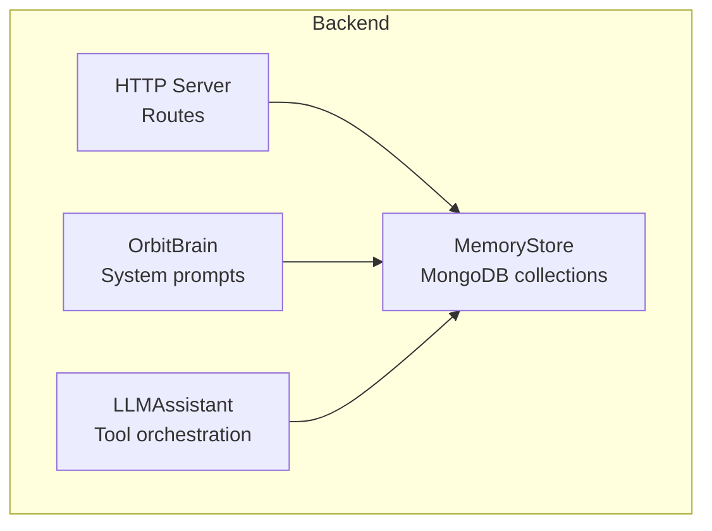
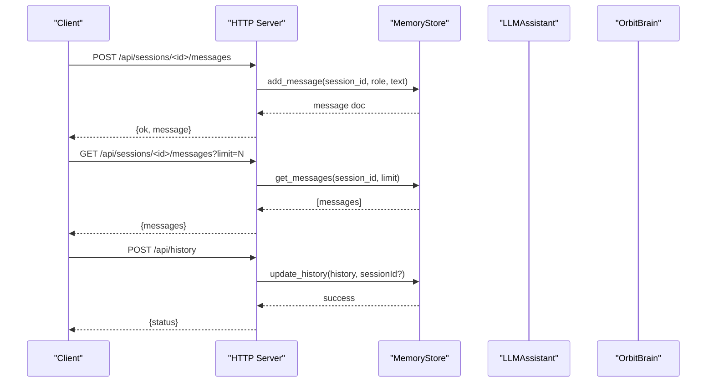
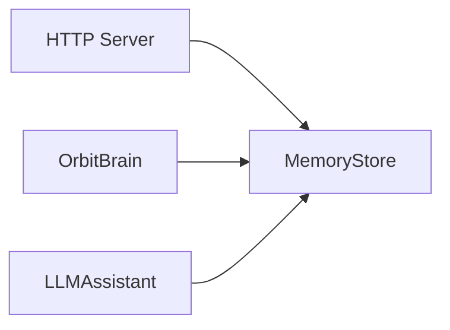

# Message Storage and Retrieval

<cite>
**Referenced Files in This Document**
- [memory_store.py](file://backend/core/memory_store.py)
- [server.py](file://backend/server.py)
- [orbit_brain.py](file://backend/core/orbit_brain.py)
- [llm_client.py](file://backend/api_clients/llm_client.py)
- [config.py](file://backend/config.py)
- [README.md](file://README.md)
</cite>

## Table of Contents
1. [Introduction](#introduction)
2. [Project Structure](#project-structure)
3. [Core Components](#core-components)
4. [Architecture Overview](#architecture-overview)
5. [Detailed Component Analysis](#detailed-component-analysis)
6. [Dependency Analysis](#dependency-analysis)
7. [Performance Considerations](#performance-considerations)
8. [Troubleshooting Guide](#troubleshooting-guide)
9. [Conclusion](#conclusion)
10. [Appendices](#appendices)

## Introduction
This document explains the message storage and retrieval mechanisms powering the assistant’s chat history. It covers the MongoDB schema for messages, role-based categorization, temporal ordering, CRUD operations, batch operations for chat history, and efficient retrieval patterns. It also details the relationship between messages and sessions, filtering, pagination, limit-based queries, legacy history bridge functionality, and modern per-message operations. Practical examples are included for inserting messages, retrieving by session, chronological ordering, and bulk operations. Finally, it addresses validation, empty text handling, and performance optimization for large conversation histories.

## Project Structure
The message system is implemented in the backend core and exposed via HTTP endpoints:
- MemoryStore encapsulates MongoDB collections for sessions, messages, and related entities.
- HTTP server routes map to MemoryStore operations for sessions and messages.
- LLM orchestration builds system instructions and manages tool calls that persist memory updates.

**Diagram sources**
- [memory_store.py:67-117](file://backend/core/memory_store.py#L67-L117)
- [server.py:23-63](file://backend/server.py#L23-L63)
- [orbit_brain.py:302-356](file://backend/core/orbit_brain.py#L302-L356)
- [llm_client.py:38-78](file://backend/api_clients/llm_client.py#L38-L78)

**Section sources**
- [README.md:164-201](file://README.md#L164-L201)
- [config.py:20-76](file://backend/config.py#L20-L76)

## Core Components
- MemoryStore: Central persistence layer backed by MongoDB. Provides:
  - Sessions management (create, list, update, delete)
  - Messages management (insert, retrieve, delete)
  - Legacy history bridge (update and retrieve chat history)
  - Indexing and migrations
- HTTP Server: Exposes REST endpoints for sessions and messages, delegating to MemoryStore.
- OrbitBrain: Builds system instructions and tool declarations that rely on memory snapshots and history.
- LLMAssistant: Orchestrates tool calls that update memory (e.g., weather, news, notes, tasks).

Key responsibilities:
- Enforce message validation (non-empty text).
- Maintain temporal ordering via created_at timestamps.
- Provide efficient retrieval patterns with indexes and limits.
- Bridge legacy JSON-based history to MongoDB.

**Section sources**
- [memory_store.py:67-117](file://backend/core/memory_store.py#L67-L117)
- [server.py:85-501](file://backend/server.py#L85-L501)
- [orbit_brain.py:302-356](file://backend/core/orbit_brain.py#L302-L356)
- [llm_client.py:38-78](file://backend/api_clients/llm_client.py#L38-L78)

## Architecture Overview
The message lifecycle spans HTTP endpoints, orchestration, and persistence:

**Diagram sources**
- [server.py:188-202](file://backend/server.py#L188-L202)
- [server.py:128-135](file://backend/server.py#L128-L135)
- [server.py:172-178](file://backend/server.py#L172-L178)
- [memory_store.py:652-673](file://backend/core/memory_store.py#L652-L673)
- [memory_store.py:675-685](file://backend/core/memory_store.py#L675-L685)
- [memory_store.py:501-555](file://backend/core/memory_store.py#L501-L555)

## Detailed Component Analysis

### Message Schema and Role-Based Categorization
- Collections involved:
  - sessions: session metadata and state
  - messages: per-message records linked to a session
- Message document fields:
  - message_id: unique identifier
  - session_id: links to a session
  - role: "user", "assistant", or other roles as needed
  - text: message content
  - created_at: ISO timestamp for ordering
- Indexes:
  - messages: composite index on (session_id, created_at) ascending
  - messages: unique index on message_id
  - sessions: unique index on session_id; compound index on (pinned, updated_at) descending

Temporal ordering:
- Messages are sorted chronologically ascending by created_at within a session.

Role-based categorization:
- Roles are persisted as stored; typical roles include "user" and "assistant".
- The legacy history bridge normalizes entries to a default role when unspecified.

**Section sources**
- [memory_store.py:24-62](file://backend/core/memory_store.py#L24-L62)
- [memory_store.py:119-134](file://backend/core/memory_store.py#L119-L134)
- [memory_store.py:679-684](file://backend/core/memory_store.py#L679-L684)

### CRUD Operations for Messages
- Insertion:
  - add_message(session_id, role, text)
  - Validates non-empty text; strips whitespace; sets created_at; updates session updated_at
- Retrieval:
  - get_messages(session_id, limit=0)
  - Returns ordered list; optional limit to constrain results
- Deletion:
  - delete_message(message_id)

Validation and empty text handling:
- add_message raises ValueError if text is empty or only whitespace.
- Legacy update_history skips entries with empty text.

Efficiency:
- Composite index on (session_id, created_at) enables fast per-session chronological scans.
- Optional limit reduces result set size.

**Section sources**
- [memory_store.py:652-673](file://backend/core/memory_store.py#L652-L673)
- [memory_store.py:675-685](file://backend/core/memory_store.py#L675-L685)
- [memory_store.py:687-689](file://backend/core/memory_store.py#L687-L689)
- [memory_store.py:655-656](file://backend/core/memory_store.py#L655-L656)
- [memory_store.py:547-548](file://backend/core/memory_store.py#L547-L548)

### Batch Operations for Chat History
Legacy history bridge:
- update_history(chat_history, session_id=None)
  - Creates a default session if none provided
  - Deletes all messages for the session
  - Inserts new messages from the provided list
  - Skips empty payloads and entries with empty text
  - Updates session updated_at
- get_history(session_id=None)
  - Returns messages optionally filtered by session_id
  - Sorts ascending by created_at

Modern per-message operations:
- Prefer add_message/get_messages/delete_message for incremental updates and precise retrieval.

**Section sources**
- [memory_store.py:501-555](file://backend/core/memory_store.py#L501-L555)
- [memory_store.py:556-573](file://backend/core/memory_store.py#L556-L573)

### Relationship Between Messages and Sessions
- Each message belongs to exactly one session via session_id.
- Session updates:
  - create_session(title)
  - get_sessions(include_archived=False)
  - get_session(session_id)
  - update_session(session_id, title/pinned/archived)
  - delete_session(session_id) cascades to messages and attachments/chunks

**Section sources**
- [memory_store.py:579-596](file://backend/core/memory_store.py#L579-L596)
- [memory_store.py:598-606](file://backend/core/memory_store.py#L598-L606)
- [memory_store.py:608-613](file://backend/core/memory_store.py#L608-L613)
- [memory_store.py:615-630](file://backend/core/memory_store.py#L615-L630)
- [memory_store.py:632-646](file://backend/core/memory_store.py#L632-L646)

### Filtering, Pagination, and Limit-Based Queries
- Filtering:
  - By session_id using equality queries on messages.session_id
- Pagination:
  - Implemented via limit parameter in get_messages
  - Sort order is ascending created_at for chronological retrieval
- Example usage:
  - GET /api/sessions/<id>/messages?limit=N

**Section sources**
- [memory_store.py:675-685](file://backend/core/memory_store.py#L675-L685)
- [server.py:128-135](file://backend/server.py#L128-L135)

### HTTP Endpoints for Messages and Sessions
- POST /api/sessions/<id>/messages
  - Body: {role, text}
  - Returns: {ok, message}
- GET /api/sessions/<id>/messages?limit=N
  - Returns: {messages: [...]}
- DELETE /api/messages/<message_id>
  - Returns: {ok}
- Legacy bridge:
  - POST /api/history
  - Body: {history: [...], sessionId?: string}
  - Returns: {status}

These endpoints delegate to MemoryStore methods for persistence and retrieval.

**Section sources**
- [server.py:188-202](file://backend/server.py#L188-L202)
- [server.py:128-135](file://backend/server.py#L128-L135)
- [server.py:468-474](file://backend/server.py#L468-L474)
- [server.py:172-178](file://backend/server.py#L172-L178)

### Message Validation and Empty Text Handling
- add_message enforces non-empty text; raises ValueError if invalid.
- Legacy update_history filters out entries with empty text.
- get_messages returns sanitized fields with defaults for missing values.

**Section sources**
- [memory_store.py:655-656](file://backend/core/memory_store.py#L655-L656)
- [memory_store.py:547-548](file://backend/core/memory_store.py#L547-L548)
- [memory_store.py:565-573](file://backend/core/memory_store.py#L565-L573)

### Efficient Retrieval Patterns
- Use get_messages(session_id, limit=N) for bounded, chronological retrieval.
- Leverage the composite index on (session_id, created_at) for fast scans.
- For UI pagination, incrementally increase limit or use server-side cursors if needed.

**Section sources**
- [memory_store.py:679-684](file://backend/core/memory_store.py#L679-L684)
- [memory_store.py:122-123](file://backend/core/memory_store.py#L122-L123)

### Examples

- Insert a message into a session:
  - Endpoint: POST /api/sessions/<id>/messages
  - Body: {role: "user", text: "Hello"}
  - Response: {ok: true, message: {...}}

- Retrieve messages for a session with a limit:
  - Endpoint: GET /api/sessions/<id>/messages?limit=50
  - Response: {messages: [...]}

- Delete a specific message:
  - Endpoint: DELETE /api/messages/<message_id>
  - Response: {ok: true}

- Legacy batch update:
  - Endpoint: POST /api/history
  - Body: {history: [{role, text, created_at}], sessionId?: string}
  - Response: {status: "success"}

**Section sources**
- [server.py:188-202](file://backend/server.py#L188-L202)
- [server.py:128-135](file://backend/server.py#L128-L135)
- [server.py:468-474](file://backend/server.py#L468-L474)
- [server.py:172-178](file://backend/server.py#L172-L178)

## Dependency Analysis
Message-related dependencies and interactions:

- HTTP server depends on MemoryStore for all persistence operations.
- OrbitBrain constructs system instructions that include memory snapshots and recent conversation snapshots.
- LLMAssistant orchestrates tool calls that update memory (e.g., weather, news, notes, tasks), indirectly affecting message history.

**Diagram sources**
- [server.py:23-63](file://backend/server.py#L23-L63)
- [orbit_brain.py:302-356](file://backend/core/orbit_brain.py#L302-L356)
- [llm_client.py:38-78](file://backend/api_clients/llm_client.py#L38-L78)

**Section sources**
- [server.py:23-63](file://backend/server.py#L23-L63)
- [orbit_brain.py:302-356](file://backend/core/orbit_brain.py#L302-L356)
- [llm_client.py:38-78](file://backend/api_clients/llm_client.py#L38-L78)

## Performance Considerations
- Indexing:
  - Composite index on (session_id, created_at) ensures efficient per-session chronological scans.
  - Unique indexes on message_id and session_id prevent duplicates and speed lookups.
- Sorting and limits:
  - Use limit in get_messages to cap result size for large histories.
- Concurrency:
  - MemoryStore uses a thread lock around write operations to ensure atomicity during migration and writes.
- Legacy migration:
  - One-time import from JSON files to MongoDB avoids repeated file I/O overhead.

[No sources needed since this section provides general guidance]

## Troubleshooting Guide
Common issues and resolutions:
- Empty message text:
  - add_message raises ValueError; ensure text is non-empty before insertion.
- Session not found:
  - update_session/delete_session raise KeyError if session_id does not exist.
- Legacy history wipe:
  - update_history skips empty payloads; ensure the payload is not empty to avoid unintended wipes.
- Connection failures:
  - MemoryStore constructor raises RuntimeError if MongoDB is unreachable.

**Section sources**
- [memory_store.py:655-656](file://backend/core/memory_store.py#L655-L656)
- [memory_store.py:628-629](file://backend/core/memory_store.py#L628-L629)
- [memory_store.py:512-513](file://backend/core/memory_store.py#L512-L513)
- [memory_store.py:94-98](file://backend/core/memory_store.py#L94-L98)

## Conclusion
The message storage and retrieval system centers on a robust MongoDB schema with explicit indexing for per-session chronological ordering. MemoryStore provides both legacy history bridge and modern per-message operations, enabling efficient CRUD and batch updates. HTTP endpoints expose these capabilities to the client, while orchestration layers ensure validated, consistent persistence. For large histories, leverage limits and indexes to maintain responsiveness.

[No sources needed since this section summarizes without analyzing specific files]

## Appendices

### API Definitions

- POST /api/sessions/<id>/messages
  - Body: {role: string, text: string}
  - Response: {ok: boolean, message: object}
- GET /api/sessions/<id>/messages?limit=N
  - Response: {messages: [object]}
- DELETE /api/messages/<message_id>
  - Response: {ok: boolean}
- POST /api/history
  - Body: {history: [object], sessionId?: string}
  - Response: {status: string}

**Section sources**
- [server.py:188-202](file://backend/server.py#L188-L202)
- [server.py:128-135](file://backend/server.py#L128-L135)
- [server.py:468-474](file://backend/server.py#L468-L474)
- [server.py:172-178](file://backend/server.py#L172-L178)