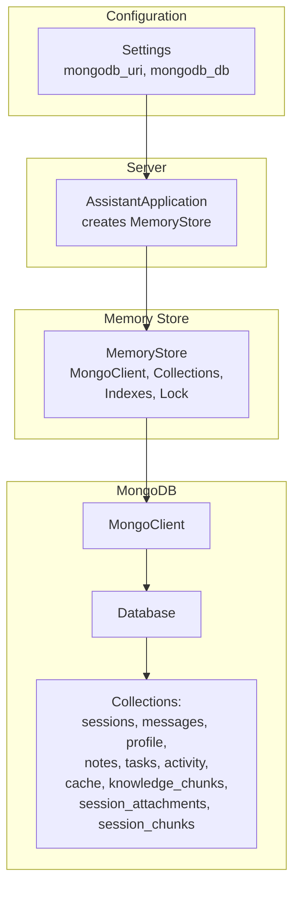
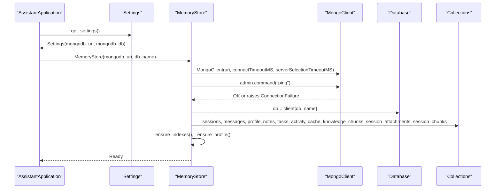
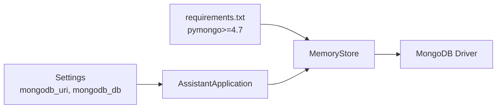

# MongoDB Integration

<cite>
**Referenced Files in This Document**
- [memory_store.py](file://backend/core/memory_store.py)
- [config.py](file://backend/config.py)
- [server.py](file://backend/server.py)
- [requirements.txt](file://requirements.txt)
- [README.md](file://README.md)
</cite>

## Table of Contents
1. [Introduction](#introduction)
2. [Project Structure](#project-structure)
3. [Core Components](#core-components)
4. [Architecture Overview](#architecture-overview)
5. [Detailed Component Analysis](#detailed-component-analysis)
6. [Dependency Analysis](#dependency-analysis)
7. [Performance Considerations](#performance-considerations)
8. [Troubleshooting Guide](#troubleshooting-guide)
9. [Conclusion](#conclusion)

## Introduction
This document explains how MongoDB is integrated into the memory store of the assistant. It covers connection initialization, URI configuration, timeout settings, failure handling, client and collection setup, thread safety, schema design, indexing, and operational best practices. It also provides guidance on graceful degradation when MongoDB is unavailable and outlines performance considerations and resource cleanup.

## Project Structure
MongoDB integration is centered around a single class that encapsulates all persistence operations. The integration spans:
- Configuration loading for MongoDB URI and database name
- Memory store initialization with connection and index creation
- Thread-safe operations using a lock
- Schema and index definitions for collections
- Usage from the HTTP server and API handlers

**Diagram sources**
- [config.py:55-76](file://backend/config.py#L55-L76)
- [server.py:23-48](file://backend/server.py#L23-L48)
- [memory_store.py:79-117](file://backend/core/memory_store.py#L79-L117)

**Section sources**
- [config.py:55-76](file://backend/config.py#L55-L76)
- [server.py:23-48](file://backend/server.py#L23-L48)
- [memory_store.py:79-117](file://backend/core/memory_store.py#L79-L117)

## Core Components
- MemoryStore: Encapsulates MongoDB client, database, and collection handles; manages indexes and a singleton profile document; provides thread-safe CRUD operations; exposes public APIs mirroring the legacy JSON interface.
- Settings: Loads environment variables including MongoDB URI and database name.
- AssistantApplication: Creates MemoryStore during server startup, optionally migrating from legacy JSON files.

Key responsibilities:
- Connection initialization with timeouts and immediate health check
- Collection handle management and index creation
- Thread-safe operations via a lock
- Graceful handling of connection failures

**Section sources**
- [memory_store.py:67-117](file://backend/core/memory_store.py#L67-L117)
- [config.py:55-76](file://backend/config.py#L55-L76)
- [server.py:23-48](file://backend/server.py#L23-L48)

## Architecture Overview
The MongoDB integration follows a straightforward pattern:
- Settings provide URI and database name
- MemoryStore constructs a MongoClient with explicit timeouts
- A ping command validates connectivity immediately
- Database and collection handles are created
- Indexes are ensured and a singleton profile is initialized
- All public methods are guarded by a lock to ensure thread safety

**Diagram sources**
- [server.py:23-48](file://backend/server.py#L23-L48)
- [config.py:55-76](file://backend/config.py#L55-L76)
- [memory_store.py:79-117](file://backend/core/memory_store.py#L79-L117)

## Detailed Component Analysis

### Connection Initialization and Failure Handling
- The constructor accepts mongodb_uri and db_name with defaults.
- A MongoClient is created with connectTimeoutMS and serverSelectionTimeoutMS set to 5000 ms.
- Immediately after construction, a ping command is executed against the admin database to fail fast if MongoDB is unreachable.
- On ConnectionFailure, a RuntimeError is raised with a clear message instructing to ensure the MongoDB server is running.

Operational implications:
- Fast failure detection prevents long blocking on startup.
- Short timeouts reduce risk of hanging during cold starts.

**Section sources**
- [memory_store.py:79-98](file://backend/core/memory_store.py#L79-L98)

### URI Configuration and Environment Integration
- Settings loads environment variables and exposes mongodb_uri and mongodb_db.
- Defaults are provided in Settings and can be overridden via .env.
- The server passes these values to MemoryStore.

Best practices:
- Use environment variables for configuration.
- Ensure the URI includes credentials and host/port as needed.

**Section sources**
- [config.py:55-76](file://backend/config.py#L55-L76)
- [server.py:23-48](file://backend/server.py#L23-L48)
- [README.md:133-136](file://README.md#L133-L136)

### Database Client Setup and Collection Handles
- After successful connection, the code obtains a Database reference and initializes handles for ten collections:
  - sessions, messages, profile, notes, tasks, activity, cache, knowledge_chunks, session_attachments, session_chunks
- Indexes are created for optimal query performance.
- A singleton profile document is ensured to exist.

Thread safety:
- All public methods acquire a threading.Lock before performing operations.

**Section sources**
- [memory_store.py:100-117](file://backend/core/memory_store.py#L100-L117)
- [memory_store.py:119-147](file://backend/core/memory_store.py#L119-L147)

### Thread-Safe Operations Using Locks
- A threading.Lock is held around all public methods that read/write to MongoDB.
- This ensures atomicity of operations and prevents race conditions across concurrent requests.

Common patterns:
- Read operations wrap queries inside with self._lock:
- Write operations wrap inserts, updates, deletes inside with self._lock:

**Section sources**
- [memory_store.py:84-84](file://backend/core/memory_store.py#L84-L84)
- [memory_store.py:194-194](file://backend/core/memory_store.py#L194-L194)
- [memory_store.py:318-318](file://backend/core/memory_store.py#L318-L318)

### MongoDB Schema Design Decisions and Indexing
Schema highlights:
- sessions: session_id (unique), pinned, updated_at, created_at
- messages: message_id (unique), session_id, created_at
- profile: singleton document with _id = "user_profile"
- notes: note_id (unique)
- tasks: task_id (unique)
- activity: capped-like behavior maintained by trimming to a fixed number of recent entries
- cache: documents with _id = "last_weather" or "last_news"
- knowledge_chunks: chunk_id (unique), source_file, file_hash, chunk_index
- session_attachments: attachment_id (unique), session_id
- session_chunks: chunk_id (unique), session_id, attachment_id

Indexing strategy:
- Unique indexes on identifiers (session_id, message_id, task_id, note_id, attachment_id, chunk_id)
- Compound indexes for common sorts and filters (e.g., sessions pinned + updated_at, messages by session_id + created_at, knowledge_chunks by source_file and file_hash)
- Single-field indexes for frequent filters (e.g., session_attachments.session_id)

Caching:
- Weather and news are cached in the cache collection with upsert semantics.

**Section sources**
- [memory_store.py:24-62](file://backend/core/memory_store.py#L24-L62)
- [memory_store.py:119-135](file://backend/core/memory_store.py#L119-L135)
- [memory_store.py:475-495](file://backend/core/memory_store.py#L475-L495)

### Connection Pooling Strategies
Observations:
- The code does not explicitly configure connection pool options (e.g., minPoolSize, maxPoolSize, maxIdleTimeMS).
- The default behavior of the underlying driver applies.
- The application creates a single MongoClient instance and reuses it across all operations.

Implications:
- Connection reuse is implicit through the shared client instance.
- For production deployments, consider tuning pool settings to balance resource usage and latency.

**Section sources**
- [memory_store.py:87-91](file://backend/core/memory_store.py#L87-L91)

### Graceful Degradation When MongoDB Is Unavailable
- Connection failure is detected early during MemoryStore initialization via a ping command.
- On ConnectionFailure, a RuntimeError is raised with a clear message.
- The server handles this during startup and does not proceed with service launch.

Recommendations:
- Wrap MemoryStore instantiation in a try/except block at application startup.
- Optionally provide a fallback mechanism (e.g., in-memory store) for development or limited environments, though the current code prioritizes persistence continuity.

**Section sources**
- [memory_store.py:94-98](file://backend/core/memory_store.py#L94-L98)
- [server.py:23-48](file://backend/server.py#L23-L48)

### Resource Cleanup Procedures
- MemoryStore exposes a close method that closes the underlying MongoClient.
- Callers should invoke close when shutting down the application to release resources.

**Section sources**
- [memory_store.py:148-149](file://backend/core/memory_store.py#L148-L149)

## Dependency Analysis
External dependencies:
- pymongo is required for MongoDB connectivity and operations.

Internal dependencies:
- MemoryStore depends on Settings for configuration.
- AssistantApplication composes MemoryStore and passes configuration values.

**Diagram sources**
- [requirements.txt:10](file://requirements.txt#L10)
- [config.py:55-76](file://backend/config.py#L55-L76)
- [server.py:23-48](file://backend/server.py#L23-L48)
- [memory_store.py:11](file://backend/core/memory_store.py#L11)

**Section sources**
- [requirements.txt:10](file://requirements.txt#L10)
- [config.py:55-76](file://backend/config.py#L55-L76)
- [server.py:23-48](file://backend/server.py#L23-L48)
- [memory_store.py:11](file://backend/core/memory_store.py#L11)

## Performance Considerations
- Timeouts: connectTimeoutMS and serverSelectionTimeoutMS are set to 5000 ms to prevent long waits during startup.
- Indexes: Strategic indexes improve query performance for common operations (e.g., session sorting, message retrieval).
- Lock contention: All operations are serialized by a single lock. While this ensures correctness, it can become a bottleneck under heavy concurrency. Consider:
  - Breaking operations into smaller units
  - Using separate locks per collection if appropriate
  - Monitoring lock wait times and adjusting based on workload
- Connection reuse: The single MongoClient instance is reused across all operations, reducing overhead.
- Capped activity: The activity collection is trimmed to a fixed size to control growth.

[No sources needed since this section provides general guidance]

## Troubleshooting Guide
Common issues and resolutions:
- Cannot connect to MongoDB:
  - Verify the MongoDB server is running and reachable.
  - Confirm the URI and database name in environment variables.
  - Review the error raised during initialization indicating the failure.

- Slow startup or timeouts:
  - Adjust connectTimeoutMS and serverSelectionTimeoutMS if needed.
  - Ensure network latency to the database is acceptable.

- Unexpected behavior under load:
  - Monitor lock contention; consider optimizing hotspots or splitting operations.

- Resource leaks:
  - Ensure MemoryStore.close() is called during shutdown.

**Section sources**
- [memory_store.py:94-98](file://backend/core/memory_store.py#L94-L98)
- [memory_store.py:148-149](file://backend/core/memory_store.py#L148-L149)

## Conclusion
The MongoDB integration in the memory store is intentionally minimal and robust:
- Clear connection initialization with explicit timeouts and immediate health checks
- Well-defined schema and indexes for predictable performance
- Thread-safe operations via a lock
- Straightforward configuration via environment variables
- Proper resource cleanup

For production deployments, consider tuning connection pool settings and monitoring lock contention to optimize throughput under load.