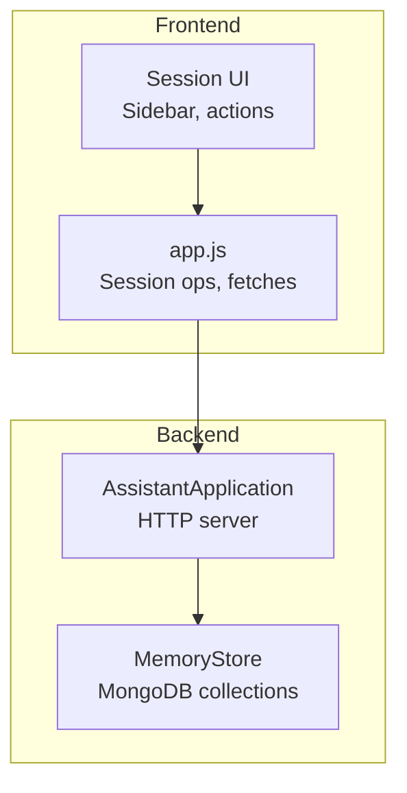
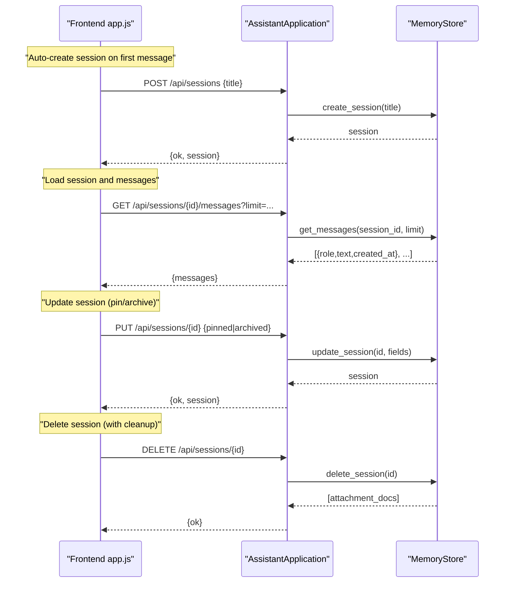
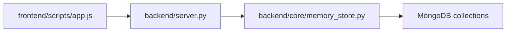

# Session Management

<cite>
**Referenced Files in This Document**
- [README.md](file://README.md)
- [backend/core/memory_store.py](file://backend/core/memory_store.py)
- [backend/server.py](file://backend/server.py)
- [frontend/scripts/app.js](file://frontend/scripts/app.js)
</cite>

## Table of Contents
1. [Introduction](#introduction)
2. [Project Structure](#project-structure)
3. [Core Components](#core-components)
4. [Architecture Overview](#architecture-overview)
5. [Detailed Component Analysis](#detailed-component-analysis)
6. [Dependency Analysis](#dependency-analysis)
7. [Performance Considerations](#performance-considerations)
8. [Troubleshooting Guide](#troubleshooting-guide)
9. [Conclusion](#conclusion)
10. [Appendices](#appendices)

## Introduction
This document explains the session management functionality of the Orbit Virtual Assistant. It covers the session lifecycle from creation to deletion, automatic default session handling, manual session management, session properties (title, pinning, archiving, timestamps), CRUD operations, query patterns with filtering and sorting, the relationship between sessions and messages, attachment cleanup during session deletion, session-based message retrieval, examples of session operations, bulk session queries, and integration with the frontend session system. It also addresses session persistence, concurrent access handling, and session state management.

## Project Structure
The session management system spans backend and frontend components:
- Backend: MongoDB-backed persistence, HTTP endpoints, and orchestration logic
- Frontend: UI-driven session operations and integration with backend endpoints

**Diagram sources**
- [backend/server.py:23-83](file://backend/server.py#L23-L83)
- [backend/core/memory_store.py:67-117](file://backend/core/memory_store.py#L67-L117)
- [frontend/scripts/app.js:1151-1270](file://frontend/scripts/app.js#L1151-L1270)

**Section sources**
- [README.md:32-36](file://README.md#L32-L36)
- [backend/server.py:23-83](file://backend/server.py#L23-L83)
- [backend/core/memory_store.py:67-117](file://backend/core/memory_store.py#L67-L117)
- [frontend/scripts/app.js:1151-1270](file://frontend/scripts/app.js#L1151-L1270)

## Core Components
- MemoryStore: MongoDB-backed session and message persistence, with thread-safe operations and indexes
- AssistantApplication: HTTP server exposing REST endpoints for sessions, messages, and attachments
- Frontend app.js: Manages session creation, selection, updates, and deletion; integrates with backend

Key responsibilities:
- Sessions: creation, listing, retrieval, update (title/pinned/archived), deletion
- Messages: per-session CRUD and retrieval with ordering
- Attachments: per-session file attachments and associated indexing
- Automatic default session handling for legacy compatibility

**Section sources**
- [backend/core/memory_store.py:579-646](file://backend/core/memory_store.py#L579-L646)
- [backend/core/memory_store.py:652-690](file://backend/core/memory_store.py#L652-L690)
- [backend/core/memory_store.py:754-796](file://backend/core/memory_store.py#L754-L796)
- [backend/server.py:110-135](file://backend/server.py#L110-L135)
- [backend/server.py:183-202](file://backend/server.py#L183-L202)
- [backend/server.py:403-420](file://backend/server.py#L403-L420)
- [backend/server.py:428-446](file://backend/server.py#L428-L446)
- [frontend/scripts/app.js:963-989](file://frontend/scripts/app.js#L963-L989)
- [frontend/scripts/app.js:1217-1241](file://frontend/scripts/app.js#L1217-L1241)

## Architecture Overview
The session lifecycle is orchestrated by the frontend and persisted by the backend. The frontend triggers session operations; the backend validates and persists changes; the frontend refreshes UI state.

**Diagram sources**
- [frontend/scripts/app.js:963-989](file://frontend/scripts/app.js#L963-L989)
- [frontend/scripts/app.js:1217-1241](file://frontend/scripts/app.js#L1217-L1241)
- [backend/server.py:183-202](file://backend/server.py#L183-L202)
- [backend/server.py:128-135](file://backend/server.py#L128-L135)
- [backend/server.py:403-420](file://backend/server.py#L403-L420)
- [backend/server.py:428-446](file://backend/server.py#L428-L446)
- [backend/core/memory_store.py:579-646](file://backend/core/memory_store.py#L579-L646)
- [backend/core/memory_store.py:652-690](file://backend/core/memory_store.py#L652-L690)

## Detailed Component Analysis

### Session Lifecycle and Properties
- Creation: Generates a new session with a unique identifier, default title, timestamps, and initial state (not pinned, not archived)
- Listing: Retrieves sessions sorted by pinned first, then by updated_at descending; optionally include archived
- Retrieval: Fetches a single session by ID
- Update: Supports updating title, pinned, and archived flags; updates updated_at automatically
- Deletion: Removes the session and cascades deletes for messages, attachments, and indexed chunks; returns attachment records for disk cleanup

Session properties:
- session_id: unique identifier
- title: human-readable name
- created_at: ISO timestamp
- updated_at: ISO timestamp
- pinned: boolean flag
- archived: boolean flag

Automatic default session handling:
- Legacy compatibility: If no session_id is provided and no default session exists, a default session is created on history update

**Section sources**
- [backend/core/memory_store.py:579-596](file://backend/core/memory_store.py#L579-L596)
- [backend/core/memory_store.py:598-606](file://backend/core/memory_store.py#L598-L606)
- [backend/core/memory_store.py:608-613](file://backend/core/memory_store.py#L608-L613)
- [backend/core/memory_store.py:615-630](file://backend/core/memory_store.py#L615-L630)
- [backend/core/memory_store.py:632-646](file://backend/core/memory_store.py#L632-L646)
- [backend/core/memory_store.py:517-533](file://backend/core/memory_store.py#L517-L533)

### Session CRUD Endpoints
- Create: POST /api/sessions {title}
- List: GET /api/sessions?include_archived=true|false
- Retrieve: GET /api/sessions/{id}
- Update: PUT /api/sessions/{id} {title|pinned|archived}
- Delete: DELETE /api/sessions/{id}

Behavior:
- List returns sessions ordered by pinned desc, updated_at desc
- Update validates allowed fields and raises errors for invalid updates
- Delete returns attachment documents for disk cleanup and invalidates session retriever cache

**Section sources**
- [backend/server.py:110-116](file://backend/server.py#L110-L116)
- [backend/server.py:118-126](file://backend/server.py#L118-L126)
- [backend/server.py:183-186](file://backend/server.py#L183-L186)
- [backend/server.py:403-420](file://backend/server.py#L403-L420)
- [backend/server.py:428-446](file://backend/server.py#L428-L446)

### Relationship Between Sessions and Messages
- Each message belongs to a session via session_id
- Message ordering is ascending by created_at
- Messages are deleted when a session is deleted
- Messages can be added to a session independently of chat flow

**Section sources**
- [backend/core/memory_store.py:652-690](file://backend/core/memory_store.py#L652-L690)
- [backend/server.py:189-202](file://backend/server.py#L189-L202)

### Attachment Cleanup During Session Deletion
- On session deletion, attachment records are returned for disk cleanup
- Disk files are removed if they exist
- Session retriever cache is invalidated after attachment deletion

**Section sources**
- [backend/server.py:428-446](file://backend/server.py#L428-L446)
- [backend/server.py:448-466](file://backend/server.py#L448-L466)
- [backend/core/memory_store.py:632-646](file://backend/core/memory_store.py#L632-L646)

### Session-Based Message Retrieval
- GET /api/sessions/{id}/messages?limit=N retrieves messages for a session, ordered ascending by created_at
- Frontend loads messages when switching sessions and renders them in the chat UI

**Section sources**
- [backend/server.py:128-135](file://backend/server.py#L128-L135)
- [frontend/scripts/app.js:1217-1241](file://frontend/scripts/app.js#L1217-L1241)

### Automatic Default Session Handling
- Legacy compatibility path: when updating history without a session_id, a default session is created if none exists
- Ensures continuity for older clients that rely on a single default session

**Section sources**
- [backend/core/memory_store.py:517-533](file://backend/core/memory_store.py#L517-L533)

### Manual Session Management in the Frontend
- Create: POST /api/sessions with title
- Load: GET /api/sessions/{id}/messages and render
- Pin/Unpin: PUT /api/sessions/{id} with pinned
- Archive/Unarchive: PUT /api/sessions/{id} with archived
- Delete: DELETE /api/sessions/{id}
- Refresh sessions: GET /api/sessions?include_archived=true

**Section sources**
- [frontend/scripts/app.js:963-989](file://frontend/scripts/app.js#L963-L989)
- [frontend/scripts/app.js:1217-1241](file://frontend/scripts/app.js#L1217-L1241)
- [frontend/scripts/app.js:300-348](file://frontend/scripts/app.js#L300-L348)
- [frontend/scripts/app.js:349-368](file://frontend/scripts/app.js#L349-L368)
- [frontend/scripts/app.js:1243-1252](file://frontend/scripts/app.js#L1243-L1252)

### Bulk Session Queries
- GET /api/sessions?include_archived=true|false returns all sessions with optional inclusion of archived
- Sorting: pinned desc, updated_at desc

**Section sources**
- [backend/server.py:110-116](file://backend/server.py#L110-L116)
- [backend/core/memory_store.py:598-606](file://backend/core/memory_store.py#L598-L606)

### Integration with the Frontend Session System
- Frontend maintains activeSessionId and renders sessions in pinned/recent/archived groups
- Actions (pin, archive, delete) call backend endpoints and refresh UI
- First message triggers session creation and message storage

**Section sources**
- [frontend/scripts/app.js:1151-1270](file://frontend/scripts/app.js#L1151-L1270)
- [frontend/scripts/app.js:963-989](file://frontend/scripts/app.js#L963-L989)

### Session Persistence and Indexes
- Collections: sessions, messages, session_attachments, session_chunks
- Indexes: unique session_id, composite sort (pinned desc, updated_at desc), message sort (session_id asc, created_at asc), attachment/session_id, chunk indexes
- Thread safety: operations guarded by a lock to prevent race conditions

**Section sources**
- [backend/core/memory_store.py:24-62](file://backend/core/memory_store.py#L24-L62)
- [backend/core/memory_store.py:119-135](file://backend/core/memory_store.py#L119-L135)
- [backend/core/memory_store.py:84](file://backend/core/memory_store.py#L84)

### Concurrent Access Handling
- MemoryStore uses a threading lock to serialize writes and reads
- MongoDB operations are atomic per document; cross-document consistency is ensured by the lock

**Section sources**
- [backend/core/memory_store.py:84](file://backend/core/memory_store.py#L84)
- [backend/core/memory_store.py:590](file://backend/core/memory_store.py#L590)

### Session State Management
- State transitions: create -> update (title/pinned/archived) -> delete
- Timestamps: created_at and updated_at maintained for sessions and messages
- Archival: archived sessions excluded from default listing; included when requested

**Section sources**
- [backend/core/memory_store.py:579-630](file://backend/core/memory_store.py#L579-L630)
- [backend/core/memory_store.py:632-646](file://backend/core/memory_store.py#L632-L646)
- [backend/server.py:110-116](file://backend/server.py#L110-L116)

## Dependency Analysis
The session management stack depends on:
- MongoDB collections for persistence
- HTTP endpoints for frontend-backend integration
- Frontend UI for user-driven session operations

**Diagram sources**
- [frontend/scripts/app.js:963-989](file://frontend/scripts/app.js#L963-L989)
- [backend/server.py:110-135](file://backend/server.py#L110-L135)
- [backend/core/memory_store.py:67-117](file://backend/core/memory_store.py#L67-L117)

**Section sources**
- [backend/server.py:23-83](file://backend/server.py#L23-L83)
- [backend/core/memory_store.py:67-117](file://backend/core/memory_store.py#L67-L117)

## Performance Considerations
- Indexes: Composite index on sessions (pinned desc, updated_at desc) optimizes listing; message index on (session_id asc, created_at asc) optimizes retrieval
- Sorting: Listing and message retrieval leverage indexes for efficient ordering
- Locking: Single-threaded access per operation reduces contention; consider batching operations for bulk updates
- Attachment cleanup: Disk cleanup occurs after DB deletion; ensure cleanup runs reliably to prevent orphaned files

[No sources needed since this section provides general guidance]

## Troubleshooting Guide
Common issues and resolutions:
- Session not found: Ensure session_id is correct; verify existence via GET /api/sessions/{id}
- Update errors: Only title, pinned, and archived are allowed; passing invalid fields raises an error
- Empty message text: Adding a message requires non-empty text; backend rejects empty messages
- Attachment cleanup failures: Verify disk_path exists and is readable; errors are ignored to avoid blocking deletion
- Concurrency: If multiple clients update the same session, the last write wins; consider client-side optimistic updates with retry logic

**Section sources**
- [backend/core/memory_store.py:615-630](file://backend/core/memory_store.py#L615-L630)
- [backend/core/memory_store.py:652-657](file://backend/core/memory_store.py#L652-L657)
- [backend/server.py:428-446](file://backend/server.py#L428-L446)

## Conclusion
The session management system provides robust, multi-session support with clear lifecycle operations, strong persistence guarantees, and seamless frontend integration. It supports automatic default session handling for backward compatibility, efficient querying with filtering and sorting, and safe cleanup of attachments and related data upon session deletion. The design balances simplicity for frontend developers with reliability and performance for backend operations.

[No sources needed since this section summarizes without analyzing specific files]

## Appendices

### API Definitions
- Create session: POST /api/sessions {title}
- List sessions: GET /api/sessions?include_archived=true|false
- Get session: GET /api/sessions/{id}
- Update session: PUT /api/sessions/{id} {title|pinned|archived}
- Delete session: DELETE /api/sessions/{id}
- Add message: POST /api/sessions/{id}/messages {role, text}
- Get messages: GET /api/sessions/{id}/messages?limit=N
- Add attachment: POST /api/sessions/{id}/attachments {filename, data}
- Delete attachment: DELETE /api/sessions/{id}/attachments/{attachment_id}
- Delete message: DELETE /api/messages/{message_id}

**Section sources**
- [backend/server.py:110-135](file://backend/server.py#L110-L135)
- [backend/server.py:183-202](file://backend/server.py#L183-L202)
- [backend/server.py:403-420](file://backend/server.py#L403-L420)
- [backend/server.py:428-446](file://backend/server.py#L428-L446)
- [backend/server.py:468-474](file://backend/server.py#L468-L474)