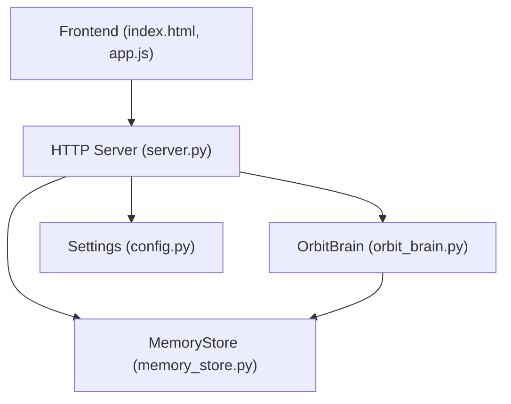
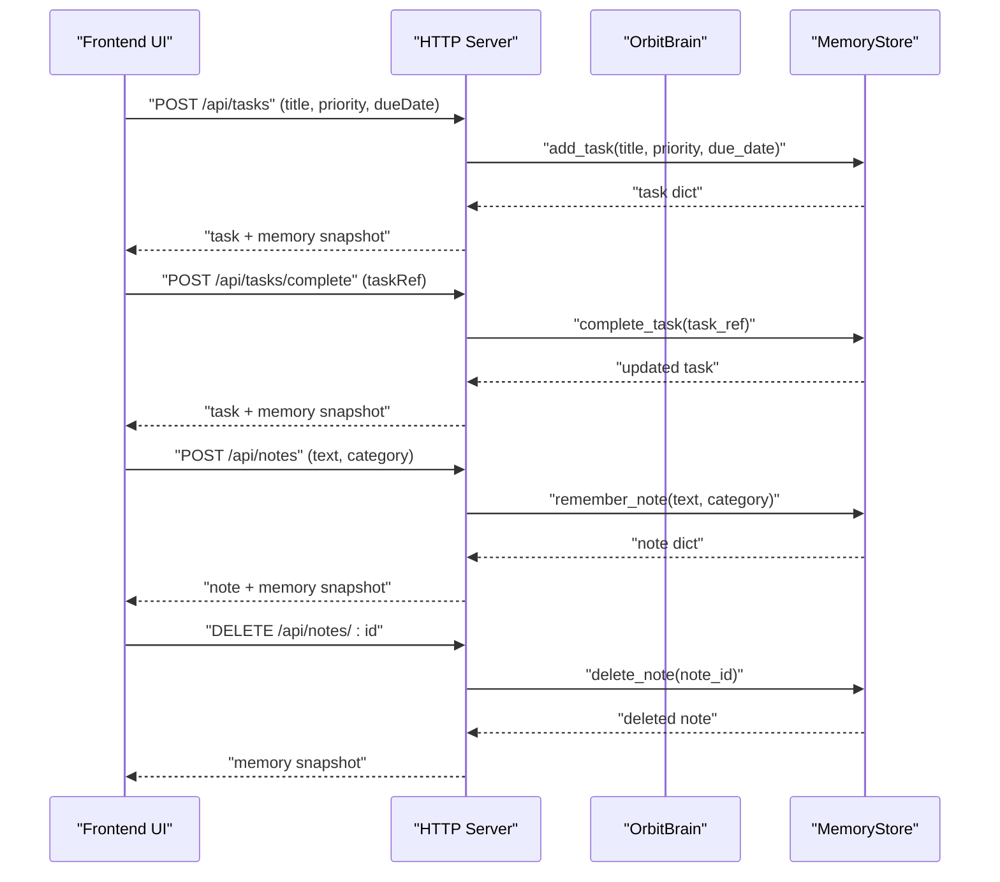
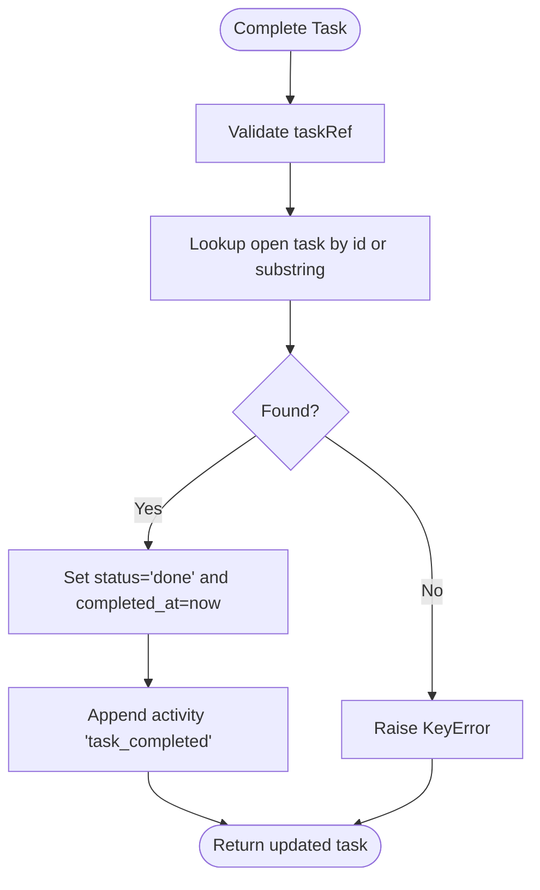
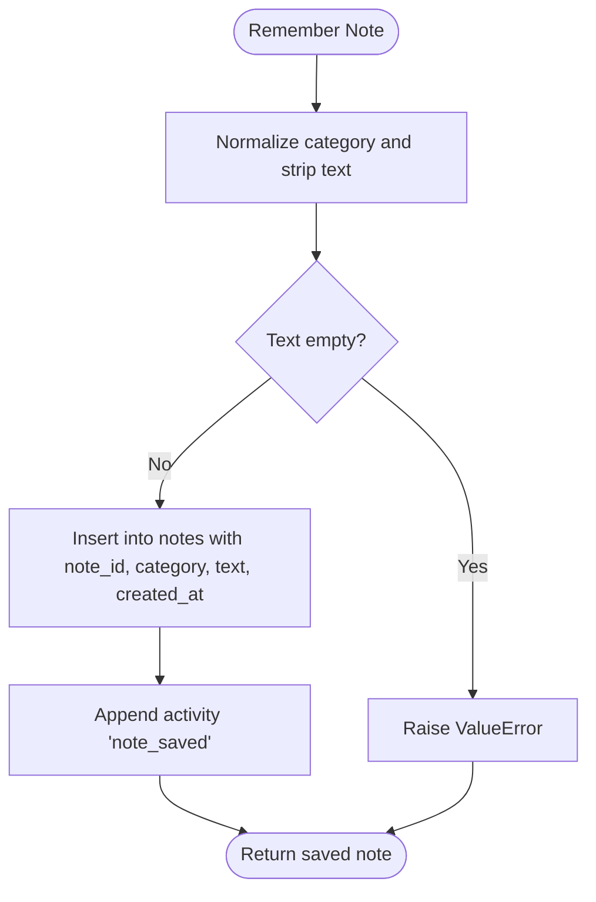
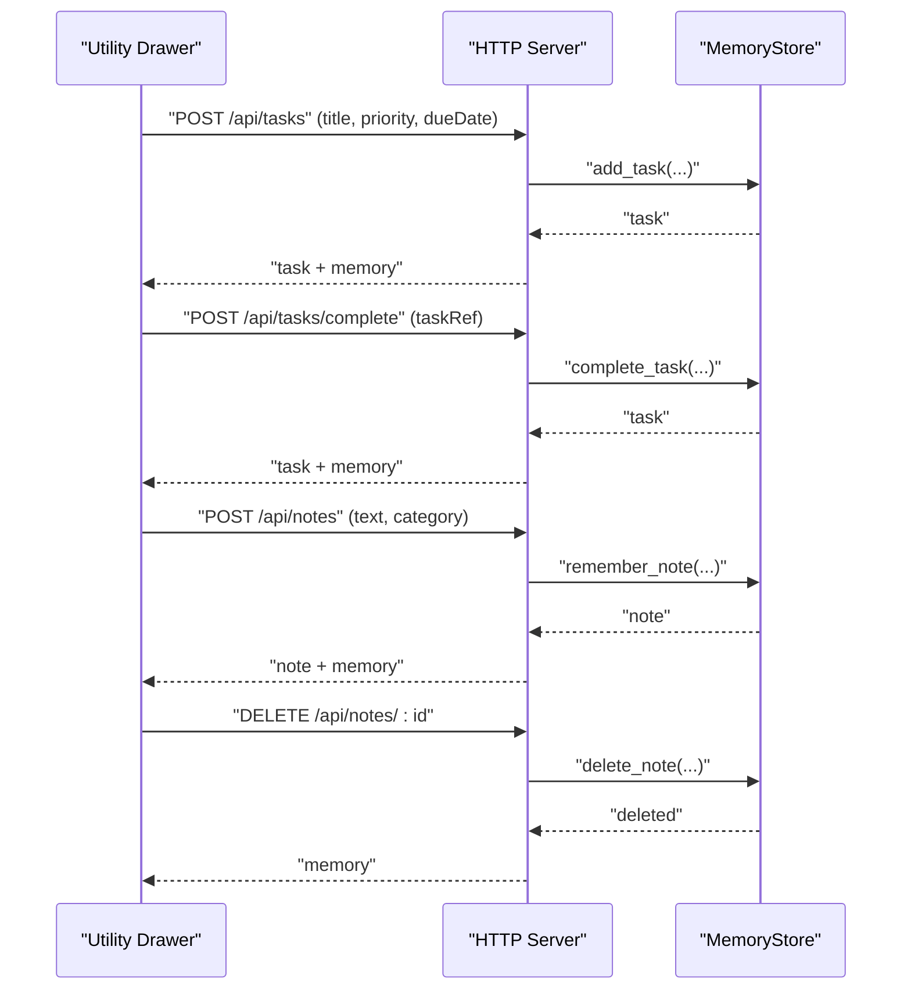
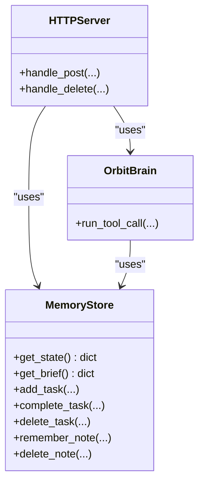
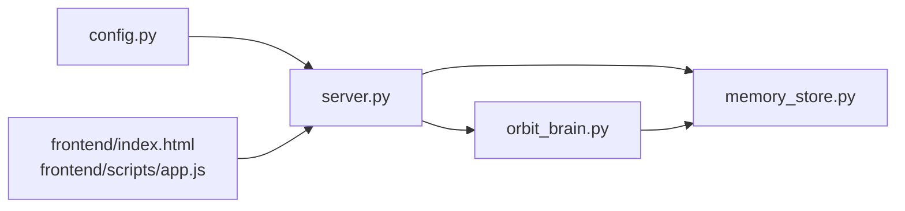

# Task and Note Management

<cite>
**Referenced Files in This Document**
- [memory_store.py](file://backend/core/memory_store.py)
- [orbit_brain.py](file://backend/core/orbit_brain.py)
- [server.py](file://backend/server.py)
- [config.py](file://backend/config.py)
- [app.js](file://frontend/scripts/app.js)
- [index.html](file://frontend/index.html)
- [README.md](file://README.md)
</cite>

## Table of Contents
1. [Introduction](#introduction)
2. [Project Structure](#project-structure)
3. [Core Components](#core-components)
4. [Architecture Overview](#architecture-overview)
5. [Detailed Component Analysis](#detailed-component-analysis)
6. [Dependency Analysis](#dependency-analysis)
7. [Performance Considerations](#performance-considerations)
8. [Troubleshooting Guide](#troubleshooting-guide)
9. [Conclusion](#conclusion)
10. [Appendices](#appendices)

## Introduction
This document explains the task and note management systems integrated into the Orbit Virtual Assistant. It covers the MongoDB-backed schema for tasks and notes, the CRUD operations exposed by the backend, the frontend UI bindings, and how these features integrate with the broader memory system. It also details task completion workflows, note categorization strategies, search and filtering capabilities, and the relationship between tasks/notes and the assistant’s memory state.

## Project Structure
The task and note management spans the backend persistence layer, the brain that orchestrates tool calls, the HTTP server that exposes REST endpoints, and the frontend that renders and interacts with tasks and notes.

**Diagram sources**
- [server.py:23-63](file://backend/server.py#L23-L63)
- [memory_store.py:67-116](file://backend/core/memory_store.py#L67-L116)
- [orbit_brain.py:389-501](file://backend/core/orbit_brain.py#L389-L501)
- [config.py:20-76](file://backend/config.py#L20-L76)

**Section sources**
- [README.md:164-201](file://README.md#L164-L201)

## Core Components
- MemoryStore: MongoDB-backed persistence for tasks and notes, plus profile, sessions, messages, and caches. Provides CRUD operations and state retrieval.
- OrbitBrain: Orchestrates tool calls including add_task, complete_task, delete_task, remember_note, and retrieval filters.
- HTTP Server: Exposes REST endpoints for tasks and notes, integrates with MemoryStore and OrbitBrain.
- Frontend: Renders tasks and notes, binds user actions to API calls, and reflects state changes.

Key schema highlights:
- Tasks: task_id, title, priority, due_date, status, created_at, completed_at
- Notes: note_id, category, text, created_at

**Section sources**
- [memory_store.py:38-46](file://backend/core/memory_store.py#L38-L46)
- [memory_store.py:41-43](file://backend/core/memory_store.py#L41-L43)
- [memory_store.py:338-375](file://backend/core/memory_store.py#L338-L375)
- [memory_store.py:309-332](file://backend/core/memory_store.py#L309-L332)

## Architecture Overview
The task and note lifecycle flows from the UI to the server, through the brain’s tool dispatch, to the persistence layer, and back to the UI with updated memory snapshots.

**Diagram sources**
- [server.py:222-253](file://backend/server.py#L222-L253)
- [server.py:234-241](file://backend/server.py#L234-L241)
- [server.py:243-253](file://backend/server.py#L243-L253)
- [server.py:476-486](file://backend/server.py#L476-L486)
- [memory_store.py:338-375](file://backend/core/memory_store.py#L338-L375)
- [memory_store.py:377-415](file://backend/core/memory_store.py#L377-L415)
- [memory_store.py:309-332](file://backend/core/memory_store.py#L309-L332)
- [memory_store.py:448-469](file://backend/core/memory_store.py#L448-L469)

## Detailed Component Analysis

### Task Management
- Creation: add_task(title, priority, due_date) validates inputs, assigns ids, sets status to open, and records activity.
- Completion: complete_task(task_ref) accepts either exact task_id or a unique substring of the title; transitions status to done and sets completed_at.
- Deletion: delete_task(task_ref) accepts id or unique title substring; removes the task and records activity.
- Retrieval: get_tasks tool supports status filtering (all/open/done) and returns filtered lists.

**Diagram sources**
- [memory_store.py:377-415](file://backend/core/memory_store.py#L377-L415)
- [orbit_brain.py:433-441](file://backend/core/orbit_brain.py#L433-L441)

**Section sources**
- [memory_store.py:338-375](file://backend/core/memory_store.py#L338-L375)
- [memory_store.py:377-415](file://backend/core/memory_store.py#L377-L415)
- [memory_store.py:417-446](file://backend/core/memory_store.py#L417-L446)
- [orbit_brain.py:425-441](file://backend/core/orbit_brain.py#L425-L441)

### Note Management
- Creation: remember_note(text, category) validates non-empty text, assigns id, normalizes category, stores with created_at, and records activity.
- Deletion: delete_note(note_id) validates id, deletes from DB, and records activity.
- Retrieval: get_notes tool supports category filtering and returns filtered lists.

**Diagram sources**
- [memory_store.py:309-332](file://backend/core/memory_store.py#L309-L332)
- [orbit_brain.py:413-416](file://backend/core/orbit_brain.py#L413-L416)

**Section sources**
- [memory_store.py:309-332](file://backend/core/memory_store.py#L309-L332)
- [memory_store.py:448-469](file://backend/core/memory_store.py#L448-L469)
- [orbit_brain.py:453-462](file://backend/core/orbit_brain.py#L453-L462)

### Frontend Integration
- Tasks: The utility drawer collects title, priority, and due date; submits POST /api/tasks; renders open tasks with “Done” buttons bound to POST /api/tasks/complete.
- Notes: The utility drawer collects text and category; submits POST /api/notes; renders recent notes with delete buttons bound to DELETE /api/notes/:id.
- Memory state: The UI periodically refreshes memory snapshots and updates views for tasks and notes.

**Diagram sources**
- [app.js:1434-1472](file://frontend/scripts/app.js#L1434-L1472)
- [app.js:1490-1514](file://frontend/scripts/app.js#L1490-L1514)
- [app.js:1474-1488](file://frontend/scripts/app.js#L1474-L1488)
- [server.py:222-253](file://backend/server.py#L222-L253)
- [server.py:234-241](file://backend/server.py#L234-L241)
- [server.py:243-253](file://backend/server.py#L243-L253)
- [server.py:476-486](file://backend/server.py#L476-L486)

**Section sources**
- [index.html:293-323](file://frontend/index.html#L293-L323)
- [app.js:1330-1376](file://frontend/scripts/app.js#L1330-L1376)
- [app.js:1434-1472](file://frontend/scripts/app.js#L1434-L1472)
- [app.js:1474-1488](file://frontend/scripts/app.js#L1474-L1488)

### Memory State Integration
- get_state(): Returns the full memory snapshot including profile (with notes), tasks, weather/news cache, and recent activity. The UI uses this to render tasks and notes.
- get_brief(): Returns a compact snapshot with recent notes, open/completed tasks, and stats.

**Diagram sources**
- [memory_store.py:188-250](file://backend/core/memory_store.py#L188-L250)
- [memory_store.py:252-276](file://backend/core/memory_store.py#L252-L276)
- [server.py:222-253](file://backend/server.py#L222-L253)
- [server.py:476-486](file://backend/server.py#L476-L486)
- [orbit_brain.py:389-501](file://backend/core/orbit_brain.py#L389-L501)

**Section sources**
- [memory_store.py:188-250](file://backend/core/memory_store.py#L188-L250)
- [memory_store.py:252-276](file://backend/core/memory_store.py#L252-L276)

## Dependency Analysis
- Backend depends on MongoDB for persistence and on threading locks for thread-safe operations.
- HTTP server depends on MemoryStore for CRUD operations and on OrbitBrain for tool orchestration.
- Frontend depends on REST endpoints for all operations and on memory snapshots for rendering.

**Diagram sources**
- [config.py:20-76](file://backend/config.py#L20-L76)
- [server.py:23-63](file://backend/server.py#L23-L63)
- [memory_store.py:67-116](file://backend/core/memory_store.py#L67-L116)
- [orbit_brain.py:389-501](file://backend/core/orbit_brain.py#L389-L501)

**Section sources**
- [config.py:20-76](file://backend/config.py#L20-L76)
- [server.py:23-63](file://backend/server.py#L23-L63)

## Performance Considerations
- Indexing: MemoryStore creates indexes on task_id and note_id for efficient lookups.
- Concurrency: Operations are guarded by a lock to prevent race conditions.
- Activity cache: Activity entries are trimmed to a fixed size to control growth.
- Network: Frontend calls are synchronous per operation; consider batching or debouncing for bulk operations.

[No sources needed since this section provides general guidance]

## Troubleshooting Guide
Common issues and resolutions:
- Empty task title or note text: Validation raises errors; ensure non-empty inputs.
- Task not found: complete_task/delete_task require a non-empty reference; ensure id or unique substring is provided.
- Note not found: delete_note raises KeyError if id is invalid.
- API errors: The server returns structured error payloads; inspect the error field in responses.

**Section sources**
- [memory_store.py:342-343](file://backend/core/memory_store.py#L342-L343)
- [memory_store.py:379-380](file://backend/core/memory_store.py#L379-L380)
- [memory_store.py:420-421](file://backend/core/memory_store.py#L420-L421)
- [memory_store.py:450-457](file://backend/core/memory_store.py#L450-L457)
- [server.py:229-230](file://backend/server.py#L229-L230)
- [server.py:238-239](file://backend/server.py#L238-L239)
- [server.py:482-483](file://backend/server.py#L482-L483)

## Conclusion
The task and note management system is a cohesive, REST-driven module backed by MongoDB. It provides robust CRUD operations, flexible retrieval and filtering, and tight integration with the broader memory system. The frontend binds user actions to API endpoints, while the backend ensures data integrity and maintains an activity trail for auditing.

[No sources needed since this section summarizes without analyzing specific files]

## Appendices

### API Definitions
- POST /api/tasks
  - Body: { title, priority?, dueDate? }
  - Response: { ok, task, memory }
- POST /api/tasks/complete
  - Body: { taskRef }
  - Response: { ok, task, memory }
- POST /api/notes
  - Body: { text, category? }
  - Response: { ok, note, memory }
- DELETE /api/notes/:id
  - Response: { ok, memory }

**Section sources**
- [server.py:222-253](file://backend/server.py#L222-L253)
- [server.py:234-241](file://backend/server.py#L234-L241)
- [server.py:243-253](file://backend/server.py#L243-L253)
- [server.py:476-486](file://backend/server.py#L476-L486)

### Example Workflows
- Create a task
  - UI: Fill task form and submit POST /api/tasks
  - Server: Calls MemoryStore.add_task
  - Response: Updated memory snapshot with new task
- Complete a task
  - UI: Click “Done” on a task item
  - Server: Calls MemoryStore.complete_task
  - Response: Updated memory snapshot with task status changed to done
- Add a note
  - UI: Fill note form and submit POST /api/notes
  - Server: Calls MemoryStore.remember_note
  - Response: Updated memory snapshot with new note
- Delete a note
  - UI: Click delete on a note item
  - Server: Calls MemoryStore.delete_note
  - Response: Updated memory snapshot

**Section sources**
- [app.js:1434-1472](file://frontend/scripts/app.js#L1434-L1472)
- [app.js:1474-1488](file://frontend/scripts/app.js#L1474-L1488)
- [server.py:222-253](file://backend/server.py#L222-L253)
- [server.py:243-253](file://backend/server.py#L243-L253)
- [server.py:476-486](file://backend/server.py#L476-L486)