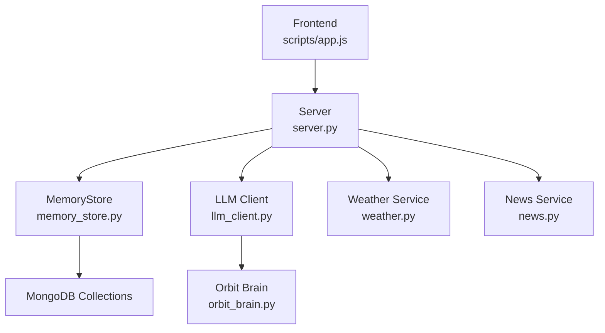
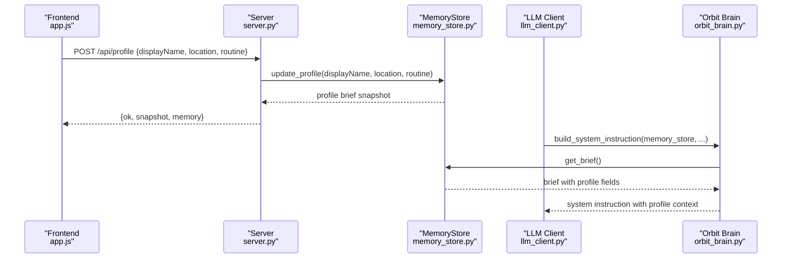
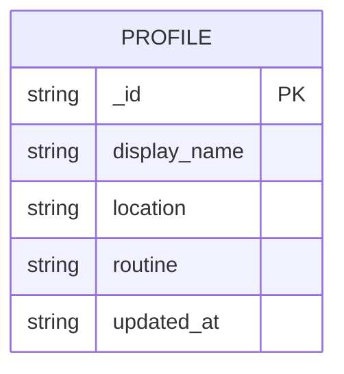
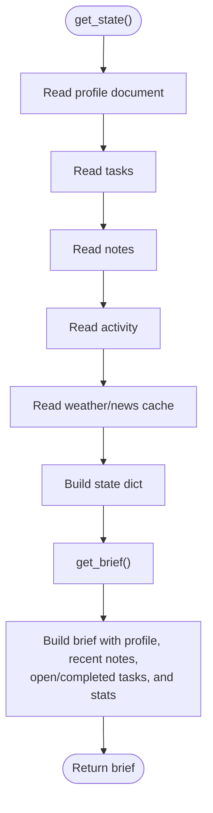
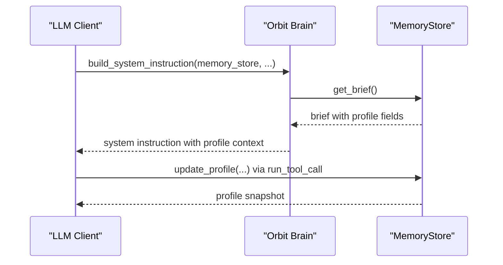
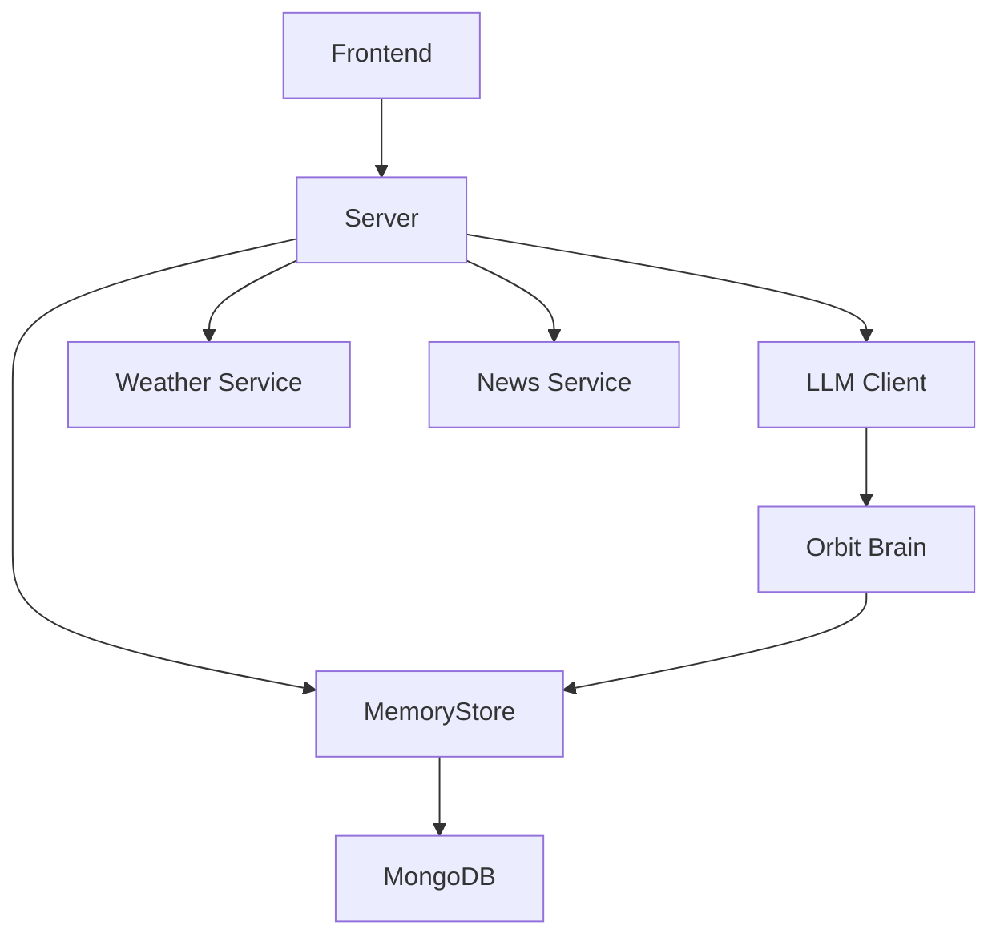

# User Profile and Preferences

<cite>
**Referenced Files in This Document**
- [memory_store.py](file://backend/core/memory_store.py)
- [orbit_brain.py](file://backend/core/orbit_brain.py)
- [server.py](file://backend/server.py)
- [app.js](file://frontend/scripts/app.js)
- [config.py](file://backend/config.py)
- [llm_client.py](file://backend/api_clients/llm_client.py)
- [weather.py](file://backend/tools/weather.py)
- [news.py](file://backend/tools/news.py)
</cite>

## Table of Contents
1. [Introduction](#introduction)
2. [Project Structure](#project-structure)
3. [Core Components](#core-components)
4. [Architecture Overview](#architecture-overview)
5. [Detailed Component Analysis](#detailed-component-analysis)
6. [Dependency Analysis](#dependency-analysis)
7. [Performance Considerations](#performance-considerations)
8. [Troubleshooting Guide](#troubleshooting-guide)
9. [Conclusion](#conclusion)
10. [Appendices](#appendices)

## Introduction
This document explains how user profile persistence and preference management are implemented in the system. It focuses on the single-document profile collection, field definitions, update operations, validation rules, and timestamp management. It also describes how profile data integrates with the broader memory state, profile-based brief summaries, and preference-based AI behavior. Practical examples illustrate profile updates, retrieval patterns, and integration with external services. Finally, it outlines initialization, default values, and personalization features, along with the relationships between profile data and other system components.

## Project Structure
The profile system spans backend core storage, server endpoints, frontend client, and AI orchestration. The key files are:
- Memory store: persistent storage and profile operations
- Server: HTTP endpoints for profile updates and state retrieval
- Frontend: client-side form submission for profile updates
- AI orchestration: system instruction builder that embeds profile data
- Tools: weather and news services that update cached data integrated into memory

**Diagram sources**
- [server.py:23-63](file://backend/server.py#L23-L63)
- [memory_store.py:67-116](file://backend/core/memory_store.py#L67-L116)
- [app.js:1380-1401](file://frontend/scripts/app.js#L1380-L1401)
- [llm_client.py:38-46](file://backend/api_clients/llm_client.py#L38-L46)
- [orbit_brain.py:302-313](file://backend/core/orbit_brain.py#L302-L313)
- [weather.py:48-76](file://backend/tools/weather.py#L48-L76)
- [news.py:22-60](file://backend/tools/news.py#L22-L60)

**Section sources**
- [server.py:23-63](file://backend/server.py#L23-L63)
- [memory_store.py:67-116](file://backend/core/memory_store.py#L67-L116)
- [app.js:1380-1401](file://frontend/scripts/app.js#L1380-L1401)
- [llm_client.py:38-46](file://backend/api_clients/llm_client.py#L38-L46)
- [orbit_brain.py:302-313](file://backend/core/orbit_brain.py#L302-L313)
- [weather.py:48-76](file://backend/tools/weather.py#L48-L76)
- [news.py:22-60](file://backend/tools/news.py#L22-L60)

## Core Components
- Single-document profile collection: a singleton document stored under a fixed identifier, containing display_name, location, routine, and updated_at.
- Memory store: provides profile update, retrieval, and integration with memory briefs and activity logs.
- Server endpoints: expose /api/profile for updates and /api/state for full memory snapshots.
- Frontend client: submits profile updates via a POST to /api/profile.
- AI orchestration: builds system instructions embedding a memory brief that includes profile fields.
- External services: weather and news services update cached data integrated into memory.

**Section sources**
- [memory_store.py:35-36](file://backend/core/memory_store.py#L35-L36)
- [memory_store.py:136-146](file://backend/core/memory_store.py#L136-L146)
- [memory_store.py:282-303](file://backend/core/memory_store.py#L282-L303)
- [server.py:214-221](file://backend/server.py#L214-L221)
- [app.js:1380-1401](file://frontend/scripts/app.js#L1380-L1401)
- [orbit_brain.py:302-313](file://backend/core/orbit_brain.py#L302-L313)

## Architecture Overview
The profile lifecycle:
- Frontend collects user input and posts to /api/profile.
- Server validates payload and delegates to MemoryStore.update_profile.
- MemoryStore applies updates atomically, sets updated_at, and records an activity event.
- MemoryStore returns a profile brief snapshot, which the server augments with full memory and returns to the client.
- The AI orchestrator builds system instructions using a memory brief that includes profile fields, enabling preference-aware behavior.

**Diagram sources**
- [app.js:1380-1401](file://frontend/scripts/app.js#L1380-L1401)
- [server.py:214-221](file://backend/server.py#L214-L221)
- [memory_store.py:282-303](file://backend/core/memory_store.py#L282-L303)
- [llm_client.py:63-72](file://backend/api_clients/llm_client.py#L63-L72)
- [orbit_brain.py:302-313](file://backend/core/orbit_brain.py#L302-L313)

## Detailed Component Analysis

### Profile Collection Schema and Initialization
- Collection: profile
- Document identifier: a singleton with fixed _id "user_profile"
- Fields:
  - display_name: string
  - location: string
  - routine: string
  - updated_at: ISO timestamp string
- Initialization: On first connect, if the document does not exist, it is inserted with default empty values and an initial updated_at timestamp.

**Diagram sources**
- [memory_store.py:35-36](file://backend/core/memory_store.py#L35-L36)
- [memory_store.py:136-146](file://backend/core/memory_store.py#L136-L146)

**Section sources**
- [memory_store.py:35-36](file://backend/core/memory_store.py#L35-L36)
- [memory_store.py:136-146](file://backend/core/memory_store.py#L136-L146)

### Profile Update Operations
- Endpoint: POST /api/profile
- Payload fields: displayName, location, routine (optional)
- Behavior:
  - Strips whitespace from provided values.
  - Sets updated_at to current UTC timestamp.
  - Updates only provided fields.
  - Records an activity event "profile_updated" with partial payload.
  - Returns a profile brief snapshot (subset of memory) plus the full memory state.

Validation rules:
- No explicit server-side validation for empty strings; the update operation strips inputs and writes them as-is. Empty strings are valid values.
- The profile brief excludes nulls and ensures presence of profile fields.

Timestamp management:
- updated_at is updated on every write.
- Activity entries include created_at timestamps.

**Section sources**
- [server.py:214-221](file://backend/server.py#L214-L221)
- [memory_store.py:282-303](file://backend/core/memory_store.py#L282-L303)
- [memory_store.py:162-183](file://backend/core/memory_store.py#L162-L183)

### Profile Retrieval and Brief Summaries
- Full memory state: get_state returns profile fields, tasks, notes, weather, news, and activity.
- Profile brief: _build_brief extracts profile, recent notes, open/completed tasks, and stats; it is used by AI orchestration to personalize behavior.
- Integration: build_system_instruction calls get_brief and embeds the result into the system prompt.

**Diagram sources**
- [memory_store.py:188-250](file://backend/core/memory_store.py#L188-L250)
- [memory_store.py:256-276](file://backend/core/memory_store.py#L256-L276)

**Section sources**
- [memory_store.py:188-250](file://backend/core/memory_store.py#L188-L250)
- [memory_store.py:256-276](file://backend/core/memory_store.py#L256-L276)
- [orbit_brain.py:302-313](file://backend/core/orbit_brain.py#L302-L313)

### Integration with AI Behavior and Preferences
- System instruction construction: build_system_instruction obtains a memory brief and serializes it into the system prompt.
- Preference-awareness: the AI receives profile fields (display_name, location, routine) and recent notes, enabling personalized responses and reminders.
- Tool integration: update_profile is exposed as a tool; when invoked, it updates the profile and returns a profile snapshot suitable for downstream tool events.

**Diagram sources**
- [llm_client.py:63-72](file://backend/api_clients/llm_client.py#L63-L72)
- [orbit_brain.py:302-313](file://backend/core/orbit_brain.py#L302-L313)
- [memory_store.py:282-303](file://backend/core/memory_store.py#L282-L303)

**Section sources**
- [llm_client.py:63-72](file://backend/api_clients/llm_client.py#L63-L72)
- [orbit_brain.py:302-313](file://backend/core/orbit_brain.py#L302-L313)
- [orbit_brain.py:417-424](file://backend/core/orbit_brain.py#L417-L424)

### External Services Integration
- Weather: fetch_weather updates the cache collection with last_weather; the memory brief includes last_weather for AI awareness.
- News: fetch_news updates the cache collection with last_news; the memory brief includes last_news for AI awareness.
- Both services are invoked through server endpoints and via tool calls from the AI.

**Section sources**
- [server.py:145-164](file://backend/server.py#L145-L164)
- [memory_store.py:475-495](file://backend/core/memory_store.py#L475-L495)
- [weather.py:48-76](file://backend/tools/weather.py#L48-L76)
- [news.py:22-60](file://backend/tools/news.py#L22-L60)

### Frontend Interaction Pattern
- The frontend captures user input from form fields and posts to /api/profile.
- On success, the client replaces appState.memory with the returned memory snapshot and refreshes views.

**Section sources**
- [app.js:1380-1401](file://frontend/scripts/app.js#L1380-L1401)

## Dependency Analysis
- MemoryStore depends on MongoDB collections and maintains thread-safety via a lock.
- Server composes MemoryStore, Knowledge, Weather, News, and LLM services.
- AI orchestration depends on MemoryStore for memory briefs and on external services for tool execution.
- Frontend depends on server endpoints for profile updates and state retrieval.

**Diagram sources**
- [memory_store.py:67-116](file://backend/core/memory_store.py#L67-L116)
- [server.py:23-63](file://backend/server.py#L23-L63)
- [llm_client.py:38-46](file://backend/api_clients/llm_client.py#L38-L46)
- [orbit_brain.py:302-313](file://backend/core/orbit_brain.py#L302-L313)
- [app.js:1380-1401](file://frontend/scripts/app.js#L1380-L1401)

**Section sources**
- [memory_store.py:67-116](file://backend/core/memory_store.py#L67-L116)
- [server.py:23-63](file://backend/server.py#L23-L63)
- [llm_client.py:38-46](file://backend/api_clients/llm_client.py#L38-L46)
- [orbit_brain.py:302-313](file://backend/core/orbit_brain.py#L302-L313)
- [app.js:1380-1401](file://frontend/scripts/app.js#L1380-L1401)

## Performance Considerations
- Single-document profile: efficient reads/writes via a fixed identifier.
- Indexing: ensure profile collection is accessed via the singleton identifier; consider adding an index on updated_at if frequent sorting by timestamp is needed.
- Concurrency: MemoryStore uses a lock around profile updates to prevent race conditions.
- Brief computation: get_brief aggregates tasks and notes; keep the number of recent items bounded to avoid heavy serialization overhead.

[No sources needed since this section provides general guidance]

## Troubleshooting Guide
Common issues and resolutions:
- Profile not updating:
  - Verify the client sends POST /api/profile with required fields.
  - Confirm server logs show successful update and that the returned memory reflects the change.
- Empty profile fields:
  - The update operation strips inputs; ensure the client trims values before sending.
- Timestamp anomalies:
  - updated_at is set on each write; confirm the client displays the returned memory.updated_at.
- AI not reflecting profile:
  - Ensure build_system_instruction is invoked with the current MemoryStore and that get_brief is included in the system prompt.

**Section sources**
- [server.py:214-221](file://backend/server.py#L214-L221)
- [memory_store.py:282-303](file://backend/core/memory_store.py#L282-L303)
- [orbit_brain.py:302-313](file://backend/core/orbit_brain.py#L302-L313)

## Conclusion
The profile system centers on a single MongoDB document with display_name, location, routine, and updated_at. Updates are atomic, timestamped, and integrated into memory briefs consumed by the AI. The design balances simplicity with flexibility, enabling preference-aware AI behavior while maintaining clear separation of concerns across frontend, server, and core storage.

[No sources needed since this section summarizes without analyzing specific files]

## Appendices

### Field Definitions
- display_name: user’s preferred name or alias
- location: user’s city/country for localized services
- routine: daily habits or schedule context
- updated_at: ISO timestamp of the last profile modification

**Section sources**
- [memory_store.py:35-36](file://backend/core/memory_store.py#L35-L36)
- [memory_store.py:136-146](file://backend/core/memory_store.py#L136-L146)

### Example Workflows

#### Profile Update via Frontend
- User fills form fields and submits to /api/profile.
- Server forwards to MemoryStore.update_profile and returns a profile brief plus full memory.

**Section sources**
- [app.js:1380-1401](file://frontend/scripts/app.js#L1380-L1401)
- [server.py:214-221](file://backend/server.py#L214-L221)
- [memory_store.py:282-303](file://backend/core/memory_store.py#L282-L303)

#### Profile-Based AI Behavior
- AI constructs system instructions using a memory brief that includes profile fields.
- When the user invokes update_profile via tools, the AI updates the profile and returns a profile snapshot.

**Section sources**
- [orbit_brain.py:302-313](file://backend/core/orbit_brain.py#L302-L313)
- [orbit_brain.py:417-424](file://backend/core/orbit_brain.py#L417-L424)
- [llm_client.py:63-72](file://backend/api_clients/llm_client.py#L63-L72)

### Default Values and Initialization
- On first connection, the profile document is initialized with empty strings for display_name, location, routine, and an initial updated_at timestamp.

**Section sources**
- [memory_store.py:136-146](file://backend/core/memory_store.py#L136-L146)

### Environment Configuration Impact
- Default location influences weather service behavior and can seed profile location during initialization.

**Section sources**
- [config.py:69](file://backend/config.py#L69)
- [weather.py:48-54](file://backend/tools/weather.py#L48-L54)