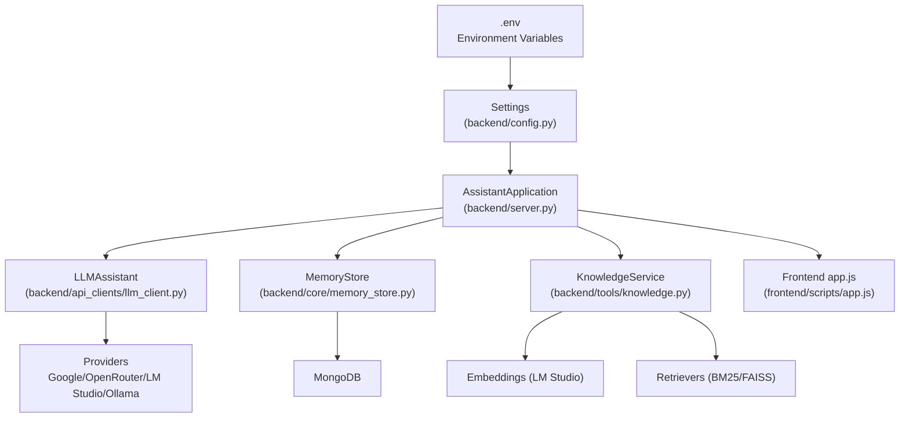
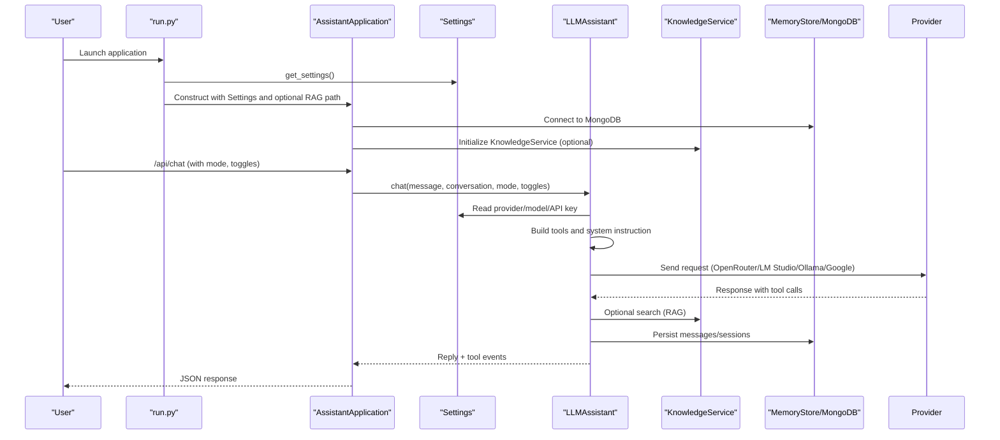
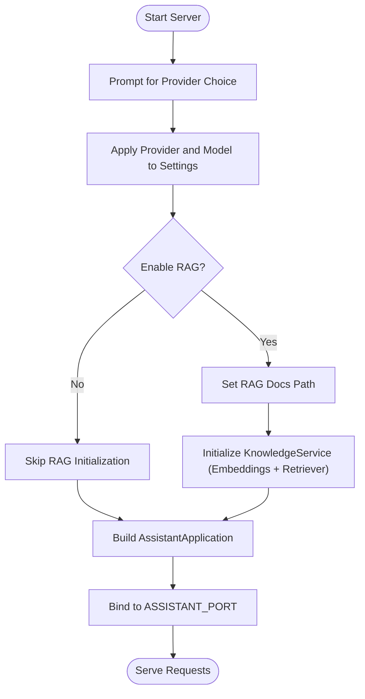
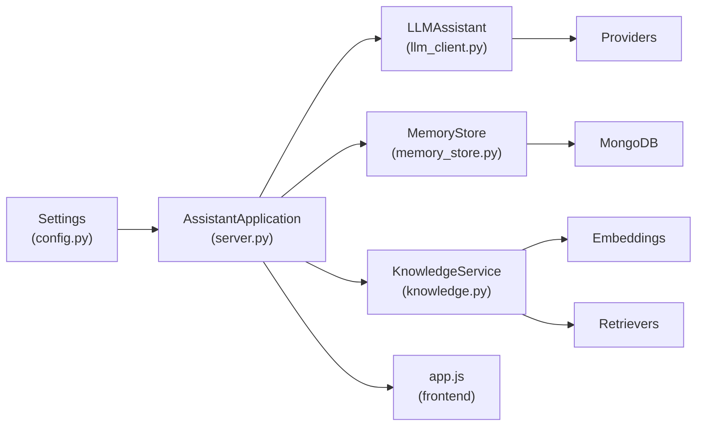

# Configuration and Customization

<cite>
**Referenced Files in This Document**
- [config.py](file://backend/config.py)
- [server.py](file://backend/server.py)
- [llm_client.py](file://backend/api_clients/llm_client.py)
- [knowledge.py](file://backend/tools/knowledge.py)
- [memory_store.py](file://backend/core/memory_store.py)
- [README.md](file://README.md)
- [requirements.txt](file://requirements.txt)
- [run.py](file://run.py)
- [app.js](file://frontend/scripts/app.js)
</cite>

## Table of Contents
1. [Introduction](#introduction)
2. [Project Structure](#project-structure)
3. [Core Components](#core-components)
4. [Architecture Overview](#architecture-overview)
5. [Detailed Component Analysis](#detailed-component-analysis)
6. [Dependency Analysis](#dependency-analysis)
7. [Performance Considerations](#performance-considerations)
8. [Troubleshooting Guide](#troubleshooting-guide)
9. [Conclusion](#conclusion)
10. [Appendices](#appendices)

## Introduction
This document provides comprehensive configuration and customization guidance for the Orbit Virtual Assistant. It explains the complete .env configuration file structure, environment variable loading, configuration validation, runtime configuration changes, and feature toggles. It also covers customization options for providers, models, UI behavior, assistant modes, RAG enablement, and advanced scenarios. Security considerations for API key management, backup strategies for configuration files, and troubleshooting configuration-related issues are included.

## Project Structure
The configuration system centers around a central Settings class loaded from a .env file and consumed by the server and LLM client. The server orchestrates runtime choices for provider selection and RAG enablement, while the LLM client routes requests to the selected provider. MongoDB-backed memory storage persists state, and the frontend reads runtime configuration to render UI state.

**Diagram sources**
- [config.py:55-76](file://backend/config.py#L55-L76)
- [server.py:23-63](file://backend/server.py#L23-L63)
- [llm_client.py:38-78](file://backend/api_clients/llm_client.py#L38-L78)
- [knowledge.py:88-140](file://backend/tools/knowledge.py#L88-L140)
- [memory_store.py:79-117](file://backend/core/memory_store.py#L79-L117)
- [app.js:35-85](file://frontend/scripts/app.js#L35-L85)

**Section sources**
- [config.py:55-76](file://backend/config.py#L55-L76)
- [server.py:566-611](file://backend/server.py#L566-L611)
- [README.md:104-151](file://README.md#L104-L151)

## Core Components
- Settings: Central configuration container with environment variable loading and provider selection helpers.
- AssistantApplication: Runtime composition of memory store, knowledge service, tools, and LLM assistant.
- LLMAssistant: Provider-agnostic chat orchestration that selects endpoints and headers based on Settings.
- KnowledgeService: Optional RAG initialization and retrieval using embeddings and BM25/FAISS.
- MemoryStore: MongoDB-backed persistence for sessions, messages, profile, tasks, notes, and knowledge chunks.
- Frontend app.js: Reads runtime state from the server to render UI and manage toggles.

**Section sources**
- [config.py:20-76](file://backend/config.py#L20-L76)
- [server.py:23-63](file://backend/server.py#L23-L63)
- [llm_client.py:38-78](file://backend/api_clients/llm_client.py#L38-L78)
- [knowledge.py:88-140](file://backend/tools/knowledge.py#L88-L140)
- [memory_store.py:67-117](file://backend/core/memory_store.py#L67-L117)
- [app.js:35-85](file://frontend/scripts/app.js#L35-L85)

## Architecture Overview
The configuration pipeline loads .env variables into Settings, then the server constructs AssistantApplication with provider and RAG choices. The LLM client uses Settings to route requests to the active provider. KnowledgeService initializes embeddings and retrievers when RAG is enabled. MemoryStore connects to MongoDB for persistent state. The frontend consumes /api/state to render UI and toggles.

**Diagram sources**
- [run.py:1-6](file://run.py#L1-L6)
- [server.py:566-611](file://backend/server.py#L566-L611)
- [server.py:23-63](file://backend/server.py#L23-L63)
- [llm_client.py:47-78](file://backend/api_clients/llm_client.py#L47-L78)
- [knowledge.py:122-140](file://backend/tools/knowledge.py#L122-L140)
- [memory_store.py:79-117](file://backend/core/memory_store.py#L79-L117)

## Detailed Component Analysis

### .env Configuration File Structure
The .env file defines environment variables consumed by Settings. The authoritative example is provided in the repository’s README under the “Configuration” section. Below is the complete structure and purpose of each variable.

- API Keys
  - GOOGLE_API_KEY: Required for Google Gemini provider.
  - OPENROUTER_API_KEY: Required for OpenRouter provider.
  - TAVILY_API_KEY: Optional; enables enhanced web search via Tavily.
- Provider and Model
  - ACTIVE_PROVIDER: One of google, openrouter, lm_studio, ollama.
  - AI_MODEL: Default model for OpenRouter/LM Studio/Ollama.
  - GOOGLE_MODEL: Model for Google Gemini provider.
- Local LLM Configurations
  - LM_STUDIO_URL: OpenAI-compatible endpoint for LM Studio (default includes /v1).
  - LM_STUDIO_MODEL: Embedding model identifier for LM Studio.
  - OLLAMA_URL: OpenAI-compatible endpoint for Ollama (default includes /v1).
  - OLLAMA_MODEL: Model identifier for Ollama.
- Server Settings
  - ASSISTANT_PORT: TCP port for the HTTP server (default 8000).
  - LIVE_VOICE_NAME: Default voice name for TTS.
  - DEFAULT_LOCATION: Default location for weather and time-sensitive queries.
- RAG Configuration
  - RAG_DOCS_PATH: Path to the knowledge base directory (optional).
- MongoDB Configuration
  - MONGODB_URI: MongoDB connection string (default localhost).
  - MONGODB_DB: Database name (default orbit_assistant).

Notes:
- ACTIVE_PROVIDER determines provider_name and current_api_key resolution.
- AI_MODEL is used for OpenRouter/LM Studio/Ollama; GOOGLE_MODEL is used for Google.
- LM_STUDIO_URL and OLLAMA_URL must include the /v1 path for OpenAI-compatible chat completions.
- RAG_DOCS_PATH is optional; if omitted, RAG remains disabled until explicitly enabled at runtime.

**Section sources**
- [README.md:104-136](file://README.md#L104-L136)
- [config.py:20-76](file://backend/config.py#L20-L76)

### Environment Variable Loading and Validation
- Loading: A custom dotenv loader reads the .env file line-by-line, skipping comments and malformed lines, and sets environment variables only if unset.
- Validation: Settings constructor reads environment variables with defaults and converts types (e.g., port to int). Provider selection and model defaults are enforced.
- Provider Selection Helpers:
  - provider_name maps ACTIVE_PROVIDER to a human-readable label.
  - current_api_key resolves the active API key based on provider.

Runtime validation occurs during chat:
- If current_api_key is empty for the selected provider, the LLM client raises an error instructing to check .env.
- Google provider requires GOOGLE_API_KEY; OpenRouter requires OPENROUTER_API_KEY; local providers (LM Studio/Ollama) do not require API keys.

**Section sources**
- [config.py:8-17](file://backend/config.py#L8-L17)
- [config.py:55-76](file://backend/config.py#L55-L76)
- [llm_client.py:60-61](file://backend/api_clients/llm_client.py#L60-L61)

### Runtime Configuration Changes
The server supports interactive configuration at startup:
- Provider Selection: Terminal prompts allow choosing among Google, OpenRouter, LM Studio, or Ollama. The chosen provider and model are applied to Settings.
- RAG Enablement: At startup, the user can enable RAG and optionally specify a knowledge base path. If enabled, KnowledgeService initializes embeddings and retrievers.
- Port Binding: The server binds to 127.0.0.1 on the configured port.

These runtime choices are not persisted to .env; they apply only to the current session.

**Diagram sources**
- [server.py:566-611](file://backend/server.py#L566-L611)
- [knowledge.py:122-140](file://backend/tools/knowledge.py#L122-L140)

**Section sources**
- [server.py:566-611](file://backend/server.py#L566-L611)

### Feature Toggles and Assistant Modes
Feature toggles and modes are passed in chat requests and influence tool availability and system instructions:
- Mode: simple, copilot, coach (case-insensitive). The system instruction adapts accordingly.
- Web Search Toggle: Forces retrieval via web search only, disabling local RAG.
- Offline Mode: Disables web search and external tools.
- Screen Image: Optional base64 image payload for screen-aware assistance.
- Session ID: Enables session-scoped document search and attachment awareness.

The frontend maintains UI state for toggles and stores some preferences in localStorage (e.g., coach topic/level, preferred language).

**Section sources**
- [server.py:296-320](file://backend/server.py#L296-L320)
- [app.js:35-85](file://frontend/scripts/app.js#L35-L85)
- [llm_client.py:47-78](file://backend/api_clients/llm_client.py#L47-L78)

### Provider Switching and Model Selection
- Provider Routing: The LLM client routes requests to OpenRouter, LM Studio, or Ollama endpoints depending on ACTIVE_PROVIDER. Google uses a dedicated REST endpoint.
- Headers and Endpoints:
  - OpenRouter: Authorization header with OPENROUTER_API_KEY.
  - LM Studio: Endpoint constructed from LM_STUDIO_URL; no API key required.
  - Ollama: Endpoint constructed from OLLAMA_URL; no API key required.
  - Google: x-goog-api-key header with GOOGLE_API_KEY.
- Model Resolution:
  - ACTIVE_PROVIDER dictates which model variable is used (AI_MODEL for OpenRouter/LM Studio/Ollama; GOOGLE_MODEL for Google).

**Section sources**
- [llm_client.py:136-149](file://backend/api_clients/llm_client.py#L136-L149)
- [llm_client.py:293-314](file://backend/api_clients/llm_client.py#L293-L314)
- [config.py:63-66](file://backend/config.py#L63-L66)

### RAG Configuration and Enablement
- Knowledge Base Path: RAG_DOCS_PATH or a user-specified path at runtime.
- Embeddings: When RAG is enabled, KnowledgeService attempts to initialize OpenAI-compatible embeddings against LM Studio. If unavailable, it falls back to BM25-only retrieval.
- Hybrid Retrieval: If embeddings succeed, FAISS is built and combined with BM25 via an EnsembleRetriever.
- Session Documents: Attachments uploaded during a session are parsed and indexed for session-scoped retrieval.
- Toggle Behavior: Web Search Only disables local RAG; Offline Mode disables web search and external tools.

**Section sources**
- [knowledge.py:122-140](file://backend/tools/knowledge.py#L122-L140)
- [knowledge.py:231-264](file://backend/tools/knowledge.py#L231-L264)
- [knowledge.py:303-335](file://backend/tools/knowledge.py#L303-L335)
- [server.py:296-320](file://backend/server.py#L296-L320)

### MongoDB Connection Parameters
- Connection: MemoryStore connects to MongoDB using MONGODB_URI and MONGODB_DB. It performs a ping to validate connectivity and ensures indexes and collections exist.
- Persistence: Sessions, messages, profile, notes, tasks, activity cache, knowledge chunks, session attachments, and session chunks are stored in MongoDB collections.

**Section sources**
- [memory_store.py:79-117](file://backend/core/memory_store.py#L79-L117)
- [memory_store.py:23-62](file://backend/core/memory_store.py#L23-L62)
- [config.py:73-74](file://backend/config.py#L73-L74)

### UI Themes and Voice Configuration
- Voice: LIVE_VOICE_NAME influences the default voice for TTS. The frontend manages voice language options and toggle states.
- UI Panels: The frontend maintains state for sidebar, drawer, and various toggles (web search, thinking, image generation, offline mode). These are reflected in the UI and can be toggled by the user.
- Runtime State: The server exposes /api/state to the frontend, which renders provider, model, location, voice, memory, and sessions.

**Section sources**
- [config.py:68-69](file://backend/config.py#L68-L69)
- [app.js:6-19](file://frontend/scripts/app.js#L6-L19)
- [app.js:35-85](file://frontend/scripts/app.js#L35-L85)
- [server.py:506-520](file://backend/server.py#L506-L520)

### Advanced Configuration Scenarios
- Mixed Providers: ACTIVE_PROVIDER can be switched at runtime; model variables can be adjusted via environment variables for each provider.
- Local RAG Without Embeddings: If LM Studio embeddings are unreachable, BM25-only retrieval is used.
- Remote MongoDB: MONGODB_URI can point to a remote MongoDB instance; ensure network accessibility and credentials.
- Web Search Enhancements: TAVILY_API_KEY improves web search quality; without it, DuckDuckGo is used as a fallback.

**Section sources**
- [README.md:104-136](file://README.md#L104-L136)
- [requirements.txt:14-16](file://requirements.txt#L14-L16)
- [knowledge.py:132-137](file://backend/tools/knowledge.py#L132-L137)

## Dependency Analysis
The configuration system depends on:
- Settings for environment variable resolution and provider selection.
- AssistantApplication for composing runtime components.
- LLMAssistant for provider routing and tool invocation.
- KnowledgeService for optional RAG initialization.
- MemoryStore for persistent state.
- Frontend app.js for rendering UI state.

**Diagram sources**
- [config.py:55-76](file://backend/config.py#L55-L76)
- [server.py:23-63](file://backend/server.py#L23-L63)
- [llm_client.py:38-78](file://backend/api_clients/llm_client.py#L38-L78)
- [knowledge.py:88-140](file://backend/tools/knowledge.py#L88-L140)
- [memory_store.py:79-117](file://backend/core/memory_store.py#L79-L117)
- [app.js:35-85](file://frontend/scripts/app.js#L35-L85)

**Section sources**
- [config.py:55-76](file://backend/config.py#L55-L76)
- [server.py:23-63](file://backend/server.py#L23-L63)
- [llm_client.py:38-78](file://backend/api_clients/llm_client.py#L38-L78)
- [knowledge.py:88-140](file://backend/tools/knowledge.py#L88-L140)
- [memory_store.py:79-117](file://backend/core/memory_store.py#L79-L117)
- [app.js:35-85](file://frontend/scripts/app.js#L35-L85)

## Performance Considerations
- Provider Latency: OpenRouter/LM Studio/Ollama rely on network latency; Google REST API is constrained by API rate limits.
- RAG Overhead: Building FAISS indices and embeddings can be CPU-intensive; consider enabling RAG only when needed.
- MongoDB Connection: Ensure MONGODB_URI points to a responsive database; timeouts are configured in MemoryStore.
- Tool Loop Limit: The LLM client enforces a maximum iteration limit to prevent runaway tool calls.

[No sources needed since this section provides general guidance]

## Troubleshooting Guide
Common configuration issues and resolutions:
- Missing API Key
  - Symptom: Chat fails with an error indicating the provider API key is missing.
  - Resolution: Set GOOGLE_API_KEY or OPENROUTER_API_KEY in .env according to ACTIVE_PROVIDER.
- Provider Not Responding
  - Symptom: HTTP errors or connection failures when calling OpenRouter/LM Studio/Ollama/Google.
  - Resolution: Verify provider URLs (LM_STUDIO_URL, OLLAMA_URL include /v1), network connectivity, and model identifiers.
- RAG Not Working
  - Symptom: Knowledge base search returns “not available” or “no relevant info.”
  - Resolution: Confirm RAG_DOCS_PATH exists and contains supported file types (.pdf, .docx, .txt, .md, .csv, .json). Ensure LM Studio embeddings are reachable; otherwise, BM25-only search will be used.
- MongoDB Connection Failure
  - Symptom: Startup error indicating inability to connect to MongoDB.
  - Resolution: Check MONGODB_URI and MONGODB_DB; ensure the MongoDB server is running and accessible.
- Web Search Quality
  - Symptom: Limited or outdated results.
  - Resolution: Obtain a TAVILY_API_KEY to improve search quality; otherwise DuckDuckGo fallback is used.
- Runtime Provider/Model Changes
  - Symptom: Changes made at runtime do not persist.
  - Resolution: Remember that runtime choices apply only to the current session; update .env for permanent changes.

**Section sources**
- [llm_client.py:60-61](file://backend/api_clients/llm_client.py#L60-L61)
- [llm_client.py:158-174](file://backend/api_clients/llm_client.py#L158-L174)
- [knowledge.py:132-137](file://backend/tools/knowledge.py#L132-L137)
- [memory_store.py:86-98](file://backend/core/memory_store.py#L86-L98)
- [README.md:104-136](file://README.md#L104-L136)

## Conclusion
The Orbit Virtual Assistant’s configuration system is centered on a robust .env loader and a flexible Settings class. Runtime choices allow dynamic provider and RAG configuration, while MongoDB-backed persistence ensures continuity. By following the guidance in this document, you can tailor the assistant to your environment, enhance privacy with local providers, enable RAG for personal knowledge, and troubleshoot common configuration pitfalls.

[No sources needed since this section summarizes without analyzing specific files]

## Appendices

### A. Complete .env Reference
- API Keys
  - GOOGLE_API_KEY
  - OPENROUTER_API_KEY
  - TAVILY_API_KEY
- Provider and Model
  - ACTIVE_PROVIDER
  - AI_MODEL
  - GOOGLE_MODEL
- Local LLM Configs
  - LM_STUDIO_URL
  - LM_STUDIO_MODEL
  - OLLAMA_URL
  - OLLAMA_MODEL
- Server
  - ASSISTANT_PORT
  - LIVE_VOICE_NAME
  - DEFAULT_LOCATION
- RAG
  - RAG_DOCS_PATH
- MongoDB
  - MONGODB_URI
  - MONGODB_DB

**Section sources**
- [README.md:104-136](file://README.md#L104-L136)
- [config.py:20-76](file://backend/config.py#L20-L76)

### B. Security Considerations
- Store .env securely and restrict file permissions.
- Avoid committing .env to version control; use .gitignore.
- Rotate API keys periodically and revoke compromised keys.
- For local RAG, ensure LM Studio is trusted and not exposed to untrusted networks.

**Section sources**
- [README.md:205-211](file://README.md#L205-L211)

### C. Backup Strategies
- Back up .env regularly alongside code.
- For MongoDB, use official backup tools; ensure backups include all collections used by the assistant.
- Maintain separate backups for knowledge_base/ and data/ directories if relying on legacy JSON files.

**Section sources**
- [README.md:196-200](file://README.md#L196-L200)
- [memory_store.py:23-62](file://backend/core/memory_store.py#L23-L62)