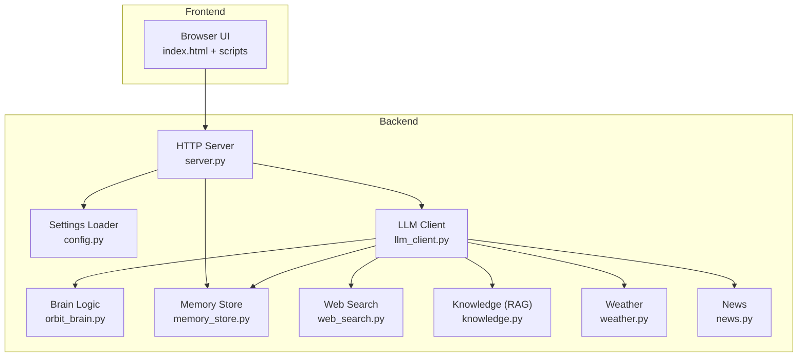
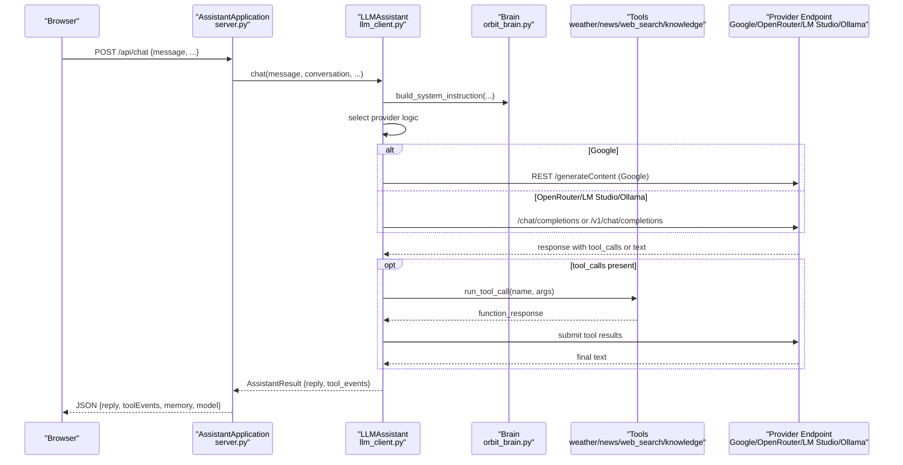
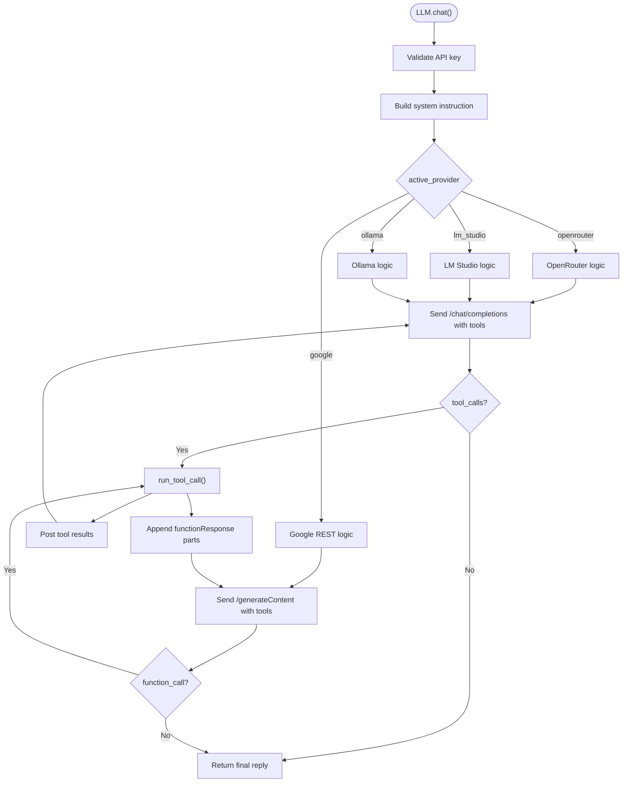
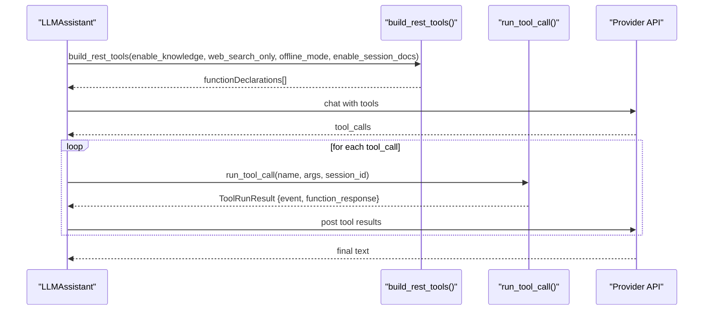
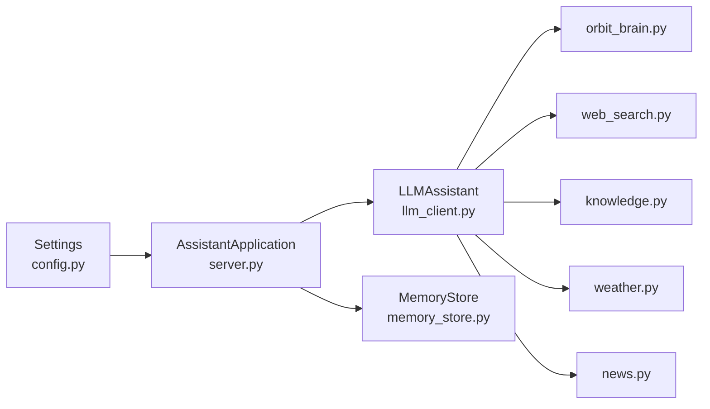

# AI Providers and Integration

<cite>
**Referenced Files in This Document**
- [README.md](file://README.md)
- [run.py](file://run.py)
- [backend/config.py](file://backend/config.py)
- [backend/server.py](file://backend/server.py)
- [backend/api_clients/llm_client.py](file://backend/api_clients/llm_client.py)
- [backend/api_clients/gemini_client.py](file://backend/api_clients/gemini_client.py)
- [backend/core/orbit_brain.py](file://backend/core/orbit_brain.py)
- [backend/core/memory_store.py](file://backend/core/memory_store.py)
- [backend/tools/web_search.py](file://backend/tools/web_search.py)
- [backend/tools/knowledge.py](file://backend/tools/knowledge.py)
- [backend/tools/weather.py](file://backend/tools/weather.py)
- [backend/tools/news.py](file://backend/tools/news.py)
</cite>

## Table of Contents
1. [Introduction](#introduction)
2. [Project Structure](#project-structure)
3. [Core Components](#core-components)
4. [Architecture Overview](#architecture-overview)
5. [Detailed Component Analysis](#detailed-component-analysis)
6. [Dependency Analysis](#dependency-analysis)
7. [Performance Considerations](#performance-considerations)
8. [Troubleshooting Guide](#troubleshooting-guide)
9. [Conclusion](#conclusion)
10. [Appendices](#appendices)

## Introduction
This document explains the multi-provider AI integration system that powers the assistant. It focuses on the factory-like selection of providers (Google Gemini, OpenRouter, LM Studio, and Ollama), the LLM client architecture with dynamic provider switching, API key management, configuration options, and the tool calling mechanism that orchestrates function declarations across providers. It also covers provider-specific setup, authentication, rate-limiting considerations, fallback strategies, and practical examples of configuration, switching logic, and error handling patterns.

## Project Structure
The assistant is organized into a backend server, provider clients, brain logic, tools, and configuration. The server initializes settings, constructs the assistant, and exposes HTTP endpoints. The LLM client encapsulates provider-specific logic and tool orchestration. The brain defines system instructions and function declarations. Tools provide external data retrieval and local RAG capabilities.

**Diagram sources**
- [backend/server.py:23-63](file://backend/server.py#L23-L63)
- [backend/config.py:55-76](file://backend/config.py#L55-L76)
- [backend/api_clients/llm_client.py:38-78](file://backend/api_clients/llm_client.py#L38-L78)
- [backend/core/orbit_brain.py:302-387](file://backend/core/orbit_brain.py#L302-L387)
- [backend/core/memory_store.py:67-117](file://backend/core/memory_store.py#L67-L117)
- [backend/tools/web_search.py:53-104](file://backend/tools/web_search.py#L53-L104)
- [backend/tools/knowledge.py:88-139](file://backend/tools/knowledge.py#L88-L139)
- [backend/tools/weather.py:48-76](file://backend/tools/weather.py#L48-L76)
- [backend/tools/news.py:22-60](file://backend/tools/news.py#L22-L60)

**Section sources**
- [README.md:164-201](file://README.md#L164-L201)
- [backend/server.py:23-63](file://backend/server.py#L23-L63)

## Core Components
- Settings and provider selection: Centralized configuration with environment variables and runtime provider switching.
- LLM client: Orchestrates provider-specific chat flows, tool declarations, and tool execution.
- Brain logic: Builds system instructions and function declarations for tools.
- Tools: Weather, news, web search, and knowledge (RAG) services.
- Memory store: MongoDB-backed persistence for sessions, messages, profile, tasks, and knowledge chunks.

**Section sources**
- [backend/config.py:20-76](file://backend/config.py#L20-L76)
- [backend/api_clients/llm_client.py:38-366](file://backend/api_clients/llm_client.py#L38-L366)
- [backend/core/orbit_brain.py:302-502](file://backend/core/orbit_brain.py#L302-L502)
- [backend/core/memory_store.py:67-200](file://backend/core/memory_store.py#L67-L200)
- [backend/tools/web_search.py:53-139](file://backend/tools/web_search.py#L53-L139)
- [backend/tools/knowledge.py:88-393](file://backend/tools/knowledge.py#L88-L393)
- [backend/tools/weather.py:48-141](file://backend/tools/weather.py#L48-L141)
- [backend/tools/news.py:22-83](file://backend/tools/news.py#L22-L83)

## Architecture Overview
The system implements a dynamic provider switch within a single client class. The server constructs the LLM client with settings and passes user messages to the client’s chat method. The client selects the provider logic based on active provider and delegates to either Google Gemini REST API or OpenRouter/LM Studio/Ollama OpenAI-compatible endpoints. Tool declarations are built centrally and passed to the provider, which executes tool calls and returns results back to the client.

**Diagram sources**
- [backend/server.py:276-321](file://backend/server.py#L276-L321)
- [backend/api_clients/llm_client.py:47-78](file://backend/api_clients/llm_client.py#L47-L78)
- [backend/api_clients/llm_client.py:82-216](file://backend/api_clients/llm_client.py#L82-L216)
- [backend/api_clients/llm_client.py:220-273](file://backend/api_clients/llm_client.py#L220-L273)
- [backend/core/orbit_brain.py:302-387](file://backend/core/orbit_brain.py#L302-L387)
- [backend/core/orbit_brain.py:389-502](file://backend/core/orbit_brain.py#L389-L502)

## Detailed Component Analysis

### LLM Client and Provider Switching
The LLM client encapsulates the provider selection and chat logic. It validates the presence of an API key, builds system instructions, and routes to provider-specific handlers. For OpenRouter/LM Studio/Ollama, it sends OpenAI-compatible chat completions with tool declarations. For Google, it uses the REST API with function calls.

Key behaviors:
- Provider selection: active provider determines routing to OpenRouter/LM Studio/Ollama or Google logic.
- Tool declarations: built centrally and passed to providers.
- Tool orchestration: executes tool calls and posts results back to the provider until a final text response is produced.
- Error handling: wraps provider errors and raises a unified client error.

**Diagram sources**
- [backend/api_clients/llm_client.py:47-78](file://backend/api_clients/llm_client.py#L47-L78)
- [backend/api_clients/llm_client.py:82-216](file://backend/api_clients/llm_client.py#L82-L216)
- [backend/api_clients/llm_client.py:220-273](file://backend/api_clients/llm_client.py#L220-L273)
- [backend/core/orbit_brain.py:361-387](file://backend/core/orbit_brain.py#L361-L387)
- [backend/core/orbit_brain.py:389-502](file://backend/core/orbit_brain.py#L389-L502)

**Section sources**
- [backend/api_clients/llm_client.py:38-366](file://backend/api_clients/llm_client.py#L38-L366)

### Settings and Provider Configuration
Settings are loaded from environment variables and expose provider-specific fields. The active provider controls which API key is used and how the client routes requests. The server allows interactive selection of provider and model at startup.

Highlights:
- Active provider selection and model configuration.
- API key exposure via a property that maps to the active provider.
- Local LLM URLs and models for LM Studio and Ollama.
- MongoDB configuration for persistence.

**Section sources**
- [backend/config.py:20-76](file://backend/config.py#L20-L76)
- [backend/server.py:566-611](file://backend/server.py#L566-L611)

### Tool Calling Mechanism
The brain defines function declarations for tools (weather, news, memory, tasks, notes, web search, local knowledge, session docs). The LLM client builds tool definitions and passes them to the provider. On tool calls, the client executes the tool via a dispatcher and posts results back to the provider for iterative refinement until a final text response is produced.

**Diagram sources**
- [backend/core/orbit_brain.py:361-387](file://backend/core/orbit_brain.py#L361-L387)
- [backend/core/orbit_brain.py:389-502](file://backend/core/orbit_brain.py#L389-L502)
- [backend/api_clients/llm_client.py:109-116](file://backend/api_clients/llm_client.py#L109-L116)
- [backend/api_clients/llm_client.py:185-214](file://backend/api_clients/llm_client.py#L185-L214)

**Section sources**
- [backend/core/orbit_brain.py:74-268](file://backend/core/orbit_brain.py#L74-L268)
- [backend/core/orbit_brain.py:361-387](file://backend/core/orbit_brain.py#L361-L387)
- [backend/core/orbit_brain.py:389-502](file://backend/core/orbit_brain.py#L389-L502)

### Provider-Specific Setup and Authentication
- Google Gemini:
  - Uses REST API with x-goog-api-key header.
  - Requires GOOGLE_API_KEY in environment.
  - Model configured via GOOGLE_MODEL or AI_MODEL.
- OpenRouter:
  - Uses OpenAI-compatible /chat/completions.
  - Requires OPENROUTER_API_KEY in environment.
  - Model configured via AI_MODEL.
  - Authorization header includes bearer token.
- LM Studio:
  - Uses OpenAI-compatible /chat/completions.
  - Requires LM_STUDIO_URL and LM_STUDIO_MODEL.
  - No API key required for local endpoint.
- Ollama:
  - Uses OpenAI-compatible /v1/chat/completions.
  - Requires OLLAMA_URL and OLLAMA_MODEL.
  - No API key required for local endpoint.

**Section sources**
- [backend/api_clients/llm_client.py:24-26](file://backend/api_clients/llm_client.py#L24-L26)
- [backend/api_clients/llm_client.py:136-149](file://backend/api_clients/llm_client.py#L136-L149)
- [backend/api_clients/llm_client.py:293-324](file://backend/api_clients/llm_client.py#L293-L324)
- [backend/config.py:26-34](file://backend/config.py#L26-L34)
- [backend/config.py:64-72](file://backend/config.py#L64-L72)

### Rate Limiting and Fallback Strategies
- Provider errors are captured and surfaced as client errors. Moderation-related 403 responses are handled gracefully for OpenRouter.
- Web search falls back from Tavily to DuckDuckGo when Tavily is unavailable or fails.
- Local RAG embeddings are optional; if LM Studio embeddings are unavailable, the system continues with BM25-only retrieval.
- The server returns graceful refusals for unsupported features (e.g., image generation) instead of crashing.

**Section sources**
- [backend/api_clients/llm_client.py:161-175](file://backend/api_clients/llm_client.py#L161-L175)
- [backend/tools/web_search.py:69-104](file://backend/tools/web_search.py#L69-L104)
- [backend/tools/knowledge.py:122-138](file://backend/tools/knowledge.py#L122-L138)
- [backend/server.py:268-275](file://backend/server.py#L268-L275)

### Practical Examples
- Provider configuration via environment:
  - ACTIVE_PROVIDER, GOOGLE_API_KEY, OPENROUTER_API_KEY, AI_MODEL, GOOGLE_MODEL, LM_STUDIO_URL, LM_STUDIO_MODEL, OLLAMA_URL, OLLAMA_MODEL, RAG_DOCS_PATH, MONGODB_URI, MONGODB_DB.
- Runtime provider switching:
  - Interactive selection at startup and model overrides per provider.
- Tool orchestration:
  - Function declarations built based on mode, offline/web search toggles, and session attachments.
- Error handling:
  - LLMClientError raised for provider failures; server responds with BAD_GATEWAY.

**Section sources**
- [README.md:104-136](file://README.md#L104-L136)
- [backend/server.py:566-611](file://backend/server.py#L566-L611)
- [backend/core/orbit_brain.py:302-387](file://backend/core/orbit_brain.py#L302-L387)
- [backend/server.py:295-310](file://backend/server.py#L295-L310)

## Dependency Analysis
The LLM client depends on settings, memory store, and tools. The server composes these components and exposes HTTP endpoints. The brain and tools are shared across providers.

**Diagram sources**
- [backend/server.py:23-63](file://backend/server.py#L23-L63)
- [backend/api_clients/llm_client.py:38-46](file://backend/api_clients/llm_client.py#L38-L46)
- [backend/core/orbit_brain.py:14-21](file://backend/core/orbit_brain.py#L14-L21)

**Section sources**
- [backend/server.py:23-63](file://backend/server.py#L23-L63)
- [backend/api_clients/llm_client.py:38-46](file://backend/api_clients/llm_client.py#L38-L46)

## Performance Considerations
- Provider timeouts: HTTP requests use timeouts to prevent hanging calls.
- Tool loop limits: The client enforces a maximum iteration count to avoid infinite loops during tool orchestration.
- RAG initialization: Knowledge base indexing occurs at startup and caches retrievers; embeddings availability affects hybrid retrieval performance.
- Web search latency: Spinner timers indicate progress; fallback reduces repeated failures.

[No sources needed since this section provides general guidance]

## Troubleshooting Guide
Common issues and resolutions:
- Missing API key:
  - Ensure GOOGLE_API_KEY or OPENROUTER_API_KEY is set for the selected provider.
- Provider unreachable:
  - Verify network connectivity and endpoint URLs for LM Studio or Ollama.
- Tool call failures:
  - Confirm tools are enabled via mode and toggles; check session attachments for session-docs tool.
- Web search failures:
  - Tavily fallback is automatic; ensure TAVILY_API_KEY is set if using Tavily.
- MongoDB connection:
  - Ensure MONGODB_URI and MONGODB_DB are correct; server performs a ping to validate connectivity.

**Section sources**
- [backend/api_clients/llm_client.py:60-61](file://backend/api_clients/llm_client.py#L60-L61)
- [backend/config.py:49-52](file://backend/config.py#L49-L52)
- [backend/server.py:86-167](file://backend/server.py#L86-L167)
- [backend/tools/web_search.py:63-68](file://backend/tools/web_search.py#L63-L68)
- [backend/core/memory_store.py:86-98](file://backend/core/memory_store.py#L86-L98)

## Conclusion
The multi-provider AI integration centers on a flexible LLM client that routes to Google Gemini or OpenRouter/LM Studio/Ollama based on configuration. The brain and tools define a consistent function declaration surface, enabling robust tool orchestration across providers. Configuration is managed via environment variables with runtime provider selection, while error handling and fallbacks ensure resilience. The system balances cloud and local execution, offering privacy-friendly options alongside high-quality cloud models.

[No sources needed since this section summarizes without analyzing specific files]

## Appendices

### Provider Configuration Reference
- Google Gemini:
  - GOOGLE_API_KEY
  - GOOGLE_MODEL or AI_MODEL
- OpenRouter:
  - OPENROUTER_API_KEY
  - AI_MODEL
- LM Studio:
  - LM_STUDIO_URL
  - LM_STUDIO_MODEL
- Ollama:
  - OLLAMA_URL
  - OLLAMA_MODEL
- Web Search:
  - TAVILY_API_KEY (optional)
- MongoDB:
  - MONGODB_URI
  - MONGODB_DB

**Section sources**
- [README.md:104-136](file://README.md#L104-L136)
- [backend/config.py:64-74](file://backend/config.py#L64-L74)