# Features and Capabilities

<cite>
**Referenced Files in This Document**
- [README.md](file://README.md)
- [run.py](file://run.py)
- [backend/config.py](file://backend/config.py)
- [backend/server.py](file://backend/server.py)
- [backend/api_clients/llm_client.py](file://backend/api_clients/llm_client.py)
- [backend/core/orbit_brain.py](file://backend/core/orbit_brain.py)
- [backend/tools/knowledge.py](file://backend/tools/knowledge.py)
- [backend/tools/web_search.py](file://backend/tools/web_search.py)
- [backend/core/memory_store.py](file://backend/core/memory_store.py)
- [backend/audio/asr_whisper.py](file://backend/audio/asr_whisper.py)
- [frontend/index.html](file://frontend/index.html)
- [frontend/scripts/app.js](file://frontend/scripts/app.js)
- [frontend/scripts/avatar-renderer.js](file://frontend/scripts/avatar-renderer.js)
- [frontend/scripts/avatar-worker.js](file://frontend/scripts/avatar-worker.js)
- [requirements.txt](file://requirements.txt)
</cite>

## Table of Contents
1. [Introduction](#introduction)
2. [Project Structure](#project-structure)
3. [Core Components](#core-components)
4. [Architecture Overview](#architecture-overview)
5. [Detailed Component Analysis](#detailed-component-analysis)
6. [Dependency Analysis](#dependency-analysis)
7. [Performance Considerations](#performance-considerations)
8. [Troubleshooting Guide](#troubleshooting-guide)
9. [Conclusion](#conclusion)
10. [Appendices](#appendices)

## Introduction
This document explains the Orbit Virtual Assistant’s features and capabilities, focusing on multi-provider AI integration, Knowledge Lab (local RAG), live web search, multi-session chat with MongoDB persistence, screen-aware assistance, voice input controls, animated avatar system, and graceful fallback mechanisms. It provides practical usage guidance, configuration options, performance characteristics, and troubleshooting tips.

## Project Structure
The Orbit Assistant is organized into a Python backend and a vanilla JavaScript/HTML/CSS frontend. The backend exposes HTTP endpoints, orchestrates LLM providers, manages memory, and runs tools (web search, weather, news, and local knowledge). The frontend renders the UI, manages sessions, voice input, screen sharing, and an animated avatar powered by a Web Worker.

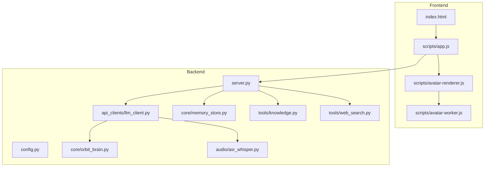

**Diagram sources**
- [frontend/index.html:1-338](file://frontend/index.html#L1-L338)
- [frontend/scripts/app.js:1-800](file://frontend/scripts/app.js#L1-L800)
- [frontend/scripts/avatar-renderer.js:1-106](file://frontend/scripts/avatar-renderer.js#L1-L106)
- [frontend/scripts/avatar-worker.js:1-48](file://frontend/scripts/avatar-worker.js#L1-L48)
- [backend/server.py:1-611](file://backend/server.py#L1-L611)
- [backend/config.py:1-76](file://backend/config.py#L1-L76)
- [backend/api_clients/llm_client.py:1-366](file://backend/api_clients/llm_client.py#L1-L366)
- [backend/core/orbit_brain.py:1-502](file://backend/core/orbit_brain.py#L1-L502)
- [backend/core/memory_store.py:1-947](file://backend/core/memory_store.py#L1-L947)
- [backend/tools/knowledge.py:1-393](file://backend/tools/knowledge.py#L1-L393)
- [backend/tools/web_search.py:1-139](file://backend/tools/web_search.py#L1-L139)
- [backend/audio/asr_whisper.py:1-19](file://backend/audio/asr_whisper.py#L1-L19)

**Section sources**
- [README.md:164-201](file://README.md#L164-L201)
- [backend/server.py:23-83](file://backend/server.py#L23-L83)

## Core Components
- Multi-provider AI integration: Supports Google Gemini, OpenRouter, LM Studio, and Ollama. Provider selection and model routing are handled centrally.
- Knowledge Lab (Local RAG): Uses LangChain, FAISS, and BM25 to index and retrieve from local documents.
- Live web search: Tavily (primary) and DuckDuckGo (fallback) for up-to-date information.
- Multi-session chat: MongoDB-backed sessions, messages, tasks, notes, and profile.
- Screen-aware assistance: Browser display media sharing to provide context to the assistant.
- Voice input controls: Push-to-talk (hold Control) and review-before-send (Ctrl+M) modes.
- Animated avatar: Web Worker-driven avatar rendering with state transitions.
- Graceful fallbacks: Intercept unsupported features and return clear refusal messages.

**Section sources**
- [README.md:13-51](file://README.md#L13-L51)
- [backend/config.py:20-76](file://backend/config.py#L20-L76)
- [backend/server.py:23-63](file://backend/server.py#L23-L63)
- [backend/api_clients/llm_client.py:38-78](file://backend/api_clients/llm_client.py#L38-L78)
- [backend/core/orbit_brain.py:358-387](file://backend/core/orbit_brain.py#L358-L387)
- [backend/tools/knowledge.py:88-140](file://backend/tools/knowledge.py#L88-L140)
- [backend/tools/web_search.py:53-104](file://backend/tools/web_search.py#L53-L104)
- [backend/core/memory_store.py:67-150](file://backend/core/memory_store.py#L67-L150)
- [frontend/scripts/app.js:536-565](file://frontend/scripts/app.js#L536-L565)
- [frontend/scripts/avatar-worker.js:1-48](file://frontend/scripts/avatar-worker.js#L1-L48)

## Architecture Overview
The assistant runs a threaded HTTP server that serves static assets and REST endpoints. The frontend communicates with the backend via JSON APIs for chat, sessions, tools, and utilities. The brain composes system instructions and tool declarations, dispatching tool calls to services that persist state and return structured events.

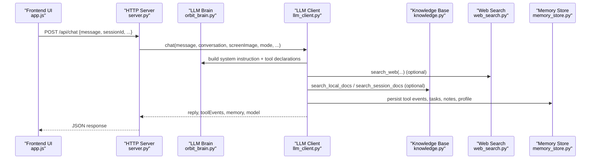

**Diagram sources**
- [backend/server.py:276-321](file://backend/server.py#L276-L321)
- [backend/api_clients/llm_client.py:47-78](file://backend/api_clients/llm_client.py#L47-L78)
- [backend/core/orbit_brain.py:302-357](file://backend/core/orbit_brain.py#L302-L357)
- [backend/tools/knowledge.py:270-298](file://backend/tools/knowledge.py#L270-L298)
- [backend/tools/web_search.py:69-104](file://backend/tools/web_search.py#L69-L104)
- [backend/core/memory_store.py:188-250](file://backend/core/memory_store.py#L188-L250)

## Detailed Component Analysis

### Multi-Provider AI Integration
- Provider selection: Terminal prompts allow choosing among Google, OpenRouter, LM Studio, and Ollama. The active provider determines endpoint routing and tool availability.
- Routing logic: The LLM client branches between OpenRouter-compatible endpoints and Google REST API, injecting appropriate headers and payloads.
- Tool availability: Tools are conditionally included based on provider capabilities and mode flags (web search only, offline mode, session docs).

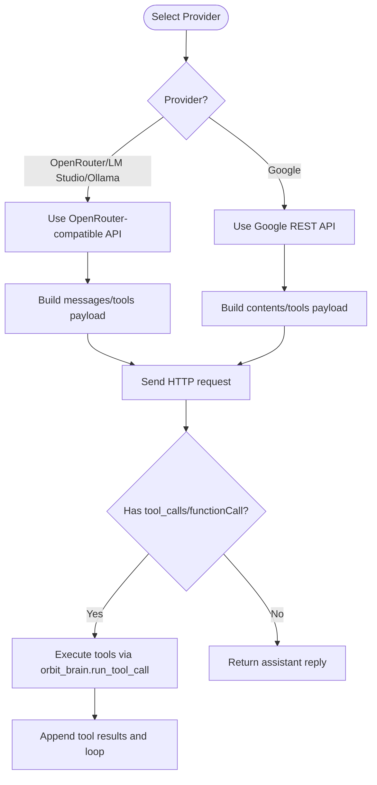

**Diagram sources**
- [backend/server.py:566-611](file://backend/server.py#L566-L611)
- [backend/api_clients/llm_client.py:74-77](file://backend/api_clients/llm_client.py#L74-L77)
- [backend/api_clients/llm_client.py:82-216](file://backend/api_clients/llm_client.py#L82-L216)
- [backend/api_clients/llm_client.py:220-273](file://backend/api_clients/llm_client.py#L220-L273)
- [backend/core/orbit_brain.py:389-501](file://backend/core/orbit_brain.py#L389-L501)

**Section sources**
- [backend/server.py:566-611](file://backend/server.py#L566-L611)
- [backend/api_clients/llm_client.py:38-78](file://backend/api_clients/llm_client.py#L38-L78)
- [backend/core/orbit_brain.py:361-387](file://backend/core/orbit_brain.py#L361-L387)

### Knowledge Lab (Local RAG)
- Startup initialization: If a knowledge base path is provided, the system connects to LM Studio embeddings (when available), parses supported documents, and builds FAISS + BM25 hybrid retrievers.
- Retrieval: Two retrieval modes:
  - Persistent knowledge base: global documents indexed at startup.
  - Session-scoped documents: files attached to a chat session, indexed on upload.
- Hybrid retrieval: BM25 + FAISS ensemble with balanced weights; falls back to BM25-only if FAISS fails.

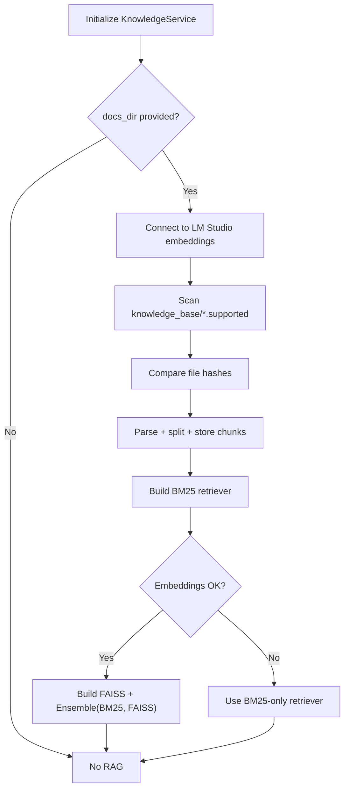

**Diagram sources**
- [backend/tools/knowledge.py:145-230](file://backend/tools/knowledge.py#L145-L230)
- [backend/tools/knowledge.py:231-265](file://backend/tools/knowledge.py#L231-L265)
- [backend/tools/knowledge.py:270-298](file://backend/tools/knowledge.py#L270-L298)
- [backend/tools/knowledge.py:303-336](file://backend/tools/knowledge.py#L303-L336)
- [backend/tools/knowledge.py:337-356](file://backend/tools/knowledge.py#L337-L356)

**Section sources**
- [backend/tools/knowledge.py:88-140](file://backend/tools/knowledge.py#L88-L140)
- [backend/tools/knowledge.py:231-265](file://backend/tools/knowledge.py#L231-L265)
- [backend/tools/knowledge.py:270-298](file://backend/tools/knowledge.py#L270-L298)
- [backend/tools/knowledge.py:303-356](file://backend/tools/knowledge.py#L303-L356)

### Live Web Search (Tavily + DuckDuckGo)
- Primary provider: Tavily (if configured); fallback to DuckDuckGo when Tavily is unavailable or fails.
- Results: Unified structure with title, link, body, and source; includes a spinner timer for UX.
- Search mode: When “Web Search” is toggled, the system prefers web search; when “Offline” is toggled, web search is disabled.

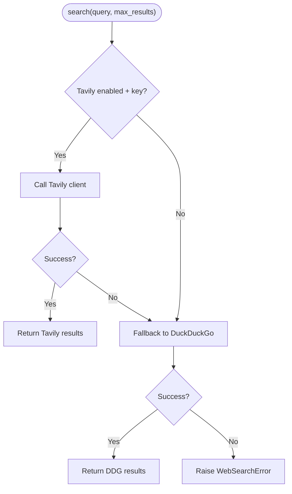

**Diagram sources**
- [backend/tools/web_search.py:69-104](file://backend/tools/web_search.py#L69-L104)
- [backend/tools/web_search.py:106-139](file://backend/tools/web_search.py#L106-L139)

**Section sources**
- [backend/tools/web_search.py:53-104](file://backend/tools/web_search.py#L53-L104)
- [backend/tools/web_search.py:106-139](file://backend/tools/web_search.py#L106-L139)

### Multi-Session Chat Management (MongoDB)
- Sessions: Create, update (pin/archive), delete; list with pinned/recent/archived groups.
- Messages: Add, list, delete per session; supports pagination via limit.
- Persistence: All state stored in MongoDB collections with indexes for performance.
- Migration: Automatic migration from legacy JSON files to MongoDB on first run.

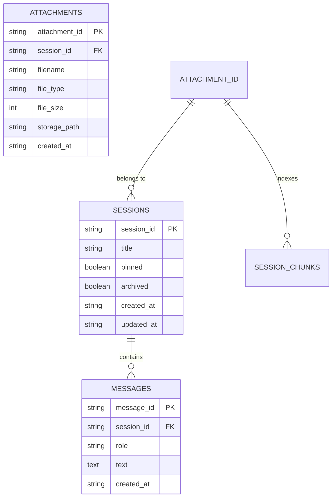

**Diagram sources**
- [backend/core/memory_store.py:23-62](file://backend/core/memory_store.py#L23-L62)
- [backend/core/memory_store.py:598-646](file://backend/core/memory_store.py#L598-L646)
- [backend/core/memory_store.py:652-690](file://backend/core/memory_store.py#L652-L690)
- [backend/core/memory_store.py:754-797](file://backend/core/memory_store.py#L754-L797)

**Section sources**
- [backend/core/memory_store.py:67-150](file://backend/core/memory_store.py#L67-L150)
- [backend/server.py:110-167](file://backend/server.py#L110-L167)
- [backend/server.py:182-266](file://backend/server.py#L182-L266)
- [backend/server.py:399-500](file://backend/server.py#L399-L500)

### Screen-Aware Assistance
- Browser display media sharing: The UI captures the screen stream and sends a base64 image to the backend for multimodal input.
- UI affordances: Toggle to attach screen; preview canvas; quick actions that require screen context.
- Backend handling: The LLM client accepts a screen image and constructs multimodal messages for supported providers.

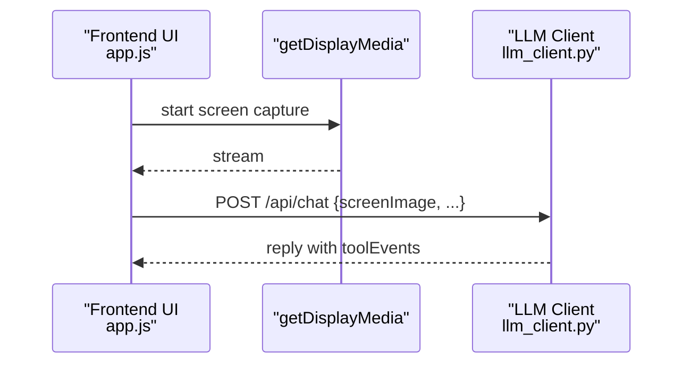

**Diagram sources**
- [frontend/index.html:191-196](file://frontend/index.html#L191-L196)
- [frontend/scripts/app.js:467-468](file://frontend/scripts/app.js#L467-L468)
- [backend/api_clients/llm_client.py:98-102](file://backend/api_clients/llm_client.py#L98-L102)

**Section sources**
- [frontend/index.html:191-196](file://frontend/index.html#L191-L196)
- [frontend/scripts/app.js:467-468](file://frontend/scripts/app.js#L467-L468)
- [backend/api_clients/llm_client.py:98-102](file://backend/api_clients/llm_client.py#L98-L102)

### Voice Input Controls (Push-to-Talk and Review-Before-Send)
- Modes:
  - Mode A (Ctrl+M): Record voice, show transcript in textarea for review, then send.
  - Mode B (hold Control): Real-time speech-to-text with immediate send.
- Browser speech recognition: Uses SpeechRecognition API; UI reflects listening state and updates the avatar.
- Hotkeys: ESC cancels Mode A recording; Ctrl+M toggles between modes.

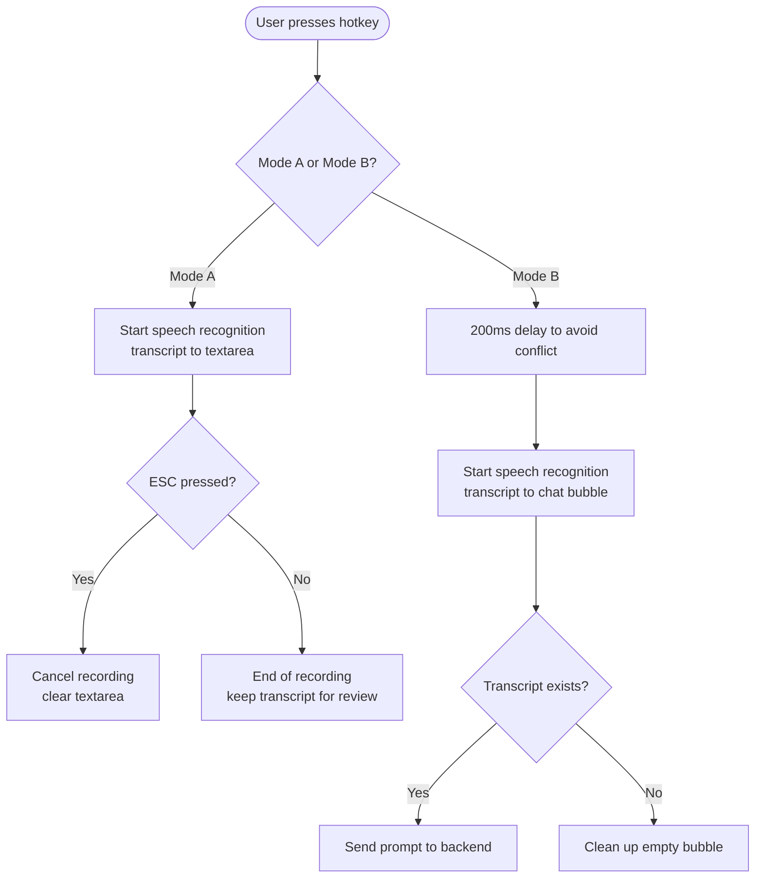

**Diagram sources**
- [frontend/scripts/app.js:733-800](file://frontend/scripts/app.js#L733-L800)
- [frontend/scripts/app.js:601-727](file://frontend/scripts/app.js#L601-L727)

**Section sources**
- [frontend/scripts/app.js:601-727](file://frontend/scripts/app.js#L601-L727)
- [frontend/scripts/app.js:733-800](file://frontend/scripts/app.js#L733-L800)

### Animated Avatar System (Web Worker)
- Worker: Computes avatar frame properties (sway, pulse, blink, mouth) based on stage state.
- Renderer: Applies transforms and draws face, eyes, hair, and mouth on a canvas.
- State transitions: Idle, Listening, Thinking, Speaking; UI updates CSS variables for smooth animations.

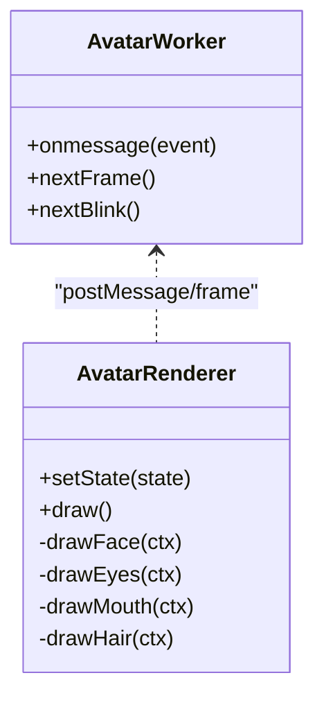

**Diagram sources**
- [frontend/scripts/avatar-worker.js:1-48](file://frontend/scripts/avatar-worker.js#L1-L48)
- [frontend/scripts/avatar-renderer.js:1-106](file://frontend/scripts/avatar-renderer.js#L1-L106)

**Section sources**
- [frontend/scripts/app.js:536-565](file://frontend/scripts/app.js#L536-L565)
- [frontend/scripts/avatar-worker.js:1-48](file://frontend/scripts/avatar-worker.js#L1-L48)
- [frontend/scripts/avatar-renderer.js:1-106](file://frontend/scripts/avatar-renderer.js#L1-L106)

### Graceful Fallback Mechanisms
- Unsupported features: Requests for unsupported features (e.g., image generation) return a clear refusal message instead of crashing.
- Provider errors: HTTP errors and moderation flags are caught and surfaced as user-friendly messages.
- Tool failures: Tool execution errors are captured and reported as tool events.

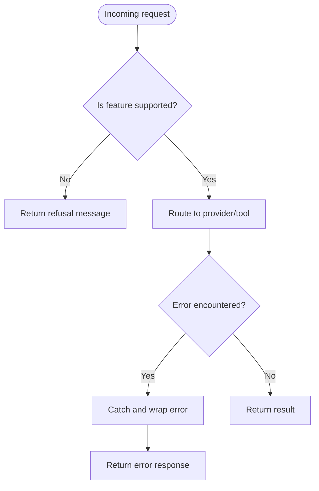

**Diagram sources**
- [backend/server.py:255-275](file://backend/server.py#L255-L275)
- [backend/api_clients/llm_client.py:161-175](file://backend/api_clients/llm_client.py#L161-L175)
- [backend/core/orbit_brain.py:488-501](file://backend/core/orbit_brain.py#L488-L501)

**Section sources**
- [backend/server.py:255-275](file://backend/server.py#L255-L275)
- [backend/api_clients/llm_client.py:161-175](file://backend/api_clients/llm_client.py#L161-L175)
- [backend/core/orbit_brain.py:488-501](file://backend/core/orbit_brain.py#L488-L501)

## Dependency Analysis
- Python dependencies include MongoDB driver, DuckDuckGo search, optional Tavily client, and optional RAG stack (LangChain, FAISS, BM25, embeddings).
- Runtime dependencies: LM Studio for embeddings (optional), MongoDB for persistence, browser APIs for speech and screen capture.

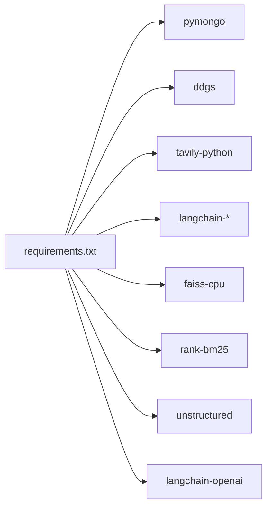

**Diagram sources**
- [requirements.txt:1-29](file://requirements.txt#L1-L29)

**Section sources**
- [requirements.txt:1-29](file://requirements.txt#L1-L29)

## Performance Considerations
- Provider latency: OpenRouter-compatible endpoints and Google REST API timeouts are bounded; moderate network latency expected.
- RAG indexing: First-time indexing of documents can be slow; FAISS build time varies with document size and embeddings availability.
- Web search: Spinner timers provide feedback; results are capped to reduce context pollution.
- Avatar rendering: Web Worker offloads animation calculations; CSS variables minimize layout thrash.
- MongoDB: Indexes on frequent query paths improve retrieval performance; consider sharding for very large histories.

[No sources needed since this section provides general guidance]

## Troubleshooting Guide
- API key missing: The assistant raises a client error when the active provider’s API key is absent.
- Provider reachability: HTTP/URL errors are wrapped with context; check network and endpoint URLs.
- Web search failures: If Tavily fails, the system falls back to DuckDuckGo; if both fail, a search error is raised.
- RAG not available: If LM Studio embeddings are unreachable, the system falls back to BM25-only search.
- MongoDB connection: Failures during startup indicate server downtime or incorrect URI; ensure MongoDB is running and reachable.
- Voice input: If browser lacks speech recognition, UI disables voice controls and shows a message.

**Section sources**
- [backend/api_clients/llm_client.py:60-62](file://backend/api_clients/llm_client.py#L60-L62)
- [backend/api_clients/llm_client.py:161-175](file://backend/api_clients/llm_client.py#L161-L175)
- [backend/tools/web_search.py:86-104](file://backend/tools/web_search.py#L86-L104)
- [backend/tools/knowledge.py:134-138](file://backend/tools/knowledge.py#L134-L138)
- [backend/core/memory_store.py:92-99](file://backend/core/memory_store.py#L92-L99)
- [frontend/scripts/app.js:601-609](file://frontend/scripts/app.js#L601-L609)

## Conclusion
Orbit delivers a robust, privacy-preserving AI companion with flexible provider choices, local knowledge retrieval, live web search, persistent multi-session chat, screen-aware assistance, voice controls, and an animated avatar. Its modular backend and straightforward frontend enable practical daily use with graceful fallbacks and clear diagnostics.

[No sources needed since this section summarizes without analyzing specific files]

## Appendices

### Practical Usage Examples
- Switch provider: On startup, choose Google, OpenRouter, LM Studio, or Ollama; confirm model selection.
- Enable RAG: At startup, opt-in to enable local document indexing; ensure LM Studio is running for embeddings.
- Web Search toggle: Use the “Search” toggle to prioritize web search; use “Offline” to disable web search.
- Screen sharing: Start screen share to provide visual context; use quick actions that require screen access.
- Voice input: Use Ctrl+M for review-before-send; hold Control for instant send; ESC cancels recording.
- Multi-session: Create, pin, archive, and delete sessions; manage tasks and notes within the utility drawer.

**Section sources**
- [backend/server.py:566-611](file://backend/server.py#L566-L611)
- [frontend/index.html:161-169](file://frontend/index.html#L161-L169)
- [frontend/scripts/app.js:467-468](file://frontend/scripts/app.js#L467-L468)
- [frontend/scripts/app.js:733-800](file://frontend/scripts/app.js#L733-L800)

### Feature Configuration Options
- Environment variables (.env):
  - ACTIVE_PROVIDER: google, openrouter, lm_studio, ollama
  - AI_MODEL, GOOGLE_MODEL, OPENROUTER_MODEL, LM_STUDIO_MODEL, OLLAMA_MODEL
  - LM_STUDIO_URL, OLLAMA_URL
  - MONGODB_URI, MONGODB_DB
  - TAVILY_API_KEY (optional)
  - ASSISTANT_PORT, LIVE_VOICE_NAME, DEFAULT_LOCATION
  - RAG_DOCS_PATH (local documents directory)
- Frontend settings:
  - Voice language selection, conversation language, coach topic/level, sidebar/drawer state.

**Section sources**
- [backend/config.py:55-76](file://backend/config.py#L55-L76)
- [frontend/scripts/app.js:217-247](file://frontend/scripts/app.js#L217-L247)
- [README.md:104-136](file://README.md#L104-L136)