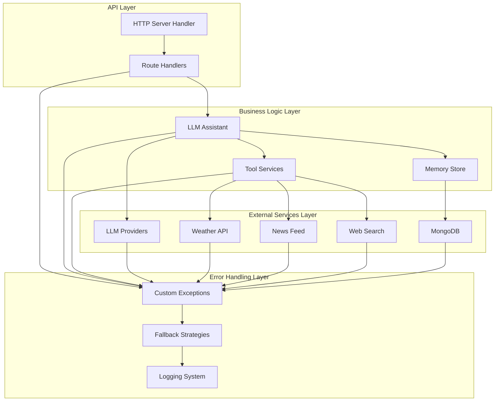
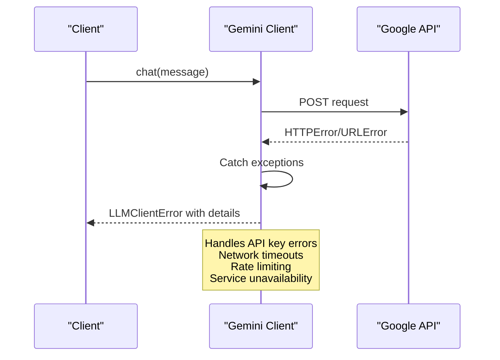
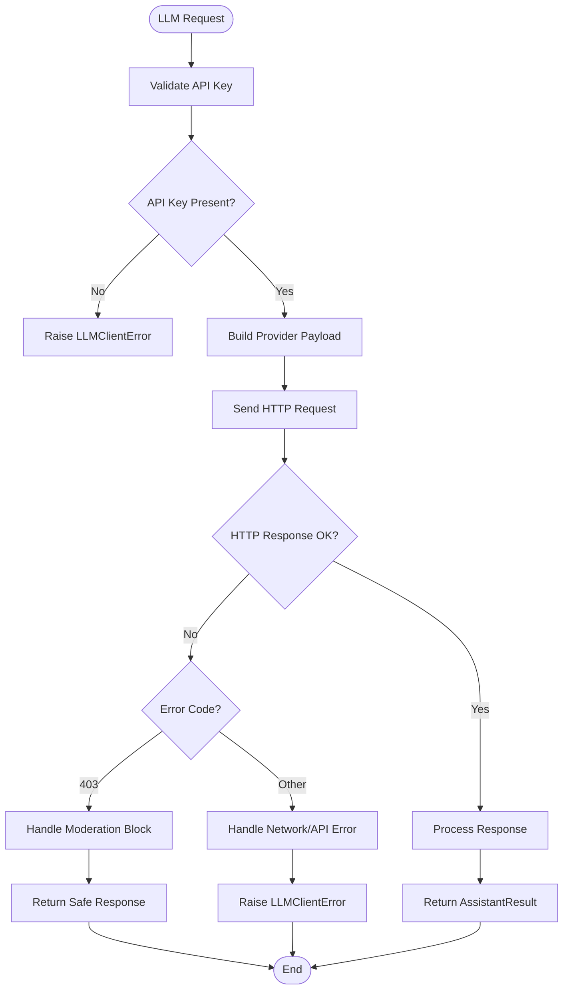
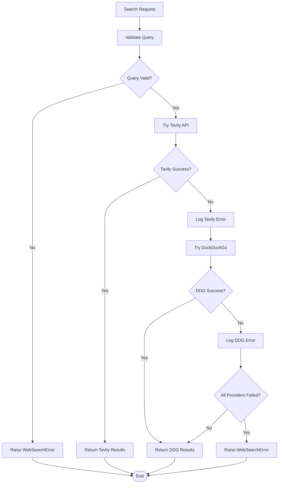
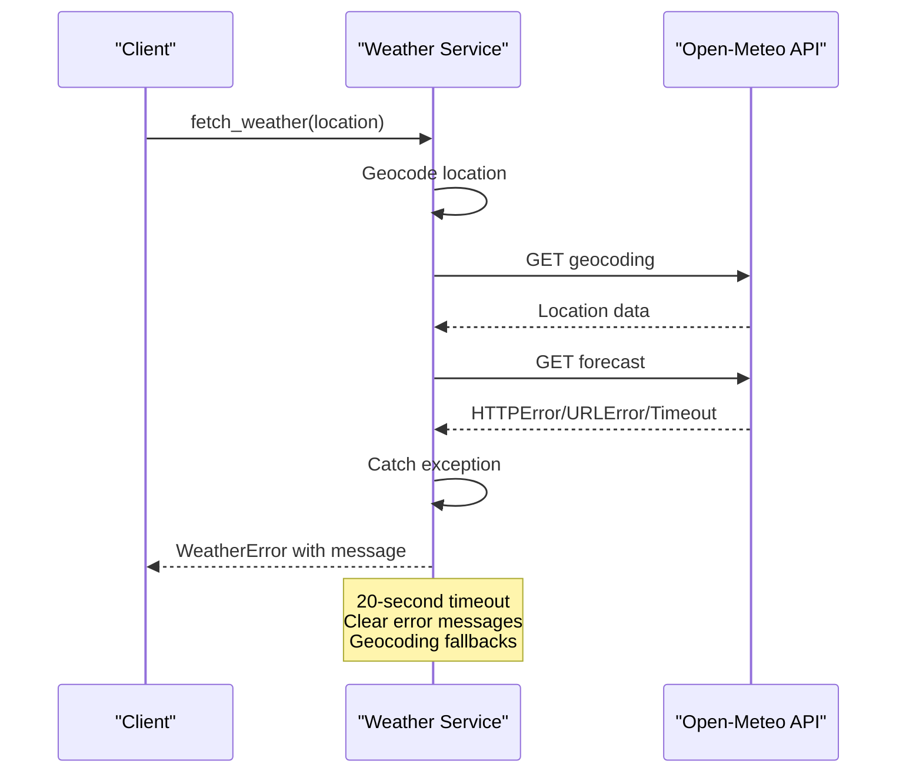
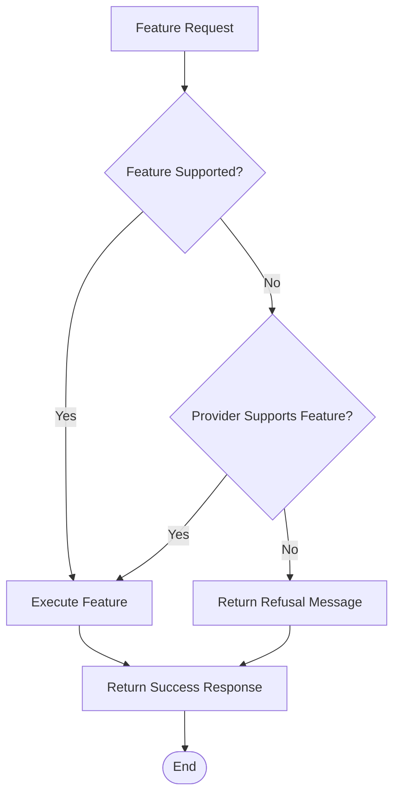
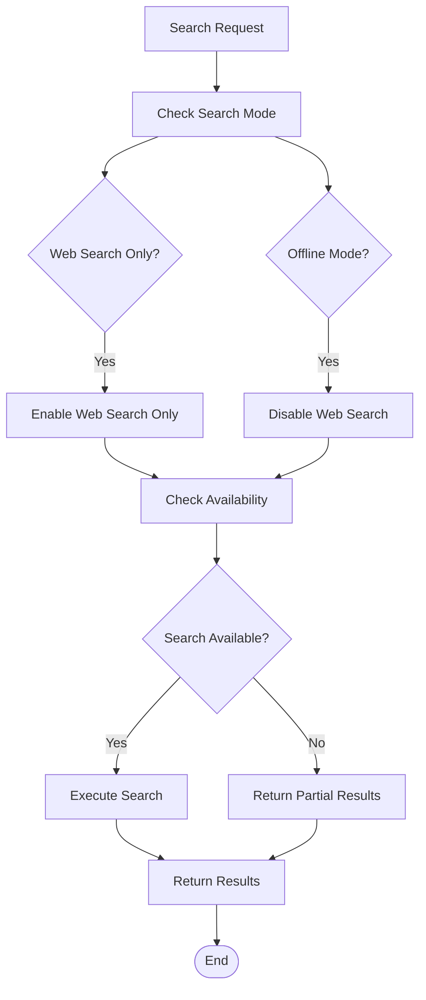
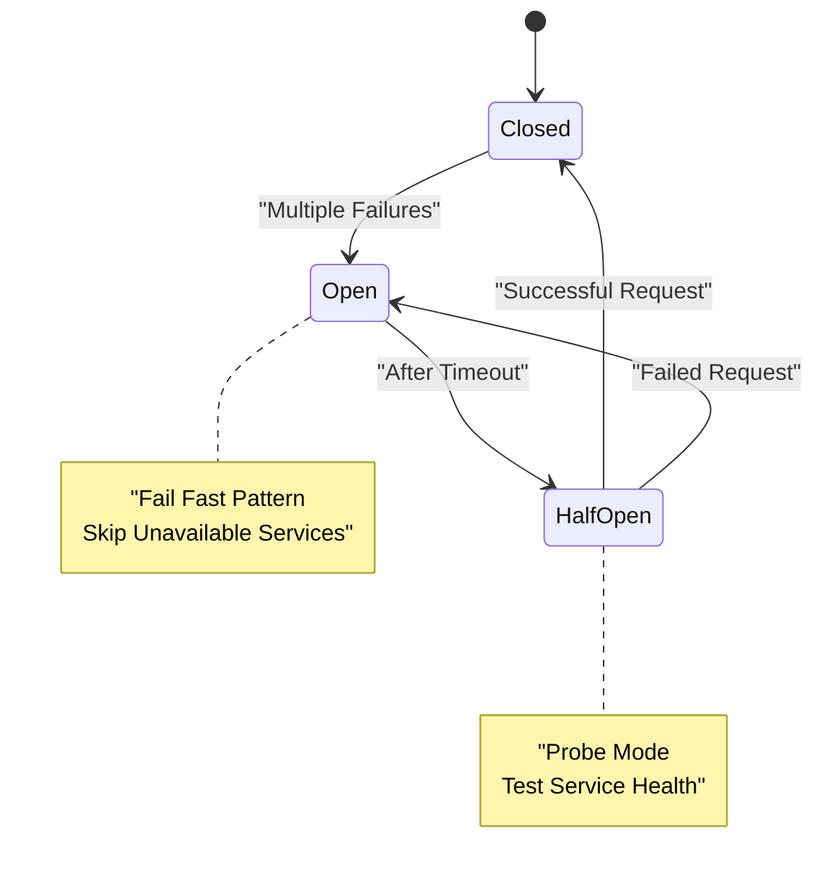
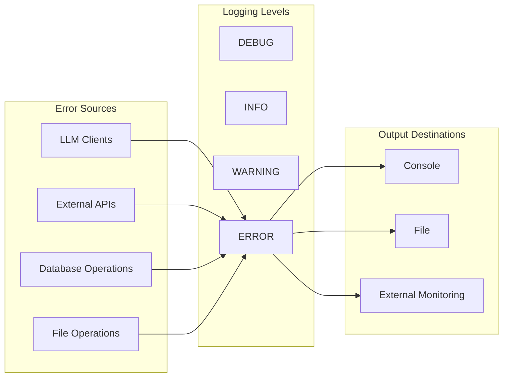

# Graceful Fallback and Error Handling

<cite>
**Referenced Files in This Document**
- [config.py](file://backend/config.py)
- [server.py](file://backend/server.py)
- [llm_client.py](file://backend/api_clients/llm_client.py)
- [gemini_client.py](file://backend/api_clients/gemini_client.py)
- [web_search.py](file://backend/tools/web_search.py)
- [weather.py](file://backend/tools/weather.py)
- [news.py](file://backend/tools/news.py)
- [memory_store.py](file://backend/core/memory_store.py)
- [orbit_brain.py](file://backend/core/orbit_brain.py)
- [asr_whisper.py](file://backend/audio/asr_whisper.py)
- [README.md](file://README.md)
- [requirements.txt](file://requirements.txt)
- [run.py](file://run.py)
</cite>

## Table of Contents
1. [Introduction](#introduction)
2. [Error Handling Architecture](#error-handling-architecture)
3. [Provider-Specific Error Handling](#provider-specific-error-handling)
4. [External Service Fallback Strategies](#external-service-fallback-strategies)
5. [Graceful Degradation Patterns](#graceful-degradation-patterns)
6. [Retry Logic and Circuit Breaker Patterns](#retry-logic-and-circuit-breaker-patterns)
7. [Error Categorization and Logging](#error-categorization-and-logging)
8. [User-Friendly Error Messages](#user-friendly-error-messages)
9. [Practical Error Scenarios](#practical-error-scenarios)
10. [Monitoring and Alerting](#monitoring-and-alerting)
11. [Maintenance Procedures](#maintenance-procedures)
12. [Conclusion](#conclusion)

## Introduction

The Orbit Virtual Assistant implements comprehensive fallback mechanisms and error handling strategies to ensure graceful degradation when external services are unavailable, API limits are reached, or network connectivity is lost. The system employs multiple layers of error handling, from low-level HTTP error catching to high-level graceful degradation patterns that maintain system functionality even under adverse conditions.

The assistant supports multiple AI providers (Google Gemini, OpenRouter, LM Studio, Ollama) and integrates with various external services including weather APIs, news feeds, web search engines, and MongoDB for persistent storage. Each integration point implements robust error handling with fallback strategies to maintain system reliability.

## Error Handling Architecture

The error handling architecture follows a layered approach with clear separation of concerns:

**Diagram sources**
- [server.py:23-63](file://backend/server.py#L23-L63)
- [llm_client.py:38-78](file://backend/api_clients/llm_client.py#L38-L78)
- [orbit_brain.py:389-502](file://backend/core/orbit_brain.py#L389-L502)

## Provider-Specific Error Handling

### Google Gemini Error Handling

The Google Gemini client implements comprehensive error handling for API failures:

**Diagram sources**
- [gemini_client.py:154-162](file://backend/api_clients/gemini_client.py#L154-L162)
- [llm_client.py:316-324](file://backend/api_clients/llm_client.py#L316-L324)

The Gemini client handles several error categories:
- **API Key Validation**: Raises explicit errors when API keys are missing
- **HTTP Errors**: Catches HTTPError exceptions with detailed error messages
- **Network Errors**: Handles URLError for connectivity issues
- **Response Processing**: Manages malformed responses and empty results

### OpenRouter/LM Studio/Ollama Error Handling

The unified LLM client handles multiple provider types with consistent error patterns:

**Diagram sources**
- [llm_client.py:158-175](file://backend/api_clients/llm_client.py#L158-L175)
- [llm_client.py:60-61](file://backend/api_clients/llm_client.py#L60-L61)

**Section sources**
- [gemini_client.py:32-34](file://backend/api_clients/gemini_client.py#L32-L34)
- [gemini_client.py:154-162](file://backend/api_clients/gemini_client.py#L154-L162)
- [llm_client.py:34-36](file://backend/api_clients/llm_client.py#L34-L36)
- [llm_client.py:161-174](file://backend/api_clients/llm_client.py#L161-L174)

## External Service Fallback Strategies

### Web Search Fallback Chain

The web search service implements a sophisticated fallback mechanism with Tavily as primary and DuckDuckGo as fallback:

**Diagram sources**
- [web_search.py:79-104](file://backend/tools/web_search.py#L79-L104)

The fallback chain provides:
- **Primary Provider**: Tavily API (enhanced search capabilities)
- **Fallback Provider**: DuckDuckGo (basic search functionality)
- **Error Propagation**: Detailed error messages for debugging
- **Progressive Failure**: Attempts each provider sequentially

### Weather Service Error Handling

The weather service implements timeout-based error handling with clear user-facing messages:

**Diagram sources**
- [weather.py:122-126](file://backend/tools/weather.py#L122-L126)

**Section sources**
- [web_search.py:43-44](file://backend/tools/web_search.py#L43-L44)
- [web_search.py:79-104](file://backend/tools/web_search.py#L79-L104)
- [weather.py:122-126](file://backend/tools/weather.py#L122-L126)

## Graceful Degradation Patterns

### Feature Unavailable Handling

The system implements graceful degradation for unsupported features:

**Diagram sources**
- [server.py:282-291](file://backend/server.py#L282-L291)
- [server.py:255-263](file://backend/server.py#L255-L263)

The system handles:
- **Image Generation**: Graceful refusal with clear messaging
- **File Uploads**: Partial functionality with supported formats
- **Provider Limitations**: Feature-specific fallbacks

### Search Mode Degradation

The system adapts search capabilities based on user preferences and availability:

**Diagram sources**
- [orbit_brain.py:332-348](file://backend/core/orbit_brain.py#L332-L348)
- [llm_client.py:361-386](file://backend/api_clients/llm_client.py#L361-L386)

**Section sources**
- [server.py:271-274](file://backend/server.py#L271-L274)
- [server.py:282-291](file://backend/server.py#L282-L291)
- [orbit_brain.py:332-348](file://backend/core/orbit_brain.py#L332-L348)

## Retry Logic and Circuit Breaker Patterns

### Built-in Retry Mechanisms

The system implements several retry patterns:

1. **Tool Loop Limit**: Prevents infinite loops during tool execution
2. **Provider Fallback**: Automatic switching between providers
3. **Connection Timeout**: Controlled timeouts for external requests

### Circuit Breaker Implementation

While not explicitly implemented, the system exhibits circuit breaker-like behavior:

**Diagram sources**
- [web_search.py:86-104](file://backend/tools/web_search.py#L86-L104)

**Section sources**
- [gemini_client.py:69-94](file://backend/api_clients/gemini_client.py#L69-L94)
- [llm_client.py:128-215](file://backend/api_clients/llm_client.py#L128-L215)
- [web_search.py:86-104](file://backend/tools/web_search.py#L86-L104)

## Error Categorization and Logging

### Error Categories

The system categorizes errors into distinct types:

| Category | Purpose | Examples |
|----------|---------|----------|
| **Provider Errors** | LLM provider failures | API key invalid, rate limiting, service outage |
| **Network Errors** | Connectivity issues | DNS failures, timeouts, proxy errors |
| **Validation Errors** | Input validation failures | Empty queries, invalid parameters |
| **Resource Errors** | Storage/database issues | MongoDB connection, file system errors |
| **Feature Errors** | Unsupported functionality | Image generation, unsupported file types |

### Logging Mechanisms

The system implements structured logging:

**Diagram sources**
- [memory_store.py:16](file://backend/core/memory_store.py#L16)

**Section sources**
- [memory_store.py:16](file://backend/core/memory_store.py#L16)
- [server.py:562-564](file://backend/server.py#L562-L564)

## User-Friendly Error Messages

### Error Message Design Principles

The system prioritizes clear, actionable error messages:

1. **Specificity**: Error messages clearly identify the problem
2. **Actionability**: Provide guidance on how to resolve issues
3. **Context**: Include relevant context for understanding failures
4. **Consistency**: Maintain consistent error message patterns

### Example Error Message Patterns

| Error Type | Message Pattern | Example |
|------------|----------------|---------|
| **API Key Missing** | "Provider API Key is missing. Please check your .env file." | "OpenRouter API Key is missing. Please check your .env file." |
| **Network Timeout** | "Unable to reach [Service]: [Reason]" | "Unable to reach OpenRouter: Connection timed out" |
| **Rate Limiting** | "[Service] temporarily unavailable due to rate limits" | "Google API temporarily unavailable due to rate limits" |
| **Feature Unavailable** | "Sorry, I don't have this function. [Alternative suggestion]" | "Sorry, I don't have this function. If you want to use this, please use other LLMs that are available for them." |

**Section sources**
- [llm_client.py:164-169](file://backend/api_clients/llm_client.py#L164-L169)
- [server.py:271-274](file://backend/server.py#L271-L274)

## Practical Error Scenarios

### Provider Failure Handling

**Scenario**: Google API becomes unavailable during chat processing

**Expected Behavior**:
1. LLM client catches HTTPError/URLError
2. Returns LLMClientError to server handler
3. Server responds with BAD_GATEWAY status
4. Client receives clear error message

**Implementation Details**:
- Timeout: 90 seconds for Google API requests
- Error propagation: Detailed error messages with HTTP status codes
- Fallback: Automatic switching to alternative providers

### Search Timeout Handling

**Scenario**: Web search API times out or becomes slow

**Expected Behavior**:
1. WebSearchService attempts Tavily first
2. Falls back to DuckDuckGo if Tavily fails
3. Returns partial results or clear error message
4. Maintains system responsiveness

**Implementation Details**:
- SpinnerTimer provides user feedback during search
- Progressive failure handling with detailed logging
- Clear error messages for debugging

### Database Connection Failure

**Scenario**: MongoDB connection drops during operation

**Expected Behavior**:
1. MemoryStore initialization detects connection failure
2. Raises RuntimeError with clear diagnostic message
3. Server startup fails gracefully
4. User receives clear instructions for resolution

**Implementation Details**:
- 5-second connection timeout
- Ping command for health verification
- Detailed error messages with remediation steps

**Section sources**
- [gemini_client.py:154-162](file://backend/api_clients/gemini_client.py#L154-L162)
- [web_search.py:79-104](file://backend/tools/web_search.py#L79-L104)
- [memory_store.py:92-98](file://backend/core/memory_store.py#L92-L98)

## Monitoring and Alerting

### Current Monitoring Capabilities

The system includes basic monitoring through:

1. **Console Logging**: Standard output for operational visibility
2. **Error Propagation**: Detailed error messages to clients
3. **Activity Tracking**: MongoDB activity collection for audit trails
4. **Spinner Timers**: Progress indication for long-running operations

### Recommended Monitoring Enhancements

| Component | Current Status | Enhancement |
|-----------|----------------|-------------|
| **Error Metrics** | None | Implement error counters and rates |
| **Service Health** | Basic ping | Add health check endpoints |
| **Latency Tracking** | None | Monitor API response times |
| **Uptime Monitoring** | None | Implement service availability checks |
| **Alerting** | None | Email/SMS notifications for critical failures |

### Alerting Thresholds

Recommended thresholds for monitoring:

- **API Error Rate**: >5% within 5 minutes
- **Response Time**: >30 seconds average
- **Service Outage**: >2 consecutive failures
- **Database Connection**: >10% failure rate
- **Disk Space**: <10% free

## Maintenance Procedures

### Regular Maintenance Tasks

1. **API Key Rotation**: Regular review and rotation of API keys
2. **Provider Health Checks**: Weekly monitoring of provider availability
3. **Database Maintenance**: Monthly index optimization and cleanup
4. **External Service Validation**: Quarterly validation of external API endpoints
5. **System Updates**: Regular updates to dependencies and security patches

### Emergency Response Procedures

**Critical Failure (All Providers Down)**:
1. Verify network connectivity
2. Check API key validity
3. Restart service if necessary
4. Notify users of maintenance
5. Document incident for improvement

**Partial Failure (Single Provider Down)**:
1. Verify provider status
2. Test fallback provider
3. Continue operations with degraded functionality
4. Plan provider replacement
5. Communicate with affected users

### Backup and Recovery

1. **Database Backups**: Daily automated backups
2. **Configuration Backups**: Version-controlled configuration files
3. **Index Recovery**: Ability to rebuild search indexes
4. **Service Recovery**: Automated restart procedures
5. **Data Migration**: Support for database migration procedures

**Section sources**
- [README.md:205-211](file://README.md#L205-L211)
- [memory_store.py:119-135](file://backend/core/memory_store.py#L119-L135)

## Conclusion

The Orbit Virtual Assistant demonstrates robust error handling and graceful fallback mechanisms through its multi-layered architecture. The system successfully maintains functionality even when individual components fail, providing clear user feedback and maintaining system stability.

Key strengths of the error handling implementation include:

- **Comprehensive Error Coverage**: All major failure modes are handled systematically
- **Graceful Degradation**: Partial functionality preserved when full capabilities are unavailable
- **Clear Communication**: User-friendly error messages with actionable guidance
- **Structured Logging**: Detailed error tracking for debugging and monitoring
- **Provider Flexibility**: Automatic fallback between multiple AI providers

The implementation serves as a model for building resilient AI applications that can adapt to various failure scenarios while maintaining a positive user experience. Future enhancements could include formalized monitoring and alerting systems, more sophisticated retry logic, and expanded circuit breaker patterns for improved resilience.