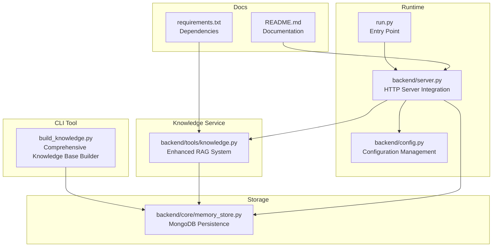
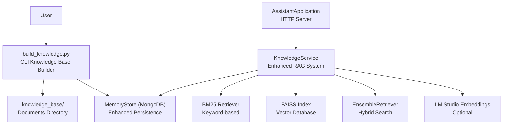
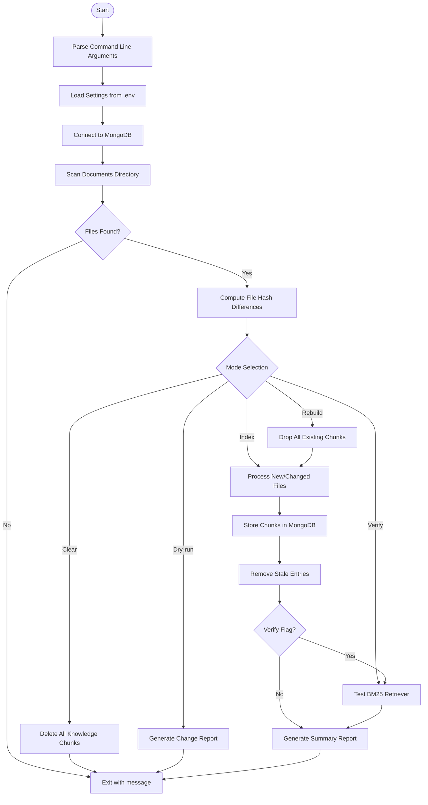
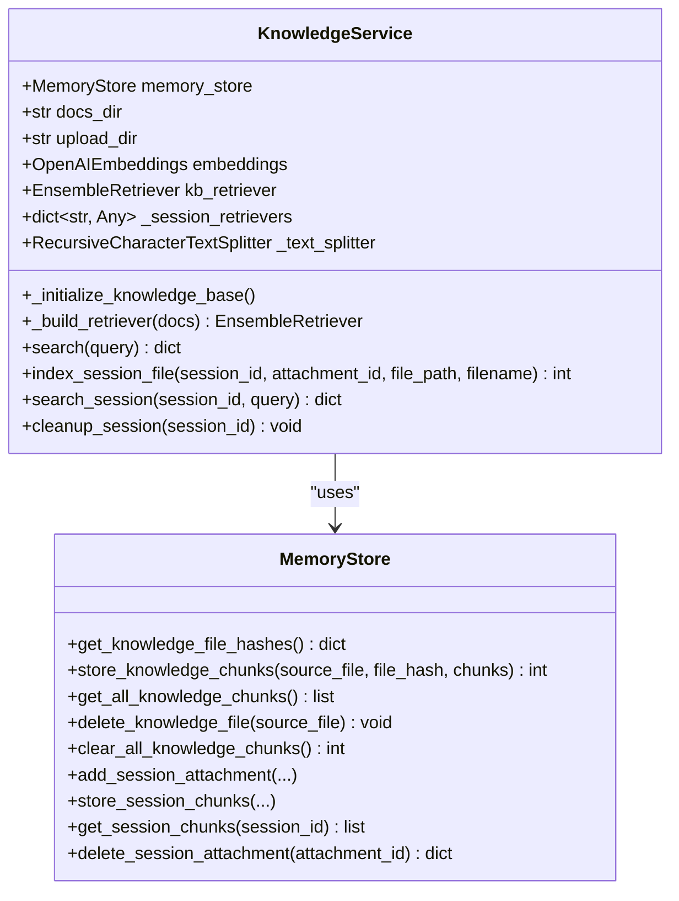
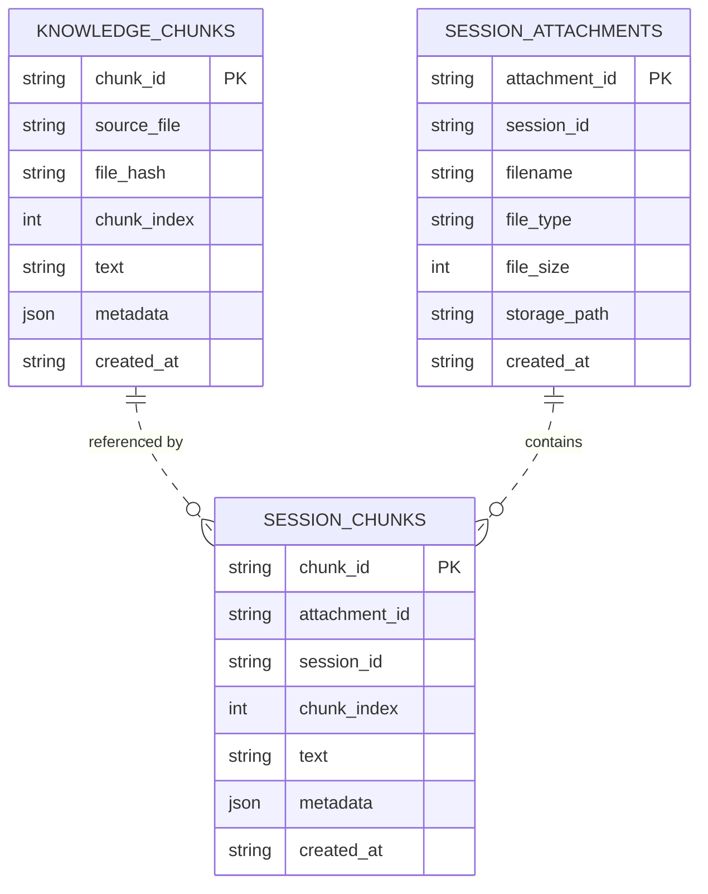
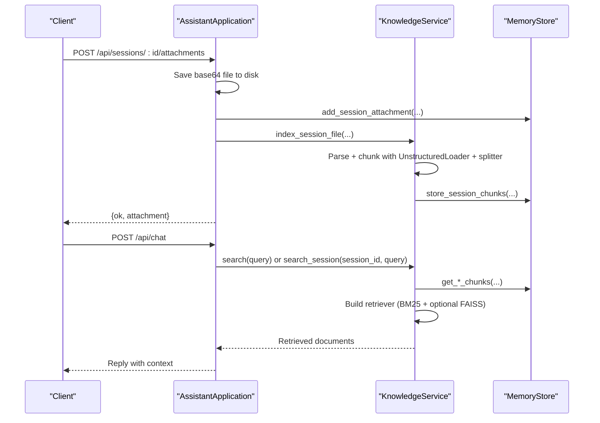
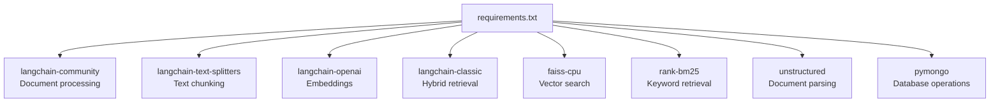

# Knowledge Management and RAG

<cite>
**Referenced Files in This Document**
- [build_knowledge.py](file://build_knowledge.py)
- [knowledge.py](file://backend/tools/knowledge.py)
- [memory_store.py](file://backend/core/memory_store.py)
- [config.py](file://backend/config.py)
- [server.py](file://backend/server.py)
- [requirements.txt](file://requirements.txt)
- [README.md](file://README.md)
- [run.py](file://run.py)
</cite>

## Update Summary
**Changes Made**
- Added comprehensive Knowledge Base Builder tool (build_knowledge.py) with CLI interface
- Enhanced knowledge chunk storage with persistent collections and improved indexing
- Improved RAG system capabilities with better error handling and performance optimization
- Added support for session-specific document search with hybrid retrieval
- Enhanced MongoDB integration with comprehensive indexing and migration capabilities

## Table of Contents
1. [Introduction](#introduction)
2. [Project Structure](#project-structure)
3. [Core Components](#core-components)
4. [Architecture Overview](#architecture-overview)
5. [Detailed Component Analysis](#detailed-component-analysis)
6. [Dependency Analysis](#dependency-analysis)
7. [Performance Considerations](#performance-considerations)
8. [Troubleshooting Guide](#troubleshooting-guide)
9. [Conclusion](#conclusion)
10. [Appendices](#appendices)

## Introduction
This document explains the Knowledge Lab system with Retrieval-Augmented Generation (RAG) capabilities. It covers the local document processing pipeline using LangChain, FAISS vector database, and BM25 hybrid retrieval. It documents the knowledge base structure, supported file formats, preprocessing steps, indexing workflow, chunking strategies, embedding generation, similarity search algorithms, and practical usage patterns for building knowledge bases, searching local documents, and session-specific document search. It also includes performance optimization techniques and troubleshooting guidance for common indexing issues and memory management considerations.

**Updated** Enhanced with comprehensive Knowledge Base Builder tool and improved persistent storage capabilities.

## Project Structure
The Knowledge Lab spans several modules:
- CLI tool to build and verify knowledge bases with advanced indexing capabilities
- Knowledge service for persistent and session-scoped retrieval with hybrid BM25 + FAISS
- MongoDB-backed storage for chunks and session artifacts with comprehensive indexing
- Server integration and runtime configuration with RAG enablement

**Diagram sources**
- [build_knowledge.py:1-437](file://build_knowledge.py#L1-L437)
- [knowledge.py:1-394](file://backend/tools/knowledge.py#L1-L394)
- [memory_store.py:1-947](file://backend/core/memory_store.py#L1-L947)
- [config.py:1-87](file://backend/config.py#L1-L87)
- [server.py:1-329](file://backend/server.py#L1-L329)
- [README.md:1-218](file://README.md#L1-L218)
- [requirements.txt:1-29](file://requirements.txt#L1-L29)
- [run.py:1-6](file://run.py#L1-L6)

**Section sources**
- [README.md:164-201](file://README.md#L164-L201)
- [requirements.txt:19-29](file://requirements.txt#L19-L29)

## Core Components
- **KnowledgeBuilder**: Standalone CLI tool for scanning, diffing, parsing, chunking, and storing documents into MongoDB for persistent RAG with comprehensive indexing modes
- **KnowledgeService**: Enhanced knowledge service managing persistent knowledge base and session-scoped document search with hybrid BM25 + FAISS retrievers
- **MemoryStore**: Comprehensive MongoDB-backed persistence for knowledge chunks, session attachments, and session chunks with advanced indexing and migration capabilities
- **Server integration**: Enhanced server initialization with KnowledgeService and comprehensive RAG enablement options

Key responsibilities:
- Document ingestion and chunking with Markdown-aware separators and comprehensive file format support
- Change detection via file hashing with incremental updates
- Hybrid retrieval with BM25 and FAISS (when embeddings are available)
- Session-scoped retrieval for uploaded files with thread-safe caching
- Robust error handling, graceful fallbacks, and comprehensive logging
- MongoDB migration from legacy JSON format with data preservation

**Updated** Enhanced with comprehensive CLI tool, improved error handling, and advanced indexing capabilities.

**Section sources**
- [build_knowledge.py:61-211](file://build_knowledge.py#L61-L211)
- [knowledge.py:88-394](file://backend/tools/knowledge.py#L88-L394)
- [memory_store.py:67-947](file://backend/core/memory_store.py#L67-L947)
- [server.py:23-63](file://backend/server.py#L23-L63)

## Architecture Overview
The system integrates a comprehensive CLI indexer and enhanced runtime knowledge service:
- CLI builds the knowledge base by scanning a directory, computing diffs, parsing and chunking documents, and storing them in MongoDB with advanced indexing modes
- At runtime, the server initializes KnowledgeService with optional LM Studio embeddings to build FAISS indices and an EnsembleRetriever combining BM25 and FAISS
- Users can attach files to a session; those files are parsed, chunked, and indexed for session-scoped retrieval with hybrid capabilities
- MongoDB provides comprehensive persistence with advanced indexing and migration from legacy JSON format

**Diagram sources**
- [build_knowledge.py:273-428](file://build_knowledge.py#L273-L428)
- [knowledge.py:122-264](file://backend/tools/knowledge.py#L122-L264)
- [memory_store.py:119-134](file://backend/core/memory_store.py#L119-L134)
- [server.py:23-63](file://backend/server.py#L23-L63)

## Detailed Component Analysis

### KnowledgeBuilder (CLI Knowledge Base Builder)
**Updated** Comprehensive CLI tool with advanced indexing capabilities and multiple operational modes.

Responsibilities:
- Scan supported files in a directory with comprehensive file format support
- Compute diffs against stored file hashes with incremental update capability
- Parse with UnstructuredLoader, split with RecursiveCharacterTextSplitter using Markdown-aware separators
- Store chunks into MongoDB with metadata (source, start_index) and comprehensive error handling
- Remove stale entries for deleted files with batch operations
- Advanced operational modes: incremental update, rebuild, clear, dry-run, and verification
- Comprehensive command-line interface with configuration overrides

Key behaviors:
- **Supported formats**: PDF, DOCX, DOC, TXT, MD, CSV, JSON, PNG, JPG, JPEG (enhanced from original)
- **Chunk size and overlap**: 1200 and 200 respectively with Markdown-aware separators
- **Change detection**: MD5 hashing with comprehensive diff computation
- **Operational modes**: 
  - Incremental update (default): Only processes new/changed files
  - Rebuild: Drops all existing chunks and re-indexes everything
  - Clear: Deletes all knowledge chunks from MongoDB
  - Dry-run: Scans and reports changes without writing to MongoDB
  - Verify: Tests retriever functionality after indexing
- **Advanced features**: Command-line argument parsing, progress reporting, comprehensive error handling

**Diagram sources**
- [build_knowledge.py:273-428](file://build_knowledge.py#L273-L428)
- [build_knowledge.py:90-175](file://build_knowledge.py#L90-L175)
- [build_knowledge.py:178-206](file://build_knowledge.py#L178-L206)

**Section sources**
- [build_knowledge.py:52-55](file://build_knowledge.py#L52-L55)
- [build_knowledge.py:61-71](file://build_knowledge.py#L61-L71)
- [build_knowledge.py:90-115](file://build_knowledge.py#L90-L115)
- [build_knowledge.py:119-166](file://build_knowledge.py#L119-L166)
- [build_knowledge.py:178-206](file://build_knowledge.py#L178-L206)

### KnowledgeService (Enhanced RAG System)
**Updated** Enhanced knowledge service with improved error handling, thread-safe caching, and comprehensive hybrid retrieval capabilities.

Responsibilities:
- Initialize knowledge base at startup by scanning docs_dir, detecting changes, and indexing new/changed files
- Build hybrid retriever: BM25 + FAISS (MMR) when embeddings are available; otherwise BM25-only
- Provide persistent knowledge base search with comprehensive error handling
- Manage session-scoped document indexing and search with thread-safe caching
- Lazy caching of session retrievers with thread-safe invalidation and automatic cleanup

Initialization and indexing:
- Ensures knowledge_base directory exists with comprehensive error handling
- Computes diffs and removes stale chunks for deleted files with batch operations
- Parses and indexes new/changed files with comprehensive error handling
- Loads all chunks and builds retrievers with fallback mechanisms

Hybrid retrieval:
- BM25 retriever with top-k=5 and comprehensive document conversion
- FAISS retriever with MMR (k=5, fetch_k=20, lambda_mult=0.5) when embeddings are available
- EnsembleRetriever with equal weights (0.5, 0.5) for balanced hybrid search
- Automatic fallback to BM25-only when FAISS fails

Session-scoped search:
- Stores session attachments and chunks with comprehensive metadata
- Builds BM25 retriever per session with optional hybrid FAISS when sufficient chunks
- Thread-safe caching with invalidation on new chunks using locks
- Automatic cleanup on session deletion with attachment removal

**Diagram sources**
- [knowledge.py:88-394](file://backend/tools/knowledge.py#L88-L394)
- [memory_store.py:67-947](file://backend/core/memory_store.py#L67-L947)

**Section sources**
- [knowledge.py:88-230](file://backend/tools/knowledge.py#L88-L230)
- [knowledge.py:231-264](file://backend/tools/knowledge.py#L231-L264)
- [knowledge.py:270-297](file://backend/tools/knowledge.py#L270-L297)
- [knowledge.py:303-335](file://backend/tools/knowledge.py#L303-L335)
- [knowledge.py:337-394](file://backend/tools/knowledge.py#L337-L394)

### MemoryStore (Enhanced MongoDB Persistence)
**Updated** Comprehensive MongoDB-backed persistence with advanced indexing, migration capabilities, and thread-safe operations.

Responsibilities:
- Define collections for sessions, messages, profile, notes, tasks, activity, cache, knowledge_chunks, session_attachments, session_chunks
- Provide comprehensive indexes for efficient lookups with optimized query performance
- Store and retrieve knowledge chunks with source_file, file_hash, chunk_index, text, metadata
- Store and retrieve session attachments and chunks with comprehensive metadata
- Provide change detection via file_hash aggregation with batch operations
- **Migration capabilities**: Import from legacy JSON format with data preservation
- **Thread-safe operations**: Lock-based access control for concurrent operations
- **Data validation**: Comprehensive input validation and error handling

Indexes:
- **knowledge_chunks**: unique chunk_id, source_file, file_hash for efficient retrieval
- **session_attachments**: unique attachment_id, session_id for session management
- **session_chunks**: unique chunk_id, session_id, attachment_id for session-specific search
- **Additional indexes**: sessions (session_id, pinned, updated_at), messages (session_id, created_at)

**Enhanced features**:
- **Migration from JSON**: One-time import from legacy assistant_memory.json and chat_history.json
- **Batch operations**: Efficient bulk insertions and deletions for large datasets
- **Data consistency**: Atomic operations with proper error handling
- **Performance optimization**: Optimized queries with appropriate indexing strategies

**Diagram sources**
- [memory_store.py:24-62](file://backend/core/memory_store.py#L24-L62)
- [memory_store.py:119-134](file://backend/core/memory_store.py#L119-L134)

**Section sources**
- [memory_store.py:51-62](file://backend/core/memory_store.py#L51-L62)
- [memory_store.py:119-134](file://backend/core/memory_store.py#L119-L134)
- [memory_store.py:695-748](file://backend/core/memory_store.py#L695-L748)
- [memory_store.py:802-947](file://backend/core/memory_store.py#L802-L947)

### Server Integration and Runtime
**Updated** Enhanced server integration with comprehensive RAG enablement options and improved error handling.

- AssistantApplication constructs MemoryStore and KnowledgeService with comprehensive initialization
- KnowledgeService is always instantiated; RAG is enabled when docs_dir is provided with user choice
- Attachment upload endpoint saves base64-encoded files, registers in MongoDB, and indexes for session-scoped search
- Chat endpoint routes to the assistant; knowledge search is integrated via KnowledgeService with comprehensive error handling
- **Hybrid mode**: Enhanced configuration with provider selection and model routing options
- **Migration support**: Automatic migration from legacy JSON format to MongoDB

**Diagram sources**
- [server.py:329-394](file://backend/server.py#L329-L394)
- [server.py:276-320](file://backend/server.py#L276-L320)
- [knowledge.py:303-335](file://backend/tools/knowledge.py#L303-L335)
- [knowledge.py:337-394](file://backend/tools/knowledge.py#L337-L394)

**Section sources**
- [server.py:23-63](file://backend/server.py#L23-L63)
- [server.py:329-394](file://backend/server.py#L329-L394)
- [server.py:566-611](file://backend/server.py#L566-L611)

## Dependency Analysis
**Updated** Enhanced dependency management with comprehensive RAG support and improved package organization.

External libraries and their roles:
- **LangChain ecosystem**: document loaders, text splitters, FAISS vectorstore, BM25 retriever, EnsembleRetriever
- **FAISS**: vector similarity search engine for hybrid retrieval
- **rank-bm25**: BM25 keyword-based retrieval for baseline search
- **unstructured**: document parsing for various formats (PDF, DOCX, TXT, etc.)
- **langchain-openai**: OpenAI-compatible embeddings (for LM Studio)
- **pymongo**: MongoDB driver with comprehensive database operations
- **Enhanced packages**: Additional support for image files (PNG, JPG, JPEG) and improved error handling

**Diagram sources**
- [requirements.txt:19-29](file://requirements.txt#L19-L29)

**Section sources**
- [requirements.txt:19-29](file://requirements.txt#L19-L29)

## Performance Considerations
**Updated** Enhanced performance optimization with comprehensive indexing strategies and memory management.

- **Chunk sizing and overlap**: 1200 characters with 200-character overlap balances recall and context length; adjust based on document density and query complexity
- **Hybrid retrieval**: FAISS with MMR improves diversity and precision; enable only when embeddings are available and reliable
- **Indexing strategy**: Incremental updates via file hashing minimize redundant processing; use dry-run to preview changes
- **Memory management**:
  - Session retrievers are cached per session and invalidated on new chunks with thread-safe locking
  - FAISS index construction can be expensive; monitor build time and consider limiting concurrent builds
  - **Enhanced**: Thread-safe operations with proper locking for concurrent access
- **Embedding model**: LM Studio embeddings are used when available; connectivity checks prevent runtime failures
- **MongoDB indexing**: Ensure indexes exist on knowledge_chunks and session_chunks for fast retrieval
- **Batch operations**: MongoDB bulk operations for efficient data processing
- **Migration optimization**: One-time migration from JSON format with optimized data transfer

## Troubleshooting Guide
**Updated** Comprehensive troubleshooting guide with enhanced error handling and resolution strategies.

Common issues and resolutions:
- **RAG dependencies missing**:
  - Symptom: Import errors during CLI or runtime
  - Resolution: Install RAG dependencies as per requirements with comprehensive package installation
  - Section sources
    - [requirements.txt:19-29](file://requirements.txt#L19-L29)
    - [build_knowledge.py:37-39](file://build_knowledge.py#L37-L39)

- **MongoDB connection failure**:
  - Symptom: RuntimeError indicating inability to connect
  - Resolution: Verify MongoDB URI and that the server is running; check network connectivity
  - Section sources
    - [memory_store.py:86-98](file://backend/core/memory_store.py#L86-L98)

- **LM Studio embeddings unavailable**:
  - Symptom: Warning logs and fallback to BM25-only
  - Resolution: Ensure LM Studio is running and reachable at configured URL; verify model availability
  - Section sources
    - [knowledge.py:122-137](file://backend/tools/knowledge.py#L122-L137)

- **Parsing failures for attachments**:
  - Symptom: Parse errors during session file indexing
  - Resolution: Confirm file format is supported; check file integrity; retry with smaller files
  - Section sources
    - [knowledge.py:312-318](file://backend/tools/knowledge.py#L312-L318)
    - [server.py:340-347](file://backend/server.py#L340-L347)

- **Empty knowledge base**:
  - Symptom: No results from KB search
  - Resolution: Build knowledge base using CLI; verify chunks exist in MongoDB; run verification query
  - Section sources
    - [build_knowledge.py:178-206](file://build_knowledge.py#L178-L206)
    - [knowledge.py:270-297](file://backend/tools/knowledge.py#L270-L297)

- **Large files or unsupported types**:
  - Symptom: Upload rejected due to size or type
  - Resolution: Respect max size and supported extensions; convert or compress files as needed
  - Section sources
    - [server.py:326-361](file://backend/server.py#L326-L361)

- **Legacy JSON migration issues**:
  - Symptom: Data not found after migration
  - Resolution: Check migration logs; verify JSON files exist; ensure proper file permissions
  - Section sources
    - [memory_store.py:836-947](file://backend/core/memory_store.py#L836-L947)

- **Knowledge base builder errors**:
  - Symptom: CLI tool fails during indexing
  - Resolution: Check file permissions; verify MongoDB connectivity; review detailed error messages
  - Section sources
    - [build_knowledge.py:157-165](file://build_knowledge.py#L157-L165)

## Conclusion
**Updated** Enhanced conclusion reflecting comprehensive improvements to the Knowledge Lab system.

The Knowledge Lab system provides a robust, incremental, and hybrid RAG pipeline with comprehensive capabilities. Documents are parsed, chunked, and stored in MongoDB, enabling fast BM25 retrieval and optional FAISS-based hybrid search powered by LM Studio embeddings. The system supports both persistent knowledge base and session-scoped document search, with careful attention to performance, reliability, and user experience. The enhanced Knowledge Base Builder tool provides comprehensive CLI capabilities for advanced indexing, while the improved MemoryStore offers robust persistence with migration capabilities and thread-safe operations.

## Appendices

### Practical Examples

- **Building a knowledge base**:
  - Use the CLI to scan, diff, and index documents; optionally verify with a test query
  - Section sources
    - [build_knowledge.py:273-428](file://build_knowledge.py#L273-L428)

- **Searching local documents**:
  - Enable RAG at startup; use the KnowledgeService search method to retrieve contextual chunks
  - Section sources
    - [knowledge.py:270-297](file://backend/tools/knowledge.py#L270-L297)

- **Session-specific document search**:
  - Attach files to a session; the system indexes them and allows targeted retrieval per session
  - Section sources
    - [server.py:329-394](file://backend/server.py#L329-L394)
    - [knowledge.py:337-394](file://backend/tools/knowledge.py#L337-L394)

- **Advanced CLI operations**:
  - Use rebuild mode for complete re-indexing, clear mode for database cleanup, or dry-run for change preview
  - Section sources
    - [build_knowledge.py:230-270](file://build_knowledge.py#L230-L270)

- **Configuration and environment**:
  - Configure MongoDB, RAG docs path, and provider settings via .env; ensure dependencies are installed
  - Section sources
    - [config.py:55-87](file://backend/config.py#L55-L87)
    - [README.md:104-136](file://README.md#L104-L136)
    - [requirements.txt:19-29](file://requirements.txt#L19-L29)

- **Legacy data migration**:
  - Automatic migration from JSON format to MongoDB with data preservation
  - Section sources
    - [memory_store.py:836-947](file://backend/core/memory_store.py#L836-L947)