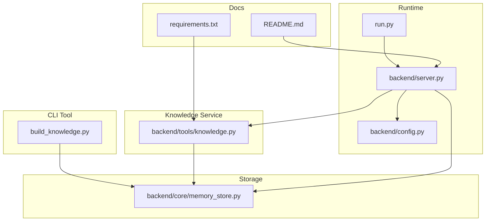
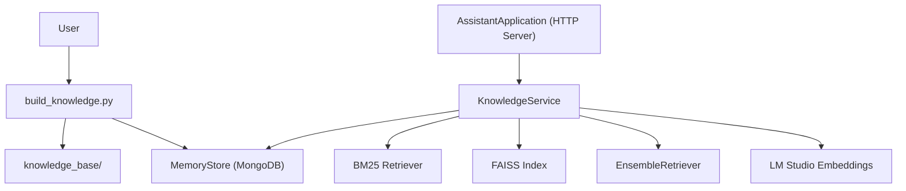
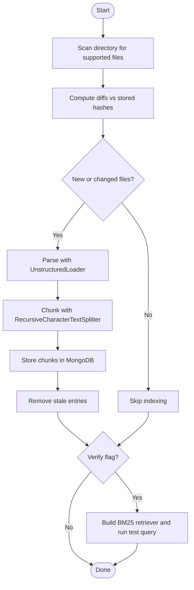
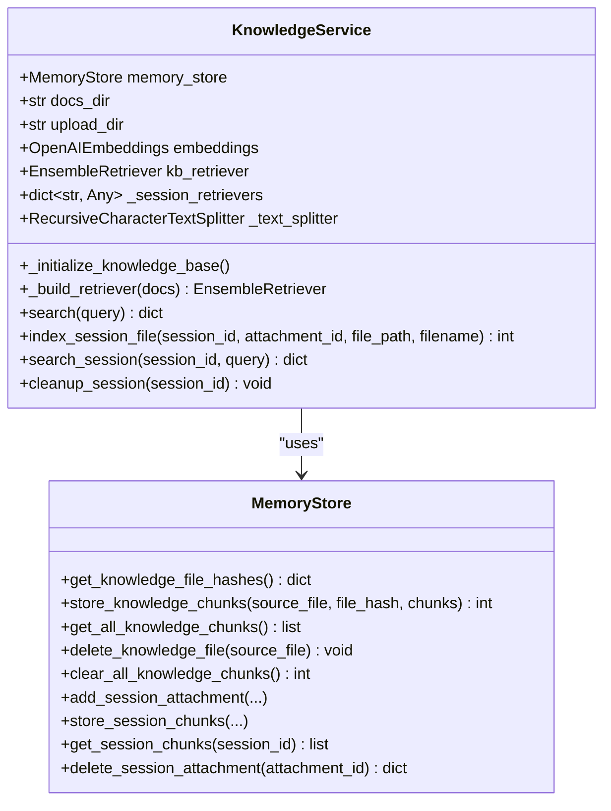
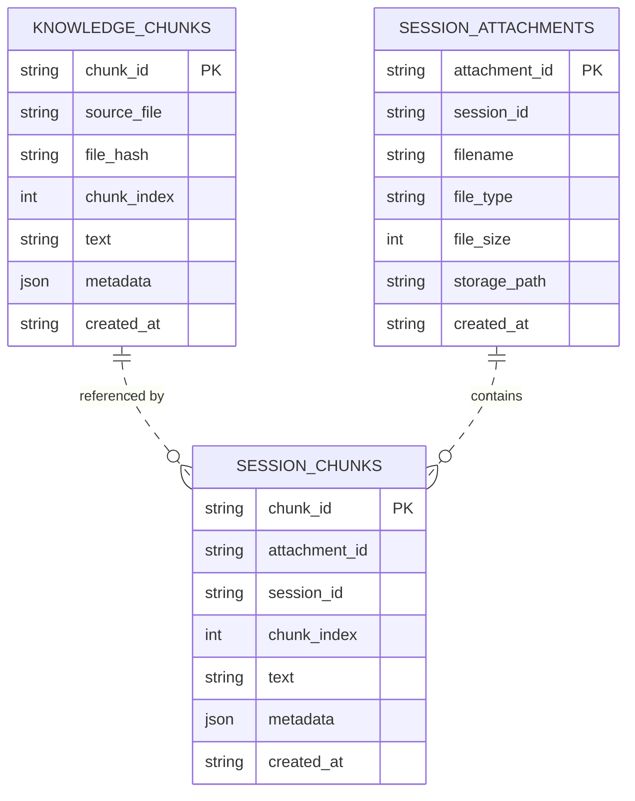
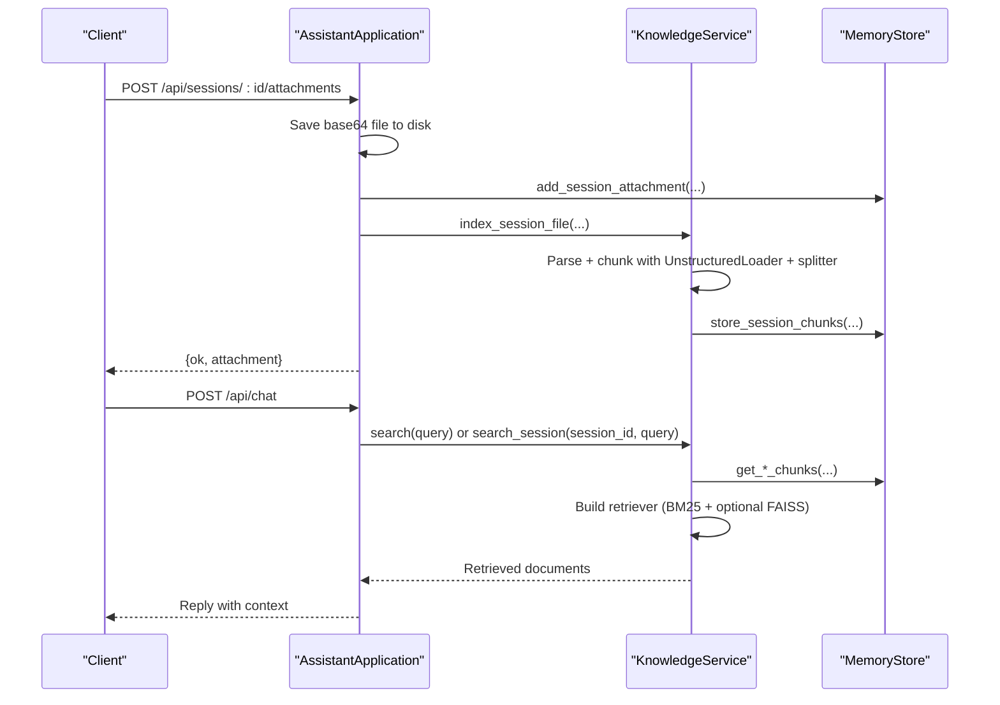
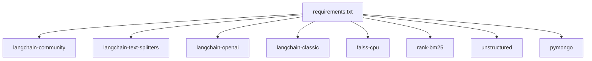

# Knowledge Management and RAG

<cite>
**Referenced Files in This Document**
- [build_knowledge.py](file://build_knowledge.py)
- [knowledge.py](file://backend/tools/knowledge.py)
- [memory_store.py](file://backend/core/memory_store.py)
- [config.py](file://backend/config.py)
- [server.py](file://backend/server.py)
- [requirements.txt](file://requirements.txt)
- [README.md](file://README.md)
- [run.py](file://run.py)
</cite>

## Table of Contents
1. [Introduction](#introduction)
2. [Project Structure](#project-structure)
3. [Core Components](#core-components)
4. [Architecture Overview](#architecture-overview)
5. [Detailed Component Analysis](#detailed-component-analysis)
6. [Dependency Analysis](#dependency-analysis)
7. [Performance Considerations](#performance-considerations)
8. [Troubleshooting Guide](#troubleshooting-guide)
9. [Conclusion](#conclusion)
10. [Appendices](#appendices)

## Introduction
This document explains the Knowledge Lab system with Retrieval-Augmented Generation (RAG) capabilities. It covers the local document processing pipeline using LangChain, FAISS vector database, and BM25 hybrid retrieval. It documents the knowledge base structure, supported file formats, preprocessing steps, indexing workflow, chunking strategies, embedding generation, similarity search algorithms, and practical usage patterns for building knowledge bases, searching local documents, and session-specific document search. It also includes performance optimization techniques and troubleshooting guidance for common indexing issues and memory management considerations.

## Project Structure
The Knowledge Lab spans several modules:
- CLI tool to build and verify knowledge bases
- Knowledge service for persistent and session-scoped retrieval
- MongoDB-backed storage for chunks and session artifacts
- Server integration and runtime configuration

**Diagram sources**
- [build_knowledge.py:1-437](file://build_knowledge.py#L1-L437)
- [knowledge.py:1-393](file://backend/tools/knowledge.py#L1-L393)
- [memory_store.py:1-947](file://backend/core/memory_store.py#L1-L947)
- [config.py:1-76](file://backend/config.py#L1-L76)
- [server.py:1-611](file://backend/server.py#L1-L611)
- [README.md:1-218](file://README.md#L1-L218)
- [requirements.txt:1-29](file://requirements.txt#L1-L29)
- [run.py:1-6](file://run.py#L1-L6)

**Section sources**
- [README.md:164-201](file://README.md#L164-L201)
- [requirements.txt:19-29](file://requirements.txt#L19-L29)

## Core Components
- KnowledgeBuilder: Scans, diffs, parses, chunks, and stores documents into MongoDB for persistent RAG.
- KnowledgeService: Manages persistent knowledge base and session-scoped document search; builds hybrid BM25 + FAISS retrievers.
- MemoryStore: MongoDB-backed persistence for knowledge chunks, session attachments, and session chunks.
- Server integration: Initializes KnowledgeService at startup and exposes attachment upload and search endpoints.

Key responsibilities:
- Document ingestion and chunking with Markdown-aware separators
- Change detection via file hashing
- Hybrid retrieval with BM25 and FAISS (when embeddings are available)
- Session-scoped retrieval for uploaded files
- Robust error handling and graceful fallbacks

**Section sources**
- [build_knowledge.py:61-211](file://build_knowledge.py#L61-L211)
- [knowledge.py:88-393](file://backend/tools/knowledge.py#L88-L393)
- [memory_store.py:67-748](file://backend/core/memory_store.py#L67-L748)
- [server.py:23-63](file://backend/server.py#L23-L63)

## Architecture Overview
The system integrates a CLI indexer and a runtime knowledge service:
- CLI builds the knowledge base by scanning a directory, computing diffs, parsing and chunking documents, and storing them in MongoDB.
- At runtime, the server initializes KnowledgeService with optional LM Studio embeddings to build FAISS indices and an EnsembleRetriever combining BM25 and FAISS.
- Users can attach files to a session; those files are parsed, chunked, and indexed for session-scoped retrieval.

**Diagram sources**
- [build_knowledge.py:273-428](file://build_knowledge.py#L273-L428)
- [knowledge.py:122-264](file://backend/tools/knowledge.py#L122-L264)
- [memory_store.py:119-134](file://backend/core/memory_store.py#L119-L134)
- [server.py:23-63](file://backend/server.py#L23-L63)

## Detailed Component Analysis

### KnowledgeBuilder (CLI Indexer)
Responsibilities:
- Scan supported files in a directory
- Compute diffs against stored file hashes
- Parse with UnstructuredLoader, split with RecursiveCharacterTextSplitter using Markdown-aware separators
- Store chunks into MongoDB with metadata (source, start_index)
- Remove stale entries for deleted files
- Optional verification via BM25 retriever

Key behaviors:
- Supported formats: PDF, DOCX, DOC, TXT, MD, CSV, JSON
- Chunk size and overlap: 1200 and 200 respectively
- Change detection via MD5 hashing
- Dry-run mode previews changes without writing to MongoDB
- Verification mode runs a BM25 query against stored chunks

**Diagram sources**
- [build_knowledge.py:75-175](file://build_knowledge.py#L75-L175)
- [build_knowledge.py:119-166](file://build_knowledge.py#L119-L166)
- [build_knowledge.py:178-206](file://build_knowledge.py#L178-L206)

**Section sources**
- [build_knowledge.py:52-55](file://build_knowledge.py#L52-L55)
- [build_knowledge.py:61-71](file://build_knowledge.py#L61-L71)
- [build_knowledge.py:90-115](file://build_knowledge.py#L90-L115)
- [build_knowledge.py:119-166](file://build_knowledge.py#L119-L166)
- [build_knowledge.py:178-206](file://build_knowledge.py#L178-L206)

### KnowledgeService (Runtime)
Responsibilities:
- Initialize knowledge base at startup by scanning docs_dir, detecting changes, and indexing new/changed files
- Build hybrid retriever: BM25 + FAISS (MMR) when embeddings are available; otherwise BM25-only
- Provide persistent knowledge base search
- Manage session-scoped document indexing and search
- Lazy caching of session retrievers with thread-safe invalidation

Initialization and indexing:
- Ensures knowledge_base directory exists
- Computes diffs and removes stale chunks for deleted files
- Parses and indexes new/changed files
- Loads all chunks and builds retrievers

Hybrid retrieval:
- BM25 retriever with top-k=5
- FAISS retriever with MMR (k=5, fetch_k=20, lambda_mult=0.5) when embeddings are available
- EnsembleRetriever with equal weights

Session-scoped search:
- Stores session attachments and chunks
- Builds BM25 retriever per session; optionally hybrid with FAISS when sufficient chunks
- Thread-safe caching with invalidation on new chunks

**Diagram sources**
- [knowledge.py:88-393](file://backend/tools/knowledge.py#L88-L393)
- [memory_store.py:67-830](file://backend/core/memory_store.py#L67-L830)

**Section sources**
- [knowledge.py:88-230](file://backend/tools/knowledge.py#L88-L230)
- [knowledge.py:231-264](file://backend/tools/knowledge.py#L231-L264)
- [knowledge.py:270-297](file://backend/tools/knowledge.py#L270-L297)
- [knowledge.py:303-335](file://backend/tools/knowledge.py#L303-L335)
- [knowledge.py:337-387](file://backend/tools/knowledge.py#L337-L387)

### MemoryStore (MongoDB Persistence)
Responsibilities:
- Define collections for sessions, messages, profile, notes, tasks, activity, cache, knowledge_chunks, session_attachments, session_chunks
- Provide indexes for efficient lookups
- Store and retrieve knowledge chunks with source_file, file_hash, chunk_index, text, metadata
- Store and retrieve session attachments and chunks
- Provide change detection via file_hash aggregation

Indexes:
- knowledge_chunks: unique chunk_id, source_file, file_hash
- session_attachments: unique attachment_id, session_id
- session_chunks: unique chunk_id, session_id, attachment_id

**Diagram sources**
- [memory_store.py:24-62](file://backend/core/memory_store.py#L24-L62)
- [memory_store.py:119-134](file://backend/core/memory_store.py#L119-L134)

**Section sources**
- [memory_store.py:51-62](file://backend/core/memory_store.py#L51-L62)
- [memory_store.py:119-134](file://backend/core/memory_store.py#L119-L134)
- [memory_store.py:695-748](file://backend/core/memory_store.py#L695-L748)
- [memory_store.py:802-830](file://backend/core/memory_store.py#L802-L830)

### Server Integration and Runtime
- AssistantApplication constructs MemoryStore and KnowledgeService
- KnowledgeService is always instantiated; RAG is enabled when docs_dir is provided
- Attachment upload endpoint saves base64-encoded files, registers in MongoDB, and indexes for session-scoped search
- Chat endpoint routes to the assistant; knowledge search is integrated via KnowledgeService

**Diagram sources**
- [server.py:329-394](file://backend/server.py#L329-L394)
- [server.py:276-320](file://backend/server.py#L276-L320)
- [knowledge.py:303-335](file://backend/tools/knowledge.py#L303-L335)
- [knowledge.py:337-387](file://backend/tools/knowledge.py#L337-L387)

**Section sources**
- [server.py:23-63](file://backend/server.py#L23-L63)
- [server.py:329-394](file://backend/server.py#L329-L394)
- [server.py:566-611](file://backend/server.py#L566-L611)

## Dependency Analysis
External libraries and their roles:
- LangChain ecosystem: document loaders, text splitters, FAISS vectorstore, BM25 retriever, EnsembleRetriever
- FAISS: vector similarity search engine
- rank-bm25: BM25 keyword-based retrieval
- unstructured: document parsing for various formats
- langchain-openai: OpenAI-compatible embeddings (for LM Studio)
- pymongo: MongoDB driver

**Diagram sources**
- [requirements.txt:19-29](file://requirements.txt#L19-L29)

**Section sources**
- [requirements.txt:19-29](file://requirements.txt#L19-L29)

## Performance Considerations
- Chunk sizing and overlap: 1200 characters with 200-character overlap balances recall and context length; adjust based on document density and query complexity.
- Hybrid retrieval: FAISS with MMR improves diversity and precision; enable only when embeddings are available and reliable.
- Indexing strategy: Incremental updates via file hashing minimize redundant processing; use dry-run to preview changes.
- Memory management:
  - Session retrievers are cached per session and invalidated on new chunks; ensure cleanup on session deletion.
  - FAISS index construction can be expensive; monitor build time and consider limiting concurrent builds.
- Embedding model: LM Studio embeddings are used when available; connectivity checks prevent runtime failures.
- MongoDB indexing: Ensure indexes exist on knowledge_chunks and session_chunks for fast retrieval.

[No sources needed since this section provides general guidance]

## Troubleshooting Guide
Common issues and resolutions:
- RAG dependencies missing:
  - Symptom: Import errors during CLI or runtime.
  - Resolution: Install RAG dependencies as per requirements.
  - Section sources
    - [requirements.txt:19-29](file://requirements.txt#L19-L29)
    - [build_knowledge.py:37-39](file://build_knowledge.py#L37-L39)

- MongoDB connection failure:
  - Symptom: RuntimeError indicating inability to connect.
  - Resolution: Verify MongoDB URI and that the server is running.
  - Section sources
    - [memory_store.py:86-98](file://backend/core/memory_store.py#L86-L98)

- LM Studio embeddings unavailable:
  - Symptom: Warning logs and fallback to BM25-only.
  - Resolution: Ensure LM Studio is running and reachable at configured URL; verify model availability.
  - Section sources
    - [knowledge.py:122-137](file://backend/tools/knowledge.py#L122-L137)

- Parsing failures for attachments:
  - Symptom: Parse errors during session file indexing.
  - Resolution: Confirm file format is supported; check file integrity; retry with smaller files.
  - Section sources
    - [knowledge.py:312-318](file://backend/tools/knowledge.py#L312-L318)
    - [server.py:340-347](file://backend/server.py#L340-L347)

- Empty knowledge base:
  - Symptom: No results from KB search.
  - Resolution: Build knowledge base using CLI; verify chunks exist in MongoDB; run verification query.
  - Section sources
    - [build_knowledge.py:178-206](file://build_knowledge.py#L178-L206)
    - [knowledge.py:270-297](file://backend/tools/knowledge.py#L270-L297)

- Large files or unsupported types:
  - Symptom: Upload rejected due to size or type.
  - Resolution: Respect max size and supported extensions; convert or compress files as needed.
  - Section sources
    - [server.py:326-361](file://backend/server.py#L326-L361)

## Conclusion
The Knowledge Lab system provides a robust, incremental, and hybrid RAG pipeline. Documents are parsed, chunked, and stored in MongoDB, enabling fast BM25 retrieval and optional FAISS-based hybrid search powered by LM Studio embeddings. The system supports both persistent knowledge base and session-scoped document search, with careful attention to performance, reliability, and user experience.

[No sources needed since this section summarizes without analyzing specific files]

## Appendices

### Practical Examples

- Building a knowledge base:
  - Use the CLI to scan, diff, and index documents; optionally verify with a test query.
  - Section sources
    - [build_knowledge.py:273-428](file://build_knowledge.py#L273-L428)

- Searching local documents:
  - Enable RAG at startup; use the KnowledgeService search method to retrieve contextual chunks.
  - Section sources
    - [knowledge.py:270-297](file://backend/tools/knowledge.py#L270-L297)

- Session-specific document search:
  - Attach files to a session; the system indexes them and allows targeted retrieval per session.
  - Section sources
    - [server.py:329-394](file://backend/server.py#L329-L394)
    - [knowledge.py:337-387](file://backend/tools/knowledge.py#L337-L387)

- Configuration and environment:
  - Configure MongoDB, RAG docs path, and provider settings via .env; ensure dependencies are installed.
  - Section sources
    - [config.py:55-76](file://backend/config.py#L55-L76)
    - [README.md:104-136](file://README.md#L104-L136)
    - [requirements.txt:19-29](file://requirements.txt#L19-L29)