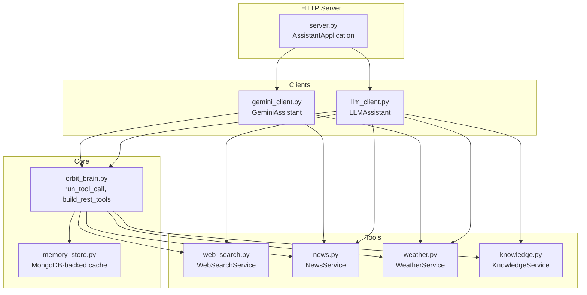
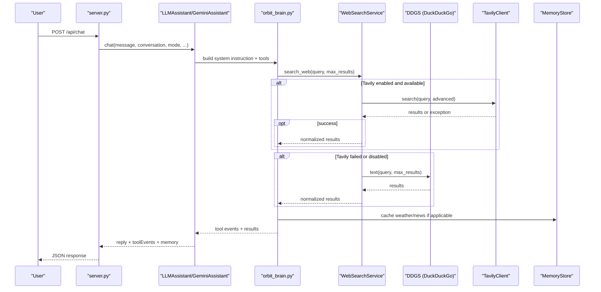
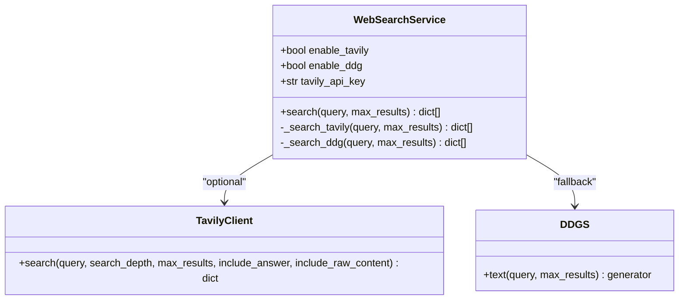
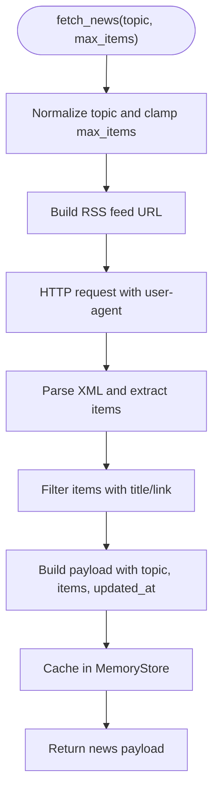
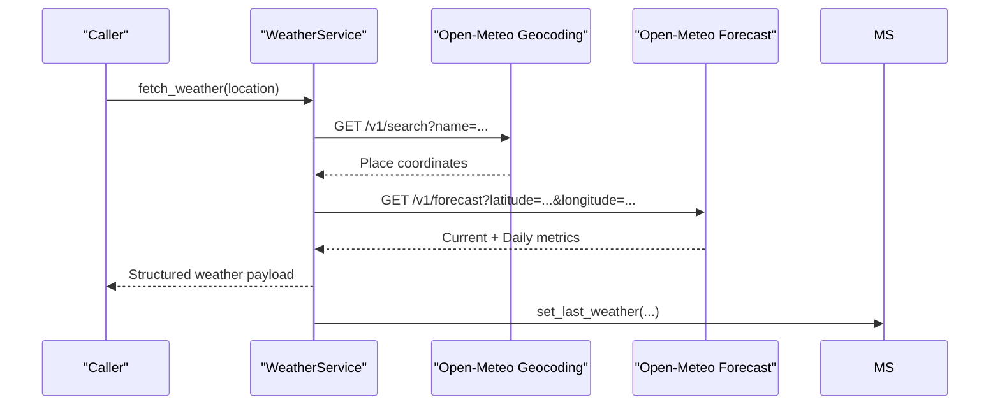
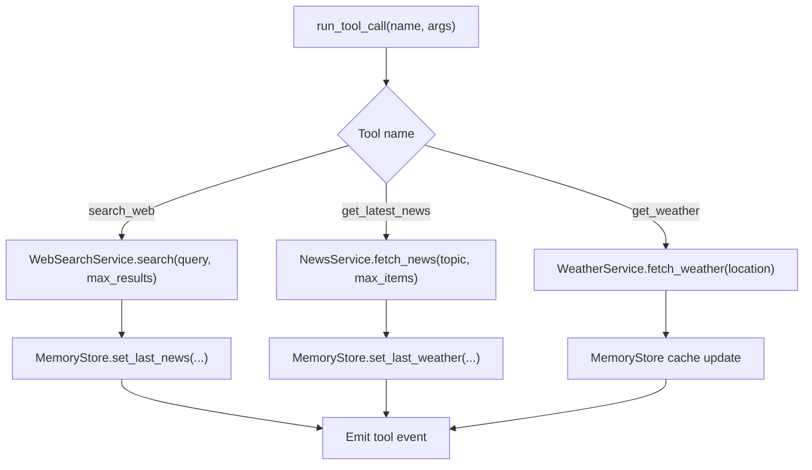
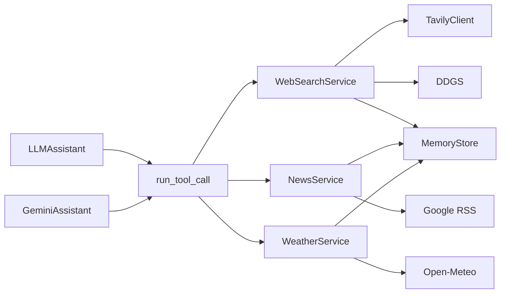

# Live Web Search Integration

<cite>
**Referenced Files in This Document**
- [web_search.py](file://backend/tools/web_search.py)
- [news.py](file://backend/tools/news.py)
- [weather.py](file://backend/tools/weather.py)
- [config.py](file://backend/config.py)
- [gemini_client.py](file://backend/api_clients/gemini_client.py)
- [llm_client.py](file://backend/api_clients/llm_client.py)
- [orbit_brain.py](file://backend/core/orbit_brain.py)
- [memory_store.py](file://backend/core/memory_store.py)
- [knowledge.py](file://backend/tools/knowledge.py)
- [server.py](file://backend/server.py)
- [run.py](file://run.py)
</cite>

## Table of Contents
1. [Introduction](#introduction)
2. [Project Structure](#project-structure)
3. [Core Components](#core-components)
4. [Architecture Overview](#architecture-overview)
5. [Detailed Component Analysis](#detailed-component-analysis)
6. [Dependency Analysis](#dependency-analysis)
7. [Performance Considerations](#performance-considerations)
8. [Troubleshooting Guide](#troubleshooting-guide)
9. [Conclusion](#conclusion)
10. [Appendices](#appendices)

## Introduction
This document explains the live web search and external service integration system. It covers the dual-provider architecture using Tavily and DuckDuckGo APIs for web search with automatic fallback, the Google RSS-based news headline retrieval system, and the weather information service integration. It also documents search result processing, caching strategies, rate limiting considerations, configuration options, and practical guidance for query optimization, error handling, and performance tuning.

## Project Structure
The system is organized around modular tools and clients:
- Tools: web search, news, weather, knowledge (RAG)
- Clients: Gemini and generic LLM client orchestrating tool calls
- Core: brain orchestration, memory store (MongoDB-backed)
- Server: HTTP API exposing chat, state, and tool endpoints

**Diagram sources**
- [server.py:23-611](file://backend/server.py#L23-L611)
- [gemini_client.py:36-207](file://backend/api_clients/gemini_client.py#L36-L207)
- [llm_client.py:38-366](file://backend/api_clients/llm_client.py#L38-L366)
- [orbit_brain.py:389-502](file://backend/core/orbit_brain.py#L389-L502)
- [memory_store.py:67-150](file://backend/core/memory_store.py#L67-L150)
- [web_search.py:53-139](file://backend/tools/web_search.py#L53-L139)
- [news.py:21-83](file://backend/tools/news.py#L21-L83)
- [weather.py:48-141](file://backend/tools/weather.py#L48-L141)
- [knowledge.py:88-393](file://backend/tools/knowledge.py#L88-L393)

**Section sources**
- [server.py:23-611](file://backend/server.py#L23-L611)
- [run.py:1-6](file://run.py#L1-L6)

## Core Components
- WebSearchService: Dual-provider web search with Tavily and DuckDuckGo, automatic fallback, and result normalization.
- NewsService: Fetches top headlines and topic-specific feeds from Google RSS.
- WeatherService: Geocodes locations and retrieves current/daily forecasts from Open-Meteo.
- MemoryStore: Persistent cache for weather and news, plus other assistant state.
- Tool orchestration: run_tool_call routes function calls to the appropriate service and caches results.
- LLM clients: GeminiAssistant and LLMAssistant integrate tools into chat workflows.

**Section sources**
- [web_search.py:53-139](file://backend/tools/web_search.py#L53-L139)
- [news.py:21-83](file://backend/tools/news.py#L21-L83)
- [weather.py:48-141](file://backend/tools/weather.py#L48-L141)
- [memory_store.py:475-495](file://backend/core/memory_store.py#L475-L495)
- [orbit_brain.py:389-502](file://backend/core/orbit_brain.py#L389-L502)
- [gemini_client.py:36-207](file://backend/api_clients/gemini_client.py#L36-L207)
- [llm_client.py:38-366](file://backend/api_clients/llm_client.py#L38-L366)

## Architecture Overview
The assistant receives user messages and decides whether to call tools. For web search, it uses WebSearchService with Tavily first, then falls back to DuckDuckGo. For news and weather, it uses NewsService and WeatherService respectively. Results are cached in MemoryStore and can influence subsequent prompts.

**Diagram sources**
- [server.py:276-321](file://backend/server.py#L276-L321)
- [llm_client.py:293-366](file://backend/api_clients/llm_client.py#L293-L366)
- [gemini_client.py:69-94](file://backend/api_clients/gemini_client.py#L69-L94)
- [orbit_brain.py:475-487](file://backend/core/orbit_brain.py#L475-L487)
- [web_search.py:69-104](file://backend/tools/web_search.py#L69-L104)
- [web_search.py:106-139](file://backend/tools/web_search.py#L106-L139)

## Detailed Component Analysis

### Web Search Service
Dual-provider architecture:
- TavilyClient is used when configured and available; advanced search depth is requested.
- DuckDuckGo is used as a fallback provider when Tavily is unavailable or fails.
- Results are normalized to a common structure with title, link, body, and source.

**Diagram sources**
- [web_search.py:53-139](file://backend/tools/web_search.py#L53-L139)

Operational flow:
- Validates query, prints progress, starts a SpinnerTimer.
- Attempts Tavily; on failure, logs and switches to DuckDuckGo.
- On DuckDuckGo failure, stops timer and raises a WebSearchError.
- Normalizes results to a unified schema.

**Section sources**
- [web_search.py:69-104](file://backend/tools/web_search.py#L69-L104)
- [web_search.py:106-139](file://backend/tools/web_search.py#L106-L139)

### News Headline Retrieval
- Uses Google RSS feeds for top headlines and topic-specific queries.
- Normalizes topic names and builds feed URLs accordingly.
- Requests RSS content with a user-agent header and parses XML.
- Clamps max_items between 1 and 8 and filters invalid entries.
- Caches the latest news in MemoryStore under a dedicated cache key.

**Diagram sources**
- [news.py:25-60](file://backend/tools/news.py#L25-L60)
- [news.py:62-67](file://backend/tools/news.py#L62-L67)
- [news.py:69-83](file://backend/tools/news.py#L69-L83)

**Section sources**
- [news.py:21-83](file://backend/tools/news.py#L21-L83)
- [memory_store.py:486-495](file://backend/core/memory_store.py#L486-L495)

### Weather Information Service
- Geocodes a location via Open-Meteo’s geocoding API.
- Retrieves current and daily weather forecasts.
- Maps numeric weather codes to human-readable conditions.
- Provides advice based on temperature and precipitation probability.
- Caches weather data in MemoryStore.

**Diagram sources**
- [weather.py:51-75](file://backend/tools/weather.py#L51-L75)
- [weather.py:77-112](file://backend/tools/weather.py#L77-L112)
- [memory_store.py:475-481](file://backend/core/memory_store.py#L475-L481)

**Section sources**
- [weather.py:48-141](file://backend/tools/weather.py#L48-L141)
- [memory_store.py:475-495](file://backend/core/memory_store.py#L475-L495)

### Tool Orchestration and Caching
- run_tool_call executes tool invocations and records events.
- For web search, it passes the query and max_results to WebSearchService.
- For news and weather, it caches results in MemoryStore and records events.
- MemoryStore persists weather and news under cache documents for quick retrieval.

**Diagram sources**
- [orbit_brain.py:389-502](file://backend/core/orbit_brain.py#L389-L502)
- [memory_store.py:475-495](file://backend/core/memory_store.py#L475-L495)

**Section sources**
- [orbit_brain.py:389-502](file://backend/core/orbit_brain.py#L389-L502)
- [memory_store.py:475-495](file://backend/core/memory_store.py#L475-L495)

## Dependency Analysis
- WebSearchService depends on TavilyClient availability and DuckDuckGo’s DDGS.
- NewsService depends on Google RSS endpoints and XML parsing.
- WeatherService depends on Open-Meteo geocoding and forecast endpoints.
- MemoryStore provides caching for weather and news and integrates with MongoDB.
- LLM clients depend on tool declarations and run_tool_call to execute tools.

**Diagram sources**
- [web_search.py:47-50](file://backend/tools/web_search.py#L47-L50)
- [web_search.py:126-139](file://backend/tools/web_search.py#L126-L139)
- [news.py:69-83](file://backend/tools/news.py#L69-L83)
- [weather.py:77-112](file://backend/tools/weather.py#L77-L112)
- [memory_store.py:475-495](file://backend/core/memory_store.py#L475-L495)
- [orbit_brain.py:389-502](file://backend/core/orbit_brain.py#L389-L502)
- [llm_client.py:38-46](file://backend/api_clients/llm_client.py#L38-L46)
- [gemini_client.py:36-42](file://backend/api_clients/gemini_client.py#L36-L42)

**Section sources**
- [web_search.py:47-50](file://backend/tools/web_search.py#L47-L50)
- [news.py:69-83](file://backend/tools/news.py#L69-L83)
- [weather.py:77-112](file://backend/tools/weather.py#L77-L112)
- [memory_store.py:475-495](file://backend/core/memory_store.py#L475-L495)
- [orbit_brain.py:389-502](file://backend/core/orbit_brain.py#L389-L502)
- [llm_client.py:38-46](file://backend/api_clients/llm_client.py#L38-L46)
- [gemini_client.py:36-42](file://backend/api_clients/gemini_client.py#L36-L42)

## Performance Considerations
- Web search:
  - Tavily advanced search depth improves result quality but may increase latency; consider reducing max_results for speed-sensitive queries.
  - DuckDuckGo fallback ensures resilience; tune max_results to balance comprehensiveness and context length.
  - SpinnerTimer provides user feedback during long operations.
- News:
  - RSS requests are lightweight; clamp max_items to reduce payload size.
  - XML parsing overhead is minimal; ensure timeouts are respected.
- Weather:
  - Geocoding and forecast calls are separate; caching reduces repeated lookups.
  - Temperature and precipitation thresholds guide concise advice.
- Caching:
  - MemoryStore caches weather and news; leverage for repeated queries.
  - Knowledge base uses MongoDB-backed chunk storage and retrievers; ensure adequate indexing and chunk sizes.
- Rate limiting:
  - External APIs (Tavily, DDG, Open-Meteo) may enforce quotas; implement retries with backoff and consider batching where feasible.
  - Network timeouts are configured in tool clients; adjust for unstable networks.

[No sources needed since this section provides general guidance]

## Troubleshooting Guide
Common issues and resolutions:
- Web search failures:
  - Tavily import missing or API key absent: WebSearchService disables Tavily and falls back to DuckDuckGo automatically.
  - DuckDuckGo exceptions: The service logs and raises a WebSearchError; verify network connectivity and query validity.
- News service unavailability:
  - HTTP/URL errors or timeouts: The service raises a NewsError with details; confirm RSS endpoint accessibility and headers.
- Weather service errors:
  - Geocoding returns no results: The service raises WeatherError with guidance; verify location spelling.
  - Forecast parsing errors: The service raises WeatherError; check network and endpoint stability.
- Tool invocation errors:
  - run_tool_call catches NewsError, WeatherError, and ValueError; returns an error event payload.
- API key and provider configuration:
  - GeminiAssistant and LLMAssistant require API keys; missing keys raise provider-specific errors.
  - ACTIVE_PROVIDER controls which provider is active; ensure correct model and endpoint configuration.

**Section sources**
- [web_search.py:47-50](file://backend/tools/web_search.py#L47-L50)
- [web_search.py:86-104](file://backend/tools/web_search.py#L86-L104)
- [news.py:80-83](file://backend/tools/news.py#L80-L83)
- [weather.py:82-84](file://backend/tools/weather.py#L82-L84)
- [weather.py:125-127](file://backend/tools/weather.py#L125-L127)
- [orbit_brain.py:490-493](file://backend/core/orbit_brain.py#L490-L493)
- [gemini_client.py:53-56](file://backend/api_clients/gemini_client.py#L53-L56)
- [llm_client.py:60-61](file://backend/api_clients/llm_client.py#L60-L61)

## Conclusion
The system provides robust, resilient external integrations with a dual web search provider architecture, reliable news and weather services, and efficient caching. Tool orchestration ensures consistent behavior across providers, while configuration and environment variables support flexible deployment. Tuning query parameters, leveraging caching, and handling provider-specific errors enables reliable operation under varied conditions.

[No sources needed since this section summarizes without analyzing specific files]

## Appendices

### Configuration Options
- Environment variables and settings:
  - ACTIVE_PROVIDER: selects active provider (google, openrouter, lm_studio, ollama).
  - GOOGLE_API_KEY, OPENROUTER_API_KEY: API keys for providers.
  - AI_MODEL, GOOGLE_MODEL, OPENROUTER_MODEL, LM_STUDIO_MODEL, OLLAMA_MODEL: model identifiers.
  - DEFAULT_LOCATION: default location for weather.
  - ASSISTANT_PORT: server port.
  - MONGODB_URI, MONGODB_DB: MongoDB connection settings.
  - RAG_DOCS_PATH: path to knowledge base for RAG.
  - LM_STUDIO_URL, OLLAMA_URL: local LLM endpoints.

**Section sources**
- [config.py:20-76](file://backend/config.py#L20-L76)
- [server.py:566-611](file://backend/server.py#L566-L611)

### Search Query Optimization
- Construct comprehensive queries that cover the full topic in one call; the system discourages multiple web searches for the same query.
- Use max_results thoughtfully: small for simple facts, moderate for detailed topics, larger only for complex research requiring cross-source comparison.
- Combine web search with local knowledge when appropriate; the system supports both modes dynamically.

**Section sources**
- [orbit_brain.py:250-267](file://backend/core/orbit_brain.py#L250-L267)
- [llm_client.py:118-127](file://backend/api_clients/llm_client.py#L118-L127)

### Error Handling and Resilience
- Automatic fallback: Tavily → DuckDuckGo.
- Tool-level error propagation: run_tool_call wraps errors and emits events.
- Network timeouts: configured per service; adjust for unstable environments.
- Graceful degradation: offline mode disables web search; knowledge-only mode restricts tools accordingly.

**Section sources**
- [web_search.py:79-104](file://backend/tools/web_search.py#L79-L104)
- [orbit_brain.py:490-493](file://backend/core/orbit_brain.py#L490-L493)
- [llm_client.py:74-77](file://backend/api_clients/llm_client.py#L74-L77)

### Performance Tuning Tips
- Reduce max_results for faster responses when context length is constrained.
- Enable caching for repeated weather/news queries.
- Monitor spinner timers for long-running operations and consider increasing timeouts if acceptable.
- For RAG, ensure knowledge base indexing is complete and chunk sizes are balanced for retrieval performance.

[No sources needed since this section provides general guidance]