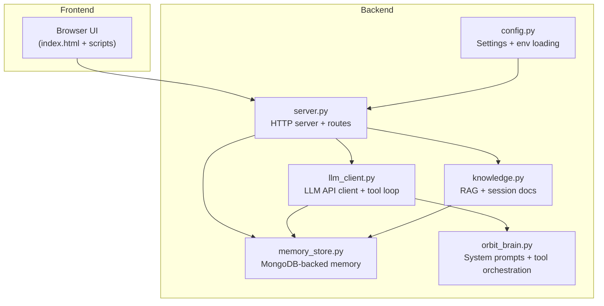
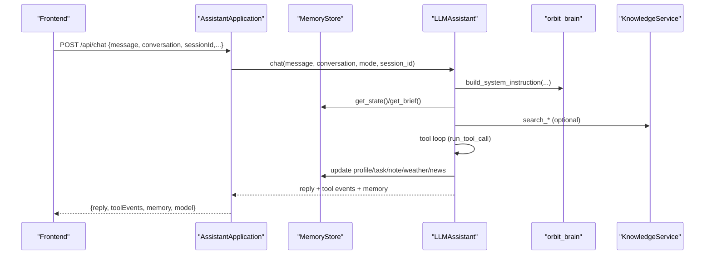
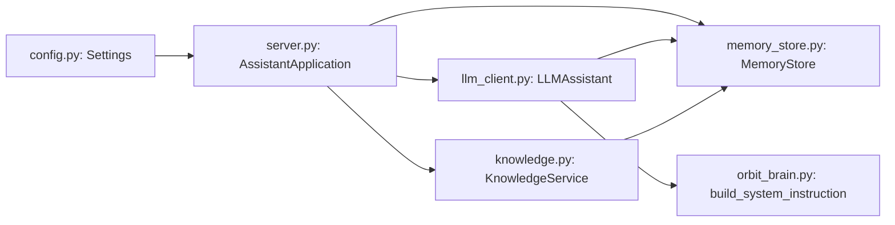

# Multi-Session Chat Management

<cite>
**Referenced Files in This Document**
- [memory_store.py](file://backend/core/memory_store.py)
- [orbit_brain.py](file://backend/core/orbit_brain.py)
- [llm_client.py](file://backend/api_clients/llm_client.py)
- [server.py](file://backend/server.py)
- [config.py](file://backend/config.py)
- [knowledge.py](file://backend/tools/knowledge.py)
- [run.py](file://run.py)
</cite>

## Table of Contents
1. [Introduction](#introduction)
2. [Project Structure](#project-structure)
3. [Core Components](#core-components)
4. [Architecture Overview](#architecture-overview)
5. [Detailed Component Analysis](#detailed-component-analysis)
6. [Dependency Analysis](#dependency-analysis)
7. [Performance Considerations](#performance-considerations)
8. [Troubleshooting Guide](#troubleshooting-guide)
9. [Conclusion](#conclusion)
10. [Appendices](#appendices)

## Introduction
This document describes the multi-session chat management system that persists conversations and related state in MongoDB, while enabling real-time conversation handling. It explains session lifecycle management, message threading, and conversation state preservation. It also details the memory store architecture for storing user profiles, tasks, notes, and conversation history, and covers session switching, message pagination, and conversation context management. Practical examples illustrate session creation, message retrieval, state synchronization, and cleanup procedures. Finally, it addresses database schema design, indexing strategies, and performance optimization for large conversation histories.

## Project Structure
The system is organized around a backend server exposing REST endpoints, a memory store backed by MongoDB, an LLM client orchestrating chat and tool calls, and a knowledge service for RAG and session-scoped document search.

**Diagram sources**
- [server.py:23-84](file://backend/server.py#L23-L84)
- [memory_store.py:67-118](file://backend/core/memory_store.py#L67-L118)
- [orbit_brain.py:302-357](file://backend/core/orbit_brain.py#L302-L357)
- [llm_client.py:38-46](file://backend/api_clients/llm_client.py#L38-L46)
- [knowledge.py:88-108](file://backend/tools/knowledge.py#L88-L108)
- [config.py:20-76](file://backend/config.py#L20-L76)

**Section sources**
- [server.py:23-84](file://backend/server.py#L23-L84)
- [config.py:20-76](file://backend/config.py#L20-L76)

## Core Components
- MemoryStore: MongoDB-backed persistence for sessions, messages, profile, tasks, notes, activity, cache, knowledge chunks, session attachments, and session chunks. Provides thread-safe CRUD APIs and indexes for efficient queries.
- AssistantApplication: HTTP server that exposes REST endpoints for sessions, messages, attachments, weather, news, and chat. Manages migration from legacy JSON files to MongoDB and integrates with the LLM client and knowledge service.
- LLMAssistant: Orchestrates chat interactions, builds system instructions, manages tool calls, and handles multimodal inputs (text + optional images).
- KnowledgeService: Builds and maintains a persistent knowledge base from local documents and enables session-scoped document search and indexing.
- Settings: Loads environment variables and provides runtime configuration for providers, ports, and MongoDB connection.

**Section sources**
- [memory_store.py:67-118](file://backend/core/memory_store.py#L67-L118)
- [server.py:23-84](file://backend/server.py#L23-L84)
- [llm_client.py:38-46](file://backend/api_clients/llm_client.py#L38-L46)
- [knowledge.py:88-108](file://backend/tools/knowledge.py#L88-L108)
- [config.py:20-76](file://backend/config.py#L20-L76)

## Architecture Overview
The system follows a layered architecture:
- Presentation: HTTP endpoints serve the frontend and expose CRUD operations for sessions, messages, and state.
- Orchestration: The LLM client constructs system instructions and executes tool calls, updating memory state accordingly.
- Persistence: MemoryStore encapsulates MongoDB collections and indexes, ensuring ACID-like semantics with a lock and providing migration from legacy JSON.
- Knowledge: KnowledgeService indexes local documents and session attachments for retrieval.

**Diagram sources**
- [server.py:276-321](file://backend/server.py#L276-L321)
- [llm_client.py:47-78](file://backend/api_clients/llm_client.py#L47-L78)
- [orbit_brain.py:302-357](file://backend/core/orbit_brain.py#L302-L357)
- [knowledge.py:270-298](file://backend/tools/knowledge.py#L270-L298)

## Detailed Component Analysis

### Memory Store: MongoDB Schema and Indexing
MemoryStore defines the schema and indexes for all persisted entities. It ensures uniqueness and efficient sorting for common queries.

Collections and indexes:
- sessions: unique session_id, compound index on pinned desc, updated_at desc
- messages: compound index on session_id asc, created_at asc; unique message_id
- profile: singleton document with _id "user_profile"
- notes: unique note_id
- tasks: unique task_id
- activity: descending created_at
- cache: singleton documents for last_weather and last_news
- knowledge_chunks: unique chunk_id; indexes on source_file and file_hash
- session_attachments: unique attachment_id; indexes on session_id
- session_chunks: unique chunk_id; indexes on session_id and attachment_id

Thread-safety: All write operations are protected by a lock to prevent race conditions during concurrent access.

Migration: One-time migration from legacy JSON files to MongoDB preserves existing data and renames legacy files to .bak.

Practical examples:
- Create a session: [create_session:579-596](file://backend/core/memory_store.py#L579-L596)
- List sessions: [get_sessions:598-606](file://backend/core/memory_store.py#L598-L606)
- Update session: [update_session:615-630](file://backend/core/memory_store.py#L615-L630)
- Delete session and attachments: [delete_session:632-646](file://backend/core/memory_store.py#L632-L646)
- Add a message: [add_message:652-673](file://backend/core/memory_store.py#L652-L673)
- Retrieve messages with pagination: [get_messages:675-685](file://backend/core/memory_store.py#L675-L685)
- Attach a file to a session: [add_session_attachment:754-779](file://backend/core/memory_store.py#L754-L779)
- Search session docs: [search_session:337-355](file://backend/tools/knowledge.py#L337-L355)

**Section sources**
- [memory_store.py:24-62](file://backend/core/memory_store.py#L24-L62)
- [memory_store.py:119-135](file://backend/core/memory_store.py#L119-L135)
- [memory_store.py:579-646](file://backend/core/memory_store.py#L579-L646)
- [memory_store.py:652-685](file://backend/core/memory_store.py#L652-L685)
- [memory_store.py:754-796](file://backend/core/memory_store.py#L754-L796)
- [memory_store.py:832-947](file://backend/core/memory_store.py#L832-L947)

### Session Lifecycle Management
Sessions represent separate conversation contexts. The system supports:
- Creation: [create_session:579-596](file://backend/core/memory_store.py#L579-L596)
- Listing: [get_sessions:598-606](file://backend/core/memory_store.py#L598-L606)
- Retrieval: [get_session:608-613](file://backend/core/memory_store.py#L608-L613)
- Updating: [update_session:615-630](file://backend/core/memory_store.py#L615-L630)
- Deletion: [delete_session:632-646](file://backend/core/memory_store.py#L632-L646)

HTTP endpoints:
- POST /api/sessions: create a new session
- GET /api/sessions: list sessions (optionally include archived)
- GET /api/sessions/{id}: retrieve a session
- PUT /api/sessions/{id}: update title/pinned/archived
- DELETE /api/sessions/{id}: delete a session and associated attachments

Session switching:
- Clients pass sessionId in chat requests to route messages to the correct session.
- The LLM client uses session_id to enable session-scoped tools and to persist messages under the selected session.

**Section sources**
- [server.py:183-186](file://backend/server.py#L183-L186)
- [server.py:111-126](file://backend/server.py#L111-L126)
- [server.py:403-422](file://backend/server.py#L403-L422)
- [server.py:431-446](file://backend/server.py#L431-L446)
- [llm_client.py:47-78](file://backend/api_clients/llm_client.py#L47-L78)

### Message Threading and Pagination
Messages are stored per session with timestamps. The system supports:
- Adding a message: [add_message:652-673](file://backend/core/memory_store.py#L652-L673)
- Retrieving messages with optional limit: [get_messages:675-685](file://backend/core/memory_store.py#L675-L685)
- Deleting a message: [delete_message:687-689](file://backend/core/memory_store.py#L687-L689)

HTTP endpoints:
- POST /api/sessions/{id}/messages: add a message
- GET /api/sessions/{id}/messages?limit=N: retrieve messages with pagination
- DELETE /api/messages/{id}: delete a message

Real-time handling:
- The server responds immediately with the persisted message and updated memory snapshot.
- The LLM client appends tool call results back into the conversation context for subsequent turns.

**Section sources**
- [server.py:189-202](file://backend/server.py#L189-L202)
- [server.py:128-135](file://backend/server.py#L128-L135)
- [server.py:468-474](file://backend/server.py#L468-L474)
- [memory_store.py:652-685](file://backend/core/memory_store.py#L652-L685)

### Conversation State Preservation
State includes profile, tasks, notes, recent activity, and cached weather/news. The system provides:
- Full state snapshot: [get_state:188-250](file://backend/core/memory_store.py#L188-L250)
- Brief snapshot for UI: [get_brief:252-276](file://backend/core/memory_store.py#L252-L276)
- Profile updates: [update_profile:282-303](file://backend/core/memory_store.py#L282-L303)
- Task CRUD: [add_task:338-375](file://backend/core/memory_store.py#L338-L375), [complete_task:377-415](file://backend/core/memory_store.py#L377-L415), [delete_task:417-446](file://backend/core/memory_store.py#L417-L446)
- Note CRUD: [remember_note:309-332](file://backend/core/memory_store.py#L309-L332), [delete_note:448-469](file://backend/core/memory_store.py#L448-L469)
- Cache updates: [set_last_weather:475-484](file://backend/core/memory_store.py#L475-L484), [set_last_news:486-495](file://backend/core/memory_store.py#L486-L495)

HTTP endpoints:
- POST /api/profile: update profile
- POST /api/tasks: add task
- POST /api/tasks/complete: complete task
- POST /api/notes: add note
- DELETE /api/notes/{id}: delete note
- GET /api/weather?location=...: fetch weather and update cache
- GET /api/news?topic=...: fetch news and update cache

**Section sources**
- [memory_store.py:188-276](file://backend/core/memory_store.py#L188-L276)
- [memory_store.py:282-303](file://backend/core/memory_store.py#L282-L303)
- [memory_store.py:338-446](file://backend/core/memory_store.py#L338-L446)
- [memory_store.py:448-495](file://backend/core/memory_store.py#L448-L495)
- [server.py:214-221](file://backend/server.py#L214-L221)
- [server.py:222-241](file://backend/server.py#L222-L241)
- [server.py:243-253](file://backend/server.py#L243-L253)
- [server.py:145-164](file://backend/server.py#L145-L164)

### Attachment Handling and Session Documents
Files attached to sessions are stored on disk and indexed for session-scoped search:
- Upload endpoint: POST /api/sessions/{id}/attachments
- Attachment registration: [add_session_attachment:754-779](file://backend/core/memory_store.py#L754-L779)
- Chunk storage: [store_session_chunks:820-830](file://backend/core/memory_store.py#L820-L830)
- Retrieval: [get_session_attachments:781-786](file://backend/core/memory_store.py#L781-L786), [get_session_chunks:824-830](file://backend/core/memory_store.py#L824-L830)
- Cleanup: [delete_session_attachment:788-796](file://backend/core/memory_store.py#L788-L796)

KnowledgeService integrates with MemoryStore to build BM25 and optional FAISS retrievers for session documents.

**Section sources**
- [server.py:204-209](file://backend/server.py#L204-L209)
- [server.py:329-393](file://backend/server.py#L329-L393)
- [memory_store.py:754-796](file://backend/core/memory_store.py#L754-L796)
- [memory_store.py:820-830](file://backend/core/memory_store.py#L820-L830)
- [knowledge.py:303-355](file://backend/tools/knowledge.py#L303-L355)

### Legacy Migration and JSON-to-MongoDB Transition
The system supports migrating from legacy JSON files to MongoDB:
- Detection and migration: [migrate_from_json:836-947](file://backend/core/memory_store.py#L836-L947)
- Server-side migration on startup: [AssistantApplication.__init__:27-48](file://backend/server.py#L27-L48)
- Renaming legacy files to .bak post-migration

**Section sources**
- [memory_store.py:836-947](file://backend/core/memory_store.py#L836-L947)
- [server.py:27-48](file://backend/server.py#L27-L48)

### Practical Examples

- Session creation
  - Endpoint: POST /api/sessions
  - Example path: [server.py:183-186](file://backend/server.py#L183-L186)
  - Implementation: [MemoryStore.create_session:579-596](file://backend/core/memory_store.py#L579-L596)

- Message retrieval with pagination
  - Endpoint: GET /api/sessions/{id}/messages?limit=N
  - Example path: [server.py:128-135](file://backend/server.py#L128-L135)
  - Implementation: [MemoryStore.get_messages:675-685](file://backend/core/memory_store.py#L675-L685)

- State synchronization
  - Endpoint: GET /api/state
  - Example path: [server.py:106-108](file://backend/server.py#L106-L108)
  - Implementation: [AssistantApplication._state_payload:506-520](file://backend/server.py#L506-L520)

- Cleanup procedures
  - Delete session and attachments: [server.py:431-446](file://backend/server.py#L431-L446), [MemoryStore.delete_session:632-646](file://backend/core/memory_store.py#L632-L646)
  - Delete message: [server.py:468-474](file://backend/server.py#L468-L474), [MemoryStore.delete_message:687-689](file://backend/core/memory_store.py#L687-L689)
  - Delete note: [server.py:476-498](file://backend/server.py#L476-L498), [MemoryStore.delete_note:448-469](file://backend/core/memory_store.py#L448-L469)

**Section sources**
- [server.py:106-108](file://backend/server.py#L106-L108)
- [server.py:183-186](file://backend/server.py#L183-L186)
- [server.py:128-135](file://backend/server.py#L128-L135)
- [server.py:431-446](file://backend/server.py#L431-L446)
- [server.py:468-474](file://backend/server.py#L468-L474)
- [server.py:476-498](file://backend/server.py#L476-L498)
- [memory_store.py:579-596](file://backend/core/memory_store.py#L579-L596)
- [memory_store.py:632-646](file://backend/core/memory_store.py#L632-L646)
- [memory_store.py:675-685](file://backend/core/memory_store.py#L675-L685)
- [memory_store.py:687-689](file://backend/core/memory_store.py#L687-L689)
- [memory_store.py:448-469](file://backend/core/memory_store.py#L448-L469)

## Dependency Analysis
The following diagram shows key dependencies among components:

**Diagram sources**
- [config.py:20-76](file://backend/config.py#L20-L76)
- [server.py:23-84](file://backend/server.py#L23-L84)
- [memory_store.py:67-118](file://backend/core/memory_store.py#L67-L118)
- [llm_client.py:38-46](file://backend/api_clients/llm_client.py#L38-L46)
- [knowledge.py:88-108](file://backend/tools/knowledge.py#L88-L108)
- [orbit_brain.py:302-357](file://backend/core/orbit_brain.py#L302-L357)

**Section sources**
- [server.py:23-84](file://backend/server.py#L23-L84)
- [memory_store.py:67-118](file://backend/core/memory_store.py#L67-L118)
- [llm_client.py:38-46](file://backend/api_clients/llm_client.py#L38-L46)
- [knowledge.py:88-108](file://backend/tools/knowledge.py#L88-L108)
- [config.py:20-76](file://backend/config.py#L20-L76)
- [orbit_brain.py:302-357](file://backend/core/orbit_brain.py#L302-L357)

## Performance Considerations
- Indexing strategy:
  - sessions: unique session_id, pinned desc, updated_at desc for fast listing and pinning
  - messages: session_id asc, created_at asc for chronological retrieval and pagination
  - knowledge_chunks: chunk_id unique, source_file, file_hash for deduplication and lookup
  - session_attachments/session_chunks: attachment_id unique, session_id for fast per-session queries
- Concurrency:
  - MemoryStore uses a lock to serialize writes, preventing race conditions during concurrent operations
- Pagination:
  - Use limit parameter in get_messages to constrain result size
- Caching:
  - Weather and news are cached in MongoDB to avoid repeated network calls
- RAG:
  - KnowledgeService builds BM25 and optional FAISS retrievers; session retrievers are cached and invalidated on changes
- Startup:
  - On startup, KnowledgeService scans knowledge_base directory and indexes new/changed files, minimizing repeated work via file hash checks

[No sources needed since this section provides general guidance]

## Troubleshooting Guide
Common issues and resolutions:
- MongoDB connection failures:
  - Ensure MongoDB is running and reachable at the configured URI
  - Verify credentials and network access
  - See connection initialization: [MemoryStore.__init__:79-98](file://backend/core/memory_store.py#L79-L98)
- Empty or invalid payloads:
  - Validation raises errors for empty messages and missing fields
  - See validation in endpoints: [server.py:198-200](file://backend/server.py#L198-L200), [server.py:229-231](file://backend/server.py#L229-L231), [server.py:249-251](file://backend/server.py#L249-L251)
- Session not found:
  - GET /api/sessions/{id} returns 404 when session does not exist
  - See: [server.py:121-126](file://backend/server.py#L121-L126)
- Task not found:
  - Complete/delete operations raise KeyError if task cannot be matched
  - See: [server.py:237-240](file://backend/server.py#L237-L240), [server.py:492-497](file://backend/server.py#L492-L497)
- Attachment upload errors:
  - Unsupported file type or invalid base64 data triggers BAD_REQUEST
  - See: [server.py:341-347](file://backend/server.py#L341-L347), [server.py:351-353](file://backend/server.py#L351-L353)
- LLM client errors:
  - API key missing or provider errors are surfaced as LLMClientError
  - See: [llm_client.py:60-61](file://backend/api_clients/llm_client.py#L60-L61), [llm_client.py:161-174](file://backend/api_clients/llm_client.py#L161-L174)

**Section sources**
- [memory_store.py:79-98](file://backend/core/memory_store.py#L79-L98)
- [server.py:198-200](file://backend/server.py#L198-L200)
- [server.py:229-231](file://backend/server.py#L229-L231)
- [server.py:249-251](file://backend/server.py#L249-L251)
- [server.py:121-126](file://backend/server.py#L121-L126)
- [server.py:237-240](file://backend/server.py#L237-L240)
- [server.py:492-497](file://backend/server.py#L492-L497)
- [server.py:341-347](file://backend/server.py#L341-L347)
- [server.py:351-353](file://backend/server.py#L351-L353)
- [llm_client.py:60-61](file://backend/api_clients/llm_client.py#L60-L61)
- [llm_client.py:161-174](file://backend/api_clients/llm_client.py#L161-L174)

## Conclusion
The multi-session chat management system provides robust, scalable persistence and real-time conversation handling powered by MongoDB. It cleanly separates concerns across HTTP endpoints, memory storage, LLM orchestration, and knowledge services. The schema and indexes are designed for efficient session-centric operations, and the system supports migration from legacy JSON files. With careful attention to indexing, concurrency, and pagination, it scales to large conversation histories while maintaining responsive UI interactions.

[No sources needed since this section summarizes without analyzing specific files]

## Appendices

### API Summary
- Sessions
  - POST /api/sessions
  - GET /api/sessions
  - GET /api/sessions/{id}
  - PUT /api/sessions/{id}
  - DELETE /api/sessions/{id}
- Messages
  - POST /api/sessions/{id}/messages
  - GET /api/sessions/{id}/messages?limit=N
  - DELETE /api/messages/{id}
- Attachments
  - POST /api/sessions/{id}/attachments
  - GET /api/sessions/{id}/attachments
  - DELETE /api/sessions/{id}/attachments/{attachment_id}
- State and Tools
  - GET /api/state
  - POST /api/chat
  - POST /api/profile
  - POST /api/tasks
  - POST /api/tasks/complete
  - POST /api/notes
  - GET /api/weather?location=...
  - GET /api/news?topic=...

**Section sources**
- [server.py:106-164](file://backend/server.py#L106-L164)
- [server.py:169-266](file://backend/server.py#L169-L266)
- [server.py:276-321](file://backend/server.py#L276-L321)
- [server.py:329-393](file://backend/server.py#L329-L393)
- [server.py:428-500](file://backend/server.py#L428-L500)