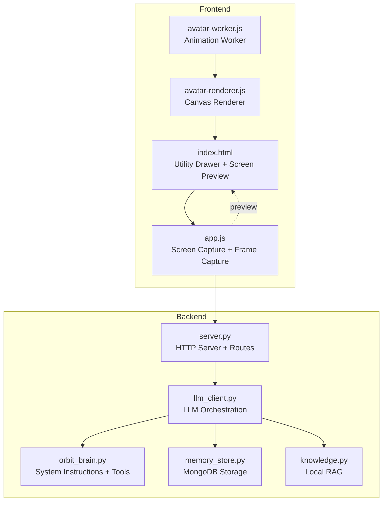
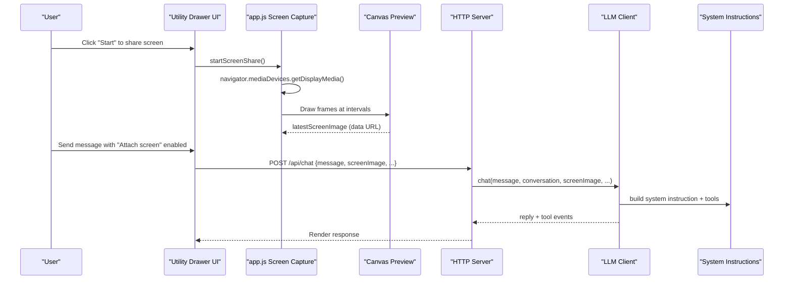
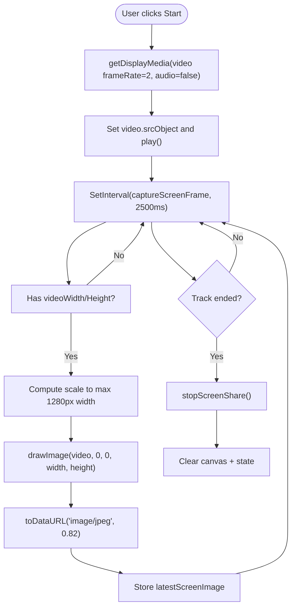
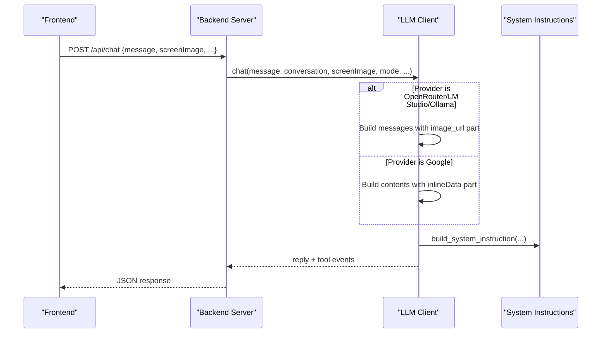
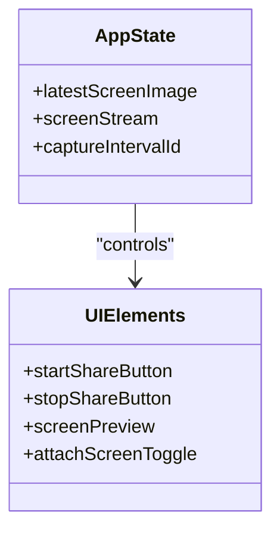
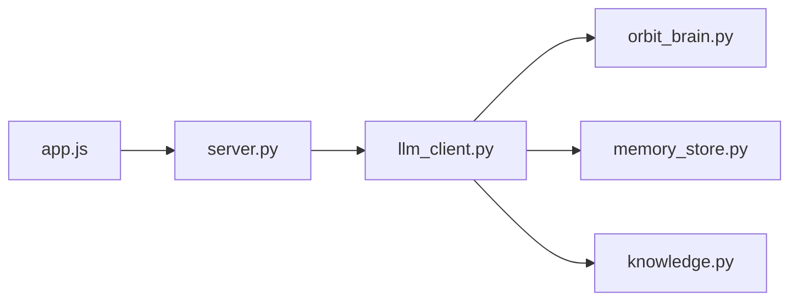

# Screen Sharing and Visual Assistance

<cite>
**Referenced Files in This Document**
- [README.md](file://README.md)
- [index.html](file://frontend/index.html)
- [app.js](file://frontend/scripts/app.js)
- [avatar-worker.js](file://frontend/scripts/avatar-worker.js)
- [avatar-renderer.js](file://frontend/scripts/avatar-renderer.js)
- [server.py](file://backend/server.py)
- [llm_client.py](file://backend/api_clients/llm_client.py)
- [orbit_brain.py](file://backend/core/orbit_brain.py)
- [memory_store.py](file://backend/core/memory_store.py)
- [knowledge.py](file://backend/tools/knowledge.py)
</cite>

## Table of Contents
1. [Introduction](#introduction)
2. [Project Structure](#project-structure)
3. [Core Components](#core-components)
4. [Architecture Overview](#architecture-overview)
5. [Detailed Component Analysis](#detailed-component-analysis)
6. [Dependency Analysis](#dependency-analysis)
7. [Performance Considerations](#performance-considerations)
8. [Security and Privacy](#security-and-privacy)
9. [Troubleshooting Guide](#troubleshooting-guide)
10. [Conclusion](#conclusion)

## Introduction
This document explains the screen sharing and visual assistance capabilities of the Orbit Virtual Assistant. It covers how the browser captures display media, how images are processed and transmitted, how the backend integrates visual context into AI responses, and how the system maintains security and privacy. Practical guidance is included for enabling screen sharing, handling shared content, incorporating visual context into AI responses, browser compatibility, performance optimization, and troubleshooting common issues.

## Project Structure
The screen sharing feature spans the frontend and backend:
- Frontend: Media capture, preview rendering, periodic frame capture, and transmission of the latest screen image to the backend.
- Backend: Accepts the screen image payload, augments the conversation with visual context, and routes tool calls accordingly.

**Diagram sources**
- [index.html:225-236](file://frontend/index.html#L225-L236)
- [app.js:1655-1712](file://frontend/scripts/app.js#L1655-L1712)
- [avatar-worker.js:1-48](file://frontend/scripts/avatar-worker.js#L1-L48)
- [avatar-renderer.js:1-106](file://frontend/scripts/avatar-renderer.js#L1-L106)
- [server.py:276-320](file://backend/server.py#L276-L320)
- [llm_client.py:47-78](file://backend/api_clients/llm_client.py#L47-L78)
- [orbit_brain.py:302-356](file://backend/core/orbit_brain.py#L302-L356)
- [memory_store.py:67-117](file://backend/core/memory_store.py#L67-L117)
- [knowledge.py:88-140](file://backend/tools/knowledge.py#L88-L140)

**Section sources**
- [README.md:38-41](file://README.md#L38-L41)
- [index.html:225-236](file://frontend/index.html#L225-L236)
- [app.js:1655-1712](file://frontend/scripts/app.js#L1655-L1712)
- [server.py:276-320](file://backend/server.py#L276-L320)

## Core Components
- Frontend screen capture and preview:
  - Uses the browser's display media API to capture the screen.
  - Renders a live preview in a hidden video element and periodically draws frames to a canvas.
  - Stores the latest JPEG image as a data URL in application state for transmission.
- Backend integration:
  - Accepts chat requests with an optional screenImage payload.
  - Builds system instructions and tool declarations, including visual context when provided.
  - Sends the combined multimodal message to the selected LLM provider.

**Section sources**
- [index.html:225-236](file://frontend/index.html#L225-L236)
- [app.js:1655-1712](file://frontend/scripts/app.js#L1655-L1712)
- [server.py:295-307](file://backend/server.py#L295-L307)
- [llm_client.py:98-102](file://backend/api_clients/llm_client.py#L98-L102)

## Architecture Overview
The screen sharing workflow connects the browser's media pipeline to the backend's multimodal LLM orchestration.

**Diagram sources**
- [app.js:1655-1712](file://frontend/scripts/app.js#L1655-L1712)
- [server.py:295-320](file://backend/server.py#L295-L320)
- [llm_client.py:98-102](file://backend/api_clients/llm_client.py#L98-L102)
- [orbit_brain.py:302-356](file://backend/core/orbit_brain.py#L302-L356)

## Detailed Component Analysis

### Frontend Screen Capture Pipeline
- Display media acquisition:
  - Initiates screen capture with a modest frame rate and no audio.
  - Attaches the stream to a hidden video element and starts playback.
- Periodic frame capture:
  - Draws the video frame to a canvas at a fixed interval.
  - Resizes to a maximum width while preserving aspect ratio.
  - Converts the canvas to a JPEG data URL and stores it in application state.
- Preview and lifecycle:
  - Clears the preview canvas when stopping.
  - Stops tracks and clears state when the source track ends.

**Diagram sources**
- [app.js:1655-1712](file://frontend/scripts/app.js#L1655-L1712)

**Section sources**
- [index.html:331-331](file://frontend/index.html#L331-L331)
- [app.js:1655-1712](file://frontend/scripts/app.js#L1655-L1712)

### Backend Integration and Multimodal Prompting
- Request handling:
  - The chat endpoint accepts a screenImage field alongside the message and conversation.
- LLM client logic:
  - For OpenRouter/LM Studio/Ollama, constructs a user content array containing both text and image_url parts.
  - For Google, builds a contents array with inlineData for the image and text parts.
- System instructions:
  - The system prompt explicitly instructs the model to describe what it sees from the screen image and to indicate uncertainty when appropriate.
  - Includes explicit guidance that the model cannot control the device and should only advise based on the shared screen.

**Diagram sources**
- [server.py:295-320](file://backend/server.py#L295-L320)
- [llm_client.py:98-102](file://backend/api_clients/llm_client.py#L98-L102)
- [llm_client.py:274-291](file://backend/api_clients/llm_client.py#L274-L291)
- [orbit_brain.py:14-32](file://backend/core/orbit_brain.py#L14-L32)

**Section sources**
- [server.py:295-320](file://backend/server.py#L295-L320)
- [llm_client.py:98-102](file://backend/api_clients/llm_client.py#L98-L102)
- [llm_client.py:274-291](file://backend/api_clients/llm_client.py#L274-L291)
- [orbit_brain.py:14-32](file://backend/core/orbit_brain.py#L14-L32)

### Screen-Aware Conversation Context
- UI integration:
  - The utility drawer exposes a "Start" and "Stop" button for screen sharing and a preview canvas.
  - A checkbox controls whether the latest screen image is attached to outgoing messages.
- Behavior:
  - When enabled, the latest screen image is included in the chat payload.
  - Buttons that require visual context show a hint indicating the need for screen sharing.

**Diagram sources**
- [app.js:51-85](file://frontend/scripts/app.js#L51-L85)
- [index.html:225-236](file://frontend/index.html#L225-L236)

**Section sources**
- [index.html:225-236](file://frontend/index.html#L225-L236)
- [app.js:932-933](file://frontend/scripts/app.js#L932-L933)

### Visual Assistance in AI Responses
- System instructions emphasize:
  - Describing only what is reasonably inferred from the image.
  - Indicating uncertainty when appropriate.
  - Clarifying that the model cannot control the device.
- Tool availability remains unchanged; visual context enhances the LLM's understanding without altering tool capabilities.

**Section sources**
- [orbit_brain.py:14-32](file://backend/core/orbit_brain.py#L14-L32)
- [llm_client.py:98-102](file://backend/api_clients/llm_client.py#L98-L102)

## Dependency Analysis
- Frontend dependencies:
  - app.js depends on the browser's mediaDevices API and canvas rendering.
  - The avatar worker/renderer are separate concerns and do not impact screen capture.
- Backend dependencies:
  - server.py delegates chat processing to llm_client.py.
  - llm_client.py relies on orbit_brain.py for system instructions and tool declarations.
  - memory_store.py persists session data and attachments; knowledge.py enables local RAG that complements visual context.

**Diagram sources**
- [app.js:992-1008](file://frontend/scripts/app.js#L992-L1008)
- [server.py:295-320](file://backend/server.py#L295-L320)
- [llm_client.py:38-46](file://backend/api_clients/llm_client.py#L38-L46)
- [orbit_brain.py:14-32](file://backend/core/orbit_brain.py#L14-L32)
- [memory_store.py:67-117](file://backend/core/memory_store.py#L67-L117)
- [knowledge.py:88-140](file://backend/tools/knowledge.py#L88-L140)

**Section sources**
- [server.py:295-320](file://backend/server.py#L295-L320)
- [llm_client.py:38-46](file://backend/api_clients/llm_client.py#L38-L46)
- [orbit_brain.py:302-356](file://backend/core/orbit_brain.py#L302-L356)
- [memory_store.py:67-117](file://backend/core/memory_store.py#L67-L117)
- [knowledge.py:88-140](file://backend/tools/knowledge.py#L88-L140)

## Performance Considerations
- Frame capture cadence:
  - Captures frames every 2.5 seconds with a modest frame rate to balance responsiveness and bandwidth.
- Canvas scaling:
  - Scales captured frames to a maximum width of 1280 pixels while preserving aspect ratio to reduce payload size.
- JPEG quality:
  - Uses a moderate quality setting for JPEG encoding to further reduce payload size.
- Backend payload handling:
  - The LLM client expects a data URL with a comma separator; ensure the payload is properly formatted before sending.

[No sources needed since this section provides general guidance]

## Security and Privacy
- Consent and control:
  - The browser initiates screen capture via the display media API; the model cannot control the device.
  - The UI explicitly communicates that the assistant cannot control the laptop.
- Data handling:
  - The latest screen image is stored in memory as a data URL and transmitted only when the user sends a message with screen sharing enabled.
  - No permanent storage of screen images occurs; the image is cleared when stopping screen sharing.
- Privacy controls:
  - Users can disable screen sharing by unchecking the "Attach screen" toggle.
  - The system does not persist screen images; clearing state stops sharing.

**Section sources**
- [index.html:234-234](file://frontend/index.html#L234-L234)
- [app.js:1682-1697](file://frontend/scripts/app.js#L1682-L1697)
- [llm_client.py:98-102](file://backend/api_clients/llm_client.py#L98-L102)
- [orbit_brain.py:21-23](file://backend/core/orbit_brain.py#L21-L23)

## Troubleshooting Guide
- Screen sharing does not start:
  - Ensure the browser supports the display media API and the page is served over HTTPS.
  - Verify that the user grants permission when prompted.
  - Check that the "Start" button is clicked and that the video element begins playback.
- No image appears in chat:
  - Confirm that the "Attach screen" toggle is enabled when sending a message.
  - Ensure the capture interval has produced a frame (check the preview canvas).
- Frequent lag or high CPU usage:
  - Lower the capture interval or reduce the maximum canvas width.
  - Disable screen sharing when not needed.
- Backend rejects the request:
  - Verify that the screenImage payload is a valid data URL with a comma separator.
  - Confirm that the API endpoint receives the payload and that the LLM client processes it correctly.

**Section sources**
- [app.js:1655-1680](file://frontend/scripts/app.js#L1655-L1680)
- [app.js:1699-1712](file://frontend/scripts/app.js#L1699-L1712)
- [server.py:295-320](file://backend/server.py#L295-L320)
- [llm_client.py:98-102](file://backend/api_clients/llm_client.py#L98-L102)

## Conclusion
The screen sharing and visual assistance features integrate seamlessly with the Orbit Virtual Assistant. The frontend captures and previews screen content efficiently, while the backend incorporates visual context into multimodal LLM responses. Security and privacy are maintained through user consent, temporary in-memory storage, and explicit system instructions. With the provided guidance, users can enable screen sharing, incorporate visual context into AI responses, and troubleshoot common issues effectively.